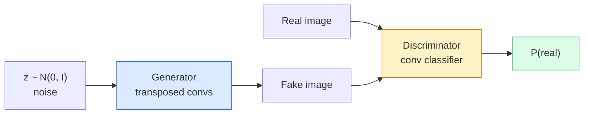
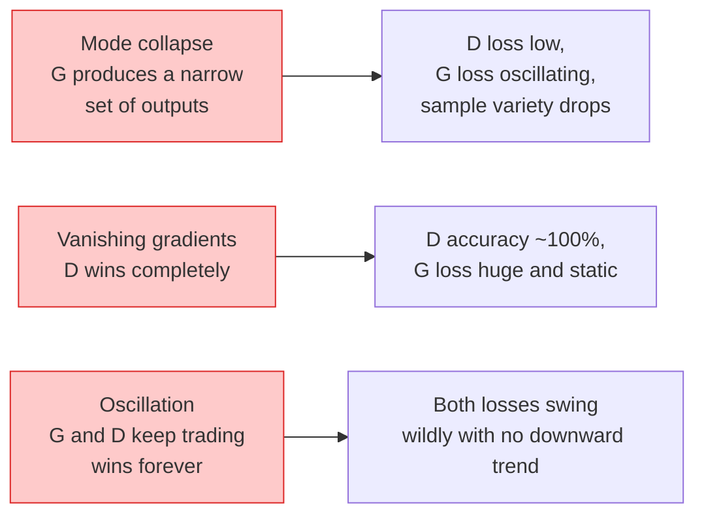

# 影像生成 —— GAN

> 一個 GAN 就是兩個神經網路在玩一場規則固定的賽局。一個負責畫，一個負責挑毛病。它們一起變強，直到畫作騙過那個評審。

**類型：** 實作
**程式語言：** Python
**先修單元：** 階段 4 · 03（CNN）、階段 3 · 06（最佳化器）、階段 3 · 07（正則化）
**時間：** 約 75 分鐘

## 學習目標

- 說明生成器與判別器之間的極小極大賽局，以及為什麼它的均衡點對應到 p_model = p_data
- 在 PyTorch 裡實作一個 DCGAN，用不到 60 行讓它生成看得懂的 32x32 合成影像
- 用三個標準手法穩定 GAN 訓練：非飽和損失、譜正規化、TTUR（雙時間尺度更新規則）
- 讀訓練曲線，分辨健康的收斂、模式崩潰、來回震盪，以及判別器完全獲勝這幾種情況

## 問題所在

分類是教網路把影像映射到標籤。生成把問題反轉過來：取樣出看起來像是同一個分布產生的新影像。這裡沒有一個「正確」的輸出可以拿來對照差異；只有一個你想模仿的分布。

標準的損失函式（MSE、交叉熵）沒辦法衡量「這個樣本是不是來自真實分布」。把逐像素誤差最小化，得到的是模糊的平均值，不是逼真的樣本。突破口在於把損失本身學出來：訓練第二個網路，它的工作就是分辨真假，再用它的判斷去推動生成器。

GAN（Goodfellow 等人，2014）定義了這個框架。到了 2018 年，StyleGAN 已經能產出跟照片分不出來的 1024x1024 人臉。之後擴散模型在品質與可控性上奪走了王座，但每一個讓擴散模型變得實用的手法——正規化的選擇、潛在空間、特徵損失——最早都是在 GAN 上被搞懂的。

## 核心概念

### 兩個網路



**生成器** G 吃一個雜訊向量 `z`，輸出一張影像。**判別器** D 吃一張影像，輸出單一純量：這張影像是真的機率。

### 這場賽局

G 想讓 D 判斷錯誤。D 想判斷正確。形式化寫下來：

```
min_G max_D  E_x[log D(x)] + E_z[log(1 - D(G(z)))]
```

從右往左讀：D 在真實影像（`log D(real)`）和假影像（`log (1 - D(fake))`）上都要把準確率最大化。G 則要把 D 在假影像上的準確率最小化——它希望 `D(G(z))` 高。

Goodfellow 證明了這個極小極大存在一個全域均衡：`p_G = p_data`、D 在任何地方都輸出 0.5，而生成分布與真實分布之間的 Jensen-Shannon 散度為零。難的地方是怎麼走到那裡。

### 非飽和損失

上面那個形式在數值上不穩定。訓練初期每一張假影像的 `D(G(z))` 都接近零，所以 `log(1 - D(G(z)))` 對 G 的梯度會消失。解法：把 G 的損失翻過來。

```
L_D = -E_x[log D(x)] - E_z[log(1 - D(G(z)))]
L_G = -E_z[log D(G(z))]                          # non-saturating
```

現在當 `D(G(z))` 接近零時，G 的損失很大，梯度也帶有資訊。每一個現代 GAN 都用這個變體來訓練。

### DCGAN 架構守則

Radford、Metz、Chintala（2015）把好幾年的失敗實驗蒸餾成五條讓 GAN 訓練穩定的守則：

1. 用帶 stride 的卷積取代池化（兩個網路都一樣）。
2. 生成器與判別器都用批次正規化，但 G 的輸出與 D 的輸入除外。
3. 在較深的架構裡拿掉全連接層。
4. G 除輸出層外全部用 ReLU（輸出用 tanh，落在 [-1, 1]）。
5. D 每一層都用 LeakyReLU（negative_slope=0.2）。

每一個現代基於卷積的 GAN（StyleGAN、BigGAN、GigaGAN）到今天都還是從這些守則出發，再一次換掉其中一個零件。

### 失敗模式與它們的徵狀



- **模式崩潰**：G 找到一張能騙過 D 的影像，然後只產出那一張。解法：加上 minibatch discrimination、譜正規化，或用標籤做條件化。
- **判別器獲勝**：D 太快變得太強，G 的梯度消失。解法：把 D 縮小、降低 D 的學習率，或對真實標籤做標籤平滑。
- **來回震盪**：兩個網路互有勝負，卻始終沒有靠近均衡。解法：TTUR（D 的學習速度比 G 快 2 到 4 倍），或改用 Wasserstein 損失。

### 評估

GAN 沒有正確答案可比對，那你怎麼知道它有在運作？

- **看樣本** —— 每個 epoch 結束就看 64 個樣本。這件事不能省。
- **FID（Fréchet Inception Distance）** —— 真實集合與生成集合的 Inception-v3 特徵分布之間的距離。越低越好。社群的標準評估指標。
- **Inception Score** —— 比較老、比較脆；優先用 FID。
- **生成模型的 Precision/Recall** —— 把品質（precision）與涵蓋度（recall）分開衡量。比單看 FID 更有資訊量。

對一個小規模的合成資料實驗來說，看樣本就夠了。

## 動手實作

### 步驟 1：生成器

一個小型 DCGAN 生成器，吃 64 維雜訊，產出一張 32x32 的影像。

```python
import torch
import torch.nn as nn

class Generator(nn.Module):
    def __init__(self, z_dim=64, img_channels=3, feat=64):
        super().__init__()
        self.net = nn.Sequential(
            nn.ConvTranspose2d(z_dim, feat * 4, kernel_size=4, stride=1, padding=0, bias=False),
            nn.BatchNorm2d(feat * 4),
            nn.ReLU(inplace=True),
            nn.ConvTranspose2d(feat * 4, feat * 2, kernel_size=4, stride=2, padding=1, bias=False),
            nn.BatchNorm2d(feat * 2),
            nn.ReLU(inplace=True),
            nn.ConvTranspose2d(feat * 2, feat, kernel_size=4, stride=2, padding=1, bias=False),
            nn.BatchNorm2d(feat),
            nn.ReLU(inplace=True),
            nn.ConvTranspose2d(feat, img_channels, kernel_size=4, stride=2, padding=1, bias=False),
            nn.Tanh(),
        )

    def forward(self, z):
        return self.net(z.view(z.size(0), -1, 1, 1))
```

四個轉置卷積，每個都是 `kernel_size=4, stride=2, padding=1`，所以空間尺寸會乾淨地翻倍。輸出經過 tanh，激活值落在 [-1, 1]。

### 步驟 2：判別器

生成器的鏡像。LeakyReLU、帶 stride 的卷積，最後吐出一個純量 logit。

```python
class Discriminator(nn.Module):
    def __init__(self, img_channels=3, feat=64):
        super().__init__()
        self.net = nn.Sequential(
            nn.Conv2d(img_channels, feat, kernel_size=4, stride=2, padding=1),
            nn.LeakyReLU(0.2, inplace=True),
            nn.Conv2d(feat, feat * 2, kernel_size=4, stride=2, padding=1, bias=False),
            nn.BatchNorm2d(feat * 2),
            nn.LeakyReLU(0.2, inplace=True),
            nn.Conv2d(feat * 2, feat * 4, kernel_size=4, stride=2, padding=1, bias=False),
            nn.BatchNorm2d(feat * 4),
            nn.LeakyReLU(0.2, inplace=True),
            nn.Conv2d(feat * 4, 1, kernel_size=4, stride=1, padding=0),
        )

    def forward(self, x):
        return self.net(x).view(-1)
```

最後一個卷積把 `4x4` 的特徵圖收成 `1x1`。每張影像輸出一個純量；sigmoid 只在算損失的時候才套上去。

### 步驟 3：訓練步驟

交替進行：每個 batch 先更新 D 一次，再更新 G 一次。

```python
import torch.nn.functional as F

def train_step(G, D, real, z, opt_g, opt_d, device):
    real = real.to(device)
    bs = real.size(0)

    # D step
    opt_d.zero_grad()
    d_real = D(real)
    d_fake = D(G(z).detach())
    loss_d = (F.binary_cross_entropy_with_logits(d_real, torch.ones_like(d_real))
              + F.binary_cross_entropy_with_logits(d_fake, torch.zeros_like(d_fake)))
    loss_d.backward()
    opt_d.step()

    # G step
    opt_g.zero_grad()
    d_fake = D(G(z))
    loss_g = F.binary_cross_entropy_with_logits(d_fake, torch.ones_like(d_fake))
    loss_g.backward()
    opt_g.step()

    return loss_d.item(), loss_g.item()
```

D 那一步裡的 `G(z).detach()` 很關鍵：更新 D 的時候我們不希望梯度流進 G。忘掉這件事是經典的新手 bug。

### 步驟 4：在合成形狀上跑完整訓練迴圈

```python
from torch.utils.data import DataLoader, TensorDataset
import numpy as np

def synthetic_images(num=2000, size=32, seed=0):
    rng = np.random.default_rng(seed)
    imgs = np.zeros((num, 3, size, size), dtype=np.float32) - 1.0
    for i in range(num):
        r = rng.uniform(6, 12)
        cx, cy = rng.uniform(r, size - r, size=2)
        yy, xx = np.meshgrid(np.arange(size), np.arange(size), indexing="ij")
        mask = (xx - cx) ** 2 + (yy - cy) ** 2 < r ** 2
        color = rng.uniform(-0.5, 1.0, size=3)
        for c in range(3):
            imgs[i, c][mask] = color[c]
    return torch.from_numpy(imgs)

device = "cuda" if torch.cuda.is_available() else "cpu"
data = synthetic_images()
loader = DataLoader(TensorDataset(data), batch_size=64, shuffle=True)

G = Generator(z_dim=64, img_channels=3, feat=32).to(device)
D = Discriminator(img_channels=3, feat=32).to(device)
opt_g = torch.optim.Adam(G.parameters(), lr=2e-4, betas=(0.5, 0.999))
opt_d = torch.optim.Adam(D.parameters(), lr=2e-4, betas=(0.5, 0.999))

for epoch in range(10):
    for (batch,) in loader:
        z = torch.randn(batch.size(0), 64, device=device)
        ld, lg = train_step(G, D, batch, z, opt_g, opt_d, device)
    print(f"epoch {epoch}  D {ld:.3f}  G {lg:.3f}")
```

`Adam(lr=2e-4, betas=(0.5, 0.999))` 是 DCGAN 的預設值——beta1 壓低是為了不讓動量項把這場對抗賽局穩定得過頭。

### 步驟 5：取樣

```python
@torch.no_grad()
def sample(G, n=16, z_dim=64, device="cpu"):
    G.eval()
    z = torch.randn(n, z_dim, device=device)
    imgs = G(z)
    imgs = (imgs + 1) / 2
    return imgs.clamp(0, 1)
```

取樣前一定要切到 eval 模式。對 DCGAN 來說這件事有差，因為這樣用的是批次正規化的移動統計量，而不是當前 batch 的統計量。

### 步驟 6：譜正規化

判別器裡可以直接替換掉 BN 的做法，保證整個網路是 1-Lipschitz。能修掉大部分「D 贏得太狠」的失敗。

```python
from torch.nn.utils import spectral_norm

def build_sn_discriminator(img_channels=3, feat=64):
    return nn.Sequential(
        spectral_norm(nn.Conv2d(img_channels, feat, 4, 2, 1)),
        nn.LeakyReLU(0.2, inplace=True),
        spectral_norm(nn.Conv2d(feat, feat * 2, 4, 2, 1)),
        nn.LeakyReLU(0.2, inplace=True),
        spectral_norm(nn.Conv2d(feat * 2, feat * 4, 4, 2, 1)),
        nn.LeakyReLU(0.2, inplace=True),
        spectral_norm(nn.Conv2d(feat * 4, 1, 4, 1, 0)),
    )
```

把 `Discriminator` 換成 `build_sn_discriminator()`，你常常就不需要 TTUR 那招了。譜正規化是你能套上去的、最省事的單一穩健性升級。

## 框架應用

要做認真的生成，就用預訓練權重，或者改用擴散模型。兩個標準函式庫：

- `torch_fidelity` 幫你的生成器算 FID / IS，不用自己寫評估程式碼。
- `pytorch-gan-zoo`（已成舊物）與 `StudioGAN` 提供經過測試的 DCGAN、WGAN-GP、SN-GAN、StyleGAN 與 BigGAN 實作。

在 2026 年，GAN 在這些場景仍然是最好的選擇：即時影像生成（延遲低於 10 ms）、風格轉換、需要精確控制的影像到影像轉換（Pix2Pix、CycleGAN）。擴散模型則在照片級真實感與文字條件化上勝出。

## 產出交付

本單元會產出：

- `outputs/prompt-gan-training-triage.md` —— 一個提示詞，讀一段訓練曲線的描述，判斷是哪種失敗模式（模式崩潰、D 獲勝、來回震盪），並給出唯一建議的修法。
- `outputs/skill-dcgan-scaffold.md` —— 一項技能，依 `z_dim`、目標 `image_size` 與 `num_channels` 寫出一份 DCGAN 骨架，含訓練迴圈與樣本存檔器。

## 練習

1. **（簡單）** 用上面的 DCGAN 訓練那份合成圓形資料集，每個 epoch 結束存下一張 16 個樣本的網格圖。生成的圓形大約在第幾個 epoch 開始明顯變圓？
2. **（中等）** 把判別器的批次正規化換成譜正規化。兩個版本並排訓練。哪一個收斂比較快？哪一個在三個隨機種子之間的變異比較小？
3. **（困難）** 實作一個條件式 DCGAN：把類別標籤同時餵進 G 和 D（在 G 裡把 one-hot 串接到雜訊上，在 D 裡串接一個類別嵌入通道）。用第 7 單元那份「圓形 vs 方形」的合成資料集訓練，然後用指定的標籤取樣，證明類別條件化真的有效。

## 關鍵術語

| 術語 | 大家怎麼說 | 實際上是什麼 |
|------|----------------|----------------------|
| 生成器（G） | 「負責畫東西的網路」 | 把雜訊映射成影像；訓練目標是騙過判別器 |
| 判別器（D） | 「評審」 | 二元分類器；訓練目標是分辨真實影像與生成影像 |
| 極小極大 | 「那場賽局」 | 對抗損失對 G 取極小、對 D 取極大；均衡點是 p_G = p_data |
| 非飽和損失 | 「數值上正常的那個版本」 | G 的損失用 -log(D(G(z))) 而不是 log(1 - D(G(z)))，避免訓練初期梯度消失 |
| 模式崩潰 | 「生成器只會生一種東西」 | G 只產出資料分布的一小部分；用 SN、minibatch discrimination 或更大的 batch 來修 |
| TTUR | 「兩個學習率」 | D 學得比 G 快，通常快 2 到 4 倍；能穩定訓練 |
| 譜正規化 | 「1-Lipschitz 的層」 | 一種權重正規化，把每一層的 Lipschitz 常數限制住；不讓 D 變得任意陡峭 |
| FID | 「Fréchet Inception Distance」 | 真實集合與生成集合的 Inception-v3 特徵分布之間的距離；標準的評估指標 |

## 延伸閱讀

- [Generative Adversarial Networks (Goodfellow et al., 2014)](https://arxiv.org/abs/1406.2661) —— 開啟一切的那篇論文
- [DCGAN (Radford, Metz, Chintala, 2015)](https://arxiv.org/abs/1511.06434) —— 讓 GAN 訓練得起來的那套架構守則
- [Spectral Normalization for GANs (Miyato et al., 2018)](https://arxiv.org/abs/1802.05957) —— 單一最有用的穩定化手法
- [StyleGAN3 (Karras et al., 2021)](https://arxiv.org/abs/2106.12423) —— 最先進的 GAN；讀起來像過去十年所有手法的精選輯
