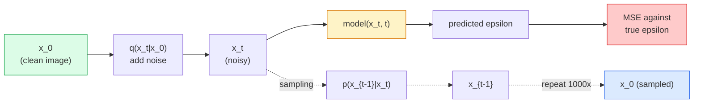

# 影像生成 —— 擴散模型

> 擴散模型學的是去噪。訓練它從一張帶雜訊的圖片裡移除一點點雜訊，再把這件事倒著重複一千次，你就有了一個影像生成器。

**類型：** 實作
**程式語言：** Python
**先修單元：** 階段 4 · 單元 07（U-Net）、階段 1 · 單元 06（機率）、階段 3 · 單元 06（最佳化器）
**時間：** 約 75 分鐘

## 學習目標

- 推導前向加噪過程 `x_0 -> x_1 -> ... -> x_T`，並說明為什麼閉合形式的 `q(x_t | x_0)` 對任意 t 都成立
- 實作一個 DDPM 風格的訓練目標，去迴歸每一步加進去的雜訊，再實作一個從純雜訊走回圖片的取樣器
- 打造一個帶時間條件的 U-Net（小到可以在 CPU 上訓練），讓它能為任意時間步預測雜訊
- 說明 DDPM 與 DDIM 取樣的差別，以及各自適合什麼場合（單元 23 會深入談 flow matching 與 rectified flow）

## 問題所在

GAN 是一發到位的生成：雜訊進去、圖片出來，一次前向傳播。它們快，但難訓練。擴散模型是迭代式的生成：從純雜訊出發，一小步一小步去噪，圖片就浮現出來。它們慢，但好訓練。過去五年，後面那個性質壓倒性地勝出：任何小團隊都能訓練一個擴散模型並拿到還不錯的樣本；而 GAN 訓練是一門要靠幾年失敗經驗磨出來的手藝。

除了訓練穩定性之外，擴散的迭代結構才是解鎖現代影像生成一切能力的關鍵：文字條件、修補（inpainting）、影像編輯、超解析度、可控風格。取樣迴圈的每一步，都是一個可以注入新約束的地方。正是這個掛勾，讓 Stable Diffusion、Imagen、DALL-E 3、Midjourney，以及你會用到的每一個可控影像模型，全都以擴散為基礎。

這個單元打造最精簡的 DDPM：前向加噪、反向去噪、訓練迴圈。下一個單元（Stable Diffusion）會把它接進一套生產系統，配上 VAE、文字編碼器與無分類器引導。

## 核心概念

### 前向過程

取一張圖片 `x_0`。加一點點高斯雜訊得到 `x_1`。再加一點點得到 `x_2`。持續 T 步，直到 `x_T` 幾乎跟純高斯雜訊分不出來。

```
q(x_t | x_{t-1}) = N(x_t; sqrt(1 - beta_t) * x_{t-1},  beta_t * I)
```

`beta_t` 是一個很小的變異數排程，典型做法是在 T=1000 步之間從 0.0001 線性遞增到 0.02。每一步都稍微把訊號縮小一點，並注入新的雜訊。

### 閉合形式的一步跳躍

一步一步加雜訊是一條馬可夫鏈，但數學會摺疊起來：你可以一步就從 `x_0` 直接取樣出 `x_t`。

```
Define alpha_t = 1 - beta_t
Define alpha_bar_t = prod_{s=1..t} alpha_s

Then:
  q(x_t | x_0) = N(x_t; sqrt(alpha_bar_t) * x_0,  (1 - alpha_bar_t) * I)

Equivalently:
  x_t = sqrt(alpha_bar_t) * x_0 + sqrt(1 - alpha_bar_t) * epsilon
  where epsilon ~ N(0, I)
```

這一條式子就是擴散之所以實用的全部原因。訓練時你挑一個隨機的 `t`，直接從 `x_0` 取樣出 `x_t`，然後一步完成訓練 —— 完全不需要模擬整條馬可夫鏈。

### 反向過程

前向過程是固定的。反向過程 `p(x_{t-1} | x_t)` 才是神經網路要學的東西。擴散模型不直接預測 `x_{t-1}`；它們預測第 t 步加進去的雜訊 `epsilon`，再由數學推導出 `x_{t-1}`。



### 訓練損失

每一個訓練步驟：

1. 取樣一張真實圖片 `x_0`。
2. 從 [1, T] 之間均勻取樣一個時間步 `t`。
3. 取樣雜訊 `epsilon ~ N(0, I)`。
4. 計算 `x_t = sqrt(alpha_bar_t) * x_0 + sqrt(1 - alpha_bar_t) * epsilon`。
5. 用網路預測 `epsilon_theta(x_t, t)`。
6. 最小化 `|| epsilon - epsilon_theta(x_t, t) ||^2`。

就這樣。神經網路學的是在任意時間步預測雜訊。損失是 MSE。沒有對抗遊戲，沒有崩潰，沒有震盪。

### 取樣器（DDPM）

要生成圖片：從 `x_T ~ N(0, I)` 出發，一步一步往回走。

```
for t = T, T-1, ..., 1:
    eps = model(x_t, t)
    x_{t-1} = (1 / sqrt(alpha_t)) * (x_t - (beta_t / sqrt(1 - alpha_bar_t)) * eps) + sqrt(beta_t) * z
    where z ~ N(0, I) if t > 1, else 0
return x_0
```

關鍵在於：反向的條件分布一般來說沒有閉合形式，但對這個特定的高斯前向過程而言它有。那些看起來很醜的係數，就是貝氏定理給你的結果。

### 為什麼是 1000 步

前向的雜訊排程是這樣挑的：讓每一步加入的雜訊剛好足夠少，使反向那一步近似是高斯的。步數太少，反向那一步就離高斯很遠，網路沒辦法好好建模它。步數太多，取樣就變貴而收益遞減。T=1000 搭配線性排程就是 DDPM 的預設值。

### DDIM：取樣快 20 倍

訓練不變，變的是取樣。DDIM（Song et al., 2020）定義了一個決定性的反向過程，可以跳過時間步而不必重新訓練。用 DDIM 取樣 50 步，品質就接近 DDPM 的 1000 步。每一套生產系統用的都是 DDIM 或更快的變體（DPM-Solver、Euler ancestral）。

### 時間條件

網路 `epsilon_theta(x_t, t)` 需要知道自己正在為哪一個時間步去噪。現代擴散模型透過正弦時間嵌入（跟 transformer 裡的位置編碼是同一個想法）把 `t` 注入進去，並在 U-Net 的每一層都加到特徵圖上。

```
t_embedding = sinusoidal(t)
feature_map += MLP(t_embedding)
```

沒有時間條件的話，網路就得從圖片本身去猜雜訊的強度 —— 這行得通，但樣本效率差很多。

## 動手實作

### 步驟 1：雜訊排程

```python
import torch

def linear_beta_schedule(T=1000, beta_start=1e-4, beta_end=2e-2):
    return torch.linspace(beta_start, beta_end, T)


def precompute_schedule(betas):
    alphas = 1.0 - betas
    alphas_cumprod = torch.cumprod(alphas, dim=0)
    return {
        "betas": betas,
        "alphas": alphas,
        "alphas_cumprod": alphas_cumprod,
        "sqrt_alphas_cumprod": torch.sqrt(alphas_cumprod),
        "sqrt_one_minus_alphas_cumprod": torch.sqrt(1.0 - alphas_cumprod),
        "sqrt_recip_alphas": torch.sqrt(1.0 / alphas),
    }

schedule = precompute_schedule(linear_beta_schedule(T=1000))
```

預先算好一次，訓練與取樣時再依索引取用。

### 步驟 2：前向擴散（q_sample）

```python
def q_sample(x0, t, noise, schedule):
    sqrt_a = schedule["sqrt_alphas_cumprod"][t].view(-1, 1, 1, 1)
    sqrt_one_minus_a = schedule["sqrt_one_minus_alphas_cumprod"][t].view(-1, 1, 1, 1)
    return sqrt_a * x0 + sqrt_one_minus_a * noise
```

一行搞定的閉合形式。`t` 是一批時間步，批次裡每張圖片對應一個。

### 步驟 3：一個迷你的時間條件 U-Net

```python
import torch.nn as nn
import torch.nn.functional as F
import math

def timestep_embedding(t, dim=64):
    half = dim // 2
    freqs = torch.exp(-math.log(10000) * torch.arange(half, device=t.device) / half)
    args = t[:, None].float() * freqs[None]
    emb = torch.cat([args.sin(), args.cos()], dim=-1)
    return emb


class TinyUNet(nn.Module):
    def __init__(self, img_channels=3, base=32, t_dim=64):
        super().__init__()
        self.t_mlp = nn.Sequential(
            nn.Linear(t_dim, base * 4),
            nn.SiLU(),
            nn.Linear(base * 4, base * 4),
        )
        self.t_dim = t_dim
        self.enc1 = nn.Conv2d(img_channels, base, 3, padding=1)
        self.enc2 = nn.Conv2d(base, base * 2, 4, stride=2, padding=1)
        self.mid = nn.Conv2d(base * 2, base * 2, 3, padding=1)
        self.dec1 = nn.ConvTranspose2d(base * 2, base, 4, stride=2, padding=1)
        self.dec2 = nn.Conv2d(base * 2, img_channels, 3, padding=1)
        self.time_proj = nn.Linear(base * 4, base * 2)

    def forward(self, x, t):
        t_emb = timestep_embedding(t, self.t_dim)
        t_emb = self.t_mlp(t_emb)
        t_proj = self.time_proj(t_emb)[:, :, None, None]

        h1 = F.silu(self.enc1(x))
        h2 = F.silu(self.enc2(h1)) + t_proj
        h3 = F.silu(self.mid(h2))
        d1 = F.silu(self.dec1(h3))
        d2 = torch.cat([d1, h1], dim=1)
        return self.dec2(d2)
```

兩層的 U-Net，時間條件注入在瓶頸處。要處理真實圖片就把深度與寬度放大。

### 步驟 4：訓練迴圈

```python
def train_step(model, x0, schedule, optimizer, device, T=1000):
    model.train()
    x0 = x0.to(device)
    bs = x0.size(0)
    t = torch.randint(0, T, (bs,), device=device)
    noise = torch.randn_like(x0)
    x_t = q_sample(x0, t, noise, schedule)
    pred = model(x_t, t)
    loss = F.mse_loss(pred, noise)
    optimizer.zero_grad()
    loss.backward()
    optimizer.step()
    return loss.item()
```

整個訓練迴圈就這樣。沒有 GAN 的博弈，沒有特製的損失，一次 MSE 呼叫。

### 步驟 5：取樣器（DDPM）

```python
@torch.no_grad()
def sample(model, schedule, shape, T=1000, device="cpu"):
    model.eval()
    x = torch.randn(shape, device=device)
    betas = schedule["betas"].to(device)
    sqrt_one_minus_a = schedule["sqrt_one_minus_alphas_cumprod"].to(device)
    sqrt_recip_alphas = schedule["sqrt_recip_alphas"].to(device)

    for t in reversed(range(T)):
        t_batch = torch.full((shape[0],), t, dtype=torch.long, device=device)
        eps = model(x, t_batch)
        coef = betas[t] / sqrt_one_minus_a[t]
        mean = sqrt_recip_alphas[t] * (x - coef * eps)
        if t > 0:
            x = mean + torch.sqrt(betas[t]) * torch.randn_like(x)
        else:
            x = mean
    return x
```

生成一批樣本要做 1000 次前向傳播。在真實的程式碼裡，你會把它換成 50 步的 DDIM 取樣器。

### 步驟 6：DDIM 取樣器（決定性，約快 20 倍）

```python
@torch.no_grad()
def sample_ddim(model, schedule, shape, steps=50, T=1000, device="cpu", eta=0.0):
    model.eval()
    x = torch.randn(shape, device=device)
    alphas_cumprod = schedule["alphas_cumprod"].to(device)

    ts = torch.linspace(T - 1, 0, steps + 1).long()
    for i in range(steps):
        t = ts[i]
        t_prev = ts[i + 1]
        t_batch = torch.full((shape[0],), t, dtype=torch.long, device=device)
        eps = model(x, t_batch)
        a_t = alphas_cumprod[t]
        a_prev = alphas_cumprod[t_prev] if t_prev >= 0 else torch.tensor(1.0, device=device)
        x0_pred = (x - torch.sqrt(1 - a_t) * eps) / torch.sqrt(a_t)
        sigma = eta * torch.sqrt((1 - a_prev) / (1 - a_t) * (1 - a_t / a_prev))
        dir_xt = torch.sqrt(1 - a_prev - sigma ** 2) * eps
        noise = sigma * torch.randn_like(x) if eta > 0 else 0
        x = torch.sqrt(a_prev) * x0_pred + dir_xt + noise
    return x
```

`eta=0` 是完全決定性的（同樣的雜訊輸入永遠得到同樣的輸出）。`eta=1` 則回到 DDPM。

## 框架應用

生產工作請用 `diffusers`：

```python
from diffusers import DDPMScheduler, UNet2DModel

unet = UNet2DModel(sample_size=32, in_channels=3, out_channels=3, layers_per_block=2)
scheduler = DDPMScheduler(num_train_timesteps=1000)
```

這個函式庫提供現成的排程器（DDPM、DDIM、DPM-Solver、Euler、Heun）、可設定的 U-Net、文字生圖與圖生圖的 pipeline，還有 LoRA 微調的輔助工具。

做研究的話，`k-diffusion`（Katherine Crowson）有最忠實的參考實作，以及最好的取樣變體。

## 產出交付

這個單元會產出：

- `outputs/prompt-diffusion-sampler-picker.md` —— 一個依品質目標、延遲預算與條件類型，在 DDPM / DDIM / DPM-Solver / Euler 之間挑選的提示詞。
- `outputs/skill-noise-schedule-designer.md` —— 一項技能，給定 T 與目標破壞程度後產生線性、餘弦或 sigmoid 的 beta 排程，並附上訊噪比隨時間變化的診斷圖。

## 練習

1. **（簡單）** 把前向過程視覺化：取一張圖片，畫出 `t in [0, 100, 250, 500, 750, 1000]` 時的 `x_t`。驗證 `x_1000` 看起來就像純高斯雜訊。
2. **（中等）** 在合成圓形資料集上訓練 TinyUNet 20 個 epoch，再取樣 16 個圓。比較 DDPM（1000 步）與 DDIM（50 步）的取樣 —— 從同一個雜訊種子出發，它們產生的圖片相似嗎？
3. **（困難）** 實作餘弦雜訊排程（Nichol & Dhariwal, 2021）：`alpha_bar_t = cos^2((t/T + s) / (1 + s) * pi / 2)`。用線性與餘弦排程訓練同一個模型，並展示在低步數下餘弦排程給出更好的樣本。

## 關鍵術語

| 術語 | 大家怎麼說 | 實際上是什麼 |
|------|----------------|----------------------|
| 前向過程 | 「隨時間加雜訊」 | 固定的馬可夫鏈，在 T 步內把圖片破壞成高斯雜訊 |
| 反向過程 | 「一步一步去噪」 | 學出來的分布，從雜訊一路走回圖片 |
| 雜訊預測 | 「預測那個雜訊」 | 訓練目標：`epsilon_theta(x_t, t)` 預測第 t 步加進去的雜訊 |
| beta 排程 | 「加多少雜訊」 | T 個小變異數構成的數列，決定每一步進入多少雜訊 |
| alpha_bar_t | 「累積保留係數」 | (1 - beta_s) 從頭到時間 t 的乘積；t 越大表示剩下的訊號越少 |
| DDPM 取樣器 | 「祖先式、隨機的」 | 從各自的條件高斯分布逐一取樣 x_{t-1}；1000 步 |
| DDIM 取樣器 | 「決定性、快」 | 把取樣改寫成一個決定性的 ODE；20 到 100 步就有相近品質 |
| 時間條件 | 「告訴模型現在是哪個 t」 | 把 t 的正弦嵌入注入 U-Net，讓它知道雜訊強度 |

## 延伸閱讀

- [Denoising Diffusion Probabilistic Models (Ho et al., 2020)](https://arxiv.org/abs/2006.11239) —— 讓擴散變得實用、並在 FID 上打敗 GAN 的那篇論文
- [Improved DDPM (Nichol & Dhariwal, 2021)](https://arxiv.org/abs/2102.09672) —— 餘弦排程與 v-parameterisation
- [DDIM (Song, Meng, Ermon, 2020)](https://arxiv.org/abs/2010.02502) —— 讓即時推論成為可能的決定性取樣器
- [Elucidating the Design Space of Diffusion (Karras et al., 2022)](https://arxiv.org/abs/2206.00364) —— 對每一個擴散設計選擇的統一觀點；目前最好的參考
