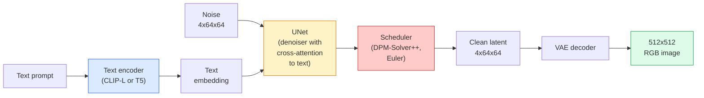

# Stable Diffusion —— 架構與微調

> Stable Diffusion 就是一個跑在預訓練 VAE 潛在空間裡的 DDPM：用交叉注意力接受文字條件控制，用快速的確定性 ODE 求解器取樣，再由無分類器引導掌舵。

**類型：** 學習 + 應用
**程式語言：** Python
**先修單元：** 階段 4 單元 10（擴散模型）、階段 7 單元 02（自注意力）
**時間：** 約 75 分鐘

## 學習目標

- 追出一條 Stable Diffusion 流程裡的五個零件：VAE、文字編碼器、U-Net、排程器、安全檢查器 —— 以及每一個究竟在做什麼
- 說明潛在擴散，以及為什麼在 4x64x64 的潛在空間（而不是 3x512x512 的影像）上訓練能把計算量降到 1/48 而不損失品質
- 用 `diffusers` 產生影像，並執行影像到影像、修補，以及由 ControlNet 引導的生成
- 用 LoRA 在一個小型自訂資料集上微調 Stable Diffusion，並在推論時載入該 LoRA 轉接器

## 問題所在

直接在 512x512 的 RGB 影像上訓練 DDPM 很貴。每一個訓練步都要對一個看到 3x512x512 = 786,432 個輸入值的 U-Net 做反向傳遞，而取樣要經過同一個 U-Net 50 次以上的前向傳播。要達到 Stable Diffusion 1.5（2022 年釋出）的品質水準，像素空間的擴散大約需要 256 個 GPU-月的訓練，在消費級 GPU 上每張圖要 10 到 30 秒。

讓開放權重的文字生圖真正可行的那個訣竅，就是**潛在擴散**（Rombach et al., CVPR 2022）。訓練一個 VAE，把 3x512x512 的影像映射成 4x64x64 的潛在張量再映射回來，然後在那個潛在空間裡做擴散。計算量下降 `(3*512*512)/(4*64*64) = 48x`。同一張 GPU 上，取樣時間從幾十秒掉到兩秒以內。

幾乎每一個現代影像生成模型 —— SDXL、SD3、FLUX、HunyuanDiT、Wan-Video —— 都是潛在擴散模型，差別只在自編碼器、去噪器（U-Net 或 DiT）和文字條件控制的變化。學會 Stable Diffusion，你就學會了那個範本。

## 核心概念

### 整條流程



- **VAE** —— 凍結的自編碼器。編碼器把影像變成潛在表示（img2img 與訓練會用到）。解碼器把潛在表示變回影像。
- **文字編碼器** —— CLIP 文字編碼器（SD 1.x/2.x）、CLIP-L + CLIP-G（SDXL），或 T5-XXL（SD3/FLUX）。輸出一串詞元嵌入。
- **U-Net** —— 去噪器。它在每一個解析度層級上都有交叉注意力層，從潛在表示去注意文字嵌入。
- **排程器** —— 取樣演算法（DDIM、Euler、DPM-Solver++）。負責挑 sigma，並把預測出的噪聲混回潛在表示。
- **安全檢查器** —— 選用的 NSFW／違法內容過濾器，作用在輸出影像上。

### 無分類器引導（CFG）

單純的文字條件控制學的是對每個提示詞 `c` 的 `epsilon_theta(x_t, t, c)`。CFG 則是拿同一個網路訓練，但有 10% 的時候把 `c` 丟掉（換成空的嵌入），於是得到一個同時能預測有條件與無條件噪聲的單一模型。推論時：

```
eps = eps_uncond + w * (eps_cond - eps_uncond)
```

`w` 是引導強度。`w=0` 是無條件，`w=1` 是單純的有條件，`w>1` 會把輸出往「更聽提示詞的話」推，代價是多樣性變差。SD 的預設值是 `w=7.5`。

CFG 是文字生圖之所以能做到生產級品質的原因。沒有它，提示詞只能微弱地帶偏輸出；有了它，提示詞說話最大聲。

### 潛在空間的幾何

VAE 那個 4 通道的潛在表示，不只是一張壓縮過的影像。它是一個流形：在上面做算術大致對應到語意層面的編輯（提示詞工程和插值都住在這裡），而擴散 U-Net 的整份建模預算也都花在這裡。把一個隨機的 4x64x64 潛在張量解碼，並不會得到一張看起來隨機的影像 —— 你會得到垃圾，因為只有潛在空間裡某個特定的子流形才會解碼成有效的影像。

由此有兩個結果：

1. **影像到影像（img2img）** = 把影像編碼成潛在表示、加上部分噪聲、跑去噪器、再解碼。影像結構之所以能保住，是因為編碼幾乎可逆；內容則依提示詞改變。
2. **修補（inpainting）** = 和 img2img 一樣，只是去噪器只更新被遮罩的區域；未被遮罩的區域維持在編碼後的潛在表示。

### U-Net 架構

SD 的 U-Net 就是單元 10 那個 TinyUNet 的放大版，多了三樣東西：

- **Transformer 區塊**，在每一個空間解析度上都有，內含自注意力 + 對文字嵌入的交叉注意力。
- **時間嵌入**，做法是在正弦編碼上接一個 MLP。
- **跳接**，連接編碼器與解碼器上解析度相同的層級。

SD 1.5 的總參數量約 8.6 億。SDXL 約 26 億。FLUX 約 120 億。參數量的暴增大部分發生在注意力層。

### LoRA 微調

完整微調 Stable Diffusion 要 20 GB 以上的 VRAM，而且要更新 8.6 億個參數。LoRA（Low-Rank Adaptation）則讓基礎模型保持凍結，改為在注意力層裡注入小的低秩分解矩陣。一個 SD 的 LoRA 轉接器通常只有 10 到 50 MB，在單張消費級 GPU 上訓練 10 到 60 分鐘，推論時可以隨插即用地載入。

```
Original: W_q : (d_in, d_out)   frozen
LoRA:     W_q + alpha * (A @ B)   where A : (d_in, r), B : (r, d_out)

r is typically 4-32.
```

社群裡幾乎每一個微調成果都是以 LoRA 的形式散布。CivitAI 和 Hugging Face 上有數百萬個。

### 你會遇到的排程器

- **DDIM** —— 確定性，約 50 步，簡單。
- **Euler ancestral** —— 隨機性，30 到 50 步，取樣結果稍微更有創意。
- **DPM-Solver++ 2M Karras** —— 確定性，20 到 30 步，生產環境的預設。
- **LCM / TCD / Turbo** —— 一致性模型與蒸餾變體；1 到 4 步，代價是損失一些品質。

換排程器在 `diffusers` 裡是改一行的事，而且有時候不用重新訓練就能修掉取樣上的問題。

```figure
cv3-latent-compression
```

## 動手實作

本單元從頭到尾都用 `diffusers`，而不是把 Stable Diffusion 從零重建一遍。真要重建會需要的那些零件（VAE、文字編碼器、U-Net、排程器）各自都是獨立單元的主題；這裡的目標是把生產級 API 用得熟練。

### 步驟 1：文字生圖

```python
import torch
from diffusers import StableDiffusionPipeline

pipe = StableDiffusionPipeline.from_pretrained(
    "runwayml/stable-diffusion-v1-5",
    torch_dtype=torch.float16,
).to("cuda")

image = pipe(
    prompt="a dog riding a skateboard in tokyo, studio ghibli style",
    guidance_scale=7.5,
    num_inference_steps=25,
    generator=torch.Generator("cuda").manual_seed(42),
).images[0]
image.save("dog.png")
```

`float16` 把 VRAM 用量砍半，而且看不出品質損失。搭配預設的 DPM-Solver++，`num_inference_steps=25` 就相當於 DDIM 的 `num_inference_steps=50`。

### 步驟 2：換掉排程器

```python
from diffusers import DPMSolverMultistepScheduler, EulerAncestralDiscreteScheduler

pipe.scheduler = DPMSolverMultistepScheduler.from_config(pipe.scheduler.config)
pipe.scheduler = EulerAncestralDiscreteScheduler.from_config(pipe.scheduler.config)
```

排程器的狀態和 U-Net 權重是解耦的。你可以用 DDPM 訓練，然後用任何排程器取樣。

### 步驟 3：影像到影像

```python
from diffusers import StableDiffusionImg2ImgPipeline
from PIL import Image

img2img = StableDiffusionImg2ImgPipeline.from_pretrained(
    "runwayml/stable-diffusion-v1-5",
    torch_dtype=torch.float16,
).to("cuda")

init_image = Image.open("dog.png").convert("RGB").resize((512, 512))
out = img2img(
    prompt="a dog riding a skateboard, oil painting",
    image=init_image,
    strength=0.6,
    guidance_scale=7.5,
).images[0]
```

`strength` 是去噪之前要加多少噪聲（0.0 = 完全不變，1.0 = 整張重新生成）。0.5 到 0.7 是風格轉換的標準區間。

### 步驟 4：修補

```python
from diffusers import StableDiffusionInpaintPipeline

inpaint = StableDiffusionInpaintPipeline.from_pretrained(
    "runwayml/stable-diffusion-inpainting",
    torch_dtype=torch.float16,
).to("cuda")

image = Image.open("dog.png").convert("RGB").resize((512, 512))
mask = Image.open("dog_mask.png").convert("L").resize((512, 512))

out = inpaint(
    prompt="a cat",
    image=image,
    mask_image=mask,
    guidance_scale=7.5,
).images[0]
```

遮罩裡的白色像素是要重新生成的區域。黑色像素會被保留。

### 步驟 5：載入 LoRA

```python
pipe.load_lora_weights("sayakpaul/sd-lora-ghibli")
pipe.fuse_lora(lora_scale=0.8)

image = pipe(prompt="a village square in ghibli style").images[0]
```

`lora_scale` 控制強度；0.0 = 沒有效果，1.0 = 完整效果。`fuse_lora` 會就地把轉接器烙進權重裡以換取速度，但這樣就不能再換了。要載入另一個轉接器之前，先呼叫 `pipe.unfuse_lora()`。

### 步驟 6：LoRA 訓練（草圖）

真正的 LoRA 訓練住在 `peft` 或 `diffusers.training` 裡。大致輪廓是：

```python
# Pseudocode
for step, batch in enumerate(dataloader):
    images, prompts = batch
    latents = vae.encode(images).latent_dist.sample() * 0.18215

    t = torch.randint(0, num_train_timesteps, (batch_size,))
    noise = torch.randn_like(latents)
    noisy_latents = scheduler.add_noise(latents, noise, t)

    text_emb = text_encoder(tokenizer(prompts))

    pred_noise = unet(noisy_latents, t, text_emb)  # LoRA weights injected here

    loss = F.mse_loss(pred_noise, noise)
    loss.backward()
    optimizer.step()
```

只有 LoRA 矩陣會收到梯度；基礎的 U-Net、VAE 和文字編碼器都是凍結的。批次大小取 1 再搭配梯度檢查點，這樣塞得進 8 GB VRAM。

## 框架應用

上生產環境時，你真正要做的決定是這些：

- **模型家族**：要吃開源社群的微調成果就選 SD 1.5，要更高的擬真度就選 SDXL，要最先進的效果又要應付嚴格的授權要求就選 SD3 / FLUX。
- **排程器**：20 到 30 步就用 DPM-Solver++ 2M Karras，延遲要壓在 1 秒以內就用 LCM-LoRA。
- **精度**：4080/4090 用 `float16`，A100 及更新的卡用 `bfloat16`，VRAM 很緊時用 `int8`（透過 `bitsandbytes` 或 `compel`）。
- **條件控制**：純文字就能用；要更強的控制力，就在基礎流程之上加 ControlNet（canny、深度、姿態）。

要批次生成的話，社群工具是 `AUTO1111` / `ComfyUI`；要做生產級 API，則是 `diffusers` + `accelerate`，或 `optimum-nvidia` 搭配 TensorRT 編譯。

## 產出交付

本單元產出：

- `outputs/prompt-sd-pipeline-planner.md` —— 一段提示詞：在給定延遲預算、擬真度目標與授權限制下，挑出 SD 1.5 / SDXL / SD3 / FLUX 以及排程器和精度。
- `outputs/skill-lora-training-setup.md` —— 一項技能：為自訂資料集寫出一份完整的 LoRA 訓練設定，包含圖說、rank、批次大小與學習率。

## 練習

1. **（簡單）** 用同一個提示詞，把 `guidance_scale` 依序設成 `[1, 3, 5, 7.5, 10, 15]` 生成。描述影像怎麼變。瑕疵是在哪個引導值開始出現的？
2. **（中等）** 拿任何一張真實照片，用 `StableDiffusionImg2ImgPipeline` 跑 `strength` 為 `[0.2, 0.4, 0.6, 0.8, 1.0]` 的版本。哪個 strength 能保住構圖又換掉風格？為什麼 1.0 會完全忽略輸入？
3. **（困難）** 用同一個主體（一隻寵物、一個標誌、一個角色）的 10 到 20 張影像訓練一個 LoRA，並生成有該主體出現的新場景。回報在不過度擬合輸入影像的前提下，哪個 LoRA rank 與訓練步數保住了最好的身分特徵。

## 關鍵術語

| 術語 | 大家怎麼說 | 實際上是什麼 |
|------|----------------|----------------------|
| 潛在擴散 | 「在潛在空間裡擴散」 | 整個 DDPM 都跑在 VAE 的潛在空間（4x64x64）而不是像素空間（3x512x512）；省下 48 倍計算量 |
| VAE 縮放係數 | 「0.18215」 | 把 VAE 的原始潛在表示重新縮放到大致為單位變異數的常數；每一條 SD 流程都硬寫著它 |
| 無分類器引導 | 「CFG」 | 把有條件與無條件的噪聲預測混起來；推論階段影響最大的單一旋鈕 |
| 排程器 | 「取樣器」 | 把噪聲 + 模型預測變成一條去噪潛在軌跡的演算法 |
| LoRA | 「低秩轉接器」 | 小的低秩分解矩陣，微調注意力層而不動到基礎權重 |
| 交叉注意力 | 「文字—影像注意力」 | 從潛在詞元去注意文字詞元；在每一個 U-Net 層級注入提示詞資訊 |
| ControlNet | 「結構條件控制」 | 另外訓練的轉接器，用一個額外輸入（canny、深度、姿態、分割）為 SD 掌舵 |
| DPM-Solver++ | 「預設的那個排程器」 | 二階的確定性 ODE 求解器；2026 年在低步數（20 到 30）下品質最好 |

## 延伸閱讀

- [High-Resolution Image Synthesis with Latent Diffusion (Rombach et al., 2022)](https://arxiv.org/abs/2112.10752) —— Stable Diffusion 那篇論文；每一項用來佐證設計的消融實驗都在裡面
- [Classifier-Free Diffusion Guidance (Ho & Salimans, 2022)](https://arxiv.org/abs/2207.12598) —— CFG 那篇論文
- [LoRA: Low-Rank Adaptation of Large Language Models (Hu et al., 2021)](https://arxiv.org/abs/2106.09685) —— LoRA 先出現在 NLP；幾乎沒改什麼就移植到了 SD
- [diffusers documentation](https://huggingface.co/docs/diffusers) —— 每一條 SD / SDXL / SD3 / FLUX 流程的參考文件
