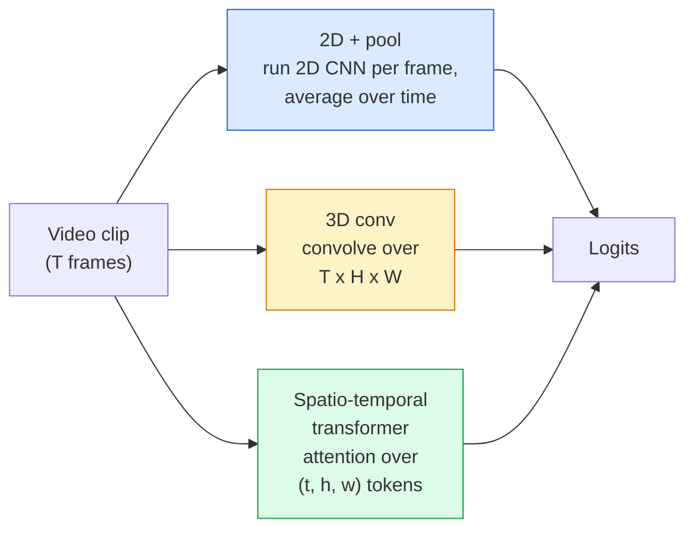

# 影片理解——時序建模

> 一段影片就是一串影像，加上把它們串起來的物理。每一個影片模型要嘛把時間當成多出來的一個軸（3D 卷積）、當成一串可以注意的序列（transformer），要嘛當成一次抽完就池化掉的特徵（2D + 池化）。

**類型：** 學習 + 實作
**程式語言：** Python
**先修單元：** 階段 4 · 03（CNN）、階段 4 · 04（影像分類）
**時間：** 約 45 分鐘

## 學習目標

- 分辨三大影片建模路線（2D + 池化、3D 卷積、時空 transformer），並預測它們在成本與準確率上的取捨
- 在 PyTorch 裡實作影格取樣、時序池化，以及一個 2D + 池化的基線分類器
- 解釋為什麼 I3D 那種「膨脹」出來的 3D 卷積核能順利承接 ImageNet 權重，以及分解式的 (2+1)D 卷積做法差在哪裡
- 讀懂標準的動作辨識資料集與指標：Kinetics-400/600、UCF101、Something-Something V2；以及片段層級與影片層級的 top-1 準確率

## 問題所在

一段 30 秒、30 fps 的影片就是 900 張影像。照最直白的想法，影片分類就是把影像分類做 900 次，然後用某種方式匯總起來。當動作幾乎在每一格都看得見時（運動、料理、健身影片），這招管用；但當動作本身是由運動定義的，它就會慘敗：「把某個東西從左推到右」在任何單一影格裡，看起來都只是兩個靜止的物體。

每一種影片架構真正要回答的問題是：時序結構在什麼時候被建模，又是怎麼建模的？答案決定了其他一切——算力成本、預訓練策略、能不能重用 ImageNet 權重、模型該在哪些資料集上訓練。

本單元刻意比靜態影像那幾課短。影像端的核心機制已經到位，而影片理解主要就是那個時序的故事：取樣、建模、匯總。

## 核心概念

### 三大架構家族



### 2D + 池化

拿一個 2D CNN（ResNet、EfficientNet、ViT），在每一個取樣到的影格上獨立跑一遍。把逐格的嵌入做平均池化（或最大池化、注意力池化），再把池化後的向量餵給分類器。

優點：

- ImageNet 預訓練可以直接遷移過來。
- 實作最簡單。
- 便宜：T 格 * 單張影像的推論成本。

缺點：

- 無法建模運動。動作等於外觀的匯總。
- 時序池化與順序無關；「開門」和「關門」長得一模一樣。

什麼時候用：外觀主導的任務、在小型影片資料集上做遷移學習、先立一個基線。

### 3D 卷積

把 2D 的 (H, W) 卷積核換成 3D 的 (T, H, W) 卷積核。網路同時在空間與時間上做卷積。早期的家族成員：C3D、I3D、SlowFast。

I3D 的訣竅：拿一個預訓練好的 2D ImageNet 模型，把每個 2D 卷積核沿著一個新的時間軸複製，「膨脹」成 3D。一個 3x3 的 2D 卷積就變成 3x3x3 的 3D 卷積。這讓 3D 模型一開始就握有強力的預訓練權重，而不必從零訓練。

優點：

- 直接建模運動。
- I3D 的膨脹等於免費送你遷移學習。

缺點：

- FLOPs 比對應的 2D 版本多 T/8 倍（時序卷積核為 3、疊三次的情況）。
- 時序卷積核很小；長程的運動需要金字塔結構或雙流網路的做法。

什麼時候用：以運動為訊號的動作辨識（Something-Something V2、Kinetics 裡運動主導的那些類別）。

### 時空 transformer

把影片切成一格一格的時空 patch 詞元，然後讓它們互相注意。TimeSformer、ViViT、Video Swin、VideoMAE。

值得記住的幾種注意力樣式：

- **聯合式（joint）**——在 (t, h, w) 上做一次大注意力。複雜度對 `T*H*W` 是平方級；很貴。
- **分離式（divided）**——每個區塊做兩次注意力：一次跨時間，一次跨空間。擴展幾乎是線性的。
- **分解式（factorised）**——時間注意力與空間注意力在不同區塊之間交替。

優點：

- 在每一個主要基準上都是 SOTA 準確率。
- 可以透過 patch 膨脹從影像 transformer（ViT）遷移過來。
- 搭配稀疏注意力就能支援長脈絡影片。

缺點：

- 非常吃算力。
- 注意力樣式必須小心挑選，否則執行時間會爆炸。

什麼時候用：大型資料集、高保真度的影片理解、影片加文字的多模態任務。

### 影格取樣

一段 10 秒、30 fps 的片段有 300 格；把全部 300 格餵給任何模型都是浪費。標準策略：

- **均勻取樣**——在整段片段上等距挑 T 格。2D + 池化的預設做法。
- **密集取樣**——隨機取一段連續的 T 格視窗。3D 卷積常用，因為運動需要相鄰的影格。
- **多片段取樣**——從同一支影片取多個 T 格視窗，各自分類，測試時把預測平均起來。

T 通常是 8、16、32 或 64。T 越高 = 時序訊號越多，算力也越多。

### 評估

分兩個層級：

- **片段層級準確率**——模型看一個 T 格的片段，回報 top-k。
- **影片層級準確率**——把同一支影片多個片段的預測平均起來；數字更高也更穩定。

兩個都要報。一個拿到 78% 片段 / 82% 影片的模型，很依賴測試時的平均；一個拿到 80% / 81% 的模型，在單一片段上就比較穩健。

### 你會遇到的資料集

- **Kinetics-400 / 600 / 700**——通用的動作資料集。40 萬個片段；YouTube 網址（很多現在已經失效）。
- **Something-Something V2**——由運動定義的動作（「把 X 從左移到右」）。2D + 池化解不掉。
- **UCF-101**、**HMDB-51**——比較舊、比較小，但還是常被報出來。
- **AVA**——在空間與時間上做動作*定位*；比分類更難。

```figure
v4-video-temporal
```

## 動手實作

### 步驟 1：影格取樣器

均勻與密集兩種取樣器，吃一個影格清單（或一個影片張量）。

```python
import numpy as np

def sample_uniform(num_frames_total, T):
    if num_frames_total <= T:
        return list(range(num_frames_total)) + [num_frames_total - 1] * (T - num_frames_total)
    step = num_frames_total / T
    return [int(i * step) for i in range(T)]


def sample_dense(num_frames_total, T, rng=None):
    rng = rng or np.random.default_rng()
    if num_frames_total <= T:
        return list(range(num_frames_total)) + [num_frames_total - 1] * (T - num_frames_total)
    start = int(rng.integers(0, num_frames_total - T + 1))
    return list(range(start, start + T))
```

兩者都回傳 `T` 個索引，你用它們去切影片張量。

### 步驟 2：一個 2D + 池化的基線

用一個 2D ResNet-18 跑過每一格，對特徵做平均池化，然後分類。

```python
import torch
import torch.nn as nn
from torchvision.models import resnet18, ResNet18_Weights

class FramePool(nn.Module):
    def __init__(self, num_classes=400, pretrained=True):
        super().__init__()
        weights = ResNet18_Weights.IMAGENET1K_V1 if pretrained else None
        backbone = resnet18(weights=weights)
        self.features = nn.Sequential(*(list(backbone.children())[:-1]))  # global avg pool kept
        self.head = nn.Linear(512, num_classes)

    def forward(self, x):
        # x: (N, T, 3, H, W)
        N, T = x.shape[:2]
        x = x.view(N * T, *x.shape[2:])
        feats = self.features(x).view(N, T, -1)
        pooled = feats.mean(dim=1)
        return self.head(pooled)

model = FramePool(num_classes=10)
x = torch.randn(2, 8, 3, 224, 224)
print(f"output: {model(x).shape}")
print(f"params: {sum(p.numel() for p in model.parameters()):,}")
```

一千一百萬個參數，ImageNet 預訓練，逐格跑、平均、分類。在外觀主導的任務上，這條基線常常跟正規的 3D 模型只差 5 到 10 個百分點——有時候還更好，因為它重用了一個更強的 ImageNet 主幹網路。

### 步驟 3：一個 I3D 風格的膨脹 3D 卷積

把權重沿著一個新的時間軸重複，就能把單一個 2D 卷積變成 3D 卷積。

```python
def inflate_2d_to_3d(conv2d, time_kernel=3):
    out_c, in_c, kh, kw = conv2d.weight.shape
    weight_3d = conv2d.weight.data.unsqueeze(2)  # (out, in, 1, kh, kw)
    weight_3d = weight_3d.repeat(1, 1, time_kernel, 1, 1) / time_kernel
    conv3d = nn.Conv3d(in_c, out_c, kernel_size=(time_kernel, kh, kw),
                        padding=(time_kernel // 2, conv2d.padding[0], conv2d.padding[1]),
                        stride=(1, conv2d.stride[0], conv2d.stride[1]),
                        bias=False)
    conv3d.weight.data = weight_3d
    return conv3d

conv2d = nn.Conv2d(3, 64, kernel_size=3, padding=1, bias=False)
conv3d = inflate_2d_to_3d(conv2d, time_kernel=3)
print(f"2D weight shape:  {tuple(conv2d.weight.shape)}")
print(f"3D weight shape:  {tuple(conv3d.weight.shape)}")
x = torch.randn(1, 3, 8, 56, 56)
print(f"3D output shape:  {tuple(conv3d(x).shape)}")
```

除以 `time_kernel` 是為了讓激活值的量級大致維持不變——這對第一次前向傳播時不把批次正規化的統計量搞壞很重要。

### 步驟 4：分解式 (2+1)D 卷積

把一個 3D 卷積拆成一個 2D（空間）卷積加一個 1D（時序）卷積。感受野一樣，參數更少，在某些基準上準確率還更好。

```python
class Conv2Plus1D(nn.Module):
    def __init__(self, in_c, out_c, kernel_size=3):
        super().__init__()
        mid_c = (in_c * out_c * kernel_size * kernel_size * kernel_size) \
                // (in_c * kernel_size * kernel_size + out_c * kernel_size)
        self.spatial = nn.Conv3d(in_c, mid_c, kernel_size=(1, kernel_size, kernel_size),
                                 padding=(0, kernel_size // 2, kernel_size // 2), bias=False)
        self.bn = nn.BatchNorm3d(mid_c)
        self.act = nn.ReLU(inplace=True)
        self.temporal = nn.Conv3d(mid_c, out_c, kernel_size=(kernel_size, 1, 1),
                                  padding=(kernel_size // 2, 0, 0), bias=False)

    def forward(self, x):
        return self.temporal(self.act(self.bn(self.spatial(x))))

c = Conv2Plus1D(3, 64)
x = torch.randn(1, 3, 8, 56, 56)
print(f"(2+1)D output: {tuple(c(x).shape)}")
```

一個完整的 R(2+1)D 網路，就是把 ResNet-18 裡每個 3x3 卷積都換成 `Conv2Plus1D`。

## 框架應用

生產環境的影片工作，兩個函式庫就涵蓋得差不多：

- `torchvision.models.video`——R(2+1)D、MViT、Swin3D，附 Kinetics 預訓練權重。呼叫介面跟影像模型一樣。
- `pytorchvideo`（Meta）——模型庫，Kinetics / SSv2 / AVA 的資料載入器，以及標準的轉換。

視覺語言影片模型（影片描述、影片問答）請用 `transformers`（`VideoMAE`、`VideoLLaMA`、`InternVideo`）。

## 產出交付

本單元會產出：

- `outputs/prompt-video-architecture-picker.md` —— 一個提示詞，依據外觀對運動的比重、資料集大小與算力預算，挑出 2D + 池化 / I3D / (2+1)D / transformer。
- `outputs/skill-frame-sampler-auditor.md` —— 一項技能，檢查影片管線裡的取樣器並標出常見錯誤：索引差一、`num_frames < T` 時取樣不均、缺少保持長寬比的裁切等等。

## 練習

1. **（簡單）** 估算 T=8 的 FramePool 與 T=8 的 I3D 風格 3D ResNet 各自的 FLOPs（近似即可）。說明為什麼 2D + 池化便宜 3 到 5 倍。
2. **（中等）** 生成一份合成的影片資料集：隨機的球往隨機方向移動，標籤是運動方向（「left-to-right」、「right-to-left」、「diagonal-up」）。在上面訓練 FramePool。證明它的準確率接近亂猜，也就證明了單靠外觀不足以應付運動類任務。
3. **（困難）** 把 ResNet-18 裡每個 Conv2d 換成 `Conv2Plus1D`，做出一個 R(2+1)D-18。第一個卷積的權重從 ImageNet 預訓練的 ResNet-18 膨脹過來。在練習 2 的運動資料集上訓練，並贏過 FramePool。

## 關鍵術語

| 術語 | 大家怎麼說 | 實際上是什麼 |
|------|----------------|----------------------|
| 2D + 池化 | 「逐格分類器」 | 在每個取樣到的影格上跑 2D CNN，把特徵沿時間做平均池化，然後分類 |
| 3D 卷積 | 「時空卷積核」 | 在 (T, H, W) 上做卷積的核；天生就能建模運動 |
| 膨脹 | 「把 2D 權重抬成 3D」 | 把 2D 卷積的權重沿新的時間軸重複，用來初始化 3D 卷積權重，再除以 kernel_T 以保住激活值的尺度 |
| (2+1)D | 「分解式卷積」 | 把 3D 拆成 2D 空間加 1D 時序；參數更少，中間還多一個非線性 |
| 分離式注意力 | 「先時間再空間」 | 每層做兩次注意力的 transformer 區塊：一次在同一影格內的詞元之間，一次在同一位置的詞元之間 |
| 片段 | 「T 格視窗」 | 取樣出來的 T 格連續子序列；影片模型消化的單位 |
| 片段與影片準確率 | 「兩種評估設定」 | 片段 = 每支影片取一個樣本，影片 = 對同一支影片的多個取樣片段取平均 |
| Kinetics | 「影片界的 ImageNet」 | 400 到 700 個動作類別，30 萬個以上的 YouTube 片段，影片預訓練的標準語料 |

## 延伸閱讀

- [I3D: Quo Vadis, Action Recognition (Carreira & Zisserman, 2017)](https://arxiv.org/abs/1705.07750) —— 提出膨脹手法與 Kinetics 資料集
- [R(2+1)D: A Closer Look at Spatiotemporal Convolutions (Tran et al., 2018)](https://arxiv.org/abs/1711.11248) —— 分解式卷積，至今仍是強力基線
- [TimeSformer: Is Space-Time Attention All You Need? (Bertasius et al., 2021)](https://arxiv.org/abs/2102.05095) —— 第一個真正強的影片 transformer
- [VideoMAE (Tong et al., 2022)](https://arxiv.org/abs/2203.12602) —— 影片的遮罩自編碼器預訓練；目前主流的預訓練配方
