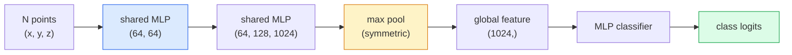

# 3D 視覺 —— 點雲與 NeRF

> 3D 視覺有兩種風味。點雲是感測器的原始輸出，NeRF 是學出來的體積場。兩者回答的都是同一個問題：「空間裡哪裡有什麼。」

**類型：** 學習 + 實作
**程式語言：** Python
**先修單元：** 階段 4 · 單元 03（CNN）、階段 1 · 單元 12（張量運算）
**時間：** 約 45 分鐘

## 學習目標

- 分辨顯式（點雲、網格、體素）與隱式表示（signed distance field、NeRF）這兩類 3D 表示，以及各自的使用時機
- 理解 PointNet 的對稱函式技巧，它讓神經網路對一組無序的點具備排列不變性
- 追一遍 NeRF 的前向傳播：光線投射、體積渲染、位置編碼、輸出密度與顏色的 MLP head
- 用 `nerfstudio` 或 `instant-ngp`，從少量已知相機姿態的影像做預訓練模型的 3D 重建

## 問題所在

相機產生一張 2D 影像。LIDAR 產生一組沒有順序的 3D 點。structure-from-motion 流程產生一團稀疏的 3D 關鍵點雲。NeRF 則從少數幾張已知姿態的影像重建出一整個 3D 場景。這些全都是「視覺」，但沒有一個長得像 CNN 想要的那種稠密張量。

3D 視覺重要，是因為幾乎每一項高價值的機器人任務都跑在 3D 裡：抓取、避障、導航、AR 遮擋、3D 內容擷取。只懂 2D 影像的視覺工程師，會被鎖在這個領域成長最快的那一塊之外（AR/VR 內容、機器人、自動駕駛技術堆疊、房地產或建築業用的 NeRF 3D 重建）。

這兩種表示各因不同的理由而佔據主導。點雲是感測器免費給你的東西；NeRF 及其後繼者（3D Gaussian splatting、neural SDF）則是你要求神經網路去學一個場景時得到的東西。

## 核心概念

### 點雲

點雲是 R^3 裡 N 個點構成的無序集合，每個點可以再帶特徵（顏色、強度、法向量）。

```
cloud = [
  (x1, y1, z1, r1, g1, b1),
  (x2, y2, z2, r2, g2, b2),
  ...
  (xN, yN, zN, rN, gN, bN),
]
```

沒有網格結構，也沒有連接關係。有兩個性質讓神經網路很難處理它：

- **排列不變性** —— 輸出不能取決於點的順序。
- **N 會變** —— 同一個模型必須吃得下大小不同的點雲。

PointNet（Qi et al., 2017）用一個想法同時解決了兩者：對每一個點套用共享的 MLP，然後用一個對稱函式（max pool）聚合。結果是一個固定長度、與順序無關的向量。

```
f(P) = max_{p in P} MLP(p)
```

這就是 PointNet 的全部核心。更深的變體（PointNet++、Point Transformer）加上了階層式取樣與局部聚合，但對稱函式這個技巧沒有變。

### PointNet 架構



「共享 MLP」的意思是同一個 MLP 獨立地跑在每一個點上。為了效率，實作上寫成在點維度上做 1x1 卷積。

### 神經輻射場（NeRF）

NeRF（Mildenhall et al., 2020）拿「我們能不能從 N 張照片重建一個 3D 場景？」這個問題，用一個「神經網路本身就是場景」的答案回應。網路把 `(x, y, z, viewing_direction)` 映射到 `(density, colour)`。渲染一個新視角，就是在這個網路上跑一圈光線投射迴圈。

```
NeRF MLP:  (x, y, z, theta, phi) -> (sigma, r, g, b)

To render a pixel (u, v) of a new view:
  1. Cast a ray from the camera through pixel (u, v)
  2. Sample points along the ray at distances t_1, t_2, ..., t_N
  3. Query the MLP at each point
  4. Composite the colours weighted by (1 - exp(-sigma * dt))
  5. The sum is the rendered pixel colour
```

損失函式比較渲染出來的像素與訓練照片裡的真實像素。梯度穿過渲染步驟反向傳遞回去，更新 MLP。沒有 3D 標準答案，也沒有顯式幾何 —— 場景就存在 MLP 的權重裡。

### NeRF 裡的位置編碼

直接吃 `(x, y, z)` 的原味 MLP 沒辦法表示高頻細節，因為 MLP 在頻譜上偏向低頻。NeRF 的解法是在進 MLP 之前，先把每個座標編碼成一組傅立葉特徵向量：

```
gamma(p) = (sin(2^0 pi p), cos(2^0 pi p), sin(2^1 pi p), cos(2^1 pi p), ...)
```

最多到 L=10 個頻率層級。這跟 transformer 處理位置用的是同一個技巧，在擴散模型的時間條件裡也會再出現一次（單元 10）。少了它，NeRF 就會糊掉。

### 體積渲染

```
C(r) = sum_i T_i * (1 - exp(-sigma_i * delta_i)) * c_i

T_i  = exp(- sum_{j<i} sigma_j * delta_j)
delta_i = t_{i+1} - t_i
```

`T_i` 是穿透率 —— 有多少光能存活到第 i 個點。`(1 - exp(-sigma_i * delta_i))` 是第 i 個點的不透明度。`c_i` 是顏色。最終的像素就是沿著光線的一個加權和。

### 取代 NeRF 的東西

純 NeRF 訓練慢（好幾小時），渲染也慢（一張圖要好幾秒）。之後的血脈是：

- **Instant-NGP**（2022）—— 用 hash-grid 編碼取代 MLP 的位置輸入；訓練只要幾秒。
- **Mip-NeRF 360** —— 能處理無邊界場景與反鋸齒。
- **3D Gaussian Splatting**（2023）—— 用數百萬個 3D 高斯取代體積場；訓練幾分鐘，渲染即時。目前生產環境的預設選擇。

2026 年幾乎每一個真正上線的 NeRF 產品，其實都是 3D Gaussian splatting。但心智模型還是 NeRF。

### 資料集與基準

- **ShapeNet** —— 以點雲形式做 3D CAD 模型的分類與分割。
- **ScanNet** —— 真實室內掃描，用於分割。
- **KITTI** —— 自動駕駛用的戶外 LIDAR 點雲。
- **NeRF Synthetic** / **Blended MVS** —— 用於視角合成的已知姿態影像資料集。
- **Mip-NeRF 360** 資料集 —— 無邊界的真實場景。

## 動手實作

### 步驟 1：PointNet 分類器

```python
import torch
import torch.nn as nn

class PointNet(nn.Module):
    def __init__(self, num_classes=10):
        super().__init__()
        self.mlp1 = nn.Sequential(
            nn.Conv1d(3, 64, 1),    nn.BatchNorm1d(64),   nn.ReLU(inplace=True),
            nn.Conv1d(64, 64, 1),   nn.BatchNorm1d(64),   nn.ReLU(inplace=True),
        )
        self.mlp2 = nn.Sequential(
            nn.Conv1d(64, 128, 1),  nn.BatchNorm1d(128),  nn.ReLU(inplace=True),
            nn.Conv1d(128, 1024, 1), nn.BatchNorm1d(1024), nn.ReLU(inplace=True),
        )
        self.head = nn.Sequential(
            nn.Linear(1024, 512),   nn.BatchNorm1d(512),  nn.ReLU(inplace=True),
            nn.Dropout(0.3),
            nn.Linear(512, 256),    nn.BatchNorm1d(256),  nn.ReLU(inplace=True),
            nn.Dropout(0.3),
            nn.Linear(256, num_classes),
        )

    def forward(self, x):
        # x: (N, 3, num_points) — transposed for Conv1d
        x = self.mlp1(x)
        x = self.mlp2(x)
        x = torch.max(x, dim=-1)[0]       # (N, 1024)
        return self.head(x)

pts = torch.randn(4, 3, 1024)
net = PointNet(num_classes=10)
print(f"output: {net(pts).shape}")
print(f"params: {sum(p.numel() for p in net.parameters()):,}")
```

大約 160 萬個參數。每個點雲跑 1,024 個點。

### 步驟 2：位置編碼

```python
def positional_encoding(x, L=10):
    """
    x: (..., D) -> (..., D * 2 * L)
    """
    freqs = 2.0 ** torch.arange(L, dtype=x.dtype, device=x.device)
    args = x.unsqueeze(-1) * freqs * 3.141592653589793
    sinc = torch.cat([args.sin(), args.cos()], dim=-1)
    return sinc.reshape(*x.shape[:-1], -1)

x = torch.randn(5, 3)
y = positional_encoding(x, L=10)
print(f"input:  {x.shape}")
print(f"encoded: {y.shape}     # (5, 60)")
```

乘上 `2^l * pi` 就得到逐級升高的頻率。

### 步驟 3：迷你 NeRF MLP

```python
class TinyNeRF(nn.Module):
    def __init__(self, L_pos=10, L_dir=4, hidden=128):
        super().__init__()
        self.L_pos = L_pos
        self.L_dir = L_dir
        pos_dim = 3 * 2 * L_pos
        dir_dim = 3 * 2 * L_dir
        self.trunk = nn.Sequential(
            nn.Linear(pos_dim, hidden), nn.ReLU(inplace=True),
            nn.Linear(hidden, hidden),  nn.ReLU(inplace=True),
            nn.Linear(hidden, hidden),  nn.ReLU(inplace=True),
            nn.Linear(hidden, hidden),  nn.ReLU(inplace=True),
        )
        self.sigma = nn.Linear(hidden, 1)
        self.color = nn.Sequential(
            nn.Linear(hidden + dir_dim, hidden // 2), nn.ReLU(inplace=True),
            nn.Linear(hidden // 2, 3), nn.Sigmoid(),
        )

    def forward(self, x, d):
        x_enc = positional_encoding(x, self.L_pos)
        d_enc = positional_encoding(d, self.L_dir)
        h = self.trunk(x_enc)
        sigma = torch.relu(self.sigma(h)).squeeze(-1)
        rgb = self.color(torch.cat([h, d_enc], dim=-1))
        return sigma, rgb

nerf = TinyNeRF()
x = torch.randn(128, 3)
d = torch.randn(128, 3)
s, c = nerf(x, d)
print(f"sigma: {s.shape}   rgb: {c.shape}")
```

跟原版 NeRF（有兩個深度 8 的 MLP 主幹）相比小很多，但足以展示這個架構。

### 步驟 4：沿一條光線做體積渲染

```python
def volumetric_render(sigma, rgb, t_vals):
    """
    sigma: (..., N_samples)
    rgb:   (..., N_samples, 3)
    t_vals: (N_samples,) distances along the ray
    """
    delta = torch.cat([t_vals[1:] - t_vals[:-1], torch.full_like(t_vals[:1], 1e10)])
    alpha = 1.0 - torch.exp(-sigma * delta)
    trans = torch.cumprod(torch.cat([torch.ones_like(alpha[..., :1]), 1.0 - alpha + 1e-10], dim=-1), dim=-1)[..., :-1]
    weights = alpha * trans
    rendered = (weights.unsqueeze(-1) * rgb).sum(dim=-2)
    depth = (weights * t_vals).sum(dim=-1)
    return rendered, depth, weights


N = 64
t_vals = torch.linspace(2.0, 6.0, N)
sigma = torch.rand(N) * 0.5
rgb = torch.rand(N, 3)
rendered, depth, weights = volumetric_render(sigma, rgb, t_vals)
print(f"rendered colour: {rendered.tolist()}")
print(f"depth:           {depth.item():.2f}")
```

一條光線、64 個取樣點，合成出單一個 RGB 像素與一個深度值。

## 框架應用

真正要做事的話：

- `nerfstudio`（Tancik et al.）—— 目前 NeRF / Instant-NGP / Gaussian Splatting 的參考函式庫。有命令列工具，也有網頁檢視器。
- `pytorch3d`（Meta）—— 可微渲染、點雲工具、網格運算。
- `open3d` —— 點雲處理、配準、視覺化。

要部署的話，3D Gaussian splatting 已大致取代純 NeRF，因為它渲染快 100 倍，而重建品質相當。

## 產出交付

這個單元會產出：

- `outputs/prompt-3d-task-router.md` —— 一個依任務與輸入資料，導向正確 3D 表示（點雲、網格、體素、NeRF、Gaussian splat）的提示詞。
- `outputs/skill-point-cloud-loader.md` —— 一項技能，為 .ply / .pcd / .xyz 檔案寫出一個 PyTorch `Dataset`，並做好正規化、置中與點取樣。

## 練習

1. **（簡單）** 證明 PointNet 具備排列不變性：把同一個點雲跑兩次，其中一次把點打亂。驗證兩次輸出在浮點誤差範圍內完全相同。
2. **（中等）** 實作一個最精簡的光線生成函式：給定相機內參與相機姿態，為一張 H x W 影像的每個像素產生光線起點與方向。
3. **（困難）** 在一個合成資料集上訓練 TinyNeRF，資料是一個彩色立方體的渲染視角（用可微渲染或簡單的光線追蹤器產生）。回報第 1、10、100 個 epoch 的渲染損失。到第幾個 epoch 模型才產生得出可辨認的視角？

## 關鍵術語

| 術語 | 大家怎麼說 | 實際上是什麼 |
|------|----------------|----------------------|
| 點雲 | 「LIDAR 掃出來的 3D 點」 | (x, y, z) 的無序集合，每個點可再帶選用的特徵 |
| PointNet | 「第一個吃點雲的神經網路」 | 每個點過共享 MLP + 對稱（max）pool；架構上天生具備排列不變性 |
| NeRF | 「網路本身就是場景的 MLP」 | 把 (x, y, z, dir) 映射到 (density, colour) 的網路；用光線投射渲染 |
| 位置編碼 | 「傅立葉特徵」 | 把每個座標編碼成多個頻率的 sin/cos，用來克服 MLP 的低頻偏好 |
| 體積渲染 | 「沿光線積分」 | 用穿透率與 alpha，把沿光線的取樣點合成成單一像素 |
| Instant-NGP | 「hash-grid 版的 NeRF」 | 用多解析度 hash grid 取代 NeRF 的座標 MLP；快 100 到 1000 倍 |
| 3D Gaussian splatting | 「數百萬個高斯」 | 場景 = 一堆 3D 高斯的集合；即時渲染，幾分鐘訓練完 |
| SDF | 「signed distance field」 | 回傳到最近表面的帶號距離的函式；另一種隱式表示 |

## 延伸閱讀

- [PointNet (Qi et al., 2017)](https://arxiv.org/abs/1612.00593) —— 那個具備排列不變性的分類器
- [NeRF (Mildenhall et al., 2020)](https://arxiv.org/abs/2003.08934) —— 讓「從照片重建 3D」變成神經網路問題的那篇論文
- [Instant-NGP (Müller et al., 2022)](https://arxiv.org/abs/2201.05989) —— hash grid，1000 倍加速
- [3D Gaussian Splatting (Kerbl et al., 2023)](https://arxiv.org/abs/2308.04079) —— 在生產環境取代 NeRF 的架構
