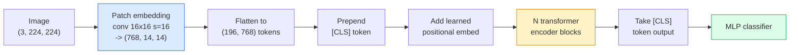

# 視覺 Transformer（ViT）

> 把影像切成一塊塊影像區塊，每一塊當成一個詞，然後跑一個標準的 transformer。不必回頭看。

**類型：** 實作
**程式語言：** Python
**先修單元：** 階段 7 · 02（自注意力）、階段 4 · 04（影像分類）
**時間：** 約 45 分鐘

## 學習目標

- 從零實作區塊嵌入、學習式位置嵌入、類別詞元與 transformer 編碼器區塊，組出一個最小的 ViT
- 解釋為什麼大家原本以為 ViT 非得靠海量預訓練資料不可，直到 DeiT 與 MAE 證明並非如此
- 從架構先驗的角度比較 ViT、Swin 與 ConvNeXt（沒有先驗、局部視窗注意力、卷積主幹）
- 用 `timm` 以及標準的 linear-probe／微調配方，在一個小資料集上微調預訓練好的 ViT

## 問題所在

有十年時間，卷積幾乎就等同於電腦視覺。CNN 帶著很強的歸納偏差——局部性、平移等變性——沒人認為那是可以被取代的。接著 Dosovitskiy 等人（2020）證明：一個普通的 transformer 套在攤平的影像區塊上，完全不用任何卷積機制，在足夠規模下就能追平甚至打敗最好的 CNN。

問題出在「足夠規模」這幾個字。ViT 在 ImageNet-1k 上輸給 ResNet；先在 ImageNet-21k 或 JFT-300M 上預訓練、再到 ImageNet-1k 微調的 ViT 則贏了。當時的結論是：transformer 缺少有用的先驗，但只要資料夠多就能自己學出來。後續工作（DeiT、MAE、DINO）顯示，只要訓練配方對——強力資料增強、自監督預訓練、蒸餾——ViT 在小資料上也訓得起來。

到了 2026 年，純 CNN 在邊緣裝置上依然有競爭力（ConvNeXt 是最強的那個），但 transformer 主宰了其他一切：分割（Mask2Former、SegFormer）、偵測（DETR、RT-DETR）、多模態（CLIP、SigLIP）、影片（VideoMAE、VJEPA）。ViT 的區塊結構就是你該熟記的那個。

## 核心概念

### 整條流程



七個步驟。影像區塊 -> 詞元 -> 注意力 -> 分類器。每一個變體（DeiT、Swin、ConvNeXt、MAE 預訓練）都只改動這七步裡的一兩步，其餘照舊。

### 區塊嵌入

第一個卷積就是全部的訣竅。卷積核大小 16、stride 16，於是一張 224x224 的影像變成 14x14 格、每格 16x16 的影像區塊，每一塊各自被投影成 768 維的嵌入。那一個卷積同時完成了切塊與線性投影。

```
Input:  (3, 224, 224)
Conv (3 -> 768, k=16, s=16, no padding):
Output: (768, 14, 14)
Flatten spatial: (196, 768)
```

196 個影像區塊 = 196 個詞元。每個詞元的特徵維度是 768（ViT-B）、1024（ViT-L）或 1280（ViT-H）。

### 類別詞元

一個學習出來的向量，接在序列最前面：

```
tokens = [CLS; patch_1; patch_2; ...; patch_196]   shape (197, 768)
```

跑過 N 個 transformer 區塊之後，`[CLS]` 的輸出就是整張影像的全域表示。分類頭只讀這一個向量。

### 位置嵌入

Transformer 本身沒有任何空間位置的概念。做法是給每個詞元加上一個學習出來的向量：

```
tokens = tokens + learned_pos_embedding   (also shape (197, 768))
```

這個嵌入是模型的參數；靠梯度訓練讓它去適應 2D 影像結構。也有正弦式的 2D 替代方案，但實務上很少用。

### Transformer 編碼器區塊

標準款。多頭自注意力、MLP、殘差連接、pre-LayerNorm。

```
x = x + MSA(LN(x))
x = x + MLP(LN(x))

MLP is two-layer with GELU: Linear(d -> 4d) -> GELU -> Linear(4d -> d)
```

ViT-B/16 疊了 12 個這種區塊，每個 12 個注意力頭，總共 8,600 萬個參數。

### 為什麼用 pre-LN

早期的 transformer 用 post-LN（`x = LN(x + sublayer(x))`），不做 warmup 的話疊超過 6 到 8 層就很難訓。Pre-LN（`x = x + sublayer(LN(x))`）不必 warmup 就能穩定訓練更深的網路。每一個 ViT、每一個現代 LLM 都用 pre-LN。

### 區塊大小的取捨

- 16x16 的影像區塊 -> 196 個詞元，標準設定。
- 32x32 的影像區塊 -> 49 個詞元，更快但解析度較低。
- 8x8 的影像區塊 -> 784 個詞元，更細緻，但注意力的 O(n^2) 成本擴展得很糟。

影像區塊越大 = 詞元越少 = 越快，但空間細節越少。SwinV2 在階層式視窗裡使用 4x4 的影像區塊。

### DeiT 在 ImageNet-1k 上訓練 ViT 的配方

原始的 ViT 要靠 JFT-300M 才打得過 CNN。DeiT（Touvron et al., 2020）只用 ImageNet-1k 就把 ViT-B 訓到 81.8% top-1，靠的是四項改動：

1. 大量資料增強：RandAugment、Mixup、CutMix、Random Erasing。
2. 隨機深度（訓練期間隨機丟掉整個區塊）。
3. 重複增強（同一張影像在一個批次裡取樣 3 次）。
4. 從 CNN 老師模型蒸餾（可選，能再把準確率往上推）。

現代每一份 ViT 訓練配方都是 DeiT 的後代。

### Swin 對比 ConvNeXt

- **Swin**（Liu et al., 2021）——基於視窗的注意力。每個區塊只在一個局部視窗內做注意力；相鄰區塊把視窗位移，好讓資訊在視窗之間流通。這把 CNN 那種局部性先驗請了回來，同時保留注意力這個運算子。
- **ConvNeXt**（Liu et al., 2022）——重新設計過的 CNN，把 Swin 的架構選擇一併搬過來（深度可分離卷積、層正規化、GELU、反轉瓶頸）。它證明了差距不在「注意力對上卷積」，而在「現代訓練配方 + 架構」。

在 2026 年，ConvNeXt-V2 與 Swin-V2 都是生產級的；該選哪個，取決於你的推論堆疊（ConvNeXt 在邊緣端編譯得更好）與預訓練語料。

### MAE 預訓練

Masked Autoencoder（He et al., 2022）：隨機遮住 75% 的影像區塊，只讓編碼器處理可見的那 25%，再訓練一個小型解碼器從編碼器輸出重建被遮住的區塊。預訓練完成後把解碼器丟掉，只微調編碼器。

MAE 讓 ViT 光靠 ImageNet-1k 就訓得起來、能達到 SOTA，也是目前預設的自監督配方。

## 動手實作

### 步驟 1：區塊嵌入

```python
import torch
import torch.nn as nn

class PatchEmbedding(nn.Module):
    def __init__(self, in_channels=3, patch_size=16, dim=192, image_size=64):
        super().__init__()
        assert image_size % patch_size == 0
        self.proj = nn.Conv2d(in_channels, dim, kernel_size=patch_size, stride=patch_size)
        num_patches = (image_size // patch_size) ** 2
        self.num_patches = num_patches

    def forward(self, x):
        x = self.proj(x)
        return x.flatten(2).transpose(1, 2)
```

一個卷積、一次 flatten、一次 transpose。從影像到詞元這一步就這樣而已。

### 步驟 2：Transformer 區塊

Pre-LN、多頭自注意力、帶 GELU 的 MLP、殘差連接。

```python
class Block(nn.Module):
    def __init__(self, dim, num_heads, mlp_ratio=4, dropout=0.0):
        super().__init__()
        self.ln1 = nn.LayerNorm(dim)
        self.attn = nn.MultiheadAttention(dim, num_heads, dropout=dropout, batch_first=True)
        self.ln2 = nn.LayerNorm(dim)
        self.mlp = nn.Sequential(
            nn.Linear(dim, dim * mlp_ratio),
            nn.GELU(),
            nn.Dropout(dropout),
            nn.Linear(dim * mlp_ratio, dim),
            nn.Dropout(dropout),
        )

    def forward(self, x):
        a, _ = self.attn(self.ln1(x), self.ln1(x), self.ln1(x), need_weights=False)
        x = x + a
        x = x + self.mlp(self.ln2(x))
        return x
```

`nn.MultiheadAttention` 會處理拆頭、縮放點積以及輸出投影。`batch_first=True` 讓形狀是 `(N, seq, dim)`。

### 步驟 3：ViT 本體

```python
class ViT(nn.Module):
    def __init__(self, image_size=64, patch_size=16, in_channels=3,
                 num_classes=10, dim=192, depth=6, num_heads=3, mlp_ratio=4):
        super().__init__()
        self.patch = PatchEmbedding(in_channels, patch_size, dim, image_size)
        num_patches = self.patch.num_patches
        self.cls_token = nn.Parameter(torch.zeros(1, 1, dim))
        self.pos_embed = nn.Parameter(torch.zeros(1, num_patches + 1, dim))
        self.blocks = nn.ModuleList([
            Block(dim, num_heads, mlp_ratio) for _ in range(depth)
        ])
        self.ln = nn.LayerNorm(dim)
        self.head = nn.Linear(dim, num_classes)
        nn.init.trunc_normal_(self.pos_embed, std=0.02)
        nn.init.trunc_normal_(self.cls_token, std=0.02)

    def forward(self, x):
        x = self.patch(x)
        cls = self.cls_token.expand(x.size(0), -1, -1)
        x = torch.cat([cls, x], dim=1)
        x = x + self.pos_embed
        for blk in self.blocks:
            x = blk(x)
        x = self.ln(x[:, 0])
        return self.head(x)

vit = ViT(image_size=64, patch_size=16, num_classes=10, dim=192, depth=6, num_heads=3)
x = torch.randn(2, 3, 64, 64)
print(f"output: {vit(x).shape}")
print(f"params: {sum(p.numel() for p in vit.parameters()):,}")
```

大約 280 萬個參數——一個在 CPU 上就跑得動的迷你 ViT。真正的 ViT-B 是 8,600 萬；同一份類別定義，改成 `dim=768, depth=12, num_heads=12` 就是了。

### 步驟 4：健全性檢查——單張影像推論

```python
logits = vit(torch.randn(1, 3, 64, 64))
print(f"logits: {logits}")
print(f"probs:  {logits.softmax(-1)}")
```

應該不會出錯。機率總和為 1。

## 框架應用

`timm` 附上每一種 ViT 變體以及 ImageNet 預訓練權重。一行就好：

```python
import timm

model = timm.create_model("vit_base_patch16_224", pretrained=True, num_classes=10)
```

在 2026 年，`timm` 是視覺 transformer 的生產預設選擇。它在同一套 API 底下支援 ViT、DeiT、Swin、Swin-V2、ConvNeXt、ConvNeXt-V2、MaxViT、MViT、EfficientFormer，以及數十種其他模型。

要做多模態（影像 + 文字），`transformers` 提供了 CLIP、SigLIP、BLIP-2、LLaVA。這些模型裡的影像編碼器全都是 ViT 的變體。

## 產出交付

本單元的產出：

- `outputs/prompt-vit-vs-cnn-picker.md` —— 一個提示詞，依資料集規模、算力與推論堆疊，在 ViT、ConvNeXt 與 Swin 之間做選擇。
- `outputs/skill-vit-patch-and-pos-embed-inspector.md` —— 一項技能，驗證 ViT 的區塊嵌入與位置嵌入形狀是否符合模型預期的序列長度，用來抓出移植時最常見的臭蟲。

## 練習

1. **（簡單）** 把上面那個迷你 ViT 前向傳播過程中每一個中間張量的形狀印出來。確認：輸入 `(N, 3, 64, 64)` -> 影像區塊 `(N, 16, 192)` -> 加上 CLS `(N, 17, 192)` -> 分類器輸入 `(N, 192)` -> 輸出 `(N, num_classes)`。
2. **（中等）** 在第 4 單元的合成 CIFAR 資料集上微調一個預訓練的 `timm` ViT-S/16。用同一份資料跟微調 ResNet-18 做比較。回報訓練時間與最終準確率。
3. **（困難）** 為這個迷你 ViT 實作 MAE 預訓練：遮住 75% 的影像區塊，訓練編碼器加一個小型解碼器去重建被遮住的區塊。量測預訓練前後在合成資料上的 linear-probe 準確率。

## 關鍵術語

| 術語 | 大家怎麼說 | 實際上是什麼 |
|------|----------------|----------------------|
| 區塊嵌入 | 「第一個卷積」 | 一個卷積核大小 = stride = 影像區塊大小的卷積；把影像變成一格一格的詞元嵌入 |
| 類別詞元 | 「[CLS]」 | 接在詞元序列最前面的學習式向量；它最後的輸出就是整張影像的全域表示 |
| 位置嵌入 | 「學出來的 pos」 | 加到每個詞元上的學習式向量，讓 transformer 知道每個影像區塊來自哪裡 |
| Pre-LN | 「LayerNorm 放在子層前面」 | 比較穩定的那種 transformer 變體：`x + sublayer(LN(x))`，而不是 `LN(x + sublayer(x))` |
| 多頭注意力 | 「並行的注意力」 | 標準的 transformer 注意力，拆成 num_heads 個獨立子空間，事後再串接起來 |
| ViT-B/16 | 「Base，patch 16」 | 那個經典尺寸：dim=768、depth=12、heads=12、patch_size=16、image=224；約 8,600 萬參數 |
| DeiT | 「資料效率高的 ViT」 | 只用 ImageNet-1k 加強力資料增強訓出來的 ViT；證明了大型預訓練資料集並非絕對必要 |
| MAE | 「遮罩自編碼器」 | 自監督預訓練：遮住 75% 的影像區塊再重建；目前最主流的 ViT 預訓練配方 |

## 延伸閱讀

- [An Image is Worth 16x16 Words (Dosovitskiy et al., 2020)](https://arxiv.org/abs/2010.11929) —— ViT 論文
- [DeiT: Data-efficient Image Transformers (Touvron et al., 2020)](https://arxiv.org/abs/2012.12877) —— 如何只用 ImageNet-1k 訓練 ViT
- [Masked Autoencoders are Scalable Vision Learners (He et al., 2022)](https://arxiv.org/abs/2111.06377) —— MAE 預訓練
- [timm documentation](https://huggingface.co/docs/timm) —— 你在生產環境會用到的每一種視覺 transformer 的參考資料
