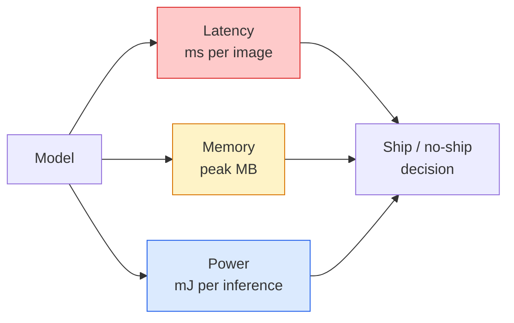

# 即時視覺 —— 邊緣部署

> 邊緣推論這門功夫，講的是怎麼讓一個準確率 90 的模型，在只有 2 GB 記憶體的裝置上跑出 30 fps。每一個百分點的準確率，都是用幾毫秒的延遲換來的。

**類型：** 學習 + 實作
**程式語言：** Python
**先修單元：** 階段 4 · 04（影像分類）、階段 10 · 11（量化）
**時間：** 約 75 分鐘

## 學習目標

- 量測任一 PyTorch 模型的推論延遲、峰值記憶體與吞吐量，並讀懂 FLOPs／參數量／延遲之間的權衡
- 用 PyTorch 的訓練後量化把視覺模型量化到 INT8，並驗證準確率損失 < 1%
- 匯出成 ONNX 並用 ONNX Runtime 或 TensorRT 編譯；說出三種最常見的匯出失敗與各自的解法
- 說明在某個邊緣限制下，該選 MobileNetV3、EfficientNet-Lite、ConvNeXt-Tiny 還是 MobileViT

## 問題所在

訓練期的視覺模型是一頭浮點怪獸。1 億個參數、每次前向傳播 10 GFLOPs、2 GB 顯示記憶體。這些數字，手機、車用資訊娛樂主機、工業相機或無人機，一個都塞不下。要把視覺系統做成產品，就得把同樣的預測擠進一個小 100 倍的預算裡。

三個旋鈕做掉了大部分工作：模型選擇（同一套配方換一個更小的架構）、量化（用 INT8 取代 FP32），以及推論執行環境（ONNX Runtime、TensorRT、Core ML、TFLite）。這三個轉對了，差別就在於「一個只能在工作站上跑的展示」與「一個能出貨在 30 美元相機模組上的產品」。

本單元先把量測的紀律架起來（量不到的東西就沒辦法最佳化），再一個個走過這三個旋鈕。目標不是學會每一種邊緣執行環境，而是知道有哪些槓桿可用，以及怎麼驗證每一根槓桿真的做到了你以為的事。

## 核心概念

### 三筆預算



- **延遲**：p50、p95、p99。只看 p50 的平均值，會把長尾行為藏起來，而長尾對即時系統才是關鍵。
- **峰值記憶體**：裝置曾經遇到的最大值，不是穩態平均值。之所以重要，是因為在嵌入式目標上 OOM 是致命的。
- **功耗／能耗**：電池供電裝置上每次推論消耗的毫焦耳。常用 CPU／GPU 使用率 * 時間來近似。

一份（模型、延遲、記憶體、準確率）的表格，就是邊緣決策的依據。每一格都要在目標裝置上量，不是在工作站上量。

### 量測的紀律

每份邊緣效能剖析都該遵守三條規則：

1. **暖機**：量測前先用 5 到 10 次虛擬前向傳播把模型跑熱。冷快取與 JIT 編譯會產生沒有代表性的頭幾筆數字。
2. **同步**：在計時區塊前後用 `torch.cuda.synchronize()` 同步 GPU 工作。少了這一步，你量到的是核心派發，不是核心執行。
3. **固定輸入尺寸**：釘在生產環境的解析度上。224x224 的延遲不等於 512x512 的延遲。

### 用 FLOPs 當代理指標

FLOPs（每次推論的浮點運算次數）是延遲的一種廉價、與裝置無關的代理指標。拿來比較架構很好用，當成絕對的實際時間就會誤導人。一個 FLOPs 多 10% 的模型，實務上可能快 2 倍，因為它用的是對硬體友善的運算（depthwise 卷積編譯得很好，7x7 的大卷積則不然）。

規則：架構搜尋用 FLOPs，部署決策用裝置上實測的延遲。

### 一段話講完量化

把 FP32 的權重與啟動值換成 INT8。模型大小掉 4 倍、記憶體頻寬掉 4 倍，在有 INT8 核心的硬體上（每一顆現代行動 SoC、每一張帶 Tensor Core 的 NVIDIA GPU）運算量掉 2 到 4 倍。用訓練後靜態量化，視覺任務的準確率損失通常在 0.1 到 1 個百分點。

種類：

- **動態** —— 只把權重量化成 INT8，啟動值仍以浮點計算。簡單，但加速有限。
- **靜態（訓練後）** —— 量化權重，並在一個小校正集上校正啟動值的範圍。比動態量化快得多。
- **量化感知訓練（QAT）** —— 在訓練過程中模擬量化，讓模型學會繞開它。準確率最好，但需要標註資料。

對視覺任務來說，訓練後靜態量化用 5% 的力氣拿到 95% 的好處。只有在 PTQ 的準確率損失無法接受時才用 QAT。

### 剪枝與知識蒸餾

- **剪枝** —— 移除不重要的權重（依量值大小）或通道（結構化剪枝）。在過度參數化的模型上效果很好；在本來就很精簡的架構上就沒那麼有用。
- **知識蒸餾** —— 訓練一個小的學生模型去模仿大老師模型的 logits。通常能把縮小模型所損失的準確率補回大半。是生產級邊緣模型的標準做法。

### 各種推論執行環境

- **PyTorch eager** —— 慢，不適合部署。只在開發時用。
- **TorchScript** —— 舊時代產物。已被 `torch.compile` 與 ONNX 匯出取代。
- **ONNX Runtime** —— 中立的執行環境。CPU、CUDA、CoreML、TensorRT、OpenVINO 全都有 ONNX provider。從這裡開始。
- **TensorRT** —— NVIDIA 的編譯器。在 NVIDIA GPU（工作站與 Jetson）上延遲最低。可搭配 ONNX Runtime，也可獨立使用。
- **Core ML** —— Apple 在 iOS／macOS 上的執行環境。需要 `.mlmodel` 或 `.mlpackage`。
- **TFLite** —— Google 在 Android／ARM 上的執行環境。需要 `.tflite`。
- **OpenVINO** —— Intel 在 CPU／VPU 上的執行環境。需要 `.xml` + `.bin`。

實務上：PyTorch -> ONNX 匯出，再挑一個適合目標平台的執行環境。ONNX 就是通用語。

### 邊緣架構選擇表

| 預算 | 模型 | 為什麼 |
|--------|-------|-----|
| < 3M 參數 | MobileNetV3-Small | 到哪都編得過，是不錯的基準 |
| 3-10M | EfficientNet-Lite-B0 | 在 TFLite 上每參數準確率最佳 |
| 10-20M | ConvNeXt-Tiny | 每參數準確率最佳，且對 CPU 友善 |
| 20-30M | MobileViT-S 或 EfficientViT | 有 ImageNet 級準確率的 Transformer |
| 30-80M | Swin-V2-Tiny | 前提是你的技術堆疊支援 window attention |

除非有特別理由不這麼做，這些模型全都該量化到 INT8。

```figure
cnn-param-count
```

## 動手實作

### 步驟 1：把延遲量對

```python
import time
import torch

def measure_latency(model, input_shape, device="cpu", warmup=10, iters=50):
    model = model.to(device).eval()
    x = torch.randn(input_shape, device=device)
    with torch.no_grad():
        for _ in range(warmup):
            model(x)
        if device == "cuda":
            torch.cuda.synchronize()
        times = []
        for _ in range(iters):
            if device == "cuda":
                torch.cuda.synchronize()
            t0 = time.perf_counter()
            model(x)
            if device == "cuda":
                torch.cuda.synchronize()
            times.append((time.perf_counter() - t0) * 1000)
    times.sort()
    return {
        "p50_ms": times[len(times) // 2],
        "p95_ms": times[int(len(times) * 0.95)],
        "p99_ms": times[int(len(times) * 0.99)],
        "mean_ms": sum(times) / len(times),
    }
```

暖機、同步、用 `time.perf_counter()`。報告百分位數，不要只報平均值。

### 步驟 2：參數量與 FLOP 計數

```python
def parameter_count(model):
    return sum(p.numel() for p in model.parameters())

def flops_estimate(model, input_shape):
    """
    Rough FLOP count for a conv/linear-only model. For production use `fvcore` or `ptflops`.
    """
    total = 0
    def conv_hook(m, inp, out):
        nonlocal total
        c_out, c_in, kh, kw = m.weight.shape
        h, w = out.shape[-2:]
        total += 2 * c_in * c_out * kh * kw * h * w
    def linear_hook(m, inp, out):
        nonlocal total
        total += 2 * m.in_features * m.out_features
    hooks = []
    for m in model.modules():
        if isinstance(m, torch.nn.Conv2d):
            hooks.append(m.register_forward_hook(conv_hook))
        elif isinstance(m, torch.nn.Linear):
            hooks.append(m.register_forward_hook(linear_hook))
    model.eval()
    with torch.no_grad():
        model(torch.randn(input_shape))
    for h in hooks:
        h.remove()
    return total
```

真實專案請用 `fvcore.nn.FlopCountAnalysis` 或 `ptflops`；它們能正確處理每一種模組類型。

### 步驟 3：訓練後靜態量化

```python
def quantise_ptq(model, calibration_loader, backend="x86"):
    import torch.ao.quantization as tq
    model = model.eval().cpu()
    model.qconfig = tq.get_default_qconfig(backend)
    tq.prepare(model, inplace=True)
    with torch.no_grad():
        for x, _ in calibration_loader:
            model(x)
    tq.convert(model, inplace=True)
    return model
```

三個步驟：設定、準備（插入 observer）、用真實資料校正、轉換（運算子融合 + 量化）。這要求模型先做過融合（`Conv -> BN -> ReLU` -> `ConvBnReLU`），由 `torch.ao.quantization.fuse_modules` 負責。

### 步驟 4：匯出成 ONNX

```python
def export_onnx(model, sample_input, path="model.onnx"):
    model = model.eval()
    torch.onnx.export(
        model,
        sample_input,
        path,
        input_names=["input"],
        output_names=["output"],
        dynamic_axes={"input": {0: "batch"}, "output": {0: "batch"}},
        opset_version=17,
    )
    return path
```

在 2026 年，`opset_version=17` 是安全的預設值。`dynamic_axes` 讓你能用任意批次大小執行這個 ONNX 模型。

### 步驟 5：效能測試與各方案比較

```python
import torch.nn as nn
from torchvision.models import mobilenet_v3_small

def compare_regimes():
    model = mobilenet_v3_small(weights=None, num_classes=10)
    params = parameter_count(model)
    flops = flops_estimate(model, (1, 3, 224, 224))
    lat_fp32 = measure_latency(model, (1, 3, 224, 224), device="cpu")
    print(f"FP32 MobileNetV3-Small: {params:,} params  {flops/1e9:.2f} GFLOPs  "
          f"p50={lat_fp32['p50_ms']:.2f}ms  p95={lat_fp32['p95_ms']:.2f}ms")
```

把同一個函式對 `resnet50`、`efficientnet_v2_s` 與 `convnext_tiny` 各跑一次，你就拿到了做部署決策所需要的比較表。

## 框架應用

生產級的技術堆疊，大致收斂到三條路徑之一：

- **Web／serverless**：PyTorch -> ONNX -> ONNX Runtime（CPU 或 CUDA provider）。最容易，對多數情境已經夠好。
- **NVIDIA 邊緣裝置（Jetson、GPU 伺服器）**：PyTorch -> ONNX -> TensorRT。延遲最低，工程成本也最高。
- **行動裝置**：PyTorch -> ONNX -> Core ML（iOS）或 TFLite（Android）。匯出前先量化。

量測方面，`torch-tb-profiler`、`nvprof` / `nsys` 以及 macOS 上的 Instruments 能給你逐層的細項拆解。`benchmark_app`（OpenVINO）與 `trtexec`（TensorRT）則能提供獨立的 CLI 數字。

## 產出交付

本單元產出：

- `outputs/prompt-edge-deployment-planner.md` —— 一段提示詞，依目標裝置與延遲 SLA 挑選骨幹網路、量化策略與執行環境。
- `outputs/skill-latency-profiler.md` —— 一項技能，會寫出一份完整的延遲效能測試腳本，涵蓋暖機、同步、百分位數與記憶體追蹤。

## 練習

1. **（簡單）** 在 CPU 上以 224x224 量測 `resnet18`、`mobilenet_v3_small`、`efficientnet_v2_s` 與 `convnext_tiny` 的 p50 延遲。列出表格，並指出哪個架構的「每毫秒準確率」最好。
2. **（中等）** 對 `mobilenet_v3_small` 施加訓練後靜態量化。報告 FP32 與 INT8 的延遲，以及在 CIFAR-10 或類似資料集的保留子集上的準確率損失。
3. **（困難）** 把 `convnext_tiny` 匯出成 ONNX，用 `onnxruntime` 搭配 `CPUExecutionProvider` 執行，並與 PyTorch eager 基準比較延遲。找出 ONNX Runtime 第一個變快的層，並解釋原因。

## 關鍵術語

| 術語 | 大家怎麼說 | 實際上是什麼 |
|------|----------------|----------------------|
| 延遲 | 「多快」 | 從輸入到輸出的時間；看 p50/p95/p99 百分位數，不是平均值 |
| FLOPs | 「模型大小」 | 每次前向傳播的浮點運算次數；運算成本的粗略代理指標 |
| INT8 量化 | 「8 位元」 | 把 FP32 權重／啟動值換成 8 位元整數；小約 4 倍，快 2 到 4 倍 |
| PTQ | 「訓練後量化」 | 不重新訓練就量化一個已訓練好的模型；簡單，通常就夠了 |
| QAT | 「量化感知訓練」 | 在訓練中模擬量化；準確率最好，但需要標註資料 |
| ONNX | 「那個中立格式」 | 模型交換格式，主流推論執行環境全都支援 |
| TensorRT | 「NVIDIA 的編譯器」 | 把 ONNX 編譯成針對 NVIDIA GPU 最佳化的引擎 |
| 知識蒸餾 | 「老師 -> 學生」 | 訓練一個小模型模仿大模型的 logits；把損失的準確率補回大半 |

## 延伸閱讀

- [EfficientNet (Tan & Le, 2019)](https://arxiv.org/abs/1905.11946) —— 高效架構的複合縮放法
- [MobileNetV3 (Howard et al., 2019)](https://arxiv.org/abs/1905.02244) —— 行動優先的架構，帶 h-swish 與 squeeze-excite
- [A Practical Guide to TensorRT Optimization (NVIDIA)](https://developer.nvidia.com/blog/accelerating-model-inference-with-tensorrt-tips-and-best-practices-for-pytorch-users/) —— 怎麼真的量到論文裡那些吞吐量數字
- [ONNX Runtime docs](https://onnxruntime.ai/docs/) —— 量化、圖最佳化、provider 選擇
