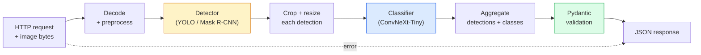

# 打造一條完整的視覺管線 —— 總結專案

> 一套上線的視覺系統，是一連串模型與規則用資料契約縫起來的東西。零件在本階段都已經備齊了；這個總結專案負責把它們端到端接起來。

**類型：** 實作
**程式語言：** Python
**先修單元：** 階段 4 · 01-15
**時間：** 約 120 分鐘

## 學習目標

- 設計一條上線用的視覺管線：偵測物件、對它們分類、輸出結構化 JSON —— 而且每一條失敗路徑都有處理
- 把一個偵測器（Mask R-CNN 或 YOLO）、一個分類器（ConvNeXt-Tiny）與一份資料契約（Pydantic）接進同一個服務裡
- 對端到端管線做效能量測，找出第一個瓶頸（通常是前處理，然後是偵測器）
- 交付一個最小的 FastAPI 服務：接收上傳的影像、跑完管線，回傳帶有分類結果的偵測框

## 問題所在

單一的視覺模型很有用；但視覺產品是一整串模型。零售貨架稽核是偵測器加上商品分類器，再加上一條價格 OCR 管線。自動駕駛是 2D 偵測器加 3D 偵測器加分割器加追蹤器加規劃器。醫療初篩是分割器加上區域分類器，再加上一套給臨床醫師用的介面。

把這些串接起來，正是區分一個 ML 原型與一個產品的那部分工作。模型之間的每一個介面，都是一個新的 bug 落腳處。每一次座標轉換、每一次正規化、每一次遮罩縮放，都是靜默失敗的候選人。一條管線的強度，等於它最弱的那個介面。

這個總結專案要搭出最小可行的管線：偵測 + 分類 + 結構化輸出 + 一層服務。階段 4 的其他一切都能插進這個骨架：把 Mask R-CNN 換成 YOLOv8、加一顆 OCR head、加一條分割分支、加一個追蹤器。架構是穩定的；零件是可插拔的。

## 核心概念

### 這條管線



七個階段。兩個模型階段很貴；bug 住在其他五個階段裡。

### 用 Pydantic 立資料契約

每一個模型邊界都變成一個有型別的物件。這會把靜默失敗變成大聲喊出來的失敗。

```
Detection(
    box: tuple[float, float, float, float],   # (x1, y1, x2, y2), absolute pixels
    score: float,                              # [0, 1]
    class_id: int,                             # from detector's label map
    mask: Optional[list[list[int]]],           # RLE-encoded if present
)

PipelineResult(
    image_id: str,
    detections: list[Detection],
    classifications: list[Classification],
    inference_ms: float,
)
```

當偵測器回傳的框是 `(cx, cy, w, h)` 而不是 `(x1, y1, x2, y2)`，Pydantic 的驗證會在邊界上就失敗，你會立刻知道，而不是去追一段下游裁切為什麼靜靜地回傳了空區域。

### 延遲跑到哪裡去了

幾乎每一條視覺管線都成立三件事：

1. **前處理常常是最大的單一區塊。** 解碼 JPEG、轉換色彩空間、縮放 —— 這些吃 CPU，又很容易被忽略。
2. **偵測器吃掉大部分 GPU 時間。** GPU 時間有 70-90% 花在偵測的前向傳播上。
3. **後處理（NMS、RLE 編解碼）在 GPU 上很便宜，在 CPU 上很貴。** 永遠要拿實際的目標環境來做剖析。

知道這個分布，才能把最佳化變成一份有優先序的清單。

### 失效模式

- **偵測結果為空** —— 回傳空清單，不要當掉。記錄下來。
- **超出邊界的框** —— 裁切之前先夾限（clamp）到影像尺寸。
- **太小的裁切區** —— 邊長小於分類器最小輸入的框，就跳過分類。
- **上傳的檔案損毀** —— 回 400 並附上一個具體的錯誤碼，不是 500。
- **模型載入失敗** —— 在服務啟動時就失敗，不要等到第一個請求進來。

一條上線的管線會逐一處理這些狀況，而不是寫一個通用的 `try/except` 把失敗藏起來。每一種失敗都有自己的名稱代碼與回應。

### 批次化

一個上線的服務要服務多個客戶端。把跨請求的偵測與分類批次化，可以把吞吐量翻上去。代價是：為了等一個批次填滿而多出來的延遲。典型的設定是：最多收集 20ms 的請求，湊成一批處理，再把回應分送回去。`torchserve` 與 `triton` 原生就做這件事；負載可預測的小型服務則會自己寫一個 micro-batcher。

## 動手實作

### 步驟 1：資料契約

```python
from pydantic import BaseModel, Field
from typing import List, Optional, Tuple

class Detection(BaseModel):
    box: Tuple[float, float, float, float]
    score: float = Field(ge=0, le=1)
    class_id: int = Field(ge=0)
    mask_rle: Optional[str] = None


class Classification(BaseModel):
    detection_index: int
    class_id: int
    class_name: str
    score: float = Field(ge=0, le=1)


class PipelineResult(BaseModel):
    image_id: str
    detections: List[Detection]
    classifications: List[Classification]
    inference_ms: float
```

五秒鐘的程式碼，在任何一條認真的管線上都能省下一小時的除錯。

### 步驟 2：一個最小的 Pipeline 類別

```python
import time
import numpy as np
import torch
from PIL import Image

class VisionPipeline:
    def __init__(self, detector, classifier, class_names,
                 device="cpu", min_crop=32):
        self.detector = detector.to(device).eval()
        self.classifier = classifier.to(device).eval()
        self.class_names = class_names
        self.device = device
        self.min_crop = min_crop

    def preprocess(self, image):
        """
        image: PIL.Image or np.ndarray (H, W, 3) uint8
        returns: CHW float tensor on device
        """
        if isinstance(image, Image.Image):
            image = np.asarray(image.convert("RGB"))
        tensor = torch.from_numpy(image).permute(2, 0, 1).float() / 255.0
        return tensor.to(self.device)

    @torch.no_grad()
    def detect(self, image_tensor):
        return self.detector([image_tensor])[0]

    @torch.no_grad()
    def classify(self, crops):
        if len(crops) == 0:
            return []
        batch = torch.stack(crops).to(self.device)
        logits = self.classifier(batch)
        probs = logits.softmax(-1)
        scores, cls = probs.max(-1)
        return list(zip(cls.tolist(), scores.tolist()))

    def run(self, image, image_id="anonymous"):
        t0 = time.perf_counter()
        tensor = self.preprocess(image)
        det = self.detect(tensor)

        crops = []
        detections = []
        valid_indices = []
        for i, (box, score, cls) in enumerate(zip(det["boxes"], det["scores"], det["labels"])):
            x1, y1, x2, y2 = [max(0, int(b)) for b in box.tolist()]
            x2 = min(x2, tensor.shape[-1])
            y2 = min(y2, tensor.shape[-2])
            detections.append(Detection(
                box=(x1, y1, x2, y2),
                score=float(score),
                class_id=int(cls),
            ))
            if (x2 - x1) < self.min_crop or (y2 - y1) < self.min_crop:
                continue
            crop = tensor[:, y1:y2, x1:x2]
            crop = torch.nn.functional.interpolate(
                crop.unsqueeze(0),
                size=(224, 224),
                mode="bilinear",
                align_corners=False,
            )[0]
            crops.append(crop)
            valid_indices.append(i)

        class_preds = self.classify(crops)

        classifications = []
        for valid_idx, (cls_id, cls_score) in zip(valid_indices, class_preds):
            classifications.append(Classification(
                detection_index=valid_idx,
                class_id=int(cls_id),
                class_name=self.class_names[cls_id],
                score=float(cls_score),
            ))

        return PipelineResult(
            image_id=image_id,
            detections=detections,
            classifications=classifications,
            inference_ms=(time.perf_counter() - t0) * 1000,
        )
```

每一個介面都有型別。每一條失敗路徑都有一個明確的處理決定。

### 步驟 3：接上偵測器與分類器

```python
from torchvision.models.detection import maskrcnn_resnet50_fpn_v2
from torchvision.models import convnext_tiny

# Use ImageNet-pretrained weights for a realistic pipeline without training
detector = maskrcnn_resnet50_fpn_v2(weights="DEFAULT")
classifier = convnext_tiny(weights="DEFAULT")
class_names = [f"imagenet_class_{i}" for i in range(1000)]

pipe = VisionPipeline(detector, classifier, class_names)

# Smoke test with a synthetic image
test_image = (np.random.rand(400, 600, 3) * 255).astype(np.uint8)
result = pipe.run(test_image, image_id="demo")
print(result.model_dump_json(indent=2)[:500])
```

### 步驟 4：FastAPI 服務

```python
from fastapi import FastAPI, UploadFile, HTTPException
from io import BytesIO

app = FastAPI()
pipe = None  # initialised on startup

@app.on_event("startup")
def load():
    global pipe
    detector = maskrcnn_resnet50_fpn_v2(weights="DEFAULT").eval()
    classifier = convnext_tiny(weights="DEFAULT").eval()
    pipe = VisionPipeline(detector, classifier, class_names=[f"c{i}" for i in range(1000)])

@app.post("/detect")
async def detect_endpoint(file: UploadFile):
    if file.content_type not in {"image/jpeg", "image/png", "image/webp"}:
        raise HTTPException(status_code=400, detail="unsupported image type")
    data = await file.read()
    try:
        img = Image.open(BytesIO(data)).convert("RGB")
    except Exception:
        raise HTTPException(status_code=400, detail="cannot decode image")
    result = pipe.run(img, image_id=file.filename or "upload")
    return result.model_dump()
```

用 `uvicorn main:app --host 0.0.0.0 --port 8000` 啟動。用 `curl -F 'file=@dog.jpg' http://localhost:8000/detect` 測試。

### 步驟 5：量測整條管線

```python
import time

def benchmark(pipe, num_runs=20, image_size=(400, 600)):
    img = (np.random.rand(*image_size, 3) * 255).astype(np.uint8)
    pipe.run(img)  # warm up

    stages = {"preprocess": [], "detect": [], "classify": [], "total": []}
    for _ in range(num_runs):
        t0 = time.perf_counter()
        tensor = pipe.preprocess(img)
        t1 = time.perf_counter()
        det = pipe.detect(tensor)
        t2 = time.perf_counter()
        crops = []
        for box in det["boxes"]:
            x1, y1, x2, y2 = [max(0, int(b)) for b in box.tolist()]
            x2 = min(x2, tensor.shape[-1])
            y2 = min(y2, tensor.shape[-2])
            if (x2 - x1) >= pipe.min_crop and (y2 - y1) >= pipe.min_crop:
                crop = tensor[:, y1:y2, x1:x2]
                crop = torch.nn.functional.interpolate(
                    crop.unsqueeze(0), size=(224, 224), mode="bilinear", align_corners=False
                )[0]
                crops.append(crop)
        pipe.classify(crops)
        t3 = time.perf_counter()
        stages["preprocess"].append((t1 - t0) * 1000)
        stages["detect"].append((t2 - t1) * 1000)
        stages["classify"].append((t3 - t2) * 1000)
        stages["total"].append((t3 - t0) * 1000)

    for stage, times in stages.items():
        times.sort()
        print(f"{stage:12s}  p50={times[len(times)//2]:7.1f} ms  p95={times[int(len(times)*0.95)]:7.1f} ms")
```

在 CPU 上的典型輸出：preprocess 約 3 ms、detect 300-500 ms、classify 20-40 ms、總計 350-550 ms。在 GPU 上，detect 是 20-40 ms，於是 preprocess 與 classify 在相對比重上開始變得重要。

## 框架應用

上線用的模板都會收斂到同樣的結構，另外再加上：

- **模型版本控管** —— 一律把模型名稱與權重的雜湊值記在回應裡。
- **每個請求的 trace ID** —— 把每個請求在每個階段的耗時都記下來，這樣才能把慢回應對上是哪個階段慢。
- **退路** —— 如果分類器逾時，就回傳沒有分類結果的偵測框，而不是讓整個請求失敗。
- **安全性過濾** —— NSFW／PII 過濾器在分類之後、回應離開服務之前執行。
- **批次端點** —— 一個 `/detect_batch`，接收一份影像 URL 清單來做批量處理。

要正式上線提供服務，`torchserve`、`Triton Inference Server` 與 `BentoML` 都內建處理批次化、版本控管、指標與健康檢查。直接跑 `FastAPI` 對原型與小規模產品來說是夠的。

## 產出交付

這一課會產出：

- `outputs/prompt-vision-service-shape-reviewer.md` —— 一段提示詞，會檢視一個視覺服務的程式碼有沒有違反契約／回應結構，並指出第一個會壞事的 bug。
- `outputs/skill-pipeline-budget-planner.md` —— 一份技能文件，給定目標延遲與吞吐量，為管線的每個階段分配時間預算，並標出哪個階段會最先超出預算。

## 練習

1. **（簡單）** 拿任何一個公開資料集裡的 10 張影像跑這條管線。回報每個階段的平均耗時，以及每張影像偵測數量的分布。
2. **（中等）** 在 `Detection` 裡加一個遮罩輸出欄位，並用 RLE 編碼。驗證即使是一張有 10 個物件的影像，JSON 也維持在 1MB 以下。
3. **（困難）** 在分類器前面加一個 micro-batcher：最多收集 10 ms 的裁切區，用一次 GPU 呼叫全部分類完，再依請求把結果分回去。量測在每秒 5 個並行請求下的吞吐量增益，以及多出來的延遲。

## 關鍵術語

| 術語 | 大家怎麼說 | 實際上是什麼 |
|------|----------------|----------------------|
| 管線 | 「這套系統」 | 一條有順序的前處理、推論、後處理步驟鏈，每兩步之間都有一個有型別的介面 |
| 資料契約 | 「schema」 | 用 Pydantic／dataclass 寫下的定義，每個階段的輸入與輸出都要符合；在邊界上就抓到整合 bug |
| 前處理 | 「模型之前那些」 | 解碼、色彩轉換、縮放、正規化；通常是最大的 CPU 時間消耗源 |
| 後處理 | 「模型之後那些」 | NMS、遮罩縮放、閾值化、RLE 編碼；在 GPU 上很便宜，在 CPU 上很貴 |
| Micro-batcher | 「先收集再送前向」 | 一個聚合器，固定等一個時間窗收多個請求，再跑單一次批次的前向傳播 |
| Trace ID | 「請求 id」 | 每個請求一個識別碼，在每個階段都記錄下來，這樣慢請求才能被端到端追出來 |
| 失敗代碼 | 「有名字的錯誤」 | 每一類失敗都有專屬的錯誤碼，而不是通用的 500；讓客戶端能寫重試邏輯 |
| 健康檢查 | 「readiness probe」 | 一個很便宜的端點，回報服務現在能不能回答請求；負載平衡器靠它做判斷 |

## 延伸閱讀

- [Full Stack Deep Learning — Deploying Models](https://fullstackdeeplearning.com/course/2022/lecture-5-deployment/) —— 上線 ML 部署最經典的一份總覽
- [BentoML docs](https://docs.bentoml.com) —— 一套服務框架，內含批次化、版本控管與指標
- [torchserve docs](https://pytorch.org/serve/) —— PyTorch 官方的服務函式庫
- [NVIDIA Triton Inference Server](https://developer.nvidia.com/triton-inference-server) —— 高吞吐量的服務方案，支援批次化與多模型
