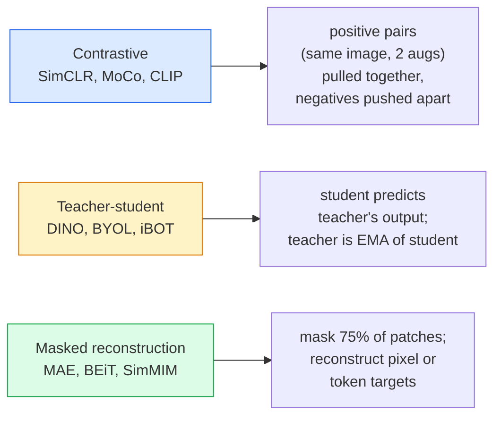

# 自監督視覺——SimCLR、DINO、MAE

> 標籤是監督式視覺的瓶頸。自監督預訓練把它移掉：從 1 億張沒有標籤的影像學出視覺特徵，再用 1 萬張有標籤的影像微調。

**類型：** 學習 + 實作
**程式語言：** Python
**先修單元：** 階段 4 · 04（影像分類）、階段 4 · 14（ViT）
**時間：** 約 75 分鐘

## 學習目標

- 梳理三大自監督家族——對比學習（SimCLR）、教師／學生（DINO）、遮罩重建（MAE）——並說出各自最佳化的目標是什麼
- 從零實作 InfoNCE 損失函式，並解釋為什麼批次大小 512 有效、32 卻失敗
- 解釋 MAE 的 75% 遮罩比例為何不是隨意挑的，以及它跟 BERT 在文字上用的 15% 差在哪裡
- 用 DINOv2 或 MAE 的 ImageNet 檢查點做線性探測與 zero-shot 檢索

## 問題所在

監督式 ImageNet 有 130 萬張標好的影像，標註成本估計是 1000 萬美元。醫療與工業資料集規模更小，標註更貴。每個視覺團隊都會問同一件事：我們能不能先在便宜的無標籤資料上預訓練——YouTube 影格、網路爬取、網路攝影機錄影、衛星掃描——再用一小批有標籤的資料微調？

自監督學習就是答案。一個在 LAION 或 JFT 上訓練的現代自監督 ViT，經過微調後可以追平甚至超過監督式 ImageNet 的準確率。它遷移到下游任務（偵測、分割、深度估計）的表現也比監督式預訓練更好。DINOv2（Meta，2023）與 MAE（Meta，2022）是目前生產環境取得可遷移視覺特徵的預設選擇。

觀念上的轉變在於：前置任務（pretext task）——你訓練模型去做的那件事——不必等於下游任務。真正重要的是它能逼模型學到有用的特徵。預測灰階影像的顏色、把影像轉一個角度再要模型分類轉了多少、遮住影像區塊再重建——這些都行得通。能夠隨規模擴展的有三種：對比學習、教師／學生蒸餾、遮罩重建。

## 核心概念

### 三大家族



### 對比學習（SimCLR）

拿一張影像，套兩次隨機資料增強，得到兩個視圖。兩個都餵進同一個編碼器加上一個投影頭。最小化一個這樣說的損失函式：「這兩個嵌入應該靠近」，以及「這個嵌入應該遠離批次裡其他每一張影像的嵌入」。

```
Loss for positive pair (z_i, z_j) among 2N views per batch:

   L_ij = -log( exp(sim(z_i, z_j) / tau) / sum_k in batch \ {i} exp(sim(z_i, z_k) / tau) )

sim = cosine similarity
tau = temperature (0.1 standard)
```

這就是 InfoNCE 損失函式。它需要每個正樣本都配上大量負樣本，所以批次大小很關鍵——SimCLR 需要 512 到 8192。MoCo 引入了一個裝著過往批次的動量佇列，把負樣本數量跟批次大小解耦。

### 教師／學生（DINO）

兩個架構相同的網路：學生網路與教師網路。教師是學生權重的指數移動平均（EMA）。兩者都看同一張影像的增強視圖。學生的輸出被訓練去對上教師的輸出——沒有明確的負樣本。

```
loss = CE( student_output(view_1),  teacher_output(view_2) )
     + CE( student_output(view_2),  teacher_output(view_1) )

teacher_weights = m * teacher_weights + (1 - m) * student_weights   (m ≈ 0.996)
```

它為什麼不會崩潰成「一律輸出常數」：教師的輸出會先做中心化（減掉每個維度的平均值）再做銳化（除以一個很小的溫度參數）。中心化避免某一個維度一手遮天；銳化避免輸出崩潰成均勻分布。

DINO 就是 DINOv2 放大的那個東西，資料是 1.42 億張經過篩選的影像。訓出來的特徵是目前 zero-shot 視覺檢索與稠密預測的 SOTA。

### 遮罩重建（MAE）

把一個 ViT 輸入的 75% 影像區塊遮掉。只把可見的那 25% 送過編碼器。一個小型解碼器接收編碼器的輸出，加上被遮住位置的遮罩詞元，然後被訓練去重建被遮住區塊的像素。

```
Encoder:  visible 25% of patches -> features
Decoder:  features + mask tokens at masked positions -> reconstructed pixels
Loss:     MSE between reconstructed and original pixels on masked patches only
```

讓 MAE 行得通的關鍵設計選擇：

- **75% 遮罩比例**——很高。這逼編碼器去學語意特徵；只重建 25% 幾乎是白送的（相鄰像素相關性太高，一個 CNN 就能輕鬆搞定）。
- **不對稱的編碼器／解碼器**——大的 ViT 編碼器只看得到可見的影像區塊；重建交給一個小解碼器（8 層、512 維）。預訓練速度比土法煉鋼的 BEiT 快 3 倍。
- **在像素空間重建**——比 BEiT 那種詞元化的目標更簡單，而且在 ViT 上效果更好。

預訓練結束後把解碼器丟掉。編碼器就是特徵抽取器。

### 為什麼是 75% 而不是 15%

BERT 遮掉 15% 的詞元。MAE 遮掉 75%。差別在資訊密度。

- 自然語言每個詞元的熵很高。預測 15% 的詞元依然很難，因為每個被遮住的位置都有很多說得通的填法。
- 影像區塊的熵很低——沒被遮住的鄰域常常幾乎完全決定了被遮區塊的像素。要讓預測這件事非得靠語意理解才做得到，你就得遮得很兇。

75% 高到單純的空間外插已經解不了這個任務；編碼器非得把影像的內容表示出來不可。

### 線性探測評估

自監督預訓練之後，標準的評估方式是**線性探測**：凍結編碼器，在它上面用 ImageNet 標籤訓練一個線性分類器。回報 top-1 準確率。

- SimCLR ResNet-50：約 71%（2020）
- DINO ViT-S/16：約 77%（2021）
- MAE ViT-L/16：約 76%（2022）
- DINOv2 ViT-g/14：約 86%（2023）

線性探測是對特徵品質的純粹量測；微調通常能再多 2 到 5 個百分點，但同時也把分類頭重新訓練的效果混了進來。

```figure
data-augmentation
```

## 動手實作

### 步驟 1：雙視圖資料增強流程

```python
import torch
import torchvision.transforms as T

two_view_train = lambda: T.Compose([
    T.RandomResizedCrop(96, scale=(0.2, 1.0)),
    T.RandomHorizontalFlip(),
    T.ColorJitter(0.4, 0.4, 0.4, 0.1),
    T.RandomGrayscale(p=0.2),
    T.ToTensor(),
])


class TwoViewDataset(torch.utils.data.Dataset):
    def __init__(self, base):
        self.base = base
        self.aug = two_view_train()

    def __len__(self):
        return len(self.base)

    def __getitem__(self, i):
        img, _ = self.base[i]
        v1 = self.aug(img)
        v2 = self.aug(img)
        return v1, v2
```

每次 __getitem__ 都回傳同一張影像的兩個增強視圖；不需要標籤。

### 步驟 2：InfoNCE 損失函式

```python
import torch.nn.functional as F

def info_nce(z1, z2, tau=0.1):
    """
    z1, z2: (N, D) L2-normalised embeddings of paired views
    """
    N, D = z1.shape
    z = torch.cat([z1, z2], dim=0)  # (2N, D)
    sim = z @ z.T / tau              # (2N, 2N)

    mask = torch.eye(2 * N, dtype=torch.bool, device=z.device)
    sim = sim.masked_fill(mask, float("-inf"))

    targets = torch.cat([torch.arange(N, 2 * N), torch.arange(0, N)]).to(z.device)
    return F.cross_entropy(sim, targets)
```

呼叫之前先把嵌入做 L2 正規化。`tau=0.1` 是 SimCLR 的預設值；再低會讓損失更銳利，也需要更多負樣本。

### 步驟 3：InfoNCE 健全性檢查

```python
z1 = F.normalize(torch.randn(16, 32), dim=-1)
z2 = z1.clone()
loss_same = info_nce(z1, z2, tau=0.1).item()
z2_random = F.normalize(torch.randn(16, 32), dim=-1)
loss_random = info_nce(z1, z2_random, tau=0.1).item()
print(f"InfoNCE with identical pairs:  {loss_same:.3f}")
print(f"InfoNCE with random pairs:     {loss_random:.3f}")
```

完全相同的配對應該給出很低的損失（批次大、溫度參數低的時候會接近 0）。隨機配對在 16 對的批次下應該給出 log(2N-1) = ~log(31) = ~3.4。

### 步驟 4：MAE 風格的遮罩

```python
def random_mask_indices(num_patches, mask_ratio=0.75, seed=0):
    g = torch.Generator().manual_seed(seed)
    n_keep = int(num_patches * (1 - mask_ratio))
    perm = torch.randperm(num_patches, generator=g)
    visible = perm[:n_keep]
    masked = perm[n_keep:]
    return visible.sort().values, masked.sort().values


num_patches = 196
visible, masked = random_mask_indices(num_patches, mask_ratio=0.75)
print(f"visible: {len(visible)} / {num_patches}")
print(f"masked:  {len(masked)} / {num_patches}")
```

簡單、快，而且給定同一個 seed 就是決定性的。真正的 MAE 實作會把這件事批次化，並且保留每個樣本各自的遮罩。

## 框架應用

DINOv2 是 2026 年的生產標準：

```python
import torch
from transformers import AutoImageProcessor, AutoModel

processor = AutoImageProcessor.from_pretrained("facebook/dinov2-base")
model = AutoModel.from_pretrained("facebook/dinov2-base")
model.eval()

# Per-image embeddings for zero-shot retrieval
with torch.no_grad():
    inputs = processor(images=[pil_image], return_tensors="pt")
    outputs = model(**inputs)
    embedding = outputs.last_hidden_state[:, 0]  # CLS token
```

訓出來的 768 維嵌入是現代影像檢索、稠密對應與 zero-shot 遷移流程的主幹。要微調到某個下游任務，通常一個線性頭就夠了。

要做影像—文字嵌入，SigLIP 或 OpenCLIP 是對應的選擇；要做 MAE 風格的微調，`timm` 儲存庫附上了每一個 MAE 檢查點。

## 產出交付

本單元的產出：

- `outputs/prompt-ssl-pretraining-picker.md` —— 一個提示詞，依資料集規模、算力與下游任務，在 SimCLR／MAE／DINOv2 之間做選擇。
- `outputs/skill-linear-probe-runner.md` —— 一項技能，為任何凍結的編碼器加上有標籤資料集，寫出線性探測評估。

## 練習

1. **（簡單）** 驗證：對於對齊良好的嵌入，調低溫度參數時 InfoNCE 損失會下降；對於隨機嵌入，調低溫度參數時損失會上升。畫出 `tau in [0.05, 0.1, 0.2, 0.5]` 對損失的圖。
2. **（中等）** 實作一個 DINO 風格的中心化緩衝區。證明少了中心化，學生網路會在幾個 epoch 內崩潰成一個常數向量。
3. **（困難）** 用第 10 單元的 TinyUNet 當主幹，在 CIFAR-100 上訓練 MAE。回報第 10、50、200 個 epoch 的線性探測準確率。證明在同一個 1,000 張影像的子集上，MAE 預訓練過的線性探測會贏過從零開始的監督式線性探測。

## 關鍵術語

| 術語 | 大家怎麼說 | 實際上是什麼 |
|------|----------------|----------------------|
| 自監督 | 「不用標籤」 | 一個從無標籤資料產生出有用表示的前置任務 |
| 前置任務 | 「假任務」 | 自監督學習期間使用的目標（重建影像區塊、對齊視圖）；預訓練完就丟掉 |
| 線性探測 | 「凍結編碼器 + 線性頭」 | 標準的自監督評估法：只在凍結的特徵上訓練一個線性分類器 |
| InfoNCE | 「對比損失」 | 對餘弦相似度做 softmax；正樣本配對是目標類別，其餘全是負樣本 |
| EMA 教師 | 「移動平均教師」 | 權重是學生權重指數移動平均的教師網路；BYOL、MoCo、DINO 都用它 |
| 遮罩比例 | 「藏起來的影像區塊百分比」 | MAE 期間被遮住的影像區塊比例；視覺用 75%，文字用 15% |
| 表示崩潰 | 「輸出常數」 | 自監督的失敗模式：編碼器對所有輸入都輸出同一個常數向量；靠中心化、銳化或負樣本來避免 |
| DINOv2 | 「生產級自監督主幹」 | Meta 2023 年的自監督 ViT；2026 年最強的通用影像特徵 |

## 延伸閱讀

- [SimCLR (Chen et al., 2020)](https://arxiv.org/abs/2002.05709) —— 對比學習的參考文獻
- [DINO (Caron et al., 2021)](https://arxiv.org/abs/2104.14294) —— 帶動量、中心化與銳化的教師／學生
- [MAE (He et al., 2022)](https://arxiv.org/abs/2111.06377) —— ViT 的遮罩自編碼器預訓練
- [DINOv2 (Oquab et al., 2023)](https://arxiv.org/abs/2304.07193) —— 把自監督 ViT 擴展到生產級特徵
