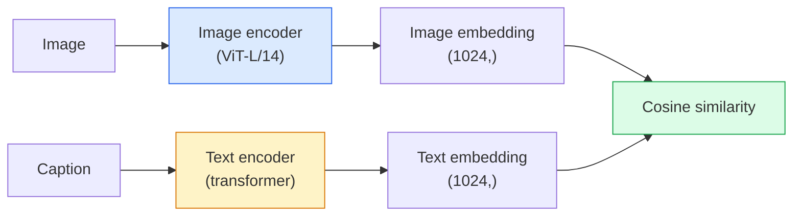

# 開放詞彙視覺 —— CLIP

> 把一個影像編碼器和一個文字編碼器一起訓練，讓相配的（影像、圖說）配對落在同一個共享空間裡的同一個點上。整個訣竅就是這樣。

**類型：** 實作 + 應用
**程式語言：** Python
**先修單元：** 階段 4 單元 14（ViT）、階段 4 單元 17（自監督學習）
**時間：** 約 45 分鐘

## 學習目標

- 說明 CLIP 的雙塔架構與對比訓練目標
- 直接拿預訓練好的 CLIP（或 SigLIP）做零樣本分類，完全不需要任何針對任務的訓練
- 從零實作零樣本分類：編碼類別提示詞、計算餘弦相似度、取 argmax
- 分辨 CLIP、SigLIP、OpenCLIP 與 LLaVA／LLaMA-vision 模型 —— 在 2026 年各自是拿來做什麼的

## 問題所在

傳統分類器是封閉詞彙的：一個 1000 類的 ImageNet 模型只能預測那 1000 個標籤。每多一個新類別，就要有標註資料，還要重新訓練一個分類頭。

CLIP（Radford et al., OpenAI 2021）證明了，用從網路上爬來的 4 億組（影像、圖說）配對訓練，能得到一個在推論時可以分類到任何一組類別的模型，而那組類別純粹用自然語言描述。你要給它一個新類別，寫一句話就行。

這個能力 —— 零樣本遷移 —— 就是每一套現代視覺系統都從 CLIP 家族的檢查點起步的原因。偵測（Grounding DINO、OWL-ViT）、分割（CLIPSeg、SAM）、檢索、內容審核、VLM，以及文字生圖，全都建立在 CLIP 式的聯合嵌入之上。

## 核心概念

### 雙塔



兩個編碼器最後都接一個線性投影，投到相同的嵌入維度（CLIP-B/32 是 512，CLIP-L/14 是 1024）。做 L2 正規化，然後計算餘弦相似度。

### 訓練目標

給定一批 N 組（影像、圖說）配對，建一個 NxN 的相似度矩陣。訓練兩個編碼器，讓對角線（相配的配對）相似度高，非對角線（不相配的）相似度低。

```
sim_matrix = image_embeddings @ text_embeddings.T / tau

loss_i2t = cross_entropy(sim_matrix,       targets=arange(N))
loss_t2i = cross_entropy(sim_matrix.T,     targets=arange(N))
loss = (loss_i2t + loss_t2i) / 2
```

之所以對稱，是因為影像找文字和文字找影像兩個方向的檢索都該成立。`tau`（溫度參數）通常當成一個純量參數學出來，初始化為 0.07。

### SigLIP：更好的損失函式

SigLIP（Zhai et al., 2023）把 softmax 換成逐配對的 sigmoid：

```
loss = mean over pairs of log(1 + exp(-y_ij * sim_ij))
y_ij = +1 if matching, -1 otherwise
```

逐配對的損失函式擺脫了 CLIP 所需要的批次層級正規化。SigLIP 在小批次大小下訓練得更好，而在同樣的資料量下能追平甚至超過 CLIP。

### 零樣本分類

給定一個訓練好的 CLIP：

1. 對每個類別，組出一句提示詞："a photo of a {class}"。
2. 用文字編碼器編碼所有類別提示詞 -> `T`，形狀為 (C, d)。
3. 編碼測試影像 -> `I`，形狀為 (1, d)。
4. 相似度 = `I @ T.T`，形狀為 (1, C)。
5. 取 argmax -> 預測出的類別。

提示詞工程有差。OpenAI 為 ImageNet 發表了 80 個提示詞模板（"a photo of a {}"、"a blurry photo of a {}"、"a sketch of a {}" 等等）。把每個類別在所有模板下的嵌入平均起來，top-1 準確率會多 1 到 3%。

### CLIP 式模型在 2026 年用在哪裡

- **零樣本分類** —— 直接用。
- **影像檢索** —— 所有影像先編碼一次，查詢在推論時才嵌入。
- **文字條件偵測** —— Grounding DINO、OWL-ViT 把一座 CLIP 文字塔包在偵測器外面。
- **文字條件分割** —— CLIPSeg；SAM 透過 CLIP 接受文字提示詞當輸入。
- **VLM** —— LLaVA、Qwen-VL、InternVL 把一個 CLIP 家族的視覺編碼器接進 LLM。
- **文字生圖** —— Stable Diffusion、DALL-E 3 以 CLIP 文字嵌入作為條件。

一旦有了共享嵌入空間，每一個視覺 + 語言任務都變成一次距離計算。

```figure
clip-contrastive
```

## 動手實作

### 步驟 1：一個迷你雙塔模型

真正的 CLIP 是 ViT + transformer。本單元的兩座塔是跑在預先抽好的特徵上的小型 MLP，好讓訓練訊號在 CPU 上就看得出來。

```python
import torch
import torch.nn as nn
import torch.nn.functional as F


class TwoTower(nn.Module):
    def __init__(self, img_in=128, txt_in=64, emb=64):
        super().__init__()
        self.image_proj = nn.Sequential(nn.Linear(img_in, 128), nn.ReLU(), nn.Linear(128, emb))
        self.text_proj = nn.Sequential(nn.Linear(txt_in, 128), nn.ReLU(), nn.Linear(128, emb))
        self.logit_scale = nn.Parameter(torch.ones([]) * 2.6592)  # ln(1/0.07)

    def forward(self, img_feats, txt_feats):
        i = F.normalize(self.image_proj(img_feats), dim=-1)
        t = F.normalize(self.text_proj(txt_feats), dim=-1)
        return i, t, self.logit_scale.exp()
```

兩個投影、輸出維度共享、溫度參數是學出來的。形狀和真正的 CLIP API 一模一樣。

### 步驟 2：對比損失函式

```python
def clip_loss(image_emb, text_emb, logit_scale):
    N = image_emb.size(0)
    sim = logit_scale * image_emb @ text_emb.T
    targets = torch.arange(N, device=sim.device)
    l_i = F.cross_entropy(sim, targets)
    l_t = F.cross_entropy(sim.T, targets)
    return (l_i + l_t) / 2
```

對稱的。logit_scale 越高 = softmax 越尖銳 = 越有信心，但有不穩定的風險。

### 步驟 3：零樣本分類器

```python
@torch.no_grad()
def zero_shot_classify(model, image_feats, class_text_feats, class_names):
    """
    image_feats:      (N, img_in)
    class_text_feats: (C, txt_in)   one averaged embedding per class
    """
    i = F.normalize(model.image_proj(image_feats), dim=-1)
    t = F.normalize(model.text_proj(class_text_feats), dim=-1)
    sim = i @ t.T
    pred = sim.argmax(dim=-1)
    return [class_names[p] for p in pred.tolist()]
```

每個步驟一行。這就是搭配生產級 CLIP 檢查點時用的那套零樣本流程，一字不差。

### 步驟 4：健全性檢查

```python
torch.manual_seed(0)
model = TwoTower()

img = torch.randn(8, 128)
txt = torch.randn(8, 64)
i, t, scale = model(img, txt)
loss = clip_loss(i, t, scale)
print(f"batch size: {i.size(0)}   loss: {loss.item():.3f}")
```

對一個隨機初始化的模型，損失應該接近 `log(N) = log(8) = 2.08` —— 那是還沒學到任何結構時，對稱交叉熵應有的值。

## 框架應用

2026 年社群的預設選擇是 OpenCLIP：

```python
import open_clip
import torch
from PIL import Image

model, _, preprocess = open_clip.create_model_and_transforms("ViT-B-32", pretrained="laion2b_s34b_b79k")
tokenizer = open_clip.get_tokenizer("ViT-B-32")

image = preprocess(Image.open("dog.jpg")).unsqueeze(0)
text = tokenizer(["a photo of a dog", "a photo of a cat", "a photo of a car"])

with torch.no_grad():
    image_features = model.encode_image(image)
    text_features = model.encode_text(text)
    image_features = image_features / image_features.norm(dim=-1, keepdim=True)
    text_features = text_features / text_features.norm(dim=-1, keepdim=True)
    probs = (100.0 * image_features @ text_features.T).softmax(dim=-1)

print(probs)
```

SigLIP 比較新，在小規模下訓練得更好，新專案優先選它：`google/siglip-base-patch16-224`。Hugging Face 上兩者都有。

## 產出交付

本單元產出：

- `outputs/prompt-zero-shot-class-picker.md` —— 一段提示詞：給定一份類別清單與一個領域，為零樣本 CLIP 設計類別模板。
- `outputs/skill-image-text-retriever.md` —— 一項技能：用任何 CLIP 檢查點建一個影像嵌入索引，支援用文字查詢與用影像查詢。

## 練習

1. **（簡單）** 用預訓練的 OpenCLIP ViT-B/32，搭配那組 80 個模板的提示詞，在 CIFAR-10 上做零樣本分類。回報 top-1 準確率；應該會落在 85 到 90% 左右。
2. **（中等）** 在同一個 CIFAR-10 任務上，比較單一模板（"a photo of a {}"）與 80 個模板平均後的嵌入。量化兩者的差距，並解釋模板為什麼有幫助。
3. **（困難）** 建一個零樣本影像檢索索引：用 CLIP 嵌入 1,000 張影像、建一個 FAISS 索引，再用自然語言描述查詢。針對你手寫的 20 個保留查詢，回報檢索的 recall@5。

## 關鍵術語

| 術語 | 大家怎麼說 | 實際上是什麼 |
|------|----------------|----------------------|
| 雙塔 | 「雙編碼器」 | 分開的影像編碼器與文字編碼器，各自以一個輸出維度相同的投影頭結尾 |
| 零樣本 | 「不需要針對任務訓練」 | 在推論時分類到只用文字描述的類別；完全沒動到標籤 |
| 溫度參數／logit_scale | 「tau」 | 學出來的純量，在 softmax 之前縮放相似度矩陣 |
| 提示詞模板 | 「A photo of a {}」 | 包在類別名稱外面的自然語言外殼；把多個模板平均起來能拉高零樣本準確率 |
| CLIP | 「影像 + 文字模型」 | 2021 年那個 OpenAI 模型；2026 年這個領域的共通語彙 |
| SigLIP | 「Sigmoid 版的 CLIP」 | 把 softmax 換成逐配對的 sigmoid；在小批次下訓練得更好 |
| OpenCLIP | 「開源復現」 | 社群在 LAION 上訓練出的 CLIP 變體；開源流程的生產環境預設 |
| VLM | 「視覺語言模型」 | 一個 CLIP 家族的編碼器加上一個 LLM，訓練來回答關於影像的問題 |

## 延伸閱讀

- [CLIP: Learning Transferable Visual Models from Natural Language Supervision (Radford et al., 2021)](https://arxiv.org/abs/2103.00020)
- [SigLIP: Sigmoid Loss for Language-Image Pre-Training (Zhai et al., 2023)](https://arxiv.org/abs/2303.15343)
- [OpenCLIP](https://github.com/mlfoundations/open_clip) —— 社群維護的程式庫
- [DINOv2 vs CLIP vs MAE: a features comparison](https://huggingface.co/blog/dinov2) —— HF 的指南，附並列的使用情境對照
