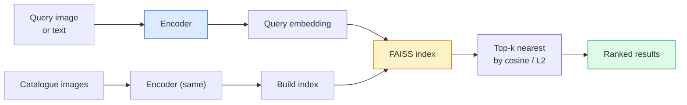

# 影像檢索與度量學習

> 檢索系統靠嵌入空間裡的距離來排序候選項。度量學習就是把那個空間塑形，讓距離代表你要的意思。

**類型：** 實作
**程式語言：** Python
**先修單元：** 階段 4 · 14（ViT）、階段 4 · 18（CLIP）
**時間：** 約 45 分鐘

## 學習目標

- 說明三元組、對比式與代理式（proxy-based）度量學習損失，並為給定的資料集挑出合適的那一個
- 正確實作 L2 正規化與餘弦相似度，並釐清「同一件物品」與「同一個類別」兩種檢索的差別
- 建立 FAISS 索引，用文字與影像查詢它，並針對一組保留的查詢集報告召回率@K
- 把 DINOv2、CLIP 與 SigLIP 當成現成的嵌入骨幹使用，並知道各自在什麼場景勝出

## 問題所在

檢索在生產環境的視覺應用裡無所不在：重複偵測、以圖搜圖、視覺搜尋（「找出相似商品」）、人臉再識別、監控用的行人 re-ID、電商的實例級比對。產品端的問題永遠是同一個：「給我這張查詢影像，把我的商品庫排個序。」

有兩個設計決策決定了整個系統。一是嵌入——由哪個模型產生向量。二是索引——如何在規模下找出最近鄰。到了 2026 年這兩者都已是現成商品（嵌入用 DINOv2，索引用 FAISS），門檻因此被抬高了：真正難的部分是為你的應用定義*什麼才算相似*，然後把嵌入空間塑形到距離與之相符。

這個塑形的工夫就是度量學習。它是個小領域，但槓桿極高。

## 核心概念

### 檢索一覽



### 四大損失家族

| 損失 | 需要什麼 | 優點 | 缺點 |
|------|----------|------|------|
| **對比式（Contrastive）** | （錨點, 正樣本）＋負樣本 | 簡單，任何配對標籤都能用 | 負樣本不夠多時收斂很慢 |
| **三元組（Triplet）** | （錨點, 正樣本, 負樣本） | 直觀；能直接控制邊界 | 困難三元組挖掘的成本很高 |
| **NT-Xent / InfoNCE** | 配對 ＋ 批次內挖掘的負樣本 | 能擴展到大批次 | 需要大批次或動量佇列 |
| **代理式（ProxyNCA）** | 只要類別標籤 | 快、穩定、不用挖掘 | 小資料集上可能過度擬合到代理向量 |

多數生產情境的做法是：先從預訓練骨幹開始，只有當現成的嵌入在你的測試集上表現不夠好時，才加上度量學習的微調。

### 三元組損失的形式化寫法

```
L = max(0, ||f(a) - f(p)||^2 - ||f(a) - f(n)||^2 + margin)
```

把錨點 `a` 拉近正樣本 `p`，推離負樣本 `n`，再用一個 `margin` 確保兩者之間留有間隙。這種三張影像的結構可以推廣到任何相似度排序關係。

挖掘很關鍵：簡單的三元組（`n` 本來就離 `a` 很遠）貢獻的損失是零；只有困難的三元組才能教會網路。半困難挖掘（`n` 比 `p` 遠，但仍落在邊界之內）是 2016 年 FaceNet 的配方，至今仍是主流。

### 餘弦相似度與 L2

兩種度量，兩種慣例：

- **餘弦**：向量之間的夾角。要求嵌入已做 L2 正規化。
- **L2**：歐氏距離。原始或正規化的嵌入都能用，但通常搭配 L2 正規化 ＋ 平方 L2。

對多數現代網路來說兩者是等價的：當 `||a|| = ||b|| = 1` 時，`||a - b||^2 = 2 - 2 cos(a, b)`。挑一個與你的嵌入訓練方式相符的慣例；混用會悄悄改掉「最近」的定義。

### 召回率@K

檢索的標準指標：

```
recall@K = fraction of queries where at least one correct match is in the top K results
```

把 recall@1、@5、@10 並排報告。如果 recall@10 高於 0.95、recall@1 卻低於 0.5，代表嵌入空間的結構是對的，但排序有雜訊——可以試試拉長微調，或加一個重排序步驟。

做重複偵測時，precision@K 更重要，因為每個假陽性都是使用者看得見的錯誤。做視覺搜尋時，召回率@K 才是產品端的訊號。

### 一段話講完 FAISS

Facebook AI Similarity Search，最近鄰搜尋事實上的標準函式庫。有三種索引可選：

- `IndexFlatIP` / `IndexFlatL2` —— 暴力搜尋，精確，不用訓練。用到約 100 萬個向量都還行。
- `IndexIVFFlat` —— 切成 K 個分區，只搜尋最接近的那幾個分區。近似、快，需要訓練資料。
- `IndexHNSW` —— 基於圖，查詢量大時最快，但索引體積也大。

10 萬個向量大概會想用 `IndexFlatIP` 搭餘弦相似度。1000 萬就該用 `IndexIVFFlat`。上億以上則要結合乘積量化（`IndexIVFPQ`）。

### 實例級檢索與類別級檢索

同一個名字底下的兩個非常不同的問題：

- **類別級** —— 「在我的商品庫裡找出貓。」以類別為條件的相似度；現成的 CLIP／DINOv2 嵌入就很好用。
- **實例級** —— 「在我的商品庫裡找出*就是這一件商品*。」需要在同類別、外觀相近的物件之間做細粒度區辨；現成嵌入會表現不足，用度量學習微調才有意義。

挑模型之前，永遠先問清楚你要解的是哪一個。

## 動手實作

### 步驟 1：三元組損失

```python
import torch
import torch.nn.functional as F

def triplet_loss(anchor, positive, negative, margin=0.2):
    d_ap = F.pairwise_distance(anchor, positive, p=2)
    d_an = F.pairwise_distance(anchor, negative, p=2)
    return F.relu(d_ap - d_an + margin).mean()
```

一行就搞定。L2 正規化過或原始的嵌入都能用。

### 步驟 2：半困難挖掘

給定一批嵌入與標籤，為每個錨點找出最困難的半困難負樣本。

```python
def semi_hard_negatives(emb, labels, margin=0.2):
    dist = torch.cdist(emb, emb)
    same_class = labels[:, None] == labels[None, :]
    diff_class = ~same_class
    N = emb.size(0)

    positives = dist.clone()
    positives[~same_class] = float("-inf")
    positives.fill_diagonal_(float("-inf"))
    pos_idx = positives.argmax(dim=1)

    semi_hard = dist.clone()
    semi_hard[same_class] = float("inf")
    d_ap = dist[torch.arange(N), pos_idx].unsqueeze(1)
    semi_hard[dist <= d_ap] = float("inf")
    neg_idx = semi_hard.argmin(dim=1)

    fallback_mask = semi_hard[torch.arange(N), neg_idx] == float("inf")
    if fallback_mask.any():
        hardest = dist.clone()
        hardest[same_class] = float("inf")
        neg_idx = torch.where(fallback_mask, hardest.argmin(dim=1), neg_idx)
    return pos_idx, neg_idx
```

每個錨點都會拿到同類別中最困難的正樣本，以及一個比正樣本更遠、但仍落在邊界之內的半困難負樣本。

### 步驟 3：召回率@K

```python
def recall_at_k(query_emb, gallery_emb, query_labels, gallery_labels, k=1):
    sim = query_emb @ gallery_emb.T
    _, top_k = sim.topk(k, dim=-1)
    matches = (gallery_labels[top_k] == query_labels[:, None]).any(dim=-1)
    return matches.float().mean().item()
```

在 L2 正規化過的嵌入上，用內積取 top-k 等於用餘弦相似度取 top-k。回報的是「至少命中一個正確鄰居」的查詢比例的平均值。

### 步驟 4：把它們接起來

```python
import torch
import torch.nn as nn
from torch.optim import Adam

class Encoder(nn.Module):
    def __init__(self, in_dim=128, emb_dim=64):
        super().__init__()
        self.net = nn.Sequential(
            nn.Linear(in_dim, 128), nn.ReLU(),
            nn.Linear(128, emb_dim),
        )

    def forward(self, x):
        return F.normalize(self.net(x), dim=-1)

torch.manual_seed(0)
num_classes = 6
protos = F.normalize(torch.randn(num_classes, 128), dim=-1)

def sample_batch(bs=32):
    labels = torch.randint(0, num_classes, (bs,))
    x = protos[labels] + 0.15 * torch.randn(bs, 128)
    return x, labels

enc = Encoder()
opt = Adam(enc.parameters(), lr=3e-3)

for step in range(200):
    x, y = sample_batch(32)
    emb = enc(x)
    pos_idx, neg_idx = semi_hard_negatives(emb, y)
    loss = triplet_loss(emb, emb[pos_idx], emb[neg_idx])
    opt.zero_grad(); loss.backward(); opt.step()
```

跑幾百步之後，嵌入會形成每個類別一個聚落。

## 框架應用

2026 年的生產堆疊：

- **DINOv2 + FAISS** —— 通用的視覺檢索。現成就能用。
- **CLIP + FAISS** —— 查詢是文字的時候。
- **微調過的 DINOv2 + FAISS** —— 實例級檢索、人臉 re-ID、時尚、電商。
- **Milvus / Weaviate / Qdrant** —— 包在 FAISS 或 HNSW 外面的託管式向量資料庫。

要做 SOTA 級的實例檢索，配方是：DINOv2 骨幹，加一個嵌入頭，在標了實例標籤的配對上用三元組或 InfoNCE 損失微調，最後索引進 FAISS。

## 產出交付

這個單元會產出：

- `outputs/prompt-retrieval-loss-picker.md` —— 一個提示詞，為給定的檢索問題挑出 triplet／InfoNCE／ProxyNCA。
- `outputs/skill-recall-at-k-runner.md` —— 一個技能，為召回率@K 寫出乾淨的評估框架，含 train／val／gallery 切分與明確的資料契約。

## 練習

1. **（簡單）** 跑一遍上面的玩具範例。用 PCA 把訓練前後的嵌入畫出來，看那六個聚落如何成形。
2. **（中等）** 加上 ProxyNCA 損失的實作：每個類別一個學出來的「代理向量」，在餘弦相似度上做標準交叉熵。在玩具資料上比較它與三元組損失的收斂速度。
3. **（困難）** 取 1,000 張 ImageNet 驗證影像，透過 HuggingFace 用 DINOv2 產生嵌入，建一個 FAISS flat 索引，然後報告 recall@{1, 5, 10}：先用同一批影像當查詢（應該是 1.0），再用一個保留切分、以 ImageNet 標籤當標準答案。

## 關鍵術語

| 術語 | 大家怎麼說 | 實際上是什麼 |
|------|----------------|----------------------|
| 度量學習 | 「把空間塑形」 | 訓練編碼器，讓它輸出空間裡的距離反映目標相似度 |
| 三元組損失 | 「拉近推遠」 | L = max(0, d(a, p) - d(a, n) + margin)；度量學習的經典損失 |
| 半困難挖掘 | 「有用的負樣本」 | 比正樣本離錨點更遠、但仍在邊界內的負樣本；經驗上資訊量最大 |
| 代理式損失 | 「類別原型」 | 每個類別一個學出來的代理向量；在「與各代理的相似度」上做交叉熵；不用配對挖掘 |
| 召回率@K | 「Top-K 命中率」 | 前 K 個結果中至少有一個正確的查詢所佔的比例 |
| 實例檢索 | 「找出就是這一個」 | 細粒度比對；現成特徵通常表現不足 |
| FAISS | 「那個最近鄰函式庫」 | Facebook 的最近鄰函式庫；支援精確與近似索引 |
| HNSW | 「圖索引」 | Hierarchical navigable small world；快速的近似最近鄰，記憶體開銷小 |

## 延伸閱讀

- [FaceNet: A Unified Embedding for Face Recognition (Schroff et al., 2015)](https://arxiv.org/abs/1503.03832) —— 三元組損失／半困難挖掘的原始論文
- [In Defense of the Triplet Loss for Person Re-Identification (Hermans et al., 2017)](https://arxiv.org/abs/1703.07737) —— 三元組微調的實務指南
- [FAISS documentation](https://github.com/facebookresearch/faiss/wiki) —— 每一種索引、每一項取捨
- [SMoT: Metric Learning Taxonomy (Kim et al., 2021)](https://arxiv.org/abs/2010.06927) —— 現代損失函式及其相互關係的綜述
