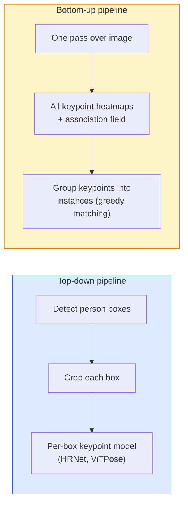

# 關鍵點偵測與姿態估計

> 一個姿態就是一組有序的關鍵點。一個關鍵點偵測器就是一個熱圖迴歸器。剩下的都只是記帳。

**類型：** 實作
**程式語言：** Python
**先修單元：** 階段 4 · 06（偵測）、階段 4 · 07（U-Net）
**時間：** 約 45 分鐘

## 學習目標

- 分辨自上而下與自下而上的姿態估計，並說出各自適用的場合
- 用「每個關鍵點一個高斯」的目標去迴歸 K 個關鍵點的熱圖，並在推論時取出關鍵點座標
- 說明部位親和場（PAF）是什麼，以及自下而上的流程如何把關鍵點組合成一個個實例
- 用 MediaPipe Pose 或 MMPose 做生產級的關鍵點估計，並讀懂它們的輸出格式

## 問題所在

關鍵點任務藏在很多不同的名字底下：人體姿態（17 個身體關節）、臉部特徵點（68 或 478 個點）、手部（21 個點）、動物姿態、機器人的物件姿態、醫學解剖標記。每一個的結構都一模一樣：在物件上偵測 K 個離散的點，輸出它們的 (x, y) 座標。

姿態估計是動作捕捉、健身應用、運動數據分析、手勢控制、動畫、AR 試穿與機器人抓取的基礎。2D 的情況已經成熟；3D 姿態（從單一攝影機估出關節在世界座標中的位置）則是當前的研究前沿。

工程上的問題是規模。單張影像、單人的姿態是一個 20ms 的問題。人群中的多人姿態要跑到 30 fps，是另一個問題，也要用另一套架構。

## 核心概念

### 自上而下 vs 自下而上



- **自上而下** —— 先偵測出人，再對每一個裁切區塊各跑一次關鍵點模型。精度最高；耗時隨人數線性成長。
- **自下而上** —— 一次前向傳播就預測出所有關鍵點加上一個關聯場，再把它們分組。不論人群多大，時間都是固定的。

自上而下（HRNet、ViTPose）是精度的領先者；自下而上（OpenPose、HigherHRNet）在擁擠場景中是吞吐量的領先者。

### 熱圖迴歸

不要直接迴歸 `(x, y)`，而是為每個關鍵點預測一張 `H x W` 的熱圖，上面有一團以真實位置為中心的高斯斑點。

```
target[k, y, x] = exp(-((x - cx_k)^2 + (y - cy_k)^2) / (2 sigma^2))
```

推論時，每張熱圖的 argmax 就是預測出的關鍵點位置。

熱圖比直接迴歸好用的原因：網路本身的空間結構（卷積特徵圖）天生就跟空間性的輸出對得上。高斯目標同時也有正則化效果——定位差一點點，損失就只大一點點，而不是直接歸零。

### 次像素定位

Argmax 給的是整數座標。要拿到次像素精度，就對 argmax 及其鄰居擬一條拋物線來做精修，或是沿用那個眾所皆知的偏移量 `(dx, dy) = 0.25 * (heatmap[y, x+1] - heatmap[y, x-1], ...)` 方向。

### 部位親和場（PAF）

這是 OpenPose 用來做自下而上關聯的招數。對每一對相連的關鍵點（例如左肩到左肘），預測一個 2 通道的場，編碼從一端指向另一端的單位向量。要把某個肩膀跟它的肘配起來，就沿著候選配對之間的連線對 PAF 做線積分；積分值最高的那一對就是配對結果。

```
For each connection (limb):
  PAF channels: 2 (unit vector x, y)
  Line integral: sum over sample points of (PAF . line_direction)
  Higher integral = stronger match
```

漂亮，而且不需要逐人裁切就能擴展到任意大小的人群。

### COCO 關鍵點

標準的人體姿態資料集：每人 17 個關鍵點，指標用 PCK（Percentage of Correct Keypoints，正確關鍵點比例）與 OKS（Object Keypoint Similarity，物件關鍵點相似度）。OKS 是關鍵點版的 IoU，也就是 COCO mAP@OKS 所回報的東西。

### 2D vs 3D

- **2D 姿態** —— 影像座標；已達生產品質（MediaPipe、HRNet、ViTPose）。
- **3D 姿態** —— 世界／攝影機座標；仍在積極研究中。常見做法：
  - 用一個小的 MLP 把 2D 預測抬升到 3D（VideoPose3D）。
  - 直接從影像迴歸 3D（PyMAF、MHFormer）。
  - 用多視角設置（CMU Panoptic）取得真實標註。

```figure
cv3-pose-heatmap
```

## 動手實作

### 步驟 1：高斯熱圖目標

```python
import numpy as np
import torch

def gaussian_heatmap(size, cx, cy, sigma=2.0):
    yy, xx = np.meshgrid(np.arange(size), np.arange(size), indexing="ij")
    return np.exp(-((xx - cx) ** 2 + (yy - cy) ** 2) / (2 * sigma ** 2)).astype(np.float32)

hm = gaussian_heatmap(64, 32, 32, sigma=2.0)
print(f"peak: {hm.max():.3f} at ({hm.argmax() % 64}, {hm.argmax() // 64})")
```

把每個關鍵點的熱圖沿通道軸疊起來，就是完整的目標張量。

### 步驟 2：小小的關鍵點頭

一個 U-Net 風格的模型，輸出 K 個熱圖通道。

```python
import torch.nn as nn
import torch.nn.functional as F

class TinyKeypointNet(nn.Module):
    def __init__(self, num_keypoints=4, base=16):
        super().__init__()
        self.down1 = nn.Sequential(nn.Conv2d(3, base, 3, 2, 1), nn.ReLU(inplace=True))
        self.down2 = nn.Sequential(nn.Conv2d(base, base * 2, 3, 2, 1), nn.ReLU(inplace=True))
        self.mid = nn.Sequential(nn.Conv2d(base * 2, base * 2, 3, 1, 1), nn.ReLU(inplace=True))
        self.up1 = nn.ConvTranspose2d(base * 2, base, 2, 2)
        self.up2 = nn.ConvTranspose2d(base, num_keypoints, 2, 2)

    def forward(self, x):
        h1 = self.down1(x)
        h2 = self.down2(h1)
        h3 = self.mid(h2)
        u1 = self.up1(h3)
        return self.up2(u1)
```

輸入 `(N, 3, H, W)`，輸出 `(N, K, H, W)`。損失是對高斯目標逐像素算的 MSE。

### 步驟 3：推論 —— 取出關鍵點座標

```python
def heatmap_to_coords(heatmaps):
    """
    heatmaps: (N, K, H, W)
    returns:  (N, K, 2) float coordinates in image pixels
    """
    N, K, H, W = heatmaps.shape
    hm = heatmaps.reshape(N, K, -1)
    idx = hm.argmax(dim=-1)
    ys = (idx // W).float()
    xs = (idx % W).float()
    return torch.stack([xs, ys], dim=-1)

coords = heatmap_to_coords(torch.randn(2, 4, 32, 32))
print(f"coords: {coords.shape}")  # (2, 4, 2)
```

推論就一行。要做次像素精修，就在 argmax 附近做內插。

### 步驟 4：合成關鍵點資料集

很簡單：在白色畫布上畫四個點，然後學著把它們預測出來。

```python
def make_synthetic_sample(size=64):
    img = np.ones((3, size, size), dtype=np.float32)
    rng = np.random.default_rng()
    kps = rng.integers(8, size - 8, size=(4, 2))
    for cx, cy in kps:
        img[:, cy - 2:cy + 2, cx - 2:cx + 2] = 0.0
    hms = np.stack([gaussian_heatmap(size, cx, cy) for cx, cy in kps])
    return img, hms, kps
```

夠簡單，小模型一分鐘內就能學會。

### 步驟 5：訓練

```python
model = TinyKeypointNet(num_keypoints=4)
opt = torch.optim.Adam(model.parameters(), lr=3e-3)

for step in range(200):
    batch = [make_synthetic_sample() for _ in range(16)]
    imgs = torch.from_numpy(np.stack([b[0] for b in batch]))
    hms = torch.from_numpy(np.stack([b[1] for b in batch]))
    pred = model(imgs)
    # Upsample pred to full resolution
    pred = F.interpolate(pred, size=hms.shape[-2:], mode="bilinear", align_corners=False)
    loss = F.mse_loss(pred, hms)
    opt.zero_grad(); loss.backward(); opt.step()
```

## 框架應用

- **MediaPipe Pose** —— Google 的生產級姿態估計器；附帶 WebGL 與行動端執行環境，延遲低於 10ms。
- **MMPose**（OpenMMLab）—— 完整的研究用程式庫；每一種 SOTA 架構都有，還帶預訓練權重。
- **YOLOv8-pose** —— 一次前向傳播就搞定，是最快的即時多人姿態。
- **transformers HumanDPT / PoseAnything** —— 較新的視覺語言做法，用於開放詞彙姿態（任意物件、任意關鍵點集合）。

## 產出交付

本單元會產出：

- `outputs/prompt-pose-stack-picker.md` —— 一個提示詞，依延遲、人群規模以及要 2D 還是 3D 的需求，在 MediaPipe / YOLOv8-pose / HRNet / ViTPose 之間做選擇。
- `outputs/skill-heatmap-to-coords.md` —— 一項技能，寫出每個生產級姿態模型都會用到的次像素熱圖轉座標常式。

## 練習

1. **（簡單）** 在那個 4 點的合成資料集上訓練這個小關鍵點模型。回報 200 步之後預測關鍵點與真實關鍵點之間的平均 L2 誤差。
2. **（中等）** 加上次像素精修：給定 argmax 的位置，用鄰近像素沿 x 與 y 各擬一條 1D 拋物線。回報相對於整數 argmax 的精度提升。
3. **（困難）** 建一個兩人的合成資料集，每張影像裡有兩份 4 關鍵點的圖樣。訓練一個帶 PAF 的自下而上流程，預測哪個關鍵點屬於哪個實例，並評估 OKS。

## 關鍵術語

| 術語 | 大家怎麼說 | 實際上是什麼 |
|------|----------------|----------------------|
| 關鍵點 | 「一個標記點」 | 物件上一個特定且有序的點（關節、角點、特徵） |
| 姿態 | 「骨架」 | 屬於同一個實例的一組有序關鍵點 |
| 自上而下 | 「先偵測再算姿態」 | 兩階段流程：人體偵測器加上逐裁切區塊的關鍵點模型；精度最高 |
| 自下而上 | 「先算姿態，之後再分組」 | 一次前向傳播預測所有關鍵點再分組；耗時不隨人群規模改變 |
| 熱圖 | 「高斯目標」 | 每個關鍵點一張 H x W 張量，峰值落在真實位置；首選的迴歸目標 |
| PAF | 「部位親和場」 | 2 通道的單位向量場，編碼肢段方向；用來把關鍵點分組成實例 |
| OKS | 「關鍵點版 IoU」 | 物件關鍵點相似度；COCO 用來評測姿態的指標 |
| HRNet | 「高解析度網路」 | 主導地位的自上而下關鍵點架構；全程都保留高解析度特徵 |

## 延伸閱讀

- [OpenPose (Cao et al., 2017)](https://arxiv.org/abs/1812.08008) —— 帶 PAF 的自下而上做法；至今仍是這套方法寫得最好的一篇
- [HRNet (Sun et al., 2019)](https://arxiv.org/abs/1902.09212) —— 自上而下的參考架構
- [ViTPose (Xu et al., 2022)](https://arxiv.org/abs/2204.12484) —— 直接拿未經改造的 ViT 當姿態主幹網路；在許多基準上是當前 SOTA
- [MediaPipe Pose](https://developers.google.com/mediapipe/solutions/vision/pose_landmarker) —— 生產級即時姿態；2026 年部署最快的技術棧
