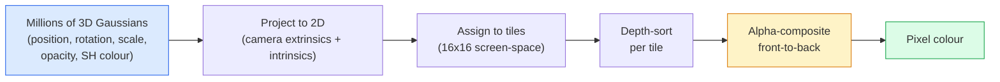

# 從零開始打造 3D 高斯潑濺

> 一個場景就是數百萬個 3D 高斯構成的雲。每一個高斯都有位置、朝向、尺度、不透明度，還有一個隨觀看方向變化的顏色。把它們光柵化，再讓梯度穿過光柵化反向傳遞，就結束了。

**類型：** 實作
**程式語言：** Python
**先修單元：** 階段 4 · 單元 13（3D 視覺與 NeRF）、階段 1 · 單元 12（張量運算）、階段 4 · 單元 10（擴散模型基礎，選修）
**時間：** 約 90 分鐘

## 學習目標

- 說明為什麼到了 2026 年，3D 高斯潑濺取代 NeRF 成為擬真 3D 重建在生產環境的預設選擇
- 說出每個高斯的六項參數（位置、旋轉四元數、尺度、不透明度、球面調和函數顏色、選用的特徵向量），以及各自貢獻多少個浮點數
- 用 `alpha` 合成從零實作一個 2D 高斯潑濺光柵化器，再說明 3D 的情況如何投影成同一個迴圈
- 用 `nerfstudio`、`gsplat` 或 `SuperSplat` 從 20 到 50 張照片重建一個場景，並匯出成 glTF 的 `KHR_gaussian_splatting` 擴充，或 OpenUSD 26.03 的 `UsdVolParticleField3DGaussianSplat` schema

## 問題所在

NeRF 把場景存成一個 MLP 的權重。渲染每一個像素，都是沿著一條光線做上百次 MLP 查詢。訓練要好幾小時，渲染要好幾秒，而且權重不能編輯 —— 想把場景裡的一張椅子移個位置，你得重新訓練。

3D 高斯潑濺（Kerbl, Kopanas, Leimkühler, Drettakis, SIGGRAPH 2023）把這一切都換掉了。場景是一組顯式的 3D 高斯。渲染是 GPU 光柵化，100+ fps。訓練只要幾分鐘。編輯是直接的：平移其中一部分高斯，椅子就移好了。到了 2026 年，Khronos Group 已經批准了一份給高斯潑濺用的 glTF 擴充，OpenUSD 26.03 內建高斯潑濺的 schema，Zillow 與 Apartments.com 用它來渲染房地產，而 3D 重建領域大多數新論文，都是核心 3DGS 想法的變體。

心智模型很簡單，但數學的零件夠多，多數入門介紹都從光柵化開始講，跳過投影與球面調和函數。這個單元會把整套東西建起來 —— 先是 2D 版本，然後是 3D 的擴充。

## 核心概念

### 一個高斯帶了什麼

一個 3D 高斯就是空間中一團帶參數的斑塊，屬性如下：

```
position         mu         (3,)    centre in world coordinates
rotation         q          (4,)    unit quaternion encoding orientation
scale            s          (3,)    log-scales per axis (exponentiated at render time)
opacity          alpha      (1,)    post-sigmoid opacity [0, 1]
SH coefficients  c_lm       (3 * (L+1)^2,)   view-dependent colour
```

旋轉加尺度組成一個 3x3 的共變異數矩陣：`Sigma = R S S^T R^T`。這就是高斯在 3D 裡的形狀。球面調和函數讓顏色能隨觀看方向變化 —— 鏡面高光、細微的光澤、隨視角變化的暈光 —— 而不必逐視角存貼圖。SH 取到 3 階，每個顏色通道有 16 個係數，光是顏色，每個高斯就佔 48 個浮點數。

一個場景通常有 100 萬到 500 萬個高斯。每個大約存 60 個浮點數（3 + 4 + 3 + 1 + 48 + 雜項）。五百萬個高斯的場景就是 240 MB —— 遠小於同等的、逐點帶貼圖的點雲，也比 NeRF 的 MLP 權重在高解析度下重新渲染所需的量小一個數量級。

### 是光柵化，不是光線步進



五個步驟，全都對 GPU 友善。不需要逐像素查 MLP。單張 RTX 3080 Ti 能以 147 fps 渲染 600 萬個潑濺。

### 投影這一步

位在世界座標 `mu`、3D 共變異數為 `Sigma` 的 3D 高斯，會投影成螢幕位置 `mu'`、2D 共變異數為 `Sigma'` 的 2D 高斯：

```
mu' = project(mu)
Sigma' = J W Sigma W^T J^T          (2 x 2)

W = viewing transform (rotation + translation of camera)
J = Jacobian of the perspective projection at mu'
```

這個 2D 高斯的覆蓋範圍是一個橢圓，長短軸就是 `Sigma'` 的特徵向量。橢圓內的每個像素都會收到這個高斯的貢獻，權重是 `exp(-0.5 * (p - mu')^T Sigma'^-1 (p - mu'))`。

### alpha 合成規則

對單一個像素來說，覆蓋到它的那些高斯會由後往前排序（或等價地由前往後，用反過來的公式）。顏色的合成方式，跟 1980 年代以來每一個半透明光柵化器用的是同一條式子：

```
C_pixel = sum_i alpha_i * T_i * c_i

T_i = prod_{j < i} (1 - alpha_j)       transmittance up to i
alpha_i = opacity_i * exp(-0.5 * d^T Sigma'^-1 d)   local contribution
c_i = eval_SH(SH_i, view_direction)    view-dependent colour
```

這**跟 NeRF 的體積渲染是同一條式子**，只是作用在一組顯式、稀疏的高斯上，而不是沿著光線的稠密取樣點。正是這個等同性，讓它的渲染品質能跟 NeRF 打平 —— 兩者積分的都是同一條輻射場方程式。

### 為什麼它是可微的

每一步 —— 投影、tile 指派、alpha 合成、SH 求值 —— 對高斯的參數都是可微的。給定一張真實影像，算出渲染像素的損失，讓梯度穿過光柵化器反向傳遞，再用梯度下降更新所有 `(mu, q, s, alpha, c_lm)`。跑大約 30,000 次迭代，這些高斯就會找到自己該有的位置、尺度與顏色。

### 自適應密度控制與修剪

固定的一組高斯蓋不住複雜場景。訓練裡包含兩種自適應機制：

- 當某個高斯的梯度很大、但尺度很小時，**複製（clone）** 一份在它目前的位置 —— 這裡的重建需要更多細節。
- 當某個大尺度高斯的梯度很大時，把它**分裂（split）** 成兩個較小的 —— 一個大高斯太平滑，擬合不了這塊區域。
- **修剪**掉不透明度低於門檻的高斯 —— 它們沒有貢獻。

自適應密度控制每 N 次迭代跑一次。一個場景通常從約 10 萬個初始高斯（由 SfM 點雲播種）長到訓練結束時的 100 萬到 500 萬個。

### 一段話講完球面調和函數

隨視角變化的顏色，是單位球面上的一個函式 `c(direction)`。球面調和函數就是球面的傅立葉基底。在 `L` 階截斷，每個通道就得到 `(L+1)^2` 個基底函式。要算某個新視角的顏色，就是學到的 SH 係數與「在該觀看方向上求值的基底」之間的一次內積。0 階＝一個係數＝固定顏色。3 階＝16 個係數＝足以表現 Lambertian 著色、鏡面反射與輕微的反射。SD Gaussian Splatting 的論文預設都用 3 階。

### 2026 年的生產環境技術堆疊

```
1. Capture         smartphone / DJI drone / handheld scanner
2. SfM / MVS       COLMAP or GLOMAP derives camera poses + sparse points
3. Train 3DGS      nerfstudio / gsplat / inria official / PostShot (~10-30 min on RTX 4090)
4. Edit            SuperSplat / SplatForge (clean floaters, segment)
5. Export          .ply -> glTF KHR_gaussian_splatting or .usd (OpenUSD 26.03)
6. View            Cesium / Unreal / Babylon.js / Three.js / Vision Pro
```

### 4D 與生成式變體

- **4D 高斯潑濺** —— 高斯成為時間的函式；用於體積式影片（Superman 2026、A$AP Rocky 的〈Helicopter〉）。
- **生成式潑濺** —— text-to-splat 模型（World Labs 的 Marble），能憑空生成整個場景。
- **3D Gaussian Unscented Transform** —— NVIDIA NuRec 為自動駕駛模擬做的變體。

## 動手實作

### 步驟 1：一個 2D 高斯

我們先建一個 2D 光柵化器。3D 的情況在投影之後就化簡成它。

```python
import torch
import torch.nn as nn
import torch.nn.functional as F


def eval_2d_gaussian(means, covs, points):
    """
    means:  (G, 2)      centres
    covs:   (G, 2, 2)   covariance matrices
    points: (H, W, 2)   pixel coordinates
    returns: (G, H, W)  density at every pixel for every Gaussian
    """
    G = means.size(0)
    H, W, _ = points.shape
    flat = points.view(-1, 2)
    inv = torch.linalg.inv(covs)
    diff = flat[None, :, :] - means[:, None, :]
    d = torch.einsum("gpi,gij,gpj->gp", diff, inv, diff)
    density = torch.exp(-0.5 * d)
    return density.view(G, H, W)
```

`einsum` 幫每一組（高斯，像素）配對算出二次形式 `diff^T Sigma^-1 diff`。

### 步驟 2：2D 潑濺光柵化器

由前往後做 alpha 合成。在 2D 裡深度沒有意義，所以我們用一個學出來的逐高斯純量來決定順序。

```python
def rasterise_2d(means, covs, colours, opacities, depths, image_size):
    """
    means:     (G, 2)
    covs:      (G, 2, 2)
    colours:   (G, 3)
    opacities: (G,)     in [0, 1]
    depths:    (G,)     per-Gaussian scalar used for ordering
    image_size: (H, W)
    returns:   (H, W, 3) rendered image
    """
    H, W = image_size
    yy, xx = torch.meshgrid(
        torch.arange(H, dtype=torch.float32, device=means.device),
        torch.arange(W, dtype=torch.float32, device=means.device),
        indexing="ij",
    )
    points = torch.stack([xx, yy], dim=-1)

    densities = eval_2d_gaussian(means, covs, points)
    alphas = opacities[:, None, None] * densities
    alphas = alphas.clamp(0.0, 0.99)

    order = torch.argsort(depths)
    alphas = alphas[order]
    colours_sorted = colours[order]

    T = torch.ones(H, W, device=means.device)
    out = torch.zeros(H, W, 3, device=means.device)
    for i in range(means.size(0)):
        a = alphas[i]
        out += (T * a)[..., None] * colours_sorted[i][None, None, :]
        T = T * (1.0 - a)
    return out
```

不快 —— 真正的實作會用 tile 為單位的 CUDA kernel —— 但數學完全正確，而且全程可微。

### 步驟 3：一個可訓練的 2D 潑濺場景

```python
class Splats2D(nn.Module):
    def __init__(self, num_splats=128, image_size=64, seed=0):
        super().__init__()
        g = torch.Generator().manual_seed(seed)
        H, W = image_size, image_size
        self.means = nn.Parameter(torch.rand(num_splats, 2, generator=g) * torch.tensor([W, H]))
        self.log_scale = nn.Parameter(torch.ones(num_splats, 2) * math.log(2.0))
        self.rot = nn.Parameter(torch.zeros(num_splats))  # single angle in 2D
        self.colour_logits = nn.Parameter(torch.randn(num_splats, 3, generator=g) * 0.5)
        self.opacity_logit = nn.Parameter(torch.zeros(num_splats))
        self.depth = nn.Parameter(torch.rand(num_splats, generator=g))

    def covs(self):
        s = torch.exp(self.log_scale)
        c, si = torch.cos(self.rot), torch.sin(self.rot)
        R = torch.stack([
            torch.stack([c, -si], dim=-1),
            torch.stack([si, c], dim=-1),
        ], dim=-2)
        S = torch.diag_embed(s ** 2)
        return R @ S @ R.transpose(-1, -2)

    def forward(self, image_size):
        covs = self.covs()
        colours = torch.sigmoid(self.colour_logits)
        opacities = torch.sigmoid(self.opacity_logit)
        return rasterise_2d(self.means, covs, colours, opacities, self.depth, image_size)
```

`log_scale`、`opacity_logit` 與 `colour_logits` 都是沒有約束的參數，在渲染時才過對應的激活函式映射回合法範圍。這是每一份 3DGS 實作的標準寫法。

### 步驟 4：把 2D 高斯擬合到一張目標影像

```python
import math
import numpy as np

def make_target(size=64):
    yy, xx = np.meshgrid(np.arange(size), np.arange(size), indexing="ij")
    img = np.zeros((size, size, 3), dtype=np.float32)
    # Red circle
    mask = (xx - 20) ** 2 + (yy - 20) ** 2 < 10 ** 2
    img[mask] = [1.0, 0.2, 0.2]
    # Blue square
    mask = (np.abs(xx - 45) < 8) & (np.abs(yy - 40) < 8)
    img[mask] = [0.2, 0.3, 1.0]
    return torch.from_numpy(img)


target = make_target(64)
model = Splats2D(num_splats=64, image_size=64)
opt = torch.optim.Adam(model.parameters(), lr=0.05)

for step in range(200):
    pred = model((64, 64))
    loss = F.mse_loss(pred, target)
    opt.zero_grad(); loss.backward(); opt.step()
    if step % 40 == 0:
        print(f"step {step:3d}  mse {loss.item():.4f}")
```

跑 200 步，這 64 個高斯就會落到那兩個形狀上。整個想法就是這樣 —— 對顯式的幾何基本元素做梯度下降。

### 步驟 5：從 2D 到 3D

3D 的擴充維持同一個迴圈。多出來的是：

1. 每個高斯的旋轉改成四元數，而不是單一角度。
2. 共變異數是 `R S S^T R^T`，其中 `R` 由四元數建出，`S = diag(exp(log_scale))`。
3. 投影 `(mu, Sigma) -> (mu', Sigma')` 用到相機外參，以及透視投影在 `mu` 處的 Jacobian。
4. 顏色變成球面調和函數展開；在觀看方向上求值。
5. 深度排序改用相機座標系裡真正的 z，而不是學出來的純量。

每一份生產級實作（`gsplat`、`inria/gaussian-splatting`、`nerfstudio`）在 GPU 上做的就是這件事，並用 tile 為單位的 CUDA kernel 實現。

### 步驟 6：球面調和函數求值

3 階以內的 SH 基底，每個通道有 16 項。求值方式：

```python
def eval_sh_degree_3(sh_coeffs, dirs):
    """
    sh_coeffs: (..., 16, 3)   last dim is RGB channels
    dirs:      (..., 3)       unit vectors
    returns:   (..., 3)
    """
    C0 = 0.282094791773878
    C1 = 0.488602511902920
    C2 = [1.092548430592079, 1.092548430592079,
          0.315391565252520, 1.092548430592079,
          0.546274215296039]
    x, y, z = dirs[..., 0], dirs[..., 1], dirs[..., 2]
    x2, y2, z2 = x * x, y * y, z * z
    xy, yz, xz = x * y, y * z, x * z

    result = C0 * sh_coeffs[..., 0, :]
    result = result - C1 * y[..., None] * sh_coeffs[..., 1, :]
    result = result + C1 * z[..., None] * sh_coeffs[..., 2, :]
    result = result - C1 * x[..., None] * sh_coeffs[..., 3, :]

    result = result + C2[0] * xy[..., None] * sh_coeffs[..., 4, :]
    result = result + C2[1] * yz[..., None] * sh_coeffs[..., 5, :]
    result = result + C2[2] * (2.0 * z2 - x2 - y2)[..., None] * sh_coeffs[..., 6, :]
    result = result + C2[3] * xz[..., None] * sh_coeffs[..., 7, :]
    result = result + C2[4] * (x2 - y2)[..., None] * sh_coeffs[..., 8, :]

    # degree 3 terms omitted here for brevity; full 16-coefficient version in the code file
    return result
```

學到的 `sh_coeffs` 為那個高斯存下「每個方向上的顏色」。渲染時對當前的觀看方向求值，就得到一個 3 維的 RGB 向量。

## 框架應用

真正要做 3DGS 的工作，用 `gsplat`（Meta）或 `nerfstudio`：

```bash
pip install nerfstudio gsplat
ns-download-data example
ns-train splatfacto --data path/to/data
```

`splatfacto` 是 nerfstudio 的 3DGS 訓練器。一般場景在 RTX 4090 上跑 10 到 30 分鐘。

2026 年值得知道的匯出選項：

- `.ply` —— 原始的高斯雲（可攜性最好，檔案最大）。
- `.splat` —— PlayCanvas / SuperSplat 的量化格式。
- glTF `KHR_gaussian_splatting` —— Khronos 標準，可在各種檢視器之間通用（2026 年 2 月 RC）。
- OpenUSD `UsdVolParticleField3DGaussianSplat` —— USD 原生，給 NVIDIA Omniverse 與 Vision Pro 流程用。

至於 4D／動態場景，`4DGS` 與 `Deformable-3DGS` 用隨時間變化的平均值與不透明度擴充了同一套機制。

## 產出交付

這個單元會產出：

- `outputs/prompt-3dgs-capture-planner.md` —— 一個提示詞，為給定的場景類型規劃一次拍攝作業（照片數量、相機路徑、打光）。
- `outputs/skill-3dgs-export-router.md` —— 一項技能，根據下游的檢視器或引擎挑出正確的匯出格式（`.ply` / `.splat` / glTF / USD）。

## 練習

1. **（簡單）** 拿上面的 2D 潑濺訓練器，換一張合成影像來跑。把 `num_splats` 在 `[16, 64, 256]` 之間變化，各畫出 MSE 對步數的曲線。找出報酬遞減的轉折點。
2. **（中等）** 擴充這個 2D 光柵化器，讓每個高斯的 RGB 顏色能透過一個 2 階調和函數，隨一個純量「視角」變化。用一對目標影像訓練，並驗證模型能同時重建出兩張。
3. **（困難）** clone `nerfstudio`，對你手邊任何場景（書桌、盆栽、人臉、房間）的 20 張照片訓練 `splatfacto`。匯出成 glTF `KHR_gaussian_splatting`，並在檢視器裡打開（Three.js `GaussianSplats3D`、SuperSplat、Babylon.js V9）。回報訓練時間、高斯數量與渲染 fps。

## 關鍵術語

| 術語 | 大家怎麼說 | 實際上是什麼 |
|------|----------------|----------------------|
| 3DGS | 「高斯潑濺」 | 把場景表示成數百萬個 3D 高斯的顯式表示，每個高斯帶位置、旋轉、尺度、不透明度、SH 顏色 |
| 共變異數 | 「高斯的形狀」 | `Sigma = R S S^T R^T`；單一個高斯的朝向與各向異性尺度 |
| alpha 合成 | 「由後往前混合」 | 跟 NeRF 體積渲染同一條式子，只是現在作用在一組顯式、稀疏的高斯上 |
| 自適應密度控制 | 「複製與分裂」 | 在重建不足的地方自適應地加入新的高斯 |
| 修剪 | 「刪掉低不透明度的」 | 移除訓練中不透明度塌陷到接近零的高斯 |
| 球面調和函數 | 「隨視角變化的顏色」 | 球面上的傅立葉基底；把顏色存成觀看方向的函式 |
| Splatfacto | 「nerfstudio 的 3DGS」 | 2026 年訓練 3DGS 最省事的路徑 |
| `KHR_gaussian_splatting` | 「glTF 標準」 | Khronos 2026 年的擴充，讓 3DGS 能在各種檢視器與引擎之間通用 |

## 延伸閱讀

- [3D Gaussian Splatting for Real-Time Radiance Field Rendering (Kerbl et al., SIGGRAPH 2023)](https://repo-sam.inria.fr/fungraph/3d-gaussian-splatting/) —— 原始論文
- [gsplat (Meta/nerfstudio)](https://github.com/nerfstudio-project/gsplat) —— 生產品質的 CUDA 光柵化器
- [nerfstudio Splatfacto](https://docs.nerf.studio/nerfology/methods/splat.html) —— 參考訓練配方
- [Khronos KHR_gaussian_splatting extension](https://github.com/KhronosGroup/glTF/blob/main/extensions/2.0/Khronos/KHR_gaussian_splatting/README.md) —— 2026 年的可攜格式
- [OpenUSD 26.03 release notes](https://openusd.org/release/) —— `UsdVolParticleField3DGaussianSplat` schema
- [THE FUTURE 3D State of Gaussian Splatting 2026](https://www.thefuture3d.com/blog-0/2026/4/4/state-of-gaussian-splatting-2026) —— 產業概觀
