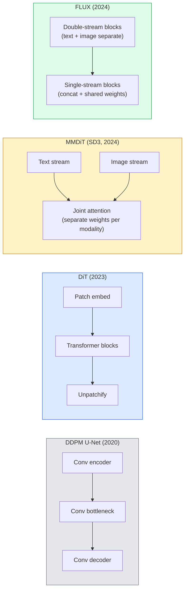

# 擴散 Transformer 與修正流

> U-Net 並不是擴散的祕密。把它換成一個 Transformer，再把雜訊排程換成一條直線流，你手上突然就有了 SD3、FLUX，以及 2026 年每一個文字生圖模型。

**類型：** 學習 + 實作
**程式語言：** Python
**先修單元：** 階段 4 · 單元 10（擴散 DDPM）、階段 4 · 單元 14（ViT）、階段 7 · 單元 02（自注意力）
**時間：** 約 75 分鐘

## 學習目標

- 追溯從 U-Net DDPM（單元 10）到擴散 Transformer（DiT）、MMDiT（SD3）與單流 + 雙流 DiT（FLUX）的演進
- 解釋修正流：為什麼雜訊與資料之間的一條直線路徑，能讓模型用 20 個取樣步數就完成取樣，而不是 1000 步
- 實作一個迷你 DiT 區塊與一個修正流訓練迴圈，兩者都在 100 行以內
- 依架構、參數量與授權條款區分各個模型變體（SD3、FLUX.1-dev、FLUX.1-schnell、Z-Image、Qwen-Image）

## 問題所在

單元 10 打造了一個以 U-Net 當去噪器的 DDPM。那套配方主宰了 2020–2023 年：U-Net + beta 排程 + 雜訊預測損失。它做出了 Stable Diffusion 1.5 與 2.1，也做出了 DALL-E 2。

2026 年每一個最先進的文字生圖模型都已經走過了那一步。Stable Diffusion 3、FLUX、SD4、Z-Image、Qwen-Image、Hunyuan-Image —— 沒有一個用 U-Net。它們用的是擴散 Transformer（DiT）。SD3 與 FLUX 還把 DDPM 的雜訊排程換成修正流，把雜訊通往資料的路徑拉直，讓一致性模型或蒸餾變體能以 1 到 4 步完成推論。

這個轉變之所以重要，是因為它正是擴散式影像生成變得可控、貼合提示詞（SD3／SD4 解決了文字渲染），而且快到能上生產線的原因。搞懂 DiT + 修正流，就是搞懂 2026 年的生成式影像技術堆疊。

## 核心概念

### 從 U-Net 到 Transformer



- **DiT**（Peebles & Xie, 2023）—— 把 U-Net 換成一個作用在潛在區塊上、類似 ViT 的 Transformer。條件控制透過自適應層正規化（AdaLN）達成。
- **MMDiT**（SD3, Esser et al., 2024）—— 文字詞元與影像詞元各有一套權重的兩條資料流，共用一次聯合注意力。
- **FLUX**（Black Forest Labs, 2024）—— 前 N 個區塊像 SD3 那樣是雙流，後面的區塊把兩者串接起來並共用權重（單流），以便在更深的層數下維持效率。
- **Z-Image**（2025）—— 一個 6B 參數的高效單流 DiT，挑戰了「不計代價擴大規模」這個信條。

### 修正流，一段話說完

DDPM 把前向過程定義成一條帶雜訊的 SDE，`x_t` 隨時間被破壞得越來越徹底。學出來的反向過程是第二條 SDE，用 1000 個小步解出來。

修正流則把乾淨資料與純雜訊之間定義成一條**直線**內插：

```
x_t = (1 - t) * x_0 + t * epsilon,     t in [0, 1]
```

訓練一個網路去預測速度場 `v_theta(x_t, t) = epsilon - x_0` —— 也就是沿著那條從乾淨資料通往雜訊的直線路徑的前進方向（`dx_t/dt`）。取樣時，你把這個速度場往回積分，從雜訊一步步走向資料。得到的 ODE 遠比原來接近一條直線，所以取樣需要的積分步數少得多。

SD3 把這叫做**修正流匹配**（Rectified Flow Matching）。FLUX、Z-Image 以及 2026 年大多數模型用的都是同一個目標函式。典型的推論設定：20 到 30 個 Euler 步（決定性），對比舊 DDPM 體制下 50 步以上的 DDIM。蒸餾／turbo／schnell／LCM 變體能把它壓到 1 到 4 步。

### AdaLN 條件控制

DiT 透過**自適應層正規化**（adaptive layer norm）對時間步與類別／文字做條件控制：從條件向量預測 `scale` 與 `shift`，在 LayerNorm 之後套用。這比 U-Net 裡 FiLM 風格的調變乾淨得多，也是每一個現代 DiT 的預設做法。

```
cond -> MLP -> (scale, shift, gate)
norm(x) * (1 + scale) + shift, then residual add * gate
```

### SD3 與 FLUX 裡的文字編碼器

- **SD3** 用三個文字編碼器：兩個 CLIP 模型加上 T5-XXL。嵌入串接起來，當作文字條件餵給影像資料流。
- **FLUX** 用一個 CLIP-L 加 T5-XXL。
- **Qwen-Image / Z-Image** 這類變體用自家的文字編碼器，與各自的基礎 LLM 對齊。

文字編碼器是 SD3／FLUX 對提示詞的理解遠勝 SD1.5 的一大原因。單單 T5-XXL 就有 4.7B 參數。

### 無分類器引導依然成立

修正流換掉的是取樣器，不是條件控制的方式。無分類器引導（訓練時以 10% 的機率丟掉文字，推論時把有條件與無條件的預測混合起來）在修正流下運作方式完全相同。2026 年大多數模型用 3.5 到 5 的引導強度 —— 比 SD1.5 的 7.5 低，因為修正流模型預設就更緊貼提示詞。

### 一致性模型、Turbo、Schnell、LCM

同一個想法的四個名字：把一個慢的多步模型蒸餾成一個快的少步模型。

- **LCM（Latent Consistency Model，潛在一致性模型）** —— 訓練一個學生模型，從任意中間狀態 `x_t` 一步預測出最終的 `x_0`。
- **SDXL Turbo / FLUX schnell** —— 用對抗式擴散蒸餾訓練出來的 1 到 4 步模型。
- **SD Turbo** —— 把 OpenAI 那一路的一致性模型搬到潛在擴散上。

任何新模型要上線服務，都會同時出一個「完整品質」的檢查點和一個「turbo／schnell」變體。Schnell（德文的「快」，Black Forest Labs 的命名慣例）跑 1 到 4 步，塞得進即時管線。

### 2026 年的模型版圖

| 模型 | 規模 | 架構 | 授權 |
|-------|------|--------------|---------|
| Stable Diffusion 3 Medium | 2B | MMDiT | SAI Community |
| Stable Diffusion 3.5 Large | 8B | MMDiT | SAI Community |
| FLUX.1-dev | 12B | 雙流 + 單流 DiT | 非商業用途 |
| FLUX.1-schnell | 12B | 同上，蒸餾版 | Apache 2.0 |
| FLUX.2 | —— | FLUX.1 的迭代版 | 混合 |
| Z-Image | 6B | S3-DiT（可擴展單流） | 寬鬆 |
| Qwen-Image | 約 20B | DiT + Qwen 文字塔 | Apache 2.0 |
| Hunyuan-Image-3.0 | 約 80B | DiT | 研究用途 |
| SD4 Turbo | 3B | DiT + 蒸餾 | SAI Commercial |

FLUX.1-schnell 是 2026 年開源界的預設選擇。Z-Image 是效率上的領先者。FLUX.2 與 SD4 是目前品質的天花板。

### 為什麼這次轉向很重要

DDPM + U-Net 是行得通的。DiT + 修正流則**更好、更快，而且縮放得更乾淨**。這個轉變跟 NLP 從 RNN 走向 Transformer 那一次很像：兩種架構解的是同一個問題，但 Transformer 撐得起縮放律，如今主宰了整個領域。2026 年每一篇談影像、影片或 3D 生成的論文，用的都是 DiT 形狀的去噪器，而且通常搭配修正流的目標函式。U-Net DDPM 現在主要是教學用途（單元 10）。

```figure
cv3-rectified-flow
```

## 動手實作

### 步驟 1：帶 AdaLN 的 DiT 區塊

```python
import torch
import torch.nn as nn


class AdaLNZero(nn.Module):
    """
    Adaptive LayerNorm with a gate. Predicts (scale, shift, gate) from the conditioning.
    Init such that the whole block starts as identity ("zero init").
    """

    def __init__(self, dim, cond_dim):
        super().__init__()
        self.norm = nn.LayerNorm(dim, elementwise_affine=False)
        self.mlp = nn.Linear(cond_dim, dim * 3)
        nn.init.zeros_(self.mlp.weight)
        nn.init.zeros_(self.mlp.bias)

    def forward(self, x, cond):
        scale, shift, gate = self.mlp(cond).chunk(3, dim=-1)
        h = self.norm(x) * (1 + scale.unsqueeze(1)) + shift.unsqueeze(1)
        return h, gate.unsqueeze(1)


class DiTBlock(nn.Module):
    def __init__(self, dim=192, heads=3, mlp_ratio=4, cond_dim=192):
        super().__init__()
        self.adaln1 = AdaLNZero(dim, cond_dim)
        self.attn = nn.MultiheadAttention(dim, heads, batch_first=True)
        self.adaln2 = AdaLNZero(dim, cond_dim)
        self.mlp = nn.Sequential(
            nn.Linear(dim, dim * mlp_ratio),
            nn.GELU(),
            nn.Linear(dim * mlp_ratio, dim),
        )

    def forward(self, x, cond):
        h, gate1 = self.adaln1(x, cond)
        a, _ = self.attn(h, h, h, need_weights=False)
        x = x + gate1 * a
        h, gate2 = self.adaln2(x, cond)
        x = x + gate2 * self.mlp(h)
        return x
```

`AdaLNZero` 一開始就是一個恆等映射，因為它的 MLP 權重被初始化成零。訓練會慢慢把這個區塊推離恆等；這對深層的 Transformer 擴散模型有非常顯著的穩定效果。

### 步驟 2：一個迷你 DiT

```python
def timestep_embedding(t, dim):
    import math
    half = dim // 2
    freqs = torch.exp(-math.log(10000) * torch.arange(half, device=t.device) / half)
    args = t[:, None].float() * freqs[None]
    return torch.cat([args.sin(), args.cos()], dim=-1)


class TinyDiT(nn.Module):
    def __init__(self, image_size=16, patch_size=2, in_channels=3, dim=96, depth=4, heads=3):
        super().__init__()
        self.patch_size = patch_size
        self.num_patches = (image_size // patch_size) ** 2
        self.patch = nn.Conv2d(in_channels, dim, kernel_size=patch_size, stride=patch_size)
        self.pos = nn.Parameter(torch.zeros(1, self.num_patches, dim))
        self.time_mlp = nn.Sequential(
            nn.Linear(dim, dim * 2),
            nn.SiLU(),
            nn.Linear(dim * 2, dim),
        )
        self.blocks = nn.ModuleList([DiTBlock(dim, heads, cond_dim=dim) for _ in range(depth)])
        self.norm_out = nn.LayerNorm(dim, elementwise_affine=False)
        self.head = nn.Linear(dim, patch_size * patch_size * in_channels)

    def forward(self, x, t):
        n = x.size(0)
        x = self.patch(x)
        x = x.flatten(2).transpose(1, 2) + self.pos
        t_emb = self.time_mlp(timestep_embedding(t, self.pos.size(-1)))
        for blk in self.blocks:
            x = blk(x, t_emb)
        x = self.norm_out(x)
        x = self.head(x)
        return self._unpatchify(x, n)

    def _unpatchify(self, x, n):
        p = self.patch_size
        h = w = int(self.num_patches ** 0.5)
        x = x.view(n, h, w, p, p, -1).permute(0, 5, 1, 3, 2, 4).reshape(n, -1, h * p, w * p)
        return x
```

### 步驟 3：修正流訓練

```python
import torch.nn.functional as F

def rectified_flow_train_step(model, x0, optimizer, device):
    model.train()
    x0 = x0.to(device)
    n = x0.size(0)
    t = torch.rand(n, device=device)
    epsilon = torch.randn_like(x0)
    x_t = (1 - t[:, None, None, None]) * x0 + t[:, None, None, None] * epsilon

    target_velocity = epsilon - x0
    pred_velocity = model(x_t, t)

    loss = F.mse_loss(pred_velocity, target_velocity)
    optimizer.zero_grad()
    loss.backward()
    optimizer.step()
    return loss.item()
```

拿它跟 DDPM 的雜訊預測損失（單元 10）比較：結構一樣，目標不同。我們不預測雜訊 `epsilon`，而是預測**速度場** `epsilon - x_0`，它沿著那條直線內插從資料指向雜訊。

### 步驟 4：Euler 取樣器

修正流是一條 ODE。Euler 法最簡單，而且對一個訓練良好的修正流模型來說，在 20 步以上時精度幾乎跟高階解法器一樣好。

```python
@torch.no_grad()
def rectified_flow_sample(model, shape, steps=20, device="cpu"):
    model.eval()
    x = torch.randn(shape, device=device)
    dt = 1.0 / steps
    t = torch.ones(shape[0], device=device)
    for _ in range(steps):
        v = model(x, t)
        x = x - dt * v
        t = t - dt
    return x
```

20 個取樣步數。在一個訓練好的模型上，這產生的樣本可以跟 1000 步的 DDPM 相提並論。

### 步驟 5：端到端煙霧測試

```python
import numpy as np

def synthetic_blobs(num=200, size=16, seed=0):
    rng = np.random.default_rng(seed)
    out = np.zeros((num, 3, size, size), dtype=np.float32)
    yy, xx = np.meshgrid(np.arange(size), np.arange(size), indexing="ij")
    for i in range(num):
        cx, cy = rng.uniform(4, size - 4, size=2)
        r = rng.uniform(2, 4)
        mask = (xx - cx) ** 2 + (yy - cy) ** 2 < r ** 2
        colour = rng.uniform(-1, 1, size=3)
        for c in range(3):
            out[i, c][mask] = colour[c]
    return torch.from_numpy(out)
```

用修正流在這份資料上訓練一個 `TinyDiT`。跑完 500 步之後，取樣出來的輸出應該看起來像一團團淡淡的色塊。

## 框架應用

要用 FLUX / SD3 / Z-Image 做真正的影像生成，`diffusers` 為每一個都提供了統一的 API：

```python
from diffusers import FluxPipeline, StableDiffusion3Pipeline
import torch

pipe = FluxPipeline.from_pretrained(
    "black-forest-labs/FLUX.1-schnell",
    torch_dtype=torch.bfloat16,
).to("cuda")

out = pipe(
    prompt="a golden retriever surfing a tsunami, hyperrealistic, studio lighting",
    guidance_scale=0.0,           # schnell was trained without CFG
    num_inference_steps=4,
    max_sequence_length=256,
).images[0]
out.save("surf.png")
```

三行。`FLUX.1-schnell` 四步出圖。把 model id 換成 `black-forest-labs/FLUX.1-dev`，就能用 20 到 30 步搭配 CFG 換到更高的品質。

SD3 的話：

```python
pipe = StableDiffusion3Pipeline.from_pretrained(
    "stabilityai/stable-diffusion-3.5-large",
    torch_dtype=torch.bfloat16,
).to("cuda")
out = pipe(prompt, guidance_scale=3.5, num_inference_steps=28).images[0]
```

## 產出交付

這個單元會產出：

- `outputs/prompt-dit-model-picker.md` —— 在給定品質、延遲與授權限制下，於 SD3、FLUX.1-dev、FLUX.1-schnell、Z-Image、SD4 Turbo 之間做出選擇。
- `outputs/skill-rectified-flow-trainer.md` —— 寫出一套完整的修正流訓練迴圈，搭配 AdaLN DiT 與 Euler 取樣。

## 練習

1. **（簡單）** 把上面的 TinyDiT 在合成色塊資料集上訓練 500 步。比較用 10、20 與 50 個 Euler 取樣步數產生的樣本。
2. **（中等）** 把一個學出來的類別嵌入串接到時間步嵌入上，加入文字條件控制（依顏色分成 10 個色塊「類別」）。用類別 0、5、9 取樣，並驗證顏色相符。
3. **（困難）** 對同樣大小的網路分別做出修正流版與 DDPM 版，用同一份資料訓練同樣的步數，再計算兩者生成樣本之間的 Fréchet 距離（FID 的代理指標）。報告哪一個收斂得比較快。

## 關鍵術語

| 術語 | 大家怎麼說 | 實際上是什麼 |
|------|----------------|----------------------|
| DiT | 「擴散 Transformer」 | 取代 U-Net 擔任擴散去噪器的 Transformer；作用在影像區塊化（patchify）之後的潛在表示上 |
| AdaLN | 「自適應層正規化」 | 透過學出來的 scale、shift、gate 在 LayerNorm 之後做時間步／文字條件控制；每一個現代 DiT 的標準配備 |
| MMDiT | 「多模態 DiT（SD3）」 | 文字詞元與影像詞元各有一套權重流，共用一次聯合自注意力 |
| 單流／雙流 | 「FLUX 的招數」 | 前 N 個區塊走雙流（每個模態各一套權重），後面的區塊走單流（串接 + 共用權重）以換取效率 |
| 修正流 | 「雜訊到資料走直線」 | 資料與雜訊之間的線性內插；網路預測速度場；推論所需的 ODE 步數更少 |
| 速度場目標 | 「epsilon - x_0」 | 修正流的迴歸目標；從乾淨資料指向雜訊 |
| CFG 引導 | 「無分類器引導」 | 把有條件與無條件的預測混合起來；修正流模型依然在用 |
| Schnell／turbo／LCM | 「1 到 4 步的蒸餾」 | 從完整品質模型蒸餾出來的少步數變體；生產環境的即時之選 |

## 延伸閱讀

- [Scalable Diffusion Models with Transformers (Peebles & Xie, 2023)](https://arxiv.org/abs/2212.09748) —— DiT 那篇論文
- [Scaling Rectified Flow Transformers (Esser et al., SD3 paper)](https://arxiv.org/abs/2403.03206) —— 大規模下的 MMDiT 與修正流
- [FLUX.1 model card and technical report (Black Forest Labs)](https://huggingface.co/black-forest-labs/FLUX.1-dev) —— 雙流 + 單流的細節
- [Z-Image: Efficient Image Generation Foundation Model (2025)](https://arxiv.org/html/2511.22699v1) —— 6B 規模的單流 DiT
- [Elucidating the Design Space of Diffusion (Karras et al., 2022)](https://arxiv.org/abs/2206.00364) —— 每一個擴散設計權衡的參考基準
- [Latent Consistency Models (Luo et al., 2023)](https://arxiv.org/abs/2310.04378) —— LCM-LoRA 如何讓你用 4 步完成推論
