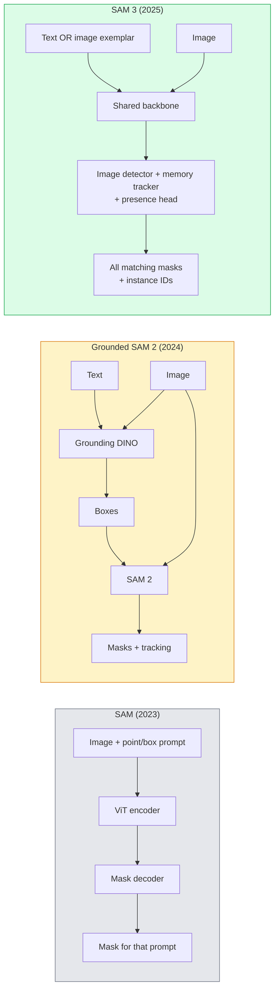

# SAM 3 與開放詞彙分割

> 給模型一段文字提示詞和一張影像，就拿到每一個相符物件的遮罩。SAM 3 把這件事變成單一次前向傳播。

**類型：** 應用 + 實作
**程式語言：** Python
**先修單元：** 階段 4 單元 07（U-Net）、階段 4 單元 08（Mask R-CNN）、階段 4 單元 18（CLIP）
**時間：** 約 60 分鐘

## 學習目標

- 分辨 SAM（只吃視覺提示）、Grounded SAM／SAM 2（偵測器 + SAM）與 SAM 3（透過可提示概念分割原生支援文字提示）
- 說明 SAM 3 的架構：共享骨幹網路 + 影像偵測器 + 基於記憶的影片追蹤器 + 存在性頭 + 解耦的偵測器—追蹤器設計
- 用 Hugging Face `transformers` 的 SAM 3 整合做文字提示的偵測、分割與影片追蹤
- 依延遲、概念複雜度與部署目標，在 SAM 3、Grounded SAM 2、YOLO-World 與 SAM-MI 之間做選擇

## 問題所在

2023 年的 SAM 是一個只吃視覺提示的模型：你點一個點提示或畫一個框提示，它回一個遮罩。想要「把這張照片裡所有的柳丁都給我」，你得先用一個偵測器（Grounding DINO）產生框，再用 SAM 逐一分割。Grounded SAM 把這件事包成一條管線，但那終究是兩個凍結模型串成的串接，誤差累積無法避免。

SAM 3（Meta，2025 年 11 月，ICLR 2026）把這條串接壓成了一層。它接受一段簡短名詞片語或一張影像範例當提示，在單一次前向傳播裡回傳所有相符的遮罩與實例 ID。這就是**可提示概念分割（Promptable Concept Segmentation, PCS）**。再加上 2026 年 3 月的 Object Multiplex 更新（SAM 3.1），它能高效地在影片中追蹤同一概念的多個實例。

本單元講的是這件事代表的結構性轉變。2D 分割、偵測與文字—影像 grounding 已經併成了一個模型。生產環境要問的問題不再是「我該把哪幾段管線串起來」，而是「哪個可提示模型能端到端吃下我的使用情境」。

## 核心概念

### 三個世代



### 可提示概念分割

一個「概念提示」是一段簡短名詞片語（`"yellow school bus"`、`"striped red umbrella"`、`"hand holding a mug"`）或一張影像範例。模型會回傳影像中每一個符合該概念的實例的分割遮罩，外加每個相符實例一個唯一的實例 ID。

這跟傳統只吃視覺提示的 SAM 有三點不同：

1. 不需要逐實例下提示 —— 一段文字提示就把所有相符的都回來了。
2. 開放詞彙 —— 概念可以是任何能用自然語言描述的東西。
3. 一次回傳多個實例，而不是一個提示對應一個遮罩。

### 架構上的關鍵零件

- **共享骨幹網路** —— 單一個 ViT 處理影像。偵測頭和基於記憶的追蹤器都從它讀取特徵。
- **存在性頭** —— 預測這個概念到底在不在影像裡。把「這東西在嗎？」與「它在哪裡？」解耦，降低概念不存在時的誤判。
- **解耦的偵測器—追蹤器** —— 影像層級的偵測與影片層級的追蹤各有自己的頭，互不干擾。
- **記憶庫** —— 為影片追蹤跨影格儲存每個實例的特徵（跟 SAM 2 用的是同一套機制）。

### 大規模訓練

SAM 3 是在**四百萬個獨特概念**上訓練的，這些概念由一套資料引擎產生：它以 AI + 人工審核反覆標註與修正。新的 **SA-CO 基準**含 27 萬個獨特概念，比先前的基準大 50 倍。SAM 3 在 SA-CO 上達到人類表現的 75-80%，在影像與影片 PCS 上都把現有系統的成績翻倍。

### SAM 3.1 Object Multiplex

2026 年 3 月的更新：**Object Multiplex** 引入一套共享記憶機制，能一次聯合追蹤同一概念的多個實例。在此之前，追蹤 N 個實例就意味著 N 份各自獨立的記憶庫。Multiplex 把它們壓成一份共享記憶，搭配逐實例的查詢。結果是多物件追蹤明顯變快，而且不犧牲準確度。

### 2026 年 Grounded SAM 還有用的場合

- 你需要換上某個特定的開放詞彙偵測器（DINO-X、Florence-2）時。
- SAM 3 的授權（在 HF 上需申請解鎖）成為阻礙時。
- 你需要比 SAM 3 對外開放的更細的偵測器閾值控制時。
- 針對偵測器元件做研究／消融實驗時。

模組化管線還是有它的位置。但對多數生產環境的工作來說，SAM 3 是更簡單的答案。

### YOLO-World 對比 SAM 3

- **YOLO-World** —— 只是開放詞彙偵測器（沒有遮罩）。即時。當你要的是高 fps 下的框時最合適。
- **SAM 3** —— 完整的分割 + 追蹤。較慢，但輸出更豐富。

生產環境的分工：只需要快速偵測的管線（機器人導航、快速儀表板）用 YOLO-World，任何需要遮罩或追蹤的用 SAM 3。

### SAM-MI 的效率

SAM-MI（2025-2026）針對的是 SAM 的解碼器瓶頸。核心想法：

- **稀疏點提示** —— 用少數幾個挑得好的點取代密集提示；把解碼器呼叫次數減少 96%。
- **淺層遮罩聚合** —— 把幾個粗略的遮罩預測合併成一個更銳利的遮罩。
- **解耦的遮罩注入** —— 遮罩解碼器收到的是預先算好的遮罩特徵，不必重跑一次。

結果：在開放詞彙基準上比 Grounded-SAM 快約 1.6 倍。

### 三個模型的輸出格式

三者回傳的整體結構都一樣（框 + 標籤 + 分數 + 遮罩 + ID），這很有幫助 —— 你下游的管線不必依照跑的是哪個模型分岔處理。

```figure
cv3-open-vocab
```

## 動手實作

### 步驟 1：組出提示

寫一個輔助函式，把使用者的一句話變成一串 SAM 3 概念提示。這裡是「使用者打了什麼」與「模型吃什麼」的交界。

```python
def split_concepts(sentence):
    """
    Heuristic splitter for multi-concept prompts.
    Returns list of short noun phrases.
    """
    for sep in [",", ";", "and", "or", "&"]:
        if sep in sentence:
            parts = [p.strip() for p in sentence.replace("and ", ",").split(",")]
            return [p for p in parts if p]
    return [sentence.strip()]

print(split_concepts("cats, dogs and balloons"))
```

SAM 3 每次前向傳播接受一個概念；多概念的查詢就迴圈跑或批次處理。

### 步驟 2：後處理輔助函式

把 SAM 3 的原始輸出整理成一份乾淨的偵測結果清單，符合我們在階段 4 單元 16 訂下的管線契約。

```python
from dataclasses import dataclass
from typing import List

@dataclass
class ConceptDetection:
    concept: str
    instance_id: int
    box: tuple          # (x1, y1, x2, y2)
    score: float
    mask_rle: str       # run-length encoded


def rle_encode(binary_mask):
    flat = binary_mask.flatten().astype("uint8")
    runs = []
    prev, count = flat[0], 0
    for v in flat:
        if v == prev:
            count += 1
        else:
            runs.append((int(prev), count))
            prev, count = v, 1
    runs.append((int(prev), count))
    return ";".join(f"{v}x{c}" for v, c in runs)
```

就算有很多高解析度的遮罩，RLE 也能讓回應的酬載保持小。同一套格式在 SAM 2、SAM 3、Grounded SAM 2 上都能用。

### 步驟 3：一個統一的開放詞彙分割介面

不管你手上的後端是什麼（SAM 3、Grounded SAM 2、YOLO-World + SAM 2），都包在同一個方法後面。後端換了，你的下游程式碼不用改。

```python
from abc import ABC, abstractmethod
import numpy as np

class OpenVocabSeg(ABC):
    @abstractmethod
    def detect(self, image: np.ndarray, concept: str) -> List[ConceptDetection]:
        ...


class StubOpenVocabSeg(OpenVocabSeg):
    """
    Deterministic stub used for pipeline testing when real models are not loaded.
    """
    def detect(self, image, concept):
        h, w = image.shape[:2]
        return [
            ConceptDetection(
                concept=concept,
                instance_id=0,
                box=(w * 0.2, h * 0.3, w * 0.5, h * 0.8),
                score=0.89,
                mask_rle="0x100;1x50;0x200",
            ),
            ConceptDetection(
                concept=concept,
                instance_id=1,
                box=(w * 0.55, h * 0.25, w * 0.85, h * 0.75),
                score=0.74,
                mask_rle="0x80;1x40;0x220",
            ),
        ]
```

真正的 `SAM3OpenVocabSeg` 子類別會把 `transformers.Sam3Model` 和 `Sam3Processor` 包起來。

### 步驟 4：Hugging Face 上的 SAM 3 用法（參考）

要用真正的模型，就走 `transformers` 的整合：

```python
from transformers import Sam3Processor, Sam3Model
import torch

processor = Sam3Processor.from_pretrained("facebook/sam3")
model = Sam3Model.from_pretrained("facebook/sam3").eval()

inputs = processor(images=pil_image, return_tensors="pt")
inputs = processor.set_text_prompt(inputs, "yellow school bus")

with torch.no_grad():
    outputs = model(**inputs)

masks = processor.post_process_masks(
    outputs.masks, inputs.original_sizes, inputs.reshaped_input_sizes
)
boxes = outputs.boxes
scores = outputs.scores
```

一段提示，一次呼叫就把所有相符的都回來了。

### 步驟 5：量一量 Grounded SAM 2 本來免費給你的東西

一次誠實的基準測試：在真實管線裡把 Grounded SAM 2 換成 SAM 3，會發生什麼事？

- 延遲：SAM 3 省下一次前向傳播（不必另外跑偵測器），但模型本身更重；通常是持平，或稍微快一點。
- 準確度：在罕見或複合的概念上（"striped red umbrella"），SAM 3 明顯更好。在常見的單字概念上兩者差不多。
- 彈性：Grounded SAM 2 讓你換偵測器（DINO-X、Florence-2、Grounding DINO 1.5）；SAM 3 是一體成型的。

結論：2026 年做開放詞彙分割，SAM 3 是預設選擇。當你需要偵測器的彈性或不同的授權條款時，Grounded SAM 2 仍然是對的答案。

## 框架應用

生產環境的部署模式：

- **即時標註** —— SAM 3 加上 CVAT 的「標籤當文字提示」功能。標註者選一個標籤名稱，SAM 3 就把每一個相符的實例預先標好。人來審核與修正。
- **影片分析** —— 用 SAM 3.1 Object Multiplex 做多物件追蹤；把影格餵給基於記憶的追蹤器。
- **機器人** —— 用 SAM 3 做開放詞彙的操作（「把那個紅色杯子拿起來」）；當成規劃的基本操作單元來跑。
- **醫療影像** —— 在醫療概念上微調過的 SAM 3；需要在 HF 上提出存取申請。

Ultralytics 在它的 Python 套件裡包了 SAM 3：

```python
from ultralytics import SAM

model = SAM("sam3.pt")
results = model(image_path, prompts="yellow school bus")
```

介面跟 YOLO 與 SAM 2 一樣。

## 產出交付

本單元產出：

- `outputs/prompt-open-vocab-stack-picker.md` —— 一段提示詞：依延遲、概念複雜度與授權，在 SAM 3／Grounded SAM 2／YOLO-World／SAM-MI 之間挑選。
- `outputs/skill-concept-prompt-designer.md` —— 一項技能：把使用者說的話變成格式良好的 SAM 3 概念提示（切分、消解模糊性、備用方案）。

## 練習

1. **（簡單）** 用你自己挑的概念提示，在 10 張影像上跑 SAM 3。在同樣的影像上跟 SAM 2 + Grounding DINO 1.5 比較。回報各個模型分別漏掉了哪些概念。
2. **（中等）** 在 SAM 3 上面做一個「點選納入／點選排除」的 UI：一段文字提示回傳候選實例，使用者點選決定哪些算正例。把最終的概念集合輸出成 JSON。
3. **（困難）** 在一組自訂概念集合上微調 SAM 3（例如 5 種電子元件），每種各 20 張標註影像。在同一份測試集上跟零樣本的 SAM 3 比較；量測遮罩 IoU 的改善幅度。

## 關鍵術語

| 術語 | 大家怎麼說 | 實際上是什麼 |
|------|----------------|----------------------|
| 開放詞彙分割 | 「用文字分割」 | 為用自然語言描述的物件產生遮罩，而不是限定在一組固定標籤裡 |
| PCS | 「可提示概念分割」 | SAM 3 的核心任務 —— 給一段名詞片語或一張影像範例，分割出所有相符的實例 |
| 概念提示 | 「那個文字輸入」 | 簡短的名詞片語或影像範例；不是一整句話 |
| 存在性頭 | 「它在嗎？」 | SAM 3 的模組，在定位之前先判定這個概念在影像裡到底存不存在 |
| SA-CO | 「SAM 3 的基準」 | 含 27 萬個概念的開放詞彙分割基準；比先前的開放詞彙基準大 50 倍 |
| Object Multiplex | 「SAM 3.1 的更新」 | 共享記憶的多物件追蹤；能快速地聯合追蹤大量實例 |
| Grounded SAM 2 | 「模組化管線」 | 偵測器 + SAM 2 的串接；在偵測器需要替換時仍然有意義 |
| SAM-MI | 「高效率的 SAM 變體」 | 用遮罩注入（Mask Injection）換來比 Grounded-SAM 快 1.6 倍 |

## 延伸閱讀

- [SAM 3: Segment Anything with Concepts (arXiv 2511.16719)](https://arxiv.org/abs/2511.16719)
- [SAM 3.1 Object Multiplex (Meta AI, March 2026)](https://ai.meta.com/blog/segment-anything-model-3/)
- [SAM 3 model page on Hugging Face](https://huggingface.co/facebook/sam3)
- [Grounded SAM 2 tutorial (PyImageSearch)](https://pyimagesearch.com/2026/01/19/grounded-sam-2-from-open-set-detection-to-segmentation-and-tracking/)
- [Ultralytics SAM 3 docs](https://docs.ultralytics.com/models/sam-3/)
- [SAM3-I: Instruction-aware SAM (arXiv 2512.04585)](https://arxiv.org/abs/2512.04585)
