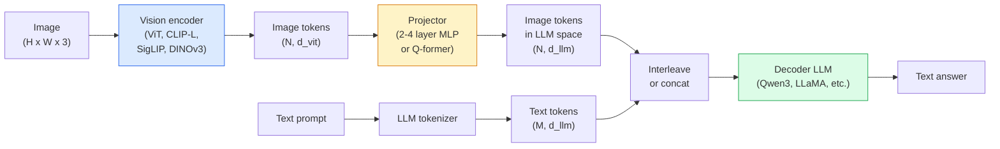

# 視覺語言模型 —— ViT-MLP-LLM 模式

> 一個視覺編碼器把影像轉成詞元。一個 MLP 投影層把那些詞元映射到 LLM 的嵌入空間。剩下的交給語言模型。這個模式 —— ViT-MLP-LLM —— 就是 2026 年每一個生產環境 VLM 的長相。

**類型：** 學習 + 應用
**程式語言：** Python
**先修單元：** 階段 4 單元 14（ViT）、階段 4 單元 18（CLIP）、階段 7 單元 02（自注意力）
**時間：** 約 75 分鐘

## 學習目標

- 說出 ViT-MLP-LLM 架構，並解釋三個元件各自貢獻了什麼
- 從參數量、脈絡長度與基準表現三個面向比較 Qwen3-VL、InternVL3.5、LLaVA-Next 與 GLM-4.6V
- 解釋 DeepStack：為什麼多層次的 ViT 特徵比單一最後層特徵更能收緊視覺與語言的模態對齊
- 在生產環境用跨模態錯誤率（CMER）量測 VLM 幻覺，並根據這個訊號採取行動

## 問題所在

CLIP（階段 4 單元 18）給你一個影像與文字共享的嵌入空間，這對零樣本分類和檢索已經夠用。但它回答不了「這張影像裡有幾台紅色的車？」，因為 CLIP 不生成文字 —— 它只算相似度分數。

視覺語言模型（VLM）—— Qwen3-VL、InternVL3.5、LLaVA-Next、GLM-4.6V —— 把一個 CLIP 家族的影像編碼器接到一個完整的語言模型上。模型看到一張影像加一個問題，然後生成答案。2026 年的開源 VLM 在多模態基準（MMMU、MMBench、DocVQA、ChartQA、MathVista、OSWorld）上已經追平甚至打贏 GPT-5 和 Gemini-2.5-Pro。

這三件套（ViT、投影層、LLM）就是標準做法。模型之間的差異在於用哪個 ViT、哪個投影層、哪個 LLM，以及訓練資料和對齊配方。一旦你懂了這個模式，替換任何一個元件都只是機械操作。

## 核心概念

### ViT-MLP-LLM 架構



1. **視覺編碼器** —— 一個預訓練好的 ViT（CLIP-L/14、SigLIP、DINOv3，或某個微調過的變體）。產出圖塊詞元。
2. **投影層** —— 一個小模組（2 到 4 層的 MLP，或一個 Q-former），把視覺詞元映射到 LLM 的嵌入維度。大部分的微調都發生在這裡。
3. **LLM** —— 一個純解碼器語言模型（Qwen3、Llama、Mistral、GLM、InternLM）。依序讀入視覺 + 文字詞元，生成文字。

原則上三個部分都可以訓練。實務上，視覺編碼器和 LLM 大多維持凍結主幹，只訓練投影層 —— 用很低的成本換到幾十億參數規模的訊號。

### DeepStack

普通的投影只用 ViT 的最後一層。DeepStack（Qwen3-VL）從 ViT 的多個深度取樣特徵並疊起來。較深的層帶著高階語意；較淺的層帶著細粒度的空間與紋理資訊。把兩者都餵進 LLM，就補上了「這張影像裡有什麼」（語意）和「到底在哪裡」（空間定位）之間的落差。

### 三個訓練階段

現代 VLM 分階段訓練：

1. **對齊** —— 凍結 ViT 和 LLM。只在（影像，圖說）配對上訓練投影層。教投影層把視覺空間映射進語言空間。
2. **預訓練** —— 全部解凍。在大規模的圖文交錯資料（5 億組以上配對）上訓練。建立模型的視覺知識。
3. **指令微調** —— 在精選的（影像，問題，答案）三元組上微調。教會模型對話行為和任務格式。這一步才把一個「看得懂影像的語言模型」變成堪用的助理。

大多數 LoRA 微調針對的是第 3 階段，用一份小型的標註資料集。

### 模型家族對照（2026 年初）

| 模型 | 參數量 | 視覺編碼器 | LLM | 脈絡長度 | 強項 |
|-------|--------|----------------|-----|---------|-----------|
| Qwen3-VL-235B-A22B (MoE) | 235B（22B 啟用） | 自研 ViT + DeepStack | Qwen3 | 256K | 通用 SOTA、GUI 代理程式 |
| Qwen3-VL-30B-A3B (MoE) | 30B（3B 啟用） | 自研 ViT + DeepStack | Qwen3 | 256K | 較小的 MoE 選項 |
| Qwen3-VL-8B (dense) | 8B | 自研 ViT | Qwen3 | 128K | 生產環境的稠密模型預設 |
| InternVL3.5-38B | 38B | InternViT-6B | Qwen3 + GPT-OSS | 128K | MMBench／MMVet 表現強 |
| InternVL3.5-241B-A28B | 241B（28B 啟用） | InternViT-6B | Qwen3 | 128K | 足以和 GPT-4o 一較高下 |
| LLaVA-Next 72B | 72B | SigLIP | Llama-3 | 32K | 開源、好微調 |
| GLM-4.6V | ~70B | 自研 | GLM | 64K | 開源、OCR 強 |
| MiniCPM-V-2.6 | 8B | SigLIP | MiniCPM | 32K | 適合端側 |

### 視覺代理程式

Qwen3-VL-235B 在 OSWorld 上達到全球頂尖表現 —— 那是一套針對**視覺代理程式**的基準，衡量它們操作 GUI（桌面、行動、網頁）的能力。模型看到一張螢幕截圖，理解那個 UI，然後發出動作（點擊、輸入、捲動）。搭配工具，它就能把常見的桌面任務整個跑完。2026 年大多數「AI PC」示範底下跑的就是這個。

### 代理能力 + RoPE 變體

VLM 需要知道某一格畫面在影片裡的**時間點**。Qwen3-VL 從 T-RoPE（時序旋轉位置嵌入）演進到**基於文字的時間對齊** —— 把明確的時間戳文字詞元和影片畫面交錯排列。模型看到「`<timestamp 00:32>` 畫面, 提示詞」，就能對時序關係做推理。

### 對齊問題

在爬取來的資料集中，有 12% 的圖文配對，其描述並沒有完全立足於影像內容。用這種資料訓練出來的 VLM 會不知不覺學會產生幻覺 —— 憑空生出物件、看錯數字、發明關係。在生產環境裡，這是最主要的失效模式。

Skywork.ai 提出**跨模態錯誤率（Cross-Modal Error Rate, CMER）**來追蹤它：

```
CMER = fraction of outputs where the text confidence is high but the image-text similarity (via a CLIP-family checker) is low
```

CMER 高，代表模型正在很有信心地講一些影像裡沒有根據的事。在他們的部署中，監控 CMER 並把它當成生產環境 KPI，把幻覺率壓低了約 35%。訣竅不是「把模型修好」，而是「把高 CMER 的輸出轉去人工審核」。

### 用 LoRA／QLoRA 微調

對一個 70B 的 VLM 做全參數微調，大多數團隊碰不起。在注意力層 + 投影層上做 LoRA（rank 16 到 64），或用 4-bit 基礎權重的 QLoRA，單張 A100／H100 就塞得下。成本：5,000 到 50,000 筆範例、100 到 5,000 美元的運算費、2 到 10 小時的訓練。

### 空間推理仍然很弱

目前的 VLM 在空間推理基準（上下、左右、計數、距離）上只有 50 到 60% 的分數。如果你的使用情境取決於「哪個物件疊在哪個物件上面」，就要大力驗證 —— 通用 VLM 的表現低於人類。純空間任務有比 VLM 更好的替代方案：一個專門的關鍵點／姿態估計器、一個深度模型，或一個偵測模型再對框的幾何關係做後處理。

## 動手實作

### 步驟 1：投影層

你最常訓練的那個部分。2 到 4 層的 MLP，搭配 GELU。

```python
import torch
import torch.nn as nn


class Projector(nn.Module):
    def __init__(self, vit_dim=768, llm_dim=4096, hidden=4096):
        super().__init__()
        self.net = nn.Sequential(
            nn.Linear(vit_dim, hidden),
            nn.GELU(),
            nn.Linear(hidden, llm_dim),
        )

    def forward(self, x):
        return self.net(x)
```

輸入是一個 `(N_patches, d_vit)` 的詞元張量。輸出是 `(N_patches, d_llm)`。對 LLM 來說，輸出的每一列就只是又一個詞元。

### 步驟 2：把 ViT-MLP-LLM 端到端組起來

一個最小 VLM 前向傳播的骨架。真實程式碼會用 `transformers`；這裡呈現的是概念上的排列方式。

```python
class MinimalVLM(nn.Module):
    def __init__(self, vit, projector, llm, image_token_id):
        super().__init__()
        self.vit = vit
        self.projector = projector
        self.llm = llm
        self.image_token_id = image_token_id  # placeholder token in text prompt

    def forward(self, image, input_ids, attention_mask):
        # 1. vision features
        vision_tokens = self.vit(image)                     # (B, N_patches, d_vit)
        vision_embeds = self.projector(vision_tokens)       # (B, N_patches, d_llm)

        # 2. text embeddings
        text_embeds = self.llm.get_input_embeddings()(input_ids)  # (B, M, d_llm)

        # 3. replace image placeholder tokens with vision embeds
        merged = self._merge(text_embeds, vision_embeds, input_ids)

        # 4. run LLM
        return self.llm(inputs_embeds=merged, attention_mask=attention_mask)

    def _merge(self, text_embeds, vision_embeds, input_ids):
        out = text_embeds.clone()
        expected = vision_embeds.size(1)
        for b in range(input_ids.size(0)):
            positions = (input_ids[b] == self.image_token_id).nonzero(as_tuple=True)[0]
            if len(positions) != expected:
                raise ValueError(
                    f"batch item {b} has {len(positions)} image tokens but vision_embeds has {expected} patches."
                    " Every sample in the batch must be pre-padded to the same number of image placeholder tokens.")
            out[b, positions] = vision_embeds[b]
        return out
```

文字裡的 `<image>` 佔位詞元會被換成真正的影像嵌入 —— 和 LLaVA、Qwen-VL、InternVL 用的是同一個模式。

### 步驟 3：計算 CMER

一個輕量的執行期檢查。

```python
import torch.nn.functional as F


def cross_modal_error_rate(image_emb, text_emb, text_confidence, sim_threshold=0.25, conf_threshold=0.8):
    """
    image_emb, text_emb: embeddings of image and generated text (normalised internally)
    text_confidence:     mean per-token probability in [0, 1]
    Returns:             fraction of high-confidence outputs with low image-text alignment
    """
    image_emb = F.normalize(image_emb, dim=-1)
    text_emb = F.normalize(text_emb, dim=-1)
    sim = (image_emb * text_emb).sum(dim=-1)        # cosine similarity
    high_conf_low_sim = (text_confidence > conf_threshold) & (sim < sim_threshold)
    return high_conf_low_sim.float().mean().item()
```

把 CMER 當成生產環境 KPI。按端點、按提示詞類型、按客戶分別監控。CMER 上升，表示模型開始在某個輸入分布上產生幻覺。

### 步驟 4：玩具 VLM 分類器（可執行）

示範投影層真的訓練得起來。餵進假的「ViT 特徵」；一個 LLM 風格的迷你詞元預測出一個類別。

```python
class ToyVLM(nn.Module):
    def __init__(self, vit_dim=32, llm_dim=64, num_classes=5):
        super().__init__()
        self.projector = Projector(vit_dim, llm_dim, hidden=64)
        self.head = nn.Linear(llm_dim, num_classes)

    def forward(self, vision_tokens):
        projected = self.projector(vision_tokens)
        pooled = projected.mean(dim=1)
        return self.head(pooled)
```

在合成的（特徵，類別）配對上，200 步以內就能擬合 —— 足以證明投影層這套模式行得通。

## 框架應用

2026 年生產團隊使用 VLM 的三種方式：

- **託管 API** —— OpenAI Vision、Anthropic Claude Vision、Google Gemini Vision。零基礎設施，但有供應商風險。
- **開源自架** —— 用 `transformers` 和 `vllm` 跑 Qwen3-VL 或 InternVL3.5。完全掌控，但前期投入較高。
- **針對領域微調** —— 載入 Qwen2.5-VL-7B 或 LLaVA-1.6-7B，在 5k 到 50k 筆自訂範例上做 LoRA，再用 `vllm` 或 `TGI` 提供服務。

```python
from transformers import AutoProcessor, AutoModelForVision2Seq
import torch
from PIL import Image

model_id = "Qwen/Qwen3-VL-8B-Instruct"
processor = AutoProcessor.from_pretrained(model_id)
model = AutoModelForVision2Seq.from_pretrained(model_id, torch_dtype=torch.bfloat16, device_map="auto")

messages = [{
    "role": "user",
    "content": [
        {"type": "image", "image": Image.open("plot.png")},
        {"type": "text", "text": "What does this chart show?"},
    ],
}]
inputs = processor.apply_chat_template(messages, add_generation_prompt=True, tokenize=True, return_dict=True, return_tensors="pt").to("cuda")
generated = model.generate(**inputs, max_new_tokens=256)
answer = processor.decode(generated[0][inputs["input_ids"].shape[1]:], skip_special_tokens=True)
```

`apply_chat_template` 把 `<image>` 佔位詞元的分詞細節藏了起來；合併是模型內部處理的。

## 產出交付

本單元產出：

- `outputs/prompt-vlm-selector.md` —— 給定準確率、延遲、脈絡長度與預算，在 Qwen3-VL／InternVL3.5／LLaVA-Next／API 之間做選擇。
- `outputs/skill-cmer-monitor.md` —— 產出程式碼，為生產環境的 VLM 端點裝上跨模態錯誤率的量測、逐端點的儀表板，以及告警門檻。

## 練習

1. **（簡單）** 在五張影像上，用任一個開源 VLM 跑三個提示詞（「這是什麼？」、「數一下有幾個物件」、「描述這個場景」）。手動把每個答案評為正確／部分正確／幻覺。算出一個初版的類 CMER 比率。
2. **（中等）** 用 LoRA（rank 16）在目標領域的 500 張附圖說影像上微調 Qwen2.5-VL-3B 或 LLaVA-1.6-7B。比較零樣本與微調後的 MMBench 式準確率。
3. **（困難）** 把 VLM 的影像編碼器從預設的 SigLIP／CLIP 換成 DINOv3。只重新訓練投影層（凍結 LLM + 凍結 DINOv3）。量測稠密預測任務（計數、空間推理）有沒有變好。

## 關鍵術語

| 術語 | 大家怎麼說 | 實際上是什麼 |
|------|----------------|----------------------|
| ViT-MLP-LLM | 「那個 VLM 模式」 | 視覺編碼器 + 投影層 + 語言模型；2026 年每一個 VLM 都這樣 |
| 投影層 | 「那座橋」 | 2 到 4 層的 MLP（或 Q-former），把視覺詞元映射進 LLM 的嵌入空間 |
| DeepStack | 「Qwen3-VL 的特徵訣竅」 | 疊起多層次的 ViT 特徵，而不是只用最後一層 |
| 影像詞元 | 「`<image>` 佔位符」 | 文字串流裡的特殊詞元，會被投影後的視覺嵌入取代 |
| CMER | 「幻覺 KPI」 | 跨模態錯誤率；文字信心高但圖文相似度低時就會偏高 |
| 視覺代理程式 | 「會點擊的 VLM」 | 用工具呼叫操作 GUI（OSWorld、行動、網頁）的 VLM |
| Q-former | 「固定數量的詞元橋梁」 | BLIP-2 風格的投影層，產出固定數量的視覺查詢詞元 |
| 對齊／預訓練／指令微調 | 「三個階段」 | 標準的 VLM 訓練流程 |

## 延伸閱讀

- [Qwen3-VL Technical Report (arXiv 2511.21631)](https://arxiv.org/abs/2511.21631)
- [InternVL3.5 Advancing Open-Source Multimodal Models (arXiv 2508.18265)](https://arxiv.org/html/2508.18265v1)
- [LLaVA-Next series](https://llava-vl.github.io/blog/2024-05-10-llava-next-stronger-llms/)
- [BentoML: Best Open-Source VLMs 2026](https://www.bentoml.com/blog/multimodal-ai-a-guide-to-open-source-vision-language-models)
- [MMMU: Multi-discipline Multimodal Understanding benchmark](https://mmmu-benchmark.github.io/)
- [VLMs in manufacturing (Robotics Tomorrow, March 2026)](https://www.roboticstomorrow.com/story/2026/03/when-machines-learn-to-see-like-experts-the-rise-of-vision-language-models-in-manufacturing/26335/)
