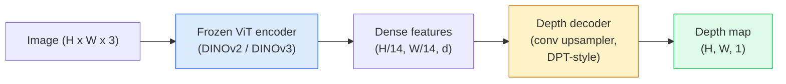

# 單目深度與幾何估計

> 深度圖是一張單通道影像，每個像素存的是離相機的距離。過去沒有立體視覺或 LiDAR，就不可能從單張 RGB 影格預測出它。到了 2026 年，一個凍結的 ViT 編碼器加一個輕量的 head，就能做到跟標準答案只差幾個百分點。

**類型：** 實作 + 應用
**程式語言：** Python
**先修單元：** 階段 4 · 單元 14（ViT）、階段 4 · 單元 17（自監督視覺）、階段 4 · 單元 07（U-Net）
**時間：** 約 60 分鐘

## 學習目標

- 分辨相對深度與度量深度，並說出每個生產級模型（MiDaS、Marigold、Depth Anything V3、ZoeDepth）各自解的是哪一種
- 用 Depth Anything V3（DINOv2 骨幹）對任意單張影像預測深度，完全不需要校正
- 解釋單目深度為什麼光靠一張影像就成立（透視線索、紋理梯度、學到的先驗），以及它復原不了什麼（絕對尺度、被遮擋的幾何）
- 用深度圖加針孔相機內參，把 2D 偵測結果提升到 3D 點

## 問題所在

深度是 2D 電腦視覺裡缺掉的那一個軸。給你 RGB，你知道東西出現在影像平面的哪裡；你不知道它們有多遠。深度感測器（立體相機組、LiDAR、time-of-flight）直接解掉這件事，但它們貴、脆弱，量程也有限。

單目深度估計 —— 從單張 RGB 影格預測深度 —— 過去產出的結果模糊又不可靠。到 2026 年，大型預訓練編碼器改變了這件事：Depth Anything V3 用一個凍結的 DINOv2 骨幹，產出的深度圖能跨室內、室外、醫學、衛星影像各種領域泛化。Marigold 把深度重新表述成一個條件擴散問題。ZoeDepth 則直接回歸真實的度量距離。

深度也是 2D 偵測通往 3D 理解的橋樑：把一個偵測框裡的像素乘上深度，你就把這個 2D 物件提升成了 3D 點雲。這是每一套 AR 遮擋系統、每一條避障流程、每一台「把杯子拿起來」機器人的核心。

## 核心概念

### 相對深度與度量深度

- **相對深度** —— 有序的 `z` 值，但沒有真實世界的單位。「像素 A 比像素 B 近，但距離的比例並沒有錨定到公尺。」
- **度量深度** —— 離相機的絕對距離，以公尺計。這要求模型學到影像線索與真實距離之間的統計關係。

MiDaS 與 Depth Anything V3 產出相對深度。Marigold 產出相對深度。ZoeDepth、UniDepth、Metric3D 產出度量深度。度量模型對相機內參很敏感；相對模型不會。

### 編碼器／解碼器模式



Depth Anything V3 凍結編碼器，只訓練 DPT 風格的解碼器。編碼器提供豐富的特徵；解碼器把它們內插回影像解析度，並回歸出深度。

### 單一張影像為什麼能產生深度

一張 2D 影像裡含有許多與深度相關的單目線索：

- **透視** —— 3D 裡平行的線，在 2D 裡會匯聚。
- **紋理梯度** —— 遠處的表面，紋理更小、更密。
- **遮擋順序** —— 近的物體會遮住遠的。
- **大小恆常性** —— 已知的物體（汽車、人）能給出大略的尺度。
- **空氣透視** —— 室外場景裡，遠處的物體看起來更朦朧、更偏藍。

一個用數十億張影像訓練出來的 ViT，會把這些線索內化。只要資料夠多、骨幹夠強，單目深度就能在沒有任何顯式 3D 監督的情況下達到合理的準確度。

### 單目深度做不到的事

- 沒有相機內參、也沒有場景中已知物體時，拿不到**絕對的度量尺度**。網路可以預測「杯子比湯匙遠一倍」，卻不知道杯子是在 1 公尺還是 10 公尺外。
- **被遮擋的幾何** —— 椅子的背面看不到，也無法可靠地推得出來。
- **真正沒有紋理／會反射的表面** —— 鏡子、玻璃、單色牆面。網路會回報一個看起來合理、但其實錯的深度。

### 2026 年的 Depth Anything V3

- 編碼器用原味的 DINOv2 ViT-L/14（凍結）。
- DPT 解碼器。
- 用來源多樣的已知姿態影像對訓練（除了光度一致性之外，不需要顯式的深度監督）。
- 能從**任意數量的視覺輸入預測空間上一致的幾何，不管相機姿態已知或未知**。
- 在單目深度、任意視角幾何、視覺渲染、相機姿態估計上都是 SOTA。

2026 年你需要深度時，這就是那個直接拿來用的模型。

### Marigold —— 用擴散模型做深度

Marigold（Ke et al., CVPR 2024）把深度估計重新表述成條件式的影像到影像擴散。條件是 RGB，目標是深度圖。骨幹用的是預訓練好的 Stable Diffusion 2 U-Net。輸出的深度圖在物體邊界上格外銳利。代價是：推論比前饋模型慢（要 10 到 50 個去噪步驟）。

### 相機內參與針孔相機模型

要把一個帶深度 `d` 的像素 `(u, v)` 提升成相機座標下的 3D 點 `(X, Y, Z)`：

```
fx, fy, cx, cy = camera intrinsics
X = (u - cx) * d / fx
Y = (v - cy) * d / fy
Z = d
```

相機內參來自 EXIF metadata、校正板，或是單目內參估計器（Perspective Fields、UniDepth）。沒有內參，你還是可以假設 60 到 70 度的 FOV 與中等解析度的主點，硬渲染出一團點雲 —— 拿來視覺化可以，拿來量測不行。

### 評估

兩個標準指標：

- **AbsRel**（絕對相對誤差）：`mean(|d_pred - d_gt| / d_gt)`。越低越好。生產級模型在 0.05 到 0.1。
- **delta < 1.25**（門檻準確率）：滿足 `max(d_pred/d_gt, d_gt/d_pred) < 1.25` 的像素比例。越高越好。SOTA 在 0.9 以上。

對相對深度模型（Depth Anything V3、MiDaS），評估時兩個指標都要用尺度與位移不變的版本。

## 動手實作

### 步驟 1：深度指標

```python
import torch

def abs_rel_error(pred, target, mask=None):
    if mask is not None:
        pred = pred[mask]
        target = target[mask]
    return (torch.abs(pred - target) / target.clamp(min=1e-6)).mean().item()


def delta_accuracy(pred, target, threshold=1.25, mask=None):
    if mask is not None:
        pred = pred[mask]
        target = target[mask]
    ratio = torch.maximum(pred / target.clamp(min=1e-6), target / pred.clamp(min=1e-6))
    return (ratio < threshold).float().mean().item()
```

評估前一定要把無效的深度像素（零、NaN、飽和）遮掉。

### 步驟 2：尺度與位移對齊

對相對深度模型，算指標之前要先把預測對齊到標準答案。用最小平方法擬合 `a * pred + b = target`：

```python
def align_scale_shift(pred, target, mask=None):
    if mask is not None:
        p = pred[mask]
        t = target[mask]
    else:
        p = pred.flatten()
        t = target.flatten()
    A = torch.stack([p, torch.ones_like(p)], dim=1)
    coeffs, *_ = torch.linalg.lstsq(A, t.unsqueeze(-1))
    a, b = coeffs[:2, 0]
    return a * pred + b
```

評估 MiDaS / Depth Anything 時，`abs_rel_error` 之前先跑 `align_scale_shift`。

### 步驟 3：把深度提升成點雲

```python
import numpy as np

def depth_to_point_cloud(depth, intrinsics):
    H, W = depth.shape
    fx, fy, cx, cy = intrinsics
    v, u = np.meshgrid(np.arange(H), np.arange(W), indexing="ij")
    z = depth
    x = (u - cx) * z / fx
    y = (v - cy) * z / fy
    return np.stack([x, y, z], axis=-1)


depth = np.random.uniform(0.5, 4.0, (240, 320))
intr = (320.0, 320.0, 160.0, 120.0)
pc = depth_to_point_cloud(depth, intr)
print(f"point cloud shape: {pc.shape}  (H, W, 3)")
```

一個函式，撐起每一種 3D 提升的應用。把點雲匯出成 `.ply`，再用 MeshLab 或 CloudCompare 打開。

### 步驟 4：用合成深度場景做煙霧測試

```python
def synthetic_depth(size=96):
    yy, xx = np.meshgrid(np.arange(size), np.arange(size), indexing="ij")
    # Floor: linear gradient from near (top) to far (bottom)
    depth = 1.0 + (yy / size) * 4.0
    # Box in the middle: closer
    mask = (np.abs(xx - size / 2) < size / 6) & (np.abs(yy - size * 0.6) < size / 6)
    depth[mask] = 2.0
    return depth.astype(np.float32)


gt = torch.from_numpy(synthetic_depth(96))
pred = gt + 0.3 * torch.randn_like(gt)  # simulated prediction
aligned = align_scale_shift(pred, gt)
print(f"before align  absRel = {abs_rel_error(pred, gt):.3f}")
print(f"after align   absRel = {abs_rel_error(aligned, gt):.3f}")
```

### 步驟 5：Depth Anything V3 用法（參考）

```python
import torch
from transformers import pipeline
from PIL import Image

pipe = pipeline(task="depth-estimation", model="LiheYoung/depth-anything-v2-large")

image = Image.open("street.jpg").convert("RGB")
out = pipe(image)
depth_np = np.array(out["depth"])
```

三行。`out["depth"]` 是一張 PIL 灰階圖；要做數學運算就轉成 numpy。要用 Depth Anything V3 的話，等它釋出後把 model id 換掉就好，API 沒有變。

## 框架應用

- **Depth Anything V3**（Meta AI / ByteDance，2024-2026）—— 相對深度的預設選擇。生產環境裡最快的 ViT-large 骨幹模型。
- **Marigold**（ETH，2024）—— 視覺品質最高，推論慢。
- **UniDepth**（ETH，2024）—— 度量深度，並附帶相機內參估計。
- **ZoeDepth**（Intel，2023）—— 度量深度；比較舊，但仍然可靠。
- **MiDaS v3.1** —— 老派但穩定；拿來當比較基準很好用。

典型的整合模式：

1. RGB 影格進來。
2. 深度模型產出深度圖。
3. 偵測器產出框。
4. 把框的形心穿過深度提升到 3D；有點雲的話就合併進去。
5. 下游：AR 遮擋、路徑規劃、物體尺寸估計、取代立體相機。

要即時使用的話，Depth Anything V2 Small（INT8 量化）在 518x518 下，於消費級 GPU 上可以跑到約 30 fps。

## 產出交付

這個單元會產出：

- `outputs/prompt-depth-model-picker.md` —— 依延遲需求、要度量深度還是相對深度、以及場景類型，在 Depth Anything V3、Marigold、UniDepth、MiDaS 之間做選擇。
- `outputs/skill-depth-to-pointcloud.md` —— 一項技能，從深度圖建出點雲，正確處理相機內參，並匯出成 `.ply`。

## 練習

1. **（簡單）** 對你書桌的任意 10 張照片跑 Depth Anything V2。把深度存成灰階 PNG 並檢視。找出一個預測深度看起來明顯錯掉的物體，並解釋是哪些單目線索失效了。
2. **（中等）** 拿 Depth Anything V2 的 RGB + 深度，提升成點雲並用 `open3d` 渲染。比較兩個場景（室內／室外），記下哪一個看起來更可信。
3. **（困難）** 拍五組影像對，每組只差在某個已知物體的位置（例如瓶子往前移動 30 公分）。用 UniDepth 對兩張都預測度量深度。回報預測出的距離差與真實的 30 公分差多少。

## 關鍵術語

| 術語 | 大家怎麼說 | 實際上是什麼 |
|------|----------------|----------------------|
| 單目深度 | 「單張影像的深度」 | 從一張 RGB 影格估計深度，不用立體視覺也不用 LiDAR |
| 相對深度 | 「有序的深度」 | 有序的 z 值，但沒有真實世界單位 |
| 度量深度 | 「絕對距離」 | 以公尺計的深度；需要校正，或需要一個用度量監督訓練過的模型 |
| AbsRel | 「絕對相對誤差」 | |d_pred - d_gt| / d_gt 的平均；標準的深度指標 |
| Delta 準確率 | 「delta < 1.25」 | 預測落在標準答案 25% 以內的像素比例 |
| 針孔相機 | 「fx, fy, cx, cy」 | 用來把 (u, v, d) 提升成 (X, Y, Z) 的相機模型 |
| DPT | 「Dense Prediction Transformer」 | 疊在凍結 ViT 編碼器上做深度的卷積式解碼器 |
| DINOv2 骨幹 | 「它會成功的原因」 | 不需要深度標註就能跨領域泛化的自監督特徵 |

## 延伸閱讀

- [Depth Anything V3 paper page](https://depth-anything.github.io/) —— 用 DINOv2 編碼器做到 SOTA 的單目深度
- [Marigold (Ke et al., CVPR 2024)](https://marigoldmonodepth.github.io/) —— 基於擴散模型的深度估計
- [UniDepth (Piccinelli et al., 2024)](https://arxiv.org/abs/2403.18913) —— 帶相機內參的度量深度
- [MiDaS v3.1 (Intel ISL)](https://github.com/isl-org/MiDaS) —— 相對深度的標準基準線
- [DINOv3 blog post (Meta)](https://ai.meta.com/blog/dinov3-self-supervised-vision-model/) —— 撐起深度準確度的那個編碼器家族
