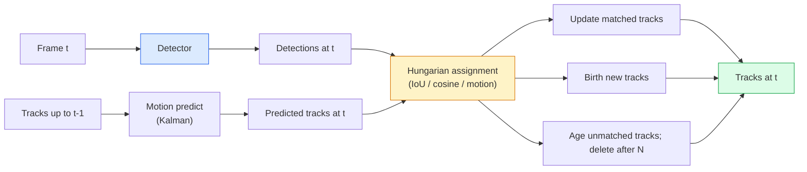

# 多物件追蹤與影片記憶

> 追蹤就是偵測加上關聯。每一幀都偵測一次，再把這一幀的偵測結果按身分對上前一幀的軌跡。

**類型：** 實作
**程式語言：** Python
**先修單元：** 階段 4 · 06（YOLO 偵測）、階段 4 · 08（Mask R-CNN）、階段 4 · 24（SAM 3）
**時間：** 約 60 分鐘

## 學習目標

- 區分偵測後追蹤與基於查詢的追蹤，並說出各個演算法家族的名字（SORT、DeepSORT、ByteTrack、BoT-SORT、SAM 2 記憶式追蹤器、SAM 3.1 Object Multiplex）
- 從零實作 IoU 加匈牙利指派，做出一套經典的偵測後追蹤
- 解釋 SAM 2 的記憶庫，以及它為什麼比基於 IoU 的資料關聯更能應付遮擋
- 讀懂三個追蹤指標（MOTA、IDF1、HOTA），並判斷特定使用情境該看哪一個

## 問題所在

偵測器告訴你單一幀裡的物件在哪。追蹤器告訴你第 `t` 幀的哪一個偵測結果，跟第 `t-1` 幀的某個偵測結果是同一個物件。少了這一步，你就數不出有多少物件越過一條線、跟不住一顆球穿過遮擋，也不會知道「4 號車已經在這條車道上待了 8 秒」。

追蹤是每一個面向影片的產品都少不了的東西：運動分析、監控、自駕、醫療影片分析、野生動物監測、商標字樣計數。核心零件是共通的：一個逐幀的偵測器、一個運動模型（卡爾曼濾波或更豐富的東西）、一個關聯步驟（在 IoU／cosine／學習得到的特徵上跑匈牙利演算法），以及一套軌跡生命週期（誕生、更新、死亡）。

2026 年帶來兩種新模式：**SAM 2 的記憶式追蹤**（用特徵記憶取代運動模型的資料關聯），以及 **SAM 3.1 Object Multiplex**（同一個概念的眾多實例共用一份記憶）。本單元先走完整套經典流程，再談記憶式的做法。

## 核心概念

### 偵測後追蹤



你在 2026 年會碰到的每個追蹤器，都是這個迴圈的變體。差別在於：

- **SORT**（2016）：卡爾曼濾波加上 IoU 匈牙利指派。簡單、快，沒有外觀模型。
- **DeepSORT**（2017）：SORT 加上每條軌跡一份基於 CNN 的外觀特徵（ReID 嵌入）。物件交錯而過時處理得更好。
- **ByteTrack**（2021）：把低信賴度的偵測結果留下來做第二階段的資料關聯；不需要外觀特徵，卻在 MOT17 上是頂尖水準。
- **BoT-SORT**（2022）：Byte 加上相機運動補償，再加上 ReID。
- **StrongSORT／OC-SORT** —— ByteTrack 的後代，運動模型與外觀模型都更好。

### 一段話講完卡爾曼濾波

卡爾曼濾波為每條軌跡維護一份帶共變異數的狀態 `(x, y, w, h, dx, dy, dw, dh)`。每一幀先用等速模型**預測**狀態，再用配對到的偵測結果**更新**。預測的不確定性高時，更新就更信任偵測結果。這帶來平滑的軌跡，也讓一條軌跡有能力撐過短暫的遮擋（1-5 幀）。

每個經典追蹤器的運動預測步驟都用卡爾曼濾波。

### 匈牙利演算法

給定一個 `M x N` 的關聯成本矩陣（軌跡 x 偵測結果），找出讓總成本最小的一對一指派。成本通常取 `1 - IoU(track_bbox, detection_bbox)`，或是外觀特徵餘弦相似度的負值。複雜度是 O((M+N)^3)；M、N 在 ~1000 以內時，用 `scipy.optimize.linear_sum_assignment` 在 Python 裡跑就夠快了。

### ByteTrack 的關鍵想法

一般的追蹤器會把低信賴度（< 0.5）的偵測結果丟掉。ByteTrack 把它們留在手邊當作**第二階段的候選**：先把軌跡配對到高信賴度的偵測結果，沒配到的軌跡再用稍微寬鬆一點的 IoU 門檻，去試著配對低信賴度的偵測結果。這能救回短暫的遮擋，以及人群附近的身分切換。

### SAM 2 的記憶式追蹤

SAM 2 處理影片的方式，是為每個實例維護一份時空特徵的**記憶庫**。給定某一幀上的提示（點擊、框、文字），它把該實例編碼進記憶裡。接下來的每一幀，記憶會與新一幀的特徵做交叉注意力，解碼器再為新一幀裡的同一個實例產生遮罩。

沒有卡爾曼濾波，沒有匈牙利指派。資料關聯隱含在記憶注意力這個運算裡。

優點：
- 對大範圍的遮擋很穩健（記憶把實例的身分帶過很多幀）。
- 搭配 SAM 3 的文字提示就是開放詞彙的。
- 不需要另外一個運動模型也能運作。

缺點：
- 多物件追蹤時比 ByteTrack 慢。
- 記憶庫會長大，把脈絡窗口撐滿。

### SAM 3.1 Object Multiplex

先前的 SAM 2／SAM 3 追蹤是每個實例各一份記憶庫。50 個物件就是 50 份記憶庫。Object Multiplex（2026 年 3 月）把它們收攏成一份共享記憶，配上**每個實例一組查詢詞元**。成本隨實例數是次線性成長的。

Multiplex 是 2026 年人群追蹤的新預設：演唱會人群、倉儲工人、交通路口。

### 該知道的三個指標

- **MOTA（Multi-Object Tracking Accuracy）** —— 1 - (FN + FP + ID switches) / GT。依錯誤類型加權；單一個數字，但把偵測失敗與關聯失敗混在一起。
- **IDF1（ID F1）** —— 身分 precision 與 recall 的調和平均。專門看每一條真實軌跡把自己的身分維持得多好。對身分切換敏感的任務，它比 MOTA 好用。
- **HOTA（Higher Order Tracking Accuracy）** —— 拆解成偵測準確度（DetA）與關聯準確度（AssA）。2020 年以來的社群標準；最全面。

監控場景（誰是誰）：報 IDF1。運動分析（數傳球次數）：HOTA。一般學術比較：HOTA。

```figure
cv3-track-assoc
```

## 動手實作

### 步驟 1：以 IoU 為成本的矩陣

```python
import numpy as np


def bbox_iou(a, b):
    """
    a, b: (N, 4) arrays of [x1, y1, x2, y2].
    Returns (N_a, N_b) IoU matrix.
    """
    ax1, ay1, ax2, ay2 = a[:, 0], a[:, 1], a[:, 2], a[:, 3]
    bx1, by1, bx2, by2 = b[:, 0], b[:, 1], b[:, 2], b[:, 3]
    inter_x1 = np.maximum(ax1[:, None], bx1[None, :])
    inter_y1 = np.maximum(ay1[:, None], by1[None, :])
    inter_x2 = np.minimum(ax2[:, None], bx2[None, :])
    inter_y2 = np.minimum(ay2[:, None], by2[None, :])
    inter = np.clip(inter_x2 - inter_x1, 0, None) * np.clip(inter_y2 - inter_y1, 0, None)
    area_a = (ax2 - ax1) * (ay2 - ay1)
    area_b = (bx2 - bx1) * (by2 - by1)
    union = area_a[:, None] + area_b[None, :] - inter
    return inter / np.clip(union, 1e-8, None)
```

### 步驟 2：極簡的 SORT 風格追蹤器

固定的等速卡爾曼濾波為求精簡先省略——這裡只用單純的 IoU 資料關聯；在生產環境裡，卡爾曼的預測步驟是必要的。`sort` 這個 Python 套件提供了完整版本。

```python
from scipy.optimize import linear_sum_assignment


class Track:
    def __init__(self, tid, bbox, frame):
        self.id = tid
        self.bbox = bbox
        self.last_frame = frame
        self.hits = 1

    def update(self, bbox, frame):
        self.bbox = bbox
        self.last_frame = frame
        self.hits += 1


class SimpleTracker:
    def __init__(self, iou_threshold=0.3, max_age=5):
        self.tracks = []
        self.next_id = 1
        self.iou_threshold = iou_threshold
        self.max_age = max_age

    def step(self, detections, frame):
        if not self.tracks:
            for d in detections:
                self.tracks.append(Track(self.next_id, d, frame))
                self.next_id += 1
            return [(t.id, t.bbox) for t in self.tracks]

        track_boxes = np.array([t.bbox for t in self.tracks])
        det_boxes = np.array(detections) if len(detections) else np.empty((0, 4))

        iou = bbox_iou(track_boxes, det_boxes) if len(det_boxes) else np.zeros((len(track_boxes), 0))
        cost = 1 - iou
        cost[iou < self.iou_threshold] = 1e6

        matched_track = set()
        matched_det = set()
        if cost.size > 0:
            row, col = linear_sum_assignment(cost)
            for r, c in zip(row, col):
                if cost[r, c] < 1.0:
                    self.tracks[r].update(det_boxes[c], frame)
                    matched_track.add(r); matched_det.add(c)

        for i, d in enumerate(det_boxes):
            if i not in matched_det:
                self.tracks.append(Track(self.next_id, d, frame))
                self.next_id += 1

        self.tracks = [t for t in self.tracks if frame - t.last_frame <= self.max_age]
        return [(t.id, t.bbox) for t in self.tracks]
```

60 行。吃逐幀的偵測結果，回傳逐幀的軌跡身分。真實系統還會加上卡爾曼的預測步驟、ByteTrack 的第二階段重新配對，以及外觀特徵。

### 步驟 3：合成軌跡測試

```python
def synthetic_frames(num_frames=20, num_objects=3, H=240, W=320, seed=0):
    rng = np.random.default_rng(seed)
    starts = rng.uniform(20, 200, size=(num_objects, 2))
    velocities = rng.uniform(-5, 5, size=(num_objects, 2))
    frames = []
    for f in range(num_frames):
        dets = []
        for i in range(num_objects):
            cx, cy = starts[i] + f * velocities[i]
            dets.append([cx - 10, cy - 10, cx + 10, cy + 10])
        frames.append(dets)
    return frames


tracker = SimpleTracker()
for f, dets in enumerate(synthetic_frames()):
    tracks = tracker.step(dets, f)
```

三個沿直線移動的物件，應該在全部 20 幀裡都保住自己的身分。

### 步驟 4：身分切換指標

```python
def count_id_switches(tracks_per_frame, gt_per_frame):
    """
    tracks_per_frame:  list of list of (track_id, bbox)
    gt_per_frame:      list of list of (gt_id, bbox)
    Returns number of ID switches.
    """
    prev_assignment = {}
    switches = 0
    for tracks, gts in zip(tracks_per_frame, gt_per_frame):
        if not tracks or not gts:
            continue
        t_boxes = np.array([b for _, b in tracks])
        g_boxes = np.array([b for _, b in gts])
        iou = bbox_iou(g_boxes, t_boxes)
        for g_idx, (gt_id, _) in enumerate(gts):
            j = iou[g_idx].argmax()
            if iou[g_idx, j] > 0.5:
                t_id = tracks[j][0]
                if gt_id in prev_assignment and prev_assignment[gt_id] != t_id:
                    switches += 1
                prev_assignment[gt_id] = t_id
    return switches
```

這是一個簡化過、接近 IDF1 的指標：數一個真實物件被指派到的預測軌跡身分換過幾次。真正的 MOTA／IDF1／HOTA 工具在 `py-motmetrics` 與 `TrackEval` 裡。

## 框架應用

2026 年的生產級追蹤器：

- `ultralytics` —— YOLOv8 內建 ByteTrack／BoT-SORT。`results = model.track(source, tracker="bytetrack.yaml")`。預設選擇。
- `supervision`（Roboflow）—— ByteTrack 的包裝，外加標註工具。
- SAM 2／SAM 3.1 —— 透過 `processor.track()` 做記憶式追蹤。
- 自組流程：偵測器（YOLOv8／RT-DETR）加上 `sort-tracker`／`OC-SORT`／`StrongSORT`。

怎麼挑：

- 行人／車輛／箱子，30 fps 以上：**用 ultralytics 跑 ByteTrack**。
- 人群裡同一個類別的大量實例：**SAM 3.1 Object Multiplex**。
- 遮擋嚴重但外觀可辨識：**DeepSORT／StrongSORT**（ReID 特徵）。
- 運動賽事／複雜互動：**BoT-SORT** 或學習式追蹤器（MOTRv3）。

## 產出交付

本單元會產出：

- `outputs/prompt-tracker-picker.md` —— 給定場景類型、遮擋樣態與延遲預算，挑出 SORT／ByteTrack／BoT-SORT／SAM 2／SAM 3.1。
- `outputs/skill-mot-evaluator.md` —— 寫出一整套評估流程，對著真實軌跡算 MOTA／IDF1／HOTA。

## 練習

1. **（簡單）** 用上面的合成追蹤器分別跑 3、10、30 個物件。回報每一種情況的身分切換次數。指出單靠 IoU 的資料關聯從哪裡開始失效。
2. **（中等）** 在資料關聯之前加上等速卡爾曼的預測步驟。證明短暫（2-3 幀）的遮擋不再造成身分切換。
3. **（困難）** 把 SAM 2 的記憶式追蹤器（透過 `transformers`）接成另一個追蹤後端。在一段 30 秒的人群影片上同時跑 SimpleTracker 與 SAM 2，手動為 5 個顯眼的人標出真實身分，比較兩者的身分切換次數。

## 關鍵術語

| 術語 | 大家怎麼說 | 實際上是什麼 |
|------|----------------|----------------------|
| 偵測後追蹤 | 「先偵測，再關聯」 | 逐幀偵測器加上以 IoU／外觀為成本的匈牙利指派 |
| 卡爾曼濾波 | 「運動預測」 | 線性動力學加上共變異數，用來平滑地預測軌跡並應付遮擋 |
| 匈牙利演算法 | 「最佳指派」 | 解最小成本二分圖匹配問題；`scipy.optimize.linear_sum_assignment` |
| ByteTrack | 「低信賴度的第二輪」 | 把沒配對到的軌跡再拿去配低信賴度的偵測結果，救回短暫的遮擋 |
| DeepSORT | 「SORT 加外觀」 | 加上 ReID 特徵做跨幀配對；保住身分的能力更好 |
| 記憶庫 | 「SAM 2 的招式」 | 每個實例一份跨幀儲存的時空特徵；用交叉注意力取代顯式的資料關聯 |
| Object Multiplex | 「SAM 3.1 的共享記憶」 | 單一份共享記憶配上每個實例一組查詢；多物件追蹤更快 |
| HOTA | 「現代的追蹤指標」 | 拆解成偵測準確度與關聯準確度；社群標準 |

## 延伸閱讀

- [SORT (Bewley et al., 2016)](https://arxiv.org/abs/1602.00763) —— 最精簡的偵測後追蹤論文
- [DeepSORT (Wojke et al., 2017)](https://arxiv.org/abs/1703.07402) —— 加上外觀特徵
- [ByteTrack (Zhang et al., 2022)](https://arxiv.org/abs/2110.06864) —— 低信賴度的第二輪配對
- [BoT-SORT (Aharon et al., 2022)](https://arxiv.org/abs/2206.14651) —— 相機運動補償
- [HOTA (Luiten et al., 2020)](https://arxiv.org/abs/2009.07736) —— 拆解式的追蹤指標
- [SAM 2 video segmentation (Meta, 2024)](https://ai.meta.com/sam2/) —— 記憶式追蹤器
- [SAM 3.1 Object Multiplex (Meta, March 2026)](https://ai.meta.com/blog/segment-anything-model-3/)
