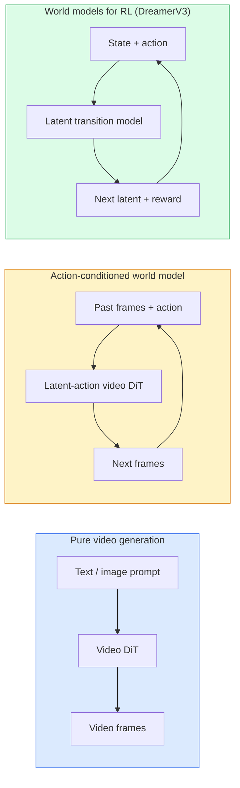

# 世界模型與影片擴散

> 一個能預測場景接下來幾秒的影片模型，就是一個世界模擬器。再把這個預測建立在動作條件之上，你手上就有了一個學出來的遊戲引擎。

**類型：** 學習 + 實作
**程式語言：** Python
**先修單元：** 階段 4 · 單元 10（擴散）、階段 4 · 單元 12（影片理解）、階段 4 · 單元 23（DiT + 修正流）
**時間：** 約 75 分鐘

## 學習目標

- 說明純影片生成模型（Sora 2）與動作條件世界模型（Genie 3、DreamerV3）之間的差別
- 描述一個影片 DiT：時空區塊、3D 位置編碼、跨 (T, H, W) 詞元的聯合注意力
- 追溯世界模型如何接進機器人技術堆疊：VLM 規劃 → 影片模型模擬 → 逆動力學輸出動作
- 針對特定使用情境（創意影片、互動模擬、自動駕駛資料合成），在 Sora 2、Genie 3、Runway GWM-1 Worlds、Wan-Video 與 HunyuanVideo 之間做出選擇

## 問題所在

影片生成與世界模型在 2026 年匯流了。一個能生成連貫一分鐘影片的模型，某種意義上已經學會了世界如何運動：物體恆存性、重力、因果、風格。如果你把這個預測建立在動作條件之上（往左走、開門），影片模型就變成一個可學習的模擬器，能取代遊戲引擎、駕駛模擬器，或機器人訓練環境。

賭注很具體。Genie 3 從單張影像生成可實際操作的環境。Runway GWM-1 Worlds 合成無限延伸、可探索的場景。Sora 2 產出長達一分鐘、聲音同步且對物理有建模的影片。NVIDIA Cosmos-Drive、Wayve Gaia-2 與 Tesla DrivingWorld 為自動駕駛車輛生成擬真的訓練資料影片。世界模型這套範式正在悄悄接管機器人的 sim-to-real。

這個單元是階段 4 的「全局視野」單元。它把影像生成、影片理解與代理式推論，串成主流研究正在收斂過去的那套架構模式。

## 核心概念

### 世界模型的三個家族



- **Sora 2** 是以提示詞為條件的純影片生成。沒有動作介面。你無法在推演途中「操控」它。
- **Genie 3**、**GWM-1 Worlds**、**Mirage / Magica** 是動作條件世界模型。先從觀察到的影片推論出潛在動作，再以動作為條件預測後續影格。它們是互動式的 —— 你按鍵或移動鏡頭，場景就會回應。
- **DreamerV3** 以及經典的強化學習世界模型家族，是在一個潛在空間裡做預測，帶明確的動作條件，並以獎勵訊號訓練。視覺性較低，但對樣本效率高的強化學習更有用。

### 影片 DiT 架構

```
Video latent:          (C, T, H, W)
Patchify (spatial):    grid of P_h x P_w patches per frame
Patchify (temporal):   group P_t frames into a temporal patch
Resulting tokens:      (T / P_t) * (H / P_h) * (W / P_w) tokens
```

位置編碼是 3D 的：對每個 (t, h, w) 座標各給一個旋轉式或學出來的嵌入。注意力可以是：

- **完全聯合** —— 所有詞元對所有詞元做注意力。以 N 個詞元計是 O(N^2)。對長影片來說代價高到不可行。
- **分離式** —— 交替做時間注意力（同一個空間位置、跨時間：`(H*W) * T^2`）與空間注意力（同一個時間步、跨空間：`T * (H*W)^2`）。TimeSformer 與大多數影片 DiT 採用這種做法。
- **視窗式** —— 在 (t, h, w) 上取局部視窗。Video Swin 採用這種做法。

2026 年每一個影片擴散模型，用的都是這三種模式之一，再加上 AdaLN 條件控制（單元 23）與修正流。

### 以動作為條件：潛在動作模型

Genie 透過判別式地預測一對相鄰影格之間的動作，為每一個影格學出一個**潛在動作**。模型的解碼器接著以推論出來的潛在動作為條件 —— 而不是以明確的鍵盤按鍵為條件。推論時，使用者可以指定一個潛在動作（或從一個新的先驗中取樣一個），模型就會生成與該動作一致的下一個影格。

Sora 完全跳過動作介面。它的解碼器是從過去的時空詞元預測接下來的時空詞元。提示詞決定開頭；生成途中沒有任何東西能操控它。

### 物理合理性

Sora 2 在 2026 年的發布明確主打**物理合理性**：重量、平衡、物體恆存性、因果關係。團隊以人工評定的合理性分數來衡量；比起 Sora 1，這個模型在物體掉落、角色碰撞，以及刻意的失敗（跳躍沒跳過）上都有可見的進步。

合理性仍然是最主要的失效模式。2024–2025 年那些人吃義大利麵或用玻璃杯喝水的影片，暴露了模型缺乏持久的物體表示。2026 年的模型（Sora 2、Runway Gen-5、HunyuanVideo）減少了這類問題，但沒有根除。

### 自動駕駛世界模型

駕駛世界模型以軌跡、邊界框或導航地圖為條件，生成擬真的道路場景。用途：

- **Cosmos-Drive-Dreams**（NVIDIA）—— 為強化學習訓練生成長達數分鐘的駕駛影片。
- **Gaia-2**（Wayve）—— 以軌跡為條件的場景合成，用於策略評估。
- **DrivingWorld**（Tesla）—— 模擬各種天氣、時段與交通狀況。
- **Vista**（ByteDance）—— 有反應性的駕駛場景合成。

它們取代了針對極端案例的昂貴實地資料蒐集 —— 夜間行人違規穿越、結冰路口、罕見車型 —— 這些案例否則得靠幾百萬英里的實際行駛才蒐集得到。

### 機器人技術堆疊：VLM + 影片模型 + 逆動力學

正在成形的三段式機器人迴圈：

1. **VLM** 解析目標（「拿起那個紅杯子」），規劃出高層次的動作序列。
2. **影片生成模型** 模擬執行每個動作會看起來像什麼 —— 預測未來 N 個影格的觀察結果。
3. **逆動力學模型** 抽出能產生那些觀察結果的具體馬達指令。

這取代了獎勵塑形與吃樣本的強化學習。世界模型負責想像；逆動力學則在致動端把迴圈閉合起來。Genie Envisioner 是其中一個具體實作；許多研究團隊都在往這個結構收斂。

### 評估

- **視覺品質** —— FVD（Fréchet Video Distance）、使用者研究。
- **提示詞貼合度** —— 逐影格的 CLIPScore、VQA 形式的評估。
- **物理合理性** —— 在一套基準測試集上人工評定（Sora 2 的內部基準、VBench）。
- **可控性**（針對互動式世界模型）—— 動作 → 觀察的一致性；你能不能回到先前的狀態？

### 2026 年的模型版圖

| 模型 | 用途 | 參數量 | 輸出 | 授權 |
|-------|-----|------------|--------|---------|
| Sora 2 | 文字生影片、聲音 | —— | 1 分鐘 1080p + 聲音 | 僅 API |
| Runway Gen-5 | 文字／影像生影片 | —— | 10 秒短片 | API |
| Runway GWM-1 Worlds | 互動式世界 | —— | 無限長的 3D 推演 | API |
| Genie 3 | 從影像生成互動式世界 | 11B+ | 可實際操作的影格 | 研究預覽 |
| Wan-Video 2.1 | 開源文字生影片 | 14B | 高品質短片 | 非商業用途 |
| HunyuanVideo | 開源文字生影片 | 13B | 10 秒短片 | 寬鬆 |
| Cosmos / Cosmos-Drive | 自動駕駛模擬 | 7-14B | 駕駛場景 | NVIDIA 開放 |
| Magica / Mirage 2 | AI 原生遊戲引擎 | —— | 可修改的世界 | 產品 |

```figure
v4-world-rollout
```

## 動手實作

### 步驟 1：影片的 3D 區塊化

```python
import torch
import torch.nn as nn


class VideoPatch3D(nn.Module):
    def __init__(self, in_channels=4, dim=64, patch_t=2, patch_h=2, patch_w=2):
        super().__init__()
        self.proj = nn.Conv3d(
            in_channels, dim,
            kernel_size=(patch_t, patch_h, patch_w),
            stride=(patch_t, patch_h, patch_w),
        )
        self.patch_t = patch_t
        self.patch_h = patch_h
        self.patch_w = patch_w

    def forward(self, x):
        # x: (N, C, T, H, W)
        x = self.proj(x)
        n, c, t, h, w = x.shape
        tokens = x.reshape(n, c, t * h * w).transpose(1, 2)
        return tokens, (t, h, w)
```

一個 stride 等於 kernel 的 3D 卷積就是時空區塊化器。`(T, H, W) -> (T/2, H/2, W/2)` 的詞元網格。

### 步驟 2：3D 旋轉式位置編碼

沿 `t`、`h`、`w` 三個軸分別套用旋轉式位置嵌入（RoPE）：

```python
def rope_3d(tokens, t_dim, h_dim, w_dim, grid):
    """
    tokens: (N, T*H*W, D)
    grid: (T, H, W) sizes
    t_dim + h_dim + w_dim == D
    """
    T, H, W = grid
    n, seq, d = tokens.shape
    if t_dim + h_dim + w_dim != d:
        raise ValueError(f"t_dim+h_dim+w_dim ({t_dim}+{h_dim}+{w_dim}) must equal D={d}")
    assert seq == T * H * W
    t_idx = torch.arange(T, device=tokens.device).repeat_interleave(H * W)
    h_idx = torch.arange(H, device=tokens.device).repeat_interleave(W).repeat(T)
    w_idx = torch.arange(W, device=tokens.device).repeat(T * H)
    # Simplified: just scale channels by frequencies. Real RoPE rotates pairs.
    freqs_t = torch.exp(-torch.log(torch.tensor(10000.0)) * torch.arange(t_dim // 2, device=tokens.device) / (t_dim // 2))
    freqs_h = torch.exp(-torch.log(torch.tensor(10000.0)) * torch.arange(h_dim // 2, device=tokens.device) / (h_dim // 2))
    freqs_w = torch.exp(-torch.log(torch.tensor(10000.0)) * torch.arange(w_dim // 2, device=tokens.device) / (w_dim // 2))
    emb_t = torch.cat([torch.sin(t_idx[:, None] * freqs_t), torch.cos(t_idx[:, None] * freqs_t)], dim=-1)
    emb_h = torch.cat([torch.sin(h_idx[:, None] * freqs_h), torch.cos(h_idx[:, None] * freqs_h)], dim=-1)
    emb_w = torch.cat([torch.sin(w_idx[:, None] * freqs_w), torch.cos(w_idx[:, None] * freqs_w)], dim=-1)
    return tokens + torch.cat([emb_t, emb_h, emb_w], dim=-1)
```

這是簡化過的相加形式。真正的 RoPE 會以各種頻率旋轉成對的通道；位置資訊本身是一樣的。

### 步驟 3：分離式注意力區塊

```python
class DividedAttentionBlock(nn.Module):
    def __init__(self, dim=64, heads=2):
        super().__init__()
        self.time_attn = nn.MultiheadAttention(dim, heads, batch_first=True)
        self.space_attn = nn.MultiheadAttention(dim, heads, batch_first=True)
        self.ln1 = nn.LayerNorm(dim)
        self.ln2 = nn.LayerNorm(dim)
        self.ln3 = nn.LayerNorm(dim)
        self.mlp = nn.Sequential(nn.Linear(dim, 4 * dim), nn.GELU(), nn.Linear(4 * dim, dim))

    def forward(self, x, grid):
        T, H, W = grid
        n, seq, d = x.shape
        # time attention: same (h, w), across t
        xt = x.view(n, T, H * W, d).permute(0, 2, 1, 3).reshape(n * H * W, T, d)
        a, _ = self.time_attn(self.ln1(xt), self.ln1(xt), self.ln1(xt), need_weights=False)
        xt = (xt + a).reshape(n, H * W, T, d).permute(0, 2, 1, 3).reshape(n, seq, d)
        # space attention: same t, across (h, w)
        xs = xt.view(n, T, H * W, d).reshape(n * T, H * W, d)
        a, _ = self.space_attn(self.ln2(xs), self.ln2(xs), self.ln2(xs), need_weights=False)
        xs = (xs + a).reshape(n, T, H * W, d).reshape(n, seq, d)
        xs = xs + self.mlp(self.ln3(xs))
        return xs
```

時間注意力在每一個空間位置內部跨時間做注意力；空間注意力在每一個影格內部跨位置做注意力。兩次 O(T^2 + (HW)^2) 的運算，取代一次 O((THW)^2)。這就是 TimeSformer 以及每一個現代影片 DiT 的核心。

### 步驟 4：組出一個迷你影片 DiT

```python
class TinyVideoDiT(nn.Module):
    def __init__(self, in_channels=4, dim=64, depth=2, heads=2):
        super().__init__()
        self.patch = VideoPatch3D(in_channels=in_channels, dim=dim, patch_t=2, patch_h=2, patch_w=2)
        self.blocks = nn.ModuleList([DividedAttentionBlock(dim, heads) for _ in range(depth)])
        self.out = nn.Linear(dim, in_channels * 2 * 2 * 2)

    def forward(self, x):
        tokens, grid = self.patch(x)
        for blk in self.blocks:
            tokens = blk(tokens, grid)
        return self.out(tokens), grid
```

這不是一個能用的影片生成器，而是一個結構示範，讓每個環節的形狀都對得上。

### 步驟 5：檢查形狀

```python
vid = torch.randn(1, 4, 8, 16, 16)  # (N, C, T, H, W)
model = TinyVideoDiT()
out, grid = model(vid)
print(f"input  {tuple(vid.shape)}")
print(f"tokens grid {grid}")
print(f"output {tuple(out.shape)}")
```

區塊化之後應該得到 `grid = (4, 8, 8)` 與 `out = (1, 256, 32)`；輸出頭接著把每個詞元投影回時空區塊，可以再反區塊化組回一段影片。

## 框架應用

2026 年的生產環境接取方式：

- **Sora 2 API**（OpenAI）—— 文字生影片、聲音同步。價格屬於高階。
- **Runway Gen-5 / GWM-1**（Runway）—— 影像生影片、互動式世界。
- **Wan-Video 2.1 / HunyuanVideo** —— 開源自架。
- **Cosmos / Cosmos-Drive**（NVIDIA）—— 駕駛模擬的開放權重。
- **Genie 3** —— 研究預覽，需申請存取權。

要做一個互動式世界模型的示範：先用 Wan-Video 拿到品質，再疊一層潛在動作轉接器換取互動性。要做自動駕駛模擬：Cosmos-Drive 是 2026 年的開源參考基準。

機器人領域實務上的技術堆疊：

1. 語言目標 -> VLM（Qwen3-VL）-> 高層次計畫。
2. 計畫 -> 潛在動作影片模型 -> 想像出來的推演。
3. 推演 -> 逆動力學模型 -> 低層次動作。
4. 動作執行 -> 觀察結果回饋到步驟 1。

## 產出交付

這個單元會產出：

- `outputs/prompt-video-model-picker.md` —— 在給定任務、授權與延遲條件下，於 Sora 2 / Runway / Wan / HunyuanVideo / Cosmos 之間做出選擇。
- `outputs/skill-physical-plausibility-checks.md` —— 一套技能，定義出在任何生成影片上線前該跑的自動化檢查（物體恆存性、重力、連續性）。

## 練習

1. **（簡單）** 算出一段 5 秒 360p 影片在 patch-t=2、patch-h=8、patch-w=8 之下的詞元數量。推敲這個規模下注意力所需的記憶體。
2. **（中等）** 把上面的分離式注意力區塊換成完全聯合注意力區塊，量測形狀與參數量。解釋為什麼真正的影片模型必須用分離式注意力。
3. **（困難）** 打造一個最小的潛在動作影片模型：拿一組 (frame_t, action_t, frame_{t+1}) 三元組資料（任何簡單的 2D 遊戲都行），訓練一個以動作嵌入為條件的迷你影片 DiT，並展示不同的動作會產生不同的下一影格。

## 關鍵術語

| 術語 | 大家怎麼說 | 實際上是什麼 |
|------|----------------|----------------------|
| 世界模型 | 「學出來的模擬器」 | 給定狀態與動作，預測未來觀察結果的模型 |
| 影片 DiT | 「時空 Transformer」 | 帶 3D 區塊化與分離式注意力的擴散 Transformer |
| 潛在動作 | 「推論出來的操控」 | 從影格對推論出來的離散或連續動作潛在表示；用來對下一影格的生成做條件控制 |
| 分離式注意力 | 「先時間再空間」 | 每個區塊做兩次注意力運算 —— 先跨時間再跨空間 —— 讓 O(N^2) 維持在可承受範圍 |
| 物體恆存性 | 「東西會一直存在」 | 影片模型必須學會的場景性質；在食物與玻璃器皿上是經典的失效模式 |
| FVD | 「Fréchet Video Distance」 | FID 的影片版；最主要的視覺品質指標 |
| 逆動力學模型 | 「從觀察回推動作」 | 給定（狀態、下一狀態），輸出串起這兩者的動作；把機器人迴圈閉合起來 |
| Cosmos-Drive | 「NVIDIA 的駕駛模擬」 | 用於強化學習與評估的開放權重自動駕駛世界模型 |

## 延伸閱讀

- [Sora technical report (OpenAI)](https://openai.com/index/video-generation-models-as-world-simulators/)
- [Genie: Generative Interactive Environments (Bruce et al., 2024)](https://arxiv.org/abs/2402.15391) —— 潛在動作世界模型
- [TimeSformer (Bertasius et al., 2021)](https://arxiv.org/abs/2102.05095) —— 影片 Transformer 的分離式注意力
- [DreamerV3 (Hafner et al., 2023)](https://arxiv.org/abs/2301.04104) —— 用於強化學習的世界模型
- [Cosmos-Drive-Dreams (NVIDIA, 2025)](https://research.nvidia.com/labs/toronto-ai/cosmos-drive-dreams/) —— 駕駛世界模型
- [Top 10 Video Generation Models 2026 (DataCamp)](https://www.datacamp.com/blog/top-video-generation-models)
- [From Video Generation to World Model — survey repo](https://github.com/ziqihuangg/Awesome-From-Video-Generation-to-World-Model/)
