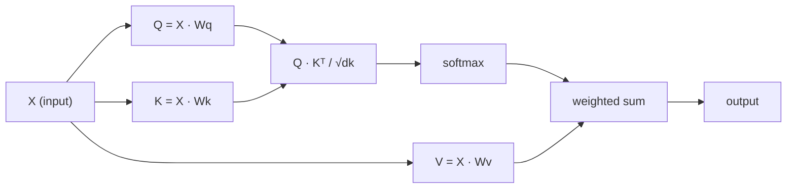

# 從零打造自注意力

> 注意力是一張查詢表，其中每個詞都在問「誰對我重要？」—— 而且它會學出答案。

**類型：** 實作
**程式語言：** Python
**先修單元：** 階段 3（深度學習核心）、階段 5 單元 10（序列到序列）
**時間：** 約 90 分鐘

## 學習目標

- 只用 NumPy 從零實作縮放點積自注意力，包含 query／key／value 投影與 softmax 加權和
- 打造一層多頭注意力：切分注意力頭、平行計算注意力，再把結果串接起來
- 追蹤注意力矩陣如何捕捉詞元之間的關係，並解釋為什麼除以 sqrt(d_k) 能避免 softmax 飽和
- 施加因果遮罩，把雙向注意力轉成自迴歸（解碼器風格）的注意力

## 問題所在

RNN 一次處理一個詞元。等你走到第 50 個詞元時，第 1 個詞元的資訊已經被壓過 50 道壓縮步驟。長距離依賴被硬塞進固定大小的隱藏狀態裡輾平 —— 這個瓶頸不是靠加多少 LSTM 閘控就能完全解決的。

2014 年 Bahdanau 的注意力論文提出了解法：讓解碼器回頭看每一個編碼器位置，自己決定哪些對當前這一步重要。但它仍然是嫁接在 RNN 上。2017 年〈Attention Is All You Need〉問了一個更犀利的問題：如果注意力是*唯一*的機制呢？不要遞迴。不要卷積。只要注意力。

自注意力讓序列中的每個位置，在單一個平行步驟裡注意所有其他位置。這正是 Transformer 之所以快、能擴展、並且獨占鰲頭的原因。

## 核心概念

### 資料庫查詢的類比

把注意力想成一次柔性的資料庫查詢：

```
Traditional database:
  Query: "capital of France"  -->  exact match  -->  "Paris"

Attention:
  Query: "capital of France"  -->  similarity to ALL keys  -->  weighted blend of ALL values
```

每個詞元都會產生三個向量：
- **Query（Q，查詢向量）**：「我在找什麼？」
- **Key（K，鍵向量）**：「我裡面有什麼？」
- **Value（V，值向量）**：「如果我被選中，我能提供什麼資訊？」

一個 query 與所有 key 的點積產生注意力分數。分數高就代表「這個 key 符合我的 query」。這些分數再去為 value 加權。輸出就是 value 的加權和。

### Q、K、V 的計算

每個詞元嵌入都經過三個學習得到的權重矩陣做投影：

```
Input embeddings (sequence of n tokens, each d-dimensional):

  X = [x1, x2, x3, ..., xn]       shape: (n, d)

Three weight matrices:

  Wq  shape: (d, dk)
  Wk  shape: (d, dk)
  Wv  shape: (d, dv)

Projections:

  Q = X @ Wq    shape: (n, dk)      each token's query
  K = X @ Wk    shape: (n, dk)      each token's key
  V = X @ Wv    shape: (n, dv)      each token's value
```

以圖示看單一個詞元：

```
             Wq
  x_i ------[*]------> q_i    "What am I looking for?"
       |
       |     Wk
       +----[*]------> k_i    "What do I contain?"
       |
       |     Wv
       +----[*]------> v_i    "What do I offer?"
```

### 注意力矩陣

一旦你有了所有詞元的 Q、K、V，注意力分數就形成一個矩陣：

```
Scores = Q @ K^T    shape: (n, n)

              k1    k2    k3    k4    k5
        +-----+-----+-----+-----+-----+
   q1   | 2.1 | 0.3 | 0.1 | 0.8 | 0.2 |   <- how much q1 attends to each key
        +-----+-----+-----+-----+-----+
   q2   | 0.4 | 1.9 | 0.7 | 0.1 | 0.3 |
        +-----+-----+-----+-----+-----+
   q3   | 0.2 | 0.6 | 2.3 | 0.5 | 0.1 |
        +-----+-----+-----+-----+-----+
   q4   | 0.9 | 0.1 | 0.4 | 1.7 | 0.6 |
        +-----+-----+-----+-----+-----+
   q5   | 0.1 | 0.3 | 0.2 | 0.5 | 2.0 |
        +-----+-----+-----+-----+-----+

Each row: one token's attention over the entire sequence
```

一次看一個 query 掃過所有 key：每一列都為每個詞元打分，softmax 把分數轉成權重，脈絡向量就是 value 的加權混合。

```figure
attention-matrix
```

### 為什麼要縮放？

點積會隨維度 dk 變大。如果 dk = 64，點積可能落在幾十的量級，把 softmax 推進梯度消失的區域。解法：除以 sqrt(dk)。

```
Scaled scores = (Q @ K^T) / sqrt(dk)
```

這讓數值待在 softmax 能產出有用梯度的範圍內。

### softmax 把分數變成權重

softmax 把原始分數轉成每一列上的機率分布：

```
Raw scores for q1:   [2.1, 0.3, 0.1, 0.8, 0.2]
                            |
                         softmax
                            |
Attention weights:   [0.52, 0.09, 0.07, 0.14, 0.08]   (sums to ~1.0)
```

現在每個詞元都有一組權重，說明它該注意其他每個詞元多少。

### value 的加權和

每個詞元的最終輸出是所有 value 向量的加權和：

```
output_i = sum( attention_weight[i][j] * v_j  for all j )

For token 1:
  output_1 = 0.52 * v1 + 0.09 * v2 + 0.07 * v3 + 0.14 * v4 + 0.08 * v5
```

### 完整流程



公式寫成一行：

```
Attention(Q, K, V) = softmax( Q @ K^T / sqrt(dk) ) @ V
```

```figure
softmax-attention-scaling
```

## 動手實作

### 步驟 1：從零寫 softmax

softmax 把原始 logit 轉成機率。先減掉最大值以維持數值穩定。

```python
import numpy as np

def softmax(x):
    shifted = x - np.max(x, axis=-1, keepdims=True)
    exp_x = np.exp(shifted)
    return exp_x / np.sum(exp_x, axis=-1, keepdims=True)

logits = np.array([2.0, 1.0, 0.1])
print(f"logits:  {logits}")
print(f"softmax: {softmax(logits)}")
print(f"sum:     {softmax(logits).sum():.4f}")
```

### 步驟 2：縮放點積注意力

核心函式。吃進 Q、K、V 矩陣，回傳注意力輸出與權重矩陣。

```python
def scaled_dot_product_attention(Q, K, V):
    dk = Q.shape[-1]
    scores = Q @ K.T / np.sqrt(dk)
    weights = softmax(scores)
    output = weights @ V
    return output, weights
```

### 步驟 3：帶可學習投影的自注意力類別

一個完整的自注意力模組，Wq、Wk、Wv 權重矩陣以類 Xavier 的縮放初始化。

```python
class SelfAttention:
    def __init__(self, d_model, dk, dv, seed=42):
        rng = np.random.default_rng(seed)
        scale = np.sqrt(2.0 / (d_model + dk))
        self.Wq = rng.normal(0, scale, (d_model, dk))
        self.Wk = rng.normal(0, scale, (d_model, dk))
        scale_v = np.sqrt(2.0 / (d_model + dv))
        self.Wv = rng.normal(0, scale_v, (d_model, dv))
        self.dk = dk

    def forward(self, X):
        Q = X @ self.Wq
        K = X @ self.Wk
        V = X @ self.Wv
        output, weights = scaled_dot_product_attention(Q, K, V)
        return output, weights
```

### 步驟 4：拿一個句子跑一遍

為一個句子造出假的嵌入，然後觀察注意力權重。

```python
sentence = ["The", "cat", "sat", "on", "the", "mat"]
n_tokens = len(sentence)
d_model = 8
dk = 4
dv = 4

rng = np.random.default_rng(42)
X = rng.normal(0, 1, (n_tokens, d_model))

attn = SelfAttention(d_model, dk, dv, seed=42)
output, weights = attn.forward(X)

print("Attention weights (each row: where that token looks):\n")
print(f"{'':>6}", end="")
for token in sentence:
    print(f"{token:>6}", end="")
print()

for i, token in enumerate(sentence):
    print(f"{token:>6}", end="")
    for j in range(n_tokens):
        w = weights[i][j]
        print(f"{w:6.3f}", end="")
    print()
```

### 步驟 5：用 ASCII 熱圖把注意力視覺化

把注意力權重映射成字元，快速看個大概。

```python
def ascii_heatmap(weights, tokens, chars=" ░▒▓█"):
    n = len(tokens)
    print(f"\n{'':>6}", end="")
    for t in tokens:
        print(f"{t:>6}", end="")
    print()

    for i in range(n):
        print(f"{tokens[i]:>6}", end="")
        for j in range(n):
            level = int(weights[i][j] * (len(chars) - 1) / weights.max())
            level = min(level, len(chars) - 1)
            print(f"{'  ' + chars[level] + '   '}", end="")
        print()

ascii_heatmap(weights, sentence)
```

## 框架應用

PyTorch 的 `nn.MultiheadAttention` 做的正是我們剛打造的東西，外加多頭切分與輸出投影：

```python
import torch
import torch.nn as nn

d_model = 8
n_heads = 2
seq_len = 6

mha = nn.MultiheadAttention(embed_dim=d_model, num_heads=n_heads, batch_first=True)

X_torch = torch.randn(1, seq_len, d_model)

output, attn_weights = mha(X_torch, X_torch, X_torch)

print(f"Input shape:            {X_torch.shape}")
print(f"Output shape:           {output.shape}")
print(f"Attention weight shape: {attn_weights.shape}")
print(f"\nAttn weights (averaged over heads):")
print(attn_weights[0].detach().numpy().round(3))
```

關鍵差別在於：多頭注意力平行跑多個注意力函式，每個都有自己大小為 dk = d_model / n_heads 的 Q、K、V 投影，然後把結果串接起來。這讓模型能同時注意不同類型的關係。

## 產出交付

本單元產出：
- `outputs/prompt-attention-explainer.md` —— 一份用資料庫查詢類比來解釋注意力的提示詞

## 練習

1. 修改 `scaled_dot_product_attention`，讓它接受一個選用的遮罩矩陣，在 softmax 之前把某些位置設為負無限大（因果／解碼器遮罩就是這樣做的）
2. 從零實作多頭注意力：把 Q、K、V 切成 `n_heads` 塊，各自跑注意力，串接起來，再經過最後的權重矩陣 Wo 投影
3. 拿兩個長度相同但內容不同的句子，餵進同一個 SelfAttention 實例，比較它們的注意力模式。什麼變了？什麼沒變？

## 關鍵術語

| 術語 | 大家怎麼說 | 實際上是什麼 |
|------|----------------|----------------------|
| Query（Q） | 「問題向量」 | 輸入的一個可學習投影，代表這個詞元正在尋找什麼資訊 |
| Key（K） | 「標籤向量」 | 一個可學習投影，代表這個詞元含有什麼資訊，用來與 query 比對 |
| Value（V） | 「內容向量」 | 一個可學習投影，攜帶真正被依注意力分數聚合起來的資訊 |
| 縮放點積注意力 | 「那條注意力公式」 | softmax(QK^T / sqrt(dk)) @ V —— 縮放能避免高維度下的 softmax 飽和 |
| 自注意力 | 「詞元看自己也看別人」 | Q、K、V 全都來自同一個序列的注意力，讓每個位置都能注意所有其他位置 |
| 注意力權重 | 「注意的程度」 | 位置上的機率分布，由縮放點積經 softmax 產生 |
| 多頭注意力 | 「平行的注意力」 | 用不同投影跑多個注意力函式，再把結果串接起來，得到更豐富的表示 |

## 延伸閱讀

- [Attention Is All You Need (Vaswani et al., 2017)](https://arxiv.org/abs/1706.03762) —— 最初的 Transformer 論文
- [The Illustrated Transformer (Jay Alammar)](https://jalammar.github.io/illustrated-transformer/) —— 完整架構最好的圖解導覽
- [The Annotated Transformer (Harvard NLP)](https://nlp.seas.harvard.edu/annotated-transformer/) —— 逐行的 PyTorch 實作與說明
