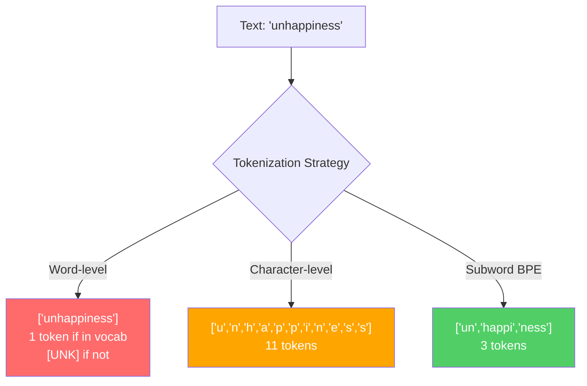
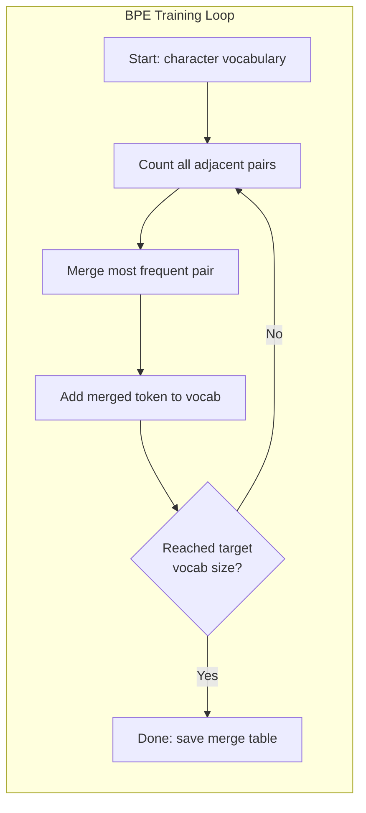
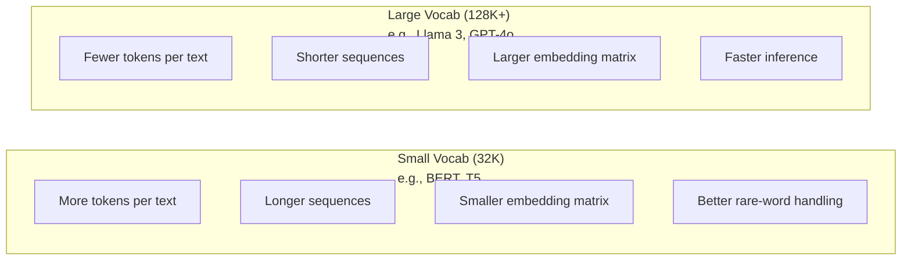

# 分詞器：BPE、WordPiece、SentencePiece

> 你的 LLM 讀不懂英文。它讀的是整數。這些整數是承載了意義還是浪費掉意義，由分詞器決定。

**類型：** 實作
**程式語言：** Python
**先修單元：** 階段 05（NLP 基礎）
**時間：** 約 90 分鐘

## 學習目標

- 從零實作 BPE、WordPiece 與 Unigram 三種詞元化演算法，並比較它們的合併策略
- 說明詞彙表大小如何影響模型效率：太小會產生過長的序列，太大則浪費嵌入參數
- 分析跨語言與程式碼上的分詞產物，找出特定分詞器會在哪裡失效
- 使用 tiktoken 與 sentencepiece 函式庫對文字做詞元化，並檢視產生的詞元 ID

## 問題所在

你的 LLM 讀不懂英文。它讀不懂任何語言。它讀的是數字。

"Hello, world!" 和 [15496, 11, 995, 0] 之間的落差，就是分詞器。每一個詞、每一個空白、每一個標點符號，都必須先轉成整數，模型才能處理。這個轉換不是中性的。它會把一些假設烙進模型裡，之後再也拿不掉。

搞砸了，你的模型就會浪費容量、用好幾個詞元去編碼常見詞。"unfortunately" 變成四個詞元而不是一個。碰到多音節詞很多的文字，你的 128K 上下文視窗等於直接縮水 75%。搞對了，同樣的上下文視窗能裝下兩倍的意義。「這個模型很會處理程式碼」和「這個模型一碰 Python 就卡住」的差別，往往就在分詞器是怎麼訓練出來的。

你每一次呼叫 GPT-4 或 Claude 的 API 都是按詞元計價。你的模型生成的每一個詞元都要花算力。表示一段輸出所需的詞元越少，端到端推論就越快。詞元化不是前處理，它是架構。

## 核心概念

### 三種失敗的做法（以及勝出的那一種）

把文字轉成數字有三種顯而易見的做法。其中兩種在規模化之後行不通。

**詞層級詞元化**按空白和標點切分。"The cat sat" 變成 ["The", "cat", "sat"]。很簡單。但 "tokenization" 怎麼辦？"GPT-4o" 呢？或是像 "Geschwindigkeitsbegrenzung" 這樣的德文複合詞？詞層級需要一份巨大的詞彙表，才能涵蓋每一種語言裡的每一個詞。漏掉一個詞，你就會拿到那個惡名昭彰的 `[UNK]` 詞元 —— 模型在說「我完全不知道這是什麼」。光是英文就有超過一百萬種詞形。再加上程式碼、URL、科學記號和另外 100 種語言，你需要的是一份無限大的詞彙表。

**字元層級詞元化**走的是另一個極端。"hello" 變成 ["h", "e", "l", "l", "o"]。詞彙表很小（幾百個字元）。永遠不會有未登錄詞。但序列會變得極長。原本 10 個詞層級詞元的句子，會變成 50 個字元層級詞元。模型還得自己學會 "t"、"h"、"e" 湊起來是 "the" —— 把注意力容量燒在一件人類三歲就會的事情上。

**子詞詞元化**找到了甜蜜點。常見詞維持完整：the 就是一個詞元。罕見詞被拆成有意義的部件："unhappiness" 變成 ["un", "happi", "ness"]。詞彙表維持在可控範圍（30K 到 128K 詞元）。序列維持得短。未登錄詞基本上消失了，因為任何詞都能用子詞部件拼出來。

現代每一個 LLM 都用子詞詞元化。GPT-2、GPT-4、BERT、Llama 3、Claude —— 全都是。問題只在於選哪一種演算法。



### BPE：位元組對編碼

BPE 是一個被拿來做詞元化的貪婪壓縮演算法。它的想法簡單到一張索引卡就寫得完。

從個別字元開始。統計訓練語料中每一組相鄰配對。把出現頻率最高的配對合併成一個新詞元。重複下去，直到達到目標詞彙表大小。

```figure
tokenizer-bpe
```

以下是 BPE 跑在一個只有 "lower"、"lowest"、"newest" 三個詞的小語料上的過程：

```
Corpus (with word frequencies):
  "lower"  x5
  "lowest" x2
  "newest" x6

Step 0 -- Start with characters:
  l o w e r       (x5)
  l o w e s t     (x2)
  n e w e s t     (x6)

Step 1 -- Count adjacent pairs:
  (e,s): 8    (s,t): 8    (l,o): 7    (o,w): 7
  (w,e): 13   (e,r): 5    (n,e): 6    ...

Step 2 -- Merge most frequent pair (w,e) -> "we":
  l o we r        (x5)
  l o we s t      (x2)
  n e we s t      (x6)

Step 3 -- Recount and merge (e,s) -> "es":
  l o we r        (x5)
  l o we s t      (x2)    <- 'es' only forms from 'e'+'s', not 'we'+'s'
  n e we s t      (x6)    <- wait, the 'e' before 'we' and 's' after 'we'

Actually tracking this precisely:
  After "we" merge, remaining pairs:
  (l,o): 7   (o,we): 7   (we,r): 5   (we,s): 8
  (s,t): 8   (n,e): 6    (e,we): 6

Step 3 -- Merge (we,s) -> "wes" or (s,t) -> "st" (tied at 8, pick first):
  Merge (we,s) -> "wes":
  l o we r        (x5)
  l o wes t       (x2)
  n e wes t       (x6)

Step 4 -- Merge (wes,t) -> "west":
  l o we r        (x5)
  l o west        (x2)
  n e west        (x6)

...continue until target vocab size reached.
```

合併表就是分詞器本身。要對新文字做編碼，就照著學到的順序套用合併規則。訓練語料決定了有哪些合併規則存在，而這個選擇永久性地形塑了模型看到的東西。



### 位元組層級 BPE（GPT-2、GPT-3、GPT-4）

標準 BPE 跑在 Unicode 字元上。位元組層級 BPE 跑在原始位元組（0-255）上。這給你一份剛好 256 個項目的基底詞彙表，能處理任何語言或編碼，而且永遠不會產生未登錄詞。

GPT-2 引入了這個做法。基底詞彙表涵蓋所有可能的位元組，BPE 的合併規則再疊在上面。OpenAI 的 tiktoken 函式庫以這些詞彙表大小實作了位元組層級 BPE：

- GPT-2：50,257 個詞元
- GPT-3.5／GPT-4：約 100,256 個詞元（cl100k_base 編碼）
- GPT-4o：200,019 個詞元（o200k_base 編碼）

### WordPiece（BERT）

WordPiece 看起來和 BPE 很像，但挑選合併規則的方式不同。它不看原始頻率，而是最大化訓練資料的似然：

```
BPE merge criterion:      count(A, B)
WordPiece merge criterion: count(AB) / (count(A) * count(B))
```

BPE 問的是：「哪個配對出現得最頻繁？」WordPiece 問的是：「哪個配對同時出現的頻率，比隨機碰在一起該有的頻率高得多？」這個細微差別會產生不同的詞彙表。WordPiece 偏好那些共現「出乎意料」的合併，而不只是「常見」的合併。

WordPiece 還會用 "##" 前綴標示延續的子詞：

```
"unhappiness" -> ["un", "##happi", "##ness"]
"embedding"   -> ["em", "##bed", "##ding"]
```

"##" 前綴告訴你這一片是接在前一個詞元後面的。BERT 使用 WordPiece，詞彙表 30,522 個詞元。每一個 BERT 變體 —— DistilBERT、RoBERTa 的分詞器其實是 BPE，但 BERT 本身是 WordPiece。

### SentencePiece（Llama、T5）

SentencePiece 把輸入視為一串原始 Unicode 字元，空白也算在內。沒有預分詞步驟，也沒有任何跟語言相關的詞界規則。這讓它真正做到與語言無關 —— 它在中文、日文、泰文以及其他不用空白斷詞的語言上都能運作。

SentencePiece 支援兩種演算法：
- **BPE 模式**：與標準 BPE 相同的合併邏輯，套用在原始字元序列上
- **Unigram 模式**：從一份龐大的詞彙表開始，反覆移除那些對整體似然影響最小的詞元。跟 BPE 反過來 —— 剪枝而不是合併。

Llama 2 使用 SentencePiece BPE，詞彙表 32,000 個詞元。T5 使用 SentencePiece Unigram，詞彙表 32,000 個詞元。注意：Llama 3 已改用基於 tiktoken 的位元組層級 BPE 分詞器，詞彙表 128,256 個詞元。

### 詞彙表大小的取捨

這是一個實實在在的工程決策，後果都量得出來。



具體數字。以 128K 詞彙表搭配 4,096 維嵌入來說，光是嵌入矩陣就是 128,000 x 4,096 = 5.24 億個參數。換成 32K 詞彙表則是 1.31 億個參數。光是分詞器的選擇就差了 4 億個參數。

但較大的詞彙表壓縮文字的力道也更強。同一段英文段落用 32K 詞彙表要 100 個詞元，用 128K 詞彙表可能只要 70 個。這代表生成時少做 30% 的前向傳播。對一個要服務數百萬次請求的模型來說，這就是算力成本的直接下降。

趨勢很明確：詞彙表越做越大。GPT-2 用 50,257，GPT-4 用約 100K，Llama 3 用 128K，GPT-4o 用 200K。

| 模型 | 詞彙表大小 | 分詞器類型 | 每個英文單字平均詞元數 |
|-------|-----------|----------------|---------------------------|
| BERT | 30,522 | WordPiece | 約 1.4 |
| GPT-2 | 50,257 | 位元組層級 BPE | 約 1.3 |
| Llama 2 | 32,000 | SentencePiece BPE | 約 1.4 |
| GPT-4 | 約 100,256 | 位元組層級 BPE | 約 1.2 |
| Llama 3 | 128,256 | 位元組層級 BPE（tiktoken） | 約 1.1 |
| GPT-4o | 200,019 | 位元組層級 BPE | 約 1.0 |

### 多語稅

主要用英文訓練出來的分詞器，對其他語言相當殘酷。韓文文字在 GPT-2 的分詞器裡平均每個詞要 2 到 3 個詞元，中文可能更糟。這代表韓文使用者實際拿到的上下文視窗只有英文使用者的一半 —— 付一樣的錢，卻換到比較少的資訊密度。

這就是 Llama 3 把詞彙表從 32K 翻四倍到 128K 的原因。分給非英文文字的詞元變多，各語言之間的壓縮率才會比較公平。

```figure
tokenizer-tradeoff
```

## 動手實作

### 步驟 1：字元層級分詞器

從最基礎的開始。字元層級分詞器把每個字元對應到它的 Unicode 碼點。不需要訓練，不會有未登錄詞，就是一個直接的映射。

```python
class CharTokenizer:
    def encode(self, text):
        return [ord(c) for c in text]

    def decode(self, tokens):
        return "".join(chr(t) for t in tokens)
```

"hello" 變成 [104, 101, 108, 108, 111]。每個字元自成一個詞元。這是我們要改進的基準線。

### 步驟 2：從零打造 BPE 分詞器

來看真正的實作。我們在原始位元組上訓練（跟 GPT-2 一樣），統計配對、合併最高頻的那組，並依序記下每一條合併規則。合併表就是分詞器。

```python
from collections import Counter

class BPETokenizer:
    def __init__(self):
        self.merges = {}
        self.vocab = {}

    def _get_pairs(self, tokens):
        pairs = Counter()
        for i in range(len(tokens) - 1):
            pairs[(tokens[i], tokens[i + 1])] += 1
        return pairs

    def _merge_pair(self, tokens, pair, new_token):
        merged = []
        i = 0
        while i < len(tokens):
            if i < len(tokens) - 1 and tokens[i] == pair[0] and tokens[i + 1] == pair[1]:
                merged.append(new_token)
                i += 2
            else:
                merged.append(tokens[i])
                i += 1
        return merged

    def train(self, text, num_merges):
        tokens = list(text.encode("utf-8"))
        self.vocab = {i: bytes([i]) for i in range(256)}

        for i in range(num_merges):
            pairs = self._get_pairs(tokens)
            if not pairs:
                break
            best_pair = max(pairs, key=pairs.get)
            new_token = 256 + i
            tokens = self._merge_pair(tokens, best_pair, new_token)
            self.merges[best_pair] = new_token
            self.vocab[new_token] = self.vocab[best_pair[0]] + self.vocab[best_pair[1]]

        return self

    def encode(self, text):
        tokens = list(text.encode("utf-8"))
        for pair, new_token in self.merges.items():
            tokens = self._merge_pair(tokens, pair, new_token)
        return tokens

    def decode(self, tokens):
        byte_sequence = b"".join(self.vocab[t] for t in tokens)
        return byte_sequence.decode("utf-8", errors="replace")
```

訓練迴圈是 BPE 的核心：統計配對、合併贏家、重複。每一次合併都會減少詞元總數。跑完 `num_merges` 輪之後，詞彙表會從 256（基底位元組）長到 256 + num_merges。

編碼時要照著學到的順序精確套用合併規則。這一點很關鍵。如果第 1 條合併造出了 "th"，第 5 條造出了 "the"，那編碼時就必須先套第 1 條，"the" 才能在第 5 條時由 "th" + "e" 組成。

解碼則是反過來：在詞彙表裡查出每個詞元 ID、把位元組串接起來、再解成 UTF-8。

### 步驟 3：編碼與解碼往返

```python
corpus = (
    "The cat sat on the mat. The cat ate the rat. "
    "The dog sat on the log. The dog ate the frog. "
    "Natural language processing is the study of how computers "
    "understand and generate human language. "
    "Tokenization is the first step in any NLP pipeline."
)

tokenizer = BPETokenizer()
tokenizer.train(corpus, num_merges=40)

test_sentences = [
    "The cat sat on the mat.",
    "Natural language processing",
    "tokenization pipeline",
    "unhappiness",
]

for sentence in test_sentences:
    encoded = tokenizer.encode(sentence)
    decoded = tokenizer.decode(encoded)
    raw_bytes = len(sentence.encode("utf-8"))
    ratio = len(encoded) / raw_bytes
    print(f"'{sentence}'")
    print(f"  Tokens: {len(encoded)} (from {raw_bytes} bytes) -- ratio: {ratio:.2f}")
    print(f"  Roundtrip: {'PASS' if decoded == sentence else 'FAIL'}")
```

壓縮率告訴你這個分詞器有多有效。0.50 的比率代表分詞器把文字壓到只有原始位元組數一半的詞元數。越低越好。在訓練語料上，比率會很漂亮。碰到分布外的文字（例如語料裡根本沒出現過的 "unhappiness"），比率就會變差 —— 對沒看過的樣式，分詞器只能退回到字元層級的編碼。

### 步驟 4：跟 tiktoken 比一比

```python
import tiktoken

enc = tiktoken.get_encoding("cl100k_base")

texts = [
    "The cat sat on the mat.",
    "unhappiness",
    "Hello, world!",
    "def fibonacci(n): return n if n < 2 else fibonacci(n-1) + fibonacci(n-2)",
    "Geschwindigkeitsbegrenzung",
]

for text in texts:
    our_tokens = tokenizer.encode(text)
    tiktoken_tokens = enc.encode(text)
    tiktoken_pieces = [enc.decode([t]) for t in tiktoken_tokens]
    print(f"'{text}'")
    print(f"  Our BPE:   {len(our_tokens)} tokens")
    print(f"  tiktoken:  {len(tiktoken_tokens)} tokens -> {tiktoken_pieces}")
```

tiktoken 用的演算法一模一樣，只是在數百 GB 的文字上訓練、做了 100,000 次合併。演算法相同，差別在訓練資料和合併次數。你在一個段落上做 40 次合併訓練出來的分詞器，當然拚不過 tiktoken 在龐大語料上做的 100K 次合併。但機制是一樣的。

### 步驟 5：詞彙表分析

```python
def analyze_vocabulary(tokenizer, test_texts):
    total_tokens = 0
    total_chars = 0
    token_usage = Counter()

    for text in test_texts:
        encoded = tokenizer.encode(text)
        total_tokens += len(encoded)
        total_chars += len(text)
        for t in encoded:
            token_usage[t] += 1

    print(f"Vocabulary size: {len(tokenizer.vocab)}")
    print(f"Total tokens across all texts: {total_tokens}")
    print(f"Total characters: {total_chars}")
    print(f"Avg tokens per character: {total_tokens / total_chars:.2f}")

    print(f"\nMost used tokens:")
    for token_id, count in token_usage.most_common(10):
        token_bytes = tokenizer.vocab[token_id]
        display = token_bytes.decode("utf-8", errors="replace")
        print(f"  Token {token_id:4d}: '{display}' (used {count} times)")

    unused = [t for t in tokenizer.vocab if t not in token_usage]
    print(f"\nUnused tokens: {len(unused)} out of {len(tokenizer.vocab)}")
```

這會揭露詞彙表裡的 Zipf 分布。少數幾個詞元佔了絕大多數（空白、"the"、"e"），大部分詞元則很少用到。生產級分詞器會針對這個分布最佳化 —— 常見樣式拿到短的詞元 ID，罕見樣式則用比較長的表示法。

## 框架應用

你自己刻的 BPE 能跑了。接下來看看生產級工具長什麼樣子。

### tiktoken（OpenAI）

```python
import tiktoken

enc = tiktoken.get_encoding("cl100k_base")

text = "Tokenizers convert text to integers"
tokens = enc.encode(text)
print(f"Tokens: {tokens}")
print(f"Pieces: {[enc.decode([t]) for t in tokens]}")
print(f"Roundtrip: {enc.decode(tokens)}")
```

tiktoken 用 Rust 寫成，附 Python 綁定。它每秒能編碼數百萬個詞元。一樣的 BPE 演算法，工業強度的實作。

### Hugging Face tokenizers

```python
from tokenizers import Tokenizer
from tokenizers.models import BPE
from tokenizers.trainers import BpeTrainer
from tokenizers.pre_tokenizers import ByteLevel

tokenizer = Tokenizer(BPE())
tokenizer.pre_tokenizer = ByteLevel()

trainer = BpeTrainer(vocab_size=1000, special_tokens=["<pad>", "<eos>", "<unk>"])
tokenizer.train(["corpus.txt"], trainer)

output = tokenizer.encode("The cat sat on the mat.")
print(f"Tokens: {output.tokens}")
print(f"IDs: {output.ids}")
```

Hugging Face 的 tokenizers 函式庫底層同樣是 Rust。它能在幾秒內於 GB 等級的語料上訓練 BPE。要訓練自己的模型時，用的就是這個。

### 載入 Llama 的分詞器

```python
from transformers import AutoTokenizer

tokenizer = AutoTokenizer.from_pretrained("meta-llama/Llama-3.1-8B")

text = "Tokenizers are the unsung heroes of LLMs"
tokens = tokenizer.encode(text)
print(f"Token IDs: {tokens}")
print(f"Tokens: {tokenizer.convert_ids_to_tokens(tokens)}")
print(f"Vocab size: {tokenizer.vocab_size}")

multilingual = ["Hello world", "Hola mundo", "Bonjour le monde"]
for text in multilingual:
    ids = tokenizer.encode(text)
    print(f"'{text}' -> {len(ids)} tokens")
```

Llama 3 的 128K 詞彙表在壓縮非英文文字上，明顯優於 GPT-2 的 50K 詞彙表。你可以自己驗證 —— 把同一個句子翻成多種語言分別編碼，再數詞元數。

## 產出交付

這一課會產出 `outputs/prompt-tokenizer-analyzer.md` —— 一個可重複使用的提示詞，能針對任意文字與模型組合分析詞元化效率。餵給它一段文字樣本，它會告訴你哪個模型的分詞器處理得最好。

## 練習

1. 改寫 BPE 分詞器，讓它在每一次合併後印出詞彙表。看著 "t" + "h" 變成 "th"、再由 "th" + "e" 變成 "the"。追蹤常見英文字是怎麼一片一片被組起來的。

2. 幫 BPE 分詞器加上特殊詞元（`<pad>`、`<eos>`、`<unk>`）。把它們指定為 ID 0、1、2，其餘詞元全部往後位移。再實作一個預分詞步驟，在跑 BPE 之前先按空白切分。

3. 實作 WordPiece 的合併準則（用似然比而不是頻率）。用同一份語料、同樣的合併次數分別訓練 BPE 與 WordPiece。比較兩者產生的詞彙表 —— 哪一個做出的子詞在語言學上比較有意義？

4. 建一個多語分詞器效率基準測試。準備英文、西班牙文、中文、韓文、阿拉伯文各 10 個句子。用 tiktoken（cl100k_base）分別做詞元化，量測每個字元平均的詞元數，把各語言的「多語稅」量化出來。

5. 在更大的語料上訓練你的 BPE 分詞器（下載一篇維基百科文章）。調整合併次數，讓壓縮率在同一段文字上落在 tiktoken 的 10% 以內。這會逼你搞懂語料大小、合併次數與壓縮品質三者之間的關係。

## 關鍵術語

| 術語 | 大家怎麼說 | 實際上是什麼 |
|------|----------------|----------------------|
| 詞元 | 「一個字」 | 模型詞彙表裡的一個單位 —— 可以是一個字元、一個子詞、一個詞，或一整段多詞片段 |
| BPE | 「某種壓縮的東西」 | 位元組對編碼 —— 反覆合併出現頻率最高的相鄰詞元配對，直到達到目標詞彙表大小 |
| WordPiece | 「BERT 的分詞器」 | 跟 BPE 很像，但合併依據是似然比 count(AB)/(count(A)*count(B)) 而不是原始頻率 |
| SentencePiece | 「一個分詞器函式庫」 | 與語言無關的分詞器，直接跑在原始 Unicode 上、不需要預分詞，同時支援 BPE 與 Unigram 演算法 |
| 詞彙表大小 | 「它認識幾個字」 | 不重複詞元的總數：GPT-2 有 50,257 個、BERT 有 30,522 個、Llama 3 有 128,256 個 |
| 繁殖率（fertility） | 「這不是分詞器的術語吧」 | 每個詞平均切出幾個詞元 —— 用來量測分詞器跨語言的效率（1.0 是完美，3.0 代表模型要多做三倍的工） |
| 位元組層級 BPE | 「GPT 的分詞器」 | 跑在原始位元組（0-255）而非 Unicode 字元上的 BPE，保證任何輸入都不會產生未登錄詞 |
| 合併表 | 「那個分詞器檔案」 | 訓練期間學到的配對合併有序清單 —— 它本身「就是」分詞器，而且順序有意義 |
| 預分詞 | 「按空白切開」 | 在子詞詞元化之前套用的規則：空白切分、數字分離、標點處理 |
| 壓縮率 | 「分詞器有多有效率」 | 產出詞元數除以輸入位元組數 —— 越低代表壓縮越好、推論越快 |

## 延伸閱讀

- [Sennrich et al., 2016 -- "Neural Machine Translation of Rare Words with Subword Units"](https://arxiv.org/abs/1508.07909) —— 把 BPE 引入 NLP 的論文，讓一個 1994 年的壓縮演算法變成現代詞元化的基礎
- [Kudo & Richardson, 2018 -- "SentencePiece: A simple and language independent subword tokenizer"](https://arxiv.org/abs/1808.06226) —— 與語言無關的詞元化，讓多語模型變得可行
- [OpenAI tiktoken repository](https://github.com/openai/tiktoken) —— Rust 寫的生產級 BPE 實作，附 Python 綁定，GPT-3.5/4/4o 都在用
- [Hugging Face Tokenizers documentation](https://huggingface.co/docs/tokenizers) —— 生產等級的分詞器訓練，具備 Rust 的效能
