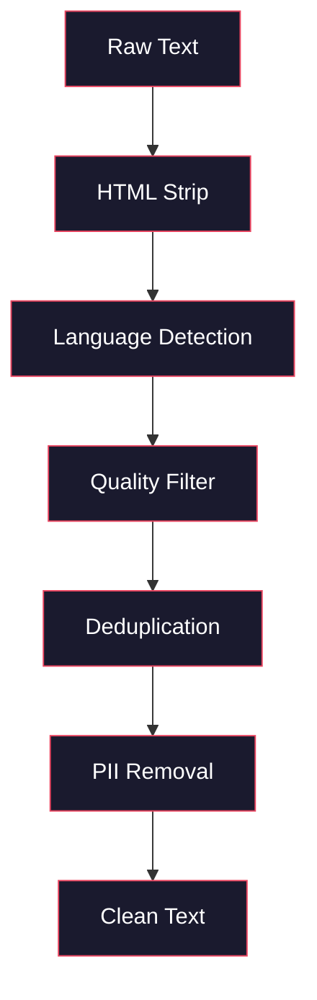
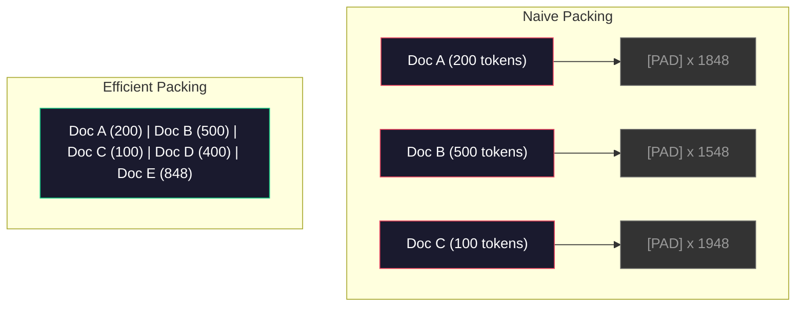

# 預訓練用的資料管線

> 模型是一面鏡子。你餵它什麼，它就映出什麼。餵它垃圾，它就用完美的流暢度映出垃圾。

**類型：** 實作
**程式語言：** Python
**先修單元：** 階段 10 · 01-02（分詞器、從零打造一個分詞器）
**時間：** 約 90 分鐘

## 學習目標

- 建一條串流讀取的資料管線，能對數 TB 的文字做詞元化、分塊、洗牌與批次化，而不必把資料全部載入記憶體
- 實作真實預訓練管線在用的資料品質過濾器（去重、語言偵測、內容過濾）
- 產生固定長度的訓練序列，並正確處理注意力遮罩與文件邊界
- 分析管線吞吐量，確保資料載入器跟得上 GPU 的訓練速度

## 問題所在

你有分詞器了。現在你需要資料。

不是一個資料集，也不是一個 CSV 檔。是數 TB 的文字 —— 清洗過、去重過、按品質篩選過、詞元化成固定長度序列，並且以隨機批次供應，快到讓你那座 8 張 GPU 的叢集永遠不必等下一批。

大多數人以為訓練 LLM 的重點在模型架構。不是的。Llama 3 用了 15.6 兆個詞元，GPT-3 用了 3,000 億個，DeepSeek-V2 用了 8.1 兆個。這三者的架構大致相同：堆疊起來的 Transformer 區塊，配上注意力層與前饋層。輸出品質的差異，壓倒性地來自資料。

DeepMind 的 Chinchilla 論文把這件事講清楚了。在給定的算力預算下，模型參數量與訓練詞元數之間存在一個最佳比例。Chinchilla 指出 2022 年多數模型都嚴重訓練不足 —— 相對於它們看過的資料量，參數實在太多。一個用 1.4 兆詞元訓練的 70B 模型（符合 Chinchilla 最佳比例）勝過用 3,000 億詞元訓練的 280B 模型（Gopher）。

你的資料管線決定了你的模型學到的是語言，還是雜訊。

## 核心概念

### 資料從哪裡來

每一個大型語言模型都是在多種來源的混合上訓練出來的。對多數實驗室來說，確切的配方是嚴密守護的機密，但我們知道的已足以理解有哪些類別。

| 來源 | 大小 | 品質 | 誰在用 |
|--------|------|---------|---------|
| Common Crawl | 原始約 250 TB | 低（需要大量過濾） | GPT-3、Llama、多數開源模型 |
| Wikipedia | 約 20 GB | 高 | 每一個主流 LLM |
| GitHub 程式碼 | 約 1 TB 以上 | 中（大量重複與死程式碼） | StarCoder、CodeLlama、DeepSeek-Coder |
| 書籍（BookCorpus、Pile） | 約 100 GB | 高 | GPT-2、GPT-3、早期模型 |
| 學術論文（arXiv、S2ORC） | 約 100 GB | STEM 領域高 | Llama、Galactica |
| StackOverflow、Reddit | 約 100 GB | 中 | Llama、Falcon |
| 精選網頁（C4、RefinedWeb） | 約 5 TB | 中偏高（已預先過濾） | T5、Falcon |

Llama 3 公開了它的資料混合比例：大約 50% 網頁資料、25% 程式碼、13% 書籍與學術論文、8% 數學資料、4% 多語網頁資料。總量是來自超過 5 TB 原始文字的 15.6 兆詞元。

比例和總量一樣重要。網頁資料太多，模型就變成 Reddit 鸚鵡。程式碼太少，它就不會寫程式。數學太少，它的推理就會出包。把這個混合比例調對，是訓練 LLM 最難的環節之一，而且沒有公式 —— 只能靠實驗與評測。

### 資料清洗

原始網頁資料髒得可以。一份典型的 Common Crawl 傾印檔裡會有：

- HTML 標籤與 JavaScript
- 樣板化的頁首、頁尾、導覽選單
- 重複頁面（完全相同與近似重複）
- 機器產生的垃圾內容
- 個人可識別資訊（PII）
- 低品質文字（關鍵字清單、SEO 垃圾）
- 以文字編碼的非文字內容

清洗這些不是可選項。它決定了你的模型是生成連貫的段落，還是吐出混著商品清單的 HTML 標籤。



每一步各自消掉一類雜訊：

**HTML 剝除：** 移除所有標記，只留下可見的文字內容。像 `trafilatura` 或 `readability` 這類函式庫會擷取文章正文，丟掉導覽列、廣告與樣板。

**語言偵測：** 用 fastText 的語言辨識模型（lid.176.bin）替每份文件分類，篩出你的目標語言。一份被判定為英文但信心值低於 0.8 的文件，多半不是乾淨的英文。

**品質過濾：** 這裡開始有意思了。RefinedWeb（Falcon 背後的資料集）用的是以困惑度為基礎的過濾器：先在 Wikipedia 上訓練一個小型語言模型，再替每份文件評分。困惑度高代表這份文件不像 Wikipedia —— 很可能是垃圾內容、關鍵字清單或機器產生的東西。困惑度超過門檻的文件就會被移除。

**去重：** 影響力最大的單一清洗步驟。Common Crawl 裡有數量龐大的重複頁面 —— 法律免責聲明、Cookie 通知、服務條款。訓練在重複資料上不但浪費算力，還可能讓模型逐字背下並複述特定段落。

**PII 移除：** 姓名、電子郵件地址、電話號碼、社會安全號碼。結構化的 PII 用正規表示式偵測，語境中的姓名則用 NER 模型。

### 用 MinHash 做去重

完全相同的去重很簡單：對每份文件取雜湊值，移除重複的。但真正的問題是近似重複。同一篇新聞文章的兩份副本、周圍的廣告略有不同，就是近似重複。內容有 95% 相同，但逐位元組比對是不一樣的。

MinHash 加上區域敏感雜湊（LSH）能有效率地解掉這題。


想法是這樣：

1. **切片（Shingling）：** 把每份文件轉成一組 n-gram 集合（例如以詞或字元為單位的 5-gram）。"the quick brown fox" 用 3 詞切片會變成 {"the quick brown", "quick brown fox"}。

2. **MinHash：** 對每份文件的切片集合計算 k 個雜湊值。每個雜湊值是在不同雜湊函式下、所有切片中的最小雜湊值。這會產生一個固定大小的「簽章」，能近似任兩份文件之間的 Jaccard 相似度。

3. **LSH：** 依照 MinHash 簽章的分段（band）把文件分進不同的桶。落在同一個桶裡的文件就是近似重複的候選。這樣就不必兩兩比對所有文件 —— 你只比對候選對。

4. **驗證：** 對每一組候選對計算精確的 Jaccard 相似度。若相似度超過門檻（通常是 0.8），就移除其中一份副本。

Llama 團隊回報，他們透過去重移除了大約 38% 的網頁資料。這不是小數字。Common Crawl 有超過三分之一是重複或近似重複的內容。

### 序列打包

你的模型要的是固定長度的輸入序列，但你的文件長度不一。有些 50 個詞元，有些 50,000 個。

天真的做法：把每份文件填充到最大序列長度。這會在毫無學習貢獻的填充詞元上浪費大量算力。

比較好的做法：把多份文件打包進同一個序列，中間用序列結束詞元隔開。一個 2048 詞元的序列裡，可能塞了三份短文件，彼此以 [EOS] 詞元串接。



注意力遮罩必須設對。在同一個打包序列裡，來自文件 A 的詞元不該注意到文件 B 的詞元。這需要一個區塊對角形式的注意力遮罩。

長文件會被截斷，或在序列邊界處切成好幾塊。切點很重要：切在句子中間會逼模型看到不完整的思路。有些管線會盡可能把切點對齊到段落或句子邊界。

### Chinchilla 縮放律

在固定算力預算 C（以 FLOPs 計）之下，最佳模型大小 N 與資料集大小 D 遵循：

```
N_opt ~ C^0.5
D_opt ~ C^0.5
```

實務上這代表模型大小與資料集大小應該大致等比例放大。參數多 10 倍的模型，大約需要多 10 倍的訓練詞元才能達到同樣的損失。

| 模型 | 參數量 | 訓練詞元數 | 符合 Chinchilla 最佳？ |
|-------|-----------|----------------|-------------------|
| GPT-3 | 175B | 300B | 否（訓練不足 3 到 4 倍） |
| Chinchilla | 70B | 1.4T | 是（刻意設計如此） |
| Llama 2 | 70B | 2T | 過度訓練（刻意為之） |
| Llama 3 | 70B | 15T | 大幅過度訓練 |

Llama 3 刻意違反 Chinchilla 定律。Meta 發現，用遠超過算力最佳比例的資料做過度訓練，能得到推論表現更好的模型。額外的訓練成本只付一次，但比較小的模型永遠都比較便宜服務。這有時被稱為「推論最佳」的縮放取向，自 2024 年起已成為業界標準。

## 動手實作

### 步驟 1：文字清洗

剝除 HTML、正規化空白、移除非文字內容。我們會拿一份公共領域文字（Project Gutenberg）當作小語料。

```python
import re

def clean_text(text):
    text = re.sub(r"<[^>]+>", "", text)
    text = re.sub(r"http\S+", "", text)
    text = re.sub(r"[^\x20-\x7E\n]", "", text)
    text = re.sub(r"\n{3,}", "\n\n", text)
    text = re.sub(r" {2,}", " ", text)
    return text.strip()

def quality_filter(text, min_words=50, max_ratio_caps=0.3, max_ratio_special=0.1):
    words = text.split()
    if len(words) < min_words:
        return False
    caps_ratio = sum(1 for w in words if w.isupper()) / len(words)
    if caps_ratio > max_ratio_caps:
        return False
    special_chars = sum(1 for c in text if not c.isalnum() and not c.isspace())
    if special_chars / max(len(text), 1) > max_ratio_special:
        return False
    return True
```

這個品質過濾器抓得到 SEO 垃圾（全大寫）、機器產生的雜訊（特殊字元比例過高）與內容殘缺的頁面（太短）。光是這三項檢查，就能從網頁爬取結果中清掉多到令人意外的垃圾。

### 步驟 2：MinHash 去重

從零實作 MinHash。不需要任何外部函式庫 —— 只要 `hashlib`。

```python
import hashlib
from collections import defaultdict

def get_shingles(text, k=5):
    words = text.lower().split()
    if len(words) < k:
        return set()
    return {" ".join(words[i:i+k]) for i in range(len(words) - k + 1)}

def minhash_signature(shingles, num_hashes=128):
    signature = []
    for i in range(num_hashes):
        min_hash = float("inf")
        for shingle in shingles:
            h = int(hashlib.sha256(f"{i}:{shingle}".encode()).hexdigest(), 16)
            min_hash = min(min_hash, h)
        signature.append(min_hash)
    return signature

def lsh_buckets(signature, bands=16):
    rows_per_band = len(signature) // bands
    buckets = []
    for b in range(bands):
        start = b * rows_per_band
        band_data = tuple(signature[start:start + rows_per_band])
        bucket_hash = hashlib.md5(str(band_data).encode()).hexdigest()
        buckets.append((b, bucket_hash))
    return buckets

def deduplicate(documents, threshold=0.8, num_hashes=128, bands=16):
    signatures = []
    shingle_sets = []
    for doc in documents:
        shingles = get_shingles(doc)
        shingle_sets.append(shingles)
        signatures.append(minhash_signature(shingles, num_hashes))

    bucket_map = defaultdict(list)
    for doc_idx, sig in enumerate(signatures):
        for band_id, bucket_hash in lsh_buckets(sig, bands):
            bucket_map[(band_id, bucket_hash)].append(doc_idx)

    duplicate_pairs = set()
    for bucket_docs in bucket_map.values():
        if len(bucket_docs) < 2:
            continue
        for i in range(len(bucket_docs)):
            for j in range(i + 1, len(bucket_docs)):
                duplicate_pairs.add((bucket_docs[i], bucket_docs[j]))

    removed = set()
    for i, j in duplicate_pairs:
        if i in removed or j in removed:
            continue
        s1, s2 = shingle_sets[i], shingle_sets[j]
        if not s1 or not s2:
            continue
        jaccard = len(s1 & s2) / len(s1 | s2)
        if jaccard >= threshold:
            removed.add(j)

    return [doc for idx, doc in enumerate(documents) if idx not in removed], len(removed)
```

`num_hashes=128` 與 `bands=16` 這兩個參數控制精確率與召回率的取捨。雜湊數越多，相似度估計越準。分段越多，召回率越高（抓到更多重複），代價是更多誤判。這組數值在典型的網頁文字上表現不錯。

### 步驟 3：詞元化並打包序列

拿乾淨、去重過的文字做詞元化，再打包成訓練用的固定長度序列。

```python
def tokenize_corpus(documents, tokenizer):
    all_tokens = []
    for doc in documents:
        tokens = tokenizer.encode(doc)
        all_tokens.extend(tokens)
        all_tokens.append(tokenizer.eos_id)
    return all_tokens

def pack_sequences(token_ids, seq_length, pad_id=0):
    sequences = []
    attention_masks = []
    for i in range(0, len(token_ids), seq_length):
        seq = token_ids[i:i + seq_length]
        mask = [1] * len(seq)
        if len(seq) < seq_length:
            pad_count = seq_length - len(seq)
            seq = seq + [pad_id] * pad_count
            mask = mask + [0] * pad_count
        sequences.append(seq)
        attention_masks.append(mask)
    return sequences, attention_masks
```

### 步驟 4：訓練用的 DataLoader

產出隨機化的打包序列批次。這就是訓練迴圈要消費的東西。

```python
import random

class PreTrainingDataLoader:
    def __init__(self, sequences, attention_masks, batch_size, shuffle=True):
        self.sequences = sequences
        self.attention_masks = attention_masks
        self.batch_size = batch_size
        self.shuffle = shuffle

    def __len__(self):
        return (len(self.sequences) + self.batch_size - 1) // self.batch_size

    def __iter__(self):
        indices = list(range(len(self.sequences)))
        if self.shuffle:
            random.shuffle(indices)
        for start in range(0, len(indices), self.batch_size):
            batch_idx = indices[start:start + self.batch_size]
            batch_seqs = [self.sequences[i] for i in batch_idx]
            batch_masks = [self.attention_masks[i] for i in batch_idx]
            yield batch_seqs, batch_masks
```

### 步驟 5：資料集統計

算出真正重要的那些數字：總詞元數、不重複詞元數、壓縮率、文件長度分布。

```python
from collections import Counter

def compute_statistics(documents, token_ids, sequences, tokenizer_vocab_size):
    total_chars = sum(len(d) for d in documents)
    total_tokens = len(token_ids)
    unique_tokens = len(set(token_ids))
    compression_ratio = total_chars / total_tokens

    doc_lengths = [len(d.split()) for d in documents]
    avg_doc_length = sum(doc_lengths) / max(len(doc_lengths), 1)
    max_doc_length = max(doc_lengths) if doc_lengths else 0
    min_doc_length = min(doc_lengths) if doc_lengths else 0

    token_counts = Counter(token_ids)
    top_tokens = token_counts.most_common(10)

    non_pad_tokens = sum(sum(1 for t in seq if t != 0) for seq in sequences)
    total_positions = sum(len(seq) for seq in sequences)
    utilization = non_pad_tokens / max(total_positions, 1)

    stats = {
        "total_documents": len(documents),
        "total_characters": total_chars,
        "total_tokens": total_tokens,
        "unique_tokens": unique_tokens,
        "vocab_utilization": unique_tokens / tokenizer_vocab_size,
        "compression_ratio": compression_ratio,
        "avg_doc_length_words": avg_doc_length,
        "max_doc_length_words": max_doc_length,
        "min_doc_length_words": min_doc_length,
        "num_sequences": len(sequences),
        "sequence_utilization": utilization,
        "top_10_tokens": top_tokens,
    }
    return stats
```

壓縮率告訴你分詞器在這份語料上有多有效率。英文文字通常會壓到每個詞元約 3 到 4 個字元。如果你看到每個詞元只有 1.5 個字元，代表分詞器切得太碎。如果看到 8 以上，代表它學到了非常特定領域的合併規則。

序列利用率告訴你打包好的序列裡有多少是真實資料、多少是填充。低於 90% 就代表打包效率不佳 —— 你正把算力浪費在填充詞元上。

## 框架應用

### 與 HuggingFace Datasets 比較

用 HuggingFace 的 datasets 函式庫載入同一份語料，比較管線速度。

```python
from datasets import load_dataset
from transformers import AutoTokenizer

ds = load_dataset("wikitext", "wikitext-2-raw-v1", split="train")
tokenizer = AutoTokenizer.from_pretrained("meta-llama/Meta-Llama-3-8B")

import time

start = time.time()
tokenized = ds.map(
    lambda x: tokenizer(x["text"], truncation=True, max_length=2048),
    batched=True,
    num_proc=4,
)
hf_time = time.time() - start
total_tokens = sum(len(t) for t in tokenized["input_ids"])
print(f"HuggingFace: {total_tokens:,} tokens in {hf_time:.2f}s ({total_tokens/hf_time:,.0f} tokens/sec)")
```

HuggingFace 的管線底層用的是 Rust 分詞器，並在 4 核心上平行處理。你的純 Python 管線會慢上 10 到 50 倍。這個落差正是生產團隊使用編譯型分詞器的原因。演算法是一樣的，差別在實作語言。

## 產出交付

這一課會產出一個用於驗證與除錯 LLM 訓練管線資料品質的提示詞。見 `outputs/prompt-data-quality-checker.md`。

## 練習

1. **簡單：** 用一個簡單的啟發式規則（字元集分析）替清洗管線加上語言偵測。只保留英文文件，並量測有多少文件被移除。
2. **中等：** 在 MinHash 近似去重之外，另用 SHA-256 雜湊實作完全相同的去重。在一份網頁爬取語料上比較兩種方法各抓到多少重複。
3. **困難：** 打造一個以困惑度為基礎的品質過濾器。在 Wikipedia 文字上訓練一個小型 bigram 語言模型，替每份文件以困惑度評分，移除最差的 20%。比較用過濾過與未過濾的資料訓練時，模型輸出品質的差異。

## 關鍵術語

| 術語 | 大家怎麼說 | 實際上是什麼 |
|------|----------------|----------------------|
| Common Crawl | 「整個網際網路」 | 一個每月爬取網頁的非營利組織 —— 原始資料約 250TB，是多數 LLM 訓練資料的起點 |
| MinHash | 「某種雜湊技巧」 | 用固定大小簽章估計集合間 Jaccard 相似度的技術 —— 讓大規模的近似重複偵測成為可能 |
| LSH | 「區域敏感雜湊」 | 把相似項目分進同一個桶的方法 —— 把兩兩比對從 O(n^2) 降到接近線性 |
| 序列打包 | 「把文件串在一起」 | 把多份文件塞進固定長度序列並搭配正確的注意力遮罩 —— 消除填充造成的浪費 |
| Chinchilla 縮放 | 「用更多資料訓練」 | 在固定算力預算下，最佳表現需要讓模型大小與訓練詞元數大致等比例放大 |
| 繁殖率（fertility） | 「每個詞幾個詞元」 | 每個詞平均切出的詞元數 —— GPT-4 處理英文是 1.3，非拉丁文字更高 |
| 資料混合比例 | 「挑選訓練資料」 | 程式碼、文字、數學、多語資料之間的比例 —— 沒有公式，只能靠實驗 |
| 困惑度過濾 | 「品質評分」 | 用一個小型語言模型替文件評分 —— 困惑度高代表這段文字不像乾淨的參考資料 |
| 去重 | 「移除副本」 | 消除完全相同與近似重複的文件 —— 通常會移除原始網頁資料的 30% 到 40% |
| 注意力遮罩 | 「要看哪些詞元」 | 一個二元遮罩，用來阻止打包序列中跨越文件邊界的注意力 |

## 延伸閱讀

- [Hoffmann et al., 2022 -- Training Compute-Optimal Large Language Models (Chinchilla)](https://arxiv.org/abs/2203.15556) —— 改變了我們思考資料規模方式的那篇論文
- [Penedo et al., 2023 -- The RefinedWeb Dataset for Falcon LLM](https://arxiv.org/abs/2306.01116) —— 如何把 Common Crawl 過濾到高品質
- [Touvron et al., 2023 -- Llama 2: Open Foundation and Fine-Tuned Chat Models](https://arxiv.org/abs/2307.09288) —— Llama 2 的資料管線細節
- [Lee et al., 2022 -- Deduplicating Training Data Makes Language Models Better](https://arxiv.org/abs/2107.06499) —— 為什麼去重比你以為的更重要
- [Broder, 1997 -- On the Resemblance and Containment of Documents](https://ieeexplore.ieee.org/document/666900) —— 最初的 MinHash 論文
- [Meta, 2024 -- Llama 3 Technical Report](https://arxiv.org/abs/2407.21783) —— 15.6T 詞元、資料混合比例、過濾管線
