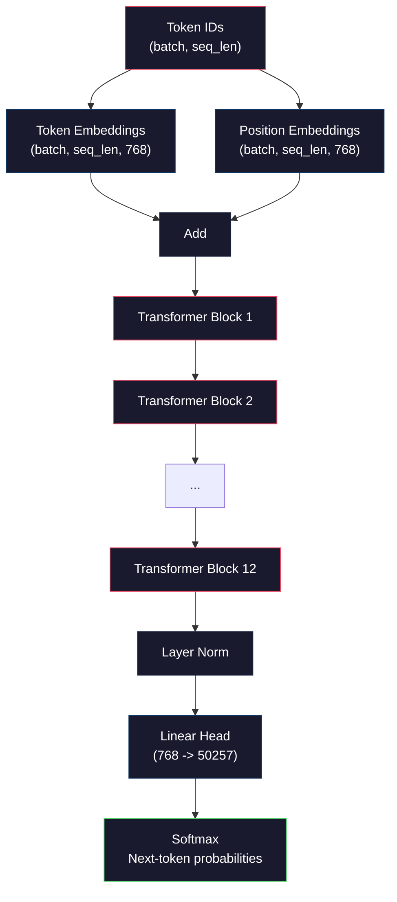
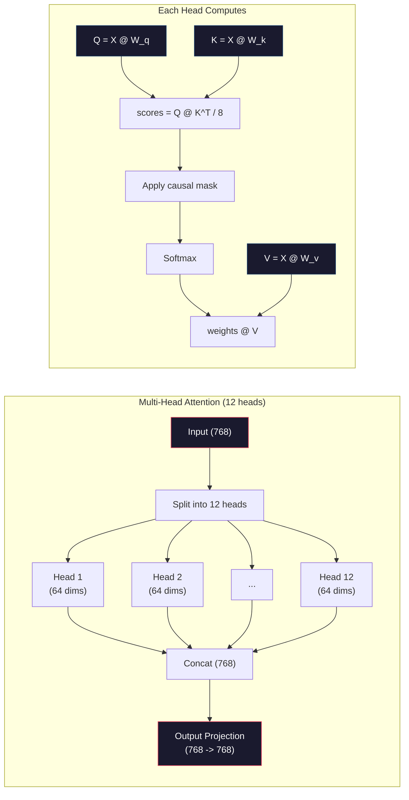
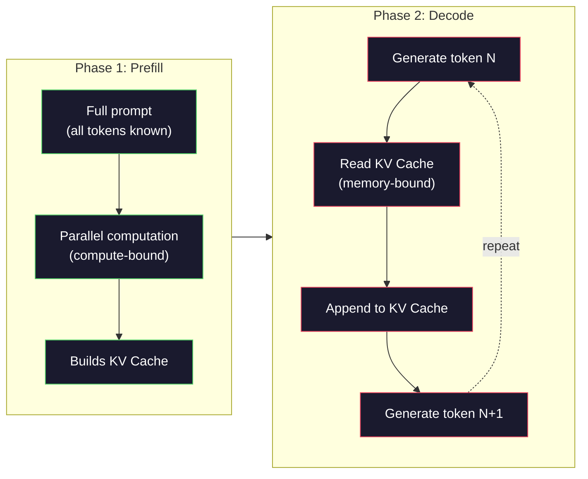

# 預訓練一個迷你 GPT（1.24 億參數）

> GPT-2 Small 有 1.24 億個參數。那是 12 層 transformer、12 個注意力頭、768 維的嵌入。你可以在單張 GPU 上花幾個小時把它從零訓練出來。多數人從來不做這件事，他們直接拿預訓練好的檢查點來用。但如果你沒有親手訓練過一個，你其實並不了解你正在拿來做產品的那個模型裡面發生了什麼。

**類型：** 實作
**程式語言：** Python (with numpy)
**先修單元：** 階段 10 · 01-03（分詞器、打造分詞器、資料管線）
**時間：** 約 120 分鐘

## 學習目標

- 從零實作完整的 GPT-2 架構（1.24 億參數）：詞元嵌入、位置嵌入、transformer 區塊，以及語言模型頭
- 用下一個詞元預測搭配交叉熵損失，在一份文字語料上訓練 GPT 模型
- 實作自迴歸文字生成，包含溫度取樣與 top-k／top-p 篩選
- 監控訓練的損失曲線，並驗證模型確實學到了連貫的語言模式

## 問題所在

你知道 transformer 是什麼。你看過那些圖。你能背出「attention is all you need」，也能在白板上畫出標著「Multi-Head Attention」的方塊。

這些都不代表你懂模型生成文字時到底發生了什麼。

GPT-2 Small 裡有 124,438,272 個參數（含權重綁定）。每一個都是靠跑訓練迴圈設定出來的：前向傳播、算損失、反向傳遞、更新權重。12 個 transformer 區塊。每個區塊 12 個注意力頭。768 維的嵌入空間。50,257 個詞元的詞彙表。模型每生成一個詞元，這 1.24 億個參數全都參與在同一條矩陣乘法鏈裡，把一串詞元 ID 變成下一個詞元的機率分布。

如果你從沒自己搭過這東西，你面對的就是一個黑盒子。你會用 API，你會微調。但一旦出事 —— 模型出現幻覺、開始重複自己、不肯照著指令走 —— 你對*為什麼*完全沒有心智模型。

這個單元會從零打造 GPT-2 Small。不是用 PyTorch，而是用 numpy。每一次矩陣乘法都看得見。每一個梯度都由你的程式碼算出來。你會親眼看到 1.24 億個數字是怎麼合力預測下一個字的。

## 核心概念

### GPT 架構

GPT 是一個自迴歸語言模型。「自迴歸」的意思是它一次生成一個詞元，每一個都以前面所有詞元為條件。架構是一疊 transformer 解碼器區塊。

從詞元 ID 到下一個詞元機率的完整計算圖如下：

1. 詞元 ID 進來。形狀：(batch_size, seq_len)。
2. 查詞元嵌入表。每個 ID 對應到一個 768 維向量。形狀：(batch_size, seq_len, 768)。
3. 查位置嵌入表。每個位置（0, 1, 2, ...）對應到一個 768 維向量。形狀相同。
4. 把詞元嵌入與位置嵌入相加。
5. 通過 12 個 transformer 區塊。
6. 最後做一次層正規化。
7. 線性投影到詞彙表大小。形狀：(batch_size, seq_len, vocab_size)。
8. Softmax 得到機率。

整個模型就這樣。沒有卷積，沒有遞迴。就只是嵌入、注意力、前饋網路與層正規化，疊 12 次。



### Transformer 區塊

12 個區塊每一個都遵循同樣的模式。前正規化（pre-norm）架構 —— GPT-2 用的是 pre-norm，不是原始 transformer 那種 post-norm：

1. LayerNorm
2. 多頭自注意力
3. 殘差連接（把輸入加回來）
4. LayerNorm
5. 前饋網路（MLP）
6. 殘差連接（把輸入加回來）

殘差連接非常關鍵。沒有它們，反向傳播走到第 1 個區塊時梯度早就消失了。有了它們，梯度可以透過「捷徑」路徑從損失直接流到任何一層。這就是為什麼你能疊 12、32 甚至 96 個區塊（傳聞 GPT-4 用了 120 個）。

### 注意力：核心機制

自注意力讓每個詞元都能看看前面每一個詞元，再決定要對每一個投注多少注意力。數學如下。

對每個詞元位置，從輸入算出三個向量：

- **Query (Q)**：「我在找什麼？」
- **Key (K)**：「我含有什麼？」
- **Value (V)**：「我帶著什麼資訊？」

```
Q = input @ W_q    (768 -> 768)
K = input @ W_k    (768 -> 768)
V = input @ W_v    (768 -> 768)

attention_scores = Q @ K^T / sqrt(d_k)
attention_scores = mask(attention_scores)   # causal mask: -inf for future positions
attention_weights = softmax(attention_scores)
output = attention_weights @ V
```

因果遮罩正是讓 GPT 具備自迴歸性質的東西。位置 5 可以注意位置 0-5，但不能注意 6、7、8 等等。這阻止模型在訓練時偷看未來的詞元作弊。

**多頭注意力**把 768 維的空間切成 12 個各 64 維的頭。每個頭學到不同的注意力模式。有的頭可能追蹤語法關係（主謂一致），有的追蹤語意相似度（同義詞），有的追蹤位置鄰近性（附近的字）。12 個頭的輸出串接起來，再投影回 768 維。



除以 sqrt(d_k) —— sqrt(64) = 8 —— 是縮放。少了它，高維向量的內積會變得很大，把 softmax 推進梯度幾乎為零的區域。這是原始〈Attention Is All You Need〉論文裡的關鍵洞見之一。

### KV 快取：推論為什麼快

訓練時你一次處理整段序列。推論時你一次生成一個詞元。沒有最佳化的話，生成第 N 個詞元要為前面 N-1 個詞元重算一次注意力。那是每個生成詞元 O(N^2)，長度 N 的序列總共 O(N^3)。

KV 快取解決了這件事。每個詞元的 K 與 V 算好之後就存起來。生成第 N+1 個詞元時，你只需要為新詞元算 Q，其餘的 K 與 V 直接從快取查前面所有詞元的結果。這讓 K 與 V 的計算成本從每個詞元 O(N) 降到 O(1)。注意力分數的計算仍然是 O(N)，因為你要注意所有前面的位置，但你省掉了對輸入重複做的矩陣乘法。

以 12 層、12 個頭的 GPT-2 來說，KV 快取每個詞元要存 2（K + V）x 12 層 x 12 個頭 x 64 維 = 18,432 個數值。一段 1024 詞元的序列，在 FP32 下大約是 75MB。至於 128 層的 Llama 3 405B，單一條序列的 KV 快取就可能超過 10GB。這就是長脈絡推論會卡在記憶體上的原因。

### Prefill 與 Decode：推論的兩個階段

當你把提示詞送進一個 LLM，推論會分成兩個截然不同的階段。

**Prefill** 平行處理你的整段提示詞。所有詞元都是已知的，所以模型可以同時算出所有位置的注意力。這個階段卡在算力上 —— GPU 正以全速做矩陣乘法。在 A100 上跑一段 1000 詞元的提示詞，prefill 大約要 20-50ms。

**Decode** 一次生成一個詞元。每個新詞元都依賴前面所有詞元。這個階段卡在記憶體上 —— 瓶頸是從 GPU 記憶體讀取模型權重與 KV 快取，而不是矩陣運算本身。GPU 的運算核心大多閒著等記憶體讀取。以 GPT-2 來說，不管矩陣乘法需要多少 FLOPs，每一步 decode 花的時間都差不多，因為限制在記憶體頻寬。

這個區分對生產系統很重要。Prefill 的吞吐量隨 GPU 算力增長（FLOPS 越多，prefill 越快）。Decode 的吞吐量隨記憶體頻寬增長（記憶體越快，decode 越快）。這就是為什麼 NVIDIA 的 H100 相對 A100 主打記憶體頻寬的改進 —— 它直接加快了詞元生成。



### 訓練迴圈

訓練 LLM 就是下一個詞元預測。給定詞元 [0, 1, 2, ..., N-1]，預測詞元 [1, 2, 3, ..., N]。損失函式是模型預測的機率分布與實際下一個詞元之間的交叉熵。

一個訓練步驟：

1. **前向傳播**：把這一批資料跑過全部 12 個區塊。得到每個位置的 logits（softmax 之前的分數）。
2. **算損失**：logits 與目標詞元（輸入往後位移一格）之間的交叉熵。
3. **反向傳遞**：用反向傳播算出全部 1.24 億個參數的梯度。
4. **最佳化器步驟**：更新權重。GPT-2 用 Adam，搭配學習率暖身與餘弦衰減。

學習率排程的影響比你想的還大。GPT-2 在最前面 2,000 步從 0 暖身到峰值學習率，接著沿餘弦曲線衰減。一開始就用大學習率會讓模型發散。一路維持高學習率則會讓訓練後期震盪。先暖身再衰減的模式，每一個主流 LLM 都在用。

### GPT-2 Small：數字攤開來看

| 元件 | 形狀 | 參數量 |
|-----------|-------|------------|
| 詞元嵌入 | (50257, 768) | 38,597,376 |
| 位置嵌入 | (1024, 768) | 786,432 |
| 每區塊的注意力（W_q, W_k, W_v, W_out） | 4 x (768, 768) | 2,359,296 |
| 每區塊的 FFN（升維 + 降維） | (768, 3072) + (3072, 768) | 4,718,592 |
| 每區塊的 LayerNorm（2 個） | 2 x 768 x 2 | 3,072 |
| 最後的 LayerNorm | 768 x 2 | 1,536 |
| **每區塊合計** | | **7,080,960** |
| **總計（12 個區塊）** | | **85,054,464 + 39,383,808 = 124,438,272** |

輸出投影（logits 頭）與詞元嵌入矩陣共用權重。這叫做權重綁定 —— 它讓參數量少掉 3800 萬，而且還提升表現，因為它強迫模型對輸入與輸出使用同一個表示空間。

## 動手實作

### 步驟 1：嵌入層

詞元嵌入把 50,257 個可能的詞元各自映射到一個 768 維向量。位置嵌入則補上「這個詞元位在序列的哪裡」的資訊。兩者相加。

```python
import numpy as np

class Embedding:
    def __init__(self, vocab_size, embed_dim, max_seq_len):
        self.token_embed = np.random.randn(vocab_size, embed_dim) * 0.02
        self.pos_embed = np.random.randn(max_seq_len, embed_dim) * 0.02

    def forward(self, token_ids):
        seq_len = token_ids.shape[-1]
        tok_emb = self.token_embed[token_ids]
        pos_emb = self.pos_embed[:seq_len]
        return tok_emb + pos_emb
```

初始化用的 0.02 標準差出自 GPT-2 論文。太大的話，最初幾次前向傳播會產生極端數值，把訓練搞不穩。太小的話，一開始所有輸入的輸出幾乎一模一樣，早期的梯度訊號就沒用了。

### 步驟 2：帶因果遮罩的自注意力

先做單頭注意力。因果遮罩在 softmax 之前把未來的位置設成負無限大，確保每個位置只能注意到自己與更早的位置。

```python
def attention(Q, K, V, mask=None):
    d_k = Q.shape[-1]
    scores = Q @ K.transpose(0, -1, -2 if Q.ndim == 4 else 1) / np.sqrt(d_k)
    if mask is not None:
        scores = scores + mask
    weights = np.exp(scores - scores.max(axis=-1, keepdims=True))
    weights = weights / weights.sum(axis=-1, keepdims=True)
    return weights @ V
```

這份 softmax 實作在取指數之前先減掉最大值。少了這一步，exp(large_number) 會溢位成無限大。這是一個數值穩定性的技巧，而且不改變輸出，因為對任何常數 c 都有 softmax(x - c) = softmax(x)。

### 步驟 3：多頭注意力

把 768 維的輸入切成 12 個各 64 維的頭。每個頭各自算注意力。結果串接起來，再投影回 768 維。

```python
class MultiHeadAttention:
    def __init__(self, embed_dim, num_heads):
        self.num_heads = num_heads
        self.head_dim = embed_dim // num_heads
        self.W_q = np.random.randn(embed_dim, embed_dim) * 0.02
        self.W_k = np.random.randn(embed_dim, embed_dim) * 0.02
        self.W_v = np.random.randn(embed_dim, embed_dim) * 0.02
        self.W_out = np.random.randn(embed_dim, embed_dim) * 0.02

    def forward(self, x, mask=None):
        batch, seq_len, d = x.shape
        Q = (x @ self.W_q).reshape(batch, seq_len, self.num_heads, self.head_dim).transpose(0, 2, 1, 3)
        K = (x @ self.W_k).reshape(batch, seq_len, self.num_heads, self.head_dim).transpose(0, 2, 1, 3)
        V = (x @ self.W_v).reshape(batch, seq_len, self.num_heads, self.head_dim).transpose(0, 2, 1, 3)

        scores = Q @ K.transpose(0, 1, 3, 2) / np.sqrt(self.head_dim)
        if mask is not None:
            scores = scores + mask
        weights = np.exp(scores - scores.max(axis=-1, keepdims=True))
        weights = weights / weights.sum(axis=-1, keepdims=True)
        attn_out = weights @ V

        attn_out = attn_out.transpose(0, 2, 1, 3).reshape(batch, seq_len, d)
        return attn_out @ self.W_out
```

reshape-transpose-reshape 這一套是多頭注意力裡最讓人昏頭的部分。實際發生的事是這樣：(batch, seq_len, 768) 的張量先變成 (batch, seq_len, 12, 64)，再變成 (batch, 12, seq_len, 64)。現在 12 個頭各自有一個 (seq_len, 64) 的矩陣可以跑注意力。算完注意力之後再反過來走一次：(batch, 12, seq_len, 64) 變成 (batch, seq_len, 12, 64)，再變成 (batch, seq_len, 768)。

### 步驟 4：Transformer 區塊

一個完整的 transformer 區塊：LayerNorm、帶殘差的多頭注意力、LayerNorm、帶殘差的前饋網路。

```python
class LayerNorm:
    def __init__(self, dim, eps=1e-5):
        self.gamma = np.ones(dim)
        self.beta = np.zeros(dim)
        self.eps = eps

    def forward(self, x):
        mean = x.mean(axis=-1, keepdims=True)
        var = x.var(axis=-1, keepdims=True)
        return self.gamma * (x - mean) / np.sqrt(var + self.eps) + self.beta


class FeedForward:
    def __init__(self, embed_dim, ff_dim):
        self.W1 = np.random.randn(embed_dim, ff_dim) * 0.02
        self.b1 = np.zeros(ff_dim)
        self.W2 = np.random.randn(ff_dim, embed_dim) * 0.02
        self.b2 = np.zeros(embed_dim)

    def forward(self, x):
        h = x @ self.W1 + self.b1
        h = np.maximum(0, h)  # GELU approximation: ReLU for simplicity
        return h @ self.W2 + self.b2


class TransformerBlock:
    def __init__(self, embed_dim, num_heads, ff_dim):
        self.ln1 = LayerNorm(embed_dim)
        self.attn = MultiHeadAttention(embed_dim, num_heads)
        self.ln2 = LayerNorm(embed_dim)
        self.ffn = FeedForward(embed_dim, ff_dim)

    def forward(self, x, mask=None):
        x = x + self.attn.forward(self.ln1.forward(x), mask)
        x = x + self.ffn.forward(self.ln2.forward(x))
        return x
```

前饋網路把 768 維的輸入擴張到 3,072 維（4 倍），套上一個非線性，再投影回 768 維。這種先擴張再收縮的模式，讓模型在每個位置上有一個「更寬」的內部表示可以運作。GPT-2 用的是 GELU 激活，這裡為了簡單改用 ReLU —— 對理解架構來說差別不大。

### 步驟 5：完整的 GPT 模型

疊 12 個 transformer 區塊。前面接嵌入層，後面接輸出投影。

```python
class MiniGPT:
    def __init__(self, vocab_size=50257, embed_dim=768, num_heads=12,
                 num_layers=12, max_seq_len=1024, ff_dim=3072):
        self.embedding = Embedding(vocab_size, embed_dim, max_seq_len)
        self.blocks = [
            TransformerBlock(embed_dim, num_heads, ff_dim)
            for _ in range(num_layers)
        ]
        self.ln_f = LayerNorm(embed_dim)
        self.vocab_size = vocab_size
        self.embed_dim = embed_dim

    def forward(self, token_ids):
        seq_len = token_ids.shape[-1]
        mask = np.triu(np.full((seq_len, seq_len), -1e9), k=1)

        x = self.embedding.forward(token_ids)
        for block in self.blocks:
            x = block.forward(x, mask)
        x = self.ln_f.forward(x)

        logits = x @ self.embedding.token_embed.T
        return logits

    def count_parameters(self):
        total = 0
        total += self.embedding.token_embed.size
        total += self.embedding.pos_embed.size
        for block in self.blocks:
            total += block.attn.W_q.size + block.attn.W_k.size
            total += block.attn.W_v.size + block.attn.W_out.size
            total += block.ffn.W1.size + block.ffn.b1.size
            total += block.ffn.W2.size + block.ffn.b2.size
            total += block.ln1.gamma.size + block.ln1.beta.size
            total += block.ln2.gamma.size + block.ln2.beta.size
        total += self.ln_f.gamma.size + self.ln_f.beta.size
        return total
```

注意那一行權重綁定：`logits = x @ self.embedding.token_embed.T`。輸出投影重用了詞元嵌入矩陣（轉置過）。這不只是省參數的把戲。它代表模型理解詞元（嵌入）與預測詞元（輸出）用的是同一個向量空間。

### 步驟 6：訓練迴圈

要真的訓練 1.24 億參數，你會需要一張 GPU 和 PyTorch。這個訓練迴圈是在一個純 numpy 就跑得動的小模型上示範機制。我們用一個極小的模型（4 層、4 個頭、128 維）讓它跑得完。

```python
def cross_entropy_loss(logits, targets):
    batch, seq_len, vocab_size = logits.shape
    logits_flat = logits.reshape(-1, vocab_size)
    targets_flat = targets.reshape(-1)

    max_logits = logits_flat.max(axis=-1, keepdims=True)
    log_softmax = logits_flat - max_logits - np.log(
        np.exp(logits_flat - max_logits).sum(axis=-1, keepdims=True)
    )

    loss = -log_softmax[np.arange(len(targets_flat)), targets_flat].mean()
    return loss


def train_mini_gpt(text, vocab_size=256, embed_dim=128, num_heads=4,
                   num_layers=4, seq_len=64, num_steps=200, lr=3e-4):
    tokens = np.array(list(text.encode("utf-8")[:2048]))
    model = MiniGPT(
        vocab_size=vocab_size, embed_dim=embed_dim, num_heads=num_heads,
        num_layers=num_layers, max_seq_len=seq_len, ff_dim=embed_dim * 4
    )

    print(f"Model parameters: {model.count_parameters():,}")
    print(f"Training tokens: {len(tokens):,}")
    print(f"Config: {num_layers} layers, {num_heads} heads, {embed_dim} dims")
    print()

    for step in range(num_steps):
        start_idx = np.random.randint(0, max(1, len(tokens) - seq_len - 1))
        batch_tokens = tokens[start_idx:start_idx + seq_len + 1]

        input_ids = batch_tokens[:-1].reshape(1, -1)
        target_ids = batch_tokens[1:].reshape(1, -1)

        logits = model.forward(input_ids)
        loss = cross_entropy_loss(logits, target_ids)

        if step % 20 == 0:
            print(f"Step {step:4d} | Loss: {loss:.4f}")

    return model
```

損失一開始會接近 ln(vocab_size) —— 對一個 256 詞元的位元組層級詞彙表來說，那是 ln(256) = 5.55。一個隨機模型會給每個詞元同樣的機率。隨著訓練推進，損失會下降，因為模型學會了預測常見模式：「t」後面接「th」、句號後面接空格，諸如此類。

在生產環境裡，你會用 Adam 最佳化器，搭配梯度累積、學習率暖身與梯度裁剪。「前向傳播 - 損失 - 反向傳遞 - 更新」這個迴圈是一模一樣的，只是最佳化器更講究。

### 步驟 7：文字生成

生成就是用訓練好的模型一次預測一個詞元。每次預測都從輸出分布取樣（或者貪婪地取 argmax）。

```python
def generate(model, prompt_tokens, max_new_tokens=100, temperature=0.8):
    tokens = list(prompt_tokens)
    seq_len = model.embedding.pos_embed.shape[0]

    for _ in range(max_new_tokens):
        context = np.array(tokens[-seq_len:]).reshape(1, -1)
        logits = model.forward(context)
        next_logits = logits[0, -1, :]

        next_logits = next_logits / temperature
        probs = np.exp(next_logits - next_logits.max())
        probs = probs / probs.sum()

        next_token = np.random.choice(len(probs), p=probs)
        tokens.append(next_token)

    return tokens
```

溫度控制隨機程度。溫度 1.0 用的是原始分布。溫度 0.5 會讓分布更尖銳（更確定 —— 模型更常挑它的首選）。溫度 1.5 會讓分布更平（更隨機 —— 低機率詞元的機會變大）。溫度 0.0 就是貪婪解碼（永遠挑機率最高的詞元）。

`tokens[-seq_len:]` 這個視窗是必要的，因為模型有最大脈絡長度（GPT-2 是 1024）。一旦超過，你就得丟掉最舊的詞元。這就是大家常掛在嘴邊的「脈絡視窗」。

```figure
sampling-decoder
```

## 框架應用

### 完整的訓練與生成示範

```python
corpus = """The transformer architecture has revolutionized natural language processing.
Attention mechanisms allow the model to focus on relevant parts of the input.
Self-attention computes relationships between all pairs of positions in a sequence.
Multi-head attention splits the representation into multiple subspaces.
Each attention head can learn different types of relationships.
The feedforward network provides nonlinear transformations at each position.
Residual connections enable gradient flow through deep networks.
Layer normalization stabilizes training by normalizing activations.
Position embeddings give the model information about token ordering.
The causal mask ensures autoregressive generation during training.
Pre-training on large text corpora teaches the model general language understanding.
Fine-tuning adapts the pre-trained model to specific downstream tasks."""

model = train_mini_gpt(corpus, num_steps=200)

prompt = list("The transformer".encode("utf-8"))
output_tokens = generate(model, prompt, max_new_tokens=100, temperature=0.8)
generated_text = bytes(output_tokens).decode("utf-8", errors="replace")
print(f"\nGenerated: {generated_text}")
```

用小模型跑小語料，生成出來的文字頂多算半通順。它會從訓練文字裡學到一些位元組層級的模式，但沒辦法像 GPT-2 那樣泛化 —— 後者有 40GB 的訓練資料與完整的 1.24 億參數架構。重點不在輸出品質，重點是你能追蹤每一個步驟：查嵌入、算注意力、前饋轉換、投影成 logits、softmax、取樣。每一個運算都看得見。

## 產出交付

這個單元會產出 `outputs/prompt-gpt-architecture-analyzer.md` —— 一份提示詞，用來分析任何 GPT 系模型的架構選擇。餵它一份模型卡或技術報告，它會拆解參數配置、注意力設計與縮放決策。

## 練習

1. 把模型改成 24 層、16 個頭，取代原本的 12／12。數一下參數量。把深度加倍，和把寬度（嵌入維度）加倍相比如何？

2. 實作 GELU 激活函式（GELU(x) = x * 0.5 * (1 + erf(x / sqrt(2)))），取代前饋網路裡的 ReLU。兩種激活各訓練 500 步，比較最終損失。

3. 在生成函式裡加上 KV 快取。第一次前向傳播之後把每一層的 K 與 V 張量存起來，後續詞元直接重用。量測加速幅度：生成 200 個詞元，比較有快取與沒快取的實際耗時。

4. 實作 top-k 取樣（只考慮機率最高的 k 個詞元）與 top-p 取樣（核取樣：取累積機率超過 p 的最小詞元集合）。在溫度 0.8 之下，比較 top-k=50 與 top-p=0.95 的輸出品質。

5. 做一個訓練損失曲線繪圖器。訓練 1000 步，把損失對步數畫出來。找出三個階段：初期快速下降（學到常見位元組）、中期變慢（學到位元組模式），以及高原期（在小語料上過度擬合）。不管你訓練的是 128 維的模型還是 GPT-4，這條曲線的形狀都一樣。

## 關鍵術語

| 術語 | 大家怎麼說 | 實際上是什麼 |
|------|----------------|----------------------|
| 自迴歸 | 「它一次生成一個字」 | 每個輸出詞元都以前面所有詞元為條件 —— 模型預測 P(token_n \| token_0, ..., token_{n-1}) |
| 因果遮罩 | 「它看不到未來」 | 一個由 -infinity 組成的上三角矩陣，在訓練時阻止注意力看向未來的位置 |
| 多頭注意力 | 「多種注意力模式」 | 把 Q、K、V 切成平行的頭（例如 GPT-2 是 12 個各 64 維的頭），讓每個頭學到不同類型的關係 |
| KV 快取 | 「為了速度而快取」 | 存下先前詞元算好的 Key 與 Value 張量，避免自迴歸生成時的重複計算 |
| Prefill | 「處理提示詞」 | 推論的第一階段，所有提示詞元平行處理 —— 卡在 GPU 的 FLOPS 上 |
| Decode | 「生成詞元」 | 推論的第二階段，詞元一次生成一個 —— 卡在 GPU 的記憶體頻寬上 |
| 權重綁定 | 「共用嵌入」 | 輸入詞元嵌入與輸出投影頭用同一個矩陣 —— 在 GPT-2 省下 3800 萬個參數 |
| 殘差連接 | 「捷徑連接」 | 把輸入直接加到子層的輸出上（x + sublayer(x)）—— 讓梯度在深層網路裡流得動 |
| 層正規化 | 「正規化激活值」 | 沿特徵維度正規化到平均 0、變異數 1，並帶有可學習的縮放與偏置參數 |
| 交叉熵損失 | 「預測錯得多離譜」 | -log(分配給正確下一個詞元的機率)，對所有位置取平均 —— LLM 訓練的標準目標函式 |

## 延伸閱讀

- [Radford et al., 2019 -- "Language Models are Unsupervised Multitask Learners" (GPT-2)](https://cdn.openai.com/better-language-models/language_models_are_unsupervised_multitask_learners.pdf) —— GPT-2 論文，提出了從 1.24 億到 15 億參數的模型家族
- [Vaswani et al., 2017 -- "Attention Is All You Need"](https://arxiv.org/abs/1706.03762) —— 原始的 transformer 論文，帶來縮放點積注意力與多頭注意力
- [Llama 3 Technical Report](https://arxiv.org/abs/2407.21783) —— Meta 如何用 16K 張 GPU 把 GPT 架構放大到 4050 億參數
- [Pope et al., 2022 -- "Efficiently Scaling Transformer Inference"](https://arxiv.org/abs/2211.05102) —— 把 prefill 與 decode 以及 KV 快取分析形式化的論文
