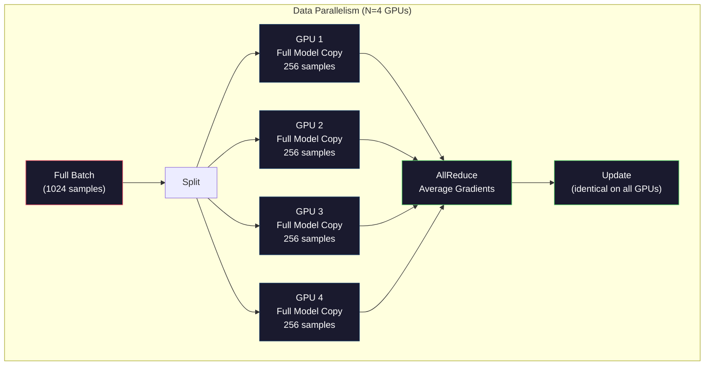
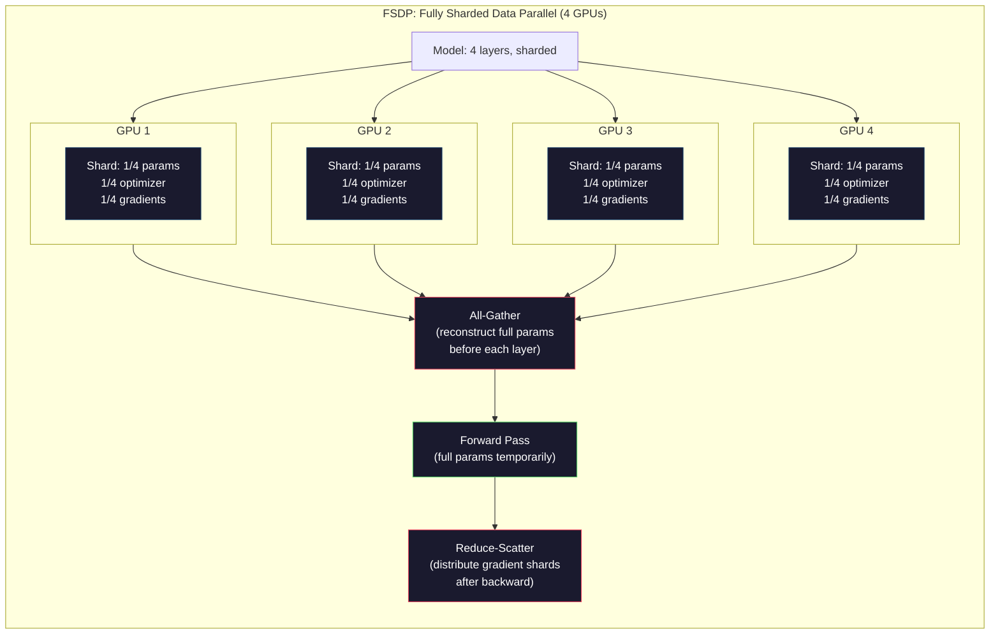
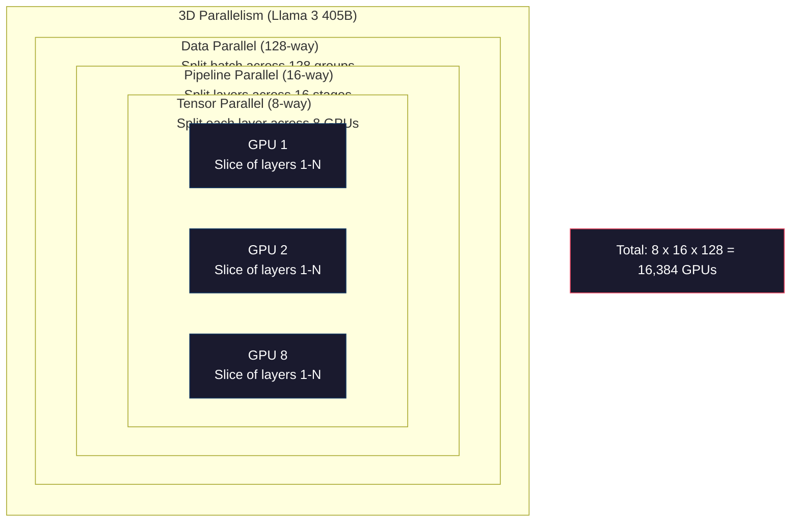

# 規模化：分散式訓練、FSDP、DeepSpeed

> 你的 1.24 億參數模型在一張 GPU 上訓練完了。現在換 70 億參數試試。模型塞不進記憶體。資料在單一台機器上要跑好幾週。到了這個規模，分散式訓練不是選項，而是唯一的路。

**類型：** 實作
**程式語言：** Python
**先修單元：** 階段 10 · 04（預訓練一個迷你 GPT）
**時間：** 約 120 分鐘

## 學習目標

- 說明三種平行化（資料、張量、管線）各是什麼，以及依模型與叢集規模何時非用不可
- 用 PyTorch DDP 實作資料平行訓練，並在多張 GPU 之間同步梯度
- 為給定的模型大小算出記憶體預算（權重 + 優化器狀態 + 梯度 + 啟動值），據此決定最低硬體需求
- 設定 FSDP 或 DeepSpeed ZeRO 階段，把模型狀態分片到各張 GPU 上，塞進超出單卡記憶體的模型

## 問題所在

一個 70 億參數的模型，光是 FP16 的權重就要 14GB。Adam 最佳化器為每個參數再多存兩份（一階與二階動量估計），那又是 28GB。反向傳播期間的梯度再加 14GB。你還沒存下任何一個啟動值，就已經到 56GB 了。

一張 NVIDIA A100 有 80GB 記憶體。

80GB 用掉 56GB，剩下 24GB 給啟動值 —— 也就是前向傳播算出來、必須留著給反向傳播用的中間數值。一段 2048 詞元的序列、4096 維的模型，單層的啟動值大約用掉 64MB。32 層的話，每個樣本要 2GB。批次大小 8 就要 16GB。你有 24GB。批次大小 12 就爆了。

現在換 700 億參數試試。光權重就 140GB（FP16）。單張 GPU 塞不下。你至少需要 2 張 A100（2 x 80GB = 160GB）才裝得下權重。加上優化器狀態與梯度，你需要的遠不止於此：最少 3 張以上，實務上依分片策略大概要 8 到 16 張。

Llama 3 405B 是在 16,384 張 NVIDIA H100 上訓練的。這次訓練的運算成本估計是 1 億美元。DeepSeek V3 只花了大約 560 萬美元就訓出可比的模型，靠的是在架構上動腦筋（混合專家模型意味著每個詞元只啟用一小部分參數）以及訓練效率。

這個單元涵蓋讓大規模訓練成為可能的四種策略：資料平行、張量平行、管線平行，以及完全分片資料平行。在碰任何分散式訓練框架之前，你會先用純 Python 模擬每一種，把機制搞懂。

## 核心概念

### 為什麼非分散不可

以下是真實模型的記憶體數學。每個數字都是算出來的，不是估的。

| 模型 | 參數量 | 權重（FP16） | Adam 狀態 | 梯度（FP16） | 總計（不含啟動值） |
|-------|--------|----------------|-------------|------------------|----------------------|
| GPT-2 Small | 124M | 248 MB | 992 MB | 248 MB | 1.5 GB |
| Llama 3 8B | 8B | 16 GB | 64 GB | 16 GB | 96 GB |
| Llama 3 70B | 70B | 140 GB | 560 GB | 140 GB | 840 GB |
| Llama 3 405B | 405B | 810 GB | 3,240 GB | 810 GB | 4,860 GB |

「Adam 狀態」那一欄才是致命的。Adam 為每個參數存一份滾動平均（m）與一份滾動變異數（v），兩者都是 FP32。以 700 億參數的模型來說，那是 70B x 4 bytes x 2 = 560GB。光是最佳化器就要七張 A100。

單張 H100 有 80GB。Llama 3 405B 至少要 61 張 H100 才裝得下權重、最佳化器與梯度。再加上啟動值，數字還會往上長。Meta 用 16,384 張 GPU 不是因為他們想這樣 —— 是因為他們不得不。

### 資料平行

最簡單的分散式策略。把整個模型複製到 N 張 GPU 上。把每一批訓練資料切成 N 等份。每張 GPU 在自己那份資料上跑一次前向傳播與反向傳遞。反向傳遞結束後，把所有 GPU 的梯度平均起來。每張 GPU 都用同一份平均後的梯度更新自己那份權重，讓所有副本保持同步。

**好處：** 吞吐量線性擴展。N 張 GPU 每一步處理 N 倍的資料。通訊只發生在梯度平均，而且能與計算重疊。

**壞處：** 每張 GPU 都持有完整的模型、優化器狀態與梯度副本。以 700 億參數的模型來說，每張 GPU 要 840GB。資料平行對每卡記憶體佔用毫無幫助，它只縮短訓練時間。

**數學：** 有效批次大小 = per_gpu_batch_size x N。N=64 張 GPU、每卡批次 16，有效批次就是 1,024。Llama 3 用的有效批次大小是每步 1600 萬個詞元。



### 張量平行

把單一層本身切開，分到多張 GPU 上。一次矩陣乘法被拆給多張 GPU，每張各算出結果的一部分。

想像前饋層裡一個形狀 (8192, 8192) 的權重矩陣。用 4 路張量平行，每張 GPU 持有一個 (8192, 2048) 的分片。每張 GPU 把輸入乘上自己的分片，得到部分結果。這些部分結果再合併起來（透過 all-reduce 或 all-gather），組成完整輸出。

**好處：** 降低每張 GPU 的模型權重記憶體佔用。700 億參數的模型切到 8 張 GPU 上，代表每張 GPU 只持有約 87.5 億參數份量的權重。

**壞處：** 每一層之後都需要快速的 GPU 間通訊。每次矩陣乘法後的 all-reduce 都會增加延遲。這在 NVLink 上運作良好（同一節點內 GPU 之間 900 GB/s），但跨節點透過 InfiniBand 就很糟（400 Gb/s，約 50 GB/s）。張量平行幾乎總是被限制在單一節點內（8 張 GPU）。

**真實用法：** Megatron-LM 開創了張量平行。Llama 3 405B 在每個節點內使用 8 路張量平行。

### 管線平行

按層切開模型。GPU 1 跑第 1-8 層。GPU 2 跑第 9-16 層。GPU 3 跑第 17-24 層。GPU 4 跑第 25-32 層。資料在管線裡流動：GPU 1 算完自己那幾層，把啟動值送給 GPU 2，GPU 2 算完再送給 GPU 3，依此類推。

**好處：** GPU 之間的通訊量極小 —— 只有層邊界上的啟動值，和梯度或權重比起來小得多。因為頻寬需求低，所以跨節點也能用。

**壞處：** 管線氣泡。當 GPU 4 正在對第 1 個微批次做前向傳播時，GPU 1、2、3 是閒著的（它們已經把自己那段前傳完了）。反向傳遞時模式反過來。用天真的管線做法，N 個管線階段的 GPU 使用率只有 1/N。

**GPipe 與 PipeDream** 靠把批次切成微批次來解決氣泡問題。GPU 1 一把第 1 個微批次前傳完，就馬上開始第 2 個。這讓計算在各管線階段之間重疊起來。M 個微批次配 N 個階段，氣泡比例會降到 (N-1)/M。用 M=16 個微批次配 N=4 個階段，氣泡就是 3/16 = 18.75% 的閒置時間。

### FSDP：完全分片資料平行

FSDP 把資料平行的擴展性與分片的記憶體效率結合起來。每張 GPU 不再持有完整的模型副本，而是只持有 1/N 的參數、梯度與優化器狀態。

在一層做前向傳播之前，FSDP 會跑一次 **all-gather**，把完整參數從所有 GPU 收集到每張 GPU 的記憶體裡。前向傳播結束後，每張 GPU 丟掉不屬於自己的參數。反向時再跑一次 all-gather 重建參數以計算梯度。反向傳遞結束後，一次 **reduce-scatter** 把梯度分片分送出去，讓每張 GPU 只存 1/N 的梯度。

**700 億參數模型跑在 8 張 GPU 上的數學：**

| 元件 | 不用 FSDP | 用 FSDP |
|-----------|-------------|-----------|
| 權重（FP16） | 每張 GPU 140 GB | 每張 GPU 17.5 GB |
| Adam 狀態（FP32） | 每張 GPU 560 GB | 每張 GPU 70 GB |
| 梯度（FP16） | 每張 GPU 140 GB | 每張 GPU 17.5 GB |
| **總計** | **每張 GPU 840 GB** | **每張 GPU 105 GB** |

不用 FSDP，700 億參數的模型根本塞不進單張 80GB GPU。用 FSDP 跑在 8 張 GPU 上，每張要 105GB —— 等等，這樣還是塞不下。你至少需要 16 張 GPU 才能把每卡壓到 80GB 以下，或者把 FSDP 和啟動值檢查點結合起來（反向時重算啟動值，而不是把它們存下來）。

因為每一層之前都要 all-gather，通訊成本比單純的資料平行高。但省下的記憶體讓過去不可能的訓練變成可能。



### DeepSpeed ZeRO

DeepSpeed 的 ZeRO（Zero Redundancy Optimizer）在概念上與 FSDP 完全相同，只是由微軟獨立開發。它定義了三個階段，分片一階段比一階段更徹底：

| 階段 | 分片什麼 | 記憶體節省 | 通訊 |
|-------|--------|---------------|---------------|
| ZeRO-1 | 只有優化器狀態 | 約 4 倍縮減 | 與資料平行相同 |
| ZeRO-2 | + 梯度 | 約 8 倍縮減 | 略多一些 |
| ZeRO-3 | + 參數 | 約 N 倍縮減（N 張 GPU） | 每層一次 all-gather |

ZeRO-3 等同於 FSDP。名字不同，機制一樣。在 DeepSpeed 證明這個概念可行之後，PyTorch 才把 FSDP 加進來成為原生實作。

DeepSpeed 還推出了 ZeRO-Offload（把優化器狀態卸載到 CPU RAM，那既便宜又大）與 ZeRO-Infinity（卸載到 NVMe SSD）。這些是拿計算速度換記憶體容量 —— 被卸載的運算比較慢，但騰出了 GPU 記憶體。

### 混合精度訓練

現代訓練會同時使用多種浮點格式：

- **前向傳播**：FP16 或 BF16（16 位元）。記憶體是 FP32 的一半。矩陣乘法在 tensor core 上快 2 倍。
- **主權重**：FP32（32 位元）。由最佳化器維護，讓權重更新時保有數值精度。
- **損失縮放**：反向傳遞之前先把損失乘上一個大常數，避免 FP16 梯度下溢成零。最佳化器步驟之前再除回去。

BF16（Brain Float 16）的指數範圍和 FP32 一樣（8 個指數位元），但精度較低（7 個尾數位元，FP32 是 23 個）。它很少需要損失縮放，因為它能表示同樣範圍的數值。FP16 有 5 個指數位元、10 個尾數位元 —— 它能表示細膩的數值，但在極端量級會溢位／下溢。

Google 的 TPU 原生使用 BF16。NVIDIA 的 A100 與 H100 同時支援 FP16 與 BF16。業界大體上已經轉向 BF16，因為它省掉了損失縮放這個麻煩。

**70 億參數模型的記憶體比較：**

| 精度 | 權重 | 最佳化器 | 梯度 | 總計 |
|-----------|---------|-----------|-----------|-------|
| 全部 FP32 | 28 GB | 56 GB | 28 GB | 112 GB |
| 混合（BF16 + FP32 主權重） | 14 GB | 56 GB | 14 GB | 84 GB |

混合精度在這個模型上省下 28GB。優化器狀態不管怎樣都留在 FP32 —— 記憶體大半就是花在這裡。

### Megatron-LM 與 3D 平行

真正的大規模訓練會把三種平行化全用上：

- **資料平行**跨節點群組（放大批次大小）
- **張量平行**在節點內（把每一層切給 8 張 GPU）
- **管線平行**跨節點（把層群組切給不同機器）

Llama 3 405B 跑在 16,384 張 H100 上：

- 每個節點內 8 路張量平行（每節點 8 張 GPU）
- 跨節點 16 路管線平行（16 個管線階段）
- 剩下那個維度上 128 路資料平行（16,384 / 8 / 16 = 128）

這個 3D 分解（8 x 16 x 128 = 16,384）就是你擴展到數千張 GPU 的方式。每張 GPU 看到不同的資料分片（資料平行）、持有每一層的一小片（張量平行），並計算一組不同的層（管線平行）。

DeepSeek V3 走了另一條路。他們的混合專家架構每個詞元只啟用 6710 億參數中的 370 億。這代表每張 GPU 只需要為啟用的那些參數做計算（與存啟動值）。他們在 2,048 張 H800 GPU 上訓練 —— 不到 Meta GPU 數量的八分之一 —— 花費 560 萬美元，對比 Meta 估計的 1 億美元。



```figure
paged-kv-cache
```

## 動手實作

### 步驟 1：模擬資料平行

把一批資料切給模擬出來的多張 GPU。每張 GPU 在自己那份分片上跑前向傳播。再把「梯度」平均起來（我們用損失值來模擬它們）。

```python
import numpy as np

def simulate_data_parallelism(data, num_gpus, model_fn):
    batch_size = len(data)
    shard_size = batch_size // num_gpus
    remainder = batch_size % num_gpus

    gpu_losses = []
    gpu_gradients = []

    offset = 0
    for gpu_id in range(num_gpus):
        extra = 1 if gpu_id < remainder else 0
        shard = data[offset:offset + shard_size + extra]
        offset += shard_size + extra

        loss, grad = model_fn(shard)
        gpu_losses.append(loss)
        gpu_gradients.append(grad)

    avg_loss = np.mean(gpu_losses)
    avg_gradient = np.mean(gpu_gradients, axis=0)

    return avg_loss, avg_gradient
```

all-reduce 這個操作（平均梯度）是資料平行裡唯一的通訊。實務上在 NVIDIA GPU 上這由 NCCL 函式庫實現，它用的是環狀 all-reduce：每張 GPU 把自己 1/N 的梯度送給鄰居，再從另一邊的鄰居收 1/N，經過 N-1 步之後每張 GPU 都拿到完整的平均值。總通訊量：2 x gradient_size x (N-1)/N，N 很大時趨近梯度大小的 2 倍。

### 步驟 2：模擬張量平行

把一個權重矩陣切給多張 GPU。每張 GPU 算一部分矩陣乘法。再把結果合起來。

```python
def simulate_tensor_parallelism(input_data, weight_matrix, num_gpus):
    d_in, d_out = weight_matrix.shape
    assert d_out % num_gpus == 0, f"d_out {d_out} not divisible by num_gpus {num_gpus}"
    shard_size = d_out // num_gpus

    partial_results = []
    for gpu_id in range(num_gpus):
        start = gpu_id * shard_size
        end = start + shard_size
        weight_shard = weight_matrix[:, start:end]

        partial = input_data @ weight_shard
        partial_results.append(partial)

    full_output = np.concatenate(partial_results, axis=-1)

    direct_output = input_data @ weight_matrix
    error = np.abs(full_output - direct_output).max()

    return full_output, error
```

誤差應該剛好是零（或機器 epsilon）。張量平行在數學上是精確的 —— 它產生的結果和在單張 GPU 上算完整矩陣乘法一模一樣。切分是沿著輸出維度做的，所以每張 GPU 產出不同的一段欄，串接起來就重建出完整結果。

對於欄平行的線性層（切輸出維度），你用串接。對於列平行（切輸入維度），你用加總。在 transformer 的 FFN 裡，第一個線性層（擴張）用欄平行，第二個線性層（收縮）用列平行。這樣就避開了兩層之間的一次 all-reduce。

### 步驟 3：模擬管線平行

把一個模型的層切給虛擬的多張 GPU。展示氣泡問題 —— 前面的階段閒著，等後面的階段在算。

```python
def simulate_pipeline_parallelism(num_layers, num_stages, num_microbatches):
    layers_per_stage = num_layers // num_stages

    timeline = {}
    clock = 0

    for mb in range(num_microbatches):
        for stage in range(num_stages):
            start_time = max(
                timeline.get((stage, mb - 1, "fwd"), (0, 0))[1] if mb > 0 else 0,
                timeline.get((stage - 1, mb, "fwd"), (0, 0))[1] if stage > 0 else 0,
            )
            end_time = start_time + layers_per_stage
            timeline[(stage, mb, "fwd")] = (start_time, end_time)

    last_fwd_end = max(v[1] for v in timeline.values())

    for mb in range(num_microbatches - 1, -1, -1):
        for stage in range(num_stages - 1, -1, -1):
            deps = [last_fwd_end]
            if mb < num_microbatches - 1 and (stage, mb + 1, "bwd") in timeline:
                deps.append(timeline[(stage, mb + 1, "bwd")][1])
            if stage < num_stages - 1 and (stage + 1, mb, "bwd") in timeline:
                deps.append(timeline[(stage + 1, mb, "bwd")][1])
            start_time = max(deps)
            end_time = start_time + layers_per_stage
            timeline[(stage, mb, "bwd")] = (start_time, end_time)

    total_time = max(v[1] for v in timeline.values())
    compute_time = num_microbatches * num_stages * layers_per_stage * 2
    bubble_fraction = 1.0 - compute_time / (total_time * num_stages)

    return timeline, total_time, bubble_fraction
```

4 個階段配 1 個微批次時，氣泡比例是 75% —— 任何時刻都有四分之三的 GPU 閒著。改成 16 個微批次，它降到約 19%。消掉氣泡的代價是記憶體：你必須同時存下所有在管線中飛行的微批次的啟動值。

### 步驟 4：記憶體計算器

算出訓練任一模型大小所需的精確記憶體。

```python
def memory_calculator(
    params_billions,
    precision_bytes=2,
    optimizer="adam",
    num_gpus=1,
    sharding="none",
    sequence_length=2048,
    batch_size_per_gpu=1,
    hidden_dim=None,
    num_layers=None,
):
    params = params_billions * 1e9

    weight_memory = params * precision_bytes

    if optimizer == "adam":
        optimizer_memory = params * 4 * 2
    elif optimizer == "sgd":
        optimizer_memory = params * 4
    else:
        optimizer_memory = 0

    gradient_memory = params * precision_bytes

    total_no_activation = weight_memory + optimizer_memory + gradient_memory

    if hidden_dim and num_layers:
        activation_per_layer = (
            sequence_length * batch_size_per_gpu * hidden_dim * precision_bytes * 4
        )
        activation_memory = activation_per_layer * num_layers
    else:
        activation_memory = params * precision_bytes * 0.5

    if sharding == "fsdp" or sharding == "zero3":
        weight_memory /= num_gpus
        optimizer_memory /= num_gpus
        gradient_memory /= num_gpus
    elif sharding == "zero2":
        optimizer_memory /= num_gpus
        gradient_memory /= num_gpus
    elif sharding == "zero1":
        optimizer_memory /= num_gpus

    per_gpu_total = weight_memory + optimizer_memory + gradient_memory + activation_memory

    return {
        "params_billions": params_billions,
        "weights_gb": weight_memory / 1e9,
        "optimizer_gb": optimizer_memory / 1e9,
        "gradients_gb": gradient_memory / 1e9,
        "activations_gb": activation_memory / 1e9,
        "per_gpu_total_gb": per_gpu_total / 1e9,
        "total_across_gpus_gb": per_gpu_total * num_gpus / 1e9,
        "fits_on_80gb": per_gpu_total / 1e9 <= 80,
        "num_gpus": num_gpus,
        "sharding": sharding,
    }
```

這個計算器回答每位 ML 工程師都會問的問題：「我需要幾張 GPU？」餵它模型大小，看看塞不塞得下。調整分片策略，直到每卡總量降到 80GB 以下。

### 步驟 5：混合精度模擬

比較 FP32、FP16 與混合精度訓練的記憶體用量。

```python
def mixed_precision_comparison(params_billions):
    params = params_billions * 1e9

    fp32_weights = params * 4
    fp32_optimizer = params * 4 * 2
    fp32_gradients = params * 4
    fp32_total = fp32_weights + fp32_optimizer + fp32_gradients

    fp16_weights = params * 2
    fp16_master = params * 4
    fp16_optimizer = params * 4 * 2
    fp16_gradients = params * 2
    fp16_total = fp16_weights + fp16_master + fp16_optimizer + fp16_gradients

    mixed_weights = params * 2
    mixed_optimizer = params * 4 * 2
    mixed_gradients = params * 2
    mixed_total = mixed_weights + mixed_optimizer + mixed_gradients

    return {
        "fp32_total_gb": fp32_total / 1e9,
        "fp16_with_master_gb": fp16_total / 1e9,
        "mixed_bf16_gb": mixed_total / 1e9,
        "savings_vs_fp32": 1 - mixed_total / fp32_total,
    }
```

對多數人來說最意外的一點是：混合精度並不會讓記憶體減半。不管用什麼精度，優化器狀態（Adam 的 m 與 v）都留在 FP32。以 70 億參數的模型來說，FP32 訓練要 112GB，混合精度要 84GB。那是縮減 25%，不是 50%。最佳化器才是大頭。

## 框架應用

### 跑完所有模擬

```python
def run_all_demos():
    print("=" * 70)
    print("DATA PARALLELISM SIMULATION")
    print("=" * 70)

    np.random.seed(42)
    data = np.random.randn(64, 32)
    weight = np.random.randn(32, 16)

    def model_fn(batch):
        output = batch @ weight
        loss = np.mean(output ** 2)
        grad = 2 * batch.T @ (batch @ weight) / len(batch)
        return loss, grad

    for n_gpus in [1, 2, 4, 8]:
        loss, grad = simulate_data_parallelism(data, n_gpus, model_fn)
        print(f"  {n_gpus} GPUs: loss={loss:.4f}, grad_norm={np.linalg.norm(grad):.4f}")

    print()
    print("=" * 70)
    print("TENSOR PARALLELISM SIMULATION")
    print("=" * 70)

    x = np.random.randn(4, 8192)
    W = np.random.randn(8192, 8192)

    for n_gpus in [1, 2, 4, 8]:
        output, error = simulate_tensor_parallelism(x, W, n_gpus)
        print(f"  {n_gpus} GPUs: output_shape={output.shape}, max_error={error:.2e}")

    print()
    print("=" * 70)
    print("PIPELINE PARALLELISM SIMULATION")
    print("=" * 70)

    for n_mb in [1, 4, 8, 16, 32]:
        _, total_t, bubble = simulate_pipeline_parallelism(32, 4, n_mb)
        print(f"  {n_mb:2d} micro-batches: total_time={total_t:4d}, bubble={bubble:.1%}")

    print()
    print("=" * 70)
    print("MEMORY CALCULATOR")
    print("=" * 70)

    configs = [
        (7, "none", 1),
        (7, "fsdp", 8),
        (70, "none", 1),
        (70, "fsdp", 8),
        (70, "fsdp", 16),
        (405, "fsdp", 64),
        (405, "fsdp", 128),
    ]

    print(f"  {'Model':>8} {'Sharding':>8} {'GPUs':>5} {'Per-GPU':>10} {'Fits 80GB':>10}")
    print("  " + "-" * 50)
    for params, shard, gpus in configs:
        result = memory_calculator(params, num_gpus=gpus, sharding=shard)
        fits = "Yes" if result["fits_on_80gb"] else "No"
        print(f"  {params:>6}B {shard:>8} {gpus:>5} {result['per_gpu_total_gb']:>8.1f}GB {fits:>10}")

    print()
    print("=" * 70)
    print("MIXED PRECISION COMPARISON")
    print("=" * 70)

    for params_b in [7, 13, 70, 405]:
        result = mixed_precision_comparison(params_b)
        print(f"  {params_b}B: FP32={result['fp32_total_gb']:.0f}GB, "
              f"Mixed BF16={result['mixed_bf16_gb']:.0f}GB, "
              f"Savings={result['savings_vs_fp32']:.0%}")
```

## 產出交付

這個單元會產出 `outputs/prompt-distributed-training-planner.md` —— 一份提示詞，接收模型大小與可用硬體，產出一份完整的分散式訓練計畫：平行化策略、記憶體預算、通訊開銷，以及預期吞吐量。

## 練習

1. 修改記憶體計算器，把啟動值檢查點（activation checkpointing）納進來。有了檢查點，只在每第 K 層存啟動值（典型 K=1，意思是全部重算）。展示記憶體與計算之間的取捨：檢查點省下多少記憶體，又讓訓練慢了多少（全面檢查點大約多 33% 的計算量）？

2. 把管線平行的模擬擴充成 PipeDream 使用的 1F1B（一次前向、一次反向）排程。比較 4 個階段、8 個微批次下它與天真排程的氣泡比例。1F1B 排程的尖峰記憶體應該比較小，因為它更早開始反向傳遞。

3. 實作一個梯度累積模擬器。不要每個微批次都做 all-reduce，改成在本地累積 K 步的梯度再做 all-reduce。展示這如何把通訊量減少 K 倍，卻產生完全相同的最終梯度（因此訓練結果也完全相同）。

4. 做一個成本估算器。給定模型大小、目標詞元量、GPU 型號（A100 每小時 2 美元、H100 每小時 3.50 美元）與平行化策略，估出以美元計的總訓練成本。拿已知數字驗證：Llama 3 405B 據報約 1 億美元，DeepSeek V3 約 560 萬美元。

5. 把 ZeRO-Offload 加進記憶體計算器。假設每個節點有 512GB CPU RAM、2TB NVMe。展示把優化器狀態卸載到 CPU 之後，700 億參數的模型如何用 4 張 GPU 而不是 16 張訓練，代價是最佳化器步驟慢上 30-50%。

## 關鍵術語

| 術語 | 大家怎麼說 | 實際上是什麼 |
|------|----------------|----------------------|
| 資料平行 | 「把模型複製到每張 GPU」 | 每張 GPU 處理不同的資料分片；每一步之後透過 all-reduce 平均梯度 |
| 張量平行 | 「把一層切給多張 GPU」 | 切分權重矩陣，讓每張 GPU 算一部分矩陣乘法；需要快速的 NVLink 互連 |
| 管線平行 | 「把層切給多張 GPU」 | 每張 GPU 跑不同的一組層；資料以微批次流過管線以減少氣泡 |
| FSDP | 「什麼都分片」 | Fully Sharded Data Parallel —— 每張 GPU 持有 1/N 的權重、梯度與優化器狀態；計算前先 all-gather |
| ZeRO | 「DeepSpeed 版的 FSDP」 | Zero Redundancy Optimizer，分三個階段：分片最佳化器（第 1 階段）、+ 梯度（第 2 階段）、+ 參數（第 3 階段） |
| All-reduce | 「跨 GPU 取平均」 | 一種集體通訊操作，結束時每張 GPU 都拿到所有 GPU 輸入的總和（或平均）—— 典型實作是環狀 all-reduce |
| All-gather | 「從所有 GPU 收集」 | 一種集體通訊操作，結束時每張 GPU 都拿到所有 GPU 資料的串接 —— FSDP 用它重建完整參數 |
| Reduce-scatter | 「加總後分送」 | 一種集體通訊操作，先歸約（加總）資料，再把不同區塊散送到不同 GPU —— FSDP 用它做梯度分片 |
| 混合精度 | 「用半精度訓練」 | 前向／反向用 FP16/BF16，優化器狀態用 FP32 —— 省下約 25% 記憶體而不是 50%，因為最佳化器才是大頭 |
| 管線氣泡 | 「管線裡的閒置時間」 | GPU 閒著等前一階段送資料過來的時間比例 —— 用更多微批次可以降低 |

## 延伸閱讀

- [Rajbhandari et al., 2020 -- "ZeRO: Memory Optimizations Toward Training Trillion Parameter Models"](https://arxiv.org/abs/1910.02054) —— DeepSpeed ZeRO 論文，定義了三個分片階段
- [Shoeybi et al., 2020 -- "Megatron-LM: Training Multi-Billion Parameter Language Models Using Model Parallelism"](https://arxiv.org/abs/1909.08053) —— NVIDIA 為 transformer 打造的張量平行
- [Narayanan et al., 2021 -- "Efficient Large-Scale Language Model Training on GPU Clusters Using Megatron-LM"](https://arxiv.org/abs/2104.04473) —— 結合資料、張量與管線的 3D 平行
- [Zhao et al., 2023 -- "PyTorch FSDP: Experiences on Scaling Fully Sharded Data Parallel"](https://arxiv.org/abs/2304.11277) —— PyTorch 的原生 FSDP 實作
- [Llama 3 Technical Report](https://arxiv.org/abs/2407.21783) —— 16,384 張 GPU 的訓練與 3D 平行細節
- [DeepSeek-V3 Technical Report](https://arxiv.org/abs/2412.19437) —— MoE 架構如何把訓練成本降低一個數量級
