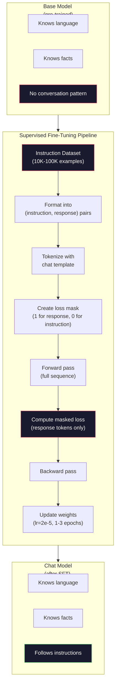

# 指令微調（SFT）

> 基礎模型只做一件事：預測下一個詞元。它不會遵循指令、不會回答問題，也不會拒絕有害的請求。SFT 就是從「詞元預測器」通往「可用助理」的那座橋。你聊過的每一個模型 —— Claude、GPT、Llama Chat —— 都走過這一步。

**類型：** 實作
**程式語言：** Python (with numpy)
**先修單元：** 階段 10 · 04（預訓練一個迷你 GPT）
**時間：** 約 90 分鐘

## 學習目標

- 實作監督式微調（SFT），把一個基礎語言模型轉成會遵循指令的助理
- 用帶有 system、user、assistant 角色的對話模板（chat template）格式化訓練資料，並對非 assistant 的詞元做損失遮罩
- 說明為什麼需要 SFT：基礎模型是在*接續*文字，不是在回答問題
- 在一組保留的指令集上比較基礎模型與微調後模型的回應，藉此評估 SFT 品質

## 問題所在

你在單元 04 訓練了一個模型。給它一串序列，它能預測下一個詞元。餵它「The transformer architecture」，它可能接上「has revolutionized natural language processing.」。以一個下一個詞元預測器來說，這已經很不錯了。

現在換一個：餵它「What is the capital of France?」基礎模型不會回答「Paris」。它會接續這個模式。它可能吐出「What is the capital of Germany? What is the capital of Spain?」，因為它從一堆列滿問句的文件裡學過這種寫法。或者它產生「is a question that many people ask」，因為這是個合理的下一個詞元接續。模型腦中沒有*回答*這個概念，它只知道*接續*。

這就是 GPT-3（基礎模型，2020 年 6 月釋出）與 ChatGPT（指令微調過，2022 年 11 月釋出）之間的落差。一樣的架構，一樣的預訓練。差別在於那 20,000 到 100,000 組精心打造的（指令，回應）配對，它們教會了模型去遵循對話的模式。

Stanford Alpaca 證明了你不需要幾百萬筆範例。2023 年 3 月，他們只用 GPT-3.5 生成的 52,000 組指令—回應配對就微調出了 Llama 7B。總花費：600 美元。成果是一個能遵循指令、回答問題、進行對話的聊天機器人。沒有 ChatGPT 那麼好，但以 600 美元和幾小時訓練來說，近得嚇人。

Meta 的 Llama 2 Chat 在初期的 SFT 階段只用了大約 27,000 筆高品質範例。關鍵洞見是：資料品質比數量重要。由熟練標註者撰寫的 27,000 筆，勝過從網路上爬來的 100 萬筆雜訊資料。

## 核心概念

### SFT 到底做了什麼

監督式微調沿用預訓練的同一套訓練迴圈 —— 前向傳播、算損失、反向傳遞、更新權重 —— 只是換成另一種資料。你訓練的不是原始文字，而是結構化的對話：

```json
{
  "system": "You are a helpful assistant.",
  "user": "What is the capital of France?",
  "assistant": "The capital of France is Paris."
}
```

模型早就知道巴黎是法國首都。它在預訓練階段從維基百科、教科書與網頁上學到了。SFT 不是教模型新的事實，而是教它一個新的*行為*：看到問題就給答案，看到指令就給補全，看到有害請求就給拒絕。

換個說法：預訓練給模型知識，SFT 給模型禮貌。

### 資料格式

業界主要有三種格式。它們編碼的資訊完全一樣 —— 誰說了什麼 —— 只是分隔符號不同。

**Alpaca 格式**（Stanford，2023 年 3 月）：

```json
{
  "instruction": "Summarize the following article in 3 sentences.",
  "input": "The European Central Bank raised interest rates...",
  "output": "The ECB increased rates by 25 basis points..."
}
```

簡單，用得也廣。`input` 欄位是選填的 —— 很多指令並不需要額外脈絡。Stanford 用 600 美元請 GPT-3.5 生成了 52,000 筆這種格式的範例並釋出，開源指令微調的浪潮就是這麼掀起來的。

**ShareGPT 格式**（社群，2023 年）：

```json
{
  "conversations": [
    {"from": "system", "value": "You are a helpful assistant."},
    {"from": "human", "value": "What causes tides?"},
    {"from": "gpt", "value": "Tides are caused by the gravitational pull of the Moon..."},
    {"from": "human", "value": "How often do they occur?"},
    {"from": "gpt", "value": "Most coastal areas experience two high tides and two low tides per day..."}
  ]
}
```

支援多輪對話。「from」欄位依慣例用「human」與「gpt」，不管實際上是哪個模型。Vicuna 就是用從使用者分享的 ChatGPT 對話紀錄爬來的 70,000 筆 ShareGPT 對話訓練的。

**ChatML 格式**（OpenAI，許多開源模型採用）：

```
<|im_start|>system
You are a helpful assistant.<|im_end|>
<|im_start|>user
What is the capital of France?<|im_end|>
<|im_start|>assistant
The capital of France is Paris.<|im_end|>
```

用特殊詞元（`<|im_start|>`、`<|im_end|>`）來界定角色。這些詞元會在微調時加進分詞器的詞彙表。Qwen、Yi 以及許多其他模型都用 ChatML。

三種格式做的是同一件事：告訴模型「這是指令，這是回應，把這個模式學起來」。

### 為什麼有效

模型在預訓練時就已經學會語言。它看過幾十億筆「問題後面接答案」、「指令後面接補全」以及人與人之間的對話。那些模式早就編碼在權重裡了。

SFT 只是把這份潛藏的能力集中起來。與其讓模型從脈絡去猜自己該回答問題還是接續文件，SFT 直接對著對話模式訓練。幾千筆範例之後，模型就學會了：看到 assistant 角色標記，就產生一段有幫助的回應。

這就是為什麼 27,000 筆就夠。你不是在教模型英文，也不是在教它世界的知識。你只是在教它一個很簡單的行為：回應指令。知識本來就在那裡。

### 遮罩後的損失

這是 SFT 裡最重要的技術細節，而多數教學文章都跳過它。

預訓練時，你對每一個詞元都算損失，模型要學會預測序列裡的每一個下一個詞元。SFT 時，你只對*回應*的詞元算損失。指令詞元只是拿來當脈絡用，模型不會因為「預測」錯它們而被懲罰。

為什麼？因為你不想讓模型學會*生成*指令，你要它學會*回應*指令。如果你對指令詞元算損失，等於在訓練模型去預測「What is the capital of France?」，好像提問的人是它一樣。這既浪費梯度訊號，也可能讓模型搞混自己的角色。

實務上你會做一個損失遮罩（loss masking）：回應詞元填 1，指令詞元填 0。在平均之前先把每個詞元的損失乘上這個遮罩。

```
Tokens:    [SYS] You are helpful [USER] What is the capital? [ASST] Paris is the capital [EOS]
Loss mask:   0    0    0     0      0     0   0  0     0       1     1    1   1     1      1
```

只有 `[ASST]` 之後的詞元會貢獻損失。模型在前向傳播時看得到完整的對話（它需要指令才能產生正確的回應），但更新權重時只根據它把回應預測得多好。

### 訓練超參數

SFT 用的超參數跟預訓練差非常多。你不是從零開始訓練，你是在調整一個已經能動的模型。

| Parameter | Pre-Training (Llama 2 7B) | SFT (Llama 2 Chat) |
|-----------|---------------------------|---------------------|
| 學習率 | 3e-4（峰值） | 2e-5 |
| 訓練回合數 | 1（資料掃一遍） | 2 |
| 批次大小 | 400 萬詞元 | 64 筆範例 |
| 暖身步數 | 2,000 | 0-100 |
| 權重衰減 | 0.1 | 0.0-0.1 |
| 資料量 | 2T 詞元 | 27,000 筆範例 |

SFT 的學習率低了 15 倍。這一點非常關鍵。微調時學習率太高會毀掉預訓練學到的知識，模型會「忘記」它學過什麼，並對這份小小的微調資料集過度擬合。這就是災難性遺忘。

兩個回合表示模型會看到每筆訓練範例兩次。在小資料集上超過 3 個回合會導致死記 —— 模型開始一字不差地複誦訓練範例，而不是做出泛化。

### 災難性遺忘

微調有可能摧毀通用能力。在遵循指令的資料上訓練太久，模型就會喪失寫程式、算數學或寫創意文字的能力。它會變得非常擅長訓練資料的那個特定格式，其他一切都很糟。

三種緩解手段：

1. **低學習率。** 1e-5 到 5e-5。更新幅度小，對預訓練特徵的破壞就小。

2. **短訓練。** 1-3 個回合。在模型過度擬合之前就停下來。

3. **混入預訓練資料。** Llama 2 Chat 在 SFT 資料集裡摻了一小部分（2-5%）原始預訓練資料。這會在模型學習新的指令遵循行為時，「提醒」它自己原本的通用能力。

### 真實數字

在 10,000 組高品質指令配對上微調一個 7B 模型，在單張 NVIDIA A100 80GB GPU 上大約要 1 小時。算式如下：

- 10,000 筆範例 x 平均 512 個詞元 = 512 萬個詞元
- 2 個回合 = 總共 1,024 萬個詞元
- A100 微調 7B 模型的吞吐量：約 3,000 詞元／秒
- 1,024 萬 / 3,000 = 約 3,400 秒 = 約 57 分鐘

對我們的迷你 GPT（4 層、128 維）來說，訓練幾乎是瞬間完成。重點在於搞懂機制，不在規模。



```figure
loss-masking
```

## 動手實作

### 步驟 1：指令資料集

先做一份合成的指令資料集。在生產環境裡，Scale AI、Anthropic 這類公司會請人類標註者來寫。我們用程式生成，目的是展示格式。

```python
import numpy as np

INSTRUCTION_DATA = [
    {
        "instruction": "What is the capital of France?",
        "response": "The capital of France is Paris."
    },
    {
        "instruction": "Explain gravity in one sentence.",
        "response": "Gravity is the force that attracts objects with mass toward each other."
    },
    {
        "instruction": "Write a haiku about the ocean.",
        "response": "Waves crash on the shore, salt and foam beneath the sun, endless blue expanse."
    },
    {
        "instruction": "What is 15 multiplied by 7?",
        "response": "15 multiplied by 7 is 105."
    },
    {
        "instruction": "Name three programming languages.",
        "response": "Three programming languages are Python, Rust, and TypeScript."
    },
    {
        "instruction": "Summarize photosynthesis.",
        "response": "Photosynthesis converts sunlight, water, and carbon dioxide into glucose and oxygen."
    },
    {
        "instruction": "What year did World War II end?",
        "response": "World War II ended in 1945."
    },
    {
        "instruction": "Define machine learning.",
        "response": "Machine learning is a field where algorithms learn patterns from data to make predictions."
    },
]
```

八筆範例少得可憐。Stanford Alpaca 用了 52,000 筆。但不管你手上有 8 筆還是 52,000 筆，機制完全一樣：分詞、遮罩、只對回應算損失。

### 步驟 2：用對話模板分詞

把指令—回應配對轉成帶有特殊角色標記的詞元序列。標記告訴模型指令在哪裡結束、回應從哪裡開始。

```python
SPECIAL_TOKENS = {
    "INST_START": 253,
    "INST_END": 254,
    "RESP_START": 255,
}


def tokenize_instruction_pair(instruction, response, vocab_size=256):
    inst_tokens = list(instruction.encode("utf-8"))
    resp_tokens = list(response.encode("utf-8"))

    inst_tokens = [min(t, vocab_size - 4) for t in inst_tokens]
    resp_tokens = [min(t, vocab_size - 4) for t in resp_tokens]

    tokens = (
        [SPECIAL_TOKENS["INST_START"]]
        + inst_tokens
        + [SPECIAL_TOKENS["INST_END"]]
        + [SPECIAL_TOKENS["RESP_START"]]
        + resp_tokens
    )

    return tokens


def create_loss_mask(tokens):
    mask = np.zeros(len(tokens), dtype=np.float32)
    in_response = False

    for i, token in enumerate(tokens):
        if token == SPECIAL_TOKENS["RESP_START"]:
            in_response = True
            continue
        if in_response:
            mask[i] = 1.0

    return mask
```

損失遮罩在指令詞元上全是 0，在回應詞元上全是 1。`RESP_START` 這個詞元本身遮罩是 0，因為它是分隔符號，不屬於回應內容。

### 步驟 3：遮罩後的交叉熵損失

標準交叉熵，只是乘上損失遮罩。只有回應詞元會貢獻梯度。

```python
def masked_cross_entropy_loss(logits, targets, loss_mask):
    batch, seq_len, vocab_size = logits.shape
    logits_flat = logits.reshape(-1, vocab_size)
    targets_flat = targets.reshape(-1)
    mask_flat = loss_mask.reshape(-1)

    max_logits = logits_flat.max(axis=-1, keepdims=True)
    log_softmax = logits_flat - max_logits - np.log(
        np.exp(logits_flat - max_logits).sum(axis=-1, keepdims=True)
    )

    per_token_loss = -log_softmax[np.arange(len(targets_flat)), targets_flat]

    masked_loss = per_token_loss * mask_flat
    num_response_tokens = mask_flat.sum()
    if num_response_tokens == 0:
        return 0.0
    loss = masked_loss.sum() / num_response_tokens

    return loss
```

分母是 `num_response_tokens`，不是 `seq_len`。如果你除以整段序列長度，比較長的指令就會稀釋掉梯度訊號。除以回應詞元數，可以確保不管指令多長，每個回應詞元的權重都相同。

### 步驟 4：SFT 訓練迴圈

沿用單元 04 的 MiniGPT。訓練迴圈跟預訓練幾乎一模一樣，只是多了指令格式化與遮罩後的損失。

```python
import sys
import os
sys.path.insert(0, os.path.join(os.path.dirname(__file__), "..", "..", "04-pre-training-mini-gpt", "code"))
from main import MiniGPT, LayerNorm, FeedForward, MultiHeadAttention, TransformerBlock, Embedding


def sft_train(model, dataset, num_epochs=2, lr=2e-5, seq_len=64):
    formatted_data = []
    for example in dataset:
        tokens = tokenize_instruction_pair(example["instruction"], example["response"])
        mask = create_loss_mask(tokens)
        formatted_data.append((tokens, mask))

    print(f"SFT Training: {len(formatted_data)} examples, {num_epochs} epochs, lr={lr}")
    print(f"Total tokens: {sum(len(t) for t, _ in formatted_data):,}")
    print()

    losses = []

    for epoch in range(num_epochs):
        epoch_loss = 0.0
        num_batches = 0

        indices = np.random.permutation(len(formatted_data))

        for idx in indices:
            tokens, mask = formatted_data[idx]

            if len(tokens) < 3:
                continue
            if len(tokens) > seq_len:
                tokens = tokens[:seq_len]
                mask = mask[:seq_len]

            input_ids = np.array(tokens[:-1]).reshape(1, -1)
            target_ids = np.array(tokens[1:]).reshape(1, -1)
            loss_mask = np.array(mask[1:]).reshape(1, -1)

            logits = model.forward(input_ids)
            loss = masked_cross_entropy_loss(logits, target_ids, loss_mask)

            batch_size, s_len, v_size = logits.shape
            probs = np.exp(logits - logits.max(axis=-1, keepdims=True))
            probs = probs / probs.sum(axis=-1, keepdims=True)
            dlogits = probs.copy()
            dlogits[np.arange(batch_size)[:, None], np.arange(s_len), target_ids] -= 1.0

            mask_expanded = loss_mask[:, :, np.newaxis]
            num_resp = loss_mask.sum()
            if num_resp > 0:
                dlogits = dlogits * mask_expanded / num_resp

            for block in model.blocks:
                block.ffn.W1 -= lr * np.random.randn(*block.ffn.W1.shape) * 0.01
                block.ffn.W2 -= lr * np.random.randn(*block.ffn.W2.shape) * 0.01
                block.ffn.b1 -= lr * np.random.randn(*block.ffn.b1.shape) * 0.01
                block.ffn.b2 -= lr * np.random.randn(*block.ffn.b2.shape) * 0.01

            epoch_loss += loss
            num_batches += 1
            losses.append(loss)

        avg_loss = epoch_loss / max(num_batches, 1)
        print(f"Epoch {epoch + 1}/{num_epochs} | Avg Loss: {avg_loss:.4f}")

    return model, losses
```

學習率是 2e-5，跟 Llama 2 Chat 一致。對比預訓練用的 3e-4 —— 小了 15 倍。梯度被遮罩過：指令詞元產生零梯度，只有回應詞元會推動權重。

### 步驟 5：比較基礎模型與 SFT 模型

SFT 的意義就在於行為改變。我們來量測看看：檢查模型面對指令格式的輸入時，跟面對原始文字接續時分別怎麼回應。

```python
def generate_response(model, prompt_tokens, max_new_tokens=50, temperature=0.8):
    tokens = list(prompt_tokens)
    seq_len = model.embedding.pos_embed.shape[0]

    for _ in range(max_new_tokens):
        context = np.array(tokens[-seq_len:]).reshape(1, -1)
        logits = model.forward(context)
        next_logits = logits[0, -1, :]

        next_logits = next_logits / max(temperature, 1e-8)
        probs = np.exp(next_logits - next_logits.max())
        probs = probs / probs.sum()
        probs = np.clip(probs, 1e-10, 1.0)
        probs = probs / probs.sum()

        next_token = np.random.choice(len(probs), p=probs)
        tokens.append(int(next_token))

    return tokens


def evaluate_instruction_following(model, instructions):
    print("Evaluating instruction following:")
    print("-" * 50)

    for instruction in instructions:
        tokens = (
            [SPECIAL_TOKENS["INST_START"]]
            + [min(t, 252) for t in list(instruction.encode("utf-8"))]
            + [SPECIAL_TOKENS["INST_END"]]
            + [SPECIAL_TOKENS["RESP_START"]]
        )

        output = generate_response(model, tokens, max_new_tokens=30, temperature=0.6)
        response_start = len(tokens)
        response_tokens = output[response_start:]
        response_bytes = bytes([t for t in response_tokens if t < 128])
        response_text = response_bytes.decode("utf-8", errors="replace")

        print(f"  Q: {instruction}")
        print(f"  A: {response_text[:80]}")
        print()
```

在只有 8 筆範例的迷你模型上，回應不會有什麼意義。這是預料中的事。重要的是*結構*：模型學會在回應標記之後產生輸出，而不是繼續生成更多指令。

### 步驟 6：量測災難性遺忘

比較模型在 SFT 前後預測下一個詞元的能力。如果 SFT 傷到了通用能力，模型在原始文字上的損失就會上升。

```python
def measure_forgetting(model, test_text, seq_len=64):
    tokens = np.array(list(test_text.encode("utf-8")[:512]))

    total_loss = 0.0
    num_windows = 0

    for start in range(0, len(tokens) - seq_len - 1, seq_len):
        input_ids = tokens[start:start + seq_len].reshape(1, -1)
        target_ids = tokens[start + 1:start + seq_len + 1].reshape(1, -1)

        logits = model.forward(input_ids)

        batch, s_len, vocab_size = logits.shape
        logits_flat = logits.reshape(-1, vocab_size)
        targets_flat = target_ids.reshape(-1)

        max_logits = logits_flat.max(axis=-1, keepdims=True)
        log_softmax = logits_flat - max_logits - np.log(
            np.exp(logits_flat - max_logits).sum(axis=-1, keepdims=True)
        )

        loss = -log_softmax[np.arange(len(targets_flat)), targets_flat].mean()
        total_loss += loss
        num_windows += 1

    return total_loss / max(num_windows, 1)
```

真正在做微調時，你會全程追蹤這個指標。如果原始文字的損失上升超過 10-15%，代表你的 SFT 太激進了。把學習率調低，或減少訓練回合數。

## 框架應用

### 完整 SFT 流水線示範

```python
if __name__ == "__main__":
    np.random.seed(42)

    test_text = """The transformer architecture processes sequences through self-attention.
Each layer applies multi-head attention followed by a feedforward network.
Residual connections and layer normalization stabilize deep networks.
The model learns to predict the next token given all previous tokens."""

    print("=" * 70)
    print("INSTRUCTION TUNING (SFT) DEMO")
    print("=" * 70)
    print()

    model = MiniGPT(
        vocab_size=256, embed_dim=128, num_heads=4,
        num_layers=4, max_seq_len=128, ff_dim=512
    )
    print(f"Model: {model.count_parameters():,} parameters")
    print(f"Config: 4 layers, 4 heads, 128 dims (mini GPT from Lesson 04)")
    print()

    print("PRE-SFT: Measuring base model loss on raw text")
    base_loss = measure_forgetting(model, test_text)
    print(f"  Base model loss: {base_loss:.4f}")
    print()

    print("=" * 70)
    print("SFT TRAINING")
    print("=" * 70)

    model, losses = sft_train(
        model, INSTRUCTION_DATA, num_epochs=3, lr=2e-5, seq_len=128
    )

    print()
    print("POST-SFT: Measuring fine-tuned model loss on raw text")
    sft_loss = measure_forgetting(model, test_text)
    print(f"  SFT model loss: {sft_loss:.4f}")
    print(f"  Change: {((sft_loss - base_loss) / base_loss * 100):+.1f}%")
    if abs(sft_loss - base_loss) / base_loss < 0.15:
        print("  Minimal forgetting (< 15% change)")
    else:
        print("  Significant forgetting detected")
    print()

    print("=" * 70)
    print("INSTRUCTION FOLLOWING EVALUATION")
    print("=" * 70)
    print()

    test_instructions = [
        "What is the capital of France?",
        "Name a programming language.",
        "Define gravity.",
    ]
    evaluate_instruction_following(model, test_instructions)

    print("=" * 70)
    print("DATA FORMAT EXAMPLES")
    print("=" * 70)
    print()

    for i, example in enumerate(INSTRUCTION_DATA[:3]):
        tokens = tokenize_instruction_pair(example["instruction"], example["response"])
        mask = create_loss_mask(tokens)
        resp_count = int(mask.sum())
        total_count = len(tokens)
        print(f"  Example {i + 1}: {total_count} tokens, {resp_count} response tokens ({resp_count/total_count:.0%} of sequence)")
        print(f"    Instruction: {example['instruction']}")
        print(f"    Response: {example['response']}")
        print()

    print("=" * 70)
    print("TRAINING LOSS CURVE")
    print("=" * 70)
    print()

    if losses:
        window = max(1, len(losses) // 5)
        for i in range(0, len(losses), window):
            chunk = losses[i:i + window]
            avg = sum(chunk) / len(chunk)
            print(f"  Steps {i:3d}-{i + len(chunk) - 1:3d}: avg loss = {avg:.4f}")
```

## 產出交付

這個單元產出 `outputs/prompt-sft-data-curator.md` —— 一個幫你設計並策展 SFT 指令資料集的提示詞。給定一個目標能力（程式生成、數學、對話），它會產出一份資料蒐集計畫，包含格式規格、品質標準與多樣性需求。

## 練習

1. 加上系統提示詞支援。修改 `tokenize_instruction_pair`，讓它接受一段 system 訊息並放在指令之前。建立 5 筆帶有不同系統提示詞的範例（「You are a poet」、「You are a math tutor」），並驗證模型在訓練時確實看到了不同的系統提示詞。

2. 實作資料混合。寫一個函式，吃進一份 SFT 資料集與一份原始文字語料，產出訓練批次，其中 5% 的範例是原始文字（不做遮罩）、95% 是指令配對（有遮罩）。跑 3 個回合，把遺忘指標拿來跟純 SFT 訓練比較。

3. 打造一個資料品質評分器。對每一組指令—回應配對計算：(a) 回應長度（詞元數）、(b) 指令對回應的長度比、(c) 詞彙多樣性（不重複詞元數／總詞元數）。濾掉回應長度小於 10 個詞元或多樣性低於 0.3 的範例。展示過濾如何影響最終損失。

4. 實作多輪對話訓練。把分詞擴展成能處理 3 輪對話（user-assistant-user-assistant-user-assistant）。損失遮罩要涵蓋全部三段 assistant 的回合。挑一筆範例把詞元與遮罩的對齊印出來，驗證遮罩正確。

5. 比較學習率。用 lr=1e-4、lr=2e-5、lr=1e-6 各訓練同一個模型一次，畫出損失曲線。1e-4 那次應該一開始下降很快但最終損失較高（過度擬合）。1e-6 那次幾乎不會動。2e-5 那次應該是甜蜜點。

## 關鍵術語

| 術語 | 大家怎麼說 | 實際上是什麼 |
|------|----------------|----------------------|
| SFT | 「拿對話去微調」 | 監督式微調：在（指令，回應）配對上繼續訓練，且只對回應詞元計算損失 |
| 指令微調 | 「教模型遵循指令」 | 在明確的指令—回應配對上訓練，讓基礎模型學會對話模式，而不是學新知識 |
| 損失遮罩 | 「忽略提示詞」 | 把指令詞元的損失設為零，讓梯度只從回應詞元的預測流出來 |
| ChatML | 「Chat Markup Language」 | 一種以 `<\|im_start\|>` 與 `<\|im_end\|>` 分隔符號標示對話資料中說話者角色的詞元格式 |
| Alpaca 格式 | 「Stanford 那個格式」 | 帶 instruction／input／output 欄位的 JSON 格式，用在那批花 600 美元、由 GPT-3.5 生成的 52K 範例上 |
| 災難性遺忘 | 「模型變笨了」 | 微調摧毀了預訓練學到的能力，因為梯度更新用任務專屬的模式覆蓋掉了通用知識 |
| 權重綁定 | 「共用嵌入」 | 輸入詞元嵌入與輸出預測頭共用同一個矩陣，省參數也讓輸出更連貫 |
| 對話模板 | 「提示詞要怎麼排」 | 那組替模型把對話結構化的特定詞元序列（角色標記、分隔符號） |

## 延伸閱讀

- [Ouyang et al., 2022 -- "Training language models to follow instructions with human feedback" (InstructGPT)](https://arxiv.org/abs/2203.02155) —— OpenAI 提出指令微調 + RLHF 的那篇論文
- [Taori et al., 2023 -- "Stanford Alpaca: An Instruction-following LLaMA Model"](https://github.com/tatsu-lab/stanford_alpaca) —— 600 美元、52K 筆指令範例，證明 SFT 在小資料集上就行得通
- [Touvron et al., 2023 -- "Llama 2: Open Foundation and Fine-Tuned Chat Models"](https://arxiv.org/abs/2307.09288) —— Meta 的 SFT + RLHF 流水線，用了 27K 筆高品質範例
- [Chiang et al., 2023 -- "Vicuna: An Open-Source Chatbot Impressing GPT-4"](https://lmsys.org/blog/2023-03-30-vicuna/) —— 用 70K 筆 ShareGPT 對話訓練
- [Zhou et al., 2023 -- "LIMA: Less Is More for Alignment"](https://arxiv.org/abs/2305.11206) —— 證明 1,000 筆精挑細選的範例就能匹敵資料量大上許多的 SFT
