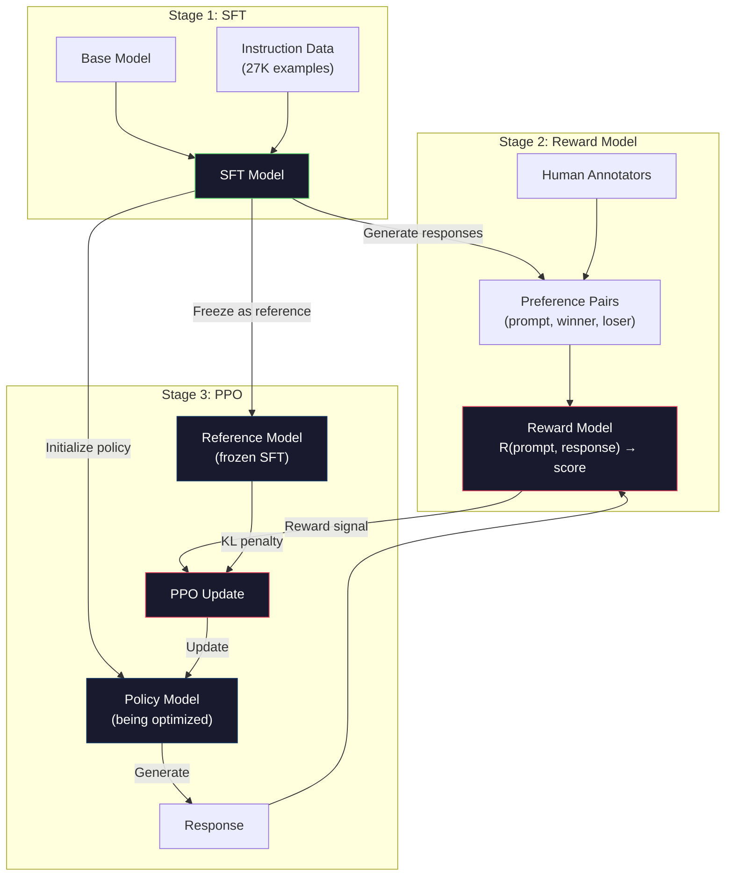
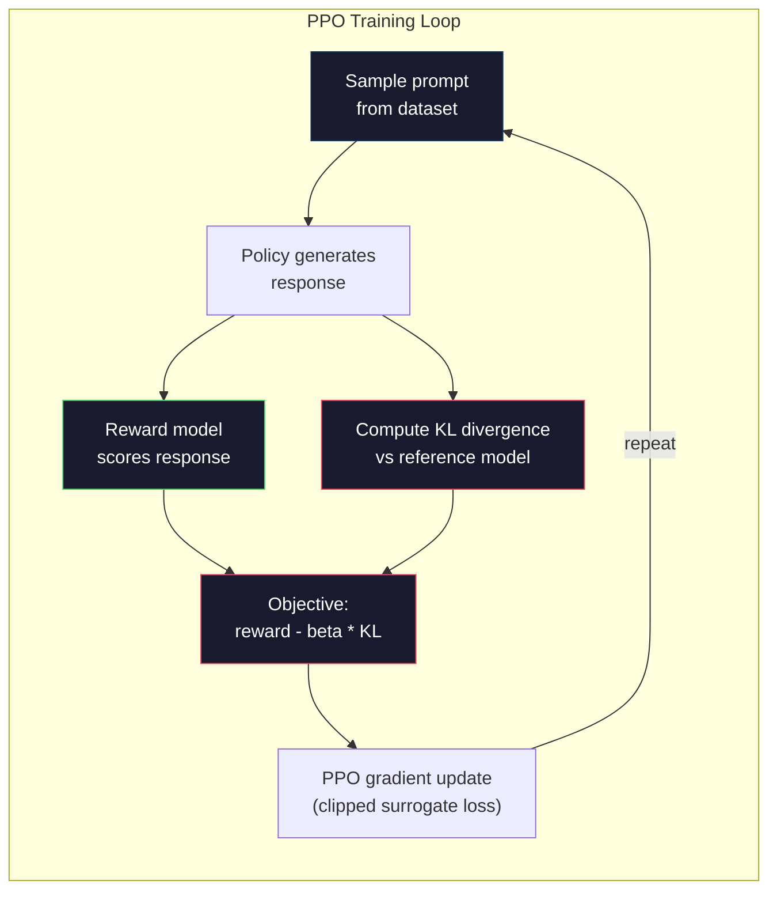

# RLHF：獎勵模型 + PPO

> SFT 教會模型遵循指令，但沒教它哪一個回應「比較好」。兩個文法正確、事實無誤的答案，在有幫助的程度上可能天差地遠。RLHF 就是你把人類判斷編碼進模型行為的辦法。Claude 之所以有幫助、GPT 之所以有禮貌，靠的就是它。

**類型：** 實作
**程式語言：** Python (with numpy)
**先修單元：** 階段 10 · 06（指令微調／SFT）
**時間：** 約 90 分鐘

## 學習目標

- 打造一個獎勵模型，從人類偏好配對（chosen 對 rejected）學會替回應品質評分
- 實作 PPO 訓練迴圈，帶著 KL 散度懲罰把語言模型策略對獎勵模型做最佳化
- 說明為什麼 RLHF 需要三個模型（SFT、獎勵、策略），以及 KL 約束如何防止獎勵駭入
- 比較偏好最佳化前後的回應品質，評估 RLHF 的效果

## 問題所在

問模型「Explain quantum computing」，它可能給出：

**回應 A：**「Quantum computing uses qubits that can exist in superposition, meaning they can be 0, 1, or both simultaneously. This allows quantum computers to process certain calculations exponentially faster than classical computers. Key algorithms include Shor's algorithm for factoring large numbers and Grover's algorithm for searching unsorted databases.」

**回應 B：**「Quantum computing is a type of computing that uses quantum mechanical phenomena. It was first proposed in the 1980s. Richard Feynman suggested that quantum systems could be simulated by quantum computers. The field has grown significantly since then. Many companies are now working on quantum computers. IBM, Google, and others have made progress. Quantum supremacy was claimed by Google in 2019.」

兩個回應事實都正確，文法都通順，也都遵循了指令。但回應 A 明顯比較好：更精簡、資訊量更高、結構更清楚。人類每次都會選 A。

SFT 抓不到這種區別。它拿「正確的」回應去訓練模型，但沒有任何機制能說「這個回應比那個好」。它把每一筆訓練範例都當成一樣好。如果 A 和 B 都出現在 SFT 資料集裡，模型會等量地從兩者學習。

RLHF 解決了這件事。它訓練一個獎勵模型去預測人類會偏好哪一個回應，再用那個獎勵訊號把語言模型推向更高品質的輸出。InstructGPT（ChatGPT 的前身）就是用 RLHF 大幅改善了 GPT-3 的有幫助程度、真實性與無害性。OpenAI 的內部評估者有 85% 的時候偏好 InstructGPT 的輸出勝過 GPT-3，儘管 InstructGPT 小了 135 倍（13 億對 1750 億參數）。

## 核心概念

### 三個階段

RLHF 不是單一次訓練，而是一條由三個依序進行的階段組成的流水線，一層疊在一層上。

**階段 1：SFT。** 在指令—回應配對上訓練一個基礎模型（單元 06）。你會得到一個會遵循指令、但不知道哪些回應比較好的模型。

**階段 2：獎勵模型。** 蒐集偏好資料：給標註者看同一個提示詞的兩個回應，問「哪個比較好？」再訓練一個模型去預測這些偏好。獎勵模型吃進（提示詞，回應），輸出一個純量分數。

**階段 3：PPO。** 用獎勵模型替語言模型製造訓練訊號。語言模型生成回應，獎勵模型替它們評分，PPO 再更新語言模型，讓它產生分數更高的回應。一項 KL 散度懲罰防止語言模型漂離 SFT 檢查點太遠。



### 獎勵模型

獎勵模型就是一個被改造成評分器的語言模型。拿 SFT 模型，把語言模型頭（輸出詞彙表上的分布）換成一個純量頭（輸出單一數字）。除了最後一層以外，架構完全相同。

輸入：提示詞接上回應。輸出：單一純量獎勵分數。

訓練資料是人類的偏好配對。對每一個提示詞，標註者看兩個回應並挑出比較好的那個。這會產生訓練三元組：(prompt, preferred_response, rejected_response)。

損失函式用的是成對偏好的 Bradley-Terry 模型：

```
loss = -log(sigmoid(reward(preferred) - reward(rejected)))
```

這就是核心方程式。`sigmoid(reward(A) - reward(B))` 給出回應 A 被偏好勝過回應 B 的機率。損失會推著獎勵模型給偏好的那個回應更高的分數。

為什麼用成對比較而不是絕對分數？因為人類非常不擅長給絕對品質分數（「這個回應是 10 分裡的 7.3 還是 7.5？」），卻非常擅長相對比較（「A 比 B 好嗎？」）。Bradley-Terry 模型把相對比較轉換成一套前後一致的絕對評分系統。

**InstructGPT 的數字：** OpenAI 從 40 位外包標註者手上蒐集了 33,000 組比較配對。每組比較大約要 5 分鐘。也就是 2,750 小時的人力，才換來獎勵模型的訓練資料。

### PPO：Proximal Policy Optimization

PPO 是一種強化學習演算法。在 RLHF 裡，「環境」是獎勵模型，「代理程式」是語言模型，「動作」是生成一個詞元。

目標函式：

```
maximize: E[R(prompt, response)] - beta * KL(policy || reference)
```

第一項推著模型去生成高獎勵的回應。第二項（KL 散度懲罰）防止模型偏離 SFT 檢查點太遠。

為什麼要 KL 散度懲罰？沒有它，模型會找到退化的解。獎勵模型是在一份有限的人類偏好資料上訓練出來的，它有盲點，而語言模型會去鑽那些盲點 —— 找出在獎勵模型上分數很高、實際上卻毫無意義的輸出。經典例子：

- 一直重複「I'm so helpful and harmless!」在有幫助／無害的獎勵模型上分數很高
- 產生囉唆、聽起來很正式但空洞的回應，剛好符合「高品質」的模式
- 鑽特定字句的漏洞，那些字句只是碰巧在訓練資料裡跟高獎勵相關

KL 散度懲罰的意思是：你可以進步，但你不能變成一個完全不同的模型。待在 SFT 版本附近，它本來就已經夠合理了。走太遠，KL 的代價就會壓過獎勵。

**InstructGPT 的數字：** PPO 訓練用 lr=1.5e-5、KL 係數 beta=0.02、256K 個回合（提示詞—回應配對），每個批次跑 4 個 PPO 回合數。整條 RLHF 流水線在一整叢 GPU 上跑了好幾天。



### 細看 PPO 的目標函式

PPO 用「裁剪代理目標」來避免更新幅度過大。新策略與舊策略機率之間的比值會被裁剪到 [1 - epsilon, 1 + epsilon] 的區間裡，epsilon 通常取 0.2。

```
ratio = pi_new(action | state) / pi_old(action | state)
clipped_ratio = clip(ratio, 1 - epsilon, 1 + epsilon)
loss = -min(ratio * advantage, clipped_ratio * advantage)
```

優勢函式估計目前這個回應比預期品質好多少。在 RLHF 裡：

```
advantage = reward(prompt, response) - baseline
```

基準線通常是近期回應的平均獎勵。正的優勢代表這個回應優於平均，負的代表比平均差。PPO 會提高高於平均的回應的機率，降低低於平均的回應的機率。

裁剪能防止災難性的更新。如果某個回應拿到異常高的獎勵，未裁剪的比值可能非常大，會讓模型劇烈地偏向那個回應。裁剪替更新設了上限，維持訓練的穩定性。

### 獎勵駭入

RLHF 的陰暗面。語言模型是在對「獎勵模型」做最佳化，而獎勵模型只是人類偏好的一個不完美代理。當語言模型越來越擅長最大化獎勵，它就會開始鑽獎勵模型的弱點。

常見的失效模式：

| Failure | What happens | Why |
|---------|-------------|-----|
| 囉唆 | 模型的回應越寫越長 | 人類標註者常偏好比較長、比較詳細的回應，於是獎勵模型給長度更高的分數 |
| 阿諛 | 模型對使用者說的每件事都表示同意 | 標註者偏好認同問題前提的回應 |
| 模稜兩可 | 模型拒絕給出明確答案 | 打太極的回應（「這是個複雜的議題，有很多不同觀點……」）很少被判定為錯 |
| 格式操弄 | 模型過度使用條列與標題 | 排版過的回應在標註者眼裡看起來比較「精緻」 |

緩解策略：加強 KL 散度懲罰（讓模型漂不到能鑽弱點的距離）、拿對抗性範例訓練獎勵模型（修補已知的失效模式），以及使用多個不同架構的獎勵模型（要同時駭掉全部就難多了）。

### 真實的 RLHF 流水線

| Model | Comparison Pairs | Annotators | RM Size | PPO Steps | KL Coeff |
|-------|-----------------|------------|---------|-----------|----------|
| InstructGPT | 33K | 40 | 6B | 256K | 0.02 |
| Llama 2 Chat | ~1M | 未公開 | 70B | 未公開 | 0.01 |
| Claude | 未公開 | 未公開 | 未公開 | 未公開 | 未公開 |
| Anthropic RLHF paper | 22K | 20 | 52B | 50K | 0.001 |

Anthropic 2022 年那篇論文用 22,000 組比較訓練了一個 52B 的獎勵模型。獎勵模型越大，訊號越可靠，PPO 訓練也越穩定。拿一個小的獎勵模型去訓練一個大的語言模型很危險 —— 獎勵模型的容量不足以捕捉「好回應」與「爛回應」之間的細微差異。

```figure
rlhf-pipeline
```

## 動手實作

### 步驟 1：合成偏好資料

在生產環境裡，偏好資料是由人類標註者產生的。我們這裡做合成配對，「preferred」的那個在客觀上就是比較好（更精簡、更準確、更有幫助）。

```python
import numpy as np

PREFERENCE_DATA = [
    {
        "prompt": "What is the capital of France?",
        "preferred": "The capital of France is Paris.",
        "rejected": "France is a country in Europe. It has many cities. The capital is Paris. Paris is known for the Eiffel Tower.",
    },
    {
        "prompt": "Explain gravity in one sentence.",
        "preferred": "Gravity is the force that attracts objects with mass toward each other.",
        "rejected": "Gravity is something that makes things fall down when you drop them.",
    },
    {
        "prompt": "What is 15 times 7?",
        "preferred": "15 times 7 is 105.",
        "rejected": "Let me think about this. 15 times 7. Well, 10 times 7 is 70, and 5 times 7 is 35, so the answer might be around 105.",
    },
    {
        "prompt": "Name three programming languages.",
        "preferred": "Python, Rust, and TypeScript.",
        "rejected": "There are many programming languages. Some popular ones include various languages like Python and others.",
    },
    {
        "prompt": "What year did World War II end?",
        "preferred": "World War II ended in 1945.",
        "rejected": "World War II was a major global conflict. It involved many countries. The war ended in the mid-1940s, specifically in 1945.",
    },
    {
        "prompt": "Define machine learning.",
        "preferred": "Machine learning is a field where algorithms learn patterns from data to make predictions without being explicitly programmed.",
        "rejected": "Machine learning is a type of AI. AI stands for artificial intelligence. Machine learning uses data to learn.",
    },
]
```

被偏好的回應精簡而直接。被拒絕的回應則展現了常見的失效模式：無謂的灌水、打太極、重複的說明，以及不精確。這正是 SFT 抓不到、但 RLHF 抓得到的那種區別。

### 步驟 2：獎勵模型架構

獎勵模型沿用迷你 GPT 的 transformer 架構，只是把詞彙表大小的輸出頭換成單一純量投影。

```python
import sys
import os
sys.path.insert(0, os.path.join(os.path.dirname(__file__), "..", "..", "04-pre-training-mini-gpt", "code"))
from main import MiniGPT, LayerNorm, Embedding, TransformerBlock


class RewardModel:
    def __init__(self, vocab_size=256, embed_dim=128, num_heads=4,
                 num_layers=4, max_seq_len=128, ff_dim=512):
        self.embedding = Embedding(vocab_size, embed_dim, max_seq_len)
        self.blocks = [
            TransformerBlock(embed_dim, num_heads, ff_dim)
            for _ in range(num_layers)
        ]
        self.ln_f = LayerNorm(embed_dim)
        self.reward_head = np.random.randn(embed_dim) * 0.02

    def forward(self, token_ids):
        seq_len = token_ids.shape[-1]
        mask = np.triu(np.full((seq_len, seq_len), -1e9), k=1)

        x = self.embedding.forward(token_ids)
        for block in self.blocks:
            x = block.forward(x, mask)
        x = self.ln_f.forward(x)

        last_hidden = x[:, -1, :]
        reward = last_hidden @ self.reward_head

        return reward
```

獎勵模型取*最後*一個詞元位置的隱藏狀態，投影成一個純量。為什麼是最後一個詞元？因為因果注意力遮罩表示最後那個位置已經注意過前面每一個詞元，它對整段（提示詞，回應）序列擁有最完整的表示。

### 步驟 3：Bradley-Terry 損失

用 Bradley-Terry 成對損失在偏好配對上訓練獎勵模型。

```python
def tokenize_for_reward(prompt, response, vocab_size=256):
    prompt_tokens = [min(t, vocab_size - 1) for t in list(prompt.encode("utf-8"))]
    response_tokens = [min(t, vocab_size - 1) for t in list(response.encode("utf-8"))]
    return prompt_tokens + [0] + response_tokens


def sigmoid(x):
    return np.where(
        x >= 0,
        1.0 / (1.0 + np.exp(-x)),
        np.exp(x) / (1.0 + np.exp(x))
    )


def bradley_terry_loss(reward_preferred, reward_rejected):
    diff = reward_preferred - reward_rejected
    loss = -np.log(sigmoid(diff) + 1e-8)
    return loss


def train_reward_model(rm, preference_data, num_epochs=10, lr=1e-4, max_seq_len=128):
    print(f"Training Reward Model: {len(preference_data)} preference pairs, {num_epochs} epochs")
    print()

    losses = []
    accuracies = []

    for epoch in range(num_epochs):
        epoch_loss = 0.0
        epoch_correct = 0
        num_pairs = 0

        indices = np.random.permutation(len(preference_data))

        for idx in indices:
            pair = preference_data[idx]

            preferred_tokens = tokenize_for_reward(pair["prompt"], pair["preferred"])
            rejected_tokens = tokenize_for_reward(pair["prompt"], pair["rejected"])

            preferred_tokens = preferred_tokens[:max_seq_len]
            rejected_tokens = rejected_tokens[:max_seq_len]

            preferred_ids = np.array(preferred_tokens).reshape(1, -1)
            rejected_ids = np.array(rejected_tokens).reshape(1, -1)

            r_preferred = rm.forward(preferred_ids)[0]
            r_rejected = rm.forward(rejected_ids)[0]

            loss = bradley_terry_loss(r_preferred, r_rejected)

            if r_preferred > r_rejected:
                epoch_correct += 1

            diff = r_preferred - r_rejected
            grad = sigmoid(diff) - 1.0

            rm.reward_head -= lr * grad * rm.ln_f.forward(
                rm.embedding.forward(preferred_ids)
            )[:, -1, :].flatten()

            epoch_loss += loss
            num_pairs += 1

        avg_loss = epoch_loss / max(num_pairs, 1)
        accuracy = epoch_correct / max(num_pairs, 1)
        losses.append(avg_loss)
        accuracies.append(accuracy)

        if epoch % 2 == 0:
            print(f"  Epoch {epoch + 1:3d} | Loss: {avg_loss:.4f} | Accuracy: {accuracy:.1%}")

    return rm, losses, accuracies
```

準確率這個指標很直白：獎勵模型把多少比例的偏好配對排對了？隨機模型是 50%。在乾淨資料上訓練良好的獎勵模型應該超過 70%。InstructGPT 的獎勵模型在保留的比較資料上達到約 72% 準確率，聽起來不高，其實已經很好 —— 很多偏好配對連人類看了都覺得模稜兩可（標註者一致性大約是 73%）。

### 步驟 4：簡化版 PPO 迴圈

完整的 PPO 很複雜。這份實作抓住核心機制：生成回應、評分、算優勢，再帶著 KL 散度懲罰更新策略。

```python
def compute_kl_divergence(policy_logits, reference_logits):
    policy_probs = np.exp(policy_logits - policy_logits.max(axis=-1, keepdims=True))
    policy_probs = policy_probs / policy_probs.sum(axis=-1, keepdims=True)
    policy_probs = np.clip(policy_probs, 1e-10, 1.0)

    ref_probs = np.exp(reference_logits - reference_logits.max(axis=-1, keepdims=True))
    ref_probs = ref_probs / ref_probs.sum(axis=-1, keepdims=True)
    ref_probs = np.clip(ref_probs, 1e-10, 1.0)

    kl = np.sum(policy_probs * np.log(policy_probs / ref_probs), axis=-1)
    return kl.mean()


def generate_response(model, prompt_tokens, max_new_tokens=30, temperature=0.8, max_seq_len=128):
    tokens = list(prompt_tokens)

    for _ in range(max_new_tokens):
        context = np.array(tokens[-max_seq_len:]).reshape(1, -1)
        logits = model.forward(context)
        next_logits = logits[0, -1, :]

        next_logits = next_logits / max(temperature, 1e-8)
        probs = np.exp(next_logits - next_logits.max())
        probs = probs / probs.sum()
        probs = np.clip(probs, 1e-10, 1.0)
        probs = probs / probs.sum()

        next_token = np.random.choice(len(probs), p=probs)
        tokens.append(int(next_token))

    return tokens


def copy_model_weights(source, target):
    target.embedding.token_embed = source.embedding.token_embed.copy()
    target.embedding.pos_embed = source.embedding.pos_embed.copy()
    target.ln_f.gamma = source.ln_f.gamma.copy()
    target.ln_f.beta = source.ln_f.beta.copy()
    for s_block, t_block in zip(source.blocks, target.blocks):
        t_block.attn.W_q = s_block.attn.W_q.copy()
        t_block.attn.W_k = s_block.attn.W_k.copy()
        t_block.attn.W_v = s_block.attn.W_v.copy()
        t_block.attn.W_out = s_block.attn.W_out.copy()
        t_block.ffn.W1 = s_block.ffn.W1.copy()
        t_block.ffn.W2 = s_block.ffn.W2.copy()
        t_block.ffn.b1 = s_block.ffn.b1.copy()
        t_block.ffn.b2 = s_block.ffn.b2.copy()
        t_block.ln1.gamma = s_block.ln1.gamma.copy()
        t_block.ln1.beta = s_block.ln1.beta.copy()
        t_block.ln2.gamma = s_block.ln2.gamma.copy()
        t_block.ln2.beta = s_block.ln2.beta.copy()


def ppo_training(policy_model, reference_model, reward_model, prompts,
                 num_episodes=20, lr=1.5e-5, kl_coeff=0.02, max_seq_len=128):
    print(f"PPO Training: {num_episodes} episodes, lr={lr}, KL coeff={kl_coeff}")
    print()

    rewards_history = []
    kl_history = []

    for episode in range(num_episodes):
        prompt_text = prompts[episode % len(prompts)]
        prompt_tokens = [min(t, 252) for t in list(prompt_text.encode("utf-8"))]

        response_tokens = generate_response(
            policy_model, prompt_tokens,
            max_new_tokens=20, temperature=0.8, max_seq_len=max_seq_len
        )

        response_ids = np.array(response_tokens[:max_seq_len]).reshape(1, -1)
        reward = reward_model.forward(response_ids)[0]

        policy_logits = policy_model.forward(response_ids)
        ref_logits = reference_model.forward(response_ids)
        kl = compute_kl_divergence(policy_logits, ref_logits)

        total_reward = reward - kl_coeff * kl

        rewards_history.append(float(reward))
        kl_history.append(float(kl))

        for block in policy_model.blocks:
            update_scale = lr * total_reward
            block.ffn.W1 += update_scale * np.random.randn(*block.ffn.W1.shape) * 0.01
            block.ffn.W2 += update_scale * np.random.randn(*block.ffn.W2.shape) * 0.01

        if episode % 5 == 0:
            avg_reward = np.mean(rewards_history[-5:]) if rewards_history else 0
            avg_kl = np.mean(kl_history[-5:]) if kl_history else 0
            print(f"  Episode {episode:3d} | Reward: {reward:.4f} | KL: {kl:.4f} | "
                  f"Avg Reward: {avg_reward:.4f}")

    return policy_model, rewards_history, kl_history
```

核心迴圈是：(1) 取一個提示詞，(2) 生成回應，(3) 用獎勵模型評分，(4) 對凍結的參考模型算 KL 散度，(5) 算出調整後的獎勵（獎勵減去 KL 散度懲罰），(6) 更新策略。策略偏離參考模型越遠，KL 散度懲罰就越大，自動防住了獎勵駭入。

### 步驟 5：獎勵分數比較

經過 RLHF 之後，策略模型的回應在獎勵模型上的分數應該高於原本 SFT 模型的回應。

```python
def compare_models(sft_model, rlhf_model, reward_model, prompts, max_seq_len=128):
    print("Model Comparison (reward scores)")
    print("-" * 60)
    print(f"  {'Prompt':<35} {'SFT':>10} {'RLHF':>10}")
    print("  " + "-" * 55)

    sft_total = 0.0
    rlhf_total = 0.0

    for prompt in prompts:
        prompt_tokens = [min(t, 252) for t in list(prompt.encode("utf-8"))]

        sft_response = generate_response(
            sft_model, prompt_tokens,
            max_new_tokens=20, temperature=0.6, max_seq_len=max_seq_len
        )
        rlhf_response = generate_response(
            rlhf_model, prompt_tokens,
            max_new_tokens=20, temperature=0.6, max_seq_len=max_seq_len
        )

        sft_ids = np.array(sft_response[:max_seq_len]).reshape(1, -1)
        rlhf_ids = np.array(rlhf_response[:max_seq_len]).reshape(1, -1)

        sft_reward = reward_model.forward(sft_ids)[0]
        rlhf_reward = reward_model.forward(rlhf_ids)[0]

        sft_total += sft_reward
        rlhf_total += rlhf_reward

        truncated_prompt = prompt[:33] + ".." if len(prompt) > 35 else prompt
        print(f"  {truncated_prompt:<35} {sft_reward:>10.4f} {rlhf_reward:>10.4f}")

    n = len(prompts)
    print("  " + "-" * 55)
    print(f"  {'Average':<35} {sft_total/n:>10.4f} {rlhf_total/n:>10.4f}")

    return sft_total / n, rlhf_total / n
```

## 框架應用

### 完整 RLHF 流水線示範

```python
if __name__ == "__main__":
    np.random.seed(42)

    print("=" * 70)
    print("RLHF PIPELINE: REWARD MODEL + PPO")
    print("=" * 70)
    print()

    print("STAGE 1: SFT Model (from Lesson 06)")
    print("-" * 40)
    sft_model = MiniGPT(
        vocab_size=256, embed_dim=128, num_heads=4,
        num_layers=4, max_seq_len=128, ff_dim=512
    )
    print(f"  Parameters: {sft_model.count_parameters():,}")
    print()

    print("STAGE 2: Train Reward Model")
    print("-" * 40)
    rm = RewardModel(
        vocab_size=256, embed_dim=128, num_heads=4,
        num_layers=4, max_seq_len=128, ff_dim=512
    )

    rm, rm_losses, rm_accuracies = train_reward_model(rm, PREFERENCE_DATA, num_epochs=10, lr=1e-4)
    print()

    print("Reward Model Evaluation:")
    print("-" * 40)
    correct = 0
    for pair in PREFERENCE_DATA:
        pref_tokens = tokenize_for_reward(pair["prompt"], pair["preferred"])[:128]
        rej_tokens = tokenize_for_reward(pair["prompt"], pair["rejected"])[:128]

        r_pref = rm.forward(np.array(pref_tokens).reshape(1, -1))[0]
        r_rej = rm.forward(np.array(rej_tokens).reshape(1, -1))[0]

        if r_pref > r_rej:
            correct += 1
        print(f"  Preferred: {r_pref:+.4f} | Rejected: {r_rej:+.4f} | {'Correct' if r_pref > r_rej else 'Wrong'}")

    print(f"\n  Accuracy: {correct}/{len(PREFERENCE_DATA)} = {correct/len(PREFERENCE_DATA):.1%}")
    print()

    print("STAGE 3: PPO Training")
    print("-" * 40)

    policy_model = MiniGPT(
        vocab_size=256, embed_dim=128, num_heads=4,
        num_layers=4, max_seq_len=128, ff_dim=512
    )
    reference_model = MiniGPT(
        vocab_size=256, embed_dim=128, num_heads=4,
        num_layers=4, max_seq_len=128, ff_dim=512
    )

    copy_model_weights(sft_model, policy_model)
    copy_model_weights(sft_model, reference_model)

    train_prompts = [pair["prompt"] for pair in PREFERENCE_DATA]

    policy_model, rewards, kls = ppo_training(
        policy_model, reference_model, rm,
        train_prompts, num_episodes=20, lr=1.5e-5, kl_coeff=0.02
    )
    print()

    print("=" * 70)
    print("COMPARISON: SFT vs RLHF")
    print("=" * 70)
    print()

    eval_prompts = [
        "What is the capital of France?",
        "Explain gravity.",
        "Name three programming languages.",
    ]

    sft_avg, rlhf_avg = compare_models(sft_model, policy_model, rm, eval_prompts)
    print()

    print("=" * 70)
    print("KL DIVERGENCE ANALYSIS")
    print("=" * 70)
    print()

    if kls:
        print(f"  Initial KL: {kls[0]:.4f}")
        print(f"  Final KL:   {kls[-1]:.4f}")
        print(f"  Max KL:     {max(kls):.4f}")
        kl_threshold = 0.1
        print(f"  KL > {kl_threshold}: {'Yes (model drifted significantly)' if max(kls) > kl_threshold else 'No (model stayed close to reference)'}")
```

## 產出交付

這個單元產出 `outputs/prompt-reward-model-designer.md` —— 一個用來設計獎勵模型訓練流水線的提示詞。給定一個目標行為（有幫助、寫程式能力、安全性），它會產出一份資料蒐集協定、標註者指引，以及獎勵模型的評估標準。

## 練習

1. 修改獎勵模型，改用所有隱藏狀態的平均而不是只取最後一個位置。比較準確率。平均池化讓每個詞元權重相同，而取最後位置的做法則仰賴因果注意力去彙整資訊。在那 6 組偏好配對上測試，回報哪種做法準確率較高。

2. 實作獎勵模型校準。訓練完之後，把所有偏好配對跑過獎勵模型，計算：(a) 被偏好回應的平均獎勵、(b) 被拒絕回應的平均獎勵、(c) 邊際（前者減後者）。校準良好的模型應該有明顯的邊際。接著再加 4 組新的偏好配對，檢查邊際在沒看過的資料上是否還撐得住。

3. 模擬獎勵駭入。做一個只會給長回應高分的獎勵模型（reward = len(response) / 100）。用這個有缺陷的獎勵模型跑 PPO，觀察策略模型產生越來越長、越來越重複的輸出。然後加上 0.1 的 KL 散度懲罰，展示它能阻止這種退化行為。

4. 實作多目標獎勵。訓練兩個獎勵模型 —— 一個評有幫助程度，一個評精簡程度。用 R = 0.7 * R_helpful + 0.3 * R_concise 把它們合起來。展示合併後的目標函式能產生既有幫助又精簡的回應，避開單一「有幫助」獎勵會落入的囉唆陷阱。

5. 比較不同的 KL 係數。分別用 beta=0.001（太低，會獎勵駭入）、beta=0.02（標準）、beta=0.5（太高，學不動）跑 PPO。替每一次畫出獎勵曲線與 KL 曲線。beta=0.02 那次應該呈現獎勵穩定上升、KL 有界。

## 關鍵術語

| 術語 | 大家怎麼說 | 實際上是什麼 |
|------|----------------|----------------------|
| RLHF | 「拿人類回饋來訓練」 | Reinforcement Learning from Human Feedback：一條三階段流水線（SFT、獎勵模型、PPO），用人類偏好訊號最佳化語言模型的輸出 |
| 獎勵模型 | 「一個替回應評分的模型」 | 一個帶純量輸出頭的 transformer，用 Bradley-Terry 損失在成對的人類偏好上訓練 |
| Bradley-Terry | 「那個比較模型」 | 一個機率模型，P(A > B) = sigmoid(score(A) - score(B))，把成對比較轉換成前後一致的評分函式 |
| PPO | 「那個 RL 演算法」 | Proximal Policy Optimization：更新策略以最大化獎勵，同時裁剪更新幅度以避免不穩定 |
| KL 散度 | 「兩個分布差多少」 | 衡量策略模型的詞元分布與參考模型之間差異的量 —— 拿來當懲罰項防止獎勵駭入 |
| KL 散度懲罰 | 「拴住模型的那條繩子」 | 從獎勵訊號中扣掉的 Beta * KL(policy \|\| reference) —— 防止策略偏離 SFT 檢查點太遠 |
| 獎勵駭入 | 「鑽獎勵的漏洞」 | 策略不去真正改善，而是鑽獎勵模型的弱點，找出退化卻高獎勵的輸出 |
| 偏好配對 | 「A 和 B 哪個比較好？」 | 一筆由（提示詞，被偏好的回應，被拒絕的回應）組成的訓練範例 —— RLHF 訓練資料的基本單位 |
| 參考模型 | 「凍結的 SFT 檢查點」 | 一份權重永不改變的 SFT 模型副本 —— 當作計算 KL 散度的錨點 |

## 延伸閱讀

- [Ouyang et al., 2022 -- "Training language models to follow instructions with human feedback" (InstructGPT)](https://arxiv.org/abs/2203.02155) —— 讓 RLHF 在大型語言模型上真正可行的那篇論文
- [Schulman et al., 2017 -- "Proximal Policy Optimization Algorithms"](https://arxiv.org/abs/1707.06347) —— OpenAI 的 PPO 原始論文
- [Bai et al., 2022 -- "Training a Helpful and Harmless Assistant with Reinforcement Learning from Human Feedback"](https://arxiv.org/abs/2204.05862) —— Anthropic 的 RLHF 論文，對獎勵駭入與 KL 散度懲罰有詳盡分析
- [Stiennon et al., 2020 -- "Learning to summarize with human feedback"](https://arxiv.org/abs/2009.01325) —— 把 RLHF 用在摘要上，展示獎勵模型能捕捉細膩的品質判斷
- [Christiano et al., 2017 -- "Deep reinforcement learning from human preferences"](https://arxiv.org/abs/1706.03741) —— 從人類比較中學習獎勵函式的奠基之作
