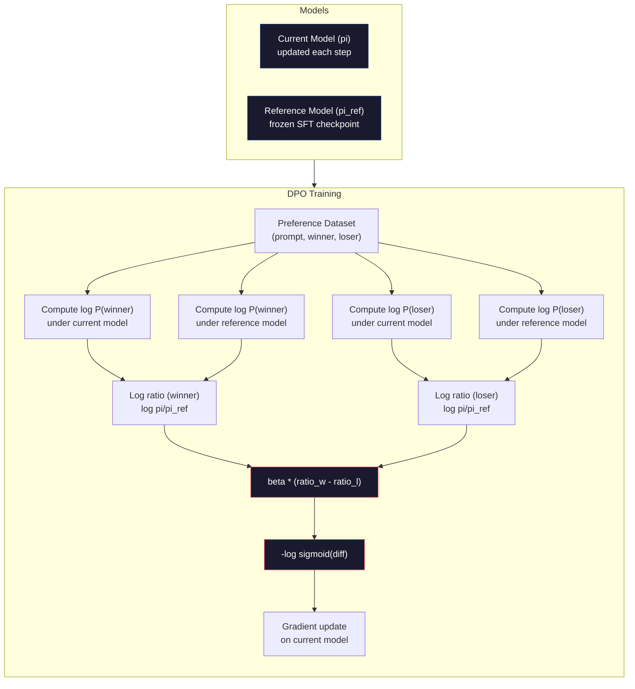

# DPO：直接偏好最佳化

> RLHF 有效。它同時也要求你訓練三個模型（SFT、獎勵模型、策略）、應付 PPO 的不穩定，還要調一個 KL 散度懲罰。DPO 問的是：如果這些全都能跳過呢？DPO 直接拿偏好對去最佳化語言模型。不用獎勵模型。不用 PPO。一個訓練迴圈。同樣的結果。

**類型：** 實作
**程式語言：** Python (with numpy)
**先修單元：** 階段 10 · 07（RLHF）
**時間：** 約 90 分鐘

## 學習目標

- 實作 DPO 訓練，直接拿偏好對最佳化語言模型，不需要另外一個獎勵模型
- 推導 DPO 損失函式，說明它如何透過策略的對數機率隱式地表示一個獎勵模型
- 從訓練穩定性、運算成本、所需模型數量三方面比較 DPO 與 RLHF
- 調整 beta 參數，控制訓練後的策略可以偏離參考模型多遠

## 問題所在

你在單元 07 打造了一條 RLHF 流水線。三個階段。三個模型。SFT 模型、獎勵模型，以及用 PPO 最佳化的策略模型。光是獎勵模型就需要好幾千組人類偏好對和一個獨立的訓練迴圈。PPO 則需要小心調整 KL 係數、學習率、裁剪比例，還有回合數。

實務上，PPO 訓練不穩定是出了名的。超參數只要動一點點，訓練就發散。獎勵模型只是人類偏好的一個不完美代理，而策略會想辦法鑽它的弱點。KL 散度懲罰有幫助，但它自己也要調 —— 太低會獎勵駭入，太高則模型幾乎學不動。

正是這種複雜度，讓 InstructGPT 發表之後好幾年間，多數開源模型都在 RLHF 上吃盡苦頭。三階段流水線很脆弱。每個階段都有自己的失效模式，錯誤還會層層累積。

2023 年 5 月，史丹佛的 Rafael Rafailov、Archit Sharma 與同事發表了〈Direct Preference Optimization: Your Language Model is Secretly a Reward Model〉。關鍵洞見是：你不需要另外一個獎勵模型。最佳的獎勵函式在數學上已經由語言模型自己的詞元機率決定了。你可以完全跳過獎勵模型，直接拿偏好對去最佳化語言模型。

DPO 把 RLHF 化簡成單一一步監督式學習。一個模型。一個損失函式。一個訓練迴圈。沒有強化學習。Zephyr-7B 是最早大規模採用 DPO 的模型之一，在數個基準測試上追平甚至擊敗了用完整 RLHF 訓練的模型。Meta 把 DPO 納入 Llama 3 對齊流水線的一環。Anthropic 也在他們的對齊研究中引用過 DPO 風格的方法。

## 核心概念

### 關鍵洞見

RLHF 最佳化的是這個目標函式：

```
maximize: E[R(x, y)] - beta * KL(pi || pi_ref)
```

其中 R 是獎勵模型，pi 是策略，pi_ref 是參考模型，beta 是 KL 係數。

DPO 論文證明了這個目標函式有一個封閉形式的最佳解。對任何獎勵函式 R，最佳策略是：

```
pi*(y | x) = pi_ref(y | x) * exp(R(x, y) / beta) / Z(x)
```

其中 Z(x) 是一個正規化常數。重新整理後：

```
R(x, y) = beta * log(pi*(y | x) / pi_ref(y | x)) + beta * log Z(x)
```

這就是突破所在。獎勵完全用策略模型的機率與參考模型的機率表示出來了。你不需要訓練另一個獎勵模型。獎勵*隱含*在機率比值裡。

把它代入 Bradley-Terry 偏好模型：

```
P(y_w > y_l | x) = sigmoid(R(x, y_w) - R(x, y_l))
                  = sigmoid(beta * (log pi(y_w|x)/pi_ref(y_w|x) - log pi(y_l|x)/pi_ref(y_l|x)))
```

Z(x) 項會抵消掉，因為兩個回應都以同一個提示詞 x 為條件。剩下的東西只跟策略模型與參考模型在被偏好回應和被拒絕回應上的對數機率有關。

### DPO 損失

```
L_DPO = -log(sigmoid(beta * (log pi(y_w|x)/pi_ref(y_w|x) - log pi(y_l|x)/pi_ref(y_l|x))))
```

我們把每一塊拆開來看：

- **y_w** = 被偏好（勝出）的回應
- **y_l** = 被拒絕（落敗）的回應
- **x** = 提示詞
- **pi** = 目前的模型（正在被訓練）
- **pi_ref** = 參考模型（凍結的 SFT 檢查點）
- **beta** = 控制偏離參考模型程度的溫度參數（通常是 0.1 到 0.5）

比值 `log pi(y|x) / pi_ref(y|x)` 就是對數機率比。當這個比值為正，代表目前的模型給回應 y 的機率比參考模型高；為負則代表目前的模型給的機率比較低。

DPO 損失會推著模型提高被偏好回應的對數機率比，並降低被拒絕回應的對數機率比。beta 參數控制模型可以多積極地偏離參考模型 —— beta 小代表允許大幅偏離，beta 大則把模型拴在參考模型附近。



### 為什麼 DPO 比較簡單

| Aspect | RLHF (PPO) | DPO |
|--------|-----------|-----|
| 要訓練的模型 | 3 個（SFT + 獎勵 + 策略） | 1 個（只有策略） |
| 訓練迴圈 | 3 個（SFT、獎勵模型訓練、PPO） | 2 個（SFT、DPO） |
| 超參數 | lr、KL 係數、裁剪比例、獎勵模型 lr、三份回合數 | lr、beta、回合數 |
| 獎勵模型 | 必要（要獨立訓練） | 隱含在模型機率裡 |
| RL 演算法 | PPO（複雜、不穩定） | 監督式學習（穩定） |
| GPU 記憶體 | PPO 期間記憶體裡有 3-4 個模型 | 2 個模型（目前的 + 參考的） |
| 訓練穩定性 | 對超參數敏感 | 穩健，和 SFT 差不多 |

DPO 訓練期間記憶體裡只需要兩個模型 —— 目前的模型與凍結的參考模型。RLHF 需要三或四個：策略、參考模型、獎勵模型，可能還有一個價值函式基準線。以 70B 模型來說，每一份副本在 FP16 下要 140GB。省掉獎勵模型帶來的記憶體節省相當可觀。

### DPO 什麼時候贏過 RLHF

**資料集小的時候。** 在 5,000 到 20,000 組偏好對的量級，DPO 常常追平甚至超越 RLHF。RLHF 裡的獎勵模型需要足夠的資料才能一般化 —— 資料有限時它會過度擬合，產生不可靠的獎勵訊號。DPO 根本不需要獎勵模型，直接繞過了這個問題。

**運算資源有限的時候。** DPO 大約只要完整 RLHF 三分之一的運算量（一個訓練迴圈而不是三個）。對沒有大型 GPU 叢集的團隊來說，這是務實的選擇。

**需要快速迭代的時候。** 想試 10 份不同的偏好資料集、看哪一份訓出最好的模型？DPO 讓你每次實驗都在幾小時內跑完。RLHF 則得為每一份資料集重新訓練獎勵模型。

### RLHF 什麼時候贏過 DPO

**大規模訓練。** 到了 GPT-4 或 Claude 的規模，RLHF 那個獨立的獎勵模型能捕捉更細膩的偏好訊號。獎勵模型的角色是一個學來的損失函式，會隨著複雜的品質標準調整。

**複雜的獎勵訊號。** 當「比較好」牽涉到多個面向（有幫助、無害、誠實）時，獎勵模型可以學會這種多目標的取捨。DPO 把每一組偏好對都當成二元訊號 —— 一個比較好、一個比較差 —— 而不去建模「為什麼」。

**迭代式對齊。** RLHF 流水線可以用目前的策略生成新回應、讓人類評分、再在一個線上迴圈裡重訓獎勵模型。DPO 則是在一份固定的偏好對資料集上運作。Constitutional AI（Anthropic 的做法）大量運用了 RLHF 的這種迭代特性。

### DPO 之後：KTO、ORPO、SimPO

DPO 催生了一整族簡化版的對齊方法。

**KTO（Kahneman-Tversky Optimization，2024）：** 連配對都不需要。KTO 用的是未配對的回饋 —— 只要把每個回應標成「好」或「壞」，不必跟另一個回應比較。這大幅簡化了資料蒐集。與其給標註者看兩個回應問「哪個比較好？」，你只給一個回應問「這個好嗎？」它的損失函式套用了展望理論中的損失趨避：對壞回應的懲罰大於對好回應的獎勵。

**ORPO（Odds Ratio Preference Optimization，2024）：** 把 SFT 與對齊合併成單一一步訓練。ORPO 不先做 SFT 再做 DPO，而是改造 SFT 損失，讓它內含偏好訊號。損失有兩項：對被偏好回應的標準下一詞元預測損失，加上一個勝算比項，用來拉大被偏好與被拒絕回應機率之間的差距。一個訓練迴圈取代兩個。

**SimPO（Simple Preference Optimization，2024）：** 徹底拿掉參考模型。SimPO 不去對凍結的參考模型算對數機率比，而是直接用回應的平均對數機率（依長度正規化）當作隱式獎勵。這省下記憶體（不需要參考模型）也簡化了訓練。長度正規化則防止模型偏袒比較短的回應。

| Method | Year | Models in Memory | Needs Pairs? | Needs Reference? | Training Loops |
|--------|------|-----------------|-------------|-----------------|----------------|
| RLHF | 2022 | 3-4 | 是（獎勵模型需要） | 是 | 3 |
| DPO | 2023 | 2 | 是 | 是 | 2 |
| KTO | 2024 | 2 | 否（未配對） | 是 | 2 |
| ORPO | 2024 | 1 | 是 | 否 | 1 |
| SimPO | 2024 | 1 | 是 | 否 | 1 |

趨勢很清楚：每一種方法都再拿掉一塊複雜度。RLHF 需要獎勵模型和 PPO。DPO 把兩者都消掉。KTO 消掉了配對資料。ORPO 消掉了獨立的 SFT 階段。SimPO 消掉了參考模型。所謂的對齊稅 —— 從基礎模型走到對齊模型所付出的運算與複雜度成本 —— 一路在下降。

### 真實的 DPO 部署

**Zephyr-7B（HuggingFace，2023 年 10 月）：** 以 Mistral 7B 為基礎模型，先在 UltraChat（20 萬筆範例）上做 SFT，再在 UltraFeedback（6 萬組偏好對）上做 DPO。MT-Bench 拿到 6.47 分 —— 當時最高分的 7B 模型。作為對照，Llama 2 Chat 70B 是 6.86 分，也就是說 Zephyr 只靠 DPO 對齊，就逼近一個大它 10 倍的模型到 6% 以內。

**Llama 3（Meta，2024 年 4 月）：** 在最初的 RLHF 階段之後接上 DPO。這個組合暗示 DPO 與 RLHF 可以互補 —— RLHF 負責廣泛的對齊，DPO 負責針對性的精修。

**Neural Magic / nm-chat（2024）：** 把 DPO 套用在多個開源模型上，在對齊基準測試上相對於只做 SFT 的基準線，一致展現出 5-15% 的提升。

```figure
dpo-loss
```

## 動手實作

### 步驟 1：偏好資料集

格式與 RLHF 相同 ——（prompt, preferred, rejected）三元組。DPO 直接吃這份資料，中間不經過獎勵模型。

```python
import numpy as np
import sys
import os
sys.path.insert(0, os.path.join(os.path.dirname(__file__), "..", "..", "04-pre-training-mini-gpt", "code"))
from main import MiniGPT, LayerNorm, Embedding, TransformerBlock

PREFERENCE_DATA = [
    {
        "prompt": "What is the capital of France?",
        "preferred": "The capital of France is Paris.",
        "rejected": "France is a country in Europe. It has many cities. The capital is Paris. Paris is known for the Eiffel Tower.",
    },
    {
        "prompt": "Explain gravity in one sentence.",
        "preferred": "Gravity is the force that attracts objects with mass toward each other.",
        "rejected": "Gravity is something that makes things fall down when you drop them.",
    },
    {
        "prompt": "What is 15 times 7?",
        "preferred": "15 times 7 is 105.",
        "rejected": "Let me think about this. 15 times 7. Well, 10 times 7 is 70, and 5 times 7 is 35, so the answer might be around 105.",
    },
    {
        "prompt": "Name three programming languages.",
        "preferred": "Python, Rust, and TypeScript.",
        "rejected": "There are many programming languages. Some popular ones include various languages like Python and others.",
    },
    {
        "prompt": "What year did World War II end?",
        "preferred": "World War II ended in 1945.",
        "rejected": "World War II was a major global conflict. It involved many countries. The war ended in the mid-1940s, specifically in 1945.",
    },
    {
        "prompt": "Define machine learning.",
        "preferred": "Machine learning is a field where algorithms learn patterns from data to make predictions without being explicitly programmed.",
        "rejected": "Machine learning is a type of AI. AI stands for artificial intelligence. Machine learning uses data to learn.",
    },
]
```

### 步驟 2：序列對數機率

DPO 損失需要計算「給定提示詞之下，某個回應的總對數機率」。也就是把整段（提示詞 + 回應）序列餵給模型，再把每個回應詞元的對數機率加總起來。

```python
def tokenize_sequence(text, vocab_size=256):
    return [min(t, vocab_size - 1) for t in list(text.encode("utf-8"))]


def compute_sequence_log_prob(model, prompt_tokens, response_tokens, max_seq_len=128):
    full_sequence = prompt_tokens + response_tokens
    if len(full_sequence) > max_seq_len:
        full_sequence = full_sequence[:max_seq_len]

    if len(full_sequence) < 2:
        return 0.0

    input_ids = np.array(full_sequence[:-1]).reshape(1, -1)
    target_ids = np.array(full_sequence[1:])

    logits = model.forward(input_ids)
    logits = logits[0]

    max_logits = logits.max(axis=-1, keepdims=True)
    log_probs = logits - max_logits - np.log(
        np.exp(logits - max_logits).sum(axis=-1, keepdims=True)
    )

    prompt_len = len(prompt_tokens)
    response_start = max(0, prompt_len - 1)
    response_end = len(target_ids)

    if response_start >= response_end:
        return 0.0

    response_log_probs = log_probs[response_start:response_end, :]
    response_targets = target_ids[response_start:response_end]

    total_log_prob = 0.0
    for i, target in enumerate(response_targets):
        total_log_prob += response_log_probs[i, target]

    return total_log_prob
```

這個函式是 DPO 的主力。每一組偏好對要跑它四次：模型算被偏好回應、模型算被拒絕回應、參考模型算被偏好回應、參考模型算被拒絕回應。也就是每筆訓練範例 4 次前向傳播，對比 RLHF 的「生成 + 獎勵評分 + 價值估計 + PPO 更新」。更簡單、更快、更穩定。

### 步驟 3：DPO 損失

論文的核心化成程式碼。一個函式。一個損失。沒有獎勵模型。

```python
def sigmoid(x):
    return np.where(
        x >= 0,
        1.0 / (1.0 + np.exp(-x)),
        np.exp(x) / (1.0 + np.exp(x))
    )


def dpo_loss(policy_logprob_preferred, policy_logprob_rejected,
             ref_logprob_preferred, ref_logprob_rejected, beta=0.1):
    preferred_ratio = policy_logprob_preferred - ref_logprob_preferred
    rejected_ratio = policy_logprob_rejected - ref_logprob_rejected

    logit = beta * (preferred_ratio - rejected_ratio)

    loss = -np.log(sigmoid(logit) + 1e-8)

    preferred_reward = beta * preferred_ratio
    rejected_reward = beta * rejected_ratio

    return loss, {
        "preferred_ratio": float(preferred_ratio),
        "rejected_ratio": float(rejected_ratio),
        "logit": float(logit),
        "implicit_preferred_reward": float(preferred_reward),
        "implicit_rejected_reward": float(rejected_reward),
        "reward_margin": float(preferred_reward - rejected_reward),
    }
```

`preferred_ratio` 與 `rejected_ratio` 就是 DPO 推導裡的那兩個對數機率比。當目前的模型（相對於參考模型）給被偏好回應更高的機率、給被拒絕回應更低的機率時，logit 為正，損失就低。訓練訊號正是朝這個方向推動模型。

`implicit_preferred_reward` 與 `implicit_rejected_reward` 是 DPO 損失隱式指派的獎勵。你可以把它們抽出來確認訓練是否有效 —— 被偏好與被拒絕獎勵之間的邊際，應該隨著訓練逐漸擴大。

### 步驟 4：DPO 訓練迴圈

一個標準的監督式訓練迴圈。沒有 PPO。沒有獎勵模型。就只有前向傳播和梯度更新。

```python
def copy_model_weights(source, target):
    target.embedding.token_embed = source.embedding.token_embed.copy()
    target.embedding.pos_embed = source.embedding.pos_embed.copy()
    target.ln_f.gamma = source.ln_f.gamma.copy()
    target.ln_f.beta = source.ln_f.beta.copy()
    for s_block, t_block in zip(source.blocks, target.blocks):
        t_block.attn.W_q = s_block.attn.W_q.copy()
        t_block.attn.W_k = s_block.attn.W_k.copy()
        t_block.attn.W_v = s_block.attn.W_v.copy()
        t_block.attn.W_out = s_block.attn.W_out.copy()
        t_block.ffn.W1 = s_block.ffn.W1.copy()
        t_block.ffn.W2 = s_block.ffn.W2.copy()
        t_block.ffn.b1 = s_block.ffn.b1.copy()
        t_block.ffn.b2 = s_block.ffn.b2.copy()
        t_block.ln1.gamma = s_block.ln1.gamma.copy()
        t_block.ln1.beta = s_block.ln1.beta.copy()
        t_block.ln2.gamma = s_block.ln2.gamma.copy()
        t_block.ln2.beta = s_block.ln2.beta.copy()


def dpo_train(policy_model, reference_model, preference_data,
              num_epochs=5, lr=5e-6, beta=0.1, max_seq_len=128):
    print(f"DPO Training: {len(preference_data)} pairs, {num_epochs} epochs, "
          f"lr={lr}, beta={beta}")
    print()

    losses = []
    margins = []

    for epoch in range(num_epochs):
        epoch_loss = 0.0
        epoch_margin = 0.0
        num_examples = 0

        indices = np.random.permutation(len(preference_data))

        for idx in indices:
            pair = preference_data[idx]

            prompt_tokens = tokenize_sequence(pair["prompt"])
            preferred_tokens = tokenize_sequence(pair["preferred"])
            rejected_tokens = tokenize_sequence(pair["rejected"])

            pi_logprob_w = compute_sequence_log_prob(
                policy_model, prompt_tokens, preferred_tokens, max_seq_len
            )
            pi_logprob_l = compute_sequence_log_prob(
                policy_model, prompt_tokens, rejected_tokens, max_seq_len
            )
            ref_logprob_w = compute_sequence_log_prob(
                reference_model, prompt_tokens, preferred_tokens, max_seq_len
            )
            ref_logprob_l = compute_sequence_log_prob(
                reference_model, prompt_tokens, rejected_tokens, max_seq_len
            )

            loss, metrics = dpo_loss(
                pi_logprob_w, pi_logprob_l,
                ref_logprob_w, ref_logprob_l, beta
            )

            update_direction = 1.0 if metrics["logit"] < 0 else -0.1
            for block in policy_model.blocks:
                block.ffn.W1 += lr * update_direction * np.random.randn(*block.ffn.W1.shape) * 0.01
                block.ffn.W2 += lr * update_direction * np.random.randn(*block.ffn.W2.shape) * 0.01

            epoch_loss += loss
            epoch_margin += metrics["reward_margin"]
            num_examples += 1
            losses.append(float(loss))
            margins.append(metrics["reward_margin"])

        avg_loss = epoch_loss / max(num_examples, 1)
        avg_margin = epoch_margin / max(num_examples, 1)

        print(f"  Epoch {epoch + 1}/{num_epochs} | Loss: {avg_loss:.4f} | "
              f"Avg Margin: {avg_margin:.4f}")

    return policy_model, losses, margins
```

跟 RLHF 相比，這個訓練迴圈簡單得令人舒暢。對每一組偏好對：算四個對數機率（兩個模型、兩個回應），代進 DPO 損失，算梯度，更新策略。沒有生成步驟。沒有獎勵模型推論。沒有優勢估計。沒有裁剪。

### 步驟 5：比較 DPO 與 RLHF

量測隱式獎勵邊際與對數機率的位移，拿來跟單元 07 的 RLHF 模型比較。

```python
def evaluate_preference_accuracy(model, reference_model, preference_data, beta=0.1, max_seq_len=128):
    correct = 0
    total = 0

    for pair in preference_data:
        prompt_tokens = tokenize_sequence(pair["prompt"])
        preferred_tokens = tokenize_sequence(pair["preferred"])
        rejected_tokens = tokenize_sequence(pair["rejected"])

        pi_w = compute_sequence_log_prob(model, prompt_tokens, preferred_tokens, max_seq_len)
        pi_l = compute_sequence_log_prob(model, prompt_tokens, rejected_tokens, max_seq_len)
        ref_w = compute_sequence_log_prob(reference_model, prompt_tokens, preferred_tokens, max_seq_len)
        ref_l = compute_sequence_log_prob(reference_model, prompt_tokens, rejected_tokens, max_seq_len)

        preferred_reward = beta * (pi_w - ref_w)
        rejected_reward = beta * (pi_l - ref_l)

        if preferred_reward > rejected_reward:
            correct += 1
        total += 1

    return correct / max(total, 1)


def analyze_implicit_rewards(model, reference_model, preference_data, beta=0.1, max_seq_len=128):
    print("Implicit Reward Analysis:")
    print("-" * 65)
    print(f"  {'Prompt':<30} {'Pref Reward':>12} {'Rej Reward':>12} {'Margin':>10}")
    print("  " + "-" * 60)

    for pair in preference_data:
        prompt_tokens = tokenize_sequence(pair["prompt"])
        preferred_tokens = tokenize_sequence(pair["preferred"])
        rejected_tokens = tokenize_sequence(pair["rejected"])

        pi_w = compute_sequence_log_prob(model, prompt_tokens, preferred_tokens, max_seq_len)
        pi_l = compute_sequence_log_prob(model, prompt_tokens, rejected_tokens, max_seq_len)
        ref_w = compute_sequence_log_prob(reference_model, prompt_tokens, preferred_tokens, max_seq_len)
        ref_l = compute_sequence_log_prob(reference_model, prompt_tokens, rejected_tokens, max_seq_len)

        pref_reward = beta * (pi_w - ref_w)
        rej_reward = beta * (pi_l - ref_l)
        margin = pref_reward - rej_reward

        truncated = pair["prompt"][:28] + ".." if len(pair["prompt"]) > 30 else pair["prompt"]
        print(f"  {truncated:<30} {pref_reward:>12.4f} {rej_reward:>12.4f} {margin:>10.4f}")

    print()
```

### 步驟 6：Beta 敏感度分析

beta 參數是 DPO 裡對應 RLHF 中 KL 係數的角色。它控制模型可以偏離參考模型多少。這個實驗展示它的效果。

```python
def beta_sensitivity_analysis(sft_model, preference_data, betas, max_seq_len=128):
    print("Beta Sensitivity Analysis")
    print("-" * 60)
    print(f"  {'Beta':>8} {'Final Loss':>12} {'Final Margin':>14} {'Accuracy':>10}")
    print("  " + "-" * 55)

    results = []

    for beta in betas:
        policy = MiniGPT(
            vocab_size=256, embed_dim=128, num_heads=4,
            num_layers=4, max_seq_len=max_seq_len, ff_dim=512
        )
        reference = MiniGPT(
            vocab_size=256, embed_dim=128, num_heads=4,
            num_layers=4, max_seq_len=max_seq_len, ff_dim=512
        )
        copy_model_weights(sft_model, policy)
        copy_model_weights(sft_model, reference)

        policy, losses, margins_list = dpo_train(
            policy, reference, preference_data,
            num_epochs=3, lr=5e-6, beta=beta, max_seq_len=max_seq_len
        )

        accuracy = evaluate_preference_accuracy(
            policy, reference, preference_data, beta, max_seq_len
        )

        final_loss = losses[-1] if losses else 0
        final_margin = margins_list[-1] if margins_list else 0

        print(f"  {beta:>8.3f} {final_loss:>12.4f} {final_margin:>14.4f} {accuracy:>10.1%}")
        results.append({
            "beta": beta,
            "final_loss": final_loss,
            "final_margin": final_margin,
            "accuracy": accuracy,
        })

        print()

    return results
```

beta 小（0.01）讓模型可以自由偏離參考模型 —— 學得快，但有落入退化解的風險。beta 大（1.0）把模型拴在參考模型附近 —— 穩定，但學得慢。多數應用的甜蜜點落在 0.1 到 0.3。

## 框架應用

### 完整 DPO 流水線示範

```python
if __name__ == "__main__":
    np.random.seed(42)

    print("=" * 70)
    print("DPO: DIRECT PREFERENCE OPTIMIZATION")
    print("=" * 70)
    print()

    print("STEP 1: Initialize SFT Model (from Lesson 06)")
    print("-" * 50)
    sft_model = MiniGPT(
        vocab_size=256, embed_dim=128, num_heads=4,
        num_layers=4, max_seq_len=128, ff_dim=512
    )
    print(f"  Parameters: {sft_model.count_parameters():,}")
    print()

    print("STEP 2: DPO Training")
    print("-" * 50)

    policy_model = MiniGPT(
        vocab_size=256, embed_dim=128, num_heads=4,
        num_layers=4, max_seq_len=128, ff_dim=512
    )
    reference_model = MiniGPT(
        vocab_size=256, embed_dim=128, num_heads=4,
        num_layers=4, max_seq_len=128, ff_dim=512
    )
    copy_model_weights(sft_model, policy_model)
    copy_model_weights(sft_model, reference_model)

    policy_model, losses, margins = dpo_train(
        policy_model, reference_model, PREFERENCE_DATA,
        num_epochs=5, lr=5e-6, beta=0.1
    )
    print()

    print("=" * 70)
    print("STEP 3: Evaluate")
    print("=" * 70)
    print()

    pre_accuracy = evaluate_preference_accuracy(
        sft_model, reference_model, PREFERENCE_DATA, beta=0.1
    )
    post_accuracy = evaluate_preference_accuracy(
        policy_model, reference_model, PREFERENCE_DATA, beta=0.1
    )

    print(f"  Preference accuracy (pre-DPO):  {pre_accuracy:.1%}")
    print(f"  Preference accuracy (post-DPO): {post_accuracy:.1%}")
    print()

    analyze_implicit_rewards(policy_model, reference_model, PREFERENCE_DATA, beta=0.1)

    print("=" * 70)
    print("STEP 4: Training Dynamics")
    print("=" * 70)
    print()

    if losses:
        print("  Loss curve:")
        window = max(1, len(losses) // 5)
        for i in range(0, len(losses), window):
            chunk = losses[i:i + window]
            avg = sum(chunk) / len(chunk)
            print(f"    Steps {i:3d}-{i + len(chunk) - 1:3d}: loss = {avg:.4f}")
        print()

    if margins:
        print("  Reward margin curve:")
        window = max(1, len(margins) // 5)
        for i in range(0, len(margins), window):
            chunk = margins[i:i + window]
            avg = sum(chunk) / len(chunk)
            print(f"    Steps {i:3d}-{i + len(chunk) - 1:3d}: margin = {avg:.4f}")
        print()

    print("=" * 70)
    print("STEP 5: Beta Sensitivity")
    print("=" * 70)
    print()

    beta_results = beta_sensitivity_analysis(
        sft_model, PREFERENCE_DATA, betas=[0.01, 0.1, 0.3, 1.0]
    )

    print("=" * 70)
    print("DPO vs RLHF COMPARISON")
    print("=" * 70)
    print()
    print("  DPO advantages:")
    print("    - 1 training loop (vs 3 for RLHF)")
    print("    - 2 models in memory (vs 3-4 for RLHF)")
    print("    - Supervised learning (vs RL, more stable)")
    print("    - No reward model to train or maintain")
    print()
    print("  RLHF advantages:")
    print("    - Separate reward model captures complex preferences")
    print("    - Online learning: generate, rate, retrain")
    print("    - Better for multi-objective alignment")
    print("    - Proven at largest scales (GPT-4, Claude)")
    print()
    print("  Practical guidance:")
    print("    - Start with DPO. It's simpler and often sufficient.")
    print("    - Switch to RLHF if DPO plateaus on your eval metrics.")
    print("    - Many production systems use both: RLHF first, DPO to refine.")
```

## 產出交付

這個單元產出 `outputs/prompt-alignment-method-selector.md` —— 一個幫你替使用情境挑選對齊方法（SFT、RLHF、DPO、KTO、ORPO、SimPO）的提示詞。給定你的資料可得性、運算預算與對齊目標，它會推薦一種方法與一份訓練計畫。

## 練習

1. 實作 KTO（Kahneman-Tversky Optimization）。KTO 不需要配對 —— 只要把每個回應標成「好」或「壞」。好回應的損失是 `-log(sigmoid(beta * log_ratio))`，壞回應的損失是 `-log(1 - sigmoid(beta * log_ratio))`，並對壞回應的損失乘上一個損失趨避倍數（通常是 1.5 倍）。在同一份資料上訓練（把 preferred 當成「好」、rejected 當成「壞」，各自獨立看待），再拿準確率跟 DPO 比較。

2. 實作長度正規化的 DPO。不要用原始的對數機率，而是除以回應詞元數：`normalized_logprob = total_logprob / num_tokens`。這能防止模型偏袒比較短的回應（短回應的總對數機率比較高）。比較有做和沒做正規化時的隱式獎勵邊際。

3. 打造一個 ORPO 風格的合併損失。在 DPO 損失上加一項對被偏好回應的標準下一詞元預測損失：`L = L_sft(preferred) + alpha * L_dpo`。試 alpha 取 0.1、0.5、1.0。合併後的損失應該訓出一個既會遵循指令（來自 SFT 項）、又偏好較佳回應（來自 DPO 項）的模型，從而免去獨立的 SFT 階段。

4. 實作迭代式 DPO。先跑 3 個回合的 DPO，接著用訓練後的模型生成新回應，把它們與原本的被偏好回應配成新的偏好對，再跑一次 DPO。這樣的「自我對弈」流程跑兩輪。比較第一輪與第二輪之後的偏好準確率，看看迭代精修有沒有幫助。

5. 比較不同參考模型下的 DPO。不要用 SFT 檢查點當參考模型，改試：(a) 基礎模型（SFT 之前）、(b) DPO 第 1 個回合的檢查點、(c) 策略模型的指數移動平均。回報哪一種參考模型帶來最高的偏好準確率與最穩定的訓練曲線。

## 關鍵術語

| 術語 | 大家怎麼說 | 實際上是什麼 |
|------|----------------|----------------------|
| DPO | 「不用 RL 的 RLHF」 | Direct Preference Optimization（直接偏好最佳化）：一種監督式學習演算法，直接拿偏好對最佳化語言模型，繞過獎勵模型與 PPO |
| 隱式獎勵 | 「獎勵就在模型裡」 | 獎勵函式由策略模型與參考模型之間的對數機率比決定 —— 不需要另外一個獎勵模型 |
| Beta（DPO） | 「那個溫度」 | 控制策略可以偏離參考模型多遠 —— beta 小允許大幅偏離，beta 大則把模型拴在附近 |
| 對數機率比 | 「模型變了多少」 | log pi(y\|x) - log pi_ref(y\|x) —— 為正代表目前的模型給的機率高於參考模型 |
| 參考模型 | 「凍結的檢查點」 | 一份權重永不改變的 SFT 模型副本 —— 當作計算機率比的錨點 |
| KTO | 「不用配對的 DPO」 | Kahneman-Tversky Optimization：用未配對的「好」或「壞」標籤運作，不必要求偏好對 |
| ORPO | 「一步到位的對齊」 | Odds Ratio Preference Optimization：在 SFT 損失上加一個偏好項，把 SFT 與對齊合併成單一訓練迴圈 |
| SimPO | 「不需要參考模型」 | Simple Preference Optimization：用依長度正規化的平均對數機率當隱式獎勵，藉此拿掉參考模型 |
| 對齊稅 | 「讓模型變安全的代價」 | 從基礎模型走到對齊模型所額外付出的運算、資料與複雜度 —— DPO 大幅降低了它 |

## 延伸閱讀

- [Rafailov et al., 2023 -- "Direct Preference Optimization: Your Language Model is Secretly a Reward Model"](https://arxiv.org/abs/2305.18290) —— 把對齊從 RLHF 化簡成監督式學習的那篇 DPO 論文
- [Tunstall et al., 2023 -- "Zephyr: Direct Distillation of LM Alignment"](https://arxiv.org/abs/2310.16944) —— Zephyr-7B，展示在 UltraFeedback 上做 DPO 就能在基準測試上追平 RLHF
- [Ethayarajh et al., 2024 -- "KTO: Model Alignment as Prospect Theoretic Optimization"](https://arxiv.org/abs/2402.01306) —— 免去對配對偏好的需求
- [Hong et al., 2024 -- "ORPO: Monolithic Preference Optimization without Reference Model"](https://arxiv.org/abs/2403.07691) —— 把 SFT 與對齊合併成一步
- [Meng et al., 2024 -- "SimPO: Simple Preference Optimization with a Reference-Free Reward"](https://arxiv.org/abs/2405.14734) —— 徹底拿掉參考模型
- [Llama 3 Technical Report](https://arxiv.org/abs/2407.21783) —— Meta 結合 RLHF 與 DPO 的對齊流水線
