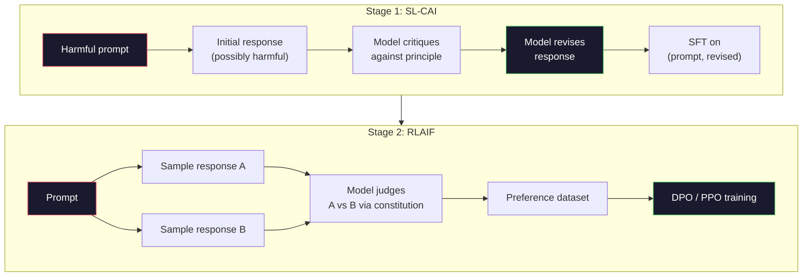
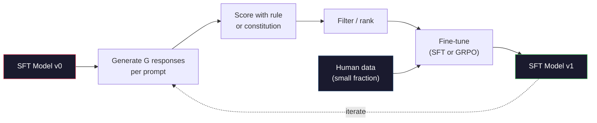

# 憲法式 AI 與自我改進

> RLHF 需要人在迴圈裡。憲法式 AI 則把其中大部分的人換成模型自己。寫一份原則清單，讓模型拿這些原則批評自己的輸出，再拿這些批評去訓練。DeepSeek-R1 在 2025 年把這件事再推一步：讓模型生成數百萬條推理軌跡，用一條規則替它們打分，再對結果跑 GRPO。2026 年的前沿模型裡，多數「對齊工作」其實是模型在對齊自己。這個單元把兩條迴圈都做出來。

**類型：** 實作
**程式語言：** Python (stdlib + numpy)
**先修單元：** 階段 10 · 06-08（SFT、RLHF、DPO）
**時間：** 約 45 分鐘

## 學習目標

- 實作憲法式 AI 的兩階段迴圈：自我批評加上自我修訂，再拿修訂後的配對做偏好訓練
- 推導 GRPO 目標函式（DeepSeek-R1 的群組相對策略最佳化），並與 PPO 的價值函式基準線對照
- 用規則式的結果獎勵生成可驗證的推理軌跡，不靠獨立的獎勵模型就替它們評分
- 判斷什麼時候自我改進勝過人類偏好資料，什麼時候它會塌縮成模式尋求

## 問題所在

你在單元 07 打造了 RLHF，在單元 08 打造了 DPO。兩者都仰賴同一種昂貴的輸入：人類偏好對。Anthropic 在 InstructGPT 那個年代的流水線用了大約 33,000 組比較。Llama 2 Chat 用了超過 150 萬組。Claude 3 用得更多。這種資料慢、貴，而且會偏向標註者在評分那天剛好相信的東西。

2022 年的憲法式 AI 論文問了一個簡單的問題。如果偏好標籤由模型自己產生呢？給它一份寫下來的原則清單 —— 也就是「憲法」—— 讓它批評自己的回應。這些批評就成了訓練訊號。

2024 年，DeepSeek 把這個想法推得更遠。他們證明了：只要任務有可驗證的結果（有標準答案的數學、要嘛通過測試要嘛失敗的程式碼、要嘛贏要嘛輸的遊戲），你可以連批評者都完全省掉。生成大量候選解。用一條確定性的規則替每個解打分。對這些獎勵跑一個策略梯度演算法。DeepSeek-R1 就是這樣訓練出來的，幾乎沒有用到人類偏好資料，卻追平了 o1 等級的推理表現。

這兩條迴圈 —— 處理主觀行為的憲法式 AI，以及處理可驗證行為的規則式 RL —— 是 2026 年的主流對齊配方。過去投進 RLHF 的人類偏好預算，現在買的是一個小得多的步驟：挑憲法，以及挑獎勵規則。

## 核心概念

### 憲法式 AI 迴圈

Bai et al.（2022）把流水線拆成兩個階段。

**階段 1：從 AI 回饋做監督式學習（SL-CAI）。** 從一個有幫助但可能有害的 SFT 模型開始。拿可能造成傷害的請求去提示它。對每一個回應，請*同一個模型*拿一條憲法原則去批評自己的回應，然後修訂。再拿修訂後的回應做微調。資料集是（prompt, revised_response）配對。

**階段 2：從 AI 回饋做強化學習（RLAIF）。** 取樣成對的回應。問模型哪一個比較符合憲法。這些成對偏好用來訓練一個獎勵模型。然後拿那個獎勵對模型跑 PPO 或 DPO。與 RLHF 的關鍵差別在於：偏好來自模型，不是來自人類。



憲法就是那根槓桿。Anthropic 最初的版本有 16 條原則（後來擴充）。一條原則讀起來像是「請選出最不可能讓來自各種文化背景的任何人感到反感的回應」。你替每一步挑一條原則，有時隨機挑，有時依提示詞的類別挑。

### 憲法實際上在做什麼

憲法把對齊的契約從*資料*搬到了*文字*。在 RLHF 底下要改變行為，得重新標註好幾千組配對。在 CAI 底下要改變行為，只要編輯一個段落。這是它主要的實務優勢。

它也有代價。模型自我判斷的品質，上限就是它一開始的校準程度。如果 SFT 模型有盲點 —— 例如它認不出操弄性的措辭 —— 批評步驟就會繼承那些盲點。CAI 壓縮了對齊迴圈，卻無法把訊號放大到超過基礎模型的天花板。這正是為什麼每一條生產環境的 CAI 流水線仍然會用上一些人類偏好資料，通常是純 RLHF 用量的 5-10%。

### GRPO：群組相對策略最佳化

DeepSeek 在 DeepSeekMath 論文（2024）中提出 GRPO，並把它當成 DeepSeek-R1（2025）的骨幹。GRPO 是 PPO 的一種變體，拿掉了價值函式。

回想一下 PPO 的目標函式（來自單元 07）：

```
L_PPO = E[min(r(theta) * A, clip(r(theta), 1-eps, 1+eps) * A)]
```

其中 `A` 是優勢，通常用 GAE 搭配一個學來的價值網路 `V(s)` 估計。價值網路是第二個模型，大小跟策略一樣。它讓記憶體翻倍，還帶來自己的一套訓練迴圈。

GRPO 把價值函式丟掉。對每一個提示詞，它取樣一組 G 個回應（通常 G=16 或 64）。算出每個回應的獎勵之後，在群組內做正規化：

```
A_i = (r_i - mean(r_1, ..., r_G)) / std(r_1, ..., r_G)
```

優勢就是該回應的獎勵相對於同組手足的 z 分數。沒有價值函式。群組自己就是基準線。

```
L_GRPO = E[min(r(theta) * A_group, clip(r(theta), 1-eps, 1+eps) * A_group)] - beta * KL(pi || pi_ref)
```

對參考模型的 KL 散度懲罰還在，跟 PPO 一樣。裁剪比例也還在。消失的是那個獨立的評論者網路。

### 為什麼 GRPO 對推理很重要

推理任務的獎勵往往稀疏而且是二元的：最終答案不是對就是錯。拿稀疏的二元獎勵去訓練價值函式是一種浪費 —— 它學不到有用的中間估計值，因為一路到最後一步為止，幾乎每個狀態的期望回報都一樣。GRPO 的群組正規化直接給你一個相對訊號：同一道數學題的 16 次嘗試裡，哪幾次高於這題的平均水準？

這正是規則式獎勵給出的訊號形狀：

- **數學**：由 sympy 或某個符號檢查器判定最終答案是否吻合。
- **程式碼**：由測試套件判定通過或失敗。
- **格式**：由正規表示式判定答案有沒有放在要求的 XML 標籤裡。
- **多步證明**：由證明輔助工具（Lean、Coq）判定有效性。

DeepSeek-R1-Zero 只用兩種獎勵訓練：數學基準測試的準確率，以及格式合規（答案放在 `<answer>` 標籤裡）。沒有人類偏好。沒有評論者模型。DeepSeek 論文描述的那個「頓悟時刻」—— 模型自發學會自我檢查與回溯 —— 純粹是從對稀疏規則獎勵跑 GRPO 中湧現出來的。

### 過程獎勵模型與結果獎勵模型

你還是有一個設計上的選擇：獎勵最終答案（Outcome Reward Model，ORM），還是獎勵每一個中間步驟（Process Reward Model，PRM）。

| Axis | ORM | PRM |
|------|-----|-----|
| 每條軌跡的訊號 | 1 個數字 | N 個數字（每步一個） |
| 監督來源 | 檢查最終答案 | 步驟層級的標籤或自我判斷 |
| 訓練成本 | 便宜 | 昂貴 |
| 功勞分配 | 稀疏、有雜訊 | 稠密、有針對性 |
| 獎勵駭入風險 | 較低 | 較高（模型會去最佳化 PRM 的假象） |
| 誰在用 | DeepSeek-R1、R1-Zero | OpenAI o1（據稱）、Math-Shepherd |

2024-2025 年的共識是 ORM 加 GRPO 比 PRM 更能規模化。PRM 就每個詞元而言取樣效率較高，但需要昂貴的逐步標註資料，而且傾向塌縮成走捷徑的行為（寫出在 PRM 眼裡好看、實際上卻沒推進證明的步驟）。對多數團隊來說，ORM + GRPO 是該先試的東西。

### 自我改進：回饋的放大器

一旦你有了這個雙迴圈模式（批評／修訂，以及帶規則獎勵的群組相對 RL），你就可以把它們串起來。

1. 從一個 SFT 模型開始。
2. 對每個提示詞生成大量候選回應。
3. 用規則式獎勵（可驗證任務）或憲法式批評者（主觀任務）替它們評分。
4. 把最好的候選留下來，當成新的 SFT 資料或偏好對。
5. 微調。帶著改進後的模型回到步驟 2。

DeepSeek 把這個做法用在 R1-Zero 之後時，稱之為「拒絕取樣微調」。Anthropic 則把它較早的一個版本叫做「憲法式 AI 蒸餾」。這個模式的本質是：每一次迭代都在放大模型裡「已經有」的訊號。它不會加入新的訊號。如果模型根本解不出某類問題 X，再多的自我改進也生不出那項能力。

危險在於模式塌縮。自我生成的資料，分布永遠比訓練語料窄。做完 3 到 5 輪自我蒸餾之後，模型通常會在創意任務上失去多樣性、變得過度自信，並展現出典型的「AI 腔」（重複的措辭、公式化的結構）。生產環境的流水線會在自我生成的資料裡摻進一小部分新鮮的人類資料，好讓分布保持誠實。



### 什麼時候該用哪一種

- **純 CAI**：主觀行為（語氣、安全性、拒絕的方式）。你有一份定義清楚的憲法。你沒有乾淨、可驗證的結果。
- **GRPO + ORM**：可驗證的任務（數學、程式碼、結構化擷取）。你能便宜地檢查正確性。獎勵稀疏而且是二元的。
- **對自我生成配對做 DPO**：混合做法。用憲法產生偏好對，再用 DPO（單元 08）而不是 PPO／GRPO 去訓練。
- **完整 RLHF**：當你需要的多目標取捨，既不是一條規則也不是一份簡短憲法所能表達時，它仍然合適。

2026 年多數的前沿流水線四種都跑。CAI 負責安全層。GRPO 負責推理的後訓練階段。DPO 負責偏好的最後打磨。小規模的 RLHF 階段則收拾那些其他方法拿不下來的殘餘行為。

```figure
self-critique-loop
```

## 動手實作

程式碼用純 Python + numpy 實作三樣東西。一條憲法式 AI 的自我批評迴圈。一個處理簡單算術的規則式獎勵檢查器。以及一個跑在單元 04 那個迷你語言模型上的最小 GRPO 訓練器。

### 步驟 1：憲法

一份原則清單。在生產環境裡，每一行都會更豐富、並帶上類別標記。這個單元裡就寫短一點。

```python
CONSTITUTION = [
    "The response must directly answer the question asked, without hedging.",
    "The response must not include unnecessary filler or padding.",
    "If the question has a single numeric answer, state the number plainly.",
    "The response must not refuse a reasonable, benign request.",
]
```

### 步驟 2：自我批評與修訂

在真正的系統裡，是模型自己做批評。這個單元裡我們用一份手寫的評分標準模擬一個批評者，好讓整條流水線不用呼叫 LLM 就能跑起來。

```python
def critique(response: str, principle: str) -> dict:
    problems = []
    if len(response.split()) > 40 and "plainly" in principle:
        problems.append("answer buried in extra prose")
    if response.strip().lower().startswith(("i can't", "i cannot", "as an ai")):
        problems.append("unwarranted refusal")
    if response.count(",") > 4:
        problems.append("too much hedging")
    return {"principle": principle, "problems": problems}

def revise(response: str, critique_result: dict) -> str:
    if "answer buried" in " ".join(critique_result["problems"]):
        return response.split(".")[-2].strip() + "."
    if "unwarranted refusal" in " ".join(critique_result["problems"]):
        return "Here is the answer: " + response.split(":")[-1].strip()
    return response
```

revise 這個函式只是個替身。換成真正的 LLM 時，它會是第二個提示詞：「根據這則批評，把回應重寫一次。」

### 步驟 3：規則式獎勵

對可驗證的任務，直接把批評者整個換掉。這個檢查器替算術答案評分。

```python
import re

def reward_math(prompt: str, response: str) -> float:
    try:
        expected = eval(prompt.replace("What is ", "").replace("?", "").strip())
    except Exception:
        return 0.0
    numbers = re.findall(r"-?\d+", response)
    if not numbers:
        return 0.0
    return 1.0 if int(numbers[-1]) == expected else 0.0

def reward_format(response: str) -> float:
    return 1.0 if re.search(r"<answer>.*</answer>", response) else 0.0
```

兩條確定性的規則。沒有訓練資料。沒有人類標籤。合併後的獎勵是 `reward_math + 0.1 * reward_format`，既懲罰格式缺失，又不會把正確性給淹掉。

### 步驟 4：群組相對優勢

給定同一個提示詞下一組回應的獎勵清單，計算 z 分數：

```python
import numpy as np

def group_relative_advantage(rewards: list[float]) -> np.ndarray:
    r = np.array(rewards, dtype=float)
    if r.std() < 1e-8:
        return np.zeros_like(r)
    return (r - r.mean()) / (r.std() + 1e-8)
```

如果群組裡每個樣本的獎勵都一樣，優勢就是零，沒有梯度訊號流動。這是刻意的設計。它告訴你這個提示詞對目前的策略而言，不是太簡單就是根本解不出來，這一步應該跳過它。

### 步驟 5：GRPO 更新

一步，符號式的梯度。在生產環境裡這會是一次 torch autograd 傳遞。這裡我們直接把更新規則寫出來。

```python
def grpo_step(policy_logprobs: np.ndarray, ref_logprobs: np.ndarray,
              advantages: np.ndarray, beta: float = 0.01, clip_eps: float = 0.2) -> dict:
    ratios = np.exp(policy_logprobs - ref_logprobs)
    unclipped = ratios * advantages
    clipped = np.clip(ratios, 1 - clip_eps, 1 + clip_eps) * advantages
    policy_loss = -np.minimum(unclipped, clipped).mean()
    kl = (ref_logprobs - policy_logprobs).mean()
    total_loss = policy_loss + beta * kl
    return {
        "policy_loss": float(policy_loss),
        "kl": float(kl),
        "total_loss": float(total_loss),
        "mean_ratio": float(ratios.mean()),
    }
```

這就是 PPO 的裁剪代理目標，只改了一處：優勢來自群組相對的 z 分數，而不是價值函式。沒有 V(s) 要訓練。沒有 GAE。群組就是基準線。

### 步驟 6：一輪自我改進

把各塊拼起來。取樣一組回應，用規則替每個回應評分，算出優勢，再回報那些你會餵給真正最佳化器的指標。

```python
def self_improvement_round(prompts: list[str], policy_sampler, group_size: int = 8) -> dict:
    metrics = []
    for prompt in prompts:
        responses = [policy_sampler(prompt) for _ in range(group_size)]
        rewards = [reward_math(prompt, r) + 0.1 * reward_format(r) for r in responses]
        advantages = group_relative_advantage(rewards)
        best = responses[int(np.argmax(rewards))]
        metrics.append({
            "prompt": prompt,
            "mean_reward": float(np.mean(rewards)),
            "best_reward": float(np.max(rewards)),
            "std_reward": float(np.std(rewards)),
            "best_response": best,
            "advantages": advantages.tolist(),
        })
    return {"per_prompt": metrics,
            "overall_mean": float(np.mean([m["mean_reward"] for m in metrics]))}
```

## 框架應用

執行 `code/main.py` 會把兩條迴圈從頭到尾跑一遍。CAI 迴圈產出一小批（初始, 修訂後）配對，你可以拿它們去微調。GRPO 迴圈則產出算術題的逐提示詞獎勵統計，展示群組相對優勢如何讓一個很弱的取樣器在沒有價值函式、也沒有人類標籤的情況下進步。

數字本身不是重點。在用訓練過的模型做的真實訓練裡，獎勵均值應該隨著輪次上升，獎勵標準差應該維持為正（如果它塌到零，代表策略已經模式塌縮，你該停下來），而對參考模型的 KL 應該緩慢成長。這三條曲線 —— 均值獎勵上升、標準差穩定、KL 有界 —— 就是 GRPO 或 CAI 流水線在生產環境的健康檢查。

## 產出交付

這個單元產出 `outputs/skill-self-improvement-auditor.md`。餵給它一份提議的自我改進流水線，它會強制檢查那些沒得商量的關卡：獎勵規則必須真的可驗證、對參考模型要有 KL 預算、要有多樣性下限，以及人類資料的配額。任何號稱「純自我改進」卻沒有任何外部依據的迴圈，它都會拒絕放行。

## 練習

1. 把步驟 2 裡手寫的批評者換成一次 LLM 呼叫。用任何本機的對話模型都可以。量測批評與修訂真的改善了回應的比例，相對於原封不動的比例。

2. 加上第三條關於事實性的憲法原則。拿需要提出事實主張的提示詞（首都、日期）跑整條流水線，量測有多少次修訂移除了事實錯誤、又有多少次反而引入了新的錯誤。

3. 對 CAI 階段 2 產出的偏好對實作 DPO。取 20 個提示詞，每個生成兩個回應，讓批評者替每一對挑出勝出者，再跑單元 08 的 DPO 損失。拿同一份資料跟 GRPO 那條路徑比較。

4. 在 GRPO 目標函式上加入熵正則化。`-alpha * entropy(policy)` 這一項搭配 alpha=0.01，會鼓勵取樣更多樣。量測它在 5 輪自我改進中有沒有延緩模式塌縮。

5. 替一道兩步驟的算術題打造一個過程獎勵評分器。給定「What is (3+4)*5?」，模型必須寫出 3+4=7 這個中間步驟。把中間步驟與最終答案分開評分，並在 10 輪之內比較 PRM 加權的 GRPO 與純 ORM 加權的 GRPO。

## 關鍵術語

| 術語 | 大家怎麼說 | 實際上是什麼 |
|------|----------------|----------------------|
| Constitutional AI | 「模型自己對齊自己」 | 一條兩階段流水線（自我批評 + RLAIF），用模型對照一份成文憲法所做的自我判斷，取代大部分的人類偏好標籤 |
| RLAIF | 「沒有人類的 RLHF」 | Reinforcement Learning from AI Feedback —— 對模型自己產生的偏好跑 PPO 或 DPO |
| GRPO | 「不用價值函式的 PPO」 | Group-Relative Policy Optimization —— 每個提示詞取樣 G 個回應，用群組獎勵的 z 分數當優勢 |
| ORM | 「獎勵答案」 | Outcome Reward Model —— 只針對最終答案給一個純量獎勵 |
| PRM | 「獎勵每一步」 | Process Reward Model —— 對每一個中間推理步驟給獎勵，通常用逐步標註的資料訓練 |
| 規則式獎勵 | 「確定性的評分器」 | 一個不含學習模型的驗證器（正規表示式、sympy、測試套件），回傳二元或數值分數 |
| 拒絕取樣微調 | 「留下贏家，重訓」 | 取樣大量回應，篩出獎勵最高的那些，加進 SFT 資料，重新訓練 |
| 模式塌縮 | 「模型不再多樣了」 | 後訓練的策略集中到回應空間的一個狹窄區域；用群組內獎勵標準差下降來衡量 |
| KL 預算 | 「你能漂多遠」 | 最佳化器在訓練中止前，被允許相對參考模型累積的 KL 散度總量 |
| R1 時刻 | 「模型學會回溯了」 | DeepSeek 回報的一種行為：只用結果獎勵訓練的策略，在自己的思維鏈裡自發發展出自我檢查與回溯 |

## 延伸閱讀

- [Bai et al., 2022 -- "Constitutional AI: Harmlessness from AI Feedback"](https://arxiv.org/abs/2212.08073) —— Anthropic 最初那篇 CAI 論文，提出兩階段的 SL-CAI + RLAIF 流水線
- [Shao et al., 2024 -- "DeepSeekMath: Pushing the Limits of Mathematical Reasoning in Open Language Models"](https://arxiv.org/abs/2402.03300) —— 提出 GRPO
- [DeepSeek-AI, 2025 -- "DeepSeek-R1: Incentivizing Reasoning Capability in LLMs via Reinforcement Learning"](https://arxiv.org/abs/2501.12948) —— R1 與 R1-Zero，GRPO + 規則獎勵的大規模實踐
- [Lightman et al., 2023 -- "Let's Verify Step by Step"](https://arxiv.org/abs/2305.20050) —— OpenAI 的 PRM800K，以及支持過程獎勵模型的論證
- [Wang et al., 2024 -- "Math-Shepherd: Verify and Reinforce LLMs Step-by-step without Human Annotations"](https://arxiv.org/abs/2312.08935) —— 透過蒙地卡羅推演自動標註的 PRM
- [Huang et al., 2024 -- "Large Language Models Cannot Self-Correct Reasoning Yet"](https://arxiv.org/abs/2310.01798) —— 對「沒有外部依據的自我改進」提出質疑的反面論點
