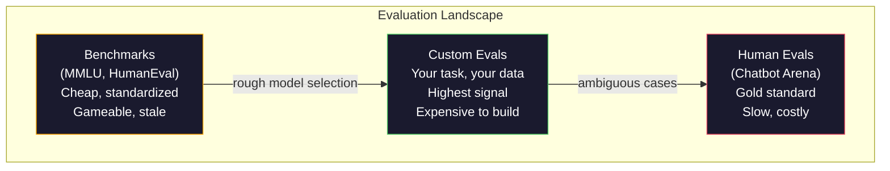
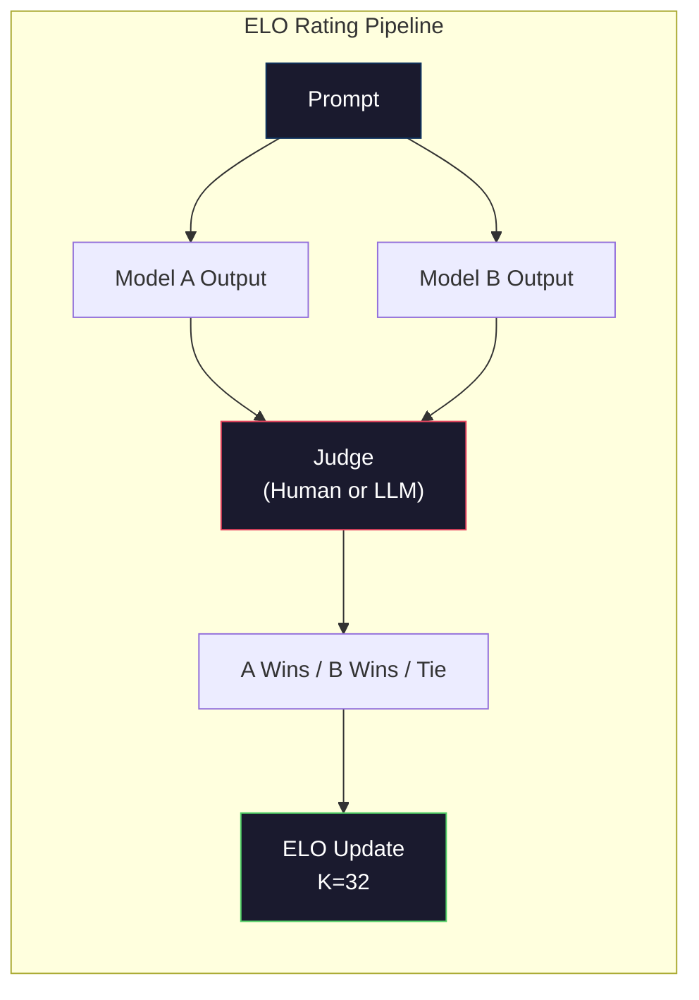

# 評估：基準測試、Evals 與 LM Harness

> 古德哈特定律：當一個量測變成目標，它就不再是個好量測。每一間前沿實驗室都在刷基準測試。MMLU 分數一路往上，模型卻還是沒辦法穩定數出「strawberry」裡有幾個 R。唯一重要的評估，是「你的」評估 —— 針對你的任務、用你的資料。

**類型：** 實作
**程式語言：** Python
**先修單元：** 階段 10 · 01-05（從零打造 LLM）
**時間：** 約 90 分鐘

## 學習目標

- 建立一套自訂的評估框架，能拿選擇題與開放式基準測試去跑一個語言模型
- 說明為什麼標準基準測試（MMLU、HumanEval）會飽和，以至於分不出前沿模型的差別
- 用恰當的指標實作任務專屬的評估：完全比對、F1、BLEU，以及 LLM 評審評分
- 設計一套針對你自己使用情境的評估套件，而不是只依賴公開排行榜

## 問題所在

MMLU 在 2020 年發表，涵蓋 57 個科目、共 15,908 道題目。三年之內，前沿模型就把它做飽和了。GPT-4 拿 86.4%。Claude 3 Opus 拿 86.8%。Llama 3 405B 拿 88.6%。整張排行榜被壓縮進 3 個百分點的區間，裡頭的差距是統計雜訊，不是真實的能力落差。

同一時間，這些模型卻在十歲小孩不用想就會的任務上翻船。MMLU 拿 88.7% 的 Claude 3.5 Sonnet，一開始沒辦法數出「strawberry」裡的字母 —— 那個任務不需要任何世界知識、不需要任何推理，只需要逐字元走一遍。HumanEval 用 164 道題目測試程式碼生成。模型在上面拿 90% 以上，寫出來的程式碼卻仍會在任何資淺工程師都抓得到的邊界案例上炸掉。

基準測試表現與真實世界可靠度之間的落差，就是 LLM 評估的核心問題。基準測試只告訴你模型在那個基準測試上表現如何。至於這個模型在你的特定任務上、用你的特定資料、面對你的特定失效模式時表現如何，它幾乎什麼都沒說。如果你在做客服機器人，MMLU 毫不相干。如果你在做程式助理，HumanEval 只涵蓋函式層級的生成 —— 對於除錯、重構，或跨檔案解釋程式碼，它一句話都沒講。

你需要自訂評估。不是因為基準測試沒用 —— 拿來粗篩模型很有用 —— 而是因為最終的評估必須精確對應你的部署條件。

## 核心概念

### 評估的地貌

評估分成三類，各自的成本與訊號品質都不同。

**基準測試**是標準化的測驗題組。MMLU、HumanEval、SWE-bench、MATH、ARC、HellaSwag。你拿模型去跑基準測試，得到一個分數。好處：大家用的是同一份測驗，所以模型之間可以比較。壞處：模型與訓練資料對這些基準測試的汙染愈來愈嚴重。實驗室訓練用的資料裡就含有基準測試的題目。分數上去了，能力未必。

**自訂評估**是你為自己的使用情境打造的測驗題組。輸入、預期輸出、評分函式都由你定義。法律文件摘要器就拿法律文件去評。SQL 生成器就拿你的資料庫綱要去評。這種評估建置成本高，但它是唯一能預測生產環境表現的評估。

**人類評估**請付費標註者針對有用性、正確性、流暢度與安全性等準則來判斷模型輸出。對自動評分會失靈的開放式任務來說，這是黃金標準。Chatbot Arena 已在 100 多個模型上蒐集了超過 200 萬張人類偏好票。缺點是成本（每次判斷 $0.10-$2.00）與速度（數小時到數天）。



### 基準測試為什麼會壞掉

有三種機制會讓基準測試分數不再反映真實能力。

**資料汙染。** 訓練語料是從網路爬來的。基準測試題目就活在網路上。模型在訓練期間看過答案。這不是傳統意義上的作弊 —— 實驗室並非刻意納入基準測試資料。但在網路規模的爬取下，要排除它幾乎不可能。

**為考試而教。** 實驗室會針對基準測試表現去調訓練資料的配方。如果訓練配方裡有 5% 是 MMLU 風格的選擇題，模型就學會了那個格式與答案分布。MMLU 是四選一。模型學到答案在 A/B/C/D 上大致均勻分布，這在它其實不知道答案的時候也幫得上忙。

**飽和。** 當每個前沿模型在某個基準測試上都拿 85-90%，這個基準測試就失去鑑別力了。剩下那 10-15% 的題目可能本身就模稜兩可、標錯，或需要偏門的領域知識。MMLU 從 87% 進步到 89%，可能只代表模型多背了兩道冷門題，不代表它變聰明了。

### 困惑度：快速的健康檢查

困惑度衡量一個模型對某段詞元序列有多驚訝。形式上，它是平均負對數概似取指數：

```
PPL = exp(-1/N * sum(log P(token_i | context)))
```

困惑度 10 的意思是，模型平均而言在每個詞元位置上的不確定程度，相當於要從 10 個選項裡均勻亂猜。愈低愈好。GPT-2 在 WikiText-103 上的困惑度約 30。GPT-3 約 20。Llama 3 8B 約 7。

在同一份測試集上比較模型時，困惑度很有用，但它有盲點。一個模型可能因為很擅長預測常見樣式而拿到低困惑度，卻在稀有但重要的樣式上爛得可以。它對指令遵循、推理或事實正確性也隻字未提。把它當作理智檢查，不要當作最終定論。

### LLM 評審

用一個強模型去評估弱模型的輸出。想法很單純：請 GPT-4o 或 Claude Sonnet 就正確性、有用性與安全性，把一則回應打成 1-5 分。用 GPT-4o-mini 每次判斷約 $0.01，而且跟人類判斷的相關性出奇地好 —— 多數任務上約有 80% 的一致率。

評分提示詞比模型本身更重要。模糊的提示詞（「Rate this response」）產生的是雜訊分數。帶評分標準的結構化提示詞（「Score 5 if the answer is factually correct and cites a source, 4 if correct but unsourced, 3 if partially correct...」）產生的才是穩定、可重現的分數。

失效模式：評審模型會有位置偏誤（在成對比較裡偏好排前面的回應）、冗長偏誤（偏好較長的回應），以及自我偏好（GPT-4 給 GPT-4 的輸出打的分數，高於同等品質的 Claude 輸出）。緩解方式：打亂順序、對長度做正規化、用一個跟受測模型不同的評審。

### 從成對比較算出 ELO 評分

這是 Chatbot Arena 的做法。針對同一個提示詞，把兩個不同模型的回應並排給人看。由人類（或 LLM 評審）挑出較好的那個。從數以千計的比較中，替每個模型算出一個 ELO 評分 —— 跟西洋棋用的是同一套系統。

ELO 的好處：相對排名比絕對評分可靠，能優雅地處理平手，而且比起獨立替每個輸出打分，它用更少的比較次數就會收斂。截至 2026 年初，Chatbot Arena 的排名顯示 GPT-4o、Claude 3.5 Sonnet 與 Gemini 1.5 Pro 在榜首彼此相差不到 20 個 ELO 分。



### 評估框架

**lm-evaluation-harness**（EleutherAI）：開源評估框架的標準答案。支援 200 多個基準測試。一行指令就能拿任何 Hugging Face 模型去跑 MMLU、HellaSwag、ARC 等等。Open LLM Leaderboard 用的就是它。

**RAGAS**：專為 RAG 管線設計的評估框架。量測忠實度（答案是否符合檢索到的脈絡？）、相關性（檢索到的脈絡跟問題相關嗎？）與答案正確性。

**promptfoo**：以設定檔驅動的提示詞工程評估。在 YAML 裡定義測試案例，拿去跑多個模型，得到一份通過／失敗報告。很適合用來對提示詞做迴歸測試 —— 確保改一個提示詞不會弄壞既有的測試案例。

### 打造自訂評估

對生產環境而言唯一重要的評估。流程如下：

1. **定義任務。** 模型到底該做什麼？要精確。「回答問題」太模糊。「給定一封客訴信，抽出產品名稱、問題類別與情緒」才是一個你評得動的任務。

2. **建立測試案例。** 原型評估最少 50 個，生產環境 200 個以上。每個測試案例是一組 (input, expected_output)。要納入邊界案例：空輸入、對抗性輸入、模稜兩可的輸入、其他語言的輸入。

3. **定義評分。** 結構化輸出用完全比對。文字相似度用 BLEU/ROUGE。開放式品質用 LLM 評審。抽取任務用 F1。多個指標可以加權組合。

4. **自動化。** 每一次評估都用一行指令跑完。不要有手動步驟。結果存成能跨時間比較的格式。

5. **持續追蹤。** 單看一個評估分數毫無意義。你要的是趨勢線。上一次改提示詞之後分數有變好嗎？換模型之後有退步嗎？把評估跟提示詞一起做版本控管。

| 評估類型 | 每次判斷成本 | 與人類的一致率 | 最適合 |
|-----------|------------------|----------------------|----------|
| 完全比對 | 約 $0 | 100%（適用時） | 結構化輸出、分類 |
| BLEU/ROUGE | 約 $0 | 約 60% | 翻譯、摘要 |
| LLM 評審 | 約 $0.01 | 約 80% | 開放式生成 |
| 人類評估 | $0.10-$2.00 | N/A（它就是標準答案） | 模稜兩可、高風險的任務 |

```figure
perplexity-loss
```

## 動手實作

### 步驟 1：一個最小的評估框架

先定義核心抽象。一個評估案例包含輸入、預期輸出，以及一個選用的中繼資料字典。一個評分器吃進預測值與參考答案，回傳 0 到 1 之間的分數。

```python
import json
from collections import Counter

class EvalCase:
    def __init__(self, input_text, expected, metadata=None):
        self.input_text = input_text
        self.expected = expected
        self.metadata = metadata or {}

class EvalSuite:
    def __init__(self, name, cases, scorers):
        self.name = name
        self.cases = cases
        self.scorers = scorers

    def run(self, model_fn):
        results = []
        for case in self.cases:
            prediction = model_fn(case.input_text)
            scores = {}
            for scorer_name, scorer_fn in self.scorers.items():
                scores[scorer_name] = scorer_fn(prediction, case.expected)
            results.append({
                "input": case.input_text,
                "expected": case.expected,
                "prediction": prediction,
                "scores": scores,
            })
        return results
```

### 步驟 2：評分函式

實作完全比對、詞元 F1，以及一個模擬的 LLM 評審評分器。

```python
def exact_match(prediction, expected):
    return 1.0 if prediction.strip().lower() == expected.strip().lower() else 0.0

def token_f1(prediction, expected):
    pred_tokens = set(prediction.lower().split())
    exp_tokens = set(expected.lower().split())
    if not pred_tokens or not exp_tokens:
        return 0.0
    common = pred_tokens & exp_tokens
    precision = len(common) / len(pred_tokens)
    recall = len(common) / len(exp_tokens)
    if precision + recall == 0:
        return 0.0
    return 2 * (precision * recall) / (precision + recall)

def llm_judge_simulated(prediction, expected):
    pred_words = set(prediction.lower().split())
    exp_words = set(expected.lower().split())
    if not exp_words:
        return 0.0
    overlap = len(pred_words & exp_words) / len(exp_words)
    length_penalty = min(1.0, len(prediction) / max(len(expected), 1))
    return round(overlap * 0.7 + length_penalty * 0.3, 3)
```

### 步驟 3：ELO 評分系統

實作帶 ELO 更新的成對比較。這正是 Chatbot Arena 用來排名模型的系統。

```python
class ELOTracker:
    def __init__(self, k=32, initial_rating=1500):
        self.ratings = {}
        self.k = k
        self.initial_rating = initial_rating
        self.history = []

    def _ensure_player(self, name):
        if name not in self.ratings:
            self.ratings[name] = self.initial_rating

    def expected_score(self, rating_a, rating_b):
        return 1 / (1 + 10 ** ((rating_b - rating_a) / 400))

    def record_match(self, player_a, player_b, outcome):
        self._ensure_player(player_a)
        self._ensure_player(player_b)

        ea = self.expected_score(self.ratings[player_a], self.ratings[player_b])
        eb = 1 - ea

        if outcome == "a":
            sa, sb = 1.0, 0.0
        elif outcome == "b":
            sa, sb = 0.0, 1.0
        else:
            sa, sb = 0.5, 0.5

        self.ratings[player_a] += self.k * (sa - ea)
        self.ratings[player_b] += self.k * (sb - eb)

        self.history.append({
            "a": player_a, "b": player_b,
            "outcome": outcome,
            "rating_a": round(self.ratings[player_a], 1),
            "rating_b": round(self.ratings[player_b], 1),
        })

    def leaderboard(self):
        return sorted(self.ratings.items(), key=lambda x: -x[1])
```

### 步驟 4：計算困惑度

用詞元機率算困惑度。實務上這些機率會從模型的 logits 拿到。這裡我們用一個機率分布來模擬。

```python
import numpy as np

def perplexity(log_probs):
    if not log_probs:
        return float("inf")
    avg_neg_log_prob = -np.mean(log_probs)
    return float(np.exp(avg_neg_log_prob))

def token_log_probs_simulated(text, model_quality=0.8):
    np.random.seed(hash(text) % 2**31)
    tokens = text.split()
    log_probs = []
    for i, token in enumerate(tokens):
        base_prob = model_quality
        if len(token) > 8:
            base_prob *= 0.6
        if i == 0:
            base_prob *= 0.7
        prob = np.clip(base_prob + np.random.normal(0, 0.1), 0.01, 0.99)
        log_probs.append(float(np.log(prob)))
    return log_probs
```

### 步驟 5：彙總結果

算出一次評估執行的摘要統計：平均值、中位數、在某門檻下的通過率，以及各指標的細項。

```python
def summarize_results(results, threshold=0.8):
    all_scores = {}
    for r in results:
        for metric, score in r["scores"].items():
            all_scores.setdefault(metric, []).append(score)

    summary = {}
    for metric, scores in all_scores.items():
        arr = np.array(scores)
        summary[metric] = {
            "mean": round(float(np.mean(arr)), 3),
            "median": round(float(np.median(arr)), 3),
            "std": round(float(np.std(arr)), 3),
            "min": round(float(np.min(arr)), 3),
            "max": round(float(np.max(arr)), 3),
            "pass_rate": round(float(np.mean(arr >= threshold)), 3),
            "n": len(scores),
        }
    return summary

def print_summary(summary, suite_name="Eval"):
    print(f"\n{'=' * 60}")
    print(f"  {suite_name} Summary")
    print(f"{'=' * 60}")
    for metric, stats in summary.items():
        print(f"\n  {metric}:")
        print(f"    Mean:      {stats['mean']:.3f}")
        print(f"    Median:    {stats['median']:.3f}")
        print(f"    Std:       {stats['std']:.3f}")
        print(f"    Range:     [{stats['min']:.3f}, {stats['max']:.3f}]")
        print(f"    Pass rate: {stats['pass_rate']:.1%} (threshold >= 0.8)")
        print(f"    N:         {stats['n']}")
```

### 步驟 6：跑完整條管線

把所有東西串起來。定義一個任務、建立測試案例、模擬兩個模型、跑評估、從成對比較算出 ELO，然後印出排行榜。

```python
def demo_model_good(prompt):
    responses = {
        "What is the capital of France?": "Paris",
        "What is 2 + 2?": "4",
        "Who wrote Hamlet?": "William Shakespeare",
        "What language is PyTorch written in?": "Python and C++",
        "What is the boiling point of water?": "100 degrees Celsius",
    }
    return responses.get(prompt, "I don't know")

def demo_model_bad(prompt):
    responses = {
        "What is the capital of France?": "Paris is the capital city of France",
        "What is 2 + 2?": "The answer is four",
        "Who wrote Hamlet?": "Shakespeare",
        "What language is PyTorch written in?": "Python",
        "What is the boiling point of water?": "212 Fahrenheit",
    }
    return responses.get(prompt, "Unknown")

cases = [
    EvalCase("What is the capital of France?", "Paris"),
    EvalCase("What is 2 + 2?", "4"),
    EvalCase("Who wrote Hamlet?", "William Shakespeare"),
    EvalCase("What language is PyTorch written in?", "Python and C++"),
    EvalCase("What is the boiling point of water?", "100 degrees Celsius"),
]

suite = EvalSuite(
    name="General Knowledge",
    cases=cases,
    scorers={
        "exact_match": exact_match,
        "token_f1": token_f1,
        "llm_judge": llm_judge_simulated,
    },
)

results_good = suite.run(demo_model_good)
results_bad = suite.run(demo_model_bad)

print_summary(summarize_results(results_good), "Model A (concise)")
print_summary(summarize_results(results_bad), "Model B (verbose)")
```

「好」模型給的是精確答案。「壞」模型給的是囉嗦的改寫。完全比對會狠狠懲罰囉嗦的那個。詞元 F1 與 LLM 評審則寬容得多。這說明了為什麼指標的選擇很重要：同一個模型，端看你怎麼評分，可以看起來很棒，也可以看起來很糟。

### 步驟 7：ELO 錦標賽

跨多個回合，在模型之間跑成對比較。

```python
elo = ELOTracker(k=32)

for case in cases:
    pred_a = demo_model_good(case.input_text)
    pred_b = demo_model_bad(case.input_text)

    score_a = token_f1(pred_a, case.expected)
    score_b = token_f1(pred_b, case.expected)

    if score_a > score_b:
        outcome = "a"
    elif score_b > score_a:
        outcome = "b"
    else:
        outcome = "tie"

    elo.record_match("model_a_concise", "model_b_verbose", outcome)

print("\nELO Leaderboard:")
for name, rating in elo.leaderboard():
    print(f"  {name}: {rating:.0f}")
```

### 步驟 8：困惑度比較

比較不同品質等級的「模型」之間的困惑度。

```python
test_text = "The quick brown fox jumps over the lazy dog in the garden"

for quality, label in [(0.9, "Strong model"), (0.7, "Medium model"), (0.4, "Weak model")]:
    log_probs = token_log_probs_simulated(test_text, model_quality=quality)
    ppl = perplexity(log_probs)
    print(f"  {label} (quality={quality}): perplexity = {ppl:.2f}")
```

## 框架應用

### lm-evaluation-harness（EleutherAI）

拿任何模型去跑基準測試的標準工具。

```python
# pip install lm-eval
# Command line:
# lm_eval --model hf --model_args pretrained=meta-llama/Llama-3.1-8B --tasks mmlu --batch_size 8

# Python API:
# import lm_eval
# results = lm_eval.simple_evaluate(
#     model="hf",
#     model_args="pretrained=meta-llama/Llama-3.1-8B",
#     tasks=["mmlu", "hellaswag", "arc_easy"],
#     batch_size=8,
# )
# print(results["results"])
```

### promptfoo

以設定檔驅動的提示詞工程評估。在 YAML 裡定義測試，拿去跑多家供應商。

```yaml
# promptfoo.yaml
providers:
  - openai:gpt-4o-mini
  - anthropic:claude-3-haiku

prompts:
  - "Answer in one word: {{question}}"

tests:
  - vars:
      question: "What is the capital of France?"
    assert:
      - type: contains
        value: "Paris"
  - vars:
      question: "What is 2 + 2?"
    assert:
      - type: equals
        value: "4"
```

### 用 RAGAS 做 RAG 評估

```python
# pip install ragas
# from ragas import evaluate
# from ragas.metrics import faithfulness, answer_relevancy, context_precision
#
# result = evaluate(
#     dataset,
#     metrics=[faithfulness, answer_relevancy, context_precision],
# )
# print(result)
```

RAGAS 量的是通用評估漏掉的東西：模型的答案是否有紮根在檢索到的脈絡上，而不只是答案在抽象意義上「對不對」。

## 產出交付

本單元產出 `outputs/prompt-eval-designer.md` —— 一個可重複使用的提示詞，能為任何任務設計自訂評估套件。給它一段任務描述，它會生成測試案例、評分函式，以及通過／失敗門檻的建議。

它同時產出 `outputs/skill-llm-evaluation.md` —— 一套決策框架，依據你的任務類型、預算與延遲需求，挑出對的評估策略。

## 練習

1. 加上一個「一致性」評分器：把同一個輸入丟給模型跑 5 次，量測輸出彼此相符的頻率。在確定性的輸入上得到不一致的答案，代表提示詞脆弱或溫度設定太高。

2. 擴充 ELO 追蹤器，讓它支援多個評審函式（完全比對、F1、LLM 評審）並加權。比較看看：把完全比對加重，跟把 F1 加重，排行榜會怎麼變。

3. 為一個特定任務打造評估套件：把電子郵件分成 5 類。建立 100 個測試案例，涵蓋多樣的例子，包含邊界案例（可能同時屬於多個類別的信、空白的信、其他語言的信）。量測不同「模型」（規則式、關鍵字比對、模擬的 LLM）的表現。

4. 實作汙染偵測：給定一組評估題目與一份訓練語料，檢查有多少比例的評估題目（或它們的近義改寫）出現在訓練資料裡。研究者就是這樣稽核基準測試的有效性。

5. 打造一個「模型 diff」工具。給定兩個模型版本的評估結果，標出哪些測試案例變好、哪些退步、哪些沒變。這是評估版的程式碼 diff —— 要判斷一次改動到底是幫了忙還是幫了倒忙，非它不可。

## 關鍵術語

| 術語 | 大家怎麼說 | 實際上是什麼 |
|------|----------------|----------------------|
| MMLU | 「那個基準測試」 | Massive Multitask Language Understanding —— 57 個科目、15,908 道選擇題，到 2025 年已在 88% 以上飽和 |
| HumanEval | 「程式碼評估」 | OpenAI 出的 164 道 Python 函式補完題，只測孤立的函式生成 |
| SWE-bench | 「真實的程式評估」 | 取自 12 個 Python 儲存庫的 2,294 個 GitHub issue，量測端到端的修 bug 能力，包含測試生成 |
| 困惑度 | 「模型有多困惑」 | exp(-avg(log P(token_i given context))) —— 愈低代表模型給實際出現的詞元愈高的機率 |
| ELO 評分 | 「模型版的西洋棋排名」 | 由成對勝負紀錄算出的相對實力評分，Chatbot Arena 用它排名 100 多個模型 |
| LLM 評審 | 「用 AI 幫 AI 打分」 | 由一個強模型依評分標準替弱模型的輸出打分，與人類評審約 80% 一致，每次判斷約 $0.01 |
| 資料汙染 | 「模型看過考題」 | 訓練資料含有基準測試題目，分數被灌水，真實能力卻沒進步 |
| 評估套件 | 「一堆測試」 | 一組有版本控管的 (input, expected_output, scorer) 三元組，用來量測某項特定能力 |
| 通過率 | 「它答對幾成」 | 分數高於門檻的評估案例比例 —— 比平均分更能指導行動，因為它量的是可靠度 |
| Chatbot Arena | 「模型排名網站」 | LMSYS 的平台，累積 200 萬張以上的人類偏好票，透過 ELO 評分產出最受信任的 LLM 排行榜 |

## 延伸閱讀

- [Hendrycks et al., 2021 -- "Measuring Massive Multitask Language Understanding"](https://arxiv.org/abs/2009.03300) —— MMLU 論文，儘管已經飽和，仍是被引用最多的 LLM 基準測試
- [Chen et al., 2021 -- "Evaluating Large Language Models Trained on Code"](https://arxiv.org/abs/2107.03374) —— OpenAI 的 HumanEval 論文，奠定了程式碼生成的評估方法學
- [Zheng et al., 2023 -- "Judging LLM-as-a-Judge"](https://arxiv.org/abs/2306.05685) —— 系統性分析用 LLM 評估 LLM，包含位置偏誤與冗長偏誤的發現
- [LMSYS Chatbot Arena](https://chat.lmsys.org/) —— 群眾外包的模型比較平台，累積 200 萬張以上的票，是最受信任的真實世界 LLM 排名
