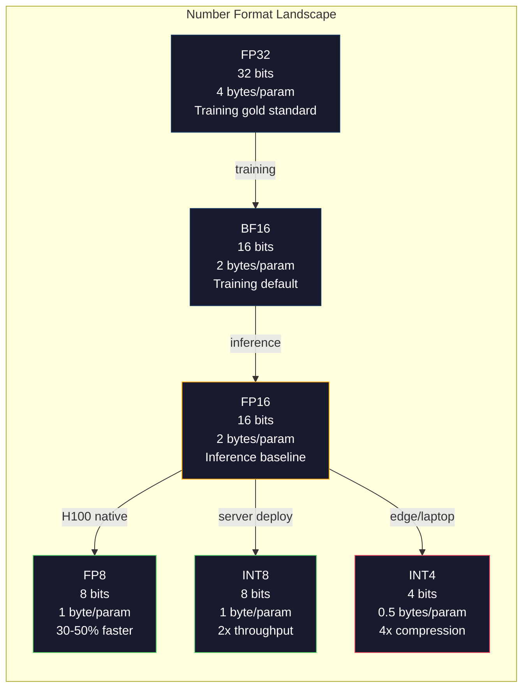
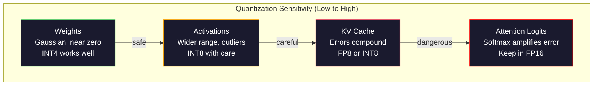
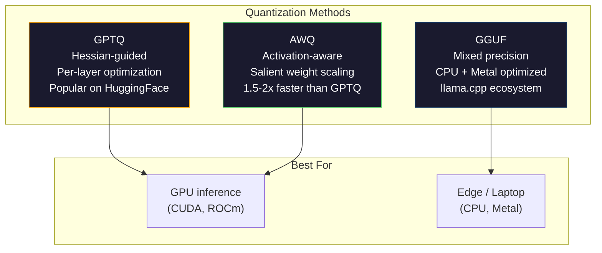

# 量化：讓模型裝得下

> 一個 70B 模型在 FP16 下需要 140GB。光是權重就要兩張 A100。量化到 FP8：一張 80GB 的 GPU。INT4：一台 MacBook。

**類型：** 實作
**程式語言：** Python (with numpy)
**先修單元：** 階段 10 · 01-10（從零打造 LLM）
**時間：** 約 120 分鐘

## 學習目標

- 實作從 FP16 到 INT8 與 INT4 的對稱與非對稱量化，包含每張量與每通道的縮放
- 計算量化省下的記憶體，並判斷哪一種精度裝得進給定 GPU 的 VRAM
- 說明訓練後量化（PTQ）與量化感知訓練（QAT）之間的差別
- 套用 GPTQ 或 AWQ 量化一個真實模型，並在基準測試上量測準確度與記憶體的取捨

## 問題所在

Llama 3 70B 有 700 億個參數。每個參數是一個 16 位元浮點數。那就是 1,400 億個位元組，也就是 140GB。單張 A100 只有 80GB 的 VRAM。在單張 GPU 上，你連權重都載不進去，更別說跑推論。光是要服務一個模型，你就得用兩張每小時 2 美元的 A100。

但每個參數 16 位元是浪費的。神經網路裡大多數權重都聚集在零附近。FP16 的完整動態範圍（從 0.000000059 到 65,504）幾乎完全沒被用上。如果你去量測 Llama 3 70B 權重的實際分布，其中 95% 落在 -0.1 到 +0.1 之間。你正燒掉 16 個位元，去表示 4 個位元就裝得下的數值。

量化把高精度的數字換成低精度的。FP16 換成 FP8，記憶體砍一半。FP16 換成 INT4，砍到四分之一。那個 140GB 的模型會變成 35GB，一張消費級 GPU 就裝得下。再推到 2 位元量化（激進、有損，但某些任務仍堪用），同一個模型就能跑在 16GB 的筆電上。

代價是準確度。你每拿掉一個位元，就毀掉一些資訊。問題在於你損失多少準確度、又損失在哪裡。量化得當的 INT4 模型，在大多數基準測試上能保住原模型 95-99% 的品質。天真地量化到 INT4，則可能把模型徹底毀掉。差別就在技巧。

社群用 GPTQ 把 Llama 3 量化到 INT4 的成果顯示，在 WikiText 上大約損失 1-2 個困惑度點。Mistral 釋出的 Mixtral 8x22B FP8 檢查點，在 MMLU 上沒有可量測到的品質損失。GGUF 格式撐起了 llama.cpp，讓 70B 模型跑在搭載 M 系列晶片的 MacBook 上。量化不是旁門左道，它是每一個大於 7B 的模型的標準部署路徑。

## 核心概念

### 數字格式：每個位元在做什麼

每個浮點數都有三個部分：符號（sign）、指數（exponent）與尾數（mantissa，也叫 significand）。符號佔一個位元。指數決定範圍（數字能有多大或多小）。尾數決定精度（你能拿到幾位小數）。

```
FP32:  [1 sign] [8 exponent] [23 mantissa]  = 32 bits
FP16:  [1 sign] [5 exponent] [10 mantissa]  = 16 bits
BF16:  [1 sign] [8 exponent] [7  mantissa]  = 16 bits
FP8:   [1 sign] [4 exponent] [3  mantissa]  = 8  bits (E4M3)
FP8:   [1 sign] [5 exponent] [2  mantissa]  = 8  bits (E5M2)
INT8:  [1 sign] [7 value]                   = 8  bits (uniform steps)
INT4:  [1 sign] [3 value]                   = 4  bits (16 levels total)
```

**FP32** 是全精度。23 個尾數位元給你大約 7 位十進位數字的精度。範圍大致是 1.2 x 10^-38 到 3.4 x 10^38。訓練以前只在 FP32 裡進行，而累加（矩陣乘法過程中的滾動加總）至今仍然如此。

**FP16** 把位元數砍半。10 個尾數位元約合 3.3 位十進位數字。指數縮到 5 個位元，範圍大幅縮小（最大值約 65,504）。這對權重（聚集在零附近）沒問題，但對訓練中可能暴衝的激活值與梯度就危險了。FP16 訓練需要損失縮放（loss scaling）來避免下溢。

**BF16**（Brain Float 16）保留了 FP32 的 8 位元指數，但把尾數縮到 7 個位元。範圍與 FP32 相同，精度低於 FP16。Google 專為深度學習設計了它。直覺是這樣：對神經網路來說，範圍比精度重要。一個 10^-20 的梯度在 FP16 裡會下溢成零，在 BF16 裡卻活得下來。一個 0.07342 的權重在 BF16 裡被捨入成 0.0734，也夠接近了。現代每一次訓練都用 BF16，或 BF16／FP32 混合。

**FP8** 有兩種口味。E4M3（4 位元指數、3 位元尾數）用於推論時的權重與激活值。E5M2（5 位元指數、2 位元尾數）用於訓練時的梯度，那裡範圍比精度重要。在 H100 GPU 上，FP8 推論相較 FP16 有 30-50% 的加速，品質損失可以忽略。

**INT8** 是整數格式。沒有指數，沒有尾數，就是 -128 到 127 之間 256 個等距數值。你需要一個縮放因子，把浮點權重映射進這個範圍。好處是：整數運算比浮點運算更快、更省電。A100 上的 INT8 矩陣乘法跑到 624 TOPS，FP16 則是 312 TFLOPS。

**INT4** 再往前推一步。只有 16 個可能的數值。縮放因子扛下了重活。品質完全取決於你怎麼挑縮放因子、以及你量化哪些權重。最先進的 INT4 方法（GPTQ、AWQ）能保住原模型 95% 以上的品質。



### 量化如何運作

核心操作很單純。拿一個浮點數值的張量，找出一個縮放因子，相乘、四捨五入到最接近的整數，然後把這些整數連同縮放因子一起存起來。

**量化：**
```
scale = max(abs(tensor)) / max_int_value
quantized = round(tensor / scale)
```

**反量化：**
```
reconstructed = quantized * scale
```

對稱範圍（-127 到 127）的 INT8：
```
scale = max(abs(tensor)) / 127
quantized = clamp(round(tensor / scale), -128, 127)
```

誤差就是捨入誤差。每個數值最多偏差 `scale / 2`。一整層的總誤差，取決於你有多少權重，以及模型對那些權重的擾動有多敏感。

**每張量 vs 每通道量化。** 每張量對整個權重矩陣只用一個縮放因子。簡單但有損：如果某一行數值很大、另一行很小，小的那些就會失掉大半精度。每通道則對每個輸出通道（權重矩陣的每一列或每一行）各用一個縮放因子。額外開銷比較大（你要存 N 個縮放因子而不是 1 個），但品質好得多。每一套生產級的量化方法都採用每通道或更細的粒度。

**非對稱量化** 加上一個零點偏移：`quantized = round(tensor / scale) + zero_point`。這處理的是分布不以零為中心的情況。舉例來說，ReLU 激活值永遠是非負的。對稱量化會把整數範圍的一半，浪費在從不出現的負值上。非對稱量化則把實際範圍 [min, max] 映射到完整的整數範圍。

### 敏感度階層

模型裡不是每個東西都同樣耐得住量化。這裡有一個清楚的階層。

**權重（最耐受）。** 模型權重在訓練中變化緩慢，分布大致是以零為中心的高斯分布。它們量化得很好。搭配每通道縮放因子的 INT8 權重，結果幾乎無損。INT4 需要更精巧的方法，但可行。

**激活值（中度敏感）。** 激活值是推論時流經網路的中間值。它們的動態範圍比權重寬，而且含有離群值。單一個注意力頭，可能產生比平均值大 100 倍的激活值。這些離群值對模型品質至關重要，天真地量化它們會毀掉資訊。解法：把離群通道保留在較高精度（LLM.int8()），或改用每詞元、每通道的激活值縮放因子。

**KV 快取（高度敏感）。** key-value 快取存放所有先前詞元的注意力狀態。在長脈絡下，KV 快取主宰了記憶體用量。一個 70B 模型在 32K 脈絡下，光是 KV 快取在 FP16 就有 40GB。把 KV 快取量化到 FP8 或 INT8 能省下大量記憶體，但任何誤差都會在之後所有的注意力運算裡累積下去。品質衝擊隨序列長度放大。

**注意力 logits（最敏感）。** 注意力裡的 softmax 對輸入的微小變化極為敏感。softmax 之前的 logit 只要有 0.01 的量化誤差，就可能明顯改變注意力分布。大多數量化方案就算把其他一切都量化了，仍會把注意力運算保留在較高精度（FP16 或 BF16）。



### PTQ vs QAT

**訓練後量化（PTQ）** 量化一個已經訓練好的模型，不需要重新訓練。你拿 FP16 權重、算出縮放因子、四捨五入，然後部署。快（幾分鐘到幾小時）又便宜。對 INT8 與 FP8 效果很好。到了 INT4，天真的 PTQ 常常慘敗，因為捨入誤差會累積起來。進階的 PTQ 方法（GPTQ、AWQ）會用校準資料來最小化量化誤差。

**量化感知訓練（QAT）** 在訓練時的前向傳播中插入假量化（fake quantization）運算。模型會學著把權重擺在捨入誤差較小的位置。梯度靠直通估計器（straight-through estimator，STE）流過假量化：假裝捨入運算的梯度是 1。QAT 產出的 INT4 與 INT2 模型比 PTQ 好，但需要一次完整的訓練。Google 用 QAT 來讓 Gemini 高效服務。Meta 也在部分 Llama 部署目標上用了 QAT。

| 面向 | PTQ | QAT |
|--------|-----|-----|
| 成本 | 幾分鐘到幾小時 | 一次完整的訓練 |
| INT8 下的品質 | 極佳（損失 < 0.1%） | 極佳 |
| INT4 下的品質 | 搭配 GPTQ／AWQ 良好（損失 1-3%） | 更好（損失 < 1%） |
| INT2 下的品質 | 差 | 某些任務堪用 |
| 校準資料 | 128-1024 個範例 | 完整的訓練資料集 |
| 何時使用 | 部署、迭代 | 在低位元寬度下追求最高品質 |

### GPTQ、AWQ、GGUF

**GPTQ（GPT Quantization）** 是一次性的 PTQ 方法。它一次量化一層權重，用一小份校準資料集（典型是 128 個範例）來量測 Hessian（二階資訊，描述輸出對每個權重有多敏感）。Hessian 認為重要的權重，會被更小心地量化。GPTQ 是第一個讓 INT4 量化對 LLM 變得實用的方法。Hugging Face 上的 TheBloke 釋出了數百個模型的量化版本，讓 GPTQ 廣為流行。

**AWQ（Activation-Aware Weight Quantization）** 觀察到有一小部分權重（約 1%）的重要性不成比例地高，因為它們會與很大的激活值相乘。AWQ 用校準資料找出這些顯著權重，在量化前把它們放大（再把對應的激活值縮小）。這讓重要權重待在 INT4 量化夠準確的範圍裡。AWQ 的品質通常與 GPTQ 相當或略勝，套用起來還快 1.5-2 倍。

**GGUF（GPT-Generated Unified Format）** 是 llama.cpp 及其生態系使用的檔案格式。它支援混合量化：不同層可以有不同的位元寬度。第一層與最後一層（嵌入與輸出頭）通常保留較高精度，中間層則用 INT4 或 INT3。GGUF 檔案是自足的：權重、分詞器、中繼資料全在一個檔案裡。這個格式是為 CPU 推論與 Apple Silicon 設計的，在那些環境裡，把整個模型載入記憶體、用 CPU 或 Metal GPU 跑矩陣乘法就是標準做法。Q4_K_M 是最熱門的 GGUF 量化變體，在品質與大小之間取得平衡。



### 品質量測

你怎麼知道量化後的模型還夠好？

**困惑度。** 最常見的指標，越低越好。在一份留存資料集上（WikiText-2 是標準），分別計算原模型與量化模型的困惑度。兩者的差值告訴你量化毀掉了多少資訊。經驗法則：差值 < 0.5 是極佳，0.5-1.0 是良好，1.0-2.0 對大多數任務可以接受，> 2.0 就代表哪裡出錯了。

**任務專屬的基準測試。** 拿量化模型去跑 MMLU、HumanEval、GSM8K，或你自己的評估套件，再與原模型比較。量化對不同能力的影響並不平均。數學與程式任務，比一般知識更容易受精度損失影響。

**輸出比較。** 用同一批提示詞讓兩個模型各自生成回應，再互相比對。LLM 評審（單元 10）在這裡很好用。算一個勝率：量化模型在多少比例的提示詞上追平或勝過原模型？

**延遲與吞吐量。** 量化存在的目的，就是讓模型更快更便宜。量測每秒詞元數、首個詞元的時間，以及記憶體使用量。一個比原模型還慢的量化模型，比沒有還糟。

| 模型 | 格式 | 大小 | 困惑度（WikiText-2） | MMLU | 每秒詞元數（A100） |
|-------|--------|------|------------------------|------|-------------------|
| Llama 3 70B | FP16 | 140GB | 3.12 | 79.5% | 38 |
| Llama 3 70B | FP8 | 70GB | 3.14 | 79.3% | 55 |
| Llama 3 70B | GPTQ INT4 | 35GB | 4.32 | 77.8% | 72 |
| Llama 3 70B | AWQ INT4 | 35GB | 4.18 | 78.1% | 75 |
| Llama 3 70B | GGUF Q4_K_M | 40GB | 4.25 | 77.9% | 28（CPU） |

規律是這樣的：FP8 幾乎是免費的。INT4 花掉 1-2 個 MMLU 百分點，卻讓吞吐量翻倍、記憶體只剩四分之一。對幾乎每一種部署來說，這筆交易都值得。

### 真實數字

FP16 換 FP8，在 H100 上：推論加速 30-50%，品質損失 < 0.1%。這是不用想的量化。每一套 H100 部署都該用。

FP16 換 INT8（LLM.int8()）：記憶體減為一半，品質損失 < 0.5%。這種混合精度做法把離群特徵留在 FP16，其餘全部量化到 INT8。

FP16 換 INT4（GPTQ／AWQ）：記憶體減為四分之一，品質損失 1-3%，視模型與方法而定。讓 70B 模型跑在單張 48GB GPU 上。

FP16 換 INT4（GGUF Q4_K_M）：記憶體減為 1/3.5，品質損失 1-2%。針對 CPU 推論最佳化。70B 模型在 Q4_K_M 下約 40GB，在 64GB 的 M3 Max 上跑到每秒 10-15 個詞元。

FP16 換 INT2：記憶體減為 1/8，品質損失 5-15%。只有在你能容忍退化的特定窄任務上才可行。屬於研究前沿，一般用途還不能上生產。

```figure
quantization
```

## 動手實作

### 步驟 1：數字格式的表示

打造每種格式的位元層級表示，看清楚符號、指數與尾數究竟在做什麼。

```python
import numpy as np


def float_to_fp32_bits(value):
    bits = np.float32(value).view(np.uint32)
    sign = (bits >> 31) & 1
    exponent = (bits >> 23) & 0xFF
    mantissa = bits & 0x7FFFFF
    return {"sign": int(sign), "exponent": int(exponent), "mantissa": int(mantissa),
            "exponent_bits": format(int(exponent), '08b'),
            "mantissa_bits": format(int(mantissa), '023b'),
            "value": float(value),
            "actual_exponent": int(exponent) - 127}


def float_to_fp16_bits(value):
    fp16 = np.float16(value)
    bits = fp16.view(np.uint16)
    sign = (bits >> 15) & 1
    exponent = (bits >> 10) & 0x1F
    mantissa = bits & 0x3FF
    return {"sign": int(sign), "exponent": int(exponent), "mantissa": int(mantissa),
            "exponent_bits": format(int(exponent), '05b'),
            "mantissa_bits": format(int(mantissa), '010b'),
            "value": float(fp16),
            "actual_exponent": int(exponent) - 15}


def float_to_bf16_bits(value):
    fp32_bits = np.float32(value).view(np.uint32)
    bf16_bits = (fp32_bits >> 16).astype(np.uint16)
    sign = (bf16_bits >> 15) & 1
    exponent = (bf16_bits >> 7) & 0xFF
    mantissa = bf16_bits & 0x7F
    reconstructed = np.uint32(bf16_bits.astype(np.uint32) << 16).view(np.float32)
    return {"sign": int(sign), "exponent": int(exponent), "mantissa": int(mantissa),
            "exponent_bits": format(int(exponent), '08b'),
            "mantissa_bits": format(int(mantissa), '07b'),
            "value": float(reconstructed),
            "actual_exponent": int(exponent) - 127}


def simulate_fp8_e4m3(value):
    sign = 1 if value < 0 else 0
    abs_val = abs(value)
    max_val = 448.0
    abs_val = min(abs_val, max_val)
    if abs_val == 0:
        return {"sign": sign, "exponent": 0, "mantissa": 0, "value": 0.0,
                "exponent_bits": "0000", "mantissa_bits": "000"}
    exp = int(np.floor(np.log2(abs_val)))
    exp = max(-6, min(8, exp))
    mantissa_val = abs_val / (2.0 ** exp) - 1.0
    mantissa_quant = round(mantissa_val * 8) / 8
    mantissa_quant = max(0, min(0.875, mantissa_quant))
    reconstructed = (1.0 + mantissa_quant) * (2.0 ** exp)
    if sign:
        reconstructed = -reconstructed
    mantissa_int = int(round(mantissa_quant * 8))
    return {"sign": sign, "exponent": exp + 7, "mantissa": mantissa_int,
            "exponent_bits": format(exp + 7, '04b'),
            "mantissa_bits": format(mantissa_int, '03b'),
            "value": float(reconstructed),
            "actual_exponent": exp}


def display_format_comparison(value):
    fp32 = float_to_fp32_bits(value)
    fp16 = float_to_fp16_bits(value)
    bf16 = float_to_bf16_bits(value)
    fp8 = simulate_fp8_e4m3(value)

    print(f"\n  Value: {value}")
    print(f"  {'Format':<8} {'Stored Value':>14} {'Error':>12} {'Sign':>5} {'Exp Bits':>10} {'Man Bits':>25}")
    print(f"  {'-'*76}")
    print(f"  {'FP32':<8} {fp32['value']:>14.6f} {abs(fp32['value'] - value):>12.8f} {fp32['sign']:>5} {fp32['exponent_bits']:>10} {fp32['mantissa_bits']:>25}")
    print(f"  {'FP16':<8} {fp16['value']:>14.6f} {abs(fp16['value'] - value):>12.8f} {fp16['sign']:>5} {fp16['exponent_bits']:>10} {fp16['mantissa_bits']:>25}")
    print(f"  {'BF16':<8} {bf16['value']:>14.6f} {abs(bf16['value'] - value):>12.8f} {bf16['sign']:>5} {bf16['exponent_bits']:>10} {bf16['mantissa_bits']:>25}")
    print(f"  {'FP8e4m3':<8} {fp8['value']:>14.6f} {abs(fp8['value'] - value):>12.8f} {fp8['sign']:>5} {fp8['exponent_bits']:>10} {fp8['mantissa_bits']:>25}")
```

### 步驟 2：對稱量化（每張量與每通道）

最基本的量化操作。每張量對整個矩陣用一個縮放因子。每通道則對每一列或每一行各用一個縮放因子。

```python
def quantize_symmetric(tensor, num_bits=8):
    qmin = -(2 ** (num_bits - 1))
    qmax = 2 ** (num_bits - 1) - 1
    abs_max = np.max(np.abs(tensor))
    if abs_max == 0:
        return np.zeros_like(tensor, dtype=np.int32), 1.0
    scale = abs_max / qmax
    quantized = np.clip(np.round(tensor / scale), qmin, qmax).astype(np.int32)
    return quantized, float(scale)


def dequantize_symmetric(quantized, scale):
    return quantized.astype(np.float64) * scale


def quantize_per_channel(tensor, num_bits=8, axis=0):
    qmin = -(2 ** (num_bits - 1))
    qmax = 2 ** (num_bits - 1) - 1

    if axis == 0:
        abs_max = np.max(np.abs(tensor), axis=1, keepdims=True)
    else:
        abs_max = np.max(np.abs(tensor), axis=0, keepdims=True)

    abs_max = np.where(abs_max == 0, 1.0, abs_max)
    scales = abs_max / qmax
    quantized = np.clip(np.round(tensor / scales), qmin, qmax).astype(np.int32)
    return quantized, scales.squeeze()


def dequantize_per_channel(quantized, scales, axis=0):
    if axis == 0:
        return quantized.astype(np.float64) * scales.reshape(-1, 1)
    else:
        return quantized.astype(np.float64) * scales.reshape(1, -1)


def quantize_asymmetric(tensor, num_bits=8):
    qmin = 0
    qmax = 2 ** num_bits - 1
    t_min = np.min(tensor)
    t_max = np.max(tensor)
    if t_max == t_min:
        return np.zeros_like(tensor, dtype=np.int32), 1.0, 0
    scale = (t_max - t_min) / (qmax - qmin)
    zero_point = int(np.round(qmin - t_min / scale))
    zero_point = max(qmin, min(qmax, zero_point))
    quantized = np.clip(np.round(tensor / scale + zero_point), qmin, qmax).astype(np.int32)
    return quantized, float(scale), int(zero_point)


def dequantize_asymmetric(quantized, scale, zero_point):
    return (quantized.astype(np.float64) - zero_point) * scale
```

### 步驟 3：品質量測

量測量化毀掉了多少資訊。原始張量與重建張量之間的均方誤差、訊噪比，以及餘弦相似度。

```python
def quantization_error(original, reconstructed):
    diff = original - reconstructed
    mse = float(np.mean(diff ** 2))
    rmse = float(np.sqrt(mse))
    max_error = float(np.max(np.abs(diff)))
    signal_power = float(np.mean(original ** 2))
    snr_db = 10 * np.log10(signal_power / max(mse, 1e-20))

    orig_flat = original.flatten()
    recon_flat = reconstructed.flatten()
    norm_orig = np.linalg.norm(orig_flat)
    norm_recon = np.linalg.norm(recon_flat)
    if norm_orig == 0 or norm_recon == 0:
        cosine_sim = 0.0
    else:
        cosine_sim = float(np.dot(orig_flat, recon_flat) / (norm_orig * norm_recon))

    return {"mse": mse, "rmse": rmse, "max_error": max_error,
            "snr_db": float(snr_db), "cosine_similarity": cosine_sim}


def compare_quantization_methods(tensor, num_bits=8):
    q_pt, s_pt = quantize_symmetric(tensor, num_bits)
    recon_pt = dequantize_symmetric(q_pt, s_pt)
    err_pt = quantization_error(tensor, recon_pt)

    q_pc, s_pc = quantize_per_channel(tensor, num_bits, axis=0)
    recon_pc = dequantize_per_channel(q_pc, s_pc, axis=0)
    err_pc = quantization_error(tensor, recon_pc)

    q_asym, s_asym, zp = quantize_asymmetric(tensor, num_bits)
    recon_asym = dequantize_asymmetric(q_asym, s_asym, zp)
    err_asym = quantization_error(tensor, recon_asym)

    print(f"\n  Quantization Comparison ({num_bits}-bit, tensor shape {tensor.shape}):")
    print(f"  {'Method':<20} {'MSE':>12} {'SNR (dB)':>10} {'Cosine Sim':>12} {'Max Error':>12}")
    print(f"  {'-'*68}")
    print(f"  {'Per-tensor sym':<20} {err_pt['mse']:>12.8f} {err_pt['snr_db']:>10.2f} {err_pt['cosine_similarity']:>12.8f} {err_pt['max_error']:>12.8f}")
    print(f"  {'Per-channel sym':<20} {err_pc['mse']:>12.8f} {err_pc['snr_db']:>10.2f} {err_pc['cosine_similarity']:>12.8f} {err_pc['max_error']:>12.8f}")
    print(f"  {'Asymmetric':<20} {err_asym['mse']:>12.8f} {err_asym['snr_db']:>10.2f} {err_asym['cosine_similarity']:>12.8f} {err_asym['max_error']:>12.8f}")

    return {"per_tensor": err_pt, "per_channel": err_pc, "asymmetric": err_asym}
```

### 步驟 4：位元寬度掃描

用不同的位元寬度（2、3、4、8、16）量化同一個張量，並在每個層級量測品質。這會清楚顯示品質的懸崖落在哪裡。

```python
def bit_width_sweep(tensor):
    print(f"\n  Bit-Width Sweep (tensor shape {tensor.shape}):")
    print(f"  {'Bits':>6} {'Levels':>8} {'MSE':>14} {'SNR (dB)':>10} {'Cosine Sim':>12} {'Compression':>12}")
    print(f"  {'-'*64}")

    results = []
    for bits in [2, 3, 4, 8, 16]:
        q, s = quantize_per_channel(tensor, bits, axis=0)
        recon = dequantize_per_channel(q, s, axis=0)
        err = quantization_error(tensor, recon)
        levels = 2 ** bits
        compression = 32.0 / bits

        print(f"  {bits:>6} {levels:>8} {err['mse']:>14.8f} {err['snr_db']:>10.2f} {err['cosine_similarity']:>12.8f} {compression:>11.1f}x")
        results.append({"bits": bits, "levels": levels, "error": err, "compression": compression})

    return results
```

### 步驟 5：敏感度實驗

模擬量化一個 Transformer 的不同部位，量測哪些元件最敏感。這會呈現出敏感度階層：權重 < 激活值 < KV 快取 < 注意力。

```python
def simulate_transformer_layer(input_data, weights, kv_scale=1.0):
    hidden = input_data @ weights["qkv"]
    seq_len = hidden.shape[1]
    d_model = weights["qkv"].shape[1] // 3
    q, k, v = hidden[:, :, :d_model], hidden[:, :, d_model:2*d_model], hidden[:, :, 2*d_model:]

    attn_scores = (q @ k.transpose(0, 2, 1)) / np.sqrt(d_model) * kv_scale
    attn_max = np.max(attn_scores, axis=-1, keepdims=True)
    attn_exp = np.exp(attn_scores - attn_max)
    attn_weights = attn_exp / np.sum(attn_exp, axis=-1, keepdims=True)

    attn_output = attn_weights @ v
    output = attn_output @ weights["out"]
    return output, {"q": q, "k": k, "v": v, "attn_scores": attn_scores,
                    "attn_weights": attn_weights, "attn_output": attn_output}


def sensitivity_experiment(batch_size=2, seq_len=16, d_model=64, num_bits=8):
    np.random.seed(42)
    input_data = np.random.randn(batch_size, seq_len, d_model) * 0.1

    weights = {
        "qkv": np.random.randn(d_model, 3 * d_model) * (2.0 / d_model) ** 0.5,
        "out": np.random.randn(d_model, d_model) * (2.0 / d_model) ** 0.5,
    }

    baseline_output, baseline_internals = simulate_transformer_layer(input_data, weights)

    experiments = {}

    q_qkv, s_qkv = quantize_per_channel(weights["qkv"], num_bits, axis=0)
    q_out, s_out = quantize_per_channel(weights["out"], num_bits, axis=0)
    quantized_weights = {
        "qkv": dequantize_per_channel(q_qkv, s_qkv, axis=0),
        "out": dequantize_per_channel(q_out, s_out, axis=0),
    }
    weight_quant_output, _ = simulate_transformer_layer(input_data, quantized_weights)
    experiments["Weights only"] = quantization_error(baseline_output, weight_quant_output)

    _, fresh_internals = simulate_transformer_layer(input_data, weights)
    q_act, s_act = quantize_per_channel(
        fresh_internals["attn_output"].reshape(-1, d_model), num_bits, axis=0
    )
    quant_attn_out = dequantize_per_channel(q_act, s_act, axis=0).reshape(batch_size, seq_len, d_model)
    act_quant_output = quant_attn_out @ weights["out"]
    experiments["Activations only"] = quantization_error(baseline_output, act_quant_output)

    q_k, s_k = quantize_per_channel(fresh_internals["k"].reshape(-1, d_model), num_bits, axis=0)
    q_v, s_v = quantize_per_channel(fresh_internals["v"].reshape(-1, d_model), num_bits, axis=0)
    quant_k = dequantize_per_channel(q_k, s_k, axis=0).reshape(batch_size, seq_len, d_model)
    quant_v = dequantize_per_channel(q_v, s_v, axis=0).reshape(batch_size, seq_len, d_model)
    attn_scores_kv = (fresh_internals["q"] @ quant_k.transpose(0, 2, 1)) / np.sqrt(d_model)
    attn_max_kv = np.max(attn_scores_kv, axis=-1, keepdims=True)
    attn_exp_kv = np.exp(attn_scores_kv - attn_max_kv)
    attn_weights_kv = attn_exp_kv / np.sum(attn_exp_kv, axis=-1, keepdims=True)
    kv_quant_output = (attn_weights_kv @ quant_v) @ weights["out"]
    experiments["KV cache only"] = quantization_error(baseline_output, kv_quant_output)

    noise_scale = np.std(fresh_internals["attn_scores"]) * 0.05
    noisy_scores = fresh_internals["attn_scores"] + np.random.randn(*fresh_internals["attn_scores"].shape) * noise_scale
    noisy_max = np.max(noisy_scores, axis=-1, keepdims=True)
    noisy_exp = np.exp(noisy_scores - noisy_max)
    noisy_weights = noisy_exp / np.sum(noisy_exp, axis=-1, keepdims=True)
    attn_quant_output = (noisy_weights @ fresh_internals["v"]) @ weights["out"]
    experiments["Attention logits (5% noise)"] = quantization_error(baseline_output, attn_quant_output)

    print(f"\n  Sensitivity Experiment ({num_bits}-bit quantization):")
    print(f"  {'Component':<30} {'MSE':>14} {'SNR (dB)':>10} {'Cosine Sim':>12}")
    print(f"  {'-'*68}")
    for name, err in sorted(experiments.items(), key=lambda x: x[1]["mse"]):
        print(f"  {name:<30} {err['mse']:>14.8f} {err['snr_db']:>10.2f} {err['cosine_similarity']:>12.8f}")

    return experiments
```

### 步驟 6：模擬版 GPTQ

GPTQ 一次量化一行，用 Hessian 決定怎麼分攤捨入誤差。這是簡化版，抓住了核心想法：用校準資料量測權重的重要性，然後對最不重要的權重量化得更激進。

```python
def simulated_gptq(weight_matrix, calibration_inputs, num_bits=4):
    n_in, n_out = weight_matrix.shape
    qmin = -(2 ** (num_bits - 1))
    qmax = 2 ** (num_bits - 1) - 1

    H = np.zeros((n_in, n_in))
    for x in calibration_inputs:
        x = x.reshape(-1, 1) if x.ndim == 1 else x
        for row in range(x.shape[0]):
            xi = x[row].reshape(-1, 1)
            H += xi @ xi.T
    H /= len(calibration_inputs)
    H += np.eye(n_in) * 1e-4

    weight_importance = np.diag(H)

    quantized = np.zeros_like(weight_matrix, dtype=np.int32)
    scales = np.zeros(n_out)
    errors = np.zeros(n_out)

    W = weight_matrix.copy()

    for col in range(n_out):
        w_col = W[:, col]
        abs_max = np.max(np.abs(w_col))
        if abs_max == 0:
            scales[col] = 1.0
            continue
        scale = abs_max / qmax
        scales[col] = scale

        q_col = np.clip(np.round(w_col / scale), qmin, qmax).astype(np.int32)
        quantized[:, col] = q_col

        quant_error = w_col - q_col * scale
        errors[col] = np.sqrt(np.mean(quant_error ** 2))

        if col < n_out - 1:
            importance_weights = weight_importance / (np.max(weight_importance) + 1e-10)
            for next_col in range(col + 1, min(col + 4, n_out)):
                compensation = quant_error * importance_weights * 0.1
                W[:, next_col] += compensation

    return quantized, scales, {"column_errors": errors,
                               "mean_error": float(np.mean(errors)),
                               "max_error": float(np.max(errors))}


def dequantize_gptq(quantized, scales):
    result = np.zeros_like(quantized, dtype=np.float64)
    for col in range(quantized.shape[1]):
        result[:, col] = quantized[:, col] * scales[col]
    return result
```

### 步驟 7：AWQ 模擬

AWQ 找出顯著權重（那些與大激活值相乘的權重），在量化前先放大它們來加以保護。

```python
def simulated_awq(weight_matrix, calibration_inputs, num_bits=4, salient_fraction=0.01):
    n_in, n_out = weight_matrix.shape
    qmin = -(2 ** (num_bits - 1))
    qmax = 2 ** (num_bits - 1) - 1

    activation_magnitudes = np.zeros(n_in)
    for x in calibration_inputs:
        if x.ndim == 1:
            activation_magnitudes += np.abs(x)
        else:
            activation_magnitudes += np.mean(np.abs(x), axis=0)
    activation_magnitudes /= len(calibration_inputs)

    n_salient = max(1, int(n_in * salient_fraction))
    salient_indices = np.argsort(activation_magnitudes)[-n_salient:]

    scale_factors = np.ones(n_in)
    for idx in salient_indices:
        col_max = np.max(np.abs(weight_matrix[idx, :]))
        if col_max > 0:
            scale_factors[idx] = min(4.0, 1.0 / (col_max + 1e-8) * np.mean(np.abs(weight_matrix)))

    scaled_weights = weight_matrix * scale_factors.reshape(-1, 1)

    quantized, scales = quantize_per_channel(scaled_weights, num_bits, axis=0)
    dequantized = dequantize_per_channel(quantized, scales, axis=0)

    result = dequantized / scale_factors.reshape(-1, 1)

    err = quantization_error(weight_matrix, result)

    return result, {"salient_indices": salient_indices,
                    "scale_factors": scale_factors[salient_indices],
                    "error": err,
                    "n_salient": n_salient}
```

### 步驟 8：完整流水線

把所有東西串起來。在同一個權重矩陣上，比較天真量化、每通道、GPTQ 與 AWQ。

```python
def full_quantization_comparison(d_in=256, d_out=512, num_bits=4, n_calibration=32):
    np.random.seed(42)

    weight = np.random.randn(d_in, d_out) * 0.02
    outlier_rows = np.random.choice(d_in, size=5, replace=False)
    weight[outlier_rows] *= 10

    calibration = [np.random.randn(8, d_in) * 0.1 for _ in range(n_calibration)]

    q_naive, s_naive = quantize_symmetric(weight, num_bits)
    recon_naive = dequantize_symmetric(q_naive, s_naive)
    err_naive = quantization_error(weight, recon_naive)

    q_pc, s_pc = quantize_per_channel(weight, num_bits, axis=0)
    recon_pc = dequantize_per_channel(q_pc, s_pc, axis=0)
    err_pc = quantization_error(weight, recon_pc)

    q_gptq, s_gptq, gptq_info = simulated_gptq(weight, calibration, num_bits)
    recon_gptq = dequantize_gptq(q_gptq, s_gptq)
    err_gptq = quantization_error(weight, recon_gptq)

    recon_awq, awq_info = simulated_awq(weight, calibration, num_bits)
    err_awq = awq_info["error"]

    print(f"\n  Full Quantization Comparison ({num_bits}-bit, {d_in}x{d_out} matrix)")
    print(f"  Matrix has {len(outlier_rows)} outlier rows (10x scale)")
    print()
    print(f"  {'Method':<20} {'MSE':>14} {'SNR (dB)':>10} {'Cosine Sim':>12}")
    print(f"  {'-'*58}")
    print(f"  {'Naive per-tensor':<20} {err_naive['mse']:>14.8f} {err_naive['snr_db']:>10.2f} {err_naive['cosine_similarity']:>12.8f}")
    print(f"  {'Per-channel':<20} {err_pc['mse']:>14.8f} {err_pc['snr_db']:>10.2f} {err_pc['cosine_similarity']:>12.8f}")
    print(f"  {'Simulated GPTQ':<20} {err_gptq['mse']:>14.8f} {err_gptq['snr_db']:>10.2f} {err_gptq['cosine_similarity']:>12.8f}")
    print(f"  {'Simulated AWQ':<20} {err_awq['mse']:>14.8f} {err_awq['snr_db']:>10.2f} {err_awq['cosine_similarity']:>12.8f}")

    test_input = np.random.randn(4, d_in) * 0.1
    baseline = test_input @ weight
    output_naive = test_input @ recon_naive
    output_pc = test_input @ recon_pc
    output_gptq = test_input @ recon_gptq
    output_awq = test_input @ recon_awq

    print(f"\n  End-to-End Output Error (matmul with test input):")
    print(f"  {'Method':<20} {'Output MSE':>14} {'Output Cosine':>14}")
    print(f"  {'-'*50}")
    for name, output in [("Naive", output_naive), ("Per-channel", output_pc),
                          ("GPTQ", output_gptq), ("AWQ", output_awq)]:
        out_err = quantization_error(baseline, output)
        print(f"  {name:<20} {out_err['mse']:>14.8f} {out_err['cosine_similarity']:>14.8f}")

    return {"naive": err_naive, "per_channel": err_pc, "gptq": err_gptq, "awq": err_awq}


def memory_calculator(num_params_billions, bits_per_param):
    bytes_per_param = bits_per_param / 8
    total_bytes = num_params_billions * 1e9 * bytes_per_param
    total_gb = total_bytes / (1024 ** 3)
    return total_gb


def print_memory_table():
    print("\n  Memory Requirements by Model and Precision:")
    print(f"  {'Model':<15} {'FP32':>8} {'FP16':>8} {'FP8':>8} {'INT8':>8} {'INT4':>8} {'INT2':>8}")
    print(f"  {'-'*64}")
    for name, params in [("7B", 7), ("13B", 13), ("34B", 34), ("70B", 70), ("405B", 405)]:
        fp32 = memory_calculator(params, 32)
        fp16 = memory_calculator(params, 16)
        fp8 = memory_calculator(params, 8)
        int8 = memory_calculator(params, 8)
        int4 = memory_calculator(params, 4)
        int2 = memory_calculator(params, 2)
        print(f"  {name:<15} {fp32:>7.1f}G {fp16:>7.1f}G {fp8:>7.1f}G {int8:>7.1f}G {int4:>7.1f}G {int2:>7.1f}G")


if __name__ == "__main__":
    np.random.seed(42)

    print("=" * 70)
    print("QUANTIZATION: MAKING MODELS FIT")
    print("=" * 70)

    print("\nSTEP 1: Number Format Comparison")
    print("-" * 50)
    for val in [0.1, 3.14159, -0.00073, 42.5, 0.0000012]:
        display_format_comparison(val)

    print("\n\nSTEP 2: Memory Requirements")
    print("-" * 50)
    print_memory_table()

    print("\n\nSTEP 3: Quantization Methods Comparison")
    print("-" * 50)
    weight_matrix = np.random.randn(128, 256) * 0.02
    weight_matrix[0] *= 15
    weight_matrix[42] *= 8
    compare_quantization_methods(weight_matrix, num_bits=8)
    compare_quantization_methods(weight_matrix, num_bits=4)

    print("\n\nSTEP 4: Bit-Width Sweep")
    print("-" * 50)
    sweep_tensor = np.random.randn(64, 128) * 0.05
    bit_width_sweep(sweep_tensor)

    print("\n\nSTEP 5: Sensitivity Experiment")
    print("-" * 50)
    print("\n  INT8:")
    sensitivity_experiment(num_bits=8)
    print("\n  INT4:")
    sensitivity_experiment(num_bits=4)

    print("\n\nSTEP 6: GPTQ vs AWQ vs Naive (INT4)")
    print("-" * 50)
    full_quantization_comparison(d_in=256, d_out=512, num_bits=4)

    print("\n\nSTEP 7: Distribution Analysis")
    print("-" * 50)
    np.random.seed(0)
    simulated_weights = np.random.randn(1000) * 0.02
    abs_vals = np.abs(simulated_weights)
    pct_in_range = np.mean(abs_vals < 0.1) * 100
    print(f"\n  Simulated weight distribution (1000 params, std=0.02):")
    print(f"  Weights in [-0.1, 0.1]: {pct_in_range:.1f}%")
    print(f"  Weights in [-0.05, 0.05]: {np.mean(abs_vals < 0.05) * 100:.1f}%")
    print(f"  Weights in [-0.01, 0.01]: {np.mean(abs_vals < 0.01) * 100:.1f}%")
    print(f"  Max absolute value: {np.max(abs_vals):.6f}")
    print(f"  Mean absolute value: {np.mean(abs_vals):.6f}")

    histogram = np.histogram(simulated_weights, bins=20)
    print(f"\n  Weight histogram:")
    max_count = max(histogram[0])
    for i in range(len(histogram[0])):
        bar_len = int(histogram[0][i] / max_count * 40)
        lo = histogram[1][i]
        hi = histogram[1][i + 1]
        print(f"  [{lo:>7.4f}, {hi:>7.4f}] {'#' * bar_len} ({histogram[0][i]})")

    print("\n\n" + "=" * 70)
    print("DONE")
    print("=" * 70)
```

## 框架應用

### 用 AutoGPTQ 量化

```python
# pip install auto-gptq transformers
# from auto_gptq import AutoGPTQForCausalLM, BaseQuantizeConfig
# from transformers import AutoTokenizer
#
# model_id = "meta-llama/Llama-3.1-8B"
# quantize_config = BaseQuantizeConfig(
#     bits=4,
#     group_size=128,
#     desc_act=False,
# )
#
# tokenizer = AutoTokenizer.from_pretrained(model_id)
# model = AutoGPTQForCausalLM.from_pretrained(model_id, quantize_config)
#
# calibration = [tokenizer(t, return_tensors="pt") for t in calibration_texts[:128]]
# model.quantize(calibration)
# model.save_quantized("llama-8b-gptq-int4")
```

### 用 AutoAWQ 量化

```python
# pip install autoawq
# from awq import AutoAWQForCausalLM
# from transformers import AutoTokenizer
#
# model_id = "meta-llama/Llama-3.1-8B"
# model = AutoAWQForCausalLM.from_pretrained(model_id)
# tokenizer = AutoTokenizer.from_pretrained(model_id)
#
# model.quantize(tokenizer, quant_config={"zero_point": True, "q_group_size": 128, "w_bit": 4})
# model.save_quantized("llama-8b-awq-int4")
```

### 轉換成 GGUF

```bash
# pip install llama-cpp-python
# python convert_hf_to_gguf.py meta-llama/Llama-3.1-8B --outtype q4_k_m --outfile llama-8b-q4km.gguf
# llama-server -m llama-8b-q4km.gguf -c 4096 -ngl 99
```

### 服務量化後的模型

```python
# pip install vllm
# vllm serve model-awq --quantization awq --dtype half --max-model-len 8192
```

vLLM 原生支援 AWQ 與 GPTQ 模型。它會在矩陣乘法期間處理反量化，並用分頁注意力（paged attention）管理 KV 快取。在 H100 上要用 FP8，就加上 `--dtype float8_e4m3fn`。

## 產出交付

本單元產出 `outputs/skill-quantization.md`，一套挑選正確量化策略的決策框架。給定你的模型大小、目標硬體與品質要求，它會告訴你該用哪種格式、哪種方法，以及哪些驗證步驟。內容包含記憶體預算計算、各元件的精度建議，以及 vLLM、llama.cpp 與 TensorRT-LLM 的部署配方。

## 練習

1. 實作分組量化。不要一個通道一個縮放因子，改成通道內每 128 個權重一個縮放因子。這才是 GPTQ 與 AWQ 實際採用的做法。在同一個權重矩陣上比較 32、64、128、256 的組大小。組越小品質越好，但縮放因子的儲存開銷也越大。

2. 打造一個混合精度量化器。把一個多層網路的第一層與最後一層量化到 INT8，中間層量化到 INT4。把端到端的輸出品質，拿去和全 INT4、全 INT8 相比。量測相對於全 INT8 省下多少記憶體。

3. 為量化感知訓練實作直通估計器（STE）。在一個做迴歸任務的簡單兩層網路的前向傳播裡，插入假量化／反量化運算。比較「正常訓練後再 PTQ 到 INT4」與「一開始就用 QAT 訓練」兩者的最終損失。

4. 打造一個受 LLM.int8() 啟發的離群值感知量化器。偵測激活值大小超過平均值 6 倍的通道，把那些通道留在 FP16，其餘全部量化到 INT8。用步驟 5 的 Transformer 層，在不同的離群值門檻（3 倍、6 倍、10 倍）下量測端到端的品質。

5. 實作一個量化品質儀表板。給定一個權重矩陣，計算並顯示：權重分布直方圖、量化誤差分布、每通道的縮放因子、量化得最差的那些通道（重建誤差最高），以及在 100 組隨機輸入下，原始輸出與量化輸出之間的餘弦相似度。找出哪些通道應該保留較高精度。

## 關鍵術語

| 術語 | 大家怎麼說 | 實際上是什麼 |
|------|----------------|----------------------|
| FP16 | 「半精度」 | 16 位元浮點數，5 個指數位元、10 個尾數位元，最大值 65,504，標準的推論格式 |
| BF16 | 「Brain float」 | 16 位元浮點數，8 個指數位元（範圍與 FP32 相同）、7 個尾數位元，Google 為訓練而設計 |
| FP8 | 「八位元浮點數」 | 兩種變體：E4M3（推論用，精度較高）與 E5M2（訓練用，範圍較大），H100 原生支援 |
| INT8 | 「八位元整數」 | -128 到 127 之間 256 個等距數值，需要一個縮放因子才能從浮點映射過來 |
| INT4 | 「四位元整數」 | 總共 16 個層級，需要精巧的方法（GPTQ、AWQ）才能維持品質 |
| 每通道量化 | 「一列一個縮放因子」 | 每個輸出通道各用一個縮放因子，而不是整個張量共用一個，大幅降低誤差 |
| GPTQ | 「那個 Hessian 方法」 | 用二階資訊最小化輸出誤差的訓練後量化，一次處理一層 |
| AWQ | 「激活值感知」 | 在量化前放大顯著權重（那些與大激活值相乘的權重）來保護它們 |
| GGUF | 「llama.cpp 的那個格式」 | 自足的模型檔案，各層可用不同精度，為 CPU 與 Apple Silicon 推論最佳化 |
| PTQ | 「訓練完再量化」 | 不重新訓練，就把訓練好的模型權重轉成低精度，快速但在極端壓縮下有極限 |
| QAT | 「訓練中就量化」 | 在前向傳播插入假量化，讓模型學會容忍捨入，在 INT4／INT2 表現更好 |
| 校準資料 | 「那 128 個範例」 | 一小份資料集，跑過模型以計算激活值統計量，用來設定縮放因子 |
| 縮放因子 | 「那個乘數」 | 在浮點範圍與整數範圍之間換算：`float_val = int_val * scale` |
| 困惑度差值 | 「差了多少」 | 原模型與量化模型的困惑度差距，< 0.5 是極佳，> 2.0 就有問題 |

## 延伸閱讀

- [Frantar et al., 2022 -- "GPTQ: Accurate Post-Training Quantization for Generative Pre-trained Transformers"](https://arxiv.org/abs/2210.17323) —— 用 Hessian 引導權重捨入，讓 INT4 量化對 LLM 變得實用的那篇論文
- [Lin et al., 2023 -- "AWQ: Activation-aware Weight Quantization for LLM Compression and Acceleration"](https://arxiv.org/abs/2306.00978) —— 在量化前先放大來保護顯著權重，品質與 GPTQ 相當或更好
- [Dettmers et al., 2022 -- "LLM.int8(): 8-bit Matrix Multiplication for Transformers at Scale"](https://arxiv.org/abs/2208.07339) —— 把離群特徵留在 FP16 的混合精度 INT8，讓 INT8 推論不損品質
- [Xiao et al., 2023 -- "SmoothQuant: Accurate and Efficient Post-Training Quantization for Large Language Models"](https://arxiv.org/abs/2211.10438) —— 把量化的難處從激活值搬到權重，以支援 W8A8 部署
- [Micikevicius et al., 2022 -- "FP8 Formats for Deep Learning"](https://arxiv.org/abs/2209.05433) —— NVIDIA／ARM／Intel 定義 E4M3 與 E5M2 格式的那篇論文，如今 H100 已原生支援
