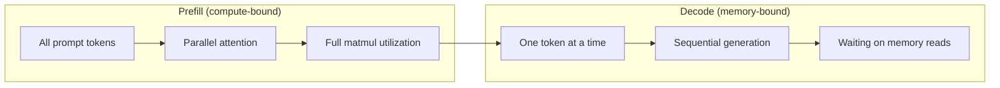
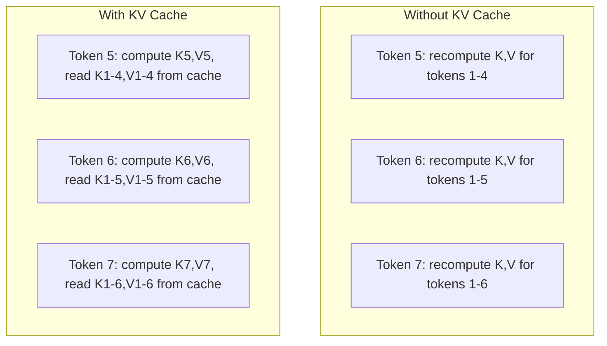
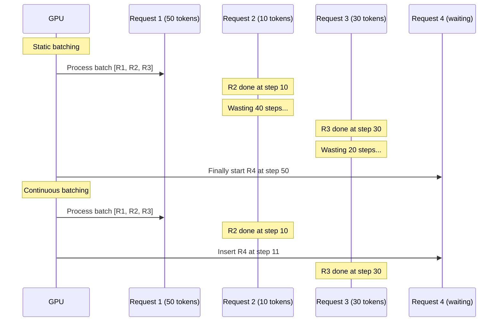
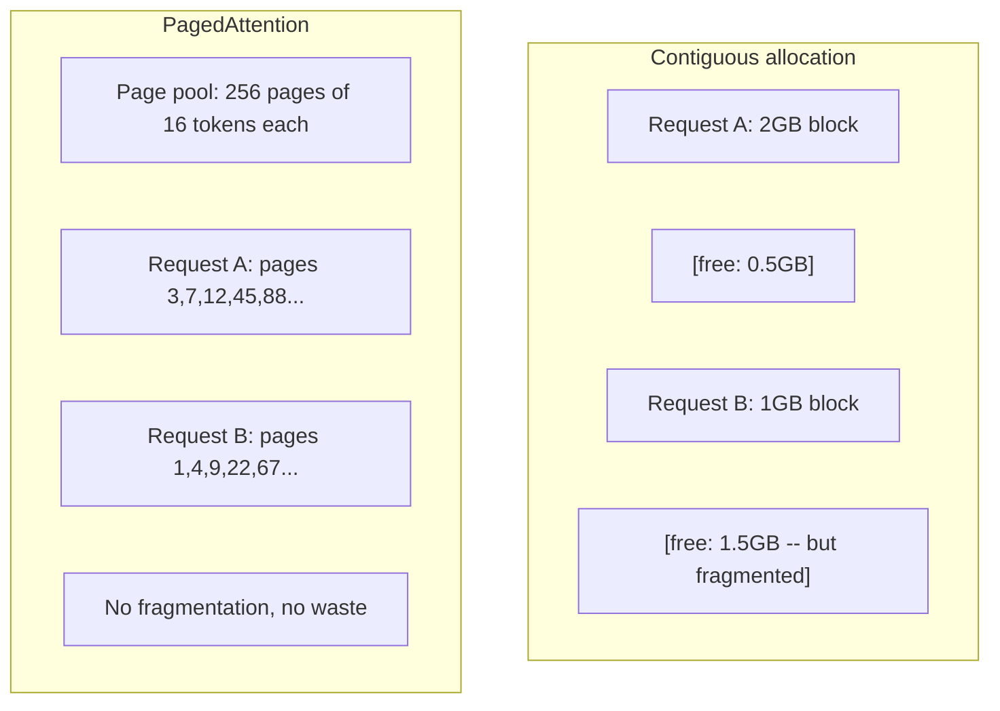
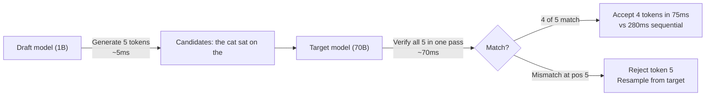

# 推論最佳化

> LLM 推論由兩個階段構成。預填以平行方式處理你的提示詞 —— 運算受限。解碼一次生成一個詞元 —— 記憶體受限。每一項最佳化都針對其中之一，或兩者。

**類型：** 實作
**程式語言：** Python
**先修單元：** 階段 10 · 01-08（Transformer 架構、注意力機制）
**時間：** 約 120 分鐘

## 學習目標

- 實作 KV 快取，消除自迴歸生成詞元過程中的重複運算
- 說明 LLM 推論的預填與解碼兩個階段，以及為何兩者的瓶頸不同（運算受限 vs 記憶體頻寬受限）
- 實作連續批次與 PagedAttention 的概念，在並行請求下把 GPU 使用率推到最高
- 比較各種推論最佳化技術（KV 快取、推測式解碼、flash attention）及其在吞吐量與延遲上的取捨

## 問題所在

你在 4 張 A100 上部署 Llama 3 70B。單一使用者拿到每秒約 50 個詞元，感覺很快。接著 100 個使用者同時打進這個端點，吞吐量掉到每位使用者每秒 3 個詞元。你那筆每月 25,000 美元的 GPU 帳單，回應速度比人打字還慢。

模型本身在 1 個使用者和 100 個使用者之間沒有任何改變。同樣的權重、同樣的架構、同樣的數學。改變的是你怎麼排程這些工作。天真的推論會浪費掉 90% 以上的可用 GPU 算力。一個正在等第 47 個詞元的使用者，會一直佔著整個批次槽位，而 GPU 的記憶體匯流排卻在兩次矩陣乘法之間閒著。同時，另一個新使用者那段 2,000 詞元的提示詞，本來可以拿有用的運算把這段空檔填滿。

這不是規模問題，是排程問題。本單元的技術 —— KV 快取、連續批次、PagedAttention、推測式解碼、前綴快取 —— 正是「每月 25k 美元的推論帳單」與「服務同樣流量卻只要 5k 美元」之間的差別。

vLLM 在 4 張 A100-80GB 上服務 Llama 3 70B，低並行度下可達每位使用者每秒約 50 個詞元；在 100 個並行請求下，靠連續批次與 PagedAttention 仍能維持每位使用者 15-25 TPS。少了這些最佳化，同一批硬體在那個並行度下只有每位使用者 5 TPS。同樣的 GPU、同樣的模型，四倍的吞吐量。

## 核心概念

### 預填 vs 解碼

每一個 LLM 推論請求都有兩個截然不同的階段。

**預填（prefill）** 處理整段輸入提示詞。所有詞元都已知，因此注意力可以在整條序列上平行計算。這是一次大型矩陣乘法 —— GPU 核心一直忙著。瓶頸在運算：你的硬體每秒能交出多少 FLOPS。一張 A100 是 312 TFLOPS（BF16）。在單張 A100 上，替 70B 模型跑一段 4,096 詞元提示詞的預填約需 400ms。

**解碼（decode）** 一次生成一個輸出詞元。每個新詞元都要注意所有先前的詞元，但每次前向傳播只產出一個詞元。權重矩陣的大小和預填時一樣，只是你拿它去乘一個向量而不是一個矩陣。GPU 核心在幾微秒內就算完，然後等下一批權重從記憶體送過來。瓶頸在記憶體頻寬：你能多快把模型權重從 HBM 串流到運算單元。一張 A100 的頻寬是 2 TB/s。一個 FP16 的 70B 模型是 140 GB，把整個模型讀過一次要 70ms —— 這就是單次解碼步驟的下限。



**ops:byte 比值**（也叫算術強度）刻畫了這個取捨。它衡量的是：每從記憶體載入一個位元組，你能做多少次運算。

```
ops:byte ratio = FLOPs per token / bytes read from memory
```

在一批 4,096 個詞元的預填中，每載入一個權重，你會做約 4,096 次乘加運算。比值很高 —— 你是運算受限。在批次大小為 1 的解碼中，每載入一個權重只做約 1 次運算。比值很低 —— 你是記憶體頻寬受限。

最根本的洞見是：*解碼之所以記憶體頻寬受限，是因為你為了產出單一個詞元而讀完了整個模型*。下面每一項最佳化，不是減少你要讀的東西，就是提高每次讀取所處理的詞元批量，再不然就是乾脆避開讀取。

### KV 快取

在注意力運算中，每個詞元的 query 都要注意先前每一個詞元的 key 與 value 向量。沒有快取的話，生成第 N 個詞元就得為前面 N-1 個詞元重算一次 key 與 value 投影。詞元 1 在生成詞元 2 時被投影一次，生成詞元 3 時又一次，生成詞元 4 時再一次。到了第 1,000 個詞元，你已經把詞元 1 投影了整整 999 次。

KV 快取把先前所有詞元的 key 與 value 投影存起來。生成第 N 個詞元時，你只計算詞元 N 的 key 與 value，再把它們和快取中詞元 1 到 N-1 的 K/V 串接起來。



**KV 快取的記憶體公式：**

```
KV cache size = 2 * num_layers * num_kv_heads * head_dim * seq_len * bytes_per_param
```

以 Llama 3 70B 為例（80 層、採用 GQA 的 8 個 KV 頭、head_dim=128、BF16）：

```
per token: 2 * 80 * 8 * 128 * 2 bytes = 327,680 bytes = 320 KB
at 4,096 tokens: 320 KB * 4,096 = 1.28 GB
at 128K tokens: 320 KB * 131,072 = 40 GB
```

Llama 3 70B 上單一段 128K 脈絡的對話就吃掉 40 GB 的 KV 快取 —— 一張 A100 記憶體的一半。100 個並行使用者、每人 4K 詞元的話，光 KV 快取就要 128 GB。這正是為什麼 KV 快取管理是推論最佳化的核心難題。

### 連續批次

靜態批次會先等湊滿 N 個請求，一起處理，並且要等到*所有*請求都跑完才接受新的請求。如果一個請求需要 500 個詞元、另一個只要 10 個，那個短請求跑完之後還得空轉 490 個解碼步驟。

連續批次（也叫迭代層級批次）則是只要有任何請求完成，就立刻把新請求插進這一批。每一個解碼步驟都會重新評估這一批的組成。10 個詞元就結束的請求，馬上會被一個排隊中的請求取代。



吞吐量提升多少，取決於輸出長度的變異程度。長度一致時，連續批次和靜態批次差不多。長度不一時（常見情況），連續批次可以帶來 2 到 5 倍的吞吐量，因為 GPU 槽位永遠不會空著。

### PagedAttention

每個請求的 KV 快取是一整塊連續的記憶體。隨著請求進進出出，記憶體就會碎片化 —— 和作業系統裡的 RAM 碎片一模一樣。一個 4K 詞元的請求需要 1.28 GB 連續空間。就算你總共還空著 2 GB，也可能湊不出 1.28 GB 的*連續*空間。結果不是浪費記憶體，就是拒絕請求。

PagedAttention（出自 vLLM）把作業系統風格的虛擬記憶體套用到 KV 快取上。它不再為每個請求配置一整塊連續記憶體，而是配置固定大小的「分頁」（通常每頁 16 個詞元）。分頁可以落在 GPU 實體記憶體的任何位置，再由一張分頁表把每個請求的邏輯序列位置映射到實體分頁的所在。



PagedAttention 還讓共享前綴能做**寫入時複製（copy-on-write）**。如果 50 個請求共用同一段系統提示詞，那段系統提示詞的 KV 快取分頁只會存一份，由 50 個請求共同參照。只有當某個請求開始分歧（不同的使用者訊息）時，它才會拿到自己的分頁。對於有共享系統提示詞的應用，這大幅削減記憶體用量。

vLLM 回報，透過 PagedAttention 記憶體浪費幾乎為零（約 4%，相較於天真配置的約 60-80%）。

### 推測式解碼

解碼慢，是因為它是序列的 —— 你生成一個詞元，餵回去，再生成下一個。但如果你能便宜地猜出接下來 5 個詞元，然後一次驗證完呢？

推測式解碼用一個小而快的**草稿模型**生成 K 個候選詞元。接著大的**目標模型**在單次前向傳播中處理全部 K 個候選（這看起來就像預填 —— 平行、運算受限、有效率）。如果目標模型同意草稿模型的預測，你就用一次目標模型前向傳播的時間拿到 K 個詞元。如果它在位置 j 不同意，你接受詞元 1 到 j-1，其餘丟棄。



加速幅度取決於**接受率** —— 草稿模型的預測與目標模型吻合的頻率。以 Llama 3 8B 為 Llama 3 70B 打草稿來說，自然語言上的接受率通常落在 70-85%。換算下來是 2 到 3 倍的解碼加速。

推測式解碼有三種做法：

| 方法 | 草稿來源 | 接受率 | 額外開銷 |
|--------|-------------|-----------------|----------|
| Draft-target（Leviathan 等人） | 另一個獨立的小模型 | 70-85% | 草稿模型佔的記憶體 |
| EAGLE（Li 等人） | 目標模型上的輕量頭 | 75-90% | 約 1% 額外參數 |
| N-gram 查表 | 詞元 n-gram 表 | 40-60% | 可忽略 |

**EAGLE** 在目標模型的隱藏狀態之上訓練一個小的自迴歸頭。它用目標模型倒數第二層的特徵來預測下一個詞元的嵌入。因為它操作的是目標模型自己的表徵（而不是另一個模型的），所以能在幾乎不增加記憶體的情況下取得更高的接受率。EAGLE-2 再加上一棵動態草稿樹，會依脈絡調整候選數量。

**N-gram 推測式解碼** 維護一張 n-gram 續寫表，內容來自當前脈絡或事先建好的語料。如果草稿與同一段對話中先前出現過的內容吻合（重複的模式、程式碼、結構化輸出），它就能在零神經網路開銷下命中。平均接受率較低，但每次推測的成本基本上是免費的。

推測式解碼在*數學上是精確的* —— 輸出分布與目標模型的分布完全相同。這不是近似。驗證步驟保證每個被接受的詞元，機率都恰好等於目標模型會賦予它的機率。

### 前綴快取

很多請求共用同一段前綴。聊天機器人的系統提示詞、一段 RAG 脈絡、一組少量範例。沒有前綴快取的話，每個請求都要從頭重算這些共享詞元的 KV 快取。

前綴快取把常見前綴的 KV 快取存起來，跨請求重用。當一個帶著已知前綴的新請求進來時，系統會複製（或參照）快取中的 KV 條目，只計算獨有後綴的 KV。

對一段所有請求共用的 2,000 詞元系統提示詞，前綴快取能替每個請求省下約 400ms 的預填。在每秒 100 個請求的量下，這等於每一秒省下 40 秒的 GPU 運算 —— 超過一整張 GPU 的工作量。

SGLang 的 RadixAttention 用一棵基數樹（trie）實作前綴快取，以詞元內容為前綴建索引。任何與已存前綴吻合的請求，都能免費拿到它的 KV 快取。這棵樹還支援部分前綴吻合 —— 如果你和某個快取條目共用 2,000 個前綴詞元中的 1,500 個，那 1,500 個就能重用，只要重算剩下的 500 個。

### 推論引擎

生產環境的 LLM 服務由三個引擎主導：

| 引擎 | 關鍵創新 | 最適合 |
|--------|---------------|----------|
| vLLM | PagedAttention、連續批次 | 通用型服務，相容性最高 |
| SGLang | RadixAttention（前綴快取）、結構化生成 | 多輪聊天機器人、受限解碼 |
| TensorRT-LLM | NVIDIA 核心融合、FP8 量化 | 在 NVIDIA 硬體上追求單卡最高吞吐量 |

**vLLM** 是預設的起手式。它支援最廣的模型範圍，能在任何 GPU 廠商的硬體上跑（NVIDIA、AMD、Intel），並透過 PagedAttention 加連續批次取得很強的吞吐量。相容 OpenAI 的 API 意味著你可以直接把它換進任何原本呼叫 OpenAI API 的地方。

**SGLang** 建立在與 vLLM 相同的基礎上，但加上了做前綴快取的 RadixAttention，以及一套撰寫結構化 LLM 程式的領域專用語言。如果你的工作負載牽涉多輪對話、工具使用或受限解碼（JSON 輸出、正規表示式引導的生成），SGLang 常靠前綴重用勝過 vLLM 2 到 5 倍。

**TensorRT-LLM** 把模型編譯成最佳化過的 NVIDIA GPU 核心。它會融合運算（把注意力、線性層與激活函式塞進同一個核心）、在 H100 GPU 上使用 FP8，並與 NVIDIA Triton Inference Server 整合以便上線部署。它在 NVIDIA 硬體上能達到最高的單卡吞吐量，但需要較多前置設定，而且只能跑在 NVIDIA GPU 上。

Llama 3 70B 的實測數字（4 張 A100-80GB、BF16）：

| 指標 | vLLM | SGLang | TensorRT-LLM |
|--------|------|--------|---------------|
| 吞吐量（1 位使用者） | 約 50 TPS | 約 55 TPS | 約 65 TPS |
| 吞吐量（100 位使用者） | 合計約 2,500 TPS | 合計約 3,200 TPS | 合計約 3,000 TPS |
| 首字延遲 | 約 400ms | 約 300ms（前綴命中） | 約 350ms |
| 最大脈絡長度 | 128K | 128K | 128K |

### ops:byte 框架

沒有量測就談不上最佳化。ops:byte 比值告訴你自己是運算受限還是記憶體頻寬受限，而這決定了哪些最佳化才有意義。

```
Compute roof: peak FLOPS of the GPU
Memory roof:  peak bandwidth * ops:byte ratio
```

當 ops:byte 低時（解碼、小批次），你撞上的是記憶體頻寬的天花板。加更多算力（更高時脈、更多核心）沒有用。你得減少記憶體讀取（量化、KV 快取壓縮），或是加大批次大小，讓每次讀取攤提到更多有用的工作上。

當 ops:byte 高時（預填、大批次），你撞上的是運算的天花板。最佳化記憶體頻寬沒有用。你需要更快的 GPU、核心融合，或降低精度來擠出更多 FLOPS。

| 情境 | ops:byte | 受限於 | 用什麼最佳化 |
|----------|----------|-------|---------------|
| 預填，batch=1 | ~4,096 | 運算 | 核心融合、FP8 |
| 解碼，batch=1 | ~1 | 記憶體 | 量化、KV 壓縮 |
| 解碼，batch=32 | ~32 | 記憶體 | 加大批次、連續批次 |
| 解碼，batch=256 | ~256 | 轉換中 | 兩者都要顧 |
| 解碼，batch=1024 | ~1,024 | 運算 | 核心融合、張量平行 |

A100 上的交叉點大約在 ops:byte = 156（312 TFLOPS / 2 TB/s）。低於 156 是記憶體頻寬受限，高於 156 是運算受限。連續批次每次迭代塞進更多詞元，就是把解碼往這個交叉點推。

```figure
context-window-slide
```

## 動手實作

### 步驟 1：從零打造 KV 快取

我們要建一個多頭 KV 快取，按層、按頭儲存 key 與 value 投影，並展示記憶體的成長模式。

```python
import numpy as np

class KVCache:
    def __init__(self, num_layers, num_heads, head_dim, max_seq_len, dtype=np.float16):
        self.num_layers = num_layers
        self.num_heads = num_heads
        self.head_dim = head_dim
        self.max_seq_len = max_seq_len
        self.dtype = dtype

        self.k_cache = np.zeros(
            (num_layers, num_heads, max_seq_len, head_dim), dtype=dtype
        )
        self.v_cache = np.zeros(
            (num_layers, num_heads, max_seq_len, head_dim), dtype=dtype
        )
        self.seq_len = 0

    def update(self, layer_idx, new_keys, new_values):
        num_new = new_keys.shape[1]
        end = self.seq_len + num_new
        self.k_cache[layer_idx, :, self.seq_len:end, :] = new_keys
        self.v_cache[layer_idx, :, self.seq_len:end, :] = new_values
        return (
            self.k_cache[layer_idx, :, :end, :],
            self.v_cache[layer_idx, :, :end, :]
        )

    def advance(self, num_tokens):
        self.seq_len += num_tokens

    def memory_bytes(self):
        return self.k_cache.nbytes + self.v_cache.nbytes

    def used_bytes(self):
        per_token = 2 * self.num_layers * self.num_heads * self.head_dim * np.dtype(self.dtype).itemsize
        return per_token * self.seq_len
```

### 步驟 2：搭配 KV 快取的注意力

一個簡化版的多頭注意力，在解碼步驟中使用 KV 快取。

```python
def scaled_dot_product_attention(query, keys, values):
    head_dim = query.shape[-1]
    scores = np.matmul(query, keys.transpose(0, 1, 3, 2)) / np.sqrt(head_dim)
    seq_len_q = scores.shape[-2]
    seq_len_k = scores.shape[-1]
    if seq_len_q > 1:
        mask = np.triu(np.ones((seq_len_q, seq_len_k), dtype=np.float32), k=seq_len_k - seq_len_q + 1)
        scores = scores + mask * (-1e9)
    max_scores = np.max(scores, axis=-1, keepdims=True)
    exp_scores = np.exp(scores - max_scores)
    attn_weights = exp_scores / np.sum(exp_scores, axis=-1, keepdims=True)
    return np.matmul(attn_weights, values)


class MultiHeadAttention:
    def __init__(self, d_model, num_heads):
        self.num_heads = num_heads
        self.head_dim = d_model // num_heads
        scale = np.sqrt(2.0 / d_model)
        self.W_q = np.random.randn(d_model, d_model).astype(np.float32) * scale
        self.W_k = np.random.randn(d_model, d_model).astype(np.float32) * scale
        self.W_v = np.random.randn(d_model, d_model).astype(np.float32) * scale
        self.W_o = np.random.randn(d_model, d_model).astype(np.float32) * scale

    def forward(self, x, kv_cache=None, layer_idx=0):
        batch, seq_len, d_model = x.shape
        Q = np.matmul(x, self.W_q).reshape(batch, seq_len, self.num_heads, self.head_dim).transpose(0, 2, 1, 3)
        K = np.matmul(x, self.W_k).reshape(batch, seq_len, self.num_heads, self.head_dim).transpose(0, 2, 1, 3)
        V = np.matmul(x, self.W_v).reshape(batch, seq_len, self.num_heads, self.head_dim).transpose(0, 2, 1, 3)

        if kv_cache is not None:
            K_full, V_full = kv_cache.update(layer_idx, K[0], V[0])
            K = K_full[np.newaxis, :, :, :]
            V = V_full[np.newaxis, :, :, :]
            if seq_len == 1:
                kv_cache.advance(1)

        attn_out = scaled_dot_product_attention(Q, K, V)
        attn_out = attn_out.transpose(0, 2, 1, 3).reshape(batch, -1, d_model)
        return np.matmul(attn_out, self.W_o)
```

### 步驟 3：連續批次模擬器

這會模擬靜態批次與連續批次在排程上的差異。

```python
import heapq

class Request:
    def __init__(self, request_id, prompt_tokens, output_tokens, arrival_step):
        self.request_id = request_id
        self.prompt_tokens = prompt_tokens
        self.output_tokens = output_tokens
        self.arrival_step = arrival_step
        self.tokens_generated = 0
        self.start_step = None
        self.end_step = None

    def is_done(self):
        return self.tokens_generated >= self.output_tokens


def simulate_static_batching(requests, batch_size):
    step = 0
    completed = []
    queue = list(requests)
    queue.sort(key=lambda r: r.arrival_step)

    while queue:
        batch = []
        while queue and len(batch) < batch_size:
            r = queue.pop(0)
            r.start_step = max(step, r.arrival_step)
            batch.append(r)

        if batch:
            step = max(step, max(r.start_step for r in batch))
            max_output = max(r.output_tokens for r in batch)
            for r in batch:
                r.tokens_generated = r.output_tokens
                r.end_step = step + max_output
            step += max_output
            completed.extend(batch)

    return completed


def simulate_continuous_batching(requests, batch_size):
    step = 0
    completed = []
    queue = sorted(requests, key=lambda r: r.arrival_step)
    queue_idx = 0
    active = []
    waiting = []

    while queue_idx < len(queue) or active or waiting:
        while queue_idx < len(queue) and queue[queue_idx].arrival_step <= step:
            waiting.append(queue[queue_idx])
            queue_idx += 1

        while waiting and len(active) < batch_size:
            r = waiting.pop(0)
            r.start_step = step
            active.append(r)

        if not active:
            if waiting:
                step += 1
                continue
            elif queue_idx < len(queue):
                step = queue[queue_idx].arrival_step
                continue
            else:
                break

        for r in active:
            r.tokens_generated += 1

        done = [r for r in active if r.is_done()]
        for r in done:
            r.end_step = step + 1
            completed.append(r)
        active = [r for r in active if not r.is_done()]

        step += 1

    return completed


def batching_stats(completed):
    latencies = [r.end_step - r.arrival_step for r in completed]
    total_time = max(r.end_step for r in completed) - min(r.arrival_step for r in completed)
    total_tokens = sum(r.output_tokens for r in completed)
    return {
        "avg_latency": np.mean(latencies),
        "p50_latency": np.median(latencies),
        "p99_latency": np.percentile(latencies, 99),
        "total_time": total_time,
        "throughput": total_tokens / total_time if total_time > 0 else 0,
    }
```

### 步驟 4：前綴快取

一個以 trie 為基礎的前綴快取，為共享前綴儲存 KV 條目。

```python
class TrieNode:
    def __init__(self):
        self.children = {}
        self.kv_data = None
        self.hit_count = 0


class PrefixCache:
    def __init__(self, max_entries=1000):
        self.root = TrieNode()
        self.max_entries = max_entries
        self.total_entries = 0
        self.hits = 0
        self.misses = 0

    def _walk(self, token_ids):
        node = self.root
        depth = 0
        for tid in token_ids:
            if tid not in node.children:
                break
            node = node.children[tid]
            depth += 1
        return node, depth

    def lookup(self, token_ids):
        node, depth = self._walk(token_ids)
        if depth > 0:
            self.hits += 1
            current = self.root
            for tid in token_ids[:depth]:
                current = current.children[tid]
                current.hit_count += 1
            kv_entries = []
            current = self.root
            for tid in token_ids[:depth]:
                current = current.children[tid]
                if current.kv_data is not None:
                    kv_entries.append(current.kv_data)
            return depth, kv_entries
        self.misses += 1
        return 0, []

    def insert(self, token_ids, kv_per_token):
        node = self.root
        for i, tid in enumerate(token_ids):
            if tid not in node.children:
                if self.total_entries >= self.max_entries:
                    return i
                node.children[tid] = TrieNode()
                self.total_entries += 1
            node = node.children[tid]
            if i < len(kv_per_token):
                node.kv_data = kv_per_token[i]
        return len(token_ids)

    def hit_rate(self):
        total = self.hits + self.misses
        return self.hits / total if total > 0 else 0.0
```

### 步驟 5：推測式解碼模擬器

我們用可調整的接受率來模擬 draft-target 推測式解碼。

```python
class DraftModel:
    def __init__(self, vocab_size, acceptance_rate=0.8):
        self.vocab_size = vocab_size
        self.acceptance_rate = acceptance_rate

    def generate(self, context, num_tokens):
        tokens = np.random.randint(0, self.vocab_size, size=num_tokens)
        return tokens

    def get_probs(self, context, token):
        probs = np.random.dirichlet(np.ones(self.vocab_size))
        return probs


class TargetModel:
    def __init__(self, vocab_size):
        self.vocab_size = vocab_size

    def get_probs(self, context, tokens=None):
        if tokens is not None:
            return [np.random.dirichlet(np.ones(self.vocab_size)) for _ in tokens]
        return np.random.dirichlet(np.ones(self.vocab_size))


def speculative_decode(draft_model, target_model, context, num_speculative=5,
                       draft_cost=1.0, target_cost=10.0, verify_cost=12.0):
    total_tokens = 0
    total_cost = 0.0
    accepted_counts = []
    context = list(context)

    max_tokens = 100

    while total_tokens < max_tokens:
        draft_tokens = draft_model.generate(context, num_speculative)
        total_cost += draft_cost * num_speculative

        target_probs = target_model.get_probs(context, draft_tokens)
        total_cost += verify_cost

        accepted = 0
        for i, token in enumerate(draft_tokens):
            draft_p = draft_model.get_probs(context + list(draft_tokens[:i]), token)
            target_p = target_probs[i]

            r = np.random.random()
            acceptance_prob = min(1.0, target_p[token] / (draft_p[token] + 1e-10))

            if r < draft_model.acceptance_rate:
                accepted += 1
                context.append(token)
                total_tokens += 1
            else:
                new_token = np.random.choice(draft_model.vocab_size, p=target_p)
                context.append(new_token)
                total_tokens += 1
                break

        accepted_counts.append(accepted)

        if accepted == num_speculative:
            bonus_probs = target_model.get_probs(context)
            bonus_token = np.random.choice(draft_model.vocab_size, p=bonus_probs)
            context.append(bonus_token)
            total_tokens += 1

    sequential_cost = total_tokens * target_cost
    return {
        "total_tokens": total_tokens,
        "speculative_cost": total_cost,
        "sequential_cost": sequential_cost,
        "speedup": sequential_cost / total_cost if total_cost > 0 else 1.0,
        "avg_accepted": np.mean(accepted_counts),
        "acceptance_rate": np.mean(accepted_counts) / num_speculative,
    }


def compare_speculation_strategies(vocab_size=1000, num_trials=20):
    results = {}

    for name, acceptance_rate, spec_tokens in [
        ("Draft-target (8B->70B)", 0.78, 5),
        ("EAGLE", 0.85, 6),
        ("N-gram", 0.50, 4),
        ("No speculation", 0.0, 0),
    ]:
        if spec_tokens == 0:
            results[name] = {
                "speedup": 1.0,
                "acceptance_rate": 0.0,
                "avg_accepted": 0.0,
            }
            continue

        trial_results = []
        for _ in range(num_trials):
            draft = DraftModel(vocab_size, acceptance_rate=acceptance_rate)
            target = TargetModel(vocab_size)
            context = list(np.random.randint(0, vocab_size, size=10))
            result = speculative_decode(draft, target, context, num_speculative=spec_tokens)
            trial_results.append(result)

        results[name] = {
            "speedup": np.mean([r["speedup"] for r in trial_results]),
            "acceptance_rate": np.mean([r["acceptance_rate"] for r in trial_results]),
            "avg_accepted": np.mean([r["avg_accepted"] for r in trial_results]),
        }

    return results
```

### 步驟 6：KV 快取記憶體剖析器

替真實的模型設定計算 KV 快取的記憶體需求。

```python
MODEL_CONFIGS = {
    "Llama-3-8B": {
        "num_layers": 32, "num_kv_heads": 8, "head_dim": 128,
        "model_params_b": 8, "gqa": True,
    },
    "Llama-3-70B": {
        "num_layers": 80, "num_kv_heads": 8, "head_dim": 128,
        "model_params_b": 70, "gqa": True,
    },
    "Llama-3-405B": {
        "num_layers": 126, "num_kv_heads": 8, "head_dim": 128,
        "model_params_b": 405, "gqa": True,
    },
    "Mistral-7B": {
        "num_layers": 32, "num_kv_heads": 8, "head_dim": 128,
        "model_params_b": 7, "gqa": True,
    },
    "GPT-4-est": {
        "num_layers": 120, "num_kv_heads": 96, "head_dim": 128,
        "model_params_b": 1800, "gqa": False,
    },
}


def kv_cache_memory(config, seq_len, dtype_bytes=2):
    per_token = 2 * config["num_layers"] * config["num_kv_heads"] * config["head_dim"] * dtype_bytes
    total = per_token * seq_len
    return {
        "per_token_bytes": per_token,
        "per_token_kb": per_token / 1024,
        "total_bytes": total,
        "total_mb": total / (1024 ** 2),
        "total_gb": total / (1024 ** 3),
    }


def memory_budget(config, gpu_memory_gb, model_dtype_bytes=2, kv_dtype_bytes=2):
    model_memory_gb = config["model_params_b"] * 1e9 * model_dtype_bytes / (1024 ** 3)
    overhead_gb = gpu_memory_gb * 0.1
    available_for_kv = gpu_memory_gb - model_memory_gb - overhead_gb

    if available_for_kv <= 0:
        return {"error": "Model does not fit in GPU memory", "model_memory_gb": model_memory_gb}

    per_token = 2 * config["num_layers"] * config["num_kv_heads"] * config["head_dim"] * kv_dtype_bytes
    max_tokens = int(available_for_kv * (1024 ** 3) / per_token)

    return {
        "gpu_memory_gb": gpu_memory_gb,
        "model_memory_gb": round(model_memory_gb, 1),
        "overhead_gb": round(overhead_gb, 1),
        "available_for_kv_gb": round(available_for_kv, 1),
        "max_total_tokens": max_tokens,
        "max_users_at_2k": max_tokens // 2048,
        "max_users_at_4k": max_tokens // 4096,
        "max_users_at_32k": max_tokens // 32768,
    }
```

## 框架應用

使用 vLLM：

```python
from vllm import LLM, SamplingParams

llm = LLM(
    model="meta-llama/Llama-3-70B-Instruct",
    tensor_parallel_size=4,
    enable_prefix_caching=True,
    max_model_len=8192,
    gpu_memory_utilization=0.9,
)

params = SamplingParams(temperature=0.7, max_tokens=256)
outputs = llm.generate(["Explain inference optimization in one paragraph."], params)
```

用 SGLang 做前綴快取加結構化輸出：

```python
import sglang as sgl

@sgl.function
def classify(s, text):
    s += sgl.system("You are a classifier. Output JSON only.")
    s += sgl.user(f"Classify this text: {text}")
    s += sgl.assistant(sgl.gen("result", regex=r'\{"label": "(positive|negative|neutral)"\}'))

runtime = sgl.Runtime(model_path="meta-llama/Llama-3-70B-Instruct", tp_size=4)
sgl.set_default_backend(runtime)

results = classify.run_batch([
    {"text": "This product is amazing!"},
    {"text": "Terrible experience."},
    {"text": "It was okay I guess."},
])
```

使用 TensorRT-LLM：

```python
import tensorrt_llm
from tensorrt_llm.runtime import ModelRunner

runner = ModelRunner.from_dir("./llama-70b-trt-engine/", rank=0)

outputs = runner.generate(
    batch_input_ids=[tokenizer.encode("Explain KV caching.")],
    max_new_tokens=256,
    temperature=0.7,
)
```

## 產出交付

本單元產出：
- `outputs/skill-inference-optimization.md` —— 一項用來診斷並最佳化 LLM 推論服務的技能

## 練習

1. 修改 KV 快取剖析器，比較 FP16、FP8 與 INT4 的 KV 快取量化。針對 4K 脈絡下的 Llama 3 70B，計算在 4 張 A100-80GB 上每種量化能支撐的最大並行使用者數。把 KV 量化到 INT4 大約能讓使用者容量變成 4 倍。

2. 擴充連續批次模擬器，追蹤 GPU 使用率（每一步中被填滿的批次槽位比例）。用 50 個請求（輸出長度服從 Pareto 分布，shape=1.5、scale=20）分別跑靜態批次與連續批次，把使用率隨時間的變化畫出來。連續批次應該維持在 80% 以上。

3. 實作 KV 快取的分組查詢注意力（GQA）版本，其中 `num_kv_heads < num_query_heads`。Llama 3 70B 用了 64 個 query 頭，但只有 8 個 KV 頭。計算相較於完整多頭注意力省下的記憶體（KV 快取大小縮為 1/8）。

4. 建一個採用 LRU 淘汰的前綴快取。把 max_entries 設為 500，生成 1,000 個請求，其中 60% 共用 5 種常見前綴之一。量測命中率，並與無上限的快取比較。淘汰策略夠好的話，命中率應該維持在 55% 以上。

5. 擴充推測式解碼模擬器，實作樹狀推測（EAGLE-2 風格）。不要只生成單一條 K 個草稿詞元的鏈，而是生成一棵候選樹（例如 3 層、每層 2 個分支 = 8 個葉節點候選）。比較每一輪驗證所接受的詞元總數與線性推測的差異。

## 關鍵術語

| 術語 | 大家怎麼說 | 實際上是什麼 |
|------|----------------|----------------------|
| 預填（prefill） | 「處理提示詞」 | 在所有輸入詞元上平行計算注意力 —— 運算受限，因為完整的矩陣乘法讓 GPU 核心一直有事做 |
| 解碼（decode） | 「生成詞元」 | 每次前向傳播產出一個詞元，而且每次都要讀完整份模型權重 —— 記憶體頻寬受限，因為運算在下一批權重送到之前就結束了 |
| KV 快取 | 「快取注意力狀態」 | 存下先前所有詞元的 key 與 value 投影，讓每個解碼步驟不必重算 —— 以記憶體換運算 |
| 連續批次 | 「動態批次」 | 只要有任何請求完成就把新請求插進執行中的批次，每個解碼迭代都重新評估，而不是等整批跑完 |
| PagedAttention | 「KV 快取的虛擬記憶體」 | 以固定大小的分頁而非連續區塊配置 KV 快取，消除記憶體碎片，並讓共享前綴能寫入時複製 |
| 推測式解碼 | 「草稿加驗證」 | 用快速的草稿模型提出多個詞元，再用目標模型一次前向傳播驗證全部 —— 數學上精確，加速 2 到 3 倍 |
| EAGLE | 「自我推測式解碼」 | 推測式解碼的一種變體，在目標模型自己的隱藏狀態上訓練一個輕量頭，接受率高於使用獨立的草稿模型 |
| 前綴快取 | 「重用系統提示詞的 KV」 | 為常見前綴（系統提示詞、少量範例）存下算好的 KV 快取條目並跨請求重用，跳過重複的預填 |
| ops:byte 比值 | 「算術強度」 | 運算次數與從記憶體讀取位元組數的比值 —— 決定一項工作負載是運算受限（比值高）還是記憶體頻寬受限（比值低） |
| 首字延遲 | 「TTFT」 | 從收到請求到產出第一個輸出詞元的延遲 —— 提示詞長時由預填時間主導 |

## 延伸閱讀

- Kwon et al., "Efficient Memory Management for Large Language Model Serving with PagedAttention" (2023) —— vLLM 論文，提出分頁式 KV 快取管理，如今已是推論服務的業界標準
- Leviathan et al., "Fast Inference from Transformers via Speculative Decoding" (2023) —— 奠基之作，證明「草稿加驗證」式的推測能產生與目標模型完全相同的分布，同時取得 2 到 3 倍加速
- Li et al., "EAGLE: Speculative Sampling Requires Rethinking Feature Uncertainty" (2024) —— 在目標模型自身的特徵上訓練一個頭，而非另用獨立的草稿模型，藉此取得更高的接受率
- Zheng et al., "SGLang: Efficient Execution of Structured Language Model Programs" (2024) —— 提出做前綴快取的 RadixAttention，以及一套針對多次呼叫 LLM 程式的程式設計模型
- Williams et al., "Roofline: An Insightful Visual Performance Model for Multicore Architectures" (2009) —— 屋頂線模型的原始論文，把用來推理運算 vs 記憶體瓶頸的 ops:byte 框架形式化
