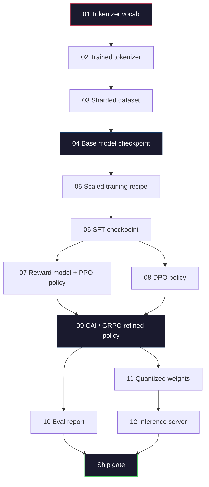
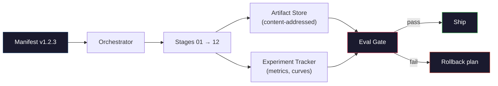

# 打造完整的 LLM 管線

> 單元 01 到 12 的所有內容，都是同一條管線裡的其中一站。本單元就是把那些站串成一次端到端執行的骨架：分詞、預訓練、擴展、SFT、對齊、評估、量化、上線服務。你不會在筆電上訓練一個 70B 模型，你要產出的是編排層、manifest、評估關卡，以及 2026 年前沿團隊用來決定「什麼能出貨」的回滾計畫。這是總結性的一課。

**類型：** 實作
**程式語言：** Python (stdlib)
**先修單元：** 階段 10 · 01-12 全部單元
**時間：** 約 120 分鐘

## 學習目標

- 把前十一個單元（分詞器、資料、預訓練、擴展、SFT、RLHF、DPO、CAI、評估、量化、推論）組合成一份可重現的單一管線規格
- 定義各階段之間的產出物契約：每一階段吃什麼、產出什麼，以及下一階段如何驗證輸入
- 打造一個編排器（orchestrator），能追蹤實驗、對產出物做雜湊，並以評估門檻把關出貨決策
- 設計回滾計畫：哪些產出物重跑很便宜、哪些很貴，以及一個壞掉的檢查點要付出多少代價

## 問題所在

前面每一個單元都能跑。分詞器訓練好了。小型 GPT 預訓練好了。SFT 資料集組好了。獎勵模型訓練好了。DPO 跑過了。評估量測過了。量化權重匯出了。推論伺服器也起來了。但每一個都是一份筆記本，各有各的慣例、各有各的輸出路徑、各有各的隨機種子。

一次前沿訓練不是一份筆記本。Llama 3 405B 在大約 54 天內燒掉 3,000 萬 H100 小時。DeepSeek-V3 用掉約 280 萬 H800 小時。在那段期間，一個壞掉的檢查點、一次資料污染、一次評估退步，都可能讓團隊損失一週的實際時間與一個月的 GPU 預算。團隊能撐過來的方式，就是管線衛生：每一階段都要有確定的輸入、確定的輸出、一份 manifest、一個雜湊值，以及一道關卡。

這是總結性的一課。你不會在筆電上把整條管線端到端跑完。你要寫的是協調各階段的編排器、描述這次執行的 manifest、把關出貨決策的驗證器，以及讓第三方能靠單一檔案重跑你工作的重播計畫。程式碼很少，紀律很多。

這套模式從 100M 到 1T 參數都不用改。同樣的四個元件 —— manifest、編排器、評估關卡、產出物儲存區 —— 既跑得動 Llama 3，也跑得動你的業餘 GPT。差別在於各階段設定檔裡數字的大小，而不在管線的形狀。

## 核心概念

### 十二個階段

階段 10 的每一個單元都是一站。以下是完整的相依圖。



第 07 與第 08 站可以平行跑，其餘都是硬相依。第 02 站（分詞器）一改，下游每一份產出物全部作廢。第 10 站（評估）一改，作廢的只有出貨決策。

### Manifest

manifest 是單一一份檔案，完整到足以描述一次執行、並據以重播。管線產出的任何東西，都不該依賴 manifest 裡沒有的狀態。這些欄位很無聊，而且是必填。

```
pipeline_version: 1.2.3
seed: 42
git_commit: a1b2c3d4
stages:
  01_tokenizer:
    recipe: bpe_32k
    input_hash: sha256:...
    output_hash: sha256:...
    wall_clock_sec: 3600
    cost_usd: 12
```

第 N 站的輸出雜湊，就是第 N+1 站的輸入雜湊。只要對不上，管線就停。這就是你及早抓到資料損毀的方法，也是另一個大陸上的隊友驗證自己重播出來的產出物與你相同的方法。

實務上，團隊會用一份小小的 YAML schema，再加上一個 manifest 檢查器，去和前一次成功執行做 diff。只要出現預期欄位（成本、實際耗時）之外的差異，就是警訊。

### 產出物型別化

每一階段的輸出都是一個有型別的產出物。不是一坨目錄，不是一個 pickle，而是一個有已知 schema 的具名型別。

| 階段 | 產出物型別 | 關鍵欄位 |
|-------|--------------|-----------|
| 01-02 | Tokenizer | vocab.json、merges.txt、config.json、雜湊值 |
| 03 | Dataset | shards[]、列數、詞元數、去重統計 |
| 04-05 | Checkpoint | weights.safetensors、config.json、最佳化器狀態、步數 |
| 06 | SFT Model | 檢查點 + SFT 配方 + 資料配比 |
| 07 | Reward Model | RM 檢查點 + 偏好資料雜湊值 |
| 08-09 | Policy | 檢查點 + 參考模型雜湊值 + beta + 已用掉的 KL 預算 |
| 10 | Eval Report | 基準測試分數 + 退步差異 + 評估資料雜湊值 |
| 11 | Quantized Model | 量化權重 + 校準資料 + 相對於 FP16 的準確度落差 |
| 12 | Server Spec | 端點 + 模型雜湊值 + 設定 + 可觀測性掛鉤 |

型別化能擋掉最常見的失敗模式：把第 08 站的輸出當成第 06 站的輸入，讓一個 DPO 訓練過的模型走 SFT 的路徑出貨。有型別的產出物加上有型別的階段簽章，會讓這類錯誤在編譯期就爆掉，而不是拖到第五天才爆。

### 評估關卡

出貨不等於「訓練跑完了」。出貨是「訓練跑完了，而且通過評估關卡」。這道關卡要在執行開始之前就定義好。

```
gates:
  mmlu:      >= baseline + 0.5   # no regression
  humaneval: >= baseline + 1.0
  truthfulqa: >= baseline         # no drop
  safety_refusal_rate: <= 0.05
  kl_from_reference: <= 25.0
  cost_total_usd: <= 50000
```

每一道關卡都是一個數值門檻。沒有「看起來還行」這種關卡，也沒有主觀的簽核。若每道關卡都過，這份產出物就標記為可出貨。若有任何一道沒過，這次執行就先擱置，等待具名審查者明確覆寫，而這個覆寫本身也會記進 manifest。

有兩道關卡能擋下大部分災難。*退步*關卡（新模型在核心基準上至少要和前一版一樣好）能抓到訓練的臭蟲。*KL 預算*關卡（對齊後的策略偏離參考模型不得超過 X）能抓到對齊過頭。每一條生產級管線都會同時有這兩道。

### 編排器

一小段程式碼，負責讀 manifest、派工給各階段、追蹤產出物，並在任何契約被破壞時停下來。這不是 Airflow，也不是 Kubeflow。談管線衛生時，你要的是一個無聊、而且是自己寫的東西。

編排器的職責很窄：

1. 從 manifest 解出 DAG。
2. 對每一階段，檢查預期的輸出是否已經以正確的雜湊值存在（若有就跳過）。
3. 執行該階段，擷取 stdout/stderr，量測實際耗時與成本。
4. 拿輸出雜湊去比對下游階段預期的輸入雜湊。
5. 失敗時，寫出一份標明確切失敗階段的部分 manifest，並以非零狀態碼結束。

這大約是 200 行 Python，長得就像本單元的 `code/main.py`。實際上，真正的管線底下會用 `torchrun` 或 `ray` 把個別階段丟到叢集上執行，但編排器本身跑在單一台機器上。

### 實驗追蹤與產出物儲存

有兩套外部系統為這條管線定錨。

**實驗追蹤器（wandb、neptune、mlflow）。** 逐階段記錄損失曲線、評估指標與系統遙測。三週後你要比較 A 執行與 B 執行時，就是去翻追蹤器。團隊幾乎都用託管型追蹤器 —— 自己寫一套只是把該花在訓練上的時間浪費掉。

**產出物儲存區（S3、R2、GCS）。** 給檢查點、資料集、分詞器、評估報告用的不可變物件儲存。產出物以雜湊值定址，不以檔名定址。`latest.pt` 這種檔名是自爆按鈕；`ckpt-7b-step-20000-sha256:abc123.safetensors` 才是契約。

編排器會同時寫進這兩邊。追蹤器是給看圖表的人用的，產出物儲存區是給下一階段查輸入用的。

### 成本估算

一次前沿執行後面都掛著一個美元數字。預算紀律發生在兩個地方。

**執行前估算。** 從 manifest 算出預期的 FLOPs（預訓練是 6 x params x tokens）、預期的 GPU 小時數（FLOPs / 尖峰吞吐量 / 使用率），以及以當前租用費率換算的美元成本。若估算超出預算關卡，管線就拒絕啟動。

**執行中追蹤。** 逐階段的實際耗時與成本會記進 manifest。每跑完一個階段就檢查一次剩餘預算。若某階段超支，下一階段的關卡就會用新的剩餘預算來評估。你不會等到創投打電話來才發現錢燒完了。

Llama 3 公布的成本是 6,100 萬美元。DeepSeek-V3 公布主要預訓練執行花了 560 萬美元。差距主要來自硬體效率加上混合專家架構 —— 但之所以看得到具體成本，是因為兩個團隊都是逐階段追蹤，而不是整次執行才算一筆。

### 可重現性 vs 決定性

這兩件事不一樣。*可重現*是指：同一份 manifest、同一份程式碼、同一套基礎架構，會產出一個下游指標等價的檢查點。*決定性*是指：輸出逐位元相同。

現代 LLM 訓練是可重現的，但不是決定性的。分散式訓練的 reduce 順序、GPU 核心的非決定性（cuBLAS、flash-attn），加上混合精度的捨入，合起來會讓兩次執行的浮點數在 1e-5 的量級上有差。對最終指標來說這沒關係，指標不會動。但如果你想靠位元層級的 diff 來除錯，那就致命了。解方是把每一階段的輸入雜湊、輸出雜湊與頭條指標都記下來 —— 只要這些對得上，這次執行就算「重現了」，即使權重不是逐位元相同。



### 回滾計畫

在執行開始之前，就寫下每一階段失敗時該怎麼辦。分成三類。

- **重跑很便宜**（數小時）：分詞器、評估、量化、推論伺服器。直接重跑就好。
- **中等**（數天）：SFT、DPO、CAI。保留基礎模型，只重跑對齊階段。
- **很貴**（數週與數百萬美元）：預訓練。這裡的回滾計畫不是「重跑」，而是「拿最後一個好的檢查點，用修正過的資料重跑比較便宜的下游階段」。

因為階段相依關係有型別也有雜湊，編排器可以自動算出回滾集合：讓失敗的那一站連同它所有的後代一起作廢。第 06 站（SFT）失敗會作廢 06、07、08、09、10、11、12。第 11 站（量化）失敗只作廢 11 與 12。事先把這件事命名清楚，就不必在凌晨四點、團隊筋疲力盡時臨場發揮。

### 2026 年觀察到的生產配方

多數前沿團隊都收斂到同一副骨架。

- 分詞器：128k BPE，附 byte fallback。在一小份、平衡的多語言切片上訓練。
- 預訓練：10-20T 詞元，主要是網頁加程式碼加合成資料。Muon 或 AdamW 最佳化器。FSDP2 或 DeepSpeed ZeRO-3。梯度檢查點。BF16 權重，FP32 主副本。
- SFT：50 萬到 200 萬組指令對，人工與合成混合，並嚴格對評估集去重。
- 對齊：DPO 或 CAI + GRPO。只有在偏好訊號對 DPO 來說維度太多時才用 RLHF。
- 評估：MMLU-Pro、MATH、HumanEval+、GPQA、SWE-Bench Verified、LiveBench，外加一份外界永遠看不到的私有保留集。
- 量化：上線服務用 4-bit GPTQ 或 AWQ；在準確度落差要緊的安全性評估上用 8-bit。
- 服務：vLLM、TensorRT-LLM，或自建。連續批次。推測式解碼。KV 快取淘汰。

數字每半年就變，骨架不變。

```figure
beam-search
```

## 動手實作

本單元的程式碼是一個編排器與一個 manifest 檢查器，不是十二份訓練腳本。每一階段都用一個佔位程式模擬，產生形狀與雜湊值都正確的輸出產出物。把編排器端到端跑一遍，就能在燒 GPU 的錢跑真實階段之前，證明管線的水電管路是通的。

完整實作請看 `code/main.py`。幾個關鍵部件：

- `Manifest` dataclass：管線版本、隨機種子、git commit、階段、關卡。
- `Stage` dataclass：名稱、型別、輸入（雜湊值）、輸出（雜湊值）、實際耗時、成本。
- `Orchestrator.run()`：解出 DAG、派工給各階段、驗證雜湊值、更新 manifest。
- `EvalGate.check()`：讀取門檻，與最新的評估報告比對，回傳通過或不通過。
- `ArtifactStore`（記憶體內的樁）：以雜湊值 put/get，模擬 S3。
- `CostTracker`：逐階段與累計成本，超過上限就停。

`main.py` 裡的管線會跑十二個佔位階段、產出一份 manifest，並刻意觸發一次不通過的評估關卡，讓你看看被擱置的執行長什麼樣子。把每個佔位程式換成對應單元裡真正的訓練腳本，你就有了一條真實前沿管線所使用的骨架。

## 框架應用

標準工作流程有三個指令。

```
python code/main.py plan    # validate manifest, compute cost estimate, print DAG
python code/main.py run     # execute stages, writing to manifest.out.yaml
python code/main.py gate    # read manifest.out.yaml, apply eval gates, ship-or-hold
```

每次都先跑 `plan`。大多數管線臭蟲都在 plan 階段就會現形 —— 漏掉的關卡門檻、過期的雜湊值、超支的預算。跑 `plan` 不用錢，跑 `run` 很貴。在便宜的那一側抓到臭蟲，就是在省錢。

`gate` 的輸出不是 `SHIP` 就是 `HOLD: <reason>`。被擱置的執行不算失敗，而是一個決策點。由一位具名審查者選擇覆寫（覆寫會被記錄下來），或是核可回滾。

## 產出交付

本單元產出 `outputs/skill-llm-pipeline-reviewer.md`。餵給它一份提案中的管線 manifest，它會檢查所有契約：階段型別、雜湊鏈、關卡、回滾計畫、成本估算。若 manifest 少了評估關卡、KL 預算沒有上限，或這次執行混用了評估與訓練資料，它會拒絕核可。

## 練習

1. 擴充編排器，支援第 07 與第 08 站平行執行。使用標準函式庫的 `concurrent.futures` 模組。確認最終的 manifest 記錄了兩個階段的輸出，而且第 09 站的輸入雜湊是這兩者的確定性組合。

2. 加一道「污染檢查」關卡。給定評估資料集的雜湊值與訓練資料集的分片，計算兩者重疊程度（精確字串比對或 13-gram 比對）。重疊超過 0.1% 就不通過。餵它一份被污染的訓練集，確認關卡會擱置這次執行。

3. 從第一性原理實作一個成本估算器。對第 04 站（預訓練），把 FLOPs 估為 6 x params x tokens，假設在 989 TFLOPs BF16 的 H100 上達到 40% MFU（模型 FLOPs 使用率），費率 $2.50/GPU-hour。回報一個 7B 模型在 2T 詞元上訓練的估算值，並與 Llama 2 公布的數字比較。

4. 做一次部分回滾。模擬第 09 站（CAI）失敗，然後重跑第 09 到 12 站，同時讓 01-08 維持快取狀態。編排器應該要靠雜湊值認出已快取的產出物並跳過它們。量測相較於整條重跑省下的實際時間。

5. 加上可觀測性。為每一階段送出 OpenTelemetry span，屬性包含參數量、看過的詞元數、損失與成本。把這些 span 導到一個本地 collector。重點不是儀表板，重點是每一階段的健康狀況都能從單一個 trace ID 追出來。

## 關鍵術語

| 術語 | 大家怎麼說 | 實際上是什麼 |
|------|----------------|----------------------|
| Manifest | 「那份配方檔」 | 描述管線版本、隨機種子、逐階段設定與關卡門檻的 YAML 或 JSON —— 足以重播一次執行 |
| 內容定址 | 「靠雜湊不靠名字」 | 產出物以其內容的 SHA-256 為位址儲存，讓你永遠不會把版本 A 和版本 B 搞混 |
| 評估關卡 | 「出貨標準」 | 在基準指標與安全性分數上的數值門檻，全部通過後產出物才會標記為可出貨 |
| KL 預算 | 「對齊漂了多遠」 | 對各對齊階段累計的 KL(policy \|\| reference) 設上限，以關卡形式強制執行 |
| MFU | 「你用掉了 GPU 的多少」 | Model FLOPs Utilization（模型 FLOPs 使用率）—— 實際達到的 FLOPs 除以理論尖峰。70B 規模典型是 40%，7B 是 55% |
| 回滾計畫 | 「壞掉時我們怎麼辦」 | 事先寫好的、每一階段失敗時的行動集合：重跑、退回上一版，或用修正過的輸入重訓 |
| 編排器 | 「指揮」 | 讀 manifest、派工給各階段、驗證雜湊值，並在任何契約被破壞時停下來的那個程序 |
| 產出物儲存區 | 「權重專用的版本化 S3」 | 不可變、內容定址的物件儲存 —— 檢查點、資料集、評估報告的唯一真實來源 |
| 可重現 | 「重播得到同樣的指標」 | 位元層級的權重不同，但下游指標等價 —— 這是分散式 LLM 訓練實際做得到的目標 |
| 成本關卡 | 「不准超過 X」 | 執行前的成本估算加上執行中的追蹤器 —— 估算若超出預算，管線就拒絕啟動 |

## 延伸閱讀

- [Dubey et al., 2024 -- "The Llama 3 Herd of Models"](https://arxiv.org/abs/2407.21783) —— 目前公開資料中對前沿管線描述最詳盡的一份，涵蓋資料、訓練、對齊與評估
- [DeepSeek-AI, 2024 -- "DeepSeek-V3 Technical Report"](https://arxiv.org/abs/2412.19437) —— 效率優先的管線，成本大約是 Llama 3 等級訓練的十分之一
- [Kaplan et al., 2020 -- "Scaling Laws for Neural Language Models"](https://arxiv.org/abs/2001.08361) —— 算力、資料、參數之間擴展關係的原始論文
- [Hoffmann et al., 2022 -- "Training Compute-Optimal Large Language Models (Chinchilla)"](https://arxiv.org/abs/2203.15556) —— 對 Kaplan 的修正，重新校準了現代的資料預算
- [PyTorch FSDP2 documentation](https://pytorch.org/docs/stable/fsdp.html) —— 在 PyTorch 2.4+ 中取代 FSDP1 的分散式訓練原語
- [Weights & Biases LLM Reports](https://wandb.ai/site/llms) —— 開源 LLM 執行的真實 manifest 與實驗追蹤器輸出，可直接拿來當範本套用
