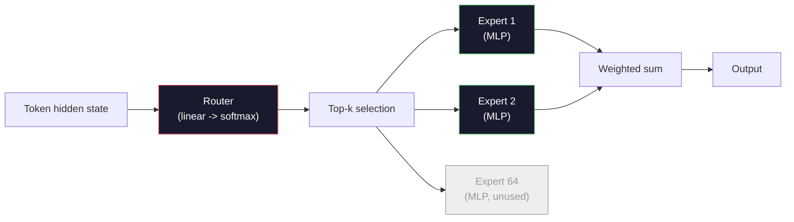

# 開放模型：架構逐步解析

> 你在第 04 課從零打造了一個 GPT-2 Small。2026 年的前沿開放模型就是同一個家族，只多了五、六項具體改動。用 RMSNorm 取代 LayerNorm。用 SwiGLU 取代 GELU。用 RoPE 取代學習式位置編碼。用 GQA 或 MLA 取代完整的 MHA。到了大規模就上專家混合。你已經會的數學涵蓋了其中 95%。本課把 Llama 3、DeepSeek-V3、Mixtral、Qwen 與 Gemma 並排來讀，指名每個架構分岔的確切那一行。

**類型：** 學習
**程式語言：** Python (stdlib)
**先修單元：** 階段 10 · 第 04、05、12 課（預訓練、擴展、推論）
**時間：** 約 45 分鐘

## 學習目標

- 讀懂 Llama 3、Mistral、Mixtral、Gemma 2、Qwen 2.5 與 DeepSeek-V3 的 config.json，並解釋每一個欄位
- 指出每個模型相對於 GPT-2 Small 做了哪項具體的架構改動，並從第一原理說明其理由
- 只憑 config 就算出任一開放模型的參數量、KV 快取大小與激活值記憶體
- 在延遲、記憶體與能力的限制下，替某個部署目標挑對開放模型

## 問題所在

在第 04 課，你寫了 350 行 numpy，得到一個 GPT-2 形狀的模型。Llama 3 405B 則有一份 200 頁的技術報告。你的直覺會說這是兩種不同的東西。並不是。那 200 頁描述的是同一個物件，加上五、六項有充分動機的修改，再加上上千個關於規模化的實作細節。骨架 —— 嵌入、transformer 區塊、注意力、MLP、正規化、輸出頭 —— 完全沒變。

本課是一份 diff。對每個主要的開放模型家族，我們列出它相對於 GPT-2 到底改了什麼、為什麼改、代價是什麼。讀完之後，你看到一張新的 model card，就能在腦中把它翻譯回 GPT-2 這個基準。

實際的報酬是：當 Meta 發表 Llama 5、DeepSeek 發表 V4 時，你不需要一套新的心智模型。你只要看 config，找出那些眾所周知的旋鈕哪幾個被轉動了，就知道後續會有什麼影響。2026 年的架構是一個有限的工具箱。每個新模型只是挑了不同的子集。

## 核心概念

### 不變的核心

所有自迴歸開放模型都共用：

- 詞元嵌入矩陣（vocab_size x hidden_dim）。
- N 個解碼器區塊堆疊：正規化、自注意力、殘差、正規化、MLP、殘差。
- 最後的正規化與投影到 vocab_size 的線性輸出頭（常與嵌入權重共享）。
- 因果遮罩、下一個詞元的交叉熵損失。

這就是形狀。其餘的都是旋鈕。

### 真正會動的六個旋鈕

在 2024-2026 的每一個前沿開放模型裡，同樣的六個設計選擇被反覆挑選：

1. **正規化。** LayerNorm -> RMSNorm。
2. **位置編碼。** 學習式絕對位置 -> RoPE（外加各種變體：YaRN、NTK）。
3. **激活函式。** GELU -> SwiGLU（或 GeGLU）。
4. **注意力頭共享。** MHA -> GQA -> MQA -> MLA。
5. **稠密 vs 稀疏 MLP。** 稠密 -> 專家混合。
6. **Pre-norm 的位置。** Pre-norm 留下來。Post-norm 消失了。

其他一切（學習率排程、資料混合、批次大小、上下文長度）都住在訓練設定裡，不在架構裡。就六個旋鈕。

### 旋鈕 1：RMSNorm

LayerNorm 減去平均值、除以標準差、縮放、再平移。RMSNorm 只留下縮放這一步：

```
RMSNorm(x) = x / sqrt(mean(x^2) + eps) * gamma
```

不減平均值。沒有偏置項。每個詞元少一次矩陣乘法。Zhang 與 Sennrich（2019）主張它在機器翻譯上與 LayerNorm 打平，卻快了 10%。每個現代開放模型都在跑它。

代價：沒有。好處：小幅吞吐量提升，程式碼更簡單。

### 旋鈕 2：RoPE

在 GPT-2 裡，學習式位置嵌入是一張 1024 格的查表。上下文位置 1025 就掉出表外了。模型無法外推到訓練長度之外。

旋轉位置編碼（RoPE，Su et al. 2021）在注意力點積之前，成對旋轉每個 Q 與 K 向量來注入位置資訊。旋轉角度是位置的確定性函式，所以沒有東西要學，也沒有東西會用完。搭配縮放技巧（NTK-aware 內插、YaRN），一個在 8k 上下文訓練的模型可以在推論時延展到 128k，準確度只掉一點。

```
q_rotated = rotate(q, angle(pos))
k_rotated = rotate(k, angle(pos))
score = q_rotated . k_rotated
```

每一個 Llama、Mistral、Qwen、DeepSeek 與 Gemma 都使用 RoPE。Gemma 2 用的是混合式（大多數層用 RoPE，其餘層用局部滑動視窗注意力）。

### 旋鈕 3：SwiGLU

GPT-2 的 MLP 是 `x -> gelu(xW1 + b1) -> (...)W2 + b2`。SwiGLU（Shazeer 2020）把激活函式換成一個帶閘門的乘積：

```
SwiGLU(x) = (xW1) * sigmoid(xW1) * xV
```

兩個平行的投影而不是一個，由 Swish 激活來控制閘門。在每參數的困惑度上，實證表現更強。Llama 2 採用了它，其他人跟進。MLP 的隱藏維度通常會設定成讓總參數量與原本的稠密 MLP 相當：如果 GPT-2 用的是 `ff_dim = 4 * hidden`，SwiGLU 就用 `ff_dim = (2/3) * 4 * hidden = 8/3 * hidden`。

### 旋鈕 4：注意力頭共享

GPT-2 使用 **多頭注意力（MHA）**：每個頭都有自己的 Q、K、V 投影。

**多查詢注意力（MQA，Shazeer 2019）** 讓所有頭共用一組 K 與一組 V。把 KV 快取縮小 num_heads 倍，在典型模型上是 12 到 32 倍的減量。在困難的評測上準確度會略降。

**分組查詢注意力（GQA，Ainslie et al. 2023）** 是折衷方案：G 組 Q 頭共用一個 K 與一個 V。Llama 3 8B 使用 GQA，有 32 個 Q 頭與 8 個 KV 頭（G=8），所以 KV 快取比完整 MHA 縮小 4 倍。

**多頭潛在注意力（MLA，DeepSeek 2024）** 把 K 與 V 壓縮成一個共用的低秩潛在表示，再逐頭投影回去。在保留每個頭表達力的同時進一步縮小 KV 快取。DeepSeek-V2 與 V3 的長上下文表現就靠這個。

| 方案 | KV 頭數 | KV 快取 | 準確度 |
|--------|----------|----------|----------|
| MHA    | num_heads | 完整 | 最佳 |
| GQA    | num_groups（G < num_heads） | 縮小 num_heads / G 倍 | 接近 MHA |
| MQA    | 1 | 縮小 num_heads 倍 | 略有損失 |
| MLA    | 潛在表示，逐頭解壓 | 比 MQA 更小 | 接近 MHA |

對任何超過約 13B 參數的模型，GQA 或 MLA 實質上是必備的。在這種規模跑完整 MHA 就是 KV 快取的災難。

### 旋鈕 5：專家混合

稠密 MLP 對每個詞元都會啟用全部參數。MoE MLP 在每個區塊裡有 K 個專家，加上一個路由器，替每個詞元挑出 top-k 個專家（通常是 top-2）。只有那些專家的權重會為該詞元做一次前向傳播。

```
router_logits = xW_r
indices, weights = top_k(router_logits, k=2)
output = sum_i weights[i] * expert[indices[i]](x)
```

吸引力在於：你可以有 64 個各 7B 大小的專家（所以總參數量很龐大），卻每個詞元只跑其中 2 個（所以每詞元的運算量等同一個稠密的 7B 模型）。Mixtral 8x7B 有 47B 總參數，但每個詞元只啟用 13B。DeepSeek-V3 有 671B 總參數，但每個詞元只啟用 37B。



優點：同樣的運算量、更多參數、更好的容量。缺點：專家的權重仍然得住在某個地方（所以服務時需要的 VRAM 比同等的稠密模型多），路由器的負載平衡很難做，而在對齊階段微調路由器本身又是一個獨立的研究領域。

### 旋鈕 6：Pre-norm 留下來

最初的 transformer 在每個子層之後才做層正規化。GPT-2 之後的每個開放模型都把它放在每個子層*之前*。在深層網路上，pre-norm 明顯更好訓練。這點沒什麼好爭的。

### 逐一模型的 Diff

下面這張表讓上述一切變得具體。

| 模型 | 年份 | 總參數量 | 啟用參數量 | 正規化 | 激活函式 | 位置編碼 | 注意力 | MoE | 上下文長度 |
|-------|------|-------------|---------------|------|-----------|----------|-----------|-----|---------|
| GPT-2 Small | 2019 | 124M | 124M | LayerNorm | GELU | 學習式 | MHA（12 頭） | 否 | 1k |
| Llama 3 8B | 2024 | 8B | 8B | RMSNorm | SwiGLU | RoPE | GQA (32/8) | 否 | 128k |
| Llama 3 70B | 2024 | 70B | 70B | RMSNorm | SwiGLU | RoPE | GQA (64/8) | 否 | 128k |
| Llama 3 405B | 2024 | 405B | 405B | RMSNorm | SwiGLU | RoPE | GQA (128/16) | 否 | 128k |
| Mistral 7B | 2023 | 7.2B | 7.2B | RMSNorm | SwiGLU | RoPE | GQA | 否 | 32k |
| Mixtral 8x7B | 2023 | 47B | 13B | RMSNorm | SwiGLU | RoPE | GQA | 是（8 個專家，top-2） | 32k |
| Gemma 2 9B | 2024 | 9B | 9B | RMSNorm（pre+post） | GeGLU | RoPE + 滑動視窗 | GQA | 否 | 8k |
| Qwen 2.5 72B | 2024 | 72B | 72B | RMSNorm | SwiGLU | RoPE (YaRN) | GQA (64/8) | 否 | 128k |
| DeepSeek V2 236B | 2024 | 236B | 21B | RMSNorm | SwiGLU | RoPE | MLA | 是（160 個專家，top-6） | 128k |
| DeepSeek V3 | 2024 | 671B | 37B | RMSNorm | SwiGLU | RoPE | MLA | 是（256 個專家，top-8） | 128k |

掃過這些欄位。RMSNorm 是通例。SwiGLU 或它的表親 GeGLU 是通例。RoPE 是通例。7B 以上 GQA 是通例，除非被 MLA 取代。MoE 則是頂端那一層的分水嶺。

### 讀一份 config.json

Llama 3 8B 的 config：

```
{
  "hidden_size": 4096,
  "intermediate_size": 14336,
  "num_hidden_layers": 32,
  "num_attention_heads": 32,
  "num_key_value_heads": 8,
  "max_position_embeddings": 131072,
  "rope_theta": 500000.0,
  "rms_norm_eps": 1e-5,
  "vocab_size": 128256
}
```

每個欄位都對應到你已經實作過的東西。

- `hidden_size`：嵌入維度。
- `intermediate_size`：MLP 隱藏維度（hidden 的 3.5 倍 —— SwiGLU 的算法）。
- `num_hidden_layers`：堆疊深度。
- `num_attention_heads`：Q 頭數。
- `num_key_value_heads`：KV 頭數（GQA）。
- `max_position_embeddings`：訓練時的上下文長度。
- `rope_theta`：RoPE 的基礎頻率。Meta 把它從預設的 10k 調高到 500k，以利長上下文外推。
- `rms_norm_eps`：數值穩定性。
- `vocab_size`：詞元數量。

只憑這些，你就能算出總參數量、KV 快取與峰值激活值記憶體。確切的公式見 `code/main.py`。

### 激活值記憶體預算

在數十億參數以上，激活值主宰了訓練記憶體。預訓練的經驗法則（含梯度檢查點）是：

```
activation_mem ~ batch_size * seq_len * hidden_size * num_layers * bytes_per_element
```

以 Llama 3 8B、batch 1、seq 8192、BF16、32 層、hidden 4096 為例：有檢查點時光激活值大約 8 GB，沒有的話 40 GB。這就是為什麼 flash-attention 與 ring-attention 重要 —— 它們重寫了注意力的計算方式，好讓激活值塞得下。

### KV 快取預算

以最大上下文推論來說：

```
kv_cache = 2 * num_layers * num_kv_heads * head_dim * max_seq_len * bytes_per_element
```

Llama 3 8B 在 128k 上下文、BF16、head_dim = hidden / num_heads = 128：
每條序列 `2 * 32 * 8 * 128 * 131072 * 2 = 17.2 GB`。

8B 的權重在 BF16 下是 16 GB。單一條 128k 序列的 KV 快取比權重還大。這正是推動 GQA、MLA 與 KV 快取量化研究的記憶體壓力。

### 各個模型什麼時候勝出

- **單張 80GB GPU、不用 MoE**：Llama 3 8B、Mistral 7B、Gemma 2 9B。容易服務，工具生態完整。
- **單一節點（8x80GB）、要大容量**：Llama 3 70B、Qwen 2.5 72B。稠密開放模型中能力最高。
- **要最強的開放能力、能接受 MoE 的複雜度**：DeepSeek V3、Mixtral 8x22B。每個啟用 FLOP 換到的能力最好。
- **長上下文需求**：Llama 3（搭配 RoPE 縮放可到 128k）、DeepSeek（MLA 的優勢）。
- **低延遲服務**：Gemma 2 9B（滑動視窗降低了長上下文的運算量）。

```figure
rmsnorm-vs-layernorm
```

## 動手實作

本課的程式碼是一台計算機。給它任何一份 config.json，它就印出各元件的參數量、最大上下文下的 KV 快取、SwiGLU 的 MLP 比例，以及對該架構的簡短判定（稠密 / GQA / MLA / MoE）。

```python
config = {
    "hidden_size": 4096, "intermediate_size": 14336,
    "num_hidden_layers": 32, "num_attention_heads": 32,
    "num_key_value_heads": 8, "vocab_size": 128256,
    "max_position_embeddings": 131072,
}
```

這支腳本逐欄位走過整個架構，計算嵌入、注意力（含 GQA 的減量）、MLP（含 SwiGLU 的擴張）、layernorm 與輸出頭的參數量。接著它算出在指定上下文長度下的 KV 快取，並印出摘要。

實作見 `code/main.py`。

## 框架應用

拿腳本內建的 Llama 3 8B、Mistral 7B、Mixtral 8x7B 與 DeepSeek V3 設定跑這台計算機。比較各自的參數拆解。注意 MoE 模型的總參數量遠超稠密模型，但啟用參數量往往還更小。也注意 DeepSeek V3 的 KV 快取比 Llama 3 405B 更小，儘管總參數量更多 —— 這就是 MLA 的作用。

接著填入你本機任何一個模型的 config，讀摘要，判斷它裝不裝得進你的 GPU。

## 產出交付

本課產出 `outputs/skill-open-model-picker.md`。給定一個部署目標（GPU 型號、VRAM、上下文長度、延遲預算）與一種任務輪廓（聊天、程式碼、推理、長上下文），它會推薦一個開放模型、一套來自第 11 課的量化方案，以及一組來自第 12 課的推論堆疊，並明確地就六個架構旋鈕給出理由。

## 練習

1. 從 HuggingFace 讀取 Qwen 2.5 72B 的 config。從零算出總參數量。與 HF 公布的數字比對，找出任何差異的來源（head dim 取整、KV 共享係數等等）。

2. DeepSeek V3 使用 256 個專家、top-8 路由。算出啟用專家佔全部專家的比例，並與 Mixtral 8x7B 的 8 選 2 比較。從稀疏（25%）走向更稀疏（3%），對每個 FLOP 換到的容量意味著什麼？

3. 分別以 FP8 與 BF16 算出 Llama 3 405B 在 128k 上下文下的 KV 快取。FP8 是 BF16 數字的一半。在單一個 8xH100 節點（每張 80GB，共 640GB，扣掉權重記憶體）上，你能同時服務幾條平行序列？

4. Gemma 2 交替使用完整注意力層與滑動視窗注意力層。寫出當一半的層改用 4096 詞元滑動視窗而非完整上下文時，KV 快取的算式。在總共 8k 上下文下，這能省多少記憶體？

5. 找一個在本課寫成之後才發表的前沿開放模型。指出它挑了六個旋鈕中的哪幾個，以及它是否引入了第七個旋鈕。新架構一發表，這份課程內容就會顯得過時 —— 目標是讓你能更新自己的表格，而不必重建心智模型。

## 關鍵術語

| 術語 | 大家怎麼說 | 實際上是什麼 |
|------|----------------|----------------------|
| RMSNorm | 「沒有平均值的 LayerNorm」 | 只用均方根做正規化，搭配一個可學習的縮放 —— 比 LayerNorm 便宜且效果相當 |
| RoPE | 「旋轉位置」 | 依位置決定的角度，把每個 Q 與 K 向量在二維成對旋轉 —— 搭配縮放技巧可外推到訓練長度之外 |
| SwiGLU | 「新的 MLP 激活函式」 | 帶 Swish 的閘控線性單元：`(xW1) * sigmoid(xW1) * xV` —— 2024 年之後每個開放模型的標準配備 |
| GQA | 「折衷的注意力」 | 分組查詢注意力：G 組 Q 頭共用一個 K 與一個 V 頭 —— 縮小 KV 快取又不像 MQA 那樣掉準確度 |
| MLA | 「DeepSeek 的注意力」 | 多頭潛在注意力：把 K/V 壓成共用的低秩潛在表示，再逐頭解壓 —— 大模型上最小的 KV 快取 |
| MoE | 「稀疏專家」 | 專家混合：每個區塊有 N 個 MLP，路由器替每個詞元挑 top-k —— 總參數量巨大，啟用參數量很小 |
| Top-k 路由 | 「每個詞元挑 k 個專家」 | 路由器替每個專家算一個分數，啟用分數最高的 k 個 —— 典型的 k 從 2（Mixtral）到 8（DeepSeek） |
| YaRN | 「把 RoPE 拉長」 | Yet another RoPE extension —— 內插旋轉角度，在推論時把上下文從 8k 延展到 128k 以上 |
| 滑動視窗注意力 | 「不要什麼都去注意」 | 每個詞元只注意最近的 W 個詞元 —— 把每詞元的注意力成本壓在 O(W)，Gemma 2 與早期 Mistral 都用 |
| 啟用參數量 | 「每個詞元真的跑到的部分」 | 對 MoE 模型而言，每個詞元會做前向傳播的參數量（遠小於總參數量）—— 決定每詞元的 FLOPs |

## 延伸閱讀

- [Dubey et al., 2024 -- "The Llama 3 Herd of Models"](https://arxiv.org/abs/2407.21783) —— 稠密 Llama 3 家族的架構與訓練參考
- [DeepSeek-AI, 2024 -- "DeepSeek-V3 Technical Report"](https://arxiv.org/abs/2412.19437) —— MLA 加上無輔助損失的負載平衡，加上 671B 的 MoE
- [Jiang et al., 2024 -- "Mixtral of Experts"](https://arxiv.org/abs/2401.04088) —— MoE 開放模型的經典論文
- [Su et al., 2021 -- "RoFormer: Enhanced Transformer with Rotary Position Embedding"](https://arxiv.org/abs/2104.09864) —— RoPE 論文
- [Shazeer, 2020 -- "GLU Variants Improve Transformer"](https://arxiv.org/abs/2002.05202) —— SwiGLU、GeGLU 與同類
- [Ainslie et al., 2023 -- "GQA: Training Generalized Multi-Query Transformer Models"](https://arxiv.org/abs/2305.13245) —— GQA 論文
- [Gemma 2 Team, 2024 -- "Gemma 2: Improving Open Language Models at a Practical Size"](https://arxiv.org/abs/2408.00118) —— 完整注意力與滑動視窗的混合，pre+post-norm
- [Qwen Team, 2024 -- "Qwen 2.5 Technical Report"](https://arxiv.org/abs/2412.15115) —— YaRN 的上下文延展與長上下文訓練配方
