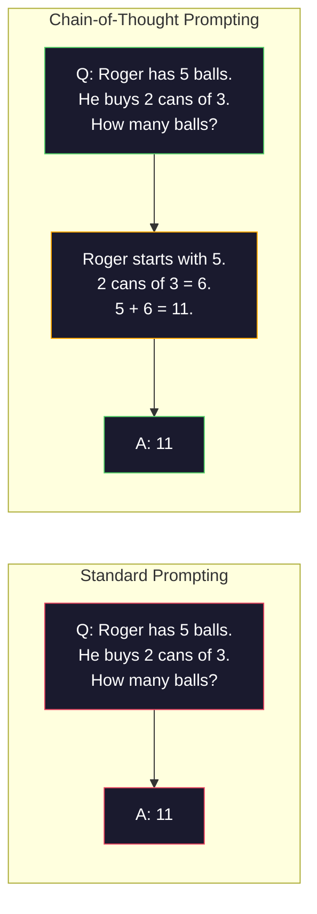
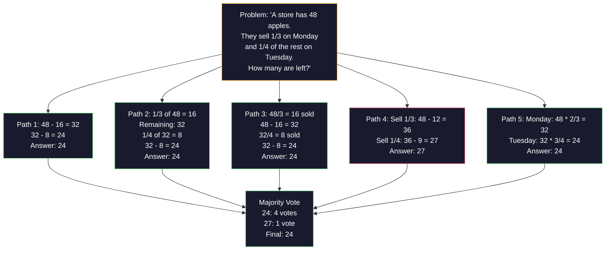
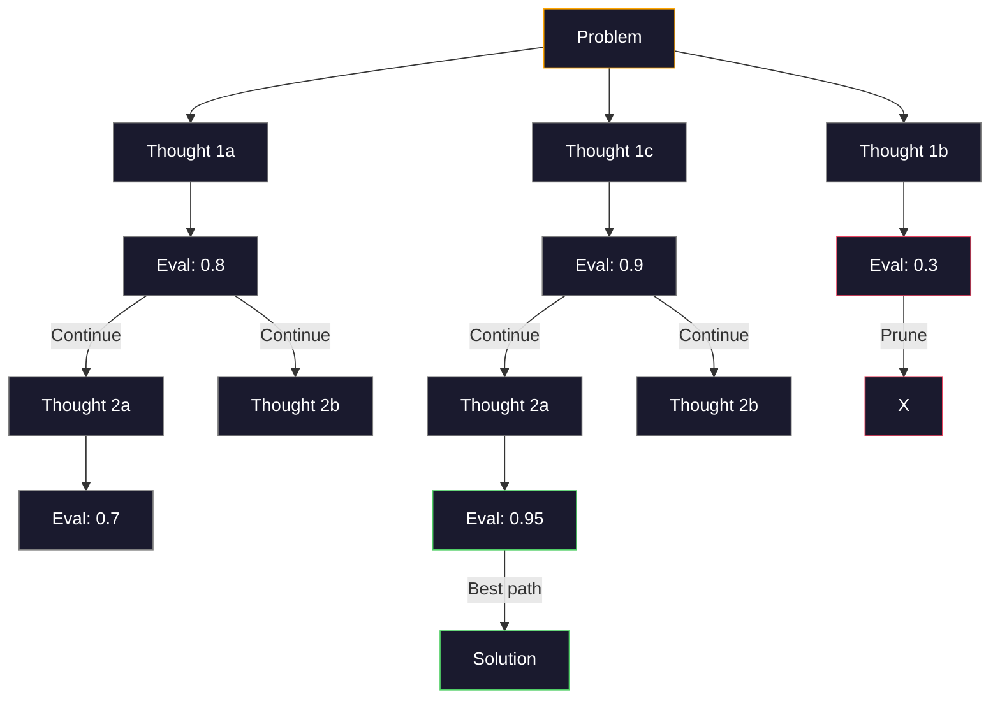
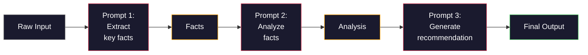

# 少樣本、思維鏈、思維樹

> 告訴模型要做什麼，那是下提示詞。示範它該怎麼思考，那是工程。同一個模型、同一個任務、同一批資料，正確率從 78% 到 91% 的差距不是來自更好的模型，而是來自更好的推理策略。

**類型：** 實作
**程式語言：** Python
**先修單元：** 第 11.01 課（提示詞工程）
**時間：** 約 45 分鐘

## 學習目標

- 實作少樣本提示：挑選並編排能最大化任務正確率的示範範例
- 運用思維鏈（CoT）推理，提升數學文字題這類多步驟問題的正確率
- 建構一個思維樹提示詞，探索多條推理路徑並挑出最好的那一條
- 在標準基準上量測零樣本、少樣本與 CoT 之間的正確率提升

## 問題所在

你在做一個數學家教應用。你的提示詞寫著：「Solve this word problem.」GPT-5 在 GSM8K（標準的小學數學基準）上有 94% 的正確率。你以為已經到頂了。其實沒有 —— 思維鏈還能再加 3-4 個百分點。

加上五個字 ——「Let's think step by step」—— 正確率就跳到 91%。再加幾個做過的範例，就到 95%。同一個模型、同一個溫度、同樣的 API 成本。唯一的差別是你給了模型一張演算紙。

這不是什麼小聰明，而是推理本來的運作方式。人類不會在一次心智跳躍裡解掉多步驟問題，transformer 也不會。當你強迫模型生成中間詞元時，那些詞元就變成下一個詞元的上下文。每一個推理步驟餵養下一步。模型是真的一路「算」到答案的。

但「think step by step」是起點，不是終點。如果你取樣五條推理路徑然後多數投票呢？如果你讓模型探索一整棵可能性的樹，一邊評估一邊剪枝呢？如果你把推理和工具使用交織在一起呢？這些都不是假設，而是已發表、有量測結果的技術，而這一課你會把它們全部做出來。

## 核心概念

### 零樣本對少樣本：什麼時候範例勝過指令

零樣本提示只給模型一個任務，別的什麼都不給。少樣本提示會先給它範例。

Wei et al.（2022）在 8 個基準上量測了這件事。像情感分類這種簡單任務，零樣本和少樣本的表現差距在 2% 以內。但在多步驟算術與符號推理這類複雜任務上，少樣本讓正確率提升了 10-25%。

直覺是這樣的：範例是被壓縮過的指令。你不必描述輸出格式，直接展示它；不必解釋推理過程，直接示範它。模型對範例做模式比對，比它去解讀抽象指令來得可靠。


**少樣本勝出的時候：** 對格式敏感的任務、分類、結構化抽取、特定領域術語，以及任何模型需要對上特定模式的任務。

**零樣本勝出的時候：** 簡單的事實性問題、範例反而會限制創意的創作型任務，以及那些「找好範例比寫好指令更難」的任務。

### 範例的挑選：相似勝過隨機

範例並非生而平等。挑選與目標輸入相似的範例，在分類任務上比隨機挑選好 5-15%（Liu et al., 2022）。三個原則：

1. **語意相似度**：挑嵌入空間裡離輸入最近的範例
2. **標籤多樣性**：讓範例涵蓋所有輸出類別
3. **難度匹配**：對上目標問題的複雜度

多數任務的最佳範例數是 3-5 個。少於 3 個，模型沒有足夠訊號去抽出模式；多於 5 個，你會碰到報酬遞減，還浪費上下文視窗的詞元。標籤很多的分類任務，就每個標籤放一個範例。

### 思維鏈：給模型一張演算紙

思維鏈（Chain-of-Thought, CoT）提示由 Google Brain 的 Wei et al.（2022）提出。想法很簡單：不要只問模型答案，先要它把推理步驟寫出來。



從機制上看，為什麼這有效？transformer 生成的每一個詞元都會變成下一個詞元的上下文。沒有 CoT 時，模型必須把所有推理壓進單次前向傳遞的隱藏狀態裡。有了 CoT，模型把中間計算外化成詞元。每一個推理詞元都延伸了有效的計算深度。

**GSM8K 基準（小學數學，8.5K 道題）：**

| 模型 | 零樣本 | 零樣本 CoT | 少樣本 CoT |
|-------|-----------|---------------|--------------|
| GPT-4o | 78% | 91% | 95% |
| GPT-5 | 94% | 97% | 98% |
| o4-mini（推理） | 97% | — | — |
| Claude Opus 4.7 | 93% | 97% | 98% |
| Gemini 3 Pro | 92% | 96% | 98% |
| Llama 4 70B | 80% | 89% | 94% |
| DeepSeek-V3.1 | 89% | 94% | 96% |

**關於推理模型的提醒。** 像 OpenAI 的 o 系列（o3、o4-mini）和 DeepSeek-R1 這類模型，會在給出答案之前內部就跑過思維鏈。對推理模型再加一句「Let's think step by step」是多餘的，有時甚至反效果 —— 它們早就做過了。

CoT 有兩種口味：

**零樣本 CoT**：在提示詞後面接上「Let's think step by step」。不需要範例。Kojima et al.（2022）證明，光這一句話就能在算術、常識與符號推理任務上全面提升正確率。

**少樣本 CoT**：提供包含推理步驟的範例。比零樣本 CoT 更有效，因為模型看得到你期待的確切推理格式。

**CoT 會扯後腿的時候**：單純的事實回想（「法國的首都是哪裡？」）、單步驟分類，以及速度比正確率更重要的任務。CoT 每次查詢會多出 50-200 個詞元的推理開銷。對高吞吐量、低複雜度的任務來說，那是浪費掉的成本。

### 自我一致性：多次取樣，一次投票

Wang et al.（2023）提出了自我一致性（self-consistency）。洞見是：單一條 CoT 路徑可能含有推理錯誤。但如果你取樣 N 條獨立的推理路徑（用溫度 > 0），再對最終答案做多數投票，錯誤就會互相抵消。



在最初的 PaLM 540B 實驗中，自我一致性把 GSM8K 正確率從 56.5%（單條 CoT）提升到 N=40 時的 74.4%。在 GPT-5 上提升幅度很小（97% 到 98%），因為基礎正確率已經飽和。這個技術在基礎 CoT 正確率 60-85% 的模型上最能發揮 —— 那是單路徑錯誤頻繁但又非系統性的甜蜜點。對推理模型（o 系列、R1）來說，自我一致性已經被內建的內部取樣吸收掉了。

代價是：N 次取樣就是 N 倍的 API 成本與延遲。實務上，N=5 已經吃到大部分好處。N=3 是有意義投票的下限。對多數任務而言，N > 10 就報酬遞減了。

### 思維樹：分支式探索

Yao et al.（2023）提出思維樹（Tree-of-Thought, ToT）。CoT 沿著一條線性推理路徑走，而 ToT 探索多個分支，並在繼續之前評估哪些最有希望。



ToT 有三個組成部分：

1. **想法生成**：產出多個候選的下一步
2. **狀態評估**：給每個候選評分（可以用 LLM 自己當評估者）
3. **搜尋演算法**：以 BFS 或 DFS 走過這棵樹，剪掉低分分支

在 Game of 24 任務（用四則運算把 4 個數字湊成 24）上，GPT-4 用標準提示只解出 7.3% 的題目。用 CoT 是 4.0%（在這裡 CoT 反而有害，因為搜尋空間很寬）。用 ToT 則是 74%。

ToT 很貴。樹上每一個節點都要一次 LLM 呼叫。分支因子 3、深度 3 的樹最多需要 39 次 LLM 呼叫。只在搜尋空間大但可評估的問題上用它 —— 規劃、解謎、帶約束的創意問題解決。

### ReAct：思考 + 行動

Yao et al.（2022）把推理軌跡和行動結合起來。模型在思考（生成推理）與行動（呼叫工具、搜尋、計算）之間交替。

```mermaid
graph LR
    Q["Question:\nWhat is the\npopulation of the\ncountry where\nthe Eiffel Tower\nis located?"]
    T1["Thought: I need to\nfind which country\nhas the Eiffel Tower"]
    A1["Action: search\n'Eiffel Tower location'"]
    O1["Observation:\nParis, France"]
    T2["Thought: Now I need\nFrance's population"]
    A2["Action: search\n'France population 2024'"]
    O2["Observation:\n68.4 million"]
    T3["Thought: I have\nthe answer"]
    F["Answer:\n68.4 million"]

    Q --> T1 --> A1 --> O1 --> T2 --> A2 --> O2 --> T3 --> F

    style Q fill:#1a1a2e,stroke:#ffa500,color:#fff
    style T1 fill:#1a1a2e,stroke:#51cf66,color:#fff
    style A1 fill:#1a1a2e,stroke:#e94560,color:#fff
    style O1 fill:#1a1a2e,stroke:#808080,color:#fff
    style T2 fill:#1a1a2e,stroke:#51cf66,color:#fff
    style A2 fill:#1a1a2e,stroke:#e94560,color:#fff
    style O2 fill:#1a1a2e,stroke:#808080,color:#fff
    style T3 fill:#1a1a2e,stroke:#51cf66,color:#fff
    style F fill:#1a1a2e,stroke:#51cf66,color:#fff
```



在知識密集的任務上，ReAct 勝過純 CoT，因為它能把推理錨定在真實資料上。在 HotpotQA（多跳問答）上，ReAct 搭配 GPT-4 拿到 35.1% 的完全匹配，純 CoT 只有 29.4%。真正的威力在於推理錯誤會被觀察結果修正 —— 模型可以在執行過程中更新自己的計畫。

ReAct 是現代 AI 代理的基礎。每一個代理框架（LangChain、CrewAI、AutoGen）都實作了某種版本的思考－行動－觀察迴圈。你會在階段 14 建出完整的代理，這一課先講提示詞層面的模式。

### 結構化提示：XML 標籤、分隔符、標題

提示詞一複雜起來，結構能防止模型搞混各個區段。三種做法：

**XML 標籤**（在 Claude 上效果最好，在各家都很穩）：
```
<context>
You are reviewing a pull request.
The codebase uses TypeScript and React.
</context>

<task>
Review the following diff for bugs, security issues, and style violations.
</task>

<diff>
{diff_content}
</diff>

<output_format>
List each issue with: file, line, severity (critical/warning/info), description.
</output_format>
```

**Markdown 標題**（通用）：
```
## Role
Senior security engineer at a fintech company.

## Task
Analyze this API endpoint for vulnerabilities.

## Input
{api_code}

## Rules
- Focus on OWASP Top 10
- Rate each finding: critical, high, medium, low
- Include remediation steps
```

**分隔符**（最精簡但有效）：
```
---INPUT---
{user_text}
---END INPUT---

---INSTRUCTIONS---
Summarize the above in 3 bullet points.
---END INSTRUCTIONS---
```

### 提示詞串接：循序分解

有些任務對單一提示詞來說太複雜。提示詞串接把它切成幾步，前一個提示詞的輸出成為下一個的輸入。



串接勝過單一提示詞有三個理由：

1. **每一步都更簡單**：模型處理一個聚焦的任務，而不是同時兼顧所有事
2. **中間輸出可以檢查**：你能在步驟之間驗證與修正
3. **不同步驟可以用不同模型**：抽取用便宜的模型，推理用貴的

### 效能比較

| 技術 | 最適用於 | GSM8K 正確率（GPT-5） | API 呼叫次數 | 詞元開銷 | 複雜度 |
|-----------|----------|------------------------|-----------|----------------|------------|
| 零樣本 | 簡單任務 | 94% | 1 | 無 | 極低 |
| 少樣本 | 格式匹配 | 96% | 1 | 200-500 詞元 | 低 |
| 零樣本 CoT | 快速拉高推理力 | 97% | 1 | 50-200 詞元 | 極低 |
| 少樣本 CoT | 單次呼叫的最高正確率 | 98% | 1 | 300-600 詞元 | 低 |
| 自我一致性（N=5） | 高風險推理 | 98.5% | 5 | 5 倍詞元成本 | 中 |
| 推理模型（o4-mini） | CoT 的直接替代 | 97% | 1 | 隱藏（內部 2-10 倍） | 極低 |
| 思維樹 | 搜尋／規劃問題 | 不適用（Game of 24 上 74%） | 10-40+ | 10-40 倍詞元成本 | 高 |
| ReAct | 以知識為基礎的推理 | 不適用（HotpotQA 上 35.1%） | 3-10+ | 視情況而定 | 高 |
| 提示詞串接 | 複雜的多步驟任務 | 96%（管線） | 2-5 | 2-5 倍詞元成本 | 中 |

該用哪個技術取決於三件事：正確率要求、延遲預算、成本容忍度。對多數生產系統來說，少樣本 CoT 加上 3 次取樣的自我一致性作為後備，就涵蓋了 90% 的使用場景。

```figure
few-shot-curve
```

## 實作

我們會做一個數學解題器，把少樣本提示、思維鏈推理和自我一致性投票整合成單一管線。然後再為難題加上思維樹。

完整實作在 `code/advanced_prompting.py`。以下是關鍵元件。

### 步驟 1：少樣本範例庫

第一個元件負責管理少樣本範例，並為給定的問題挑出最相關的那些。

```python
GSM8K_EXAMPLES = [
    {
        "question": "Janet's ducks lay 16 eggs per day. She eats three for breakfast every morning and bakes muffins for her friends every day with four. She sells every egg at the farmers' market for $2. How much does she make every day at the farmers' market?",
        "reasoning": "Janet's ducks lay 16 eggs per day. She eats 3 and bakes 4, using 3 + 4 = 7 eggs. So she has 16 - 7 = 9 eggs left. She sells each for $2, so she makes 9 * 2 = $18 per day.",
        "answer": "18"
    },
    ...
]
```

每個範例有三部分：問題、推理鏈、最終答案。推理鏈就是把普通少樣本範例變成 CoT 少樣本範例的關鍵。

### 步驟 2：思維鏈提示詞建構器

提示詞建構器把系統訊息、帶推理鏈的少樣本範例，以及目標問題組成單一提示詞。

```python
def build_cot_prompt(question, examples, num_examples=3):
    system = (
        "You are a math problem solver. "
        "For each problem, show your step-by-step reasoning, "
        "then give the final numerical answer on the last line "
        "in the format: 'The answer is [number]'."
    )

    example_text = ""
    for ex in examples[:num_examples]:
        example_text += f"Q: {ex['question']}\n"
        example_text += f"A: {ex['reasoning']} The answer is {ex['answer']}.\n\n"

    user = f"{example_text}Q: {question}\nA:"
    return system, user
```

格式約束（「The answer is [number]」）非常關鍵。少了它，自我一致性就無法在多次取樣之間抽出並比較答案。

### 步驟 3：自我一致性投票

取樣 N 條推理路徑，取多數答案。

```python
def self_consistency_solve(question, examples, client, model, n_samples=5):
    system, user = build_cot_prompt(question, examples)

    answers = []
    reasonings = []
    for _ in range(n_samples):
        response = client.chat.completions.create(
            model=model,
            messages=[
                {"role": "system", "content": system},
                {"role": "user", "content": user}
            ],
            temperature=0.7
        )
        text = response.choices[0].message.content
        reasonings.append(text)
        answer = extract_answer(text)
        if answer is not None:
            answers.append(answer)

    vote_counts = Counter(answers)
    best_answer = vote_counts.most_common(1)[0][0] if vote_counts else None
    confidence = vote_counts[best_answer] / len(answers) if best_answer else 0

    return best_answer, confidence, reasonings, vote_counts
```

溫度 0.7 很重要。在溫度 0.0 下，N 次取樣全都一樣，整個做法就失去意義。你需要足夠的隨機性來產生多樣的推理路徑，但又不能多到讓模型輸出胡言亂語。

### 步驟 4：思維樹解題器

對於線性推理會失敗的問題，ToT 探索多種思路，並評估哪個方向最有希望。

```python
def tree_of_thought_solve(question, client, model, breadth=3, depth=3):
    thoughts = generate_initial_thoughts(question, client, model, breadth)
    scored = [(t, evaluate_thought(t, question, client, model)) for t in thoughts]
    scored.sort(key=lambda x: x[1], reverse=True)

    for current_depth in range(1, depth):
        next_thoughts = []
        for thought, score in scored[:2]:
            extensions = extend_thought(thought, question, client, model, breadth)
            for ext in extensions:
                ext_score = evaluate_thought(ext, question, client, model)
                next_thoughts.append((ext, ext_score))
        scored = sorted(next_thoughts, key=lambda x: x[1], reverse=True)

    best_thought = scored[0][0] if scored else ""
    return extract_answer(best_thought), best_thought
```

評估者本身就是一次 LLM 呼叫。你問模型：「On a scale of 0.0 to 1.0, how promising is this reasoning path for solving the problem?」這正是 ToT 的核心洞見 —— 模型評估自己的部分解。

### 步驟 5：完整管線

管線把所有技術串起來，配上一套逐級升壓策略。

```python
def solve_with_escalation(question, examples, client, model):
    system, user = build_cot_prompt(question, examples)
    single_response = call_llm(client, model, system, user, temperature=0.0)
    single_answer = extract_answer(single_response)

    sc_answer, confidence, _, _ = self_consistency_solve(
        question, examples, client, model, n_samples=5
    )

    if confidence >= 0.8:
        return sc_answer, "self_consistency", confidence

    tot_answer, _ = tree_of_thought_solve(question, client, model)
    return tot_answer, "tree_of_thought", None
```

升壓邏輯是：先試便宜的（單條 CoT）。如果自我一致性的信心低於 0.8（5 次取樣裡同意的少於 4 次），就升級到 ToT。這在成本與正確率之間取得平衡 —— 大多數問題便宜地解掉，難題才拿到更多算力。

## 實務應用

### 模板驅動的少樣本提示詞

LangChain 內建支援提示詞模板與輸出解析，能簡化少樣本與 CoT 模式：

```python
from langchain_core.prompts import FewShotPromptTemplate, PromptTemplate
from langchain_openai import ChatOpenAI

example_prompt = PromptTemplate(
    input_variables=["question", "reasoning", "answer"],
    template="Q: {question}\nA: {reasoning} The answer is {answer}."
)

few_shot_prompt = FewShotPromptTemplate(
    examples=examples,
    example_prompt=example_prompt,
    suffix="Q: {input}\nA: Let's think step by step.",
    input_variables=["input"]
)

llm = ChatOpenAI(model="gpt-4o", temperature=0.7)
chain = few_shot_prompt | llm
result = chain.invoke({"input": "If a train travels 120 km in 2 hours..."})
```

LangChain 也有 `ExampleSelector` 類別可以做語意相似度挑選：

```python
from langchain_core.example_selectors import SemanticSimilarityExampleSelector
from langchain_openai import OpenAIEmbeddings

selector = SemanticSimilarityExampleSelector.from_examples(
    examples,
    OpenAIEmbeddings(),
    k=3
)
```

### 編譯出來的提示詞

DSPy 把提示策略當成可最佳化的模組。你不必手工打造 CoT 提示詞，只要定義一個 signature，讓 DSPy 去最佳化提示詞：

```python
import dspy

dspy.configure(lm=dspy.LM("openai/gpt-4o", temperature=0.7))

class MathSolver(dspy.Module):
    def __init__(self):
        self.solve = dspy.ChainOfThought("question -> answer")

    def forward(self, question):
        return self.solve(question=question)

solver = MathSolver()
result = solver(question="Janet's ducks lay 16 eggs per day...")
```

DSPy 的 `ChainOfThought` 會自動加上推理軌跡。`dspy.majority` 則實作了自我一致性：

```python
result = dspy.majority(
    [solver(question=q) for _ in range(5)],
    field="answer"
)
```

### 比較：從零打造對上框架

| 功能 | 從零打造（本課） | LangChain | DSPy |
|---------|--------------------------|-----------|------|
| 對提示詞格式的控制 | 完全 | 基於模板 | 自動 |
| 自我一致性 | 手動投票 | 手動 | 內建（`dspy.majority`） |
| 範例挑選 | 自訂邏輯 | `ExampleSelector` | `dspy.BootstrapFewShot` |
| 思維樹 | 自訂樹搜尋 | 社群鏈 | 未內建 |
| 提示詞最佳化 | 手動迭代 | 手動 | 自動編譯 |
| 最適合 | 學習、自訂管線 | 標準工作流程 | 研究、最佳化 |

## 產出

這一課會產出兩份成品。

**1. 推理鏈提示詞**（`outputs/prompt-reasoning-chain.md`）：一份可直接上生產的少樣本 CoT 加自我一致性提示詞模板。把你的範例和問題領域填進去即可。

**2. CoT 模式挑選技能**（`outputs/skill-cot-patterns.md`）：一套決策框架，依任務類型、正確率要求與成本限制來挑選正確的推理技術。

## 練習

1. **量測落差**：拿 10 道 GSM8K 題目。分別用零樣本、少樣本、零樣本 CoT 與少樣本 CoT 各解一次。記下每種的正確率。哪個技術在你的模型上提升最多？

2. **範例挑選實驗**：對同樣 10 道題，比較隨機挑範例與手工挑選相似範例。量測正確率差異。從哪個點開始，範例的品質比數量更重要？

3. **自我一致性的成本曲線**：對 20 道 GSM8K 題目跑 N=1、3、5、7、10 的自我一致性。畫出正確率對成本（總詞元數）的曲線。你的模型的曲線膝點在哪裡？

4. **做一個 ReAct 迴圈**：為管線加上一個計算器工具。當模型生成數學表達式時，用 Python 的 `eval()`（放在沙箱裡）執行它，再把結果餵回去。量測以工具為依據的推理是否勝過純 CoT。

5. **把 ToT 用在創意任務上**：把思維樹解題器改用在一個創意寫作任務上：「Write a 6-word story that is both funny and sad.」用 LLM 當評估者。分支式探索產出的創意輸出，會比單次生成更好嗎？

## 關鍵術語

| 術語 | 大家怎麼說 | 它實際上是什麼 |
|------|----------------|----------------------|
| 少樣本提示（Few-shot prompting） | 「給它幾個範例」 | 在提示詞裡放入輸入－輸出示範，用來錨定模型的輸出格式與行為 |
| 思維鏈（Chain-of-Thought） | 「讓它一步一步想」 | 誘導出中間推理詞元，在給出最終答案前延伸模型的有效計算量 |
| 自我一致性（Self-Consistency） | 「多跑幾次」 | 在溫度 > 0 下取樣 N 條多樣的推理路徑，再用多數投票挑出最常出現的最終答案 |
| 思維樹（Tree-of-Thought） | 「讓它探索各種選項」 | 對推理分支做結構化搜尋：每個部分解都被評分，只有有希望的路徑才被展開 |
| ReAct | 「思考 + 工具使用」 | 在思考－行動－觀察迴圈裡，把推理軌跡與外部行動（搜尋、計算、API 呼叫）交織起來 |
| 提示詞串接（Prompt chaining） | 「拆成幾步」 | 把複雜任務分解成一連串提示詞，每一個的輸出餵給下一個的輸入 |
| 零樣本 CoT（Zero-shot CoT） | 「加一句 think step by step 就好」 | 在提示詞後接上一句推理觸發語、完全不給範例，靠的是模型潛在的推理能力 |

## 延伸閱讀

- [Chain-of-Thought Prompting Elicits Reasoning in Large Language Models](https://arxiv.org/abs/2201.11903) —— Wei et al. 2022。Google Brain 最早的 CoT 論文。核心結果看第 2-3 節。
- [Self-Consistency Improves Chain of Thought Reasoning in Language Models](https://arxiv.org/abs/2203.11171) —— Wang et al. 2023。自我一致性的論文。表 1 就有你需要的所有數字。
- [Tree of Thoughts: Deliberate Problem Solving with Large Language Models](https://arxiv.org/abs/2305.10601) —— Yao et al. 2023。ToT 論文。第 4 節的 Game of 24 結果是重點。
- [ReAct: Synergizing Reasoning and Acting in Language Models](https://arxiv.org/abs/2210.03629) —— Yao et al. 2022。現代 AI 代理的基礎。第 3 節解釋思考－行動－觀察迴圈。
- [Large Language Models are Zero-Shot Reasoners](https://arxiv.org/abs/2205.11916) —— Kojima et al. 2022。那篇「Let's think step by step」論文。以它的簡單程度來說，效果好得驚人。
- [DSPy: Compiling Declarative Language Model Calls into Self-Improving Pipelines](https://arxiv.org/abs/2310.03714) —— Khattab et al. 2023。把下提示詞當成編譯問題來處理。想走出手動提示詞工程的話就讀它。
- [OpenAI — Reasoning models guide](https://platform.openai.com/docs/guides/reasoning) —— 供應商的指引，說明思維鏈何時變成內建、按詞元計價的「推理」模式，而不只是提示詞層級的技巧。
- [Lightman et al., "Let's Verify Step by Step" (2023)](https://arxiv.org/abs/2305.20050) —— 過程獎勵模型（PRM），為推理鏈的每一步打分；這是接手「只看結果」獎勵的推理監督訊號。
- [Snell et al., "Scaling LLM Test-Time Compute Optimally" (2024)](https://arxiv.org/abs/2408.03314) —— 系統性研究 CoT 長度、自我一致性取樣與 MCTS；當正確率比延遲重要時，「一步一步想」會走到哪裡去。
