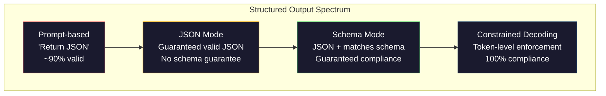
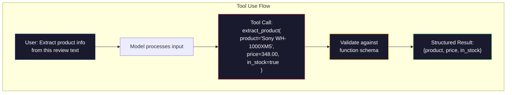

# 結構化輸出：JSON、Schema 驗證、受約束解碼

> 你的 LLM 回傳一個字串。你的應用需要 JSON。這道落差搞掛的生產系統，比任何模型幻覺都多。結構化輸出是自然語言與有型別資料之間的橋。做對了，你的 LLM 就變成一個可靠的 API；做錯了，你會在凌晨三點用正規表達式去解析自由文字。

**類型：** 實作
**程式語言：** Python
**先修單元：** 階段 10，第 01-05 課（從零打造 LLM）
**時間：** 約 90 分鐘
**相關單元：** 階段 5 · 20（結構化輸出與受約束解碼）講的是解碼器層級的理論（FSM/CFG logit 處理器、Outlines、XGrammar）。這一課聚焦在生產級的 SDK 介面（OpenAI `response_format`、Anthropic tool use、Instructor）—— 如果你想搞懂 API 底下發生了什麼，先讀階段 5 · 20。

## 學習目標

- 用 OpenAI 與 Anthropic 的 API 參數實作 JSON 模式與 schema 受約束的輸出
- 建一層 Pydantic 驗證，擋掉格式錯誤的 LLM 輸出，並帶著錯誤訊息重試
- 說明受約束解碼如何在詞元層級強制產出合法 JSON，完全不需要後處理
- 設計穩健的抽取提示詞，可靠地把非結構化文字轉成有型別的資料結構

## 問題所在

你問 LLM：「Extract the product name, price, and availability from this text.」它回覆：

```
The product is the Sony WH-1000XM5 headphones, which cost $348.00 and are currently in stock.
```

這是個完全正確的答案。它對你的應用來說也完全沒用。你的庫存系統需要的是 `{"product": "Sony WH-1000XM5", "price": 348.00, "in_stock": true}`。你要的是一個帶特定鍵、特定型別、特定值約束的 JSON 物件，不是一句話。

天真的解法：在提示詞裡加一句「Respond in JSON」。這在 90% 的情況下有效。剩下的 10%，模型會把 JSON 包在 markdown 圍籬裡、或加一句「Here's the JSON:」的開場白、或因為括號提早閉合而產出語法不合法的 JSON。你的 JSON 解析器爆掉。你的管線壞掉。你加了 try/except 和一個重試迴圈。重試有時給出不一樣的資料。現在你除了解析問題，還多了一個一致性問題。

這不是提示詞工程的問題，是解碼的問題。模型從左到右生成詞元。在每個位置上，它從 100K+ 個選項的詞彙表裡挑出最可能的下一個詞元。在任何給定位置上，那些選項大多都會產出不合法的 JSON。如果模型剛剛吐出 `{"price":`，下一個詞元就必須是數字、引號（字串用）、`null`、`true`、`false` 或負號。其他任何東西都會產出不合法的 JSON。少了約束，模型可能挑出一個從英文角度完全合理、但在語法上災難性錯誤的詞。

## 核心概念

### 結構化輸出的光譜

結構化輸出的控制有四個層級，一級比一級可靠。



**基於提示詞**（「Respond in valid JSON」）：完全沒有強制力。模型通常會配合，但有時不會。可靠度：約 90%。失效模式：markdown 圍籬、開場白文字、輸出被截斷、結構不對。

**JSON 模式**：API 保證輸出是合法 JSON。OpenAI 的 `response_format: { type: "json_object" }` 就是開這個。輸出解析不會出錯。但它可能不符合你預期的 schema —— 多出的鍵、錯的型別、缺的欄位。

**Schema 模式**：API 收下一份 JSON Schema，並保證輸出符合它。到了 2026 年，每一家主要供應商都原生支援：OpenAI 的 `response_format: { type: "json_schema", json_schema: {...} }`（也可透過 `tool_choice="required"`）、Anthropic 帶 `input_schema` 的 tool use，以及 Gemini 的 `response_schema` + `response_mime_type: "application/json"`。輸出會帶著你指定的確切鍵、型別與約束。

**受約束解碼**：生成過程中的每一個詞元位置，解碼器都會遮掉所有會導致不合法輸出的詞元。如果 schema 要求一個數字、而模型正要吐出一個字母，那個詞元的機率就被設為零。模型只能產出通往合法輸出的詞元。這正是 OpenAI 的結構化輸出模式，以及 Outlines、Guidance 這類函式庫在底下做的事。

### JSON Schema：合約語言

JSON Schema 是你用來告訴模型（或驗證層）輸出必須長什麼形狀的東西。每一個主要的結構化輸出系統都用它。

```json
{
  "type": "object",
  "properties": {
    "product": { "type": "string" },
    "price": { "type": "number", "minimum": 0 },
    "in_stock": { "type": "boolean" },
    "categories": {
      "type": "array",
      "items": { "type": "string" }
    }
  },
  "required": ["product", "price", "in_stock"]
}
```

這份 schema 說：輸出必須是一個物件，帶字串 `product`、非負數 `price`、布林 `in_stock`，以及一個選用的字串陣列 `categories`。任何不符合的輸出都會被擋掉。

Schema 能處理那些難搞的情況：嵌套物件、有型別項目的陣列、枚舉（把字串限制成特定幾個值）、模式比對（對字串做正規表達式），以及組合器（oneOf、anyOf、allOf，用於多型輸出）。

### Pydantic 模式

在 Python 裡，你不用手寫 JSON Schema。你定義一個 Pydantic 模型，它就幫你生成 schema。

```python
from pydantic import BaseModel

class Product(BaseModel):
    product: str
    price: float
    in_stock: bool
    categories: list[str] = []
```

這產生的 JSON Schema 和上面那份一樣。Instructor 函式庫（以及 OpenAI 的 SDK）直接吃 Pydantic 模型：傳入模型類別，拿回一個已驗證的實例。如果 LLM 輸出不符合，Instructor 會自動重試。

### 函數呼叫／工具使用

同一個問題的另一種介面。你不直接要求模型產出 JSON，而是定義帶型別參數的「工具」（函數）。模型輸出一個帶結構化引數的函數呼叫。OpenAI 稱之為「function calling」，Anthropic 稱之為「tool use」。結果是一樣的：結構化資料。



當模型需要自己選擇要呼叫哪個函數、而不只是填參數時，工具使用是更好的選擇。如果你有 10 種不同的抽取 schema，而模型必須依輸入挑對的那個，工具使用會同時給你 schema 挑選和結構化輸出。

### 常見的失效模式

即使有 schema 強制，結構化輸出還是會以微妙的方式出錯。

**幻覺出來的值**：輸出符合 schema，但裡面是編造的資料。文字寫 $348，模型卻產出 `{"price": 299.99}`。Schema 驗證抓不到這個 —— 型別對，值錯。

**枚舉混淆**：你把某個欄位限制為 `["in_stock", "out_of_stock", "preorder"]`。模型輸出 `"available"` —— 語意上正確，但不在允許的集合裡。好的受約束解碼能防住這個，基於提示詞的做法不能。

**嵌套物件的深度**：深度嵌套的 schema（4 層以上）會產生更多錯誤。每多一層嵌套，就多一個模型可能失去結構追蹤的地方。

**陣列長度**：模型可能在陣列裡放太多或太少項目。Schema 支援 `minItems` 和 `maxItems`，但不是所有供應商都在解碼層級強制執行。

**選用欄位被省略**：模型省掉了技術上選用、但對你的場景在語意上很重要的欄位。就算資料有時真的缺，也把它們在 schema 裡設成必填 —— 強迫模型明確產出 `null`。

## 實作

### 步驟 1：JSON Schema 驗證器

從零打造一個驗證器，檢查某個 Python 物件是否符合一份 JSON Schema。這是跑在輸出端、用來確認合規的東西。

```python
import json

def validate_schema(data, schema):
    errors = []
    _validate(data, schema, "", errors)
    return errors

def _validate(data, schema, path, errors):
    schema_type = schema.get("type")

    if schema_type == "object":
        if not isinstance(data, dict):
            errors.append(f"{path}: expected object, got {type(data).__name__}")
            return
        for key in schema.get("required", []):
            if key not in data:
                errors.append(f"{path}.{key}: required field missing")
        properties = schema.get("properties", {})
        for key, value in data.items():
            if key in properties:
                _validate(value, properties[key], f"{path}.{key}", errors)

    elif schema_type == "array":
        if not isinstance(data, list):
            errors.append(f"{path}: expected array, got {type(data).__name__}")
            return
        min_items = schema.get("minItems", 0)
        max_items = schema.get("maxItems", float("inf"))
        if len(data) < min_items:
            errors.append(f"{path}: array has {len(data)} items, minimum is {min_items}")
        if len(data) > max_items:
            errors.append(f"{path}: array has {len(data)} items, maximum is {max_items}")
        items_schema = schema.get("items", {})
        for i, item in enumerate(data):
            _validate(item, items_schema, f"{path}[{i}]", errors)

    elif schema_type == "string":
        if not isinstance(data, str):
            errors.append(f"{path}: expected string, got {type(data).__name__}")
            return
        enum_values = schema.get("enum")
        if enum_values and data not in enum_values:
            errors.append(f"{path}: '{data}' not in allowed values {enum_values}")

    elif schema_type == "number":
        if not isinstance(data, (int, float)):
            errors.append(f"{path}: expected number, got {type(data).__name__}")
            return
        minimum = schema.get("minimum")
        maximum = schema.get("maximum")
        if minimum is not None and data < minimum:
            errors.append(f"{path}: {data} is less than minimum {minimum}")
        if maximum is not None and data > maximum:
            errors.append(f"{path}: {data} is greater than maximum {maximum}")

    elif schema_type == "boolean":
        if not isinstance(data, bool):
            errors.append(f"{path}: expected boolean, got {type(data).__name__}")

    elif schema_type == "integer":
        if not isinstance(data, int) or isinstance(data, bool):
            errors.append(f"{path}: expected integer, got {type(data).__name__}")
```

### 步驟 2：Pydantic 風格的模型轉 Schema

做一個最小的「類別轉 schema」轉換器。定義一個 Python 類別，自動生成它的 JSON Schema。

```python
class SchemaField:
    def __init__(self, field_type, required=True, default=None, enum=None, minimum=None, maximum=None):
        self.field_type = field_type
        self.required = required
        self.default = default
        self.enum = enum
        self.minimum = minimum
        self.maximum = maximum

def python_type_to_schema(field):
    type_map = {
        str: "string",
        int: "integer",
        float: "number",
        bool: "boolean",
    }

    schema = {}

    if field.field_type in type_map:
        schema["type"] = type_map[field.field_type]
    elif field.field_type == list:
        schema["type"] = "array"
        schema["items"] = {"type": "string"}
    elif isinstance(field.field_type, dict):
        schema = field.field_type

    if field.enum:
        schema["enum"] = field.enum
    if field.minimum is not None:
        schema["minimum"] = field.minimum
    if field.maximum is not None:
        schema["maximum"] = field.maximum

    return schema

def model_to_schema(name, fields):
    properties = {}
    required = []

    for field_name, field in fields.items():
        properties[field_name] = python_type_to_schema(field)
        if field.required:
            required.append(field_name)

    return {
        "type": "object",
        "properties": properties,
        "required": required,
    }
```

### 步驟 3：受約束的詞元過濾器

模擬受約束解碼。給定一段不完整的 JSON 字串和一份 schema，判斷在目前位置上哪些詞元類別是合法的。

```python
def next_valid_tokens(partial_json, schema):
    stripped = partial_json.strip()

    if not stripped:
        return ["{"]

    try:
        json.loads(stripped)
        return ["<EOS>"]
    except json.JSONDecodeError:
        pass

    last_char = stripped[-1] if stripped else ""

    if last_char == "{":
        return ['"', "}"]
    elif last_char == '"':
        if stripped.endswith('":'):
            return ['"', "0-9", "true", "false", "null", "[", "{"]
        return ["a-z", '"']
    elif last_char == ":":
        return [" ", '"', "0-9", "true", "false", "null", "[", "{"]
    elif last_char == ",":
        return [" ", '"', "{", "["]
    elif last_char in "0123456789":
        return ["0-9", ".", ",", "}", "]"]
    elif last_char == "}":
        return [",", "}", "]", "<EOS>"]
    elif last_char == "]":
        return [",", "}", "<EOS>"]
    elif last_char == "[":
        return ['"', "0-9", "true", "false", "null", "{", "[", "]"]
    else:
        return ["any"]

def demonstrate_constrained_decoding():
    partial_states = [
        '',
        '{',
        '{"product"',
        '{"product":',
        '{"product": "Sony"',
        '{"product": "Sony",',
        '{"product": "Sony", "price":',
        '{"product": "Sony", "price": 348',
        '{"product": "Sony", "price": 348}',
    ]

    print(f"{'Partial JSON':<45} {'Valid Next Tokens'}")
    print("-" * 80)
    for state in partial_states:
        valid = next_valid_tokens(state, {})
        display = state if state else "(empty)"
        print(f"{display:<45} {valid}")
```

### 步驟 4：抽取管線

把所有東西組成一條抽取管線：定義 schema、模擬 LLM 產出結構化輸出、驗證輸出、處理重試。

```python
def simulate_llm_extraction(text, schema, attempt=0):
    if "headphones" in text.lower() or "sony" in text.lower():
        if attempt == 0:
            return '{"product": "Sony WH-1000XM5", "price": 348.00, "in_stock": true, "categories": ["audio", "headphones"]}'
        return '{"product": "Sony WH-1000XM5", "price": 348.00, "in_stock": true}'

    if "laptop" in text.lower():
        return '{"product": "MacBook Pro 16", "price": 2499.00, "in_stock": false, "categories": ["computers"]}'

    return '{"product": "Unknown", "price": 0, "in_stock": false}'

def extract_with_retry(text, schema, max_retries=3):
    for attempt in range(max_retries):
        raw = simulate_llm_extraction(text, schema, attempt)

        try:
            data = json.loads(raw)
        except json.JSONDecodeError as e:
            print(f"  Attempt {attempt + 1}: JSON parse error -- {e}")
            continue

        errors = validate_schema(data, schema)
        if not errors:
            return data

        print(f"  Attempt {attempt + 1}: Schema validation errors -- {errors}")

    return None

product_schema = {
    "type": "object",
    "properties": {
        "product": {"type": "string"},
        "price": {"type": "number", "minimum": 0},
        "in_stock": {"type": "boolean"},
        "categories": {"type": "array", "items": {"type": "string"}},
    },
    "required": ["product", "price", "in_stock"],
}
```

### 步驟 5：跑完整條管線

```python
def run_demo():
    print("=" * 60)
    print("  Structured Output Pipeline Demo")
    print("=" * 60)

    print("\n--- Schema Definition ---")
    product_fields = {
        "product": SchemaField(str),
        "price": SchemaField(float, minimum=0),
        "in_stock": SchemaField(bool),
        "categories": SchemaField(list, required=False),
    }
    generated_schema = model_to_schema("Product", product_fields)
    print(json.dumps(generated_schema, indent=2))

    print("\n--- Schema Validation ---")
    test_cases = [
        ({"product": "Test", "price": 10.0, "in_stock": True}, "Valid object"),
        ({"product": "Test", "price": -5.0, "in_stock": True}, "Negative price"),
        ({"product": "Test", "in_stock": True}, "Missing price"),
        ({"product": "Test", "price": "ten", "in_stock": True}, "String as price"),
        ("not an object", "String instead of object"),
    ]

    for data, label in test_cases:
        errors = validate_schema(data, product_schema)
        status = "PASS" if not errors else f"FAIL: {errors}"
        print(f"  {label}: {status}")

    print("\n--- Constrained Decoding Simulation ---")
    demonstrate_constrained_decoding()

    print("\n--- Extraction Pipeline ---")
    texts = [
        "The Sony WH-1000XM5 headphones are priced at $348 and currently available.",
        "The new MacBook Pro 16-inch laptop costs $2499 but is sold out.",
        "This is a random sentence with no product info.",
    ]

    for text in texts:
        print(f"\n  Input: {text[:60]}...")
        result = extract_with_retry(text, product_schema)
        if result:
            print(f"  Output: {json.dumps(result)}")
        else:
            print(f"  Output: FAILED after retries")
```

## 實務應用

### OpenAI 結構化輸出

```python
# from openai import OpenAI
# from pydantic import BaseModel
#
# client = OpenAI()
#
# class Product(BaseModel):
#     product: str
#     price: float
#     in_stock: bool
#
# response = client.beta.chat.completions.parse(
#     model="gpt-5-mini",
#     messages=[
#         {"role": "system", "content": "Extract product information."},
#         {"role": "user", "content": "Sony WH-1000XM5, $348, in stock"},
#     ],
#     response_format=Product,
# )
#
# product = response.choices[0].message.parsed
# print(product.product, product.price, product.in_stock)
```

OpenAI 的結構化輸出模式內部用的是受約束解碼。模型生成的每一個詞元都保證產出符合 Pydantic schema 的輸出。不需要重試，不需要驗證。約束已經烤進解碼過程裡了。

### Anthropic 工具使用

```python
# import anthropic
#
# client = anthropic.Anthropic()
#
# response = client.messages.create(
#     model="claude-opus-4-7",
#     max_tokens=1024,
#     tools=[{
#         "name": "extract_product",
#         "description": "Extract product information from text",
#         "input_schema": {
#             "type": "object",
#             "properties": {
#                 "product": {"type": "string"},
#                 "price": {"type": "number"},
#                 "in_stock": {"type": "boolean"},
#             },
#             "required": ["product", "price", "in_stock"],
#         },
#     }],
#     messages=[{"role": "user", "content": "Extract: Sony WH-1000XM5, $348, in stock"}],
# )
```

Anthropic 透過工具使用達成結構化輸出。模型吐出一個工具呼叫，帶著符合 input_schema 的結構化引數。結果相同，只是 API 介面不同。

### Instructor 函式庫

```python
# pip install instructor
# import instructor
# from openai import OpenAI
# from pydantic import BaseModel
#
# client = instructor.from_openai(OpenAI())
#
# class Product(BaseModel):
#     product: str
#     price: float
#     in_stock: bool
#
# product = client.chat.completions.create(
#     model="gpt-5-mini",
#     response_model=Product,
#     messages=[{"role": "user", "content": "Sony WH-1000XM5, $348, in stock"}],
# )
```

Instructor 包住任何 LLM 客戶端，加上帶驗證的自動重試。如果第一次嘗試沒通過驗證，它會把錯誤當成上下文送回給模型，請它修好輸出。這對任何供應商都適用，不限 OpenAI。

## 產出

這一課會產出 `outputs/prompt-structured-extractor.md` —— 一份可重用的提示詞模板，給它一份 schema 定義，它就能從任何文字裡抽出結構化資料。餵它一份 JSON Schema 和非結構化文字，它回傳已驗證的 JSON。

另外也會產出 `outputs/skill-structured-outputs.md` —— 一套決策框架，依你的供應商、可靠度需求與 schema 複雜度來挑選正確的結構化輸出策略。

## 練習

1. 擴充 schema 驗證器來支援 `oneOf`（資料必須剛好符合數個 schema 中的一個）。這能處理多型輸出 —— 例如某個欄位可以是形狀不同的 `Product` 或 `Service` 物件。

2. 做一個「schema diff」工具，比較兩份 schema，指出哪些是破壞性變更（移除必填欄位、改了型別），哪些是非破壞性變更（新增選用欄位、放寬約束）。這對在生產環境為抽取 schema 做版本管理是必要的。

3. 實作一個更真實的受約束解碼模擬器。給定一份 JSON Schema 和一個 100 個詞元的詞彙表（字母、數字、標點、關鍵字），一步一步走過生成過程，在每個位置遮掉不合法的詞元。量測每一步有多少比例的詞彙表是合法的。

4. 建一套抽取評估組。做出 50 段商品描述，並手工標註它們的 JSON 輸出。把抽取管線跑過全部 50 筆，量測完全匹配率、欄位層級正確率與型別合規率。找出哪些欄位最難正確抽出。

5. 為抽取管線加上「信心分數」。對每個抽出的欄位，估計模型有多少信心（依據詞元機率，或抽取跑 3 次再量測一致性）。把低信心的欄位標記出來給人工複核。

## 關鍵術語

| 術語 | 大家怎麼說 | 它實際上是什麼 |
|------|----------------|----------------------|
| JSON 模式（JSON mode） | 「回傳 JSON」 | 一個 API 旗標，保證輸出在語法上是合法 JSON，但不強制任何特定 schema |
| 結構化輸出（Structured output） | 「有型別的 JSON」 | 符合特定 JSON Schema 的輸出，鍵、型別與約束都正確 |
| 受約束解碼（Constrained decoding） | 「引導式生成」 | 在每個詞元位置遮掉會產出不合法輸出的詞元 —— 保證 100% schema 合規 |
| JSON Schema | 「一份 JSON 模板」 | 一種宣告式語言，用來描述 JSON 資料的結構、型別與約束（OpenAPI、JSON Forms 等都在用） |
| Pydantic | 「加強版 Python dataclass」 | 定義帶型別驗證的資料模型的 Python 函式庫，FastAPI 與 Instructor 都用它來生成 JSON Schema |
| 函數呼叫（Function calling） | 「工具使用」 | LLM 輸出一個結構化的函數呼叫（名稱 + 有型別的引數）而不是自由文字 —— OpenAI 與 Anthropic 都支援 |
| Instructor | 「LLM 版的 Pydantic」 | 包住 LLM 客戶端、回傳已驗證 Pydantic 實例的 Python 函式庫，驗證失敗時自動重試 |
| 詞元遮罩（Token masking） | 「過濾詞彙表」 | 在生成過程中把特定詞元的機率設為零，讓模型無法產出它們 |
| Schema 合規（Schema compliance） | 「形狀對得上」 | 輸出具備每一個必填欄位、正確型別、值落在約束範圍內，且沒有多出不允許的欄位 |
| 重試迴圈（Retry loop） | 「一直試到成功」 | 把驗證錯誤送回給模型並請它修好輸出 —— Instructor 會自動做這件事，上限可設定 |

## 延伸閱讀

- [OpenAI Structured Outputs Guide](https://platform.openai.com/docs/guides/structured-outputs) —— OpenAI API 中基於 JSON Schema 的受約束解碼官方文件
- [Willard & Louf, 2023 —— "Efficient Guided Generation for Large Language Models"](https://arxiv.org/abs/2307.09702) —— Outlines 論文，說明如何把 JSON Schema 編譯成有限狀態機來做詞元層級的約束
- [Instructor documentation](https://python.useinstructor.com/) —— 從任何 LLM 取得結構化輸出的標準函式庫，帶 Pydantic 驗證與重試
- [Anthropic Tool Use Guide](https://docs.anthropic.com/en/docs/tool-use) —— Claude 如何透過帶 JSON Schema input_schema 的工具使用來實作結構化輸出
- [JSON Schema specification](https://json-schema.org/) —— 每一個主要結構化輸出系統都在用的 schema 語言完整規格
- [Outlines library](https://github.com/outlines-dev/outlines) —— 開源的受約束生成，用正規表達式和 JSON Schema 編譯成有限狀態機
- [Dong et al., "XGrammar: Flexible and Efficient Structured Generation Engine for Large Language Models" (MLSys 2025)](https://arxiv.org/abs/2411.15100) —— 目前最先進的文法引擎；下推自動機編譯，每個詞元約 100 奈秒完成遮罩。
- [Beurer-Kellner et al., "Prompting Is Programming: A Query Language for Large Language Models" (LMQL)](https://arxiv.org/abs/2212.06094) —— LMQL 論文，把受約束解碼框成一種帶型別與值約束的查詢語言。
- [Microsoft Guidance (framework docs)](https://github.com/guidance-ai/guidance) —— 模板驅動的受約束生成；與 Outlines、XGrammar 互補、且與供應商無關。
