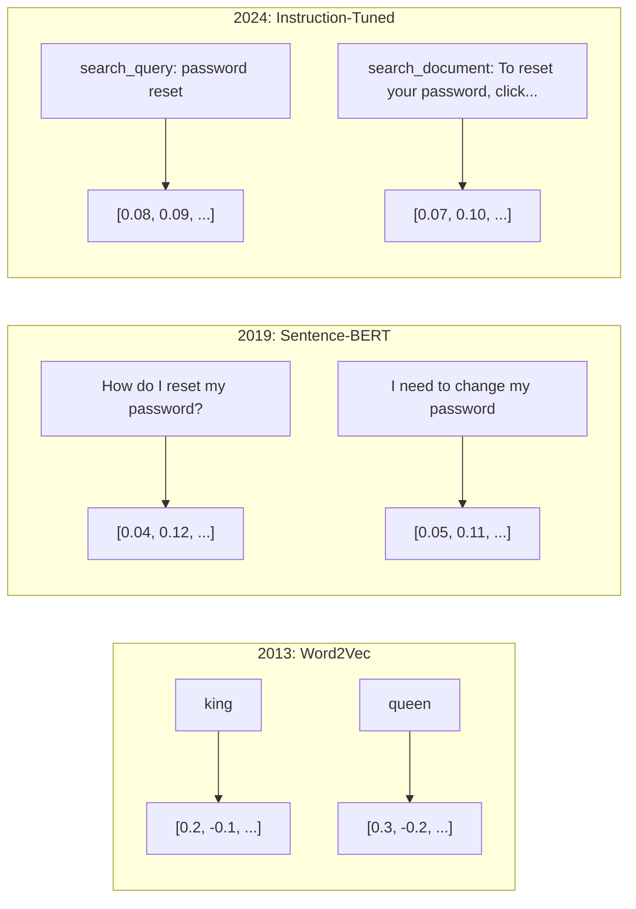
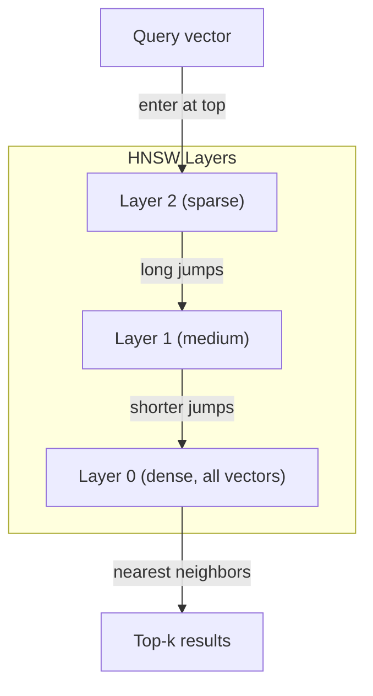
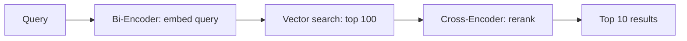

# 嵌入與向量表示

> 文字是離散的，數學是連續的。每一次你要 LLM 找出「相似」文件、比較語意，或做超越關鍵字的搜尋時，你都在依賴這兩個世界之間的一座橋。那座橋就是嵌入。如果你不懂嵌入，你就不懂現代 AI —— 你只是在用它。

**類型：** 實作
**程式語言：** Python
**先修單元：** 階段 11，第 01 課（提示詞工程）
**時間：** 約 75 分鐘
**相關單元：** 階段 5 · 22（嵌入模型深入探討）談的是稠密對稀疏對多向量、Matryoshka 截斷，以及依維度挑模型。這一課聚焦生產管線（向量資料庫、HNSW、相似度數學）。挑模型之前先讀階段 5 · 22。

## 學習目標

- 用 API 供應商與開源模型生成文字嵌入，並計算它們之間的餘弦相似度
- 說明嵌入為什麼能解決關鍵字搜尋處理不了的詞彙不匹配問題
- 建一個語意搜尋索引，依語意而非精確關鍵字匹配來檢索文件
- 用檢索基準（precision@k、recall）評估嵌入品質，並為你的任務挑對嵌入模型

## 問題所在

你有 10,000 張客服工單。一位客戶寫下「my payment didn't go through」。你需要找出類似的過往工單。關鍵字搜尋會找到含有「payment」和「didn't go through」的工單，卻漏掉「transaction failed」、「charge was declined」和「billing error」。這些工單用完全不同的字描述了一模一樣的問題。

這就是詞彙不匹配問題。人類語言有數十種方式表達同一件事。關鍵字搜尋把每個字當成沒有意義的獨立符號，它無法知道「declined」和「didn't go through」指的是同一個概念。

你需要一種文字表示法，讓相似度由語意而非拼字決定。你需要一種方法，把「my payment didn't go through」和「transaction was declined」擺在某個數學空間裡彼此靠近，同時把「my payment arrived on time」推遠 —— 儘管它也有「payment」這個字。

那個表示法就是嵌入。

## 核心概念

### 什麼是嵌入？

嵌入是一個由浮點數組成的稠密向量，用來表示文字的語意。「稠密」這個詞很重要 —— 每一個維度都承載資訊，不像稀疏表示法（詞袋、TF-IDF）那樣大多數維度都是零。

「The cat sat on the mat」會變成類似 `[0.023, -0.041, 0.087, ..., 0.012]` 的東西 —— 依模型而定，是一串 768 到 3072 個數字。這些數字編碼了語意。你永遠不會直接去看它們，你比較它們。

### Word2Vec 的突破

2013 年，Google 的 Tomas Mikolov 與同事發表了 Word2Vec。核心洞見是：訓練一個神經網路從鄰近詞預測某個詞（或從某個詞預測鄰近詞），隱藏層的權重就成了有意義的向量表示。

那個著名的結果：

```
king - man + woman = queen
```

在詞嵌入上做向量算術，能捕捉到語意關係。從「man」到「woman」的方向，大致等於從「king」到「queen」的方向。那一刻，這個領域意識到幾何可以編碼語意。

Word2Vec 產出 300 維向量。每個詞不論上下文都只有一個向量。「river bank」和「bank account」裡的「bank」有相同的嵌入。這個限制推動了接下來十年的研究。

### 從詞到句

詞嵌入表示單一詞元。生產系統需要嵌入整句、整段或整份文件。出現了四種做法：

**平均法**：取句子裡所有詞向量的平均。便宜、有損，對短文字卻出乎意料地堪用。它完全丟掉了詞序 ——「dog bites man」和「man bites dog」會得到一模一樣的嵌入。

**CLS 詞元**：transformer 模型（BERT，2018）會輸出一個特殊的 [CLS] 詞元嵌入來代表整段輸入。比平均法好，但 [CLS] 詞元是為了「下一句預測」訓練的，不是為了相似度。

**對比學習**：明確訓練模型把相似的配對推近、把不相似的配對推遠。Sentence-BERT（Reimers & Gurevych, 2019）用了這個做法，成為現代嵌入模型的基礎。給定「How do I reset my password?」和「I need to change my password」，模型學到這兩者該有幾乎相同的向量。

**指令調校的嵌入**：最新的做法。E5 和 GTE 這類模型接受一個任務前綴（「search_query:」、「search_document:」），告訴模型該產出哪一種嵌入。這讓一個模型能服務多種任務。



### 現代嵌入模型

市場已經沉澱出少數幾個生產級選項（MTEB 分數為 2026 年初、MTEB v2 版本）：

| 模型 | 供應商 | 維度 | MTEB | 上下文 | 每 1M 詞元成本 |
|-------|----------|-----------|------|---------|------------------|
| Gemini Embedding 2 | Google | 3072（Matryoshka） | 67.7（檢索） | 8192 | $0.15 |
| embed-v4 | Cohere | 1024（Matryoshka） | 65.2 | 128K | $0.12 |
| voyage-4 | Voyage AI | 1024/2048（Matryoshka） | 66.8 | 32K | $0.12 |
| text-embedding-3-large | OpenAI | 3072（Matryoshka） | 64.6 | 8192 | $0.13 |
| text-embedding-3-small | OpenAI | 1536（Matryoshka） | 62.3 | 8192 | $0.02 |
| BGE-M3 | BAAI | 1024（稠密+稀疏+ColBERT） | 63.0（多語） | 8192 | 開放權重 |
| Qwen3-Embedding | 阿里巴巴 | 4096（Matryoshka） | 66.9 | 32K | 開放權重 |
| Nomic-embed-v2 | Nomic | 768（Matryoshka） | 63.1 | 8192 | 開放權重 |

MTEB（Massive Text Embedding Benchmark）v2 涵蓋檢索、分類、分群、重排與摘要等 100 多項任務，分數越高越好。到 2026 年，開放權重模型（Qwen3-Embedding、BGE-M3）在大多數維度上已經追上或超越封閉的託管模型。Gemini Embedding 2 在純檢索上領先；Voyage 和 Cohere 在特定領域（金融、法律、程式碼）領先。決定之前，永遠要拿你自己的查詢來跑基準。

### 相似度度量

給定兩個嵌入向量，有三種方式衡量它們有多相似：

**餘弦相似度**：兩個向量夾角的餘弦值。範圍從 -1（相反）到 1（方向相同）。忽略長度 —— 一個 10 個字的句子和一份 500 字的文件，只要方向相同就能拿到 1.0。這是 90% 場景的預設選擇。

```
cosine_sim(a, b) = dot(a, b) / (||a|| * ||b||)
```

**點積**：兩個向量的原始內積。當向量已正規化（單位長度）時，與餘弦相似度完全相同，而且計算更快。OpenAI 的嵌入是正規化過的，所以點積和餘弦給出相同的排序。

```
dot(a, b) = sum(a_i * b_i)
```

**歐幾里得（L2）距離**：向量空間裡的直線距離。越小 = 越相似。對長度差異敏感。當空間中的絕對位置（而不只是方向）有意義時再用它。

```
L2(a, b) = sqrt(sum((a_i - b_i)^2))
```

該用哪一個：

| 度量 | 什麼時候用 | 什麼時候避開 |
|--------|----------|------------|
| 餘弦相似度 | 比較長度不同的文字；大多數檢索任務 | 長度本身承載資訊時 |
| 點積 | 嵌入已經正規化；追求最高速度 | 向量長度差異很大時 |
| 歐幾里得距離 | 分群；空間性的最近鄰問題 | 比較長度差異極大的文件 |

### 向量資料庫與 HNSW

暴力相似度搜尋會把查詢和每一個儲存的向量都比一次。100 萬個 1536 維向量，每次查詢就是 15 億次乘加運算。太慢了。

向量資料庫用近似最近鄰（ANN）演算法解決這件事。主流演算法是 HNSW（Hierarchical Navigable Small World）：

1. 為向量建一張多層圖
2. 上層是稀疏的 —— 遠距叢集之間的長程連結
3. 下層是稠密的 —— 鄰近向量之間的細緻連結
4. 搜尋從最上層開始，貪婪地往下逐層精修
5. 以 O(log n) 而非 O(n) 的時間回傳近似的 top-k 結果

HNSW 用一點點正確率損失（通常是 95-99% 的召回率）換來巨大的速度提升。1000 萬個向量時，暴力搜尋要好幾秒，HNSW 只要幾毫秒。



生產選項：

| 資料庫 | 類型 | 最適合 | 最大規模 |
|----------|------|----------|-----------|
| Pinecone | 託管 SaaS | 免維運的生產環境 | 十億級 |
| Weaviate | 開源 | 自架、混合搜尋 | 1 億+ |
| Qdrant | 開源 | 高效能、過濾 | 1 億+ |
| ChromaDB | 嵌入式 | 原型開發、本機開發 | 100 萬 |
| pgvector | Postgres 擴充 | 本來就在用 Postgres | 1000 萬 |
| FAISS | 函式庫 | 行程內、研究用 | 10 億+ |

### 切塊策略

文件太長，沒辦法嵌成單一向量。一份 50 頁的 PDF 涵蓋數十個主題 —— 它的嵌入會變成所有東西的平均，跟任何具體東西都不像。你要把文件切成塊，再分別嵌入。

**固定大小切塊**：每 N 個詞元切一刀，重疊 M 個詞元。簡單、可預測。文件沒有明顯結構時很好用。512 詞元的塊搭配 50 詞元重疊：第 1 塊是詞元 0-511，第 2 塊是詞元 462-973。

**句子切塊**：在句子邊界切，把句子累積到接近詞元上限。每一塊至少是一個完整句子。比固定大小好，因為你永遠不會把一個念頭砍成兩半。

**遞迴切塊**：先試著在最大的邊界切（章節標題）。還是太大就試段落邊界，再試句子邊界，最後才用字元上限。這就是 LangChain 的 `RecursiveCharacterTextSplitter`，對格式混雜的語料很好用。

**語意切塊**：把每個句子都嵌入，再把嵌入相似的連續句子分為一組。當嵌入相似度掉到閾值以下，就開一個新塊。很貴（每個句子都要單獨嵌入），但產出的塊最連貫。

| 策略 | 複雜度 | 品質 | 最適合 |
|----------|-----------|---------|----------|
| 固定大小 | 低 | 堪用 | 非結構化文字、日誌 |
| 句子切塊 | 低 | 好 | 文章、電子郵件 |
| 遞迴 | 中 | 好 | Markdown、HTML、混合文件 |
| 語意 | 高 | 最好 | 檢索品質至關重要時 |

大多數系統的甜蜜點：256-512 詞元的塊，搭配 50 詞元重疊。

### 雙編碼器對交叉編碼器

雙編碼器（bi-encoder）分別嵌入查詢與文件，然後比較向量。很快 —— 查詢只嵌一次，再拿去和預先算好的文件嵌入比較。這是你檢索時用的東西。

交叉編碼器（cross-encoder）把查詢和某份文件當成單一輸入，輸出一個相關性分數。很慢 —— 每一組查詢-文件配對都要過一次完整模型。但準確得多，因為它能同時注意查詢和文件的詞元。

生產上的模式是：雙編碼器檢索出 top-100 候選，交叉編碼器再重排成 top-10。這就是「檢索後重排」管線。



重排模型：Cohere Rerank 3.5（每 1000 次查詢 $2）、BGE-reranker-v2（免費、開源）、Jina Reranker v2（免費、開源）。

### Matryoshka 嵌入

傳統嵌入是全有全無的。一個 1536 維向量就用掉 1536 個浮點數。你不能不重新訓練就截斷成 256 維。

Matryoshka 表示學習（Kusupati et al., 2022）解決了這件事。模型訓練時就讓前 N 個維度捕捉最重要的資訊，像俄羅斯娃娃一樣。把一個 1536 維的 Matryoshka 嵌入截斷到 256 維會損失一些正確率，但仍然可用。

OpenAI 的 text-embedding-3-small 和 text-embedding-3-large 透過 `dimensions` 參數支援 Matryoshka 截斷。要 256 維而非 1536 維，儲存空間省 6 倍，在 MTEB 基準上大約損失 3-5% 的正確率。

### 二元量化

一個 1536 維嵌入以 float32 儲存要用 6,144 位元組。乘上一千萬份文件：光向量就 61 GB。

二元量化把每個浮點數轉成單一位元：正值變 1，負值變 0。儲存從 6,144 位元組降到 192 位元組 —— 縮小 32 倍。相似度改用漢明距離（數有幾個位元不同）來算，CPU 一道指令就能做完。

正確率的代價大約是檢索召回率掉 5-10%。常見做法是：先用二元量化在數百萬個向量上做第一輪搜尋，再用全精度向量對 top-1000 重新評分。這樣能在記憶體少 32 倍的情況下，拿到全精度 95% 以上的正確率。

```figure
cosine-similarity
```

## 實作

我們從零打造一個語意搜尋引擎。不用向量資料庫，不用外部嵌入 API。純 Python，數學部分用 numpy。

### 步驟 1：文字切塊

```python
def chunk_text(text, chunk_size=200, overlap=50):
    words = text.split()
    chunks = []
    start = 0
    while start < len(words):
        end = start + chunk_size
        chunk = " ".join(words[start:end])
        chunks.append(chunk)
        start += chunk_size - overlap
    return chunks


def chunk_by_sentences(text, max_chunk_tokens=200):
    sentences = text.replace("\n", " ").split(".")
    sentences = [s.strip() + "." for s in sentences if s.strip()]
    chunks = []
    current_chunk = []
    current_length = 0
    for sentence in sentences:
        sentence_length = len(sentence.split())
        if current_length + sentence_length > max_chunk_tokens and current_chunk:
            chunks.append(" ".join(current_chunk))
            current_chunk = []
            current_length = 0
        current_chunk.append(sentence)
        current_length += sentence_length
    if current_chunk:
        chunks.append(" ".join(current_chunk))
    return chunks
```

### 步驟 2：從零打造嵌入

我們用 TF-IDF 搭配 L2 正規化，實作一個簡單的稠密嵌入。這不是神經嵌入，但它遵循同樣的合約：文字進去，固定長度的向量出來，相似的文字產生相似的向量。

```python
import math
import numpy as np
from collections import Counter

class SimpleEmbedder:
    def __init__(self):
        self.vocab = []
        self.idf = []
        self.word_to_idx = {}

    def fit(self, documents):
        vocab_set = set()
        for doc in documents:
            vocab_set.update(doc.lower().split())
        self.vocab = sorted(vocab_set)
        self.word_to_idx = {w: i for i, w in enumerate(self.vocab)}
        n = len(documents)
        self.idf = np.zeros(len(self.vocab))
        for i, word in enumerate(self.vocab):
            doc_count = sum(1 for doc in documents if word in doc.lower().split())
            self.idf[i] = math.log((n + 1) / (doc_count + 1)) + 1

    def embed(self, text):
        words = text.lower().split()
        count = Counter(words)
        total = len(words) if words else 1
        vec = np.zeros(len(self.vocab))
        for word, freq in count.items():
            if word in self.word_to_idx:
                tf = freq / total
                vec[self.word_to_idx[word]] = tf * self.idf[self.word_to_idx[word]]
        norm = np.linalg.norm(vec)
        if norm > 0:
            vec = vec / norm
        return vec
```

### 步驟 3：相似度函數

```python
def cosine_similarity(a, b):
    dot = np.dot(a, b)
    norm_a = np.linalg.norm(a)
    norm_b = np.linalg.norm(b)
    if norm_a == 0 or norm_b == 0:
        return 0.0
    return float(dot / (norm_a * norm_b))


def dot_product(a, b):
    return float(np.dot(a, b))


def euclidean_distance(a, b):
    return float(np.linalg.norm(a - b))
```

### 步驟 4：帶暴力搜尋的向量索引

```python
class VectorIndex:
    def __init__(self):
        self.vectors = []
        self.texts = []
        self.metadata = []

    def add(self, vector, text, meta=None):
        self.vectors.append(vector)
        self.texts.append(text)
        self.metadata.append(meta or {})

    def search(self, query_vector, top_k=5, metric="cosine"):
        scores = []
        for i, vec in enumerate(self.vectors):
            if metric == "cosine":
                score = cosine_similarity(query_vector, vec)
            elif metric == "dot":
                score = dot_product(query_vector, vec)
            elif metric == "euclidean":
                score = -euclidean_distance(query_vector, vec)
            else:
                raise ValueError(f"Unknown metric: {metric}")
            scores.append((i, score))
        scores.sort(key=lambda x: x[1], reverse=True)
        results = []
        for idx, score in scores[:top_k]:
            results.append({
                "text": self.texts[idx],
                "score": score,
                "metadata": self.metadata[idx],
                "index": idx
            })
        return results

    def size(self):
        return len(self.vectors)
```

### 步驟 5：語意搜尋引擎

```python
class SemanticSearchEngine:
    def __init__(self, chunk_size=200, overlap=50):
        self.embedder = SimpleEmbedder()
        self.index = VectorIndex()
        self.chunk_size = chunk_size
        self.overlap = overlap

    def index_documents(self, documents, source_names=None):
        all_chunks = []
        all_sources = []
        for i, doc in enumerate(documents):
            chunks = chunk_text(doc, self.chunk_size, self.overlap)
            all_chunks.extend(chunks)
            name = source_names[i] if source_names else f"doc_{i}"
            all_sources.extend([name] * len(chunks))
        self.embedder.fit(all_chunks)
        for chunk, source in zip(all_chunks, all_sources):
            vec = self.embedder.embed(chunk)
            self.index.add(vec, chunk, {"source": source})
        return len(all_chunks)

    def search(self, query, top_k=5, metric="cosine"):
        query_vec = self.embedder.embed(query)
        return self.index.search(query_vec, top_k, metric)

    def search_with_scores(self, query, top_k=5):
        results = self.search(query, top_k)
        return [
            {
                "text": r["text"][:200],
                "source": r["metadata"].get("source", "unknown"),
                "score": round(r["score"], 4)
            }
            for r in results
        ]
```

### 步驟 6：比較相似度度量

```python
def compare_metrics(engine, query, top_k=3):
    results = {}
    for metric in ["cosine", "dot", "euclidean"]:
        hits = engine.search(query, top_k=top_k, metric=metric)
        results[metric] = [
            {"score": round(h["score"], 4), "preview": h["text"][:80]}
            for h in hits
        ]
    return results
```

## 實務應用

換成生產級的嵌入 API，架構完全不變。只有嵌入器換掉：

```python
from openai import OpenAI

client = OpenAI()

def openai_embed(texts, model="text-embedding-3-small", dimensions=None):
    kwargs = {"model": model, "input": texts}
    if dimensions:
        kwargs["dimensions"] = dimensions
    response = client.embeddings.create(**kwargs)
    return [item.embedding for item in response.data]
```

用 OpenAI 做 Matryoshka 截斷 —— 同一個模型、更少維度、更省儲存：

```python
full = openai_embed(["semantic search query"], dimensions=1536)
compact = openai_embed(["semantic search query"], dimensions=256)
```

256 維的向量儲存空間少 6 倍。一千萬份文件的話，是 10 GB 對 61 GB。在標準基準上的正確率損失大約 3-5%。

用 Cohere 做重排：

```python
import cohere

co = cohere.ClientV2()

results = co.rerank(
    model="rerank-v3.5",
    query="What is the refund policy?",
    documents=["Full refund within 30 days...", "No refunds after 90 days..."],
    top_n=3
)
```

不依賴 API 的本機嵌入：

```python
from sentence_transformers import SentenceTransformer

model = SentenceTransformer("BAAI/bge-small-en-v1.5")
embeddings = model.encode(["semantic search query", "another document"])
```

我們實作的 VectorIndex 類別可以搭配上面任何一種。換掉嵌入函數，搜尋邏輯照舊。

## 產出

這一課會產出：
- `outputs/prompt-embedding-advisor.md` —— 一個提示詞，用來為特定場景挑選嵌入模型與策略
- `outputs/skill-embedding-patterns.md` —— 一個技能，教代理如何在生產環境中有效使用嵌入

## 練習

1. **度量比較**：對樣本文件用餘弦相似度、點積和歐幾里得距離各跑同樣 5 個查詢。記下每一種的 top-3 結果。哪些查詢上這些度量意見不一致？為什麼？

2. **切塊大小實驗**：用 50、100、200、500 個詞的切塊大小分別為樣本文件建索引。每一種都跑 5 個查詢，記下 top-1 相似度分數。畫出切塊大小與檢索品質的關係。找出更大的塊開始造成傷害的那一點。

3. **Matryoshka 模擬**：做一個產出 500 維向量的 SimpleEmbedder。截斷到 50、100、200 和 500 維。量測每種截斷下檢索召回率如何衰退。這模擬了 Matryoshka 的行為，而不需要真的訓練技巧。

4. **二元量化**：拿搜尋引擎裡的嵌入，轉成二元（正值為 1，負值為 0），並實作漢明距離搜尋。把 top-10 結果和全精度餘弦相似度比較，量測重疊百分比。

5. **句子切塊**：把固定大小切塊換成 `chunk_by_sentences`。跑同樣的查詢並比較檢索分數。尊重句子邊界會讓結果變好嗎？

## 關鍵術語

| 術語 | 大家怎麼說 | 它實際上是什麼 |
|------|----------------|----------------------|
| 嵌入（Embedding） | 「文字變數字」 | 一個稠密向量，其中幾何上的接近程度編碼了語意相似度 |
| Word2Vec | 「嵌入的元祖」 | 2013 年的模型，透過預測上下文詞來學詞向量；證明了向量算術能編碼語意 |
| 餘弦相似度（Cosine similarity） | 「兩個向量有多像」 | 兩個向量夾角的餘弦值；1 = 方向相同，0 = 正交，-1 = 相反 |
| HNSW | 「快速向量搜尋」 | Hierarchical Navigable Small World 圖 —— 讓近似最近鄰搜尋達到 O(log n) 的多層結構 |
| 雙編碼器（Bi-encoder） | 「分開嵌入，比較快」 | 把查詢和文件各自獨立編成向量；可以預先計算並快速檢索 |
| 交叉編碼器（Cross-encoder） | 「慢但準的重排器」 | 把查詢-文件配對一起送進完整模型處理；正確率更高，但無法預先計算 |
| Matryoshka 嵌入 | 「可截斷的向量」 | 訓練時就讓前 N 維承載最重要資訊的嵌入，使儲存大小可變 |
| 二元量化（Binary quantization） | 「1 位元嵌入」 | 把浮點向量轉成二元（只留正負號），儲存縮小 32 倍，改用漢明距離搜尋 |
| 切塊（Chunking） | 「把文件切開來嵌入」 | 把文件切成 256-512 詞元的片段，讓每一段都能獨立嵌入與檢索 |
| 向量資料庫（Vector database） | 「嵌入的搜尋引擎」 | 專為儲存向量並在規模下執行近似最近鄰搜尋而最佳化的資料儲存 |
| 對比學習（Contrastive learning） | 「靠比較來訓練」 | 一種訓練方式，把相似配對的嵌入推近、把不相似配對的嵌入推遠 |
| MTEB | 「嵌入的那個基準」 | Massive Text Embedding Benchmark —— 8 類任務、56 個資料集；比較嵌入模型的標準 |

## 延伸閱讀

- Mikolov et al., "Efficient Estimation of Word Representations in Vector Space" (2013) —— 那篇 Word2Vec 論文，用 king-queen 類比開啟了嵌入革命
- Reimers & Gurevych, "Sentence-BERT: Sentence Embeddings using Siamese BERT-Networks" (2019) —— 如何訓練雙編碼器做句子層級相似度，現代嵌入模型的基礎
- Kusupati et al., "Matryoshka Representation Learning" (2022) —— 可變維度嵌入背後的技術，OpenAI 在 text-embedding-3 上採用了它
- Malkov & Yashunin, "Efficient and Robust Approximate Nearest Neighbor using Hierarchical Navigable Small World Graphs" (2018) —— HNSW 論文，多數生產級向量搜尋背後的演算法
- OpenAI Embeddings Guide (platform.openai.com/docs/guides/embeddings) —— text-embedding-3 系列模型的實務參考，包含 Matryoshka 降維
- MTEB Leaderboard (huggingface.co/spaces/mteb/leaderboard) —— 即時基準，跨任務與跨語言比較所有嵌入模型
- [Muennighoff et al., "MTEB: Massive Text Embedding Benchmark" (EACL 2023)](https://arxiv.org/abs/2210.07316) —— 定義了排行榜所回報的 8 大任務類別（分類、分群、配對分類、重排、檢索、STS、摘要、雙語文本挖掘）的基準論文；在相信任何單一 MTEB 分數之前先讀它。
- [Sentence Transformers documentation](https://www.sbert.net/) —— 雙編碼器對交叉編碼器、池化策略，以及本課實作的「擷取－切分－嵌入－儲存」RAG 管線的權威參考。
