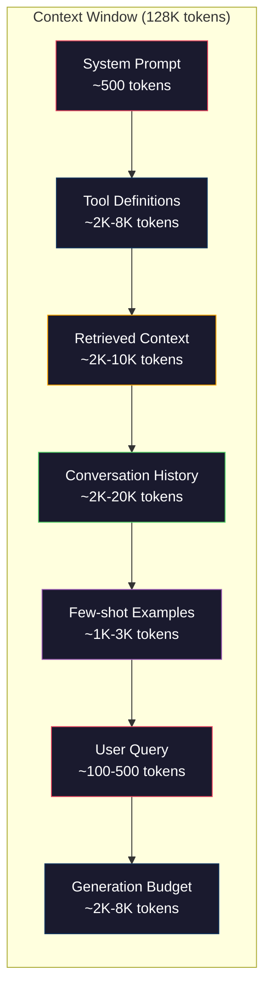
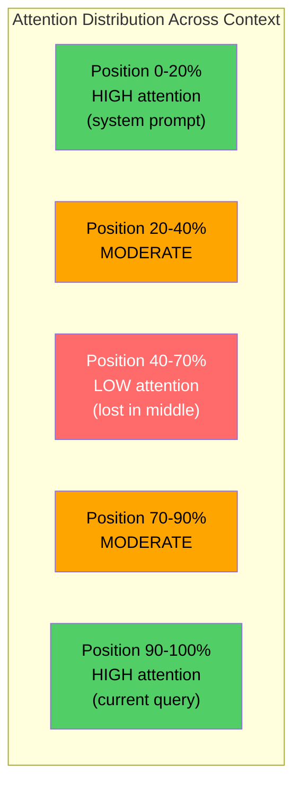
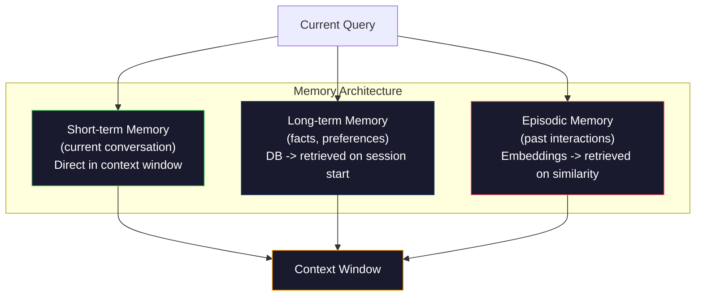

# 上下文工程：視窗、預算、記憶與檢索

> 提示詞工程只是子集，上下文工程才是整場遊戲。提示詞是你打進去的一串字。上下文是所有進入模型視窗的東西：系統指令、檢索到的文件、工具定義、對話歷史、少樣本範例，以及提示詞本身。2026 年最強的 AI 工程師都是上下文工程師。他們決定什麼進去、什麼留在外面，以及順序怎麼排。

**類型：** 實作
**程式語言：** Python
**先修單元：** 階段 10（從零打造 LLM）、階段 11 第 01-02 課
**時間：** 約 90 分鐘
**相關單元：** 階段 11 · 15（提示詞快取）—— 對快取友善的排版是上下文工程的延伸。階段 5 · 28（長上下文評估）談如何用 NIAH/RULER 量測「中間遺失」。

## 學習目標

- 計算所有上下文視窗元件的詞元預算（系統提示詞、工具、歷史、檢索文件、生成保留空間）
- 實作上下文視窗管理策略：對話歷史的截斷、摘要與滑動視窗
- 為上下文元件排定優先序與順序，讓模型的注意力最大程度落在最相關的資訊上
- 建一個上下文組裝器，依查詢類型與可用視窗空間動態分配詞元

## 問題所在

Claude Opus 4.7 有 200K 詞元的視窗（beta 版 1M）。GPT-5 有 400K。Gemini 3 Pro 有 2M。Llama 4 號稱 10M。這些數字聽起來很龐大，直到你開始把它填滿。

以下是一個程式助理的真實拆解。系統提示詞：500 詞元。50 個工具的定義：8,000 詞元。檢索到的文件：4,000 詞元。對話歷史（10 輪）：6,000 詞元。當前使用者查詢：200 詞元。生成預算（最大輸出）：4,000 詞元。合計：22,700 詞元。那只佔 128K 視窗的 18%。

但注意力不會隨上下文長度線性擴展。帶 128K 詞元上下文的模型付出的是平方級注意力成本（原始 transformer 是 O(n^2)，不過多數生產模型用的是高效注意力變體）。更重要的是，檢索正確率會退化。「大海撈針」（Needle in a Haystack）測試顯示，模型很難找到放在長上下文中段的資訊。Liu et al.（2023）的研究指出，LLM 對長上下文開頭與結尾的資訊幾乎能完美檢索，但放在中段（上下文的 40-70% 位置）的資訊，正確率會掉 10-20%。這個「中間遺失」效應因模型而異，但影響目前所有架構。

實務上的教訓是：有 200K 詞元可用，不代表用掉 200K 詞元有效。一個精心策劃的 10K 詞元上下文，往往勝過胡亂塞滿的 100K 詞元上下文。上下文工程就是在上下文視窗內最大化訊噪比的功夫。

你放進視窗的每一個詞元，都排擠掉一個可能承載更相關資訊的詞元。每個不相干的工具定義、每一輪過期的對話、每一塊回答不了問題的檢索文字 —— 每一項都讓模型在這個任務上稍微變差一點。

## 核心概念

### 上下文視窗是稀缺資源

把上下文視窗當成 RAM，不是硬碟。它很快、可直接存取，但有限。你放不下所有東西，你必須選擇。



每個元件都在爭搶空間。多加工具定義，就少了裝對話歷史的空間。多加檢索到的上下文，就少了放少樣本範例的空間。上下文工程就是分配這份預算、把任務表現最大化的藝術。

### 中間遺失

上下文工程裡最重要的實證發現。模型對上下文開頭與結尾的資訊注意得更好。放在中段的資訊會拿到較低的注意力分數，也更容易被忽略。

Liu et al.（2023）系統性地測了這件事。他們把一份相關文件放在 20 份不相關文件之間的不同位置，量測答案正確率。相關文件排第一或最後時，正確率是 85-90%。放在中間（20 份裡的第 10 份）時，正確率掉到 60-70%。

這對工程有直接的意涵：

- 把最重要的資訊放最前面（系統提示詞、關鍵指令）
- 把當前查詢和最相關的上下文放最後（近期偏誤幫得上忙）
- 把上下文中段視為優先度最低的區域
- 如果非得把資訊放在中段，就在結尾重複一次關鍵重點



### 上下文的元件

**系統提示詞**：設定人格、約束與行為規則。它放最前面，且跨輪次保持不變。Claude Code 的系統提示詞大約用掉 6,000 詞元，含工具定義與行為指令。要寫緊實一點。系統提示詞裡的每一個字，在每次 API 呼叫都會重複一次。

**工具定義**：每個工具會多出 50-200 詞元（名稱、描述、參數 schema）。50 個工具、每個 150 詞元，在任何對話開始之前就是 7,500 詞元。動態工具挑選 —— 只納入與當前查詢相關的工具 —— 可以把這個數字砍掉 60-80%。

**檢索到的上下文**：來自向量資料庫的文件、搜尋結果、檔案內容。檢索的品質直接決定回應的品質。爛的檢索比不檢索更糟 —— 它用雜訊填滿視窗，還積極地誤導模型。

**對話歷史**：先前每一則使用者訊息與助理回應。隨對話長度線性成長。50 輪對話、每輪 200 詞元，就是 10,000 詞元的歷史。其中大部分和當前查詢無關。

**少樣本範例**：示範理想行為的輸入／輸出配對。兩三個挑得好的範例，往往比幾千詞元的指令更能提升輸出品質。但它們佔空間。

**生成預算**：保留給模型回應的詞元。如果你把視窗填到滿，模型就沒有空間回答。至少保留 2,000-4,000 詞元給生成。

### 上下文壓縮策略

**歷史摘要**：不要把先前每一輪都原封不動留著，而是定期為對話做摘要。用 100 詞元的「我們討論了 X、決定了 Y，使用者想要 Z」取代佔了 2,000 詞元的 10 輪對話。歷史超過閾值時（例如 5,000 詞元）就跑一次摘要。

**相關性過濾**：為每一份檢索到的文件對當前查詢評分，把低於閾值的丟掉。如果你檢索了 10 塊但只有 3 塊相關，就把另外 7 塊丟掉。3 塊高度相關勝過 10 塊平庸的。

**工具修剪**：分類使用者查詢的意圖，只納入與該意圖相關的工具。程式碼問題不需要日曆工具；排程問題不需要檔案系統工具。這能把工具定義從 8,000 詞元降到 1,000。

**遞迴摘要**：面對超長文件時，分階段做摘要。先為每一節做摘要，再為那些摘要做摘要。一份 50 頁的文件變成一份 500 詞元、抓住關鍵重點的摘要。

### 記憶系統

上下文工程橫跨三種時間尺度。

**短期記憶**：當前對話。直接存在上下文視窗裡。每輪都在長大。靠摘要與截斷來管理。

**長期記憶**：跨對話持續存在的事實與偏好。「使用者偏好 TypeScript。」「這個專案用 PostgreSQL。」存在資料庫裡，開場時取出。Claude Code 把這些存在 CLAUDE.md 檔案裡，ChatGPT 存在它的記憶功能裡。

**情節記憶**：可能相關的特定過往互動。「上週二我們在 auth 模組除過一個類似的錯。」以嵌入形式儲存，當當前對話與某段過往情節相符時取出。



### 動態上下文組裝

關鍵洞見是：不同查詢需要不同的上下文。靜態系統提示詞 + 靜態工具 + 靜態歷史是浪費。最好的系統會為每個查詢動態組裝上下文。

1. 分類查詢意圖
2. 挑出相關工具（不是全部工具）
3. 檢索相關文件（不是一組固定的）
4. 納入相關的歷史輪次（不是全部歷史）
5. 加上符合任務類型的少樣本範例
6. 依重要性排序：關鍵的放最前，重要的放最後，可有可無的放中間

這正是把好的 AI 應用和頂級 AI 應用區分開來的地方。模型是同一個，上下文才是差異所在。

## 實作

### 步驟 1：詞元計數器

你無法為量不出來的東西編預算。先做一個簡單的詞元計數器（用空白切分做近似，因為精確計數取決於分詞器）。

```python
import json
import numpy as np
from collections import OrderedDict

def count_tokens(text):
    if not text:
        return 0
    return int(len(text.split()) * 1.3)

def count_tokens_json(obj):
    return count_tokens(json.dumps(obj))
```

### 步驟 2：上下文預算管理器

核心抽象。預算管理器追蹤每個元件用掉多少詞元，並強制執行上限。

```python
class ContextBudget:
    def __init__(self, max_tokens=128000, generation_reserve=4000):
        self.max_tokens = max_tokens
        self.generation_reserve = generation_reserve
        self.available = max_tokens - generation_reserve
        self.allocations = OrderedDict()

    def allocate(self, component, content, max_tokens=None):
        tokens = count_tokens(content)
        if max_tokens and tokens > max_tokens:
            words = content.split()
            target_words = int(max_tokens / 1.3)
            content = " ".join(words[:target_words])
            tokens = count_tokens(content)

        used = sum(self.allocations.values())
        if used + tokens > self.available:
            allowed = self.available - used
            if allowed <= 0:
                return None, 0
            words = content.split()
            target_words = int(allowed / 1.3)
            content = " ".join(words[:target_words])
            tokens = count_tokens(content)

        self.allocations[component] = tokens
        return content, tokens

    def remaining(self):
        used = sum(self.allocations.values())
        return self.available - used

    def utilization(self):
        used = sum(self.allocations.values())
        return used / self.max_tokens

    def report(self):
        total_used = sum(self.allocations.values())
        lines = []
        lines.append(f"Context Budget Report ({self.max_tokens:,} token window)")
        lines.append("-" * 50)
        for component, tokens in self.allocations.items():
            pct = tokens / self.max_tokens * 100
            bar = "#" * int(pct / 2)
            lines.append(f"  {component:<25} {tokens:>6} tokens ({pct:>5.1f}%) {bar}")
        lines.append("-" * 50)
        lines.append(f"  {'Used':<25} {total_used:>6} tokens ({total_used/self.max_tokens*100:.1f}%)")
        lines.append(f"  {'Generation reserve':<25} {self.generation_reserve:>6} tokens")
        lines.append(f"  {'Remaining':<25} {self.remaining():>6} tokens")
        return "\n".join(lines)
```

### 步驟 3：中間遺失的重新排序

實作重新排序策略：最重要的項目放頭尾，最不重要的放中間。

```python
def reorder_lost_in_middle(items, scores):
    paired = sorted(zip(scores, items), reverse=True)
    sorted_items = [item for _, item in paired]

    if len(sorted_items) <= 2:
        return sorted_items

    first_half = sorted_items[::2]
    second_half = sorted_items[1::2]
    second_half.reverse()

    return first_half + second_half

def score_relevance(query, documents):
    query_words = set(query.lower().split())
    scores = []
    for doc in documents:
        doc_words = set(doc.lower().split())
        if not query_words:
            scores.append(0.0)
            continue
        overlap = len(query_words & doc_words) / len(query_words)
        scores.append(round(overlap, 3))
    return scores
```

### 步驟 4：對話歷史壓縮器

為舊的對話輪次做摘要，回收詞元預算。

```python
class ConversationManager:
    def __init__(self, max_history_tokens=5000):
        self.turns = []
        self.summaries = []
        self.max_history_tokens = max_history_tokens

    def add_turn(self, role, content):
        self.turns.append({"role": role, "content": content})
        self._compress_if_needed()

    def _compress_if_needed(self):
        total = sum(count_tokens(t["content"]) for t in self.turns)
        if total <= self.max_history_tokens:
            return

        while total > self.max_history_tokens and len(self.turns) > 4:
            old_turns = self.turns[:2]
            summary = self._summarize_turns(old_turns)
            self.summaries.append(summary)
            self.turns = self.turns[2:]
            total = sum(count_tokens(t["content"]) for t in self.turns)

    def _summarize_turns(self, turns):
        parts = []
        for t in turns:
            content = t["content"]
            if len(content) > 100:
                content = content[:100] + "..."
            parts.append(f"{t['role']}: {content}")
        return "Previous: " + " | ".join(parts)

    def get_context(self):
        parts = []
        if self.summaries:
            parts.append("[Conversation Summary]")
            for s in self.summaries:
                parts.append(s)
        parts.append("[Recent Conversation]")
        for t in self.turns:
            parts.append(f"{t['role']}: {t['content']}")
        return "\n".join(parts)

    def token_count(self):
        return count_tokens(self.get_context())
```

### 步驟 5：動態工具挑選器

只納入與當前查詢相關的工具。先分類意圖，再過濾。

```python
TOOL_REGISTRY = {
    "read_file": {
        "description": "Read contents of a file",
        "tokens": 120,
        "categories": ["code", "files"],
    },
    "write_file": {
        "description": "Write content to a file",
        "tokens": 150,
        "categories": ["code", "files"],
    },
    "search_code": {
        "description": "Search for patterns in codebase",
        "tokens": 130,
        "categories": ["code"],
    },
    "run_command": {
        "description": "Execute a shell command",
        "tokens": 140,
        "categories": ["code", "system"],
    },
    "create_calendar_event": {
        "description": "Create a new calendar event",
        "tokens": 180,
        "categories": ["calendar"],
    },
    "list_emails": {
        "description": "List recent emails",
        "tokens": 160,
        "categories": ["email"],
    },
    "send_email": {
        "description": "Send an email message",
        "tokens": 200,
        "categories": ["email"],
    },
    "web_search": {
        "description": "Search the web for information",
        "tokens": 140,
        "categories": ["research"],
    },
    "query_database": {
        "description": "Run a SQL query on the database",
        "tokens": 170,
        "categories": ["code", "data"],
    },
    "generate_chart": {
        "description": "Generate a chart from data",
        "tokens": 190,
        "categories": ["data", "visualization"],
    },
}

def classify_intent(query):
    query_lower = query.lower()

    intent_keywords = {
        "code": ["code", "function", "bug", "error", "file", "implement", "refactor", "debug", "test"],
        "calendar": ["meeting", "schedule", "calendar", "appointment", "event"],
        "email": ["email", "mail", "send", "inbox", "message"],
        "research": ["search", "find", "what is", "how does", "explain", "look up"],
        "data": ["data", "query", "database", "chart", "graph", "analytics", "sql"],
    }

    scores = {}
    for intent, keywords in intent_keywords.items():
        score = sum(1 for kw in keywords if kw in query_lower)
        if score > 0:
            scores[intent] = score

    if not scores:
        return ["code"]

    max_score = max(scores.values())
    return [intent for intent, score in scores.items() if score >= max_score * 0.5]

def select_tools(query, token_budget=2000):
    intents = classify_intent(query)
    relevant = {}
    total_tokens = 0

    for name, tool in TOOL_REGISTRY.items():
        if any(cat in intents for cat in tool["categories"]):
            if total_tokens + tool["tokens"] <= token_budget:
                relevant[name] = tool
                total_tokens += tool["tokens"]

    return relevant, total_tokens
```

### 步驟 6：完整的上下文組裝管線

把所有東西接起來。給定一個查詢，動態組出最佳上下文。

```python
class ContextEngine:
    def __init__(self, max_tokens=128000, generation_reserve=4000):
        self.budget = ContextBudget(max_tokens, generation_reserve)
        self.conversation = ConversationManager(max_history_tokens=5000)
        self.system_prompt = (
            "You are a helpful AI assistant. You have access to tools for "
            "code editing, file management, web search, and data analysis. "
            "Use the appropriate tools for each task. Be concise and accurate."
        )
        self.knowledge_base = [
            "Python 3.12 introduced type parameter syntax for generic classes using bracket notation.",
            "The project uses PostgreSQL 16 with pgvector for embedding storage.",
            "Authentication is handled by Supabase Auth with JWT tokens.",
            "The frontend is built with Next.js 15 using the App Router.",
            "API rate limits are set to 100 requests per minute per user.",
            "The deployment pipeline uses GitHub Actions with Docker multi-stage builds.",
            "Test coverage must be above 80% for all new modules.",
            "The codebase follows the repository pattern for data access.",
        ]

    def assemble(self, query):
        self.budget = ContextBudget(self.budget.max_tokens, self.budget.generation_reserve)

        system_content, _ = self.budget.allocate("system_prompt", self.system_prompt, max_tokens=1000)

        tools, tool_tokens = select_tools(query, token_budget=2000)
        tool_text = json.dumps(list(tools.keys()))
        tool_content, _ = self.budget.allocate("tools", tool_text, max_tokens=2000)

        relevance = score_relevance(query, self.knowledge_base)
        threshold = 0.1
        relevant_docs = [
            doc for doc, score in zip(self.knowledge_base, relevance)
            if score >= threshold
        ]

        if relevant_docs:
            doc_scores = [s for s in relevance if s >= threshold]
            reordered = reorder_lost_in_middle(relevant_docs, doc_scores)
            doc_text = "\n".join(reordered)
            doc_content, _ = self.budget.allocate("retrieved_context", doc_text, max_tokens=3000)

        history_text = self.conversation.get_context()
        if history_text.strip():
            history_content, _ = self.budget.allocate("conversation_history", history_text, max_tokens=5000)

        query_content, _ = self.budget.allocate("user_query", query, max_tokens=500)

        return self.budget

    def chat(self, query):
        self.conversation.add_turn("user", query)
        budget = self.assemble(query)
        response = f"[Response to: {query[:50]}...]"
        self.conversation.add_turn("assistant", response)
        return budget


def run_demo():
    print("=" * 60)
    print("  Context Engineering Pipeline Demo")
    print("=" * 60)

    engine = ContextEngine(max_tokens=128000, generation_reserve=4000)

    print("\n--- Query 1: Code task ---")
    budget = engine.chat("Fix the bug in the authentication module where JWT tokens expire too early")
    print(budget.report())

    print("\n--- Query 2: Research task ---")
    budget = engine.chat("What is the best approach for implementing vector search in PostgreSQL?")
    print(budget.report())

    print("\n--- Query 3: After conversation history builds up ---")
    for i in range(8):
        engine.conversation.add_turn("user", f"Follow-up question number {i+1} about the implementation details of the system")
        engine.conversation.add_turn("assistant", f"Here is the response to follow-up {i+1} with technical details about the architecture")

    budget = engine.chat("Now implement the changes we discussed")
    print(budget.report())

    print("\n--- Tool Selection Examples ---")
    test_queries = [
        "Fix the bug in auth.py",
        "Schedule a meeting with the team for Tuesday",
        "Show me the database query performance stats",
        "Search for best practices on error handling",
    ]

    for q in test_queries:
        tools, tokens = select_tools(q)
        intents = classify_intent(q)
        print(f"\n  Query: {q}")
        print(f"  Intents: {intents}")
        print(f"  Tools: {list(tools.keys())} ({tokens} tokens)")

    print("\n--- Lost-in-the-Middle Reordering ---")
    docs = ["Doc A (most relevant)", "Doc B (somewhat relevant)", "Doc C (least relevant)",
            "Doc D (relevant)", "Doc E (moderately relevant)"]
    scores = [0.95, 0.60, 0.20, 0.80, 0.50]
    reordered = reorder_lost_in_middle(docs, scores)
    print(f"  Original order: {docs}")
    print(f"  Scores:         {scores}")
    print(f"  Reordered:      {reordered}")
    print(f"  (Most relevant at start and end, least relevant in middle)")
```

## 實務應用

### 由框架管理的上下文

Claude Code 用分層方式管理上下文。系統提示詞包含行為規則與工具定義（約 6K 詞元）。當你打開一個檔案，它的內容會被注入成上下文。當你搜尋，結果會被加進來。舊的對話輪次會被摘要。CLAUDE.md 提供跨工作階段持續存在的長期記憶。

關鍵的工程決策是：Claude Code 不會把你整個程式庫傾倒進上下文。它按需檢索相關檔案。這就是上下文工程的實踐。

### 動態上下文載入

Cursor 把你整個程式庫索引成嵌入。當你輸入查詢，它用向量相似度取出最相關的檔案與程式碼區塊。只有那些片段進入上下文視窗。一個 50 萬行的程式庫被壓縮成最相關的 5-10 個程式碼區塊。

這就是那個模式：全部嵌入、按需檢索、只納入真正重要的。

### 助理的長期記憶

ChatGPT 把使用者偏好與事實存成長期記憶。每次對話開場時，相關記憶會被取出並放進系統提示詞。「使用者偏好 Python」花 5 個詞元，卻省下跨對話重複指令的數百詞元。

### RAG 就是上下文工程

檢索增強生成（RAG）是上下文工程的形式化版本。你不是把知識塞進模型權重裡（訓練）或系統提示詞裡（靜態上下文），而是在查詢時取出相關文件、注入上下文視窗。整條 RAG 管線 —— 切塊、嵌入、檢索、重排 —— 存在的目的只有一個：把對的資訊放進上下文視窗。

## 產出

這一課會產出 `outputs/prompt-context-optimizer.md` —— 一個可重用的提示詞，用來稽核上下文組裝策略並建議最佳化。餵它你的系統提示詞、工具數量、平均歷史長度與檢索策略，它會找出詞元浪費並提出改進建議。

另外也會產出 `outputs/skill-context-engineering.md` —— 一套決策框架，依任務類型、上下文視窗大小與延遲預算來設計上下文組裝管線。

## 練習

1. 為 ContextBudget 類別加上一個「詞元浪費偵測器」。它應該標記出用掉超過 30% 預算的元件，並針對各元件類型建議相應的壓縮策略（摘要歷史、修剪工具、重排文件）。

2. 為檢索到的上下文實作語意去重。如果兩份檢索到的文件相似度超過 80%（用詞重疊或嵌入的餘弦相似度衡量），只留分數較高的那一份。量測這能回收多少詞元預算。

3. 做一個「上下文重播」工具。給定一份對話逐字稿，把它重播過 ContextEngine，並視覺化預算分配如何逐輪變化。畫出各元件的詞元用量隨時間變化的圖。找出上下文開始被壓縮的那一輪。

4. 實作一個基於優先序的工具挑選器。不要做二元的納入／排除，而是為每個工具對當前查詢給一個相關性分數。依相關性遞減納入工具，直到工具預算用完。比較納入 5、10、20 和 50 個工具時的任務表現。

5. 做一個多策略上下文壓縮器。實作三種壓縮策略（截斷、摘要、抽取關鍵句），並在一組 20 份文件上做基準測試。量測壓縮率與資訊保留度之間的取捨（壓縮後的版本還含有該查詢的答案嗎？）。

## 關鍵術語

| 術語 | 大家怎麼說 | 它實際上是什麼 |
|------|----------------|----------------------|
| 上下文視窗（Context window） | 「模型能讀多少」 | 模型在單次前向傳遞中處理的最大詞元數（輸入 + 輸出）—— GPT-5 是 400K，Claude Opus 4.7 是 200K（1M beta），Gemini 3 Pro 是 2M |
| 上下文工程（Context engineering） | 「進階提示詞工程」 | 決定什麼進入上下文視窗、順序如何、優先度多高的功夫 —— 涵蓋檢索、壓縮、工具挑選與記憶管理 |
| 中間遺失（Lost-in-the-middle） | 「模型會忘掉中間的東西」 | 一個實證發現：LLM 對上下文的開頭與結尾注意得更好，放在中段的資訊正確率會掉 10-20% |
| 詞元預算（Token budget） | 「你還剩多少詞元」 | 把上下文視窗容量明確分配給各元件（系統提示詞、工具、歷史、檢索、生成），並為每個元件設上限 |
| 動態上下文（Dynamic context） | 「即時載入東西」 | 依意圖分類、相關工具挑選與檢索結果，為每個查詢組出不同的上下文視窗 |
| 歷史摘要（History summarization） | 「壓縮對話」 | 用一段精簡摘要取代逐字保留的舊對話輪次，在保住關鍵資訊的同時降低詞元成本 |
| 工具修剪（Tool pruning） | 「只納入相關工具」 | 分類查詢意圖，只納入符合的工具定義，把工具的詞元成本降低 60-80% |
| 長期記憶（Long-term memory） | 「跨工作階段記住」 | 存在資料庫、開場時取出的事實與偏好 —— CLAUDE.md、ChatGPT Memory 之類的系統 |
| 情節記憶（Episodic memory） | 「記住特定的過往事件」 | 以嵌入形式儲存的過往互動，當前查詢與某段過往對話相似時取出 |
| 生成預算（Generation budget） | 「留給答案的空間」 | 保留給模型輸出的詞元 —— 如果上下文把視窗完全填滿，模型就沒有空間回應 |

## 延伸閱讀

- [Liu et al., 2023 —— "Lost in the Middle: How Language Models Use Long Contexts"](https://arxiv.org/abs/2307.03172) —— 位置相關注意力的權威研究，顯示模型難以處理長上下文中段的資訊
- [Anthropic's Contextual Retrieval blog post](https://www.anthropic.com/news/contextual-retrieval) —— Anthropic 如何處理帶上下文的區塊檢索，讓檢索失敗率降低 49%
- [Simon Willison's "Context Engineering"](https://simonwillison.net/2025/Jun/27/context-engineering/) —— 為這門功夫命名、並把它和提示詞工程區分開來的那篇文章
- [LangChain documentation on RAG](https://python.langchain.com/docs/tutorials/rag/) —— 把檢索增強生成當成上下文工程模式的實務實作
- [Greg Kamradt's Needle in a Haystack test](https://github.com/gkamradt/LLMTest_NeedleInAHaystack) —— 揭露所有主流模型都有位置相關檢索失效的那個基準
- [Pope et al., "Efficiently Scaling Transformer Inference" (2022)](https://arxiv.org/abs/2211.05102) —— 為什麼上下文長度會推高記憶體與延遲，以及 KV 快取、MQA 與 GQA 如何改變預算的算法。
- [Agrawal et al., "SARATHI: Efficient LLM Inference by Piggybacking Decodes with Chunked Prefills" (2023)](https://arxiv.org/abs/2308.16369) —— 推論的兩個階段如何讓長提示詞在 TTFT 上很貴、在 TPOT 上很便宜；上下文打包取捨背後的事實基礎。
- [Ainslie et al., "GQA: Training Generalized Multi-Query Transformer Models from Multi-Head Checkpoints" (EMNLP 2023)](https://arxiv.org/abs/2305.13245) —— 分組查詢注意力那篇論文，在不損失品質的前提下把生產解碼器的 KV 記憶體砍到 1/8。
