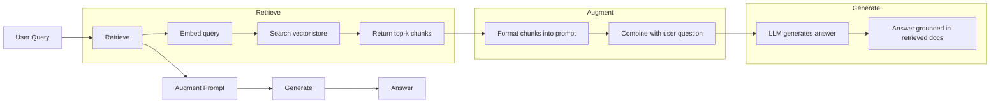
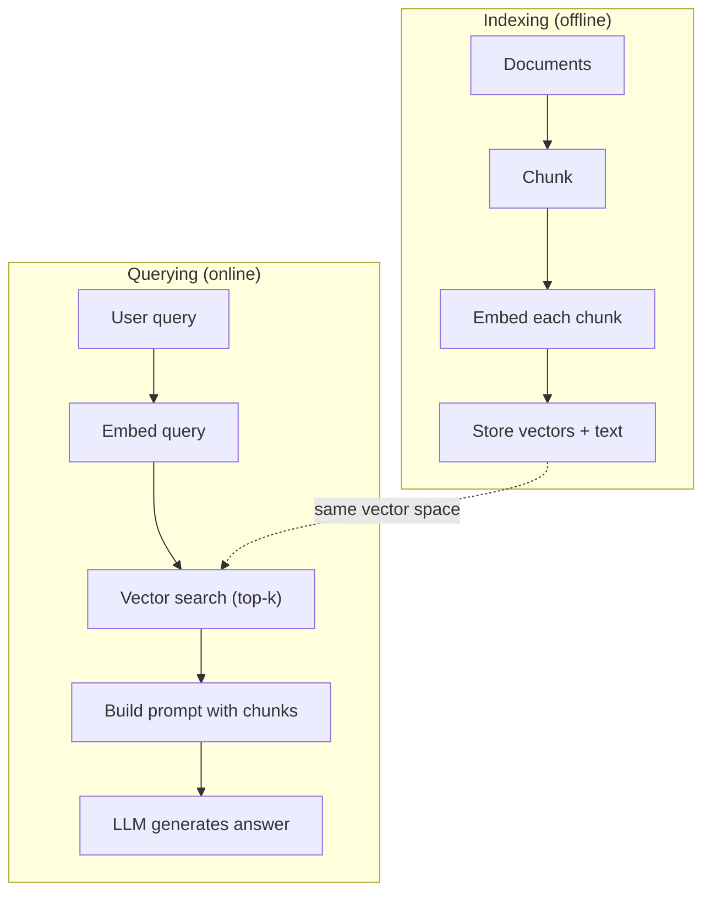

# RAG（檢索增強生成）

> 你的 LLM 知道訓練截止日之前的一切。它對你公司的文件、你的程式庫，或上週的會議紀錄一無所知。RAG 的解法是把相關文件取出來、塞進提示詞裡。這是生產環境 AI 中部署最廣的模式。如果這門課你只動手做一件事，就做一條 RAG 管線。

**類型：** 實作
**程式語言：** Python
**先修單元：** 階段 10（從零打造 LLM）、階段 11 第 01-05 課
**時間：** 約 90 分鐘
**相關單元：** 階段 5 · 23（RAG 的切塊策略）談六種切塊演算法各自勝出的時機。階段 5 · 22（嵌入模型深入探討）談怎麼挑嵌入器。階段 11 · 07（進階 RAG）談混合搜尋、重排與查詢轉換。

## 學習目標

- 建一條完整的 RAG 管線：文件載入、切塊、嵌入、向量儲存、檢索與生成
- 用向量資料庫（ChromaDB、FAISS 或 Pinecone）實作語意搜尋，並做好索引
- 說明在以知識為根據的應用上，為什麼 RAG 優於微調（成本、時效性、可歸因性）
- 用檢索指標（precision、recall）與生成指標（忠實度、相關性）評估 RAG 品質

## 問題所在

你為公司做了一個聊天機器人。客戶問「What's the refund policy for enterprise plans?」LLM 給出一個關於典型 SaaS 退款政策的通用答案。而真正的政策埋在一份 200 頁的內部 wiki 裡，寫著企業客戶有 60 天的窗口、按比例退款。LLM 從來沒見過那份文件。它不可能知道它沒被訓練過的東西。

微調是一種解法。拿那個 LLM，在你的內部文件上訓練，然後部署更新後的模型。這行得通，但問題很嚴重。微調的算力成本要好幾千美元。文件一改，模型立刻過時。你沒辦法知道模型是從哪個來源取材的。而如果公司下個月併進另一條產品線，你又要微調一次。

RAG 是另一種解法。模型完全不動。問題進來時，在你的文件庫裡搜出相關段落，貼在問題前面，讓模型用那些段落當上下文來回答。文件庫幾分鐘就能更新。你能清楚看到取出了哪些文件。模型本身永遠不變。這就是為什麼 RAG 是生產環境的主流模式：它更便宜、更即時、更可稽核，而且搭配任何 LLM 都能用。

## 核心概念

### RAG 模式

整個模式就四步：



查詢 -> 檢索 -> 增強提示詞 -> 生成。每一個 RAG 系統都遵循這個模式。生產級 RAG 系統之間的差別，在於每一步的細節：怎麼切塊、怎麼嵌入、怎麼搜尋、怎麼組出提示詞。

### 為什麼 RAG 勝過微調

| 考量 | 微調 | RAG |
|---------|------------|-----|
| 成本 | 每次訓練 $1,000-$100,000+ | 每次查詢 $0.01-$0.10（嵌入 + LLM） |
| 時效性 | 沒重新訓練就是過期的 | 重新索引文件，幾分鐘就更新 |
| 可稽核性 | 無法追溯答案來源 | 能展示確切取出的段落 |
| 幻覺 | 照樣自由地產生幻覺 | 以檢索到的文件為根據 |
| 資料隱私 | 訓練資料被烤進權重裡 | 文件留在你自己的向量庫 |

微調永久改變模型的權重。RAG 暫時改變模型的上下文。對大多數應用來說，暫時性的上下文才是你要的。

微調唯一勝出的情況：當你需要模型採用某種特定風格、語氣或推理模式，而那是光靠下提示詞做不到的。若是事實性知識的檢索，RAG 每次都贏。

### 嵌入模型

嵌入模型把文字轉成稠密向量。相似的文字產出的向量在這個高維空間裡彼此靠近。「How do I reset my password?」和「I need to change my password」共用的字很少，卻產出幾乎相同的向量。「The cat sat on the mat」則產出非常不同的向量。

常見的嵌入模型（2026 年陣容 —— 完整分析見階段 5 · 22）：

| 模型 | 維度 | 供應商 | 備註 |
|-------|-----------|----------|-------|
| text-embedding-3-small | 1536（Matryoshka） | OpenAI | 多數場景下性價比最好 |
| text-embedding-3-large | 3072（Matryoshka） | OpenAI | 正確率更高，可截斷到 256/512/1024 |
| Gemini Embedding 2 | 3072（Matryoshka） | Google | MTEB 檢索居首；8K 上下文 |
| voyage-4 | 1024/2048（Matryoshka） | Voyage AI | 有領域變體（程式碼、金融、法律） |
| Cohere embed-v4 | 1024（Matryoshka） | Cohere | 多語能力強，128K 上下文 |
| BGE-M3 | 1024（稠密 + 稀疏 + ColBERT） | BAAI（開放權重） | 一個模型給三種視角 |
| Qwen3-Embedding | 4096（Matryoshka） | 阿里巴巴（開放權重） | 開放權重中檢索分數最高 |
| all-MiniLM-L6-v2 | 384 | 開放權重（Sentence Transformers） | 原型開發的基準線 |

這一課我們用 TF-IDF 打造自己的簡單嵌入。不是因為生產系統用 TF-IDF，而是因為它讓概念變具體：文字進去，向量出來，相似的文字產出相似的向量。

### 向量相似度

給定兩個向量，你要怎麼衡量相似度？三個選項：

**餘弦相似度**：兩個向量夾角的餘弦值。範圍從 -1（相反）到 1（相同）。忽略長度，只在乎方向。這是 RAG 的預設。

```
cosine_sim(a, b) = dot(a, b) / (||a|| * ||b||)
```

**點積**：原始的內積。較長的向量會拿到較高的分數。當長度本身承載資訊時（較長的文件可能更相關）就有用。

```
dot(a, b) = sum(a_i * b_i)
```

**L2（歐幾里得）距離**：向量空間裡的直線距離。距離越小 = 越相似。對長度差異敏感。

```
L2(a, b) = sqrt(sum((a_i - b_i)^2))
```

餘弦相似度是標準做法。它以長度做正規化，所以能優雅地處理長度不同的文件。當有人說「向量搜尋」時，他們幾乎都是指餘弦相似度。

### 切塊策略

文件太長，沒辦法嵌成單一向量。一份 50 頁的 PDF 可能產出很糟的嵌入，因為它含有數十個主題。你該做的是把文件切成塊，每一塊分別嵌入。

**固定大小切塊**：每 N 個詞元切一刀。簡單、可預測。512 詞元的塊搭配 50 詞元重疊，意思是第 1 塊是詞元 0-511，第 2 塊是詞元 462-973，以此類推。重疊確保你不會在不巧的邊界把句子切斷。

**語意切塊**：在自然邊界切。段落、章節或 markdown 標題。每一塊都是一個連貫的語意單元。實作更複雜，但檢索效果更好。

**遞迴切塊**：先試著在最大的邊界切（章節標題）。如果某一節還是太大，就在段落邊界切。段落還是太大，就在句子邊界切。這是 LangChain RecursiveCharacterTextSplitter 的做法，實務上很好用。

切塊大小比大家想的更重要：

- 太小（64-128 詞元）：每一塊缺乏上下文。「It increased 15% last quarter」在不知道「it」指什麼的情況下毫無意義。
- 太大（2048+ 詞元）：每一塊涵蓋多個主題，把相關性稀釋掉。當你搜營收資料時，拿到的是一塊只有 10% 講營收、90% 講人力的東西。
- 甜蜜點（256-512 詞元）：上下文足夠自成一體，聚焦程度也足以保持相關。

多數生產級 RAG 系統用 256-512 詞元的塊，搭配 50 詞元重疊。Anthropic 的 RAG 指南也建議這個範圍。

### 向量資料庫

有了嵌入，你需要一個地方儲存並搜尋它們。選項：

| 資料庫 | 類型 | 最適合 |
|----------|------|----------|
| FAISS | 函式庫（行程內） | 原型開發、中小型資料集 |
| Chroma | 輕量資料庫 | 本機開發、小型部署 |
| Pinecone | 託管服務 | 不想承擔維運的生產環境 |
| Weaviate | 開源資料庫 | 自架的生產環境 |
| pgvector | Postgres 擴充 | 本來就在用 Postgres |
| Qdrant | 開源資料庫 | 高效能自架 |

這一課我們做一個簡單的記憶體內向量庫。它把向量存在串列裡，用暴力法做餘弦相似度搜尋。這相當於用 flat index 的 FAISS。大概到 10 萬個向量之後就會開始變慢。生產系統用 HNSW 這類近似最近鄰（ANN）演算法，在毫秒內搜尋數百萬個向量。

### 完整管線



索引階段每份文件跑一次（或文件更新時跑）。查詢階段在每一次使用者請求時跑。生產環境的索引可能要花好幾個小時處理數百萬份文件，查詢則必須在一秒內回應。

### 真實數字

多數生產級 RAG 系統用這些參數：

- **k = 5 到 10** 每次查詢取出的塊數
- **切塊大小 = 256 到 512 詞元**，搭配 50 詞元重疊
- **上下文預算**：每次查詢 2,500-5,000 詞元的檢索內容
- **提示詞總量**：約 8,000-16,000 詞元（系統提示詞 + 檢索到的塊 + 對話歷史 + 使用者查詢）
- **嵌入維度**：依模型 384-3072
- **索引吞吐量**：用 API 嵌入時每秒 100-1,000 份文件
- **查詢延遲**：檢索 50-200 毫秒，生成 500-3000 毫秒

```figure
rag-chunking
```

## 實作

### 步驟 1：文件切塊

```python
def chunk_text(text, chunk_size=200, overlap=50):
    words = text.split()
    chunks = []
    start = 0
    while start < len(words):
        end = start + chunk_size
        chunk = " ".join(words[start:end])
        chunks.append(chunk)
        start += chunk_size - overlap
    return chunks
```

### 步驟 2：TF-IDF 嵌入

我們做一個簡單的嵌入函數。TF-IDF（詞頻－逆文件頻率）不是神經嵌入，但它把文字轉成向量的方式能捕捉詞的重要性。在一份文件裡出現頻繁的詞會有較高的 TF；在整個語料庫裡罕見的詞會有較高的 IDF。兩者相乘得到的向量，會讓重要而有辨識度的詞擁有高數值。

```python
import math
from collections import Counter

def build_vocabulary(documents):
    vocab = set()
    for doc in documents:
        vocab.update(doc.lower().split())
    return sorted(vocab)

def compute_tf(text, vocab):
    words = text.lower().split()
    count = Counter(words)
    total = len(words)
    return [count.get(word, 0) / total for word in vocab]

def compute_idf(documents, vocab):
    n = len(documents)
    idf = []
    for word in vocab:
        doc_count = sum(1 for doc in documents if word in doc.lower().split())
        idf.append(math.log((n + 1) / (doc_count + 1)) + 1)
    return idf

def tfidf_embed(text, vocab, idf):
    tf = compute_tf(text, vocab)
    return [t * i for t, i in zip(tf, idf)]
```

### 步驟 3：餘弦相似度搜尋

```python
def cosine_similarity(a, b):
    dot = sum(x * y for x, y in zip(a, b))
    norm_a = math.sqrt(sum(x * x for x in a))
    norm_b = math.sqrt(sum(x * x for x in b))
    if norm_a == 0 or norm_b == 0:
        return 0.0
    return dot / (norm_a * norm_b)

def search(query_embedding, stored_embeddings, top_k=5):
    scores = []
    for i, emb in enumerate(stored_embeddings):
        sim = cosine_similarity(query_embedding, emb)
        scores.append((i, sim))
    scores.sort(key=lambda x: x[1], reverse=True)
    return scores[:top_k]
```

### 步驟 4：組出提示詞

這裡就是 RAG 裡「增強」發生的地方。拿檢索到的塊，編排成提示詞，請 LLM 依提供的上下文作答。

```python
def build_rag_prompt(query, retrieved_chunks):
    context = "\n\n---\n\n".join(
        f"[Source {i+1}]\n{chunk}"
        for i, chunk in enumerate(retrieved_chunks)
    )
    return f"""Answer the question based ONLY on the following context.
If the context doesn't contain enough information, say "I don't have enough information to answer that."

Context:
{context}

Question: {query}

Answer:"""
```

### 步驟 5：完整的 RAG 管線

```python
class RAGPipeline:
    def __init__(self):
        self.chunks = []
        self.embeddings = []
        self.vocab = []
        self.idf = []

    def index(self, documents):
        all_chunks = []
        for doc in documents:
            all_chunks.extend(chunk_text(doc))
        self.chunks = all_chunks
        self.vocab = build_vocabulary(all_chunks)
        self.idf = compute_idf(all_chunks, self.vocab)
        self.embeddings = [
            tfidf_embed(chunk, self.vocab, self.idf)
            for chunk in all_chunks
        ]

    def query(self, question, top_k=5):
        query_emb = tfidf_embed(question, self.vocab, self.idf)
        results = search(query_emb, self.embeddings, top_k)
        retrieved = [(self.chunks[i], score) for i, score in results]
        prompt = build_rag_prompt(
            question, [chunk for chunk, _ in retrieved]
        )
        return prompt, retrieved
```

### 步驟 6：生成（模擬）

在生產環境，這裡就是你呼叫 LLM API 的地方。這一課我們用「從檢索到的上下文裡抽出最相關的句子」來模擬生成。

```python
def simple_generate(prompt, retrieved_chunks):
    query_words = set(prompt.lower().split("question:")[-1].split())
    best_sentence = ""
    best_score = 0
    for chunk in retrieved_chunks:
        for sentence in chunk.split("."):
            sentence = sentence.strip()
            if not sentence:
                continue
            words = set(sentence.lower().split())
            overlap = len(query_words & words)
            if overlap > best_score:
                best_score = overlap
                best_sentence = sentence
    return best_sentence if best_sentence else "I don't have enough information."
```

## 實務應用

換上真實的嵌入模型和 LLM，程式碼幾乎不變：

```python
from openai import OpenAI

client = OpenAI()

def embed(text):
    response = client.embeddings.create(
        model="text-embedding-3-small",
        input=text
    )
    return response.data[0].embedding

def generate(prompt):
    response = client.chat.completions.create(
        model="gpt-4o-mini",
        messages=[{"role": "user", "content": prompt}],
        temperature=0
    )
    return response.choices[0].message.content
```

或改用 Anthropic：

```python
import anthropic

client = anthropic.Anthropic()

def generate(prompt):
    response = client.messages.create(
        model="claude-sonnet-5",
        max_tokens=1024,
        messages=[{"role": "user", "content": prompt}]
    )
    return response.content[0].text
```

管線是一樣的。換掉嵌入函數，換掉生成函數。檢索邏輯、切塊、組提示詞 —— 不管你用哪些模型，全都一模一樣。

要在規模下做向量儲存，把暴力搜尋換成一個正式的向量資料庫：

```python
import chromadb

client = chromadb.Client()
collection = client.create_collection("my_docs")

collection.add(
    documents=chunks,
    ids=[f"chunk_{i}" for i in range(len(chunks))]
)

results = collection.query(
    query_texts=["What is the refund policy?"],
    n_results=5
)
```

Chroma 內部就處理了嵌入（預設用 all-MiniLM-L6-v2），並把向量存在本機資料庫。同樣的模式，只是水管不同。

## 產出

這一課會產出：
- `outputs/prompt-rag-architect.md` —— 一個提示詞，用來為特定場景設計 RAG 系統
- `outputs/skill-rag-pipeline.md` —— 一個技能，教代理如何建置與除錯 RAG 管線

## 練習

1. 把 TF-IDF 嵌入換成簡單的詞袋做法（二元：詞存在為 1，不存在為 0）。在樣本文件上比較檢索品質。TF-IDF 應該會勝出，因為它給罕見詞更高的權重。

2. 實驗切塊大小：在同一組文件上試 50、100、200、500 個詞。每種大小都跑同樣 5 個查詢，數一數有幾個在 top-3 裡回傳了相關的塊。找出檢索品質達到峰值的甜蜜點。

3. 為每一塊加上元資料（來源文件名稱、塊的位置）。修改提示詞模板來納入來源歸屬，讓 LLM 引用它的出處。

4. 實作一個簡單的評估：給定 10 組問答配對，把每個問題跑過 RAG 管線，量測有多少比例的檢索塊含有答案。這就是 k 處的檢索召回率。

5. 做一條有對話意識的 RAG 管線：維護最近 3 次交流的歷史，並和檢索到的塊一起放進提示詞。用追問測試它，例如問完定價之後再問「What about enterprise?」。

## 關鍵術語

| 術語 | 大家怎麼說 | 它實際上是什麼 |
|------|----------------|----------------------|
| RAG | 「會讀你文件的 AI」 | 取出相關文件、貼進提示詞，並生成以那些文件為根據的答案 |
| 嵌入（Embedding） | 「把文字轉成數字」 | 文字的稠密向量表示，相近的語意產出相近的向量 |
| 向量資料庫（Vector database） | 「AI 的搜尋引擎」 | 專為儲存向量、並依相似度找最近鄰而最佳化的資料儲存 |
| 切塊（Chunking） | 「把文件切成片」 | 把文件切成較小的片段（通常 256-512 詞元），讓每一段都能獨立嵌入與檢索 |
| 餘弦相似度（Cosine similarity） | 「兩個向量有多像」 | 兩個向量夾角的餘弦值；1 = 方向相同，0 = 正交，-1 = 相反 |
| Top-k 檢索 | 「取最好的 k 個匹配」 | 從向量庫回傳與查詢最相似的 k 塊 |
| 上下文視窗（Context window） | 「LLM 能看到多少文字」 | LLM 單次請求能處理的最大詞元數；檢索到的塊必須裝得進去 |
| 增強生成（Augmented generation） | 「用給定的上下文回答」 | 用檢索到的文件當上下文來生成回應，而不是只依賴訓練得到的知識 |
| TF-IDF | 「詞重要性評分」 | 詞頻乘上逆文件頻率；依一個詞在語料庫裡有多具辨識度來給它權重 |
| 索引（Indexing） | 「把文件準備好可以搜」 | 離線把文件切塊、嵌入並儲存的過程，讓它們在查詢時可被搜尋 |

## 延伸閱讀

- Lewis et al., "Retrieval-Augmented Generation for Knowledge-Intensive NLP Tasks" (2020) —— 來自 Facebook AI Research 的原始 RAG 論文，把「先檢索再生成」的模式形式化
- Anthropic's RAG documentation (docs.anthropic.com) —— 關於切塊大小、組提示詞與評估的實務指引
- Pinecone Learning Center, "What is RAG?" —— 用清晰的視覺化解釋 RAG 管線，並涵蓋生產環境考量
- Sentence-BERT: Reimers & Gurevych (2019) —— all-MiniLM 系列嵌入模型背後的論文，說明如何訓練雙編碼器做語意相似度
- [Karpukhin et al., "Dense Passage Retrieval for Open-Domain Question Answering" (EMNLP 2020)](https://arxiv.org/abs/2004.04906) —— DPR 論文，證明稠密雙編碼器檢索在開放領域問答上勝過 BM25，並確立了現代 RAG 檢索器的模式。
- [LlamaIndex High-Level Concepts](https://docs.llamaindex.ai/en/stable/getting_started/concepts.html) —— 建 RAG 管線時要懂的主要概念：資料載入器、節點解析器、索引、檢索器、回應合成器。
- [LangChain RAG tutorial](https://python.langchain.com/docs/tutorials/rag/) —— 另一種風味的協作框架；用 runnable 鏈的角度看同樣的「先檢索再生成」模式。
