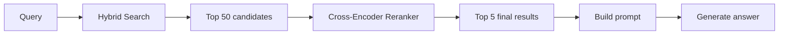
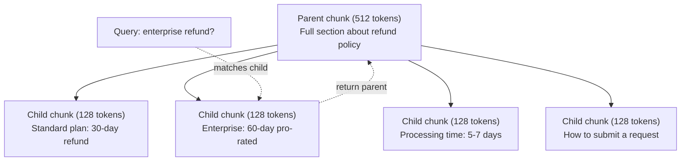
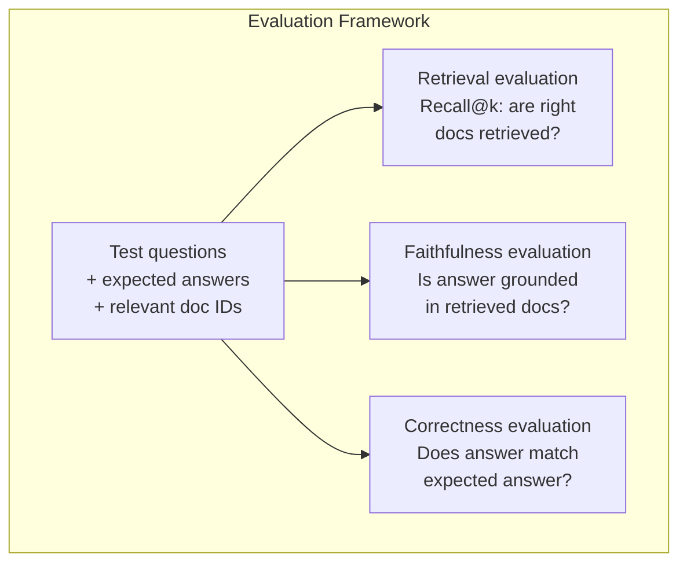

# 進階 RAG（切塊、重排、混合搜尋）

> 基本 RAG 取出最相似的 top-k 塊。這對簡單問題有效，但碰上多跳推理、模糊查詢和大型語料庫就潰散了。進階 RAG 就是「在 10 份文件上跑得動的示範」與「在 1000 萬份文件上跑得動的系統」之間的差別。

**類型：** 實作
**程式語言：** Python
**先修單元：** 階段 11，第 06 課（RAG）
**時間：** 約 90 分鐘
**相關單元：** 階段 5 · 23（RAG 的切塊策略）涵蓋全部六種切塊演算法 —— 遞迴、語意、句子、父文件、後期切塊、上下文檢索 —— 附 Vectara/Anthropic 的基準數據。這一課建在它之上：混合搜尋、重排、查詢轉換。

## 學習目標

- 實作能保留文件結構與上下文的進階切塊策略（語意、遞迴、父子）
- 建一條混合搜尋管線，把 BM25 關鍵字比對、語意向量搜尋與交叉編碼器重排器結合起來
- 運用查詢轉換技術（HyDE、多查詢、退一步提問）來改善模糊或複雜問題的檢索
- 診斷並修好常見的 RAG 失效：取到錯的塊、答案不在上下文裡、多跳推理崩掉

## 問題所在

你在第 06 課建了一條基本 RAG 管線。它在小語料庫上處理直白的問題沒問題。現在試試這些：

**模糊查詢**：「What was revenue last quarter?」語意搜尋回傳的是關於營收策略、營收預測，以及財務長對營收成長看法的塊。全都在語意上和「revenue」這個字接近，卻沒有一塊含有真正的數字。正確的那一塊寫著「$47.2M in Q3 2025」，但用的字是「earnings」而不是「revenue」。嵌入模型認為「revenue strategy」比「Q3 earnings were $47.2M」更接近這個查詢。

**多跳問題**：「Which team had the highest customer satisfaction score improvement?」這需要先找出每個團隊的滿意度分數，比較它們，再指出最大值。沒有任何單一塊含有答案。資訊散落在各團隊報告裡。

**大型語料庫問題**：你有 200 萬塊。正確答案在第 1,847,293 塊。你的 top-5 檢索拉出了第 14、89,201、1,200,000、44 和 901,333 塊。在嵌入空間裡都很近，但沒有一塊含有答案。在這個規模下，近似最近鄰搜尋引入的誤差已足以把相關結果擠出 top-k。

基本 RAG 會失敗，是因為向量相似度不等於相關性。一塊內容可以在語意上接近查詢，卻對回答它毫無用處。進階 RAG 用四種技術來處理這件事：混合搜尋（加上關鍵字比對）、重排（更仔細地給候選評分）、查詢轉換（搜尋前先修好查詢），以及更好的切塊（在對的粒度上檢索）。

## 核心概念

### 混合搜尋：語意 + 關鍵字

語意搜尋（向量相似度）擅長理解語意。「How do I cancel my subscription?」能匹配到「Steps to terminate your plan」，即使兩者沒有共用任何字。但它會漏掉精確匹配。如果嵌入模型把「Error code E-4021」當成雜訊，它可能匹配不到含有「E-4021」的那一塊。

關鍵字搜尋（BM25）剛好相反。它在精確匹配上表現極佳，「E-4021」完美匹配。但如果文件寫的是「terminate your plan」，「cancel my subscription」就會回傳零筆結果。

混合搜尋兩邊都跑，然後把結果合併。

**BM25**（Best Matching 25）是標準的關鍵字搜尋演算法。從 1990 年代起它就是搜尋引擎的骨幹。公式如下：

```
BM25(q, d) = sum over terms t in q:
    IDF(t) * (tf(t,d) * (k1 + 1)) / (tf(t,d) + k1 * (1 - b + b * |d| / avgdl))
```

其中 tf(t,d) 是 t 在文件 d 中的詞頻，IDF(t) 是逆文件頻率，|d| 是文件長度，avgdl 是平均文件長度，k1 控制詞頻飽和（預設 1.2），b 控制長度正規化（預設 0.75）。

用白話說：BM25 會給含有查詢詞（尤其是罕見詞）的文件較高分，但重複出現的詞有報酬遞減。一份出現 50 次「revenue」的文件，並不會比出現一次的相關 50 倍。

### 倒數排名融合（RRF）

你有兩份排序清單：一份來自向量搜尋，一份來自 BM25。要怎麼合併？倒數排名融合是標準做法。

```
RRF_score(d) = sum over rankings R:
    1 / (k + rank_R(d))
```

其中 k 是一個常數（通常 60），用來避免排名第一的結果一家獨大。

在向量搜尋排第 1、BM25 排第 5 的文件得到：1/(60+1) + 1/(60+5) = 0.0164 + 0.0154 = 0.0318

在向量搜尋排第 3、BM25 排第 2 的文件得到：1/(60+3) + 1/(60+2) = 0.0159 + 0.0161 = 0.0320

RRF 自然地平衡了這兩種訊號。在兩份清單裡都排前面的文件拿到最好的分數。在一份清單排第 1、但另一份完全缺席的文件拿到中等分數。這很穩健，因為它用的是排名而不是原始分數，所以兩個系統之間分數分布的差異無關緊要。

### 重排

檢索（不論向量、關鍵字或混合）很快但不精準。它用的是雙編碼器：查詢和每份文件各自獨立嵌入，然後比較。嵌入算一次就快取起來。這能擴展到數百萬份文件。

重排用的是交叉編碼器：查詢和某個候選文件一起餵進模型，模型輸出一個相關性分數。模型同時看到兩段文字，能捕捉它們之間細緻的交互作用。交叉編碼器能理解「What were Q3 earnings?」和含有「$47.2M in Q3」的那一塊高度相關，即使雙編碼器漏掉了這層關聯。

代價是：交叉編碼器比雙編碼器慢 100-1000 倍，因為它要把查詢-文件配對一起處理。你不可能為一百萬份文件預先算好交叉編碼器分數。解法是：先檢索一個較大的候選集（混合搜尋的 top-50），再用交叉編碼器重排出最終的 top-5。



常見的重排模型（2026 年陣容）：
- Cohere Rerank 3.5：託管 API，多語，在混合語料庫上召回率提升最多
- Voyage rerank-2.5：託管 API，託管選項中延遲最低
- Jina-Reranker-v2 Multilingual：開放權重，支援 100 多種語言
- bge-reranker-v2-m3：開放權重，很強的基準線
- cross-encoder/ms-marco-MiniLM-L-6-v2：開放權重，可在 CPU 上跑，適合原型開發
- ColBERTv2 / Jina-ColBERT-v2：後期互動的多向量重排器 —— 評分時是 O(詞元數) 而非 O(文件數)

### 查詢轉換

有時問題不在檢索，而在查詢本身。「What was that thing about the new policy change?」是個糟糕的搜尋查詢。它沒有任何具體詞彙，嵌入很模糊。任何檢索系統都不可能從這句話找到對的文件。

**查詢重寫**：把使用者的查詢改寫成更好的搜尋查詢。LLM 可以做這件事：

```
User: "What was that thing about the new policy change?"
Rewritten: "Recent policy changes and updates"
```

**HyDE（假設性文件嵌入）**：不要用查詢去搜尋，而是先生成一個假設性答案、把它嵌入，再去搜尋與它相似的真實文件。

```
Query: "What is the refund policy for enterprise?"
Hypothetical answer: "Enterprise customers are eligible for a full refund
within 60 days of purchase. Refunds are pro-rated based on the remaining
subscription period and processed within 5-7 business days."
```

把假設性答案嵌入，再搜尋與它相似的真實文件。直覺是：假設性答案在嵌入空間裡離真正的答案，比原始問題離答案更近。問題和答案有不同的語言結構。生成一個假設性答案，就是在嵌入裡搭起「問題空間」與「答案空間」之間的橋。

HyDE 在檢索前多加一次 LLM 呼叫，會讓延遲增加 500-2000 毫秒。當原始查詢的檢索品質很差時，這代價是值得的。

### 父子切塊

標準切塊迫使你做取捨：小塊利於精準檢索，大塊才有足夠上下文。父子切塊消掉了這個取捨。

索引小塊（128 詞元）用於檢索。當某個小塊被取出時，回傳它的父塊（512 詞元）放進提示詞。小塊精準地匹配查詢，父塊則提供足夠的上下文讓 LLM 生成好答案。



查詢「enterprise refund?」精準匹配到子塊 C2。但提示詞收到的是完整的父塊 P，其中包含處理時間與送件流程的周邊上下文。

### 元資料過濾

在跑向量搜尋之前，先用元資料過濾語料庫：日期、來源、類別、作者、語言。這能縮小搜尋空間，避免不相干的結果。

「What changed in the security policy last month?」應該只搜尋最近 30 天、security 類別的文件。沒有元資料過濾，你會搜遍整個語料庫，可能取出一份剛好語意相似的兩年前安全文件。

生產級 RAG 系統會把元資料和每一塊存在一起：來源文件、建立日期、類別、作者、版本。向量資料庫支援在相似度搜尋之前先用元資料預過濾，這對規模下的效能至關重要。

### 評估

你建好了一個 RAG 系統。要怎麼知道它有效？三個指標：

**檢索相關性（Recall@k）**：對一組已知相關文件的測試問題，有多少比例的相關文件出現在 top-k 結果裡？如果某問題的答案在第 47 塊，第 47 塊有出現在 top-5 裡嗎？

**忠實度**：生成的答案有以檢索到的文件為根據嗎？如果取出的塊寫「60-day refund window」，模型卻說「90-day refund window」，那就是忠實度失效。模型明明有正確的上下文，卻還是產生幻覺。

**答案正確性**：生成的答案和預期答案相符嗎？這是端到端的指標，同時涵蓋檢索品質與生成品質。

一個簡單的忠實度檢查：把生成答案裡的每個主張拿出來，確認它（在實質內容上）出現在檢索到的塊裡。如果答案含有任何檢索塊都沒有的事實，它很可能是幻覺。



## 實作

### 步驟 1：BM25 實作

```python
import math
from collections import Counter

class BM25:
    def __init__(self, k1=1.2, b=0.75):
        self.k1 = k1
        self.b = b
        self.docs = []
        self.doc_lengths = []
        self.avg_dl = 0
        self.doc_freqs = {}
        self.n_docs = 0

    def index(self, documents):
        self.docs = documents
        self.n_docs = len(documents)
        self.doc_lengths = []
        self.doc_freqs = {}

        for doc in documents:
            words = doc.lower().split()
            self.doc_lengths.append(len(words))
            unique_words = set(words)
            for word in unique_words:
                self.doc_freqs[word] = self.doc_freqs.get(word, 0) + 1

        self.avg_dl = sum(self.doc_lengths) / self.n_docs if self.n_docs else 1

    def score(self, query, doc_idx):
        query_words = query.lower().split()
        doc_words = self.docs[doc_idx].lower().split()
        doc_len = self.doc_lengths[doc_idx]
        word_counts = Counter(doc_words)
        score = 0.0

        for term in query_words:
            if term not in word_counts:
                continue
            tf = word_counts[term]
            df = self.doc_freqs.get(term, 0)
            idf = math.log((self.n_docs - df + 0.5) / (df + 0.5) + 1)
            numerator = tf * (self.k1 + 1)
            denominator = tf + self.k1 * (1 - self.b + self.b * doc_len / self.avg_dl)
            score += idf * numerator / denominator

        return score

    def search(self, query, top_k=10):
        scores = [(i, self.score(query, i)) for i in range(self.n_docs)]
        scores.sort(key=lambda x: x[1], reverse=True)
        return scores[:top_k]
```

### 步驟 2：倒數排名融合

```python
def reciprocal_rank_fusion(ranked_lists, k=60):
    scores = {}
    for ranked_list in ranked_lists:
        for rank, (doc_id, _) in enumerate(ranked_list):
            if doc_id not in scores:
                scores[doc_id] = 0.0
            scores[doc_id] += 1.0 / (k + rank + 1)
    fused = sorted(scores.items(), key=lambda x: x[1], reverse=True)
    return fused
```

### 步驟 3：混合搜尋管線

```python
def hybrid_search(query, chunks, vector_embeddings, vocab, idf, bm25_index, top_k=5, fusion_k=60):
    query_emb = tfidf_embed(query, vocab, idf)
    vector_results = search(query_emb, vector_embeddings, top_k=top_k * 3)
    bm25_results = bm25_index.search(query, top_k=top_k * 3)
    fused = reciprocal_rank_fusion([vector_results, bm25_results], k=fusion_k)
    return fused[:top_k]
```

### 步驟 4：簡單的重排器

生產環境你會用交叉編碼器模型。這裡我們做一個重排器，用詞重疊、詞重要性與片語匹配來為查詢-文件相關性評分。

```python
def rerank(query, candidates, chunks):
    query_words = set(query.lower().split())
    stop_words = {"the", "a", "an", "is", "are", "was", "were", "what", "how",
                  "why", "when", "where", "do", "does", "for", "of", "in", "to",
                  "and", "or", "on", "at", "by", "it", "its", "this", "that",
                  "with", "from", "be", "has", "have", "had", "not", "but"}
    query_terms = query_words - stop_words

    scored = []
    for doc_id, initial_score in candidates:
        chunk = chunks[doc_id].lower()
        chunk_words = set(chunk.split())

        term_overlap = len(query_terms & chunk_words)

        query_bigrams = set()
        q_list = [w for w in query.lower().split() if w not in stop_words]
        for i in range(len(q_list) - 1):
            query_bigrams.add(q_list[i] + " " + q_list[i + 1])
        bigram_matches = sum(1 for bg in query_bigrams if bg in chunk)

        position_boost = 0
        for term in query_terms:
            pos = chunk.find(term)
            if pos != -1 and pos < len(chunk) // 3:
                position_boost += 0.5

        rerank_score = (
            term_overlap * 1.0
            + bigram_matches * 2.0
            + position_boost
            + initial_score * 5.0
        )
        scored.append((doc_id, rerank_score))

    scored.sort(key=lambda x: x[1], reverse=True)
    return scored
```

### 步驟 5：HyDE（假設性文件嵌入）

```python
def hyde_generate_hypothesis(query):
    templates = {
        "what": "The answer to '{query}' is as follows: Based on our documentation, {topic} involves specific policies and procedures that define how the process works.",
        "how": "To address '{query}': The process involves several steps. First, you need to initiate the request. Then, the system processes it according to the defined rules.",
        "default": "Regarding '{query}': Our records indicate specific details and policies related to this topic that provide a comprehensive answer."
    }
    query_lower = query.lower()
    if query_lower.startswith("what"):
        template = templates["what"]
    elif query_lower.startswith("how"):
        template = templates["how"]
    else:
        template = templates["default"]

    topic_words = [w for w in query.lower().split()
                   if w not in {"what", "is", "the", "how", "do", "does", "a", "an",
                                "for", "of", "to", "in", "on", "at", "by", "and", "or"}]
    topic = " ".join(topic_words) if topic_words else "this topic"

    return template.format(query=query, topic=topic)


def hyde_search(query, chunks, vector_embeddings, vocab, idf, top_k=5):
    hypothesis = hyde_generate_hypothesis(query)
    hypothesis_emb = tfidf_embed(hypothesis, vocab, idf)
    results = search(hypothesis_emb, vector_embeddings, top_k)
    return results, hypothesis
```

### 步驟 6：父子切塊

```python
def create_parent_child_chunks(text, parent_size=200, child_size=50):
    words = text.split()
    parents = []
    children = []
    child_to_parent = {}

    parent_idx = 0
    start = 0
    while start < len(words):
        parent_end = min(start + parent_size, len(words))
        parent_text = " ".join(words[start:parent_end])
        parents.append(parent_text)

        child_start = start
        while child_start < parent_end:
            child_end = min(child_start + child_size, parent_end)
            child_text = " ".join(words[child_start:child_end])
            child_idx = len(children)
            children.append(child_text)
            child_to_parent[child_idx] = parent_idx
            child_start += child_size

        parent_idx += 1
        start += parent_size

    return parents, children, child_to_parent
```

### 步驟 7：忠實度評估

```python
def evaluate_faithfulness(answer, retrieved_chunks):
    answer_sentences = [s.strip() for s in answer.split(".") if len(s.strip()) > 10]
    if not answer_sentences:
        return 1.0, []

    grounded = 0
    ungrounded = []
    context = " ".join(retrieved_chunks).lower()

    for sentence in answer_sentences:
        words = set(sentence.lower().split())
        stop_words = {"the", "a", "an", "is", "are", "was", "were", "and", "or",
                      "to", "of", "in", "for", "on", "at", "by", "it", "this", "that"}
        content_words = words - stop_words
        if not content_words:
            grounded += 1
            continue

        matched = sum(1 for w in content_words if w in context)
        ratio = matched / len(content_words) if content_words else 0

        if ratio >= 0.5:
            grounded += 1
        else:
            ungrounded.append(sentence)

    score = grounded / len(answer_sentences) if answer_sentences else 1.0
    return score, ungrounded


def evaluate_retrieval_recall(queries_with_relevant, retrieval_fn, k=5):
    total_recall = 0.0
    results = []

    for query, relevant_indices in queries_with_relevant:
        retrieved = retrieval_fn(query, k)
        retrieved_indices = set(idx for idx, _ in retrieved)
        relevant_set = set(relevant_indices)
        hits = len(retrieved_indices & relevant_set)
        recall = hits / len(relevant_set) if relevant_set else 1.0
        total_recall += recall
        results.append({
            "query": query,
            "recall": recall,
            "hits": hits,
            "total_relevant": len(relevant_set)
        })

    avg_recall = total_recall / len(queries_with_relevant) if queries_with_relevant else 0
    return avg_recall, results
```

## 實務應用

用真實的交叉編碼器做重排：

```python
from sentence_transformers import CrossEncoder

reranker = CrossEncoder("cross-encoder/ms-marco-MiniLM-L-6-v2")

def rerank_with_cross_encoder(query, candidates, chunks, top_k=5):
    pairs = [(query, chunks[doc_id]) for doc_id, _ in candidates]
    scores = reranker.predict(pairs)
    scored = list(zip([doc_id for doc_id, _ in candidates], scores))
    scored.sort(key=lambda x: x[1], reverse=True)
    return scored[:top_k]
```

用 Cohere 的託管重排器：

```python
import cohere

co = cohere.Client()

def rerank_with_cohere(query, candidates, chunks, top_k=5):
    docs = [chunks[doc_id] for doc_id, _ in candidates]
    response = co.rerank(
        model="rerank-english-v3.0",
        query=query,
        documents=docs,
        top_n=top_k
    )
    return [(candidates[r.index][0], r.relevance_score) for r in response.results]
```

用真實 LLM 做 HyDE：

```python
import anthropic

client = anthropic.Anthropic()

def hyde_with_llm(query):
    response = client.messages.create(
        model="claude-sonnet-5",
        max_tokens=256,
        messages=[{
            "role": "user",
            "content": f"Write a short paragraph that would be a good answer to this question. Do not say you don't know. Just write what the answer would look like.\n\nQuestion: {query}"
        }]
    )
    return response.content[0].text
```

用 Weaviate 做生產級混合搜尋：

```python
import weaviate

client = weaviate.connect_to_local()

collection = client.collections.get("Documents")
response = collection.query.hybrid(
    query="enterprise refund policy",
    alpha=0.5,
    limit=10
)
```

alpha 參數控制平衡：0.0 = 純關鍵字（BM25），1.0 = 純向量，0.5 = 等權重。多數生產系統把 alpha 設在 0.3 到 0.7 之間。

## 產出

這一課會產出：
- `outputs/prompt-advanced-rag-debugger.md` —— 一個提示詞，用來診斷並修好 RAG 的品質問題
- `outputs/skill-advanced-rag.md` —— 一個技能，用來打造帶混合搜尋與重排的生產級 RAG

## 練習

1. 在樣本文件上比較 BM25、向量搜尋與混合搜尋。對 5 個測試查詢的每一個，記下哪種做法在第 1 名回傳了最相關的塊。混合搜尋應該至少在 5 個裡贏 3 個。

2. 實作一個元資料過濾器。為每份文件加一個「category」欄位（security、billing、api、product）。在跑向量搜尋之前，先把塊過濾到相關類別。用「What encryption is used?」測試，並驗證它只搜尋 security 類別的塊。

3. 用第 06 課那個簡單的生成函數建一條完整的 HyDE 管線。在 5 個測試查詢上比較「直接查詢搜尋」與「HyDE 搜尋」的檢索品質（top-3 相關性）。HyDE 應該能改善模糊查詢的結果。

4. 在樣本文件上實作父子切塊策略。用 child_size=30、parent_size=100。用子塊搜尋，但在提示詞裡回傳父塊。把生成的答案和 chunk_size=50 的標準切塊做比較。

5. 建一個評估資料集：10 個已知答案所在塊的問題。對 (a) 只用向量搜尋、(b) 只用 BM25、(c) 混合搜尋、(d) 混合 + 重排，分別量測 Recall@3、Recall@5 和 Recall@10。把結果畫出來，找出重排在哪裡幫助最大。

## 關鍵術語

| 術語 | 大家怎麼說 | 它實際上是什麼 |
|------|----------------|----------------------|
| BM25 | 「關鍵字搜尋」 | 一種機率排序演算法，依詞頻、逆文件頻率與文件長度正規化為文件評分 |
| 混合搜尋（Hybrid search） | 「兩邊的優點都要」 | 並行跑語意（向量）與關鍵字（BM25）搜尋，再用排名融合合併結果 |
| 倒數排名融合（Reciprocal Rank Fusion） | 「合併排序清單」 | 把每份文件在所有清單中的 1/(k + 排名) 加總，藉此合併多份排序清單 |
| 重排（Reranking） | 「第二輪評分」 | 用一個較昂貴的交叉編碼器模型，為初次檢索得到的候選集重新評分 |
| 交叉編碼器（Cross-encoder） | 「查詢-文件合體模型」 | 把查詢和文件當成單一輸入、產出相關性分數的模型；比雙編碼器準，但太慢而無法搜全語料庫 |
| 雙編碼器（Bi-encoder） | 「各自獨立的嵌入模型」 | 分別嵌入查詢與文件的模型；因為嵌入可預先計算而很快，但不如交叉編碼器準 |
| HyDE | 「用假答案去搜尋」 | 為查詢生成一個假設性答案、把它嵌入，再搜尋與它相似的真實文件 |
| 父子切塊（Parent-child chunking） | 「小塊搜尋，大塊上下文」 | 索引小塊以精準檢索，但回傳較大的父塊來提供足夠上下文 |
| 元資料過濾（Metadata filtering） | 「先縮小再搜」 | 在跑向量搜尋前先依屬性（日期、來源、類別）過濾文件，縮小搜尋空間 |
| 忠實度（Faithfulness） | 「有沒有守住依據」 | 生成的答案是否有檢索到的文件支撐，而不是從模型訓練資料裡幻想出來的 |

## 延伸閱讀

- Robertson & Zaragoza, "The Probabilistic Relevance Framework: BM25 and Beyond" (2009) —— BM25 的權威參考，解釋公式背後的機率基礎
- Cormack et al., "Reciprocal Rank Fusion Outperforms Condorcet and Individual Rank Learning Methods" (2009) —— 最初的 RRF 論文，證明它勝過更複雜的融合方法
- Gao et al., "Precise Zero-Shot Dense Retrieval without Relevance Labels" (2022) —— HyDE 論文，證明假設性文件嵌入能在完全不用訓練資料的情況下改善檢索
- Nogueira & Cho, "Passage Re-ranking with BERT" (2019) —— 證明在 BM25 之上加交叉編碼器重排，能顯著提升檢索品質
- [Khattab et al., "DSPy: Compiling Declarative Language Model Calls into Self-Improving Pipelines" (2023)](https://arxiv.org/abs/2310.03714) —— 把組提示詞與權重挑選當成檢索管線上的最佳化問題；想「為 LLM 寫程式」而不是「對 LLM 下提示詞」就讀這篇。
- [Edge et al., "From Local to Global: A Graph RAG Approach to Query-Focused Summarization" (Microsoft Research 2024)](https://arxiv.org/abs/2404.16130) —— GraphRAG 論文：實體關係抽取 + Leiden 社群偵測用於以查詢為焦點的摘要；以及全域對局部檢索的區別。
- [Asai et al., "Self-RAG: Learning to Retrieve, Generate, and Critique through Self-Reflection" (ICLR 2024)](https://arxiv.org/abs/2310.11511) —— 帶反思詞元的自我評估 RAG；超越靜態「先檢索再生成」的代理式前沿。
- [LangChain Query Construction blog](https://blog.langchain.dev/query-construction/) —— 如何把自然語言查詢翻譯成結構化資料庫查詢（Text-to-SQL、Cypher），作為檢索前的一步。
