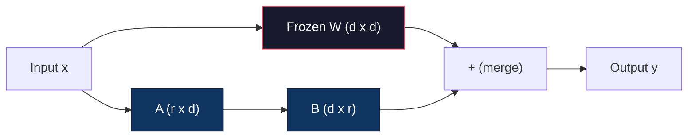
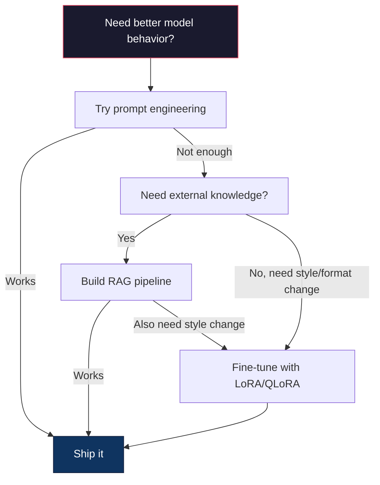

# 用 LoRA 與 QLoRA 微調

> 全參數微調一個 7B 模型需要 56GB 的 VRAM。你沒有，大多數公司也沒有。LoRA 讓你在 6GB 裡微調同一個模型，只訓練不到 1% 的參數。這不是妥協 —— 在多數任務上它的品質追平全參數微調。整個開源微調生態系就靠這一招在運轉。

**類型：** 實作
**程式語言：** Python
**先修單元：** 階段 10，第 06 課（指令調校 / SFT）
**時間：** 約 75 分鐘
**相關單元：** 階段 10 從零講 SFT/DPO 的訓練迴圈。這一課把它們接上 2026 年的 PEFT 工具鏈（PEFT、TRL、Unsloth、Axolotl、LLaMA-Factory）。

## 學習目標

- 把低秩適配矩陣（A 與 B）注入預訓練模型的注意力層，藉此實作 LoRA
- 計算 LoRA 相對於全參數微調省下的參數量：在 d_model 維度下，秩 r 訓練 2*r*d 個參數，而不是 d^2 個
- 用 QLoRA（4 位元量化的基座 + LoRA 適配器）微調模型，塞進消費級 GPU 的記憶體
- 把 LoRA 權重併回基座模型以便部署，並比較有無適配器時的推論速度

## 問題所在

你有一個基座模型：Llama 3 8B。你想讓它用你公司的語氣回覆客服工單。SFT 就是答案，但 SFT 有個成本問題。

全參數微調會更新模型裡每一個參數。Llama 3 8B 有 80 億個參數。在 fp16 下每個參數佔 2 位元組，光載入權重就是 16GB。訓練時你還需要梯度（16GB）、Adam 的優化器狀態（動量 + 變異數共 32GB），以及各層激活值。合計：單一個 8B 模型大約要 56GB 的 VRAM。

一張 A100 80GB 勉強塞得下。兩張 A100 在雲端供應商上一小時 $3-4。在 50,000 筆樣本上訓練 3 個 epoch 要 6-10 小時，也就是每次實驗 $30-40。跑 10 次實驗把超參數調對，你在部署任何東西之前就花掉 $400。

把這個規模拉到 Llama 3 70B，數字就荒謬了。光權重就 140GB，你需要一整個叢集，每次實驗 $100 以上。

還有一個更深的問題。全參數微調會改動模型裡每一個權重。如果你在客服資料上微調，可能會讓模型的通用能力退化。這叫災難性遺忘：模型在你的任務上變好，在其他所有事情上變差。

你需要一種方法：訓練更少的參數、用更少的記憶體，而且不會摧毀模型既有的知識。

## 核心概念

### LoRA：低秩適配

微軟的 Edward Hu 與同事在 2021 年 6 月發表了 LoRA。論文的洞見是：微調期間的權重更新具有低內在秩。你不需要更新一個 4096x4096 權重矩陣裡全部 1670 萬個參數，更新中有用的資訊用一個秩 16 或 32 的矩陣就能捕捉。

數學如下。一個標準線性層計算的是：

```
y = Wx
```

其中 W 是 d_out x d_in 矩陣。對一個 4096x4096 的注意力投影來說，那是 16,777,216 個參數。

LoRA 凍結 W，加上一個低秩分解：

```
y = Wx + BAx
```

其中 B 是 (d_out x r)，A 是 (r x d_in)。秩 r 遠小於 d —— 通常是 8、16 或 32。

在 4096x4096 的層上取 r=16：
- 原始參數：4096 x 4096 = 16,777,216
- LoRA 參數：(4096 x 16) + (16 x 4096) = 65,536 + 65,536 = 131,072
- 縮減比：131,072 / 16,777,216 = 0.78%

你訓練的是 0.78% 的參數，拿到的是 95-100% 的品質。



A 以隨機高斯分布初始化，B 初始化為零。這意味著 LoRA 的貢獻從零開始 —— 模型從它原本的行為起步，再逐步學到這個適配。

### 縮放係數：Alpha

LoRA 引入一個縮放係數 alpha，控制低秩更新對輸出的影響有多大：

```
y = Wx + (alpha / r) * BAx
```

當 alpha = r 時，縮放是 1 倍。當 alpha = 2r（常見預設）時，縮放是 2 倍。這個超參數獨立於基礎學習率，控制 LoRA 這條路徑的學習率。

實務建議：
- alpha = 2 * rank 是社群常見慣例（原論文多數實驗用的是 alpha = rank）
- alpha = rank 給出 1 倍縮放，保守但穩定
- alpha 越高，每一步的更新越大，可能加速收斂，也可能造成不穩定

### LoRA 該加在哪裡

transformer 裡有很多線性層，你不需要每一層都加 LoRA。原論文測過不同組合：

| 目標層 | 可訓練參數（7B） | 品質 |
|--------------|----------------------|---------|
| 只有 q_proj | 4.7M | 好 |
| q_proj + v_proj | 9.4M | 更好 |
| q_proj + k_proj + v_proj + o_proj | 18.9M | 注意力層裡最好 |
| 全部線性層（注意力 + MLP） | 37.7M | 邊際收益，參數翻倍 |

多數任務的甜蜜點：q_proj + v_proj。這瞄準的是自注意力裡的查詢與值投影，它們控制模型要注意什麼、以及抽出什麼資訊。加上 MLP 層對程式碼生成這類複雜任務有幫助，但在較簡單的任務上，參數翻倍換來的是報酬遞減。

### 秩的選擇

秩 r 控制適配的表達能力：

| 秩 | 可訓練參數（每層） | 最適合 |
|------|---------------------------|----------|
| 4 | 32,768 | 簡單分類、情感分析 |
| 8 | 65,536 | 單一領域問答、摘要 |
| 16 | 131,072 | 多領域任務、指令遵循 |
| 32 | 262,144 | 複雜推理、程式碼生成 |
| 64 | 524,288 | 多數任務上已報酬遞減 |
| 128 | 1,048,576 | 很少有正當理由 |

Hu et al. 證明 r=4 就已捕捉到簡單任務所需的大部分適配。r=8 和 r=16 是實務上最常見的選擇。超過 r=64 很少能改善品質，還開始失去 LoRA 的記憶體優勢。

### QLoRA：4 位元量化 + LoRA

華盛頓大學的 Tim Dettmers 與同事在 2023 年 5 月發表了 QLoRA。想法是：把凍結的基座模型量化到 4 位元精度，再在上面掛 fp16 的 LoRA 適配器。

這徹底改寫了記憶體的算式：

| 方法 | 權重記憶體（7B） | 訓練記憶體（7B） | 所需 GPU |
|--------|-------------------|---------------------|-------------|
| 全參數微調（fp16） | 14GB | 約 56GB | 1x A100 80GB |
| LoRA（fp16 基座） | 14GB | 約 18GB | 1x A100 40GB |
| QLoRA（4 位元基座） | 3.5GB | 約 6GB | 1x RTX 3090 24GB |

QLoRA 有三項技術貢獻：

**NF4（Normal Float 4-bit）**：一種專為神經網路權重設計的新資料型別。神經網路權重大致服從常態分布。NF4 把它的 16 個量化級距放在標準常態分布的分位點上。對常態分布的資料來說，這在資訊理論上是最佳的。它比均勻的 4 位元量化（INT4）或標準 Float4 損失更少資訊。

**雙重量化**：量化常數本身也佔記憶體。每 64 個權重一組需要一個 fp32 的縮放係數（4 位元組）。一個 7B 模型就多出 0.4GB。雙重量化把這些常數再量化成 fp8，把開銷降到 0.1GB。不多，但會累積。

**分頁優化器**：訓練期間，優化器狀態（Adam 的動量與變異數）在長序列上可能超出 GPU 記憶體。分頁優化器利用 NVIDIA 的統一記憶體，在 GPU 記憶體用盡時自動把優化器狀態換頁到 CPU RAM，需要時再換回來。這避免了 OOM 崩潰，代價是損失一些吞吐量。

### 品質的疑問

減少參數或量化基座會傷害品質嗎？多篇論文的結果：

| 方法 | MMLU（5-shot） | MT-Bench | HumanEval |
|--------|--------------|----------|-----------|
| 全參數微調（Llama 2 7B） | 48.3 | 6.72 | 14.6 |
| LoRA r=16 | 47.9 | 6.68 | 14.0 |
| QLoRA r=16（NF4） | 47.5 | 6.61 | 13.4 |
| QLoRA r=64（NF4） | 48.1 | 6.70 | 14.2 |

r=16 的 LoRA 在多數基準上與全參數微調的差距在 1% 以內。r=16 的 QLoRA 再多損失不到一個百分點。r=64 的 QLoRA 基本上追平全參數微調，卻少用 90% 的記憶體。

### 真實世界的成本

在 50,000 筆樣本上微調 Llama 3 8B（3 個 epoch）：

| 方法 | GPU | 時間 | 成本 |
|--------|-----|------|------|
| 全參數微調 | 2x A100 80GB | 8 小時 | 約 $32 |
| LoRA r=16 | 1x A100 40GB | 4 小時 | 約 $8 |
| QLoRA r=16 | 1x RTX 4090 24GB | 6 小時 | 約 $5 |
| QLoRA r=16（Unsloth） | 1x RTX 4090 24GB | 2.5 小時 | 約 $2 |
| QLoRA r=16 | 1x T4 16GB | 12 小時 | 約 $4 |

在單張消費級 GPU 上跑 QLoRA，成本比一份午餐還低。這就是為什麼開放權重微調社群在 2023 年爆炸性成長，也是為什麼下面每一個訓練框架在 2026 年都預設內建 QLoRA。

### 2026 年的 PEFT 技術棧

| 框架 | 它是什麼 | 什麼時候選它 |
|-----------|-----------|-----------|
| **Hugging Face PEFT** | LoRA/QLoRA/DoRA/IA3 的權威函式庫 | 你想要底層控制權，而訓練迴圈已經建在 `transformers.Trainer` 上 |
| **TRL** | HF 的「從回饋強化」訓練器（SFT、DPO、GRPO、PPO、ORPO） | 你在 SFT 之後需要 DPO/GRPO；它建在 PEFT 之上 |
| **Unsloth** | 用 Triton kernel 重寫的前向／反向傳遞 | 你想要 2-5 倍加速 + 一半 VRAM 且不損正確率；Llama/Mistral/Qwen 家族 |
| **Axolotl** | 包在 PEFT + TRL + DeepSpeed + Unsloth 外的 YAML 設定層 | 你想要可重現、可版控的訓練執行 |
| **LLaMA-Factory** | 包在 PEFT + TRL 外的 GUI/CLI/API | 你想要零程式碼微調；支援 100 多個模型家族 |
| **torchtune** | 原生 PyTorch 配方，不依賴 `transformers` | 你想要最少依賴，且組織本來就標準化在 PyTorch 上 |

拇指法則：研究用途或一次性實驗 → PEFT。可重複的生產管線 → Axolotl 並啟用 Unsloth kernel。用完就丟的原型 → LLaMA-Factory。

### 併回適配器

訓練完成後你手上有兩樣東西：凍結的基座模型，和一個小小的 LoRA 適配器（通常 10-100MB）。你可以：

1. **分開放**：載入基座模型，再把適配器掛上去。不同任務換不同適配器。這就是你怎麼從一個基座模型服務多個微調變體。

2. **永久併入**：計算 W' = W + (alpha/r) * BA，把結果存成一個新的完整模型。併入後的模型和原本一樣大，沒有推論開銷，也沒有適配器要管。

若要服務多種任務（客服適配器、程式碼適配器、翻譯適配器），就分開放。若要部署單一專門模型，就併入。

用來組合多個適配器的進階合併技術：

- **TIES-Merging**（Yadav et al. 2023）：先修掉小幅度的參數、解決正負號衝突，再合併。減少適配器之間的干擾。
- **DARE**（Yu et al. 2023）：合併前隨機丟掉部分適配器參數，再把其餘的重新縮放。在組合能力上效果出乎意料地好。
- **任務算術**：直接把適配器權重加起來或減掉。把一個「程式碼」適配器和一個「數學」適配器相加，往往能得到一個兩者都行的模型。

### 什麼時候「不要」微調

微調是第三選項，不是第一選項。

**第一：提示詞工程。** 寫一段更好的系統提示詞。加上少樣本範例。用思維鏈。這不花錢，幾分鐘就好。如果下提示詞能帶你走完 80% 的路，你大概不需要微調。

**第二：RAG。** 如果模型需要知道你特有的資料（文件、知識庫、產品目錄），檢索比把它烤進權重更便宜、也更好維護。見第 06 課。

**第三：微調。** 當你需要模型採用某種光靠下提示詞做不到的特定風格、格式或推理模式時用它。當你需要一致的結構化輸出時。當你需要把大模型蒸餾成小模型時。當延遲很重要、你付不起少樣本提示詞那些額外詞元時。



```figure
lora-params
```

## 實作

我們用純 PyTorch 從零實作 LoRA。不用函式庫，沒有魔法。你會做出 LoRA 層、把它注入模型、訓練它，再把權重併回去。

### 步驟 1：LoRA 層

```python
import torch
import torch.nn as nn
import math

class LoRALayer(nn.Module):
    def __init__(self, in_features, out_features, rank=8, alpha=16):
        super().__init__()
        self.rank = rank
        self.alpha = alpha
        self.scaling = alpha / rank

        self.A = nn.Parameter(torch.randn(in_features, rank) * (1 / math.sqrt(rank)))
        self.B = nn.Parameter(torch.zeros(rank, out_features))

    def forward(self, x):
        return (x @ self.A @ self.B) * self.scaling
```

A 以縮放後的隨機值初始化，B 初始化為零。乘積 BA 從零開始，所以模型一開始就是它原本的行為。

### 步驟 2：包上 LoRA 的線性層

```python
class LinearWithLoRA(nn.Module):
    def __init__(self, linear, rank=8, alpha=16):
        super().__init__()
        self.linear = linear
        self.lora = LoRALayer(
            linear.in_features, linear.out_features, rank, alpha
        )

        for param in self.linear.parameters():
            param.requires_grad = False

    def forward(self, x):
        return self.linear(x) + self.lora(x)
```

原本的線性層被凍結。只有 LoRA 參數（A 和 B）可訓練。

### 步驟 3：把 LoRA 注入模型

```python
def inject_lora(model, target_modules, rank=8, alpha=16):
    for param in model.parameters():
        param.requires_grad = False

    lora_layers = {}
    for name, module in model.named_modules():
        if isinstance(module, nn.Linear):
            if any(t in name for t in target_modules):
                parent_name = ".".join(name.split(".")[:-1])
                child_name = name.split(".")[-1]
                parent = dict(model.named_modules())[parent_name]
                lora_linear = LinearWithLoRA(module, rank, alpha)
                setattr(parent, child_name, lora_linear)
                lora_layers[name] = lora_linear
    return lora_layers
```

首先凍結模型裡每一個參數。然後走過模型樹，找出名稱符合目標的線性層，把它們換成包了 LoRA 的版本。LoRA 的 A 和 B 矩陣是整個模型裡唯一可訓練的參數。

### 步驟 4：計算參數量

```python
def count_parameters(model):
    total = sum(p.numel() for p in model.parameters())
    trainable = sum(p.numel() for p in model.parameters() if p.requires_grad)
    frozen = total - trainable
    return {
        "total": total,
        "trainable": trainable,
        "frozen": frozen,
        "trainable_pct": 100 * trainable / total if total > 0 else 0
    }
```

### 步驟 5：把權重併回去

```python
def merge_lora_weights(model):
    for name, module in model.named_modules():
        if isinstance(module, LinearWithLoRA):
            with torch.no_grad():
                merged = (
                    module.lora.A @ module.lora.B
                ) * module.lora.scaling
                module.linear.weight.data += merged.T
            parent_name = ".".join(name.split(".")[:-1])
            child_name = name.split(".")[-1]
            if parent_name:
                parent = dict(model.named_modules())[parent_name]
            else:
                parent = model
            setattr(parent, child_name, module.linear)
```

併入之後，LoRA 層就消失了。模型和原本一樣大，適配已經烤進權重裡。沒有推論開銷。

### 步驟 6：模擬 QLoRA 量化

```python
def quantize_to_nf4(tensor, block_size=64):
    blocks = tensor.reshape(-1, block_size)
    scales = blocks.abs().max(dim=1, keepdim=True).values / 7.0
    scales = torch.clamp(scales, min=1e-8)
    quantized = torch.round(blocks / scales).clamp(-8, 7).to(torch.int8)
    return quantized, scales

def dequantize_from_nf4(quantized, scales, original_shape):
    dequantized = quantized.float() * scales
    return dequantized.reshape(original_shape)
```

這用「把權重映射到每 64 個一組內的 16 個離散級距」來模擬 4 位元量化。生產級 QLoRA 用 bitsandbytes 函式庫在 GPU 上做真正的 NF4。

### 步驟 7：訓練迴圈

```python
def train_lora(model, data, epochs=5, lr=1e-3, batch_size=4):
    optimizer = torch.optim.AdamW(
        [p for p in model.parameters() if p.requires_grad], lr=lr
    )
    criterion = nn.MSELoss()

    losses = []
    for epoch in range(epochs):
        epoch_loss = 0.0
        n_batches = 0
        indices = torch.randperm(len(data["inputs"]))

        for i in range(0, len(indices), batch_size):
            batch_idx = indices[i:i + batch_size]
            x = data["inputs"][batch_idx]
            y = data["targets"][batch_idx]

            output = model(x)
            loss = criterion(output, y)

            optimizer.zero_grad()
            loss.backward()
            optimizer.step()

            epoch_loss += loss.item()
            n_batches += 1

        avg_loss = epoch_loss / n_batches
        losses.append(avg_loss)

    return losses
```

### 步驟 8：完整示範

```python
def demo():
    torch.manual_seed(42)
    d_model = 256
    n_classes = 10

    model = nn.Sequential(
        nn.Linear(d_model, 512),
        nn.ReLU(),
        nn.Linear(512, 512),
        nn.ReLU(),
        nn.Linear(512, n_classes),
    )

    n_samples = 500
    x = torch.randn(n_samples, d_model)
    y = torch.randint(0, n_classes, (n_samples,))
    y_onehot = torch.zeros(n_samples, n_classes).scatter_(1, y.unsqueeze(1), 1.0)

    data = {"inputs": x, "targets": y_onehot}

    params_before = count_parameters(model)

    lora_layers = inject_lora(
        model, target_modules=["0", "2"], rank=8, alpha=16
    )

    params_after = count_parameters(model)

    losses = train_lora(model, data, epochs=20, lr=1e-3)

    merge_lora_weights(model)
    params_merged = count_parameters(model)

    return {
        "params_before": params_before,
        "params_after": params_after,
        "params_merged": params_merged,
        "losses": losses,
    }
```

這個示範建了一個小模型、把 LoRA 注入兩層、訓練它，再把權重併回去。參數量在 LoRA 訓練期間從「全部可訓練」降到「約 1% 可訓練」，合併後又回到原本的架構。

## 實務應用

用 Hugging Face 生態系，在真實模型上跑 LoRA 大約 20 行：

```python
from transformers import AutoModelForCausalLM, AutoTokenizer
from peft import LoraConfig, get_peft_model, TaskType

model = AutoModelForCausalLM.from_pretrained("meta-llama/Llama-3.1-8B")
tokenizer = AutoTokenizer.from_pretrained("meta-llama/Llama-3.1-8B")

lora_config = LoraConfig(
    task_type=TaskType.CAUSAL_LM,
    r=16,
    lora_alpha=32,
    lora_dropout=0.05,
    target_modules=["q_proj", "v_proj"],
)

model = get_peft_model(model, lora_config)
model.print_trainable_parameters()
```

要跑 QLoRA，加上 bitsandbytes 量化：

```python
from transformers import BitsAndBytesConfig

bnb_config = BitsAndBytesConfig(
    load_in_4bit=True,
    bnb_4bit_quant_type="nf4",
    bnb_4bit_compute_dtype=torch.bfloat16,
    bnb_4bit_use_double_quant=True,
)

model = AutoModelForCausalLM.from_pretrained(
    "meta-llama/Llama-3.1-8B",
    quantization_config=bnb_config,
    device_map="auto",
)

model = get_peft_model(model, lora_config)
```

就這樣。訓練迴圈一樣，資料管線一樣。基座模型現在住在 4 位元裡，LoRA 適配器在 fp16 訓練，整套東西塞進 6GB。

用 Hugging Face Trainer 訓練：

```python
from transformers import TrainingArguments, Trainer
from datasets import load_dataset

dataset = load_dataset("tatsu-lab/alpaca", split="train[:5000]")

training_args = TrainingArguments(
    output_dir="./lora-llama",
    num_train_epochs=3,
    per_device_train_batch_size=4,
    gradient_accumulation_steps=4,
    learning_rate=2e-4,
    fp16=True,
    logging_steps=10,
    save_strategy="epoch",
    optim="paged_adamw_8bit",
)

trainer = Trainer(
    model=model,
    args=training_args,
    train_dataset=dataset,
)

trainer.train()

model.save_pretrained("./lora-adapter")
```

存下來的適配器是 10-100MB。基座模型完全沒被動過。你可以在 Hugging Face Hub 上分享適配器，而不必重新散布整個模型。

## 產出

這一課會產出：
- `outputs/prompt-lora-advisor.md` —— 一個提示詞，幫你為特定任務決定 LoRA 的秩、目標模組與超參數
- `outputs/skill-fine-tuning-guide.md` —— 一個技能，教代理「何時該微調、怎麼微調」的決策樹

## 練習

1. **秩的消融研究。** 用秩 2、4、8、16、32、64 各跑一次示範。畫出最終損失對秩的關係圖。找出報酬遞減的那一點 —— 秩加倍不再讓損失減半的地方。對 256 維特徵上的簡單分類任務，這應該在 r=8-16 附近。

2. **目標模組比較。** 修改 inject_lora，分別只針對層「0」、只針對層「2」、只針對層「4」，以及三層全上。每個變體訓練 20 個 epoch。比較收斂速度與最終損失。這對應到真實世界裡「該選 q_proj、v_proj 還是全部線性層」的決策。

3. **量化誤差分析。** 拿訓練好的模型權重矩陣，在 quantize_to_nf4 / dequantize_from_nf4 前後各取一份。計算均方誤差、最大絕對誤差，以及原始與重建權重之間的相關係數。試試 block_size 為 32、64、128、256。

4. **多適配器服務。** 在資料的不同子集上（偶數索引對奇數索引）訓練兩個 LoRA 適配器。把兩個都存下來。基座模型只載入一次，然後切換適配器，並驗證同樣的輸入會得到不同的輸出。這就是生產系統怎麼用一個基座服務多個微調模型。

5. **併入對未併入的推論。** 對同樣 100 筆輸入，比較 merge_lora_weights 前後 LoRA 模型的輸出。驗證輸出一致（在 1e-5 的浮點容差內）。然後為兩者做推論速度基準測試 —— 併入後應該稍快一些，因為它是一次矩陣乘法而不是兩次。

## 關鍵術語

| 術語 | 大家怎麼說 | 它實際上是什麼 |
|------|----------------|----------------------|
| LoRA | 「高效微調」 | 低秩適配：凍結基座權重，訓練兩個小矩陣 A 與 B，讓它們的乘積近似完整的權重更新 |
| QLoRA | 「在筆電上微調」 | 量化版 LoRA：基座模型以 4 位元 NF4 載入，上面用 fp16 訓練 LoRA 適配器，讓 7B 微調能在 6GB VRAM 內完成 |
| 秩（r） | 「模型能學多少」 | A 與 B 矩陣的內部維度；在表達能力與參數量之間做權衡 |
| Alpha | 「LoRA 的學習率」 | 套在 LoRA 輸出上的縮放係數；alpha/r 決定這個適配對最終輸出的貢獻幅度 |
| NF4 | 「4 位元量化」 | Normal Float 4：量化級距落在常態分布分位點上的 4 位元資料型別，對神經網路權重是最佳選擇 |
| 適配器（Adapter） | 「訓練出來的那一小塊」 | 存成獨立檔案（10-100MB）的 LoRA A 與 B 矩陣，可掛到基座模型的任何副本上 |
| 目標模組（Target modules） | 「要在哪些層加 LoRA」 | 注入 LoRA 適配器的那些特定線性層（q_proj、v_proj 等） |
| 併入（Merging） | 「烤進去」 | 計算 W + (alpha/r) * BA 並取代原本的權重，消掉推論時的適配器開銷 |
| 分頁優化器（Paged optimizers） | 「訓練時不要 OOM」 | GPU 記憶體用盡時，把優化器狀態（Adam 動量、變異數）卸載到 CPU |
| 災難性遺忘（Catastrophic forgetting） | 「微調把其他東西都弄壞了」 | 更新所有權重導致模型失去先前學到的能力 |

## 延伸閱讀

- Hu et al., "LoRA: Low-Rank Adaptation of Large Language Models" (2021) —— 提出低秩分解方法的原始論文，在 GPT-3 175B 上以低至 4 的秩做過測試
- Dettmers et al., "QLoRA: Efficient Finetuning of Quantized Language Models" (2023) —— 提出 NF4、雙重量化與分頁優化器，讓 65B 微調能在單張 48GB GPU 上完成
- PEFT library documentation (huggingface.co/docs/peft) —— Hugging Face 生態系中 LoRA、QLoRA 及其他參數高效方法的標準函式庫
- Yadav et al., "TIES-Merging: Resolving Interference When Merging Models" (2023) —— 在不損失品質的前提下組合多個 LoRA 適配器的技術
- [Rafailov et al., "Direct Preference Optimization: Your Language Model is Secretly a Reward Model" (NeurIPS 2023)](https://arxiv.org/abs/2305.18290) —— DPO 的推導；接在 SFT 之後的偏好調校階段，不需要獎勵模型。
- [TRL documentation](https://huggingface.co/docs/trl/) —— `SFTTrainer`、`DPOTrainer`、`KTOTrainer` 的官方參考，以及與 PEFT/bitsandbytes/Unsloth 的整合面。
- [Unsloth documentation](https://docs.unsloth.ai/) —— 融合 kernel，讓微調吞吐量翻倍、記憶體減半；TRL 底下的效能層。
- [Axolotl documentation](https://axolotl-ai-cloud.github.io/axolotl/) —— 以 YAML 設定的多 GPU SFT/DPO/QLoRA 訓練器；手寫腳本的「設定即程式碼」替代方案。
