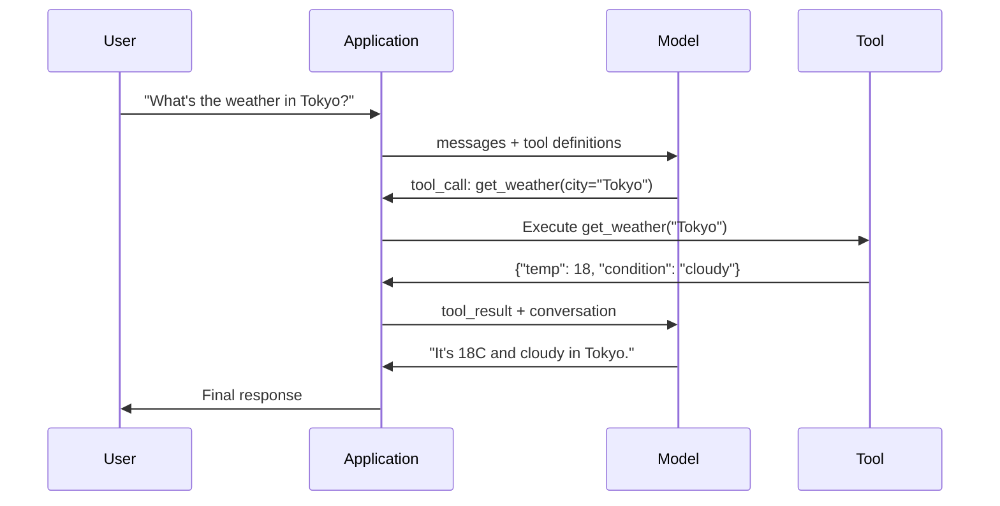

# 函數呼叫與工具使用

> LLM 什麼事都做不了。它們生成文字，這就是全部的能力。它們查不了天氣、查不了資料庫、寄不了信、跑不了程式、也讀不了檔案。你見過的每一個「AI 代理」，都是一個 LLM 生成一段 JSON 說明要呼叫哪個函數 —— 然後由你的程式碼真正去呼叫它。模型是大腦，工具是雙手，函數呼叫是連接兩者的神經系統。

**類型：** 實作
**程式語言：** Python
**先修單元：** 階段 11 第 03 課（結構化輸出）
**時間：** 約 75 分鐘
**相關單元：** 階段 11 · 14（Model Context Protocol）—— 當一個工具要跨多個宿主共用時，就從行內函數呼叫升級成 MCP 伺服器。這一課講行內的情況，MCP 講協定的情況。

## 學習目標

- 實作一個函數呼叫迴圈：定義工具 schema、解析模型的工具呼叫 JSON、執行函數、把結果回傳
- 設計帶清楚描述與型別化參數的工具 schema，讓模型能可靠地呼叫
- 建一個多輪代理迴圈，串接多次函數呼叫來回答複雜查詢
- 處理函數呼叫的邊界情況：並行工具呼叫、錯誤傳遞，以及防止無窮工具迴圈

## 問題所在

你做了一個聊天機器人。使用者問：「What's the weather in Tokyo right now?」

模型回答：「I don't have access to real-time weather data, but based on the season, Tokyo is likely around 15 degrees Celsius...」

那是一段包著免責聲明的幻覺。模型不知道天氣，也永遠不會知道。天氣每小時都在變，而模型的訓練資料是好幾個月前的。

正確的答案需要呼叫 OpenWeatherMap API、取得當前溫度、回傳真實數字。模型不能呼叫 API，但你的程式碼可以。缺的那一塊是：一套結構化的協定，讓模型能說「我需要用這些引數呼叫天氣 API」，並讓你的程式碼執行它、再把結果餵回去。

這就是函數呼叫。模型輸出結構化 JSON，描述要呼叫哪個函數、帶什麼引數。你的應用執行那個函數。結果回到對話裡。模型用那個結果產出最終答案。

沒有函數呼叫，LLM 是百科全書。有了它，它們才成為代理。

## 核心概念

### 函數呼叫迴圈

每一次工具使用的互動都遵循同樣的 5 步迴圈。



第 1 步：使用者送出訊息。第 2 步：模型收到訊息，連同工具定義（描述可用函數的 JSON Schema）。第 3 步：模型不是回覆文字，而是輸出一個工具呼叫 —— 一個帶函數名稱與引數的結構化 JSON 物件。第 4 步：你的程式碼執行那個函數並取得結果。第 5 步：結果回到模型手上，它現在有了真實資料，可以產出最終答案。

模型從不執行任何東西。它只決定要呼叫什麼、帶什麼引數。執行者是你的程式碼。

### 工具定義：JSON Schema 合約

每個工具由一份 JSON Schema 定義，告訴模型這個函數做什麼、吃哪些引數、那些引數必須是什麼型別。

```json
{
  "type": "function",
  "function": {
    "name": "get_weather",
    "description": "Get current weather for a city. Returns temperature in Celsius and conditions.",
    "parameters": {
      "type": "object",
      "properties": {
        "city": {
          "type": "string",
          "description": "City name, e.g. 'Tokyo' or 'San Francisco'"
        },
        "units": {
          "type": "string",
          "enum": ["celsius", "fahrenheit"],
          "description": "Temperature units"
        }
      },
      "required": ["city"]
    }
  }
}
```

`description` 欄位至關重要。模型靠讀它們來決定何時、如何使用這個工具。像「gets weather」這種含糊描述，工具挑選的效果會比「Get current weather for a city. Returns temperature in Celsius and conditions.」差。描述本身就是工具挑選的提示詞。

### 供應商比較

每一家主要供應商都支援函數呼叫，但 API 介面各有不同。

| 供應商 | API 參數 | 工具呼叫格式 | 並行呼叫 | 強制呼叫 |
|----------|--------------|-----------------|---------------|----------------|
| OpenAI（GPT-5、o4） | `tools` | `tool_calls[].function` | 有（每輪可多次） | `tool_choice="required"` |
| Anthropic（Claude 4.6/4.7） | `tools` | `content[].type="tool_use"` | 有（多個區塊） | `tool_choice={"type":"any"}` |
| Google（Gemini 3） | `function_declarations` | `functionCall` | 有 | `function_calling_config` |
| 開放權重（Llama 4、Qwen3、DeepSeek-V3） | Llama 4 有原生 `tools`；其他用 Hermes 或 ChatML | 混雜 | 視模型而定 | 靠提示詞，或在支援時用 `tool_choice` |

到 2026 年，三家封閉供應商已收斂到幾乎一致的、基於 JSON Schema 的格式。Llama 4 內建一個與 OpenAI 形狀相同的原生 `tools` 欄位。開放權重的微調版本仍有差異 —— Hermes 格式（NousResearch）在第三方微調中最常見。要跨宿主共用工具時，優先選 MCP（階段 11 · 14）而不是行內函數呼叫 —— 對所有宿主來說伺服器都是同一個。

### 工具選擇：自動、必要、指定

你可以控制模型何時使用工具。

**自動**（預設）：模型自己決定要呼叫工具還是直接回答。「What's 2+2?」—— 直接回答。「What's the weather?」—— 呼叫工具。

**必要**：模型必須至少呼叫一個工具。當你確定使用者意圖需要工具時用這個，可避免模型靠猜而不去查真實資料。

**指定函數**：強迫模型呼叫某個特定函數。`tool_choice={"type":"function", "function": {"name": "get_weather"}}` 保證天氣工具會被呼叫，不管查詢是什麼。用在路由上 —— 當上游邏輯已經判定該用哪個工具時。

### 並行函數呼叫

GPT-4o 和 Claude 能在一輪裡呼叫多個函數。使用者問：「What's the weather in Tokyo and New York?」模型同時輸出兩個工具呼叫：

```json
[
  {"name": "get_weather", "arguments": {"city": "Tokyo"}},
  {"name": "get_weather", "arguments": {"city": "New York"}}
]
```

你的程式碼把兩個都執行（最好是並行），回傳兩份結果，模型再合成單一回應。這把往返次數從 2 次降到 1 次。對每次查詢要呼叫 5-10 次工具的代理來說，並行呼叫能把延遲降低 60-80%。

### 結構化輸出對函數呼叫

第 03 課講過結構化輸出。函數呼叫用的是同一套 JSON Schema 機制，但目的不同。

**結構化輸出**：強迫模型產出特定形狀的資料。輸出就是最終產品。例如：把文字裡的商品資訊抽成 `{name, price, in_stock}`。

**函數呼叫**：模型宣告一個執行動作的意圖。輸出是中間步驟。例如：`get_weather(city="Tokyo")` —— 模型在請求一個動作，不是在產出最終答案。

要做資料抽取就用結構化輸出。要讓模型與外部系統互動就用函數呼叫。

### 安全：不可妥協的規則

函數呼叫是你能給 LLM 的最危險能力。模型選擇要執行什麼。如果你的工具集含有資料庫查詢，查詢就是模型組出來的；如果含有 shell 指令，指令就是模型寫的。

**規則 1：永遠不要把模型生成的 SQL 直接丟給資料庫。** 模型有能力、也真的會生出 DROP TABLE、UNION 注入，或回傳全表的查詢。永遠參數化。永遠驗證。永遠用一份操作白名單。

**規則 2：函數用白名單。** 模型只能呼叫你明確定義的函數。永遠不要做一個「用名稱執行任意函數」的通用工具。如果你有 50 個內部函數，只暴露使用者需要的那 5 個。

**規則 3：驗證引數。** 模型可能傳來一個城市名叫 `"; DROP TABLE users; --"`。執行之前，把每一個引數對照預期的型別、範圍與格式驗證一遍。

**規則 4：清洗工具結果。** 如果某個工具回傳敏感資料（API 金鑰、個資、內部錯誤），在送回模型之前先過濾掉。模型會把工具結果原封不動放進它的回應裡。

**規則 5：對工具呼叫做速率限制。** 陷入迴圈的模型可以呼叫工具好幾百次。設一個上限（每段對話 10-20 次是合理的）。要能打斷無窮迴圈。

### 錯誤處理

工具會失敗。API 會逾時。資料庫會倒。檔案會不存在。模型需要知道工具何時失敗、以及為什麼。

把錯誤當成結構化的工具結果回傳，不要用例外：

```json
{
  "error": true,
  "message": "City 'Toky' not found. Did you mean 'Tokyo'?",
  "code": "CITY_NOT_FOUND"
}
```

模型讀到這個，調整引數，然後重試。模型很擅長從結構化錯誤訊息中自我修正，卻很不擅長從空回應或籠統的「出了點問題」中復原。

### MCP：Model Context Protocol

MCP 是 Anthropic 為工具互通性推出的開放標準。與其讓每個應用各自定義工具，MCP 提供一套通用協定：工具由 MCP 伺服器提供，由 MCP 客戶端（例如 Claude Code、Cursor 或你的應用）消費。

一台 MCP 伺服器可以把工具暴露給任何相容的客戶端。一台 Postgres MCP 伺服器讓任何 MCP 相容的代理都能存取資料庫。一台 GitHub MCP 伺服器讓任何代理都能存取版本庫。工具定義一次，到處使用。

MCP 對函數呼叫的意義，就像 HTTP 對網路的意義。它把傳輸層標準化，讓工具變得可攜。

```figure
mx-tool-call-loop
```

## 實作

### 步驟 1：定義工具註冊表

建一個註冊表，存放工具定義與它們的實作。每個工具都有一份 JSON Schema 定義（模型看到的）和一個 Python 函數（你的程式碼執行的）。

```python
import json
import math
import time
import hashlib


TOOL_REGISTRY = {}


def register_tool(name, description, parameters, function):
    TOOL_REGISTRY[name] = {
        "definition": {
            "type": "function",
            "function": {
                "name": name,
                "description": description,
                "parameters": parameters,
            },
        },
        "function": function,
    }
```

### 步驟 2：實作 5 個工具

做一個計算器、天氣查詢、網頁搜尋模擬器、檔案讀取器，以及程式碼執行器。

```python
def calculator(expression, precision=2):
    allowed = set("0123456789+-*/.() ")
    if not all(c in allowed for c in expression):
        return {"error": True, "message": f"Invalid characters in expression: {expression}"}
    try:
        result = eval(expression, {"__builtins__": {}}, {"math": math})
        return {"result": round(float(result), precision), "expression": expression}
    except Exception as e:
        return {"error": True, "message": str(e)}


WEATHER_DB = {
    "tokyo": {"temp_c": 18, "condition": "cloudy", "humidity": 72, "wind_kph": 14},
    "new york": {"temp_c": 22, "condition": "sunny", "humidity": 45, "wind_kph": 8},
    "london": {"temp_c": 12, "condition": "rainy", "humidity": 88, "wind_kph": 22},
    "san francisco": {"temp_c": 16, "condition": "foggy", "humidity": 80, "wind_kph": 18},
    "sydney": {"temp_c": 25, "condition": "sunny", "humidity": 55, "wind_kph": 10},
}


def get_weather(city, units="celsius"):
    key = city.lower().strip()
    if key not in WEATHER_DB:
        suggestions = [c for c in WEATHER_DB if c.startswith(key[:3])]
        return {
            "error": True,
            "message": f"City '{city}' not found.",
            "suggestions": suggestions,
            "code": "CITY_NOT_FOUND",
        }
    data = WEATHER_DB[key].copy()
    if units == "fahrenheit":
        data["temp_f"] = round(data["temp_c"] * 9 / 5 + 32, 1)
        del data["temp_c"]
    data["city"] = city
    return data


SEARCH_DB = {
    "python function calling": [
        {"title": "OpenAI Function Calling Guide", "url": "https://platform.openai.com/docs/guides/function-calling", "snippet": "Learn how to connect LLMs to external tools."},
        {"title": "Anthropic Tool Use", "url": "https://docs.anthropic.com/en/docs/tool-use", "snippet": "Claude can interact with external tools and APIs."},
    ],
    "MCP protocol": [
        {"title": "Model Context Protocol", "url": "https://modelcontextprotocol.io", "snippet": "An open standard for connecting AI models to data sources."},
    ],
    "weather API": [
        {"title": "OpenWeatherMap API", "url": "https://openweathermap.org/api", "snippet": "Free weather API with current, forecast, and historical data."},
    ],
}


def web_search(query, max_results=3):
    key = query.lower().strip()
    for db_key, results in SEARCH_DB.items():
        if db_key in key or key in db_key:
            return {"query": query, "results": results[:max_results], "total": len(results)}
    return {"query": query, "results": [], "total": 0}


FILE_SYSTEM = {
    "data/config.json": '{"model": "gpt-4o", "temperature": 0.7, "max_tokens": 4096}',
    "data/users.csv": "name,email,role\nAlice,alice@example.com,admin\nBob,bob@example.com,user",
    "README.md": "# My Project\nA tool-use agent built from scratch.",
}


def read_file(path):
    if ".." in path or path.startswith("/"):
        return {"error": True, "message": "Path traversal not allowed.", "code": "FORBIDDEN"}
    if path not in FILE_SYSTEM:
        available = list(FILE_SYSTEM.keys())
        return {"error": True, "message": f"File '{path}' not found.", "available_files": available, "code": "NOT_FOUND"}
    content = FILE_SYSTEM[path]
    return {"path": path, "content": content, "size_bytes": len(content), "lines": content.count("\n") + 1}


def run_code(code, language="python"):
    if language != "python":
        return {"error": True, "message": f"Language '{language}' not supported. Only 'python' is available."}
    forbidden = ["import os", "import sys", "import subprocess", "exec(", "eval(", "__import__", "open("]
    for pattern in forbidden:
        if pattern in code:
            return {"error": True, "message": f"Forbidden operation: {pattern}", "code": "SECURITY_VIOLATION"}
    try:
        local_vars = {}
        exec(code, {"__builtins__": {"print": print, "range": range, "len": len, "str": str, "int": int, "float": float, "list": list, "dict": dict, "sum": sum, "min": min, "max": max, "abs": abs, "round": round, "sorted": sorted, "enumerate": enumerate, "zip": zip, "map": map, "filter": filter, "math": math}}, local_vars)
        result = local_vars.get("result", None)
        return {"success": True, "result": result, "variables": {k: str(v) for k, v in local_vars.items() if not k.startswith("_")}}
    except Exception as e:
        return {"error": True, "message": f"{type(e).__name__}: {e}"}
```

### 步驟 3：註冊所有工具

```python
def register_all_tools():
    register_tool(
        "calculator", "Evaluate a mathematical expression. Supports +, -, *, /, parentheses, and decimals. Returns the numeric result.",
        {"type": "object", "properties": {"expression": {"type": "string", "description": "Math expression, e.g. '(10 + 5) * 3'"}, "precision": {"type": "integer", "description": "Decimal places in result", "default": 2}}, "required": ["expression"]},
        calculator,
    )
    register_tool(
        "get_weather", "Get current weather for a city. Returns temperature, condition, humidity, and wind speed.",
        {"type": "object", "properties": {"city": {"type": "string", "description": "City name, e.g. 'Tokyo' or 'San Francisco'"}, "units": {"type": "string", "enum": ["celsius", "fahrenheit"], "description": "Temperature units, defaults to celsius"}}, "required": ["city"]},
        get_weather,
    )
    register_tool(
        "web_search", "Search the web for information. Returns a list of results with title, URL, and snippet.",
        {"type": "object", "properties": {"query": {"type": "string", "description": "Search query"}, "max_results": {"type": "integer", "description": "Maximum results to return", "default": 3}}, "required": ["query"]},
        web_search,
    )
    register_tool(
        "read_file", "Read the contents of a file. Returns the file content, size, and line count.",
        {"type": "object", "properties": {"path": {"type": "string", "description": "Relative file path, e.g. 'data/config.json'"}}, "required": ["path"]},
        read_file,
    )
    register_tool(
        "run_code", "Execute Python code in a sandboxed environment. Set a 'result' variable to return output.",
        {"type": "object", "properties": {"code": {"type": "string", "description": "Python code to execute"}, "language": {"type": "string", "enum": ["python"], "description": "Programming language"}}, "required": ["code"]},
        run_code,
    )
```

### 步驟 4：打造函數呼叫迴圈

這是核心引擎。它模擬模型決定要呼叫哪個工具、執行工具，並把結果餵回去。

```python
def simulate_model_decision(user_message, tools, conversation_history):
    msg = user_message.lower()

    if any(word in msg for word in ["weather", "temperature", "forecast"]):
        cities = []
        for city in WEATHER_DB:
            if city in msg:
                cities.append(city)
        if not cities:
            for word in msg.split():
                if word.capitalize() in [c.title() for c in WEATHER_DB]:
                    cities.append(word)
        if not cities:
            cities = ["tokyo"]
        calls = []
        for city in cities:
            calls.append({"name": "get_weather", "arguments": {"city": city.title()}})
        return calls

    if any(word in msg for word in ["calculate", "compute", "math", "what is", "how much"]):
        for token in msg.split():
            if any(c in token for c in "+-*/"):
                return [{"name": "calculator", "arguments": {"expression": token}}]
        if "+" in msg or "-" in msg or "*" in msg or "/" in msg:
            expr = "".join(c for c in msg if c in "0123456789+-*/.() ")
            if expr.strip():
                return [{"name": "calculator", "arguments": {"expression": expr.strip()}}]
        return [{"name": "calculator", "arguments": {"expression": "0"}}]

    if any(word in msg for word in ["search", "find", "look up", "google"]):
        query = msg.replace("search for", "").replace("look up", "").replace("find", "").strip()
        return [{"name": "web_search", "arguments": {"query": query}}]

    if any(word in msg for word in ["read", "file", "open", "cat", "show"]):
        for path in FILE_SYSTEM:
            if path.split("/")[-1].split(".")[0] in msg:
                return [{"name": "read_file", "arguments": {"path": path}}]
        return [{"name": "read_file", "arguments": {"path": "README.md"}}]

    if any(word in msg for word in ["run", "execute", "code", "python"]):
        return [{"name": "run_code", "arguments": {"code": "result = 'Hello from the sandbox!'", "language": "python"}}]

    return []


def execute_tool_call(tool_call):
    name = tool_call["name"]
    args = tool_call["arguments"]

    if name not in TOOL_REGISTRY:
        return {"error": True, "message": f"Unknown tool: {name}", "code": "UNKNOWN_TOOL"}

    tool = TOOL_REGISTRY[name]
    func = tool["function"]
    start = time.time()

    try:
        result = func(**args)
    except TypeError as e:
        result = {"error": True, "message": f"Invalid arguments: {e}"}

    elapsed_ms = round((time.time() - start) * 1000, 2)
    return {"tool": name, "result": result, "execution_time_ms": elapsed_ms}


def run_function_calling_loop(user_message, max_iterations=5):
    conversation = [{"role": "user", "content": user_message}]
    tool_definitions = [t["definition"] for t in TOOL_REGISTRY.values()]
    all_tool_results = []

    for iteration in range(max_iterations):
        tool_calls = simulate_model_decision(user_message, tool_definitions, conversation)

        if not tool_calls:
            break

        results = []
        for call in tool_calls:
            result = execute_tool_call(call)
            results.append(result)

        conversation.append({"role": "assistant", "content": None, "tool_calls": tool_calls})

        for result in results:
            conversation.append({"role": "tool", "content": json.dumps(result["result"]), "tool_name": result["tool"]})

        all_tool_results.extend(results)
        break

    return {"conversation": conversation, "tool_results": all_tool_results, "iterations": iteration + 1 if tool_calls else 0}
```

### 步驟 5：引數驗證

做一個驗證器，在執行之前把工具呼叫的引數對照 JSON Schema 檢查一遍。

```python
def validate_tool_arguments(tool_name, arguments):
    if tool_name not in TOOL_REGISTRY:
        return [f"Unknown tool: {tool_name}"]

    schema = TOOL_REGISTRY[tool_name]["definition"]["function"]["parameters"]
    errors = []

    if not isinstance(arguments, dict):
        return [f"Arguments must be an object, got {type(arguments).__name__}"]

    for required_field in schema.get("required", []):
        if required_field not in arguments:
            errors.append(f"Missing required argument: {required_field}")

    properties = schema.get("properties", {})
    for arg_name, arg_value in arguments.items():
        if arg_name not in properties:
            errors.append(f"Unknown argument: {arg_name}")
            continue

        prop_schema = properties[arg_name]
        expected_type = prop_schema.get("type")

        type_checks = {"string": str, "integer": int, "number": (int, float), "boolean": bool, "array": list, "object": dict}
        if expected_type in type_checks:
            if not isinstance(arg_value, type_checks[expected_type]):
                errors.append(f"Argument '{arg_name}': expected {expected_type}, got {type(arg_value).__name__}")

        if "enum" in prop_schema and arg_value not in prop_schema["enum"]:
            errors.append(f"Argument '{arg_name}': '{arg_value}' not in {prop_schema['enum']}")

    return errors
```

### 步驟 6：跑示範

```python
def run_demo():
    register_all_tools()

    print("=" * 60)
    print("  Function Calling & Tool Use Demo")
    print("=" * 60)

    print("\n--- Registered Tools ---")
    for name, tool in TOOL_REGISTRY.items():
        desc = tool["definition"]["function"]["description"][:60]
        params = list(tool["definition"]["function"]["parameters"].get("properties", {}).keys())
        print(f"  {name}: {desc}...")
        print(f"    params: {params}")

    print(f"\n--- Argument Validation ---")
    validation_tests = [
        ("get_weather", {"city": "Tokyo"}, "Valid call"),
        ("get_weather", {}, "Missing required arg"),
        ("get_weather", {"city": "Tokyo", "units": "kelvin"}, "Invalid enum value"),
        ("calculator", {"expression": 123}, "Wrong type (int for string)"),
        ("unknown_tool", {"x": 1}, "Unknown tool"),
    ]
    for tool_name, args, label in validation_tests:
        errors = validate_tool_arguments(tool_name, args)
        status = "VALID" if not errors else f"ERRORS: {errors}"
        print(f"  {label}: {status}")

    print(f"\n--- Tool Execution ---")
    direct_tests = [
        {"name": "calculator", "arguments": {"expression": "(10 + 5) * 3 / 2"}},
        {"name": "get_weather", "arguments": {"city": "Tokyo"}},
        {"name": "get_weather", "arguments": {"city": "Mars"}},
        {"name": "web_search", "arguments": {"query": "python function calling"}},
        {"name": "read_file", "arguments": {"path": "data/config.json"}},
        {"name": "read_file", "arguments": {"path": "../etc/passwd"}},
        {"name": "run_code", "arguments": {"code": "result = sum(range(1, 101))"}},
        {"name": "run_code", "arguments": {"code": "import os; os.system('rm -rf /')"}},
    ]
    for call in direct_tests:
        result = execute_tool_call(call)
        print(f"\n  {call['name']}({json.dumps(call['arguments'])})")
        print(f"    -> {json.dumps(result['result'], indent=None)[:100]}")
        print(f"    time: {result['execution_time_ms']}ms")

    print(f"\n--- Full Function Calling Loop ---")
    test_queries = [
        "What's the weather in Tokyo?",
        "Calculate (100 + 250) * 0.15",
        "Search for MCP protocol",
        "Read the config file",
        "Run some Python code",
        "Tell me a joke",
    ]
    for query in test_queries:
        print(f"\n  User: {query}")
        result = run_function_calling_loop(query)
        if result["tool_results"]:
            for tr in result["tool_results"]:
                print(f"    Tool: {tr['tool']} ({tr['execution_time_ms']}ms)")
                print(f"    Result: {json.dumps(tr['result'], indent=None)[:90]}")
        else:
            print(f"    [No tool called -- direct response]")
        print(f"    Iterations: {result['iterations']}")

    print(f"\n--- Parallel Tool Calls ---")
    multi_city_query = "What's the weather in tokyo and london?"
    print(f"  User: {multi_city_query}")
    result = run_function_calling_loop(multi_city_query)
    print(f"  Tool calls made: {len(result['tool_results'])}")
    for tr in result["tool_results"]:
        city = tr["result"].get("city", "unknown")
        temp = tr["result"].get("temp_c", "N/A")
        print(f"    {city}: {temp}C, {tr['result'].get('condition', 'N/A')}")

    print(f"\n--- Security Checks ---")
    security_tests = [
        ("read_file", {"path": "../../etc/passwd"}),
        ("run_code", {"code": "import subprocess; subprocess.run(['ls'])"}),
        ("calculator", {"expression": "__import__('os').system('ls')"}),
    ]
    for tool_name, args in security_tests:
        result = execute_tool_call({"name": tool_name, "arguments": args})
        blocked = result["result"].get("error", False)
        print(f"  {tool_name}({list(args.values())[0][:40]}): {'BLOCKED' if blocked else 'ALLOWED'}")
```

## 實務應用

### OpenAI 函數呼叫

```python
# from openai import OpenAI
#
# client = OpenAI()
#
# tools = [{
#     "type": "function",
#     "function": {
#         "name": "get_weather",
#         "description": "Get current weather for a city",
#         "parameters": {
#             "type": "object",
#             "properties": {
#                 "city": {"type": "string"},
#                 "units": {"type": "string", "enum": ["celsius", "fahrenheit"]}
#             },
#             "required": ["city"]
#         }
#     }
# }]
#
# response = client.chat.completions.create(
#     model="gpt-4o",
#     messages=[{"role": "user", "content": "Weather in Tokyo?"}],
#     tools=tools,
#     tool_choice="auto",
# )
#
# tool_call = response.choices[0].message.tool_calls[0]
# args = json.loads(tool_call.function.arguments)
# result = get_weather(**args)
#
# final = client.chat.completions.create(
#     model="gpt-4o",
#     messages=[
#         {"role": "user", "content": "Weather in Tokyo?"},
#         response.choices[0].message,
#         {"role": "tool", "tool_call_id": tool_call.id, "content": json.dumps(result)},
#     ],
# )
# print(final.choices[0].message.content)
```

OpenAI 把工具呼叫放在 `response.choices[0].message.tool_calls` 裡。每個呼叫都有一個 `id`，你回傳結果時必須帶上。模型靠這個 ID 把結果對應到呼叫。GPT-4o 可以在單一回應裡回傳多個工具呼叫 —— 逐一走過並全部執行。

### Anthropic 工具使用

```python
# import anthropic
#
# client = anthropic.Anthropic()
#
# response = client.messages.create(
#     model="claude-sonnet-5",
#     max_tokens=1024,
#     tools=[{
#         "name": "get_weather",
#         "description": "Get current weather for a city",
#         "input_schema": {
#             "type": "object",
#             "properties": {
#                 "city": {"type": "string"},
#                 "units": {"type": "string", "enum": ["celsius", "fahrenheit"]}
#             },
#             "required": ["city"]
#         }
#     }],
#     messages=[{"role": "user", "content": "Weather in Tokyo?"}],
# )
#
# tool_block = next(b for b in response.content if b.type == "tool_use")
# result = get_weather(**tool_block.input)
#
# final = client.messages.create(
#     model="claude-sonnet-5",
#     max_tokens=1024,
#     tools=[...],
#     messages=[
#         {"role": "user", "content": "Weather in Tokyo?"},
#         {"role": "assistant", "content": response.content},
#         {"role": "user", "content": [{"type": "tool_result", "tool_use_id": tool_block.id, "content": json.dumps(result)}]},
#     ],
# )
```

Anthropic 把工具呼叫當成 `type: "tool_use"` 的內容區塊回傳。工具結果則放在一則帶 `type: "tool_result"` 的使用者訊息裡。注意關鍵差異：Anthropic 用 `input_schema` 定義工具參數，OpenAI 用的是 `parameters`。

### MCP 整合

```python
# MCP servers expose tools over a standardized protocol.
# Any MCP-compatible client can discover and call these tools.
#
# Example: connecting to a Postgres MCP server
#
# from mcp import ClientSession, StdioServerParameters
# from mcp.client.stdio import stdio_client
#
# server_params = StdioServerParameters(
#     command="npx",
#     args=["-y", "@modelcontextprotocol/server-postgres", "postgresql://localhost/mydb"],
# )
#
# async with stdio_client(server_params) as (read, write):
#     async with ClientSession(read, write) as session:
#         await session.initialize()
#         tools = await session.list_tools()
#         result = await session.call_tool("query", {"sql": "SELECT count(*) FROM users"})
```

MCP 把工具的實作和工具的消費解耦。Postgres 伺服器懂 SQL，GitHub 伺服器懂那套 API。你的代理只要去發現並呼叫工具 —— 不需要為每一種整合寫供應商專屬的程式碼。

## 產出

這一課會產出 `outputs/prompt-tool-designer.md` —— 一份可重用的提示詞模板，用來設計工具定義。給它一段「我想讓這個工具做什麼」的描述，它就產出完整的 JSON Schema 定義，含描述、型別與約束。

另外也會產出 `outputs/skill-function-calling-patterns.md` —— 一套在生產環境實作函數呼叫的決策框架，涵蓋工具設計、錯誤處理、安全與各供應商專屬模式。

## 練習

1. **加上第 6 個工具：資料庫查詢。** 用一張記憶體內的表實作一個模擬 SQL 工具。這個工具接受資料表名稱與過濾條件（而不是原始 SQL）。驗證表名在白名單裡，且過濾運算子限定為 `=`、`>`、`<`、`>=`、`<=`。把符合的列以 JSON 回傳。

2. **實作帶錯誤回饋的重試。** 當工具呼叫失敗時（例如找不到城市），把錯誤訊息餵回模型決策函數，讓它修正引數。追蹤每次呼叫花了幾次重試。每個工具呼叫最多重試 3 次。

3. **做一個多步驟代理。** 有些查詢需要串接工具呼叫：「Read the config file and tell me what model is configured, then search the web for that model's pricing.」實作一個迴圈，一直跑到模型判定不再需要工具為止，並把累積的結果帶進每一次決策。上限 10 輪以防無窮迴圈。

4. **量測工具挑選正確率。** 做 30 個帶預期工具名稱的測試查詢。把決策函數在全部 30 個上跑一遍，量測它挑對工具的比例。找出哪些查詢最容易讓工具之間混淆。

5. **實作工具呼叫快取。** 如果同一個工具在 60 秒內被以完全相同的引數呼叫，就回傳快取結果而不重新執行。用一個以 `(tool_name, frozenset(args.items()))` 為鍵的字典。在一段 20 次查詢的對話裡量測快取命中率。

## 關鍵術語

| 術語 | 大家怎麼說 | 它實際上是什麼 |
|------|----------------|----------------------|
| 函數呼叫（Function calling） | 「工具使用」 | 模型輸出結構化 JSON，描述要用哪些引數呼叫哪個函數 —— 執行者是你的程式碼，不是模型 |
| 工具定義（Tool definition） | 「函數 schema」 | 一個 JSON Schema 物件，描述工具的名稱、用途、參數與型別 —— 模型讀它來決定何時、如何使用工具 |
| 工具選擇（Tool choice） | 「呼叫模式」 | 控制模型是必須呼叫工具（必要）、可以呼叫工具（自動），還是必須呼叫某個特定工具（指名） |
| 並行呼叫（Parallel calling） | 「多工具」 | 模型在單一輪次輸出多個工具呼叫，減少往返 —— GPT-4o 和 Claude 都支援 |
| 工具結果（Tool result） | 「函數輸出」 | 執行工具的回傳值，以訊息形式送回模型，讓它能在回應裡用上真實資料 |
| 引數驗證（Argument validation） | 「輸入檢查」 | 在執行工具前，確認模型生成的引數符合預期的型別、範圍與約束 |
| MCP | 「工具協定」 | Model Context Protocol —— Anthropic 的開放標準，透過伺服器暴露工具，任何相容客戶端都能發現並呼叫 |
| 代理迴圈（Agent loop） | 「ReAct 迴圈」 | 「模型決定工具 → 程式碼執行工具 → 結果餵回」的反覆循環，直到模型有足夠資訊可以回應 |
| 工具下毒（Tool poisoning） | 「透過工具做提示詞注入」 | 一種攻擊：工具結果裡夾帶指令來操控模型行為 —— 所有工具輸出都要清洗 |
| 速率限制（Rate limiting） | 「呼叫預算」 | 為每段對話設定工具呼叫次數上限，防止無窮迴圈與 API 成本失控 |

## 延伸閱讀

- [OpenAI Function Calling Guide](https://platform.openai.com/docs/guides/function-calling) —— GPT-4o 工具使用的權威參考，含並行呼叫、強制呼叫與結構化引數
- [Anthropic Tool Use Guide](https://docs.anthropic.com/en/docs/tool-use) —— Claude 的工具使用實作，含 input_schema、多工具回應與 tool_choice 設定
- [Model Context Protocol Specification](https://modelcontextprotocol.io) —— 跨 AI 應用的工具互通開放標準，含伺服器／客戶端架構
- [Schick et al., 2023 —— "Toolformer: Language Models Can Teach Themselves to Use Tools"](https://arxiv.org/abs/2302.04761) —— 訓練 LLM 自行決定何時、如何呼叫外部工具的奠基論文
- [Patil et al., 2023 —— "Gorilla: Large Language Model Connected with Massive APIs"](https://arxiv.org/abs/2305.15334) —— 微調 LLM 以在 1,645 個 API 上做出準確呼叫，並降低幻覺
- [Berkeley Function Calling Leaderboard](https://gorilla.cs.berkeley.edu/leaderboard.html) —— 即時基準，比較 GPT-4o、Claude、Gemini 與開放模型的函數呼叫正確率
- [Yao et al., "ReAct: Synergizing Reasoning and Acting in Language Models" (ICLR 2023)](https://arxiv.org/abs/2210.03629) —— 思考－行動－觀察迴圈，也就是包在每次工具呼叫外的那層代理迴圈；本課到此為止，階段 14 接著講。
- [Anthropic — Building effective agents (Dec 2024)](https://www.anthropic.com/research/building-effective-agents) —— 從單一個工具使用原語搭出的五種可組合模式（提示詞串接、路由、並行化、協調者－工作者、評估者－最佳化者）。
