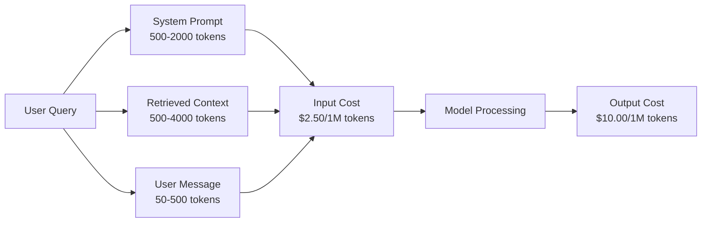
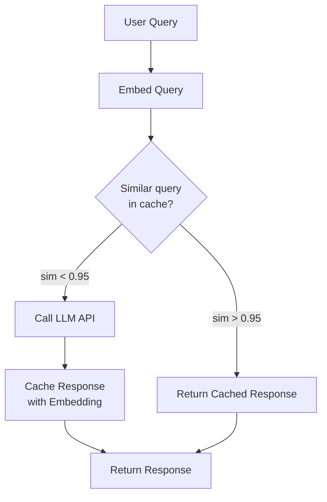
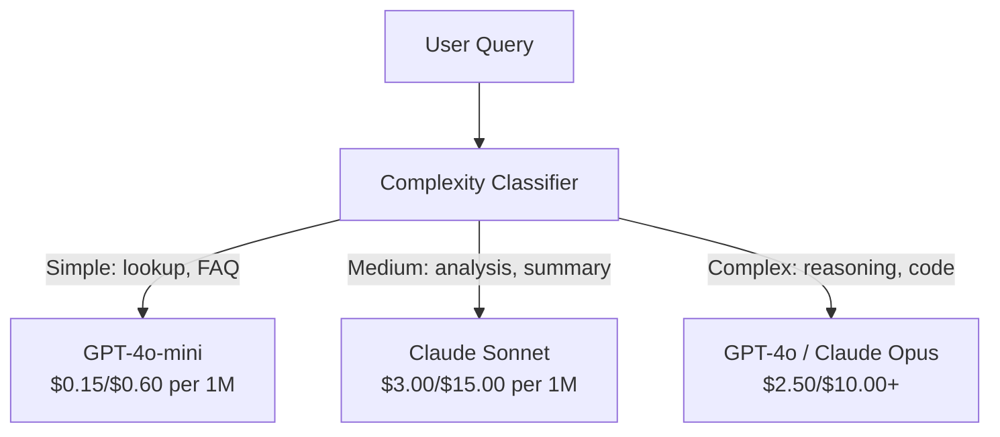

# 快取、速率限制與成本最佳化

> 大多數 AI 新創不是死於模型不好，而是死於單位經濟不成立。單一次 GPT-4o 呼叫只要幾分之一美分。但一萬個使用者每天各打十次，光輸入詞元就是 $250 —— 而你還沒收到一塊錢。活下來的公司，是把每一次 API 呼叫當成一筆金融交易、而不是一次函數呼叫的那些。

**類型：** 實作
**程式語言：** Python
**先修單元：** 階段 11 第 09 課（函數呼叫）
**時間：** 約 45 分鐘
**相關單元：** 階段 11 · 15（提示詞快取）—— 這一課講應用層快取（語意快取、精確雜湊快取、模型路由）。第 15 課講供應商層的提示詞快取（Anthropic cache_control、OpenAI 自動、Gemini CachedContent）。兩者併用可降低 50-95% 成本。

## 學習目標

- 實作語意快取，讓重複或相似的查詢從快取取得回應，而不是重新呼叫 API
- 計算跨供應商的每次請求成本，並實作有詞元意識的速率限制與預算警示
- 建一層成本最佳化：提示詞壓縮、模型路由（貴的對便宜的）與回應快取
- 為不同查詢類型設計分層快取策略，結合精確匹配、語意相似度與前綴快取

## 問題所在

你做了一個 RAG 聊天機器人。它運作得很漂亮，使用者很愛。

然後帳單來了。

GPT-5 是每百萬輸入詞元 $5、每百萬輸出 $15。Claude Opus 4.7 是輸入 $15／輸出 $75。Gemini 3 Pro 是輸入 $1.25／輸出 $5。GPT-5-mini 是 $0.25/$2。以下價格僅為示意，請務必查看供應商當前的定價頁面。

以下是殺死新創的那道算式：

- 每日活躍使用者 10,000 人
- 每人每天 10 次查詢
- 每次查詢 1,000 個輸入詞元（系統提示詞 + 上下文 + 使用者訊息）
- 每次回應 500 個輸出詞元

**每日輸入成本：** 10,000 x 10 x 1,000 / 1,000,000 x $2.50 = **每天 $250**
**每日輸出成本：** 10,000 x 10 x 500 / 1,000,000 x $10.00 = **每天 $500**
**每月合計：** **每月 $22,500**

而那只是 LLM。再加上嵌入、向量資料庫託管、基礎設施 —— 一個聊天機器人你就看著每月 $30,000。

殘酷的部分是：那些查詢有 40-60% 是近乎重複的。使用者用略微不同的字問同樣的問題。你的系統提示詞 —— 每一次請求都一模一樣 —— 每一次都被計費。RAG 取出的上下文文件，在問同一主題的使用者之間反覆出現。

你在為冗餘的計算付全價。

## 核心概念

### 一次 LLM 呼叫的成本解剖

每一次 API 呼叫有五個成本組成部分。



系統提示詞是無聲的殺手。一個 1,500 詞元的系統提示詞每次請求都送，光那段前綴每百萬次請求就是 $3.75。每天 10 萬次請求的話，那是每天 $375 —— 每月 $11,250 —— 全花在一段從不改變的文字上。

### 供應商快取：內建折扣

到 2026 年，三家主要供應商都提供供應商端的提示詞快取，但機制不同。深入探討見階段 11 · 15。

| 供應商 | 機制 | 折扣 | 最低要求 | 快取存續時間 |
|----------|-----------|----------|---------|----------------|
| Anthropic | 明確的 cache_control 標記 | 命中時 90% 折扣（寫入時多付 25%） | 1,024 詞元（Sonnet/Opus）、2,048（Haiku） | 預設 5 分鐘；延長 1 小時（寫入溢價 2 倍） |
| OpenAI | 自動前綴比對 | 命中時 50% 折扣 | 1,024 詞元 | 盡力而為，最長 1 小時 |
| Google Gemini | 明確的 CachedContent API | 約降 75%（另加儲存費） | 4,096（Flash）／32,768（Pro） | 使用者可設定 TTL |

**Anthropic 的做法**是明確的。你用 `cache_control: {"type": "ephemeral"}` 標記提示詞的區段。第一次請求付 25% 的寫入溢價，後續帶相同前綴的請求享 90% 折扣。一個 2,000 詞元的系統提示詞平常要 $0.005，命中快取時只要 $0.000625。跑 10 萬次請求，每天省下 $437.50。

**OpenAI 的做法**是自動的。任何與先前請求相符的提示詞前綴都享 50% 折扣，不需要標記。取捨是：折扣較少、控制較少，但完全零實作成本。

### 語意快取：你自己的那一層

供應商快取只在前綴完全相同時有效。語意快取處理更難的情況：字面不同但語意相同的查詢。

「What is the return policy?」和「How do I return an item?」是不同的字串，但意圖完全相同。語意快取把兩個查詢都嵌入、計算餘弦相似度，若相似度超過閾值（通常 0.92-0.95）就回傳快取的回應。



嵌入成本微不足道。OpenAI 的 text-embedding-3-small 是每百萬詞元 $0.02。跟完整一次 LLM 呼叫比起來，查快取幾乎不花錢。

### 精確快取：雜湊與比對

對確定性的呼叫（temperature=0、同一個模型、同一個提示詞）來說，精確快取更簡單也更快。把整個提示詞雜湊、查快取、找到就回傳。

這在以下情況完美適用：
- 系統提示詞 + 固定上下文 + 完全相同的使用者查詢
- 帶完全相同工具定義的函數呼叫
- 同一份文件被處理多次的批次處理

### 速率限制：保護你的預算

速率限制不只關於公平，它關乎存活。

**權杖桶演算法：** 每個使用者拿到一桶 N 個權杖，以每秒 R 個的速率回填。一次請求消耗桶裡的權杖。桶空了，請求就被拒絕。這允許突發（一次用掉整桶），同時強制一個平均速率。

**每使用者配額：** 依使用者層級設定每日／每月詞元上限。

| 層級 | 每日詞元上限 | 每分鐘最大請求數 | 可用模型 |
|------|------------------|------------------|-------------|
| 免費 | 50,000 | 10 | 僅 GPT-4o-mini |
| Pro | 500,000 | 60 | GPT-4o、Claude Sonnet |
| 企業 | 5,000,000 | 300 | 所有模型 |

### 模型路由：對的工作配對的模型

不是每個查詢都需要 GPT-4o。

「What time does the store close?」不需要一個輸出每百萬 $10 的模型。輸出每百萬 $0.60 的 GPT-4o-mini 就處理得完美。輸出每百萬 $1.25 的 Claude Haiku 也行。一個簡單的分類器把便宜的查詢送去便宜的模型，把複雜的查詢送去昂貴的模型。



一個調校得好的路由器，光在模型成本上就能省 40-70%。

### 成本追蹤：知道錢去哪了

你無法最佳化你沒在量的東西。把每一次 API 呼叫都記下來，包含：

- 時間戳
- 模型名稱
- 輸入詞元
- 輸出詞元
- 延遲（毫秒）
- 計算出的成本（$）
- 使用者 ID
- 快取命中／未命中
- 請求類別

這些資料會揭露哪些功能很貴、哪些使用者是重度消耗者，以及快取在哪裡影響最大。

### 批次處理：量大有折扣

OpenAI 的 Batch API 以非同步方式處理請求，享 50% 折扣。你送出最多 50,000 個請求的批次，結果在 24 小時內回來。

批次處理適合：
- 夜間文件處理
- 大量分類
- 評估執行
- 資料充實管線

不適合：即時面向使用者的查詢（延遲很重要）。

### 預算警示與斷路器

斷路器在你觸及上限時停止花錢。少了它，一個 bug 或一次濫用能在幾小時內燒光你整月的預算。

設三道閾值：
1. **警告**（預算的 70%）：發出通知
2. **節流**（預算的 85%）：只切換到較便宜的模型
3. **停止**（預算的 95%）：拒絕新請求，只回傳快取的回應

### 最佳化堆疊

依序套用這些技術。每一層都疊在前面幾層之上。

| 層級 | 技術 | 典型節省 | 實作工作量 |
|-------|-----------|----------------|----------------------|
| 1 | 供應商提示詞快取 | 30-50% | 低（加上快取標記） |
| 2 | 精確快取 | 10-20% | 低（雜湊 + 字典） |
| 3 | 語意快取 | 15-30% | 中（嵌入 + 相似度） |
| 4 | 模型路由 | 40-70% | 中（分類器） |
| 5 | 速率限制 | 保護預算 | 低（權杖桶） |
| 6 | 提示詞壓縮 | 10-30% | 中（重寫提示詞） |
| 7 | 批次處理 | 符合條件者省 50% | 低（batch API） |

一個套用了第 1-5 層的 RAG 應用，通常能把成本從每月 $22,500 降到 $4,000-6,000。那就是「燒光跑道」與「建起一門生意」之間的差別。

### 真實節省：前後對比

以下是一個服務 10,000 日活的 RAG 聊天機器人的真實拆解。

| 指標 | 最佳化之前 | 最佳化之後 | 節省 |
|--------|--------------------|--------------------|---------|
| 每月 LLM 成本 | $22,500 | $5,200 | 77% |
| 平均每次查詢成本 | $0.0075 | $0.0017 | 77% |
| 快取命中率 | 0% | 52% | -- |
| 路由到 mini 的查詢 | 0% | 65% | -- |
| P95 延遲 | 2,800ms | 900ms（命中快取：50ms） | 68% |
| 每月嵌入成本 | $0 | $180 | （新增成本） |
| 每月總成本 | $22,500 | $5,380 | 76% |

語意快取的嵌入成本（每月 $180）在快取開始命中的第一個小時內就回本了。

## 實作

### 步驟 1：成本計算器

做一個詞元成本計算器，內含主要模型的當前定價。

```python
import hashlib
import time
import json
import math
from dataclasses import dataclass, field


MODEL_PRICING = {
    "gpt-4o": {"input": 2.50, "output": 10.00, "cached_input": 1.25},
    "gpt-4o-mini": {"input": 0.15, "output": 0.60, "cached_input": 0.075},
    "gpt-4.1": {"input": 2.00, "output": 8.00, "cached_input": 0.50},
    "gpt-4.1-mini": {"input": 0.40, "output": 1.60, "cached_input": 0.10},
    "gpt-4.1-nano": {"input": 0.10, "output": 0.40, "cached_input": 0.025},
    "o3": {"input": 2.00, "output": 8.00, "cached_input": 0.50},
    "o3-mini": {"input": 1.10, "output": 4.40, "cached_input": 0.55},
    "o4-mini": {"input": 1.10, "output": 4.40, "cached_input": 0.275},
    "claude-opus-4": {"input": 15.00, "output": 75.00, "cached_input": 1.50},
    "claude-sonnet-4": {"input": 3.00, "output": 15.00, "cached_input": 0.30},
    "claude-haiku-3.5": {"input": 0.80, "output": 4.00, "cached_input": 0.08},
    "gemini-2.5-pro": {"input": 1.25, "output": 10.00, "cached_input": 0.3125},
    "gemini-2.5-flash": {"input": 0.15, "output": 0.60, "cached_input": 0.0375},
}


def calculate_cost(model, input_tokens, output_tokens, cached_input_tokens=0):
    if model not in MODEL_PRICING:
        return {"error": f"Unknown model: {model}"}
    pricing = MODEL_PRICING[model]
    non_cached = input_tokens - cached_input_tokens
    input_cost = (non_cached / 1_000_000) * pricing["input"]
    cached_cost = (cached_input_tokens / 1_000_000) * pricing["cached_input"]
    output_cost = (output_tokens / 1_000_000) * pricing["output"]
    total = input_cost + cached_cost + output_cost
    return {
        "model": model,
        "input_tokens": input_tokens,
        "output_tokens": output_tokens,
        "cached_input_tokens": cached_input_tokens,
        "input_cost": round(input_cost, 6),
        "cached_input_cost": round(cached_cost, 6),
        "output_cost": round(output_cost, 6),
        "total_cost": round(total, 6),
    }
```

### 步驟 2：精確快取

把整個提示詞雜湊起來，對完全相同的請求回傳快取的回應。

```python
class ExactCache:
    def __init__(self, max_size=1000, ttl_seconds=3600):
        self.cache = {}
        self.max_size = max_size
        self.ttl = ttl_seconds
        self.hits = 0
        self.misses = 0

    def _hash(self, model, messages, temperature):
        key_data = json.dumps({"model": model, "messages": messages, "temperature": temperature}, sort_keys=True)
        return hashlib.sha256(key_data.encode()).hexdigest()

    def get(self, model, messages, temperature=0.0):
        if temperature > 0:
            self.misses += 1
            return None
        key = self._hash(model, messages, temperature)
        if key in self.cache:
            entry = self.cache[key]
            if time.time() - entry["timestamp"] < self.ttl:
                self.hits += 1
                entry["access_count"] += 1
                return entry["response"]
            del self.cache[key]
        self.misses += 1
        return None

    def put(self, model, messages, temperature, response):
        if temperature > 0:
            return
        if len(self.cache) >= self.max_size:
            oldest_key = min(self.cache, key=lambda k: self.cache[k]["timestamp"])
            del self.cache[oldest_key]
        key = self._hash(model, messages, temperature)
        self.cache[key] = {
            "response": response,
            "timestamp": time.time(),
            "access_count": 1,
        }

    def stats(self):
        total = self.hits + self.misses
        return {
            "hits": self.hits,
            "misses": self.misses,
            "hit_rate": round(self.hits / total, 4) if total > 0 else 0,
            "cache_size": len(self.cache),
        }
```

### 步驟 3：語意快取

把查詢嵌入，當相似度超過閾值時回傳快取的回應。

```python
def simple_embed(text):
    words = text.lower().split()
    vocab = {}
    for w in words:
        vocab[w] = vocab.get(w, 0) + 1
    norm = math.sqrt(sum(v * v for v in vocab.values()))
    if norm == 0:
        return {}
    return {k: v / norm for k, v in vocab.items()}


def cosine_similarity(a, b):
    if not a or not b:
        return 0.0
    all_keys = set(a) | set(b)
    dot = sum(a.get(k, 0) * b.get(k, 0) for k in all_keys)
    return dot


class SemanticCache:
    def __init__(self, similarity_threshold=0.85, max_size=500, ttl_seconds=3600):
        self.entries = []
        self.threshold = similarity_threshold
        self.max_size = max_size
        self.ttl = ttl_seconds
        self.hits = 0
        self.misses = 0

    def get(self, query):
        query_embedding = simple_embed(query)
        now = time.time()
        best_match = None
        best_sim = 0.0
        for entry in self.entries:
            if now - entry["timestamp"] > self.ttl:
                continue
            sim = cosine_similarity(query_embedding, entry["embedding"])
            if sim > best_sim:
                best_sim = sim
                best_match = entry
        if best_match and best_sim >= self.threshold:
            self.hits += 1
            best_match["access_count"] += 1
            return {"response": best_match["response"], "similarity": round(best_sim, 4), "original_query": best_match["query"]}
        self.misses += 1
        return None

    def put(self, query, response):
        if len(self.entries) >= self.max_size:
            self.entries.sort(key=lambda e: e["timestamp"])
            self.entries.pop(0)
        self.entries.append({
            "query": query,
            "embedding": simple_embed(query),
            "response": response,
            "timestamp": time.time(),
            "access_count": 1,
        })

    def stats(self):
        total = self.hits + self.misses
        return {
            "hits": self.hits,
            "misses": self.misses,
            "hit_rate": round(self.hits / total, 4) if total > 0 else 0,
            "cache_size": len(self.entries),
        }
```

### 步驟 4：速率限制器

帶每使用者配額的權杖桶速率限制器。

```python
class TokenBucketRateLimiter:
    def __init__(self):
        self.buckets = {}
        self.tiers = {
            "free": {"capacity": 50_000, "refill_rate": 500, "max_requests_per_min": 10},
            "pro": {"capacity": 500_000, "refill_rate": 5_000, "max_requests_per_min": 60},
            "enterprise": {"capacity": 5_000_000, "refill_rate": 50_000, "max_requests_per_min": 300},
        }

    def _get_bucket(self, user_id, tier="free"):
        if user_id not in self.buckets:
            tier_config = self.tiers.get(tier, self.tiers["free"])
            self.buckets[user_id] = {
                "tokens": tier_config["capacity"],
                "capacity": tier_config["capacity"],
                "refill_rate": tier_config["refill_rate"],
                "last_refill": time.time(),
                "request_timestamps": [],
                "max_rpm": tier_config["max_requests_per_min"],
                "tier": tier,
                "total_tokens_used": 0,
            }
        return self.buckets[user_id]

    def _refill(self, bucket):
        now = time.time()
        elapsed = now - bucket["last_refill"]
        refill = int(elapsed * bucket["refill_rate"])
        if refill > 0:
            bucket["tokens"] = min(bucket["capacity"], bucket["tokens"] + refill)
            bucket["last_refill"] = now

    def check(self, user_id, tokens_needed, tier="free"):
        bucket = self._get_bucket(user_id, tier)
        self._refill(bucket)
        now = time.time()
        bucket["request_timestamps"] = [t for t in bucket["request_timestamps"] if now - t < 60]
        if len(bucket["request_timestamps"]) >= bucket["max_rpm"]:
            return {"allowed": False, "reason": "rate_limit", "retry_after_seconds": 60 - (now - bucket["request_timestamps"][0])}
        if bucket["tokens"] < tokens_needed:
            deficit = tokens_needed - bucket["tokens"]
            wait = deficit / bucket["refill_rate"]
            return {"allowed": False, "reason": "token_limit", "tokens_available": bucket["tokens"], "retry_after_seconds": round(wait, 1)}
        return {"allowed": True, "tokens_available": bucket["tokens"]}

    def consume(self, user_id, tokens_used, tier="free"):
        bucket = self._get_bucket(user_id, tier)
        bucket["tokens"] -= tokens_used
        bucket["request_timestamps"].append(time.time())
        bucket["total_tokens_used"] += tokens_used

    def get_usage(self, user_id):
        if user_id not in self.buckets:
            return {"error": "User not found"}
        b = self.buckets[user_id]
        return {
            "user_id": user_id,
            "tier": b["tier"],
            "tokens_remaining": b["tokens"],
            "capacity": b["capacity"],
            "total_tokens_used": b["total_tokens_used"],
            "utilization": round(b["total_tokens_used"] / b["capacity"], 4) if b["capacity"] else 0,
        }
```

### 步驟 5：成本追蹤器

記錄每一次呼叫，並算出累計總額。

```python
class CostTracker:
    def __init__(self, monthly_budget=1000.0):
        self.logs = []
        self.monthly_budget = monthly_budget
        self.alerts = []

    def log_call(self, model, input_tokens, output_tokens, cached_input_tokens=0, latency_ms=0, user_id="anonymous", cache_status="miss"):
        cost = calculate_cost(model, input_tokens, output_tokens, cached_input_tokens)
        entry = {
            "timestamp": time.time(),
            "model": model,
            "input_tokens": input_tokens,
            "output_tokens": output_tokens,
            "cached_input_tokens": cached_input_tokens,
            "latency_ms": latency_ms,
            "cost": cost["total_cost"],
            "user_id": user_id,
            "cache_status": cache_status,
        }
        self.logs.append(entry)
        self._check_budget()
        return entry

    def _check_budget(self):
        total = self.total_cost()
        pct = total / self.monthly_budget if self.monthly_budget > 0 else 0
        if pct >= 0.95 and not any(a["level"] == "stop" for a in self.alerts):
            self.alerts.append({"level": "stop", "message": f"Budget 95% consumed: ${total:.2f}/${self.monthly_budget:.2f}", "timestamp": time.time()})
        elif pct >= 0.85 and not any(a["level"] == "throttle" for a in self.alerts):
            self.alerts.append({"level": "throttle", "message": f"Budget 85% consumed: ${total:.2f}/${self.monthly_budget:.2f}", "timestamp": time.time()})
        elif pct >= 0.70 and not any(a["level"] == "warning" for a in self.alerts):
            self.alerts.append({"level": "warning", "message": f"Budget 70% consumed: ${total:.2f}/${self.monthly_budget:.2f}", "timestamp": time.time()})

    def total_cost(self):
        return round(sum(e["cost"] for e in self.logs), 6)

    def cost_by_model(self):
        by_model = {}
        for e in self.logs:
            m = e["model"]
            if m not in by_model:
                by_model[m] = {"calls": 0, "cost": 0, "input_tokens": 0, "output_tokens": 0}
            by_model[m]["calls"] += 1
            by_model[m]["cost"] = round(by_model[m]["cost"] + e["cost"], 6)
            by_model[m]["input_tokens"] += e["input_tokens"]
            by_model[m]["output_tokens"] += e["output_tokens"]
        return by_model

    def cache_savings(self):
        cache_hits = [e for e in self.logs if e["cache_status"] == "hit"]
        if not cache_hits:
            return {"saved": 0, "cache_hits": 0}
        saved = 0
        for e in cache_hits:
            full_cost = calculate_cost(e["model"], e["input_tokens"], e["output_tokens"])
            saved += full_cost["total_cost"]
        return {"saved": round(saved, 4), "cache_hits": len(cache_hits)}

    def summary(self):
        if not self.logs:
            return {"total_calls": 0, "total_cost": 0}
        total_latency = sum(e["latency_ms"] for e in self.logs)
        cache_hits = sum(1 for e in self.logs if e["cache_status"] == "hit")
        return {
            "total_calls": len(self.logs),
            "total_cost": self.total_cost(),
            "avg_cost_per_call": round(self.total_cost() / len(self.logs), 6),
            "avg_latency_ms": round(total_latency / len(self.logs), 1),
            "cache_hit_rate": round(cache_hits / len(self.logs), 4),
            "cost_by_model": self.cost_by_model(),
            "cache_savings": self.cache_savings(),
            "budget_remaining": round(self.monthly_budget - self.total_cost(), 2),
            "budget_utilization": round(self.total_cost() / self.monthly_budget, 4) if self.monthly_budget > 0 else 0,
            "alerts": self.alerts,
        }
```

### 步驟 6：模型路由器

把查詢路由到能處理它的最便宜模型。

```python
SIMPLE_KEYWORDS = ["what time", "hours", "address", "phone", "price", "return policy", "hello", "hi", "thanks", "yes", "no"]
COMPLEX_KEYWORDS = ["analyze", "compare", "explain why", "write code", "debug", "architect", "design", "trade-off", "evaluate"]


def classify_complexity(query):
    q = query.lower()
    if len(q.split()) <= 5 or any(kw in q for kw in SIMPLE_KEYWORDS):
        return "simple"
    if any(kw in q for kw in COMPLEX_KEYWORDS):
        return "complex"
    return "medium"


def route_model(query, tier="pro"):
    complexity = classify_complexity(query)
    routing_table = {
        "simple": {"free": "gpt-4.1-nano", "pro": "gpt-4o-mini", "enterprise": "gpt-4o-mini"},
        "medium": {"free": "gpt-4o-mini", "pro": "claude-sonnet-4", "enterprise": "claude-sonnet-4"},
        "complex": {"free": "gpt-4o-mini", "pro": "gpt-4o", "enterprise": "claude-opus-4"},
    }
    model = routing_table[complexity].get(tier, "gpt-4o-mini")
    return {"query": query, "complexity": complexity, "model": model, "tier": tier}
```

### 步驟 7：跑示範

```python
def simulate_llm_call(model, query):
    input_tokens = len(query.split()) * 4 + 500
    output_tokens = 150 + (len(query.split()) * 2)
    latency = 200 + (output_tokens * 2)
    return {
        "model": model,
        "response": f"[Simulated {model} response to: {query[:50]}...]",
        "input_tokens": input_tokens,
        "output_tokens": output_tokens,
        "latency_ms": latency,
    }


def run_demo():
    print("=" * 60)
    print("  Caching, Rate Limiting & Cost Optimization Demo")
    print("=" * 60)

    print("\n--- Model Pricing ---")
    for model, pricing in list(MODEL_PRICING.items())[:6]:
        cost_1k = calculate_cost(model, 1000, 500)
        print(f"  {model}: ${cost_1k['total_cost']:.6f} per 1K in + 500 out")

    print("\n--- Cost Comparison: 100K Requests ---")
    for model in ["gpt-4o", "gpt-4o-mini", "claude-sonnet-4", "claude-haiku-3.5"]:
        cost = calculate_cost(model, 1000 * 100_000, 500 * 100_000)
        print(f"  {model}: ${cost['total_cost']:.2f}")

    print("\n--- Anthropic Cache Savings ---")
    no_cache = calculate_cost("claude-sonnet-4", 2000, 500, 0)
    with_cache = calculate_cost("claude-sonnet-4", 2000, 500, 1500)
    saving = no_cache["total_cost"] - with_cache["total_cost"]
    print(f"  Without cache: ${no_cache['total_cost']:.6f}")
    print(f"  With 1500 cached tokens: ${with_cache['total_cost']:.6f}")
    print(f"  Savings per call: ${saving:.6f} ({saving/no_cache['total_cost']*100:.1f}%)")

    exact_cache = ExactCache(max_size=100, ttl_seconds=300)
    semantic_cache = SemanticCache(similarity_threshold=0.75, max_size=100)
    rate_limiter = TokenBucketRateLimiter()
    tracker = CostTracker(monthly_budget=100.0)

    print("\n--- Exact Cache ---")
    messages_1 = [{"role": "user", "content": "What is the return policy?"}]
    result = exact_cache.get("gpt-4o-mini", messages_1, 0.0)
    print(f"  First lookup: {'HIT' if result else 'MISS'}")
    exact_cache.put("gpt-4o-mini", messages_1, 0.0, "You can return items within 30 days.")
    result = exact_cache.get("gpt-4o-mini", messages_1, 0.0)
    print(f"  Second lookup: {'HIT' if result else 'MISS'} -> {result}")
    result = exact_cache.get("gpt-4o-mini", messages_1, 0.7)
    print(f"  With temp=0.7: {'HIT' if result else 'MISS (non-deterministic, skip cache)'}")
    print(f"  Stats: {exact_cache.stats()}")

    print("\n--- Semantic Cache ---")
    test_queries = [
        ("What is the return policy?", "Items can be returned within 30 days with receipt."),
        ("How do I return an item?", None),
        ("What are your store hours?", "We are open 9am-9pm Monday through Saturday."),
        ("When does the store open?", None),
        ("Tell me about quantum computing", "Quantum computers use qubits..."),
        ("Explain quantum mechanics", None),
    ]
    for query, response in test_queries:
        cached = semantic_cache.get(query)
        if cached:
            print(f"  '{query[:40]}' -> CACHE HIT (sim={cached['similarity']}, original='{cached['original_query'][:40]}')")
        elif response:
            semantic_cache.put(query, response)
            print(f"  '{query[:40]}' -> MISS (stored)")
        else:
            print(f"  '{query[:40]}' -> MISS (no match)")
    print(f"  Stats: {semantic_cache.stats()}")

    print("\n--- Rate Limiting ---")
    for i in range(12):
        check = rate_limiter.check("user_1", 1000, "free")
        if check["allowed"]:
            rate_limiter.consume("user_1", 1000, "free")
        status = "OK" if check["allowed"] else f"BLOCKED ({check['reason']})"
        if i < 5 or not check["allowed"]:
            print(f"  Request {i+1}: {status}")
    print(f"  Usage: {rate_limiter.get_usage('user_1')}")

    print("\n--- Model Routing ---")
    routing_queries = [
        "What time do you close?",
        "Summarize this quarterly earnings report",
        "Analyze the trade-offs between microservices and monoliths",
        "Hello",
        "Write code for a binary search tree with deletion",
    ]
    for q in routing_queries:
        route = route_model(q, "pro")
        print(f"  '{q[:50]}' -> {route['model']} ({route['complexity']})")

    print("\n--- Full Pipeline: Before vs After Optimization ---")
    queries = [
        "What is the return policy?",
        "How do I return something?",
        "What are your hours?",
        "When do you open?",
        "Explain the difference between TCP and UDP",
        "Compare TCP vs UDP protocols",
        "Hello",
        "What is your phone number?",
        "Write a Python function to sort a list",
        "Analyze the pros and cons of serverless architecture",
    ]

    print("\n  [Before: no caching, single model (gpt-4o)]")
    tracker_before = CostTracker(monthly_budget=1000.0)
    for q in queries:
        result = simulate_llm_call("gpt-4o", q)
        tracker_before.log_call("gpt-4o", result["input_tokens"], result["output_tokens"], latency_ms=result["latency_ms"], cache_status="miss")
    before = tracker_before.summary()
    print(f"  Total cost: ${before['total_cost']:.6f}")
    print(f"  Avg cost/call: ${before['avg_cost_per_call']:.6f}")
    print(f"  Avg latency: {before['avg_latency_ms']}ms")

    print("\n  [After: caching + routing + rate limiting]")
    exact_c = ExactCache()
    semantic_c = SemanticCache(similarity_threshold=0.75)
    tracker_after = CostTracker(monthly_budget=1000.0)

    for q in queries:
        messages = [{"role": "user", "content": q}]
        cached = exact_c.get("gpt-4o", messages, 0.0)
        if cached:
            tracker_after.log_call("gpt-4o-mini", 0, 0, latency_ms=5, cache_status="hit")
            continue
        sem_cached = semantic_c.get(q)
        if sem_cached:
            tracker_after.log_call("gpt-4o-mini", 0, 0, latency_ms=15, cache_status="hit")
            continue
        route = route_model(q)
        result = simulate_llm_call(route["model"], q)
        tracker_after.log_call(route["model"], result["input_tokens"], result["output_tokens"], latency_ms=result["latency_ms"], cache_status="miss")
        exact_c.put(route["model"], messages, 0.0, result["response"])
        semantic_c.put(q, result["response"])

    after = tracker_after.summary()
    print(f"  Total cost: ${after['total_cost']:.6f}")
    print(f"  Avg cost/call: ${after['avg_cost_per_call']:.6f}")
    print(f"  Avg latency: {after['avg_latency_ms']}ms")
    print(f"  Cache hit rate: {after['cache_hit_rate']:.0%}")

    if before["total_cost"] > 0:
        savings_pct = (1 - after["total_cost"] / before["total_cost"]) * 100
        print(f"\n  SAVINGS: {savings_pct:.1f}% cost reduction")
        print(f"  Latency improvement: {(1 - after['avg_latency_ms'] / before['avg_latency_ms']) * 100:.1f}% faster")

    print("\n--- Budget Alerts Demo ---")
    alert_tracker = CostTracker(monthly_budget=0.01)
    for i in range(5):
        alert_tracker.log_call("gpt-4o", 5000, 2000, latency_ms=500)
    print(f"  Total spent: ${alert_tracker.total_cost():.6f} / ${alert_tracker.monthly_budget}")
    for alert in alert_tracker.alerts:
        print(f"  ALERT [{alert['level'].upper()}]: {alert['message']}")

    print("\n--- Cost Breakdown by Model ---")
    multi_tracker = CostTracker(monthly_budget=500.0)
    for _ in range(50):
        multi_tracker.log_call("gpt-4o-mini", 800, 200, latency_ms=150)
    for _ in range(30):
        multi_tracker.log_call("claude-sonnet-4", 1500, 500, latency_ms=400)
    for _ in range(10):
        multi_tracker.log_call("gpt-4o", 2000, 800, latency_ms=600)
    for _ in range(10):
        multi_tracker.log_call("claude-opus-4", 3000, 1000, latency_ms=1200)
    breakdown = multi_tracker.cost_by_model()
    for model, data in sorted(breakdown.items(), key=lambda x: x[1]["cost"], reverse=True):
        print(f"  {model}: {data['calls']} calls, ${data['cost']:.6f}, {data['input_tokens']:,} in / {data['output_tokens']:,} out")
    print(f"  Total: ${multi_tracker.total_cost():.6f}")

    print("\n" + "=" * 60)
    print("  Demo complete.")
    print("=" * 60)


if __name__ == "__main__":
    run_demo()
```

## 實務應用

### Anthropic 提示詞快取

```python
# import anthropic
#
# client = anthropic.Anthropic()
#
# response = client.messages.create(
#     model="claude-sonnet-5",
#     max_tokens=1024,
#     system=[
#         {
#             "type": "text",
#             "text": "You are a helpful customer support agent for Acme Corp...",
#             "cache_control": {"type": "ephemeral"},
#         }
#     ],
#     messages=[{"role": "user", "content": "What is the return policy?"}],
# )
#
# print(f"Input tokens: {response.usage.input_tokens}")
# print(f"Cache creation tokens: {response.usage.cache_creation_input_tokens}")
# print(f"Cache read tokens: {response.usage.cache_read_input_tokens}")
```

第一次呼叫是寫入快取（25% 溢價）。之後每一次帶相同系統提示詞前綴的呼叫都是讀快取（90% 折扣）。快取存續 5 分鐘，且每次命中都會把計時器重設。

### OpenAI 自動快取

```python
# from openai import OpenAI
#
# client = OpenAI()
#
# response = client.chat.completions.create(
#     model="gpt-4o",
#     messages=[
#         {"role": "system", "content": "You are a helpful customer support agent..."},
#         {"role": "user", "content": "What is the return policy?"},
#     ],
# )
#
# print(f"Prompt tokens: {response.usage.prompt_tokens}")
# print(f"Cached tokens: {response.usage.prompt_tokens_details.cached_tokens}")
# print(f"Completion tokens: {response.usage.completion_tokens}")
```

OpenAI 自動做快取。任何 1,024 詞元以上、與近期請求相符的提示詞前綴都享 50% 折扣。不需要改程式碼 —— 只要檢查回應裡的 `prompt_tokens_details.cached_tokens` 確認它有生效。

### OpenAI Batch API

```python
# import json
# from openai import OpenAI
#
# client = OpenAI()
#
# requests = []
# for i, query in enumerate(queries):
#     requests.append({
#         "custom_id": f"request-{i}",
#         "method": "POST",
#         "url": "/v1/chat/completions",
#         "body": {
#             "model": "gpt-4o-mini",
#             "messages": [{"role": "user", "content": query}],
#         },
#     })
#
# with open("batch_input.jsonl", "w") as f:
#     for r in requests:
#         f.write(json.dumps(r) + "\n")
#
# batch_file = client.files.create(file=open("batch_input.jsonl", "rb"), purpose="batch")
# batch = client.batches.create(input_file_id=batch_file.id, endpoint="/v1/chat/completions", completion_window="24h")
# print(f"Batch ID: {batch.id}, Status: {batch.status}")
```

Batch API 對所有詞元一律給 50% 折扣，結果在 24 小時內回來。非常適合非即時的工作負載：評估、資料標註、大量摘要。

### 用 Redis 做生產級語意快取

```python
# import redis
# import numpy as np
# from openai import OpenAI
#
# r = redis.Redis()
# client = OpenAI()
#
# def get_embedding(text):
#     response = client.embeddings.create(model="text-embedding-3-small", input=text)
#     return response.data[0].embedding
#
# def semantic_cache_lookup(query, threshold=0.95):
#     query_emb = np.array(get_embedding(query))
#     keys = r.keys("cache:emb:*")
#     best_sim, best_key = 0, None
#     for key in keys:
#         stored_emb = np.frombuffer(r.get(key), dtype=np.float32)
#         sim = np.dot(query_emb, stored_emb) / (np.linalg.norm(query_emb) * np.linalg.norm(stored_emb))
#         if sim > best_sim:
#             best_sim, best_key = sim, key
#     if best_sim >= threshold and best_key:
#         response_key = best_key.decode().replace("cache:emb:", "cache:resp:")
#         return r.get(response_key).decode()
#     return None
```

生產環境請把線性掃描換成向量索引（Redis Vector Search、Pinecone 或 pgvector）。線性掃描在 1,000 筆以下還行，超過就要用 ANN（近似最近鄰）來達到 O(log n) 查詢。

## 產出

這一課會產出 `outputs/prompt-cost-optimizer.md` —— 一個可重用的提示詞，用來分析你的 LLM 應用，並提出具體的成本最佳化建議與預估節省。

另外也會產出 `outputs/skill-cost-patterns.md` —— 一套決策框架，為你的場景挑選正確的快取策略、速率限制設定與模型路由規則。

## 練習

1. **為語意快取實作 LRU 淘汰。** 把「最舊優先」淘汰換成「最近最少使用」。追蹤每筆項目最後一次被存取的時間，快取滿時淘汰存取時間最舊的那一筆。在 100 次查詢上比較兩種策略的命中率。

2. **做一個成本預估工具。** 給定一份 API 呼叫日誌（CostTracker 的紀錄），依過去 7 天平均推估月成本。要考慮平日／週末的模式。若推估月成本超出預算 20% 以上就發出警示。

3. **實作分層語意快取。** 用兩個相似度閾值：0.98 為高信心命中（立即回傳），0.90 為中信心命中（回傳時加上聲明：「Based on a similar previous question...」）。追蹤每次命中來自哪一層，並量測使用者滿意度的差異。

4. **做一個模型路由分類器。** 把基於關鍵字的分類器換成基於嵌入的。把 50 個已標註查詢（簡單／中等／複雜）嵌入，然後用「找最近的已標註樣本」來分類新查詢。用 20 個查詢的測試集量測分類正確率。

5. **實作帶降級層級的斷路器。** 預算 70% 時記一筆警告。85% 時自動把所有路由切到最便宜的模型（gpt-4o-mini）。95% 時只提供快取回應並拒絕新查詢。用 $1.00 預算模擬 1,000 次請求來測試，驗證每道閾值都正確觸發。

## 關鍵術語

| 術語 | 大家怎麼說 | 它實際上是什麼 |
|------|----------------|----------------------|
| 提示詞快取（Prompt caching） | 「把系統提示詞快取起來」 | 供應商層級的快取，重複的提示詞前綴享折扣（Anthropic 90%、OpenAI 50%）—— OpenAI 不需改程式碼，Anthropic 要明確標記 |
| 語意快取（Semantic caching） | 「聰明的快取」 | 把查詢嵌入、計算與過往查詢的相似度，超過閾值就回傳快取回應 —— 能抓到精確匹配漏掉的換句話說 |
| 精確快取（Exact caching） | 「雜湊快取」 | 把整個提示詞（模型 + 訊息 + 溫度）雜湊，對完全相同的輸入回傳快取回應 —— 只適用於 temperature=0 的確定性呼叫 |
| 權杖桶（Token bucket） | 「速率限制器」 | 一種演算法：每個使用者有一桶 N 個權杖，以每秒 R 個回填 —— 允許最多 N 的突發，同時強制平均速率 R |
| 模型路由（Model routing） | 「小氣路由」 | 用分類器把簡單查詢送去便宜模型（GPT-4o-mini、Haiku）、複雜查詢送去昂貴模型（GPT-4o、Opus）—— 在模型成本上省 40-70% |
| 成本追蹤（Cost tracking） | 「計量」 | 記錄每一次 API 呼叫的模型、詞元、延遲、成本與使用者 ID，讓你確切知道錢去哪、哪些功能貴 |
| 斷路器（Circuit breaker） | 「緊急開關」 | 當花費接近預算上限時，自動降級服務（改用便宜模型、只回快取）或完全停止請求 |
| Batch API | 「量大折扣」 | OpenAI 的非同步處理，享 50% 折扣 —— 最多送 50,000 個請求，24 小時內拿到結果 |
| 提示詞壓縮（Prompt compression） | 「詞元減肥」 | 重寫系統提示詞與上下文，在保住語意的前提下用更少詞元 —— 更短的提示詞更便宜，往往表現也更好 |
| 快取命中率（Cache hit rate） | 「快取效率」 | 由快取而非呼叫 LLM 服務的請求比例 —— 生產聊天機器人通常 40-60%，成本也等比例節省 |

## 延伸閱讀

- [Anthropic Prompt Caching Guide](https://docs.anthropic.com/en/docs/build-with-claude/prompt-caching) —— Anthropic 明確 cache_control 標記、定價與快取存續行為的官方文件
- [OpenAI Prompt Caching](https://platform.openai.com/docs/guides/prompt-caching) —— OpenAI 的自動快取、如何透過 usage 欄位確認命中，以及最低前綴長度
- [OpenAI Batch API](https://platform.openai.com/docs/guides/batch) —— 非同步處理 50% 折扣、JSONL 格式、24 小時完成窗口與 5 萬筆請求上限
- [GPTCache](https://github.com/zilliztech/GPTCache) —— 開源語意快取函式庫，支援多種嵌入後端、向量儲存與淘汰策略
- [Martian Model Router](https://docs.withmartian.com) —— 生產級模型路由，自動選出能處理每個查詢的最便宜模型
- [Not Diamond](https://www.notdiamond.ai) —— 基於機器學習的模型路由器，從你的流量模式學習以最佳化跨供應商的成本／品質取捨
- [Helicone](https://www.helicone.ai) —— LLM 可觀測性平台，以代理層形式提供成本追蹤、快取、速率限制與預算警示
- [Dean & Barroso, "The Tail at Scale" (CACM 2013)](https://research.google/pubs/the-tail-at-scale/) —— 延遲、吞吐量、TTFT/TPOT 百分位與對沖請求；「挑出仍能滿足 P95 的最便宜模型」背後的成本模型。
- [Kwon et al., "Efficient Memory Management for Large Language Model Serving with PagedAttention" (SOSP 2023)](https://arxiv.org/abs/2309.06180) —— vLLM 論文；為什麼分頁 KV 快取 + 連續批次能在吞吐量上勝過樸素伺服器 24 倍，也就是「快取與成本」底下的基礎設施層。
- [Dao et al., "FlashAttention-2: Faster Attention with Better Parallelism and Work Partitioning" (ICLR 2024)](https://arxiv.org/abs/2307.08691) —— kernel 層級的成本降低，與提示詞快取正交；搭配推測式解碼與 GQA 一起讀，才有完整的成本曲線圖像。
