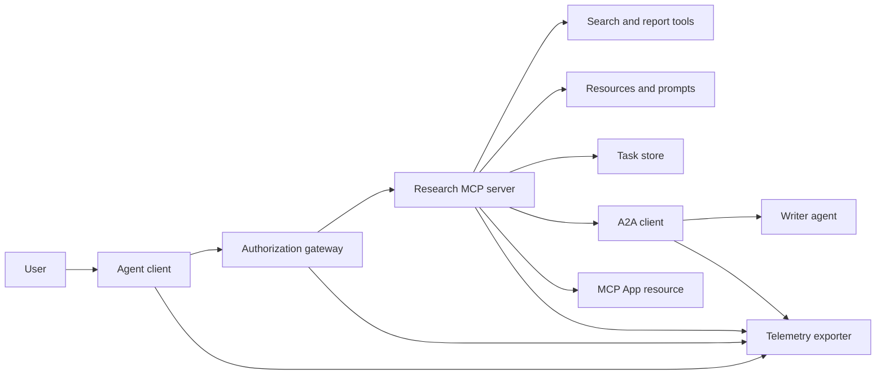
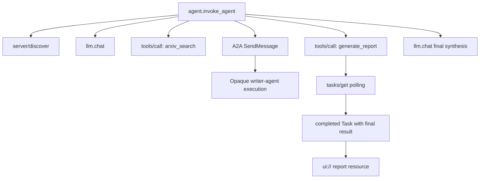
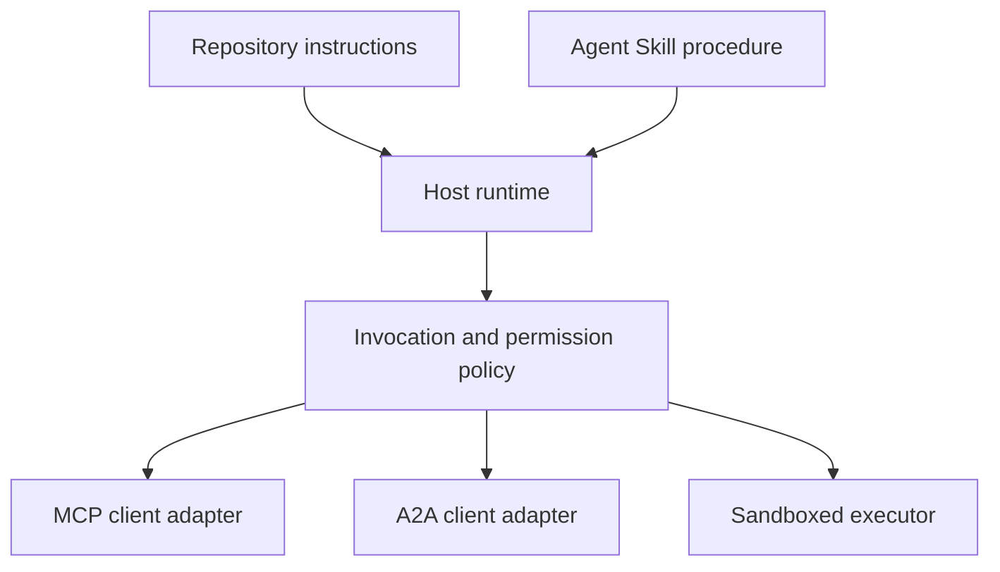

# 總結專案：無狀態的工具生態系

> 一套生產級的代理系統是一組邊界，不是一堆功能。這個總結專案把一份讀得懂的行程內模擬，跟真實部署仍然需要的協定客戶端、授權伺服器、沙箱與遙測輸出器分開來。

**類型：** 實作
**程式語言：** Python (stdlib, in-process simulation)
**先修單元：** 階段 13 · 01 到 22，使用 MCP 修訂版 `2026-07-28`
**時間：** 約 120 分鐘

## 學習目標

- 把工具呼叫、任務形狀的結果、被委派的工作、UI 資源、授權政策與追蹤紀錄，組進同一條流程。
- 在每一個 MCP 請求上都帶著協定版本、客戶端身分與能力，而不是靠一條連線工作階段。
- 在使用之前先探索伺服器，並透過官方的 Tasks 擴充來驅動長時間工作。
- 分辨一份協定形狀的模擬，跟一份 MCP、A2A、OAuth 或 OpenTelemetry 的實作。
- 把每一道被模擬的邊界，對映到那個非取代不可的生產元件。
- 讓 `AGENTS.md`、一項代理技能、執行環境轉接器、工具與安全政策，各自留在正確的角色上。
- 說明哪些主張可以從本機輸出驗證，哪些需要實際的整合測試。

## 問題所在

設計一套研究並產出報告的系統。一位使用者要求代理協定的相關論文。系統搜尋論文目錄、把摘要工作委派出去、產生一份報告、回傳一個 UI 資源，並記錄這條穿過系統的路徑。

這句話藏了好幾份互相獨立的契約：

- 一份面向模型的工具 schema；
- 一份無狀態的請求信封與伺服器探索契約；
- 一個針對行動者、範圍與工具身分的閘道決策；
- 一份長時間執行的操作契約；
- 一份委派協定；
- 一座宿主到應用之間的橋；
- 追蹤脈絡的傳遞與輸出；
- 一套可重用的作業程序。

`code/main.py` 用普通的 Python 函式與字典把那些邊界留在看得見的地方。它不開傳輸、不連 arXiv、不做 OAuth、不呼叫 A2A 伺服器、不渲染 MCP App，也不輸出遙測。這讓控制流很好檢視，同時不會把一份模擬說成一個合規的服務。

## 核心概念

### 目標架構



這個架構是把公開的協定模式在概念上組合起來。它不是在主張任何產品的私有內部長什麼樣子。

### 目標追蹤



在真實的實作裡，每一次跳轉都會傳遞追蹤脈絡。span 名稱與屬性必須遵循你所選的儀器化版本所支援的 OpenTelemetry 語意慣例。光是共用一個追蹤識別碼，證明不了父子關係正確、輸出成功，或後端有收下。

### 現行的協定介面

用現行協定定義的方法名稱，不要用你從舊草案記下來的名字：

| 邊界 | 現行介面 | 這個總結專案模擬了什麼 |
|---|---|---|
| MCP 探索 | 必備的 `server/discover` | 一個直接回傳版本、能力與伺服器身分的函式 |
| MCP 請求脈絡 | 每一個 `params._meta` 裡的版本、能力與客戶端身分 | 傳給每一次模擬呼叫的全新請求中繼資料 |
| MCP 工具呼叫 | `tools/call` | 直接的 Python 函式派送 |
| MCP 任務輪詢 | `io.modelcontextprotocol/tasks` 搭配 `tasks/get` | 一個 working 的把手，之後接一個帶著最終結果的已完成任務 |
| A2A 委派 | gRPC 與 JSON-RPC 裡的 `SendMessage`；HTTP+JSON 裡的 `POST /message:send` | 一個巢狀 span，沒有遠端呼叫也沒有人造延遲 |
| MCP App 呼叫伺服器工具 | `app.callServerTool({ name, arguments })` | 一段 HTML 字串，沒有活的橋 |
| OAuth 授權 | 授權伺服器、受保護資源中繼資料、受眾與範圍驗證 | 靜態 token 查表與範圍成員檢查 |
| OpenTelemetry | SDK、傳遞器、輸出器，以及收集器或後端 | 記憶體內的 span 字典 |

協定名稱只是第一層。生產測試必須在真實的線路上操練序列化、認證失敗、取消、逾時、重試與版本相容性。

### 無狀態的 MCP 改變了整合邊界

修訂版 `2026-07-28` 移除了協定工作階段，以及 `initialize` / `notifications/initialized` 握手。它也移除了 `Mcp-Session-Id`。每一個請求都帶著這些具命名空間的 `_meta` 欄位：

```json
{
  "io.modelcontextprotocol/protocolVersion": "2026-07-28",
  "io.modelcontextprotocol/clientCapabilities": {
    "extensions": {
      "io.modelcontextprotocol/tasks": {}
    }
  },
  "io.modelcontextprotocol/clientInfo": {
    "name": "capstone-client",
    "version": "1.0.0"
  }
}
```

伺服器必須實作 `server/discover`。一般結果用 `resultType: "complete"`；一個任務把手用 `resultType: "task"`。每一份結果都應該在 `_meta.io.modelcontextprotocol/serverInfo` 裡標明是哪台伺服器。

任務擴充有 `tasks/get`、`tasks/update` 與 `tasks/cancel`。一項工具可以先回傳 `resultType: "task"`；`tasks/get` 本身回傳的是 `resultType: "complete"`，而那個已完成的 `Task` 裡裝著最終結果。舊的 `tasks/result` 與 `tasks/list` 方法不屬於現行的擴充。客戶端必須在那個可能收到任務把手的同一個請求裡公告 `io.modelcontextprotocol/tasks`。如果它沒公告，伺服器會回 `-32021`，其中 `requiredCapabilities` 的形狀是那個缺少的客戶端能力物件，包含 `extensions.io.modelcontextprotocol/tasks`。

### 安全態勢

預期中的部署走的是縱深防禦：

- OAuth 授權，並在客戶端類型有此要求時搭配 PKCE；
- 為簽發的存取 token 綁定資源與受眾；
- 檢查所請求之工具與範圍的閘道 RBAC；
- 上游憑證放在模型看不見的地方；
- 一份被釘選或被審查過的工具描述清單；
- 針對不可信輸入、敏感資料與有後果的動作做二選二規則審查；
- 一個執行沙箱，它的檔案系統、行程、網路、憑證與資源上限都在技能之外被強制執行。

這份示範只實作靜態 token、範圍檢查與描述雜湊。它對政策流程有用，對安全驗證沒有。

### 技能是程序，不是傳輸

一項代理技能可以告訴執行環境怎麼執行這套研究流程、該預期哪些工具契約、要保存哪些證據，以及什麼時候停下來。它沒辦法讓一台 MCP 伺服器存在、建立 A2A 相容性、授予範圍，或造出一個沙箱。



當程序會引用隨附檔案時，就要出貨完整的技能目錄。這個較舊的總結專案裡那份扁平產物是一張課程藍圖，不是宿主會保住一個可攜套組的證據。第 24 到 27 課會建起並測試完整的套組生命週期。

### 課程產物中繼資料是一個本地轉接器

課程目錄與安裝程式認得名為 `skill-*.md` 的扁平檔案，但那是一項儲存庫慣例，不是可攜的 Agent Skills 套件契約。它們那個最小的 frontmatter 解析器只讀最上層的鍵。因此這一課把可攜的身分欄位與課程目錄欄位放在同一層：

```yaml
---
name: ecosystem-blueprint
description: Produce a full Phase 13 ecosystem architecture for a product need.
version: "1.0.0"
phase: "13"
lesson: "23"
tags: [mcp, capstone, ecosystem, architecture, a2a, otel]
---
```

`name` 與 `description` 是可攜的身分欄位。`version`、`phase`、`lesson` 與 `tags` 是課程專用的目錄擴充。課程解析器要求 `tags` 是一個行內清單，`--tag capstone` 才配得上。

一個可攜的目錄型技能可以用選配的 `metadata` 映射來裝值為字串的擴充資料。這不代表 `metadata` 跟這個儲存庫的目錄 schema 可以互換。如果這份扁平檔案把 `version` 或 `tags` 縮排到 `metadata` 底下，那個最小解析器會跳過那些縮排的鍵，目錄會記下一個空的版本，標籤過濾也找不到這份產物。生產環境的宿主應該用安全的 YAML 解析器，並驗證他們自己寫進文件的 schema。

### 模擬與生產的對照

| 層 | `code/main.py` | 生產環境的替代品 | 必要的證據 |
|---|---|---|---|
| 探索 | `server_discover()` 加上靜態的 `TOOLS` | `server/discover`，後面接會用快取的 `tools/list` | 線路逐字紀錄、確定的排序，以及 schema 驗證 |
| 認證 | 以 token 為鍵的字典 | OAuth 授權與資源伺服器驗證 | 簽發者、受眾、範圍、到期與失敗測試 |
| 授權 | 範圍成員檢查 | 綁定行動者、工具、目標與租戶的閘道政策 | 放行與拒絕的稽核案例 |
| 搜尋 | 靜態的論文素材 | 搜尋 API 或 MCP 伺服器 | 來源出處、排序與錯誤測試 |
| 任務 | 本機把手加上立即的 `tasks/get` | 持久化的 `io.modelcontextprotocol/tasks` 儲存，帶 `tasks/get`、`tasks/update`、`tasks/cancel` 與 TTL | 狀態轉換、輸入、取消與復原測試 |
| 委派 | sleep 加上一個巢狀 span | A2A 客戶端與遠端 Agent Card | 契約、逾時、重試與不透明性測試 |
| 應用 | HTML 字串與 URI | MCP Apps 資源與 `App` 橋 | CSP、權限、工具呼叫與瀏覽器測試 |
| 遙測 | 記憶體內清單 | OTel SDK 與輸出器 | 收集器收件與 trace-parent 斷言 |
| 沙箱 | 沒有 | 由宿主強制的隔離執行器 | 逃逸、外連、機密與資源上限測試 |

這張表就是交接邊界。本機跑出綠燈，驗證的只有那份模擬。

### 階段 13 地圖

| 單元 | 貢獻了什麼 |
|---|---|
| 01-05 | 工具介面、呼叫、schema、有結構的結果，以及決定性的驗證 |
| 06-14 | 無狀態的 MCP 請求信封、探索、傳輸、資源、提示詞、擴充與 Apps |
| 15-18 | 下毒防禦、OAuth、閘道、登錄，以及生產環境的認證 |
| 19 | A2A 訊息與任務委派 |
| 20 | OpenTelemetry GenAI 追蹤設計 |
| 21 | 模型供應商路由 |
| 22 | 可攜的技能契約與執行環境邊界 |

```figure
t3-capstone-chain
```

## 動手實作

跑這套行程內的框架：

```bash
cd phases/13-tools-and-protocols/23-capstone-tool-ecosystem
python3 code/main.py
```

檢視五件事：

1. `server/discover` 公告修訂版 `2026-07-28` 與 Tasks 擴充。
2. Alice 可以讀取並產出報告，而 Bob 那個需要寫入範圍的呼叫被拒絕。
3. 同一次編排執行裡的每一個本機 span 都共用同一個追蹤識別碼，並記下父 span 識別碼。
4. 報告一開始是一個任務把手。`tasks/get` 回傳一個已完成的任務，它的最終結果裡有文字與一個 `ui://` 參照。
5. 被委派的寫作者維持不透明，因為編排者只記錄那個邊界 span。
6. 沒有任何輸出宣稱發生過網路連線、OAuth 交換、收集器輸出、瀏覽器渲染或沙箱執行。

這支腳本會跑兩次，所以它會產出兩條根追蹤。稽核紀錄是行程本地的，下一次執行就重置。

## 框架應用

一次升級一層：

1. 把 `server_discover()` 與那份靜態工具清單，換成真正的 `server/discover` 與 `tools/list` 呼叫。在每一個請求裡送出版本、身分與能力。
2. 把靜態 token 換成一台授權伺服器與受保護資源驗證。
3. 實作 `io.modelcontextprotocol/tasks` 擴充，並測試 `tasks/get`、`tasks/update`、`tasks/cancel`、逾時、TTL 與重啟復原。不要加 `tasks/result` 或 `tasks/list`。
4. 把委派的樁換成一個真正的 A2A 客戶端，它會解析 Agent Card 並送出訊息。
5. 用官方 SDK 做出那個 App，並透過 `app.callServerTool` 呼叫伺服器工具。
6. 把 span 輸出到一台測試用收集器，並在接收端斷言父子關係。
7. 讓工具與腳本的執行跑在第 26 課的沙箱契約裡。
8. 把這套程序打包成一個完整的目錄套組，並通過第 27 課的發布關卡。

每一次升級都需要一個跨過那道新邊界的整合測試。當線路變成真的之後，不要把較低層的政策測試刪掉。

## 產出交付

本單元會產出 `outputs/skill-ecosystem-blueprint.md`，一份沿用舊格式的單檔課程產物。它要的是一頁架構，涵蓋原語、安全、委派、遙測、打包，以及最難的那項維運風險。它最上層的目錄欄位，會被這個儲存庫真正的目錄與安裝程式解析器吃到。

因為它不是一個目錄套組，它裝不了參考資料、腳本、素材或評估素材。當你要在這門課之外發布一個可重用的技能時，請用第 22 課與第 24 到 27 課的套件格式。

## 練習

1. 跑一次 `code/main.py`。把輸出真正證明了的事實，跟仍然需要整合證據的生產主張分開。
2. 加上第二個靜態後端，並定義兩個同名工具的衝突規則。然後把兩份清單都換成真正的 `tools/list` 呼叫。
3. 把寫作者的樁換成一台 A2A 測試伺服器。記錄 Agent Card、訊息請求、逾時路徑與回傳的產物。
4. 加上一個能撐過行程重啟的任務儲存。證明客戶端可以用 `tasks/get` 續接、遵守 `pollIntervalMs`，並且不靠 `tasks/result` 就讀到已完成任務的最終結果。
5. 做一個最小的 MCP App，並在瀏覽器裡用一份嚴格的 CSP 與明確的權限驗證 `app.callServerTool`。
6. 把模擬出來的 span 透過 OTel SDK 輸出到一台本機收集器。斷言收件、追蹤識別碼、父子關係與錯誤狀態。
7. 為全儲存庫的維護規則寫一份 `AGENTS.md`，再為那套可重用的研究程序寫一個獨立的技能套組。說明為什麼這兩份檔案都不授予工具權限。

## 關鍵術語

| 術語 | 大家怎麼說 | 實際上是什麼 |
|---|---|---|
| 總結專案 | 「全部接在一起」 | 一次分階段的整合，其中被模擬的邊界與真實的邊界始終標得清清楚楚 |
| 協定形狀的模擬 | 「這基本上就是 MCP」 | 長得像某個協定、但沒有實作它線路契約的本機資料與呼叫 |
| Tasks 擴充 | 「很長的工具呼叫」 | 一套選配的 `io.modelcontextprotocol/tasks` 生命週期，帶持久身分、輪詢、客戶端輸入、最終結果與取消語意 |
| 不透明邊界 | 「那件事交給另一個代理」 | 呼叫方看到的是宣告好的介面與產物，不是私有的推理或內部狀態 |
| 執行環境轉接器 | 「技能整合」 | 把可攜的程序對映到發現、叫用、工具、政策與上下文的宿主程式碼 |
| 整合證據 | 「它過了」 | 一份逐字紀錄、產物，或接收端的觀察，能證明那道真實邊界真的被跨過 |

## 延伸閱讀

- [MCP specification 2026-07-28](https://modelcontextprotocol.io/specification/2026-07-28)，無狀態請求、探索、工具、授權與傳輸行為。
- [MCP 2026-07-28 key changes](https://modelcontextprotocol.io/specification/2026-07-28/changelog)，工作階段移除、每請求中繼資料、MRTR、擴充與棄用。
- [MCP Tasks extension](https://tasks.extensions.modelcontextprotocol.io/specification/draft/tasks)，`tasks/get`、`tasks/update`、`tasks/cancel`，以及由終態任務承載的最終結果。
- [MCP Apps SDK](https://github.com/modelcontextprotocol/ext-apps/blob/main/docs/overview.md)，`App` 與 `app.callServerTool`。
- [A2A protocol](https://a2a-protocol.org/latest/)，Agent Card、訊息傳遞、任務、產物與傳輸繫結。
- [OpenTelemetry GenAI semantic conventions](https://opentelemetry.io/docs/specs/semconv/gen-ai/)，追蹤與屬性慣例。
- [Agent Skills specification](https://agentskills.io/specification)，程序層所用的可攜套件契約。
