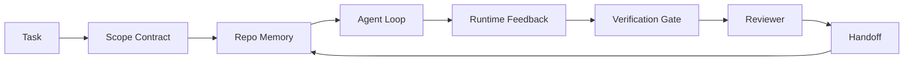

# 代理工作台工程：為什麼有能力的模型仍然會失敗

> 光有一個有能力的模型還不夠。可靠的代理需要一個工作台：指示、狀態、範圍、回饋、查證、審查與交接。把這些拿掉，就連前沿模型產出的東西都不安全到能出貨。

**類型：** 學習 + 建構
**程式語言：** Python (stdlib)
**先修單元：** 階段 14 · 01（代理迴圈）、階段 14 · 26（失敗模式）
**時間：** 約 45 分鐘

## 學習目標

- 把模型能力與執行可靠性分開。
- 說出決定一個代理出不出得了貨的那七個工作台表面。
- 在一項小型儲存庫任務上，比較只有提示詞的一趟與有工作台引導的一趟。
- 產出一份失敗模式報告，把每個缺掉的表面對映到它造成的症狀。

## 問題所在

你把一個前沿模型丟進一個真實儲存庫，要它加上輸入驗證。它開了四個檔案、寫了看起來合理的程式碼、宣告成功，然後停下。你跑測試。兩個失敗。第三個被動到的檔案跟驗證一點關係都沒有。沒有任何紀錄說明這個代理假設了什麼、先試了什麼，或還剩下什麼沒做。

模型對 Python 沒搞錯。它搞錯的是這件工作。它完全不知道什麼算做完、它可以往哪裡寫、哪些測試才算數，以及下一個工作階段該怎麼接手。

這不是模型的臭蟲。這是工作台的臭蟲。圍繞代理的那個表面，缺了那些把一次性生成變成可靠、可續作之工程的零件。

## 核心概念

工作台是在一項任務期間包住模型的那個運作環境。它有七個表面：

| 表面 | 它承載什麼 | 缺了它會怎樣 |
|---------|-----------------|----------------------|
| 指示 | 啟動規則、禁止的行動、完成的定義 | 代理自己猜什麼叫出貨 |
| 狀態 | 當前任務、動過的檔案、阻礙、下一步 | 每個工作階段都從零重啟 |
| 範圍 | 允許的檔案、禁止的檔案、驗收準則 | 編輯外溢到不相關的程式碼 |
| 回饋 | 被捕捉進迴圈的真實指令輸出 | 代理在 400 上宣告成功 |
| 查證 | 測試、lint、冒煙執行、範圍檢查 | 「看起來不錯」就進了 main |
| 審查 | 由另一種角色再走一遍 | 建造者自己批自己的作業 |
| 交接 | 改了什麼、為什麼、還剩什麼 | 下一個工作階段把一切重新發現一遍 |

工作台與模型無關。你可以換掉模型、保留這些表面。你不能換掉這些表面又保住可靠性。



這個迴圈是收在狀態檔上，不是收在聊天歷史上。聊天是易失的。儲存庫才是那份紀錄系統。

### 工作台相對於提示詞工程

提示詞告訴模型你這一輪想要什麼。工作台告訴模型要怎麼跨輪次、跨工作階段地做工作。多數代理失敗的故事，都是穿著提示詞工程外衣的工作台失敗。

### 工作台相對於框架

框架給你一個執行環境（LangGraph、AutoGen、Agents SDK）。工作台則在那個執行環境裡給代理一個工作的地方。兩者你都需要。這條小支線講的是後者。

### 從原語推理，而不是從廠商分類法推理

現在關於「harness engineering」的文章非常多。Addy Osmani、OpenAI、Anthropic、LangChain、Martin Fowler、MongoDB、HumanLayer、Augment Code、Thoughtworks、walkinglabs 的 awesome 清單，加上 Medium 與 Hacker News 上源源不絕的文章，全都在帶這個話題。他們對「harness 的邊界在哪」、「什麼算在範圍內」、「該用哪套詞彙」都意見不合。我們不需要選邊。那七個表面是一層 UX；每個工作台底下，都是同一組撐起任何可靠後端的分散式系統原語。

先把「代理」這個標籤撕掉一下。一趟代理執行，就是跨越時間、行程與機器的運算。要讓它可靠，你需要的原語跟任何生產系統一樣。

| 原語 | 它是什麼 | 它替代理承載什麼 |
|-----------|------------|------------------------------|
| 函數 | 具型別的處理器。盡可能純。擁有自己的輸入與輸出。 | 一次工具呼叫、一次規則檢查、一個查證步驟、一次模型調用 |
| Worker | 長命的行程，擁有一或多個函數與一份生命週期 | 建造者、審查者、查證者、一台 MCP 伺服器 |
| 觸發源 | 調用函數的事件來源 | 代理迴圈的 tick、HTTP 請求、佇列訊息、cron、檔案變更、掛鉤 |
| 執行環境 | 決定什麼在哪裡跑、用什麼逾時與資源的那條邊界 | Claude Code 的行程、LangGraph 的 runtime、一個 worker 容器 |
| HTTP／RPC | 呼叫者與 worker 之間的那條線 | 工具呼叫協定、MCP 請求、模型 API |
| 佇列 | 觸發源與 worker 之間的持久緩衝；背壓、重試、冪等 | 任務板、回饋日誌、審查收件匣 |
| 工作階段持久化 | 能撐過崩潰、重啟、換模型的狀態 | `agent_state.json`、檢查點、KV 儲存、儲存庫本身 |
| 授權政策 | 誰可以用什麼範圍呼叫哪個函數 | 允許／禁止的檔案、核准邊界、MCP 能力清單 |

現在把那七個工作台表面對映到這些原語上。

- **指示** —— 政策 + 函數中繼資料。規則就是檢查（函數）。那個路由器（`AGENTS.md`）是掛在執行環境啟動上的政策。
- **狀態** —— 工作階段持久化。一個執行環境每一步都會讀的鍵值儲存。檔案、KV 或 DB 都行；要緊的是持久化語意，不是儲存後端。
- **範圍** —— 逐任務的授權政策。允許／禁止的 glob 就是一份 ACL。需要核准的部分則是一組權限格。
- **回饋** —— 寫進佇列的調用日誌。每次 shell 呼叫都是一筆紀錄，持久、可重播。
- **查證** —— 一個函數。對輸入是決定性的。在任務關閉時被觸發。失敗時關閉。
- **審查** —— 一個獨立的 worker，對建造者的產物只有讀權限，對審查報告只有寫權限。
- **交接** —— 由工作階段結束觸發源發出的一筆持久紀錄。下一個工作階段的啟動觸發源會讀它。

代理迴圈本身就是一個 worker：它消費事件（使用者訊息、工具結果、計時器 tick）、呼叫函數（先是模型，再是模型挑的工具）、寫紀錄（狀態、回饋），並發出觸發（查證、審查、交接）。沒什麼神祕的；跟一個工作處理器的形狀一模一樣。

### 流通中的那些模式，翻譯成原語

每個流行的 harness 模式都可以化約成那八個原語。翻譯表如下。

| 廠商或社群的模式 | 它實際上是什麼 |
|------------------------------|--------------------|
| Ralph Loop（Claude Code、Codex、agentic_harness 這本書）—— 在代理想提早停下時，把原始意圖重新注入一個乾淨的脈絡視窗 | 一個把任務用乾淨脈絡重新入列的觸發源；工作階段持久化把目標帶向前 |
| Plan／Execute／Verify（PEV） | 三個 worker，一角色一個，透過狀態與階段之間的佇列通訊 |
| Harness-compute 分離（OpenAI Agents SDK，2026 年 4 月）—— 把控制平面與執行平面拆開 | 把控制平面／資料平面重講一次。這比「代理」這個標籤早了幾十年 |
| Open Agent Passport（OAP，2026 年 3 月）—— 每次工具呼叫在執行前都要對一份宣告式政策簽章並稽核 | 由一個前置行動 worker 強制執行的授權政策，配一條已簽章的稽核佇列 |
| Guides and Sensors（Birgitta Böckeler／Thoughtworks）—— 前饋規則 + 回饋可觀測性 | 授權政策 + 查證函數 + 可觀測性追蹤 |
| 漸進式壓實，五階段（Claude Code 逆向工程，2026 年 4 月） | 一個狀態管理 worker，像 cron 那樣跑過工作階段持久化，好讓它待在預算之內 |
| 掛鉤／中介層（LangChain、Claude Code）—— 攔截模型與工具呼叫 | 包在執行環境調用路徑周圍的觸發源 + 函數 |
| 以 Markdown 撰寫、帶漸進揭露的技能（Anthropic、Flue） | 一份函數註冊表，其中函數的中繼資料是即時載入脈絡的 |
| 沙箱代理（Codex、Sandcastle、Vercel Sandbox） | 那個運算平面：一個帶隔離檔案系統、網路與生命週期的執行環境 |
| MCP 伺服器 | 透過穩定 RPC 暴露函數的 worker，以能力清單作為授權 |

那張表裡的每一列，都是代理社群走到了一個在分散式系統裡早就有名字的原語，然後給它取了個新名字。當成行銷標籤有用；當成工程詞彙沒用。

### 那些收據實際上說了什麼

「harness 勝過模型」這個主張，現在背後是有數字的。值得知道，因為它們也是唯一誠實、能拿來反駁「等更聰明的模型就好」的論據。

- Terminal Bench 2.0 —— 同一個模型，光是換 harness 就把一個寫程式代理從前 30 名外推到第五名（LangChain，《Anatomy of an Agent Harness》）。
- Vercel —— 刪掉了代理 80% 的工具；成功率從 80% 跳到 100%（MongoDB）。
- Harvey —— 光靠 harness 最佳化，法律代理的準確率就翻了不只一倍（MongoDB）。
- 88% 的企業 AI 代理專案沒能進到生產。失敗集中在執行環境，不在推理（preprints.org，《Harness Engineering for Language Agents》，2026 年 3 月）。
- 2025 年一份橫跨三個熱門開源框架的基準研究回報約 50% 的任務完成率；長脈絡的 WebAgent 在長脈絡條件下從 40-50% 崩到 10% 以下，主要來自無窮迴圈與目標遺失（2026 年初被廣泛報導）。

該帶走的重點不是「harness 永遠贏」。模型確實會隨時間吸收掉 harness 的那些招數。該帶走的是：在今天，承重的工程是在模型周圍，不是在模型裡面，而承載那份重量的原語，正是每個生產系統一直以來都需要的那些。

### 廠商文章在哪裡沒講完

這一段你不需要客氣。

- LangChain 的《Anatomy of an Agent Harness》列了十一個組件 —— 提示詞、工具、掛鉤、沙箱、編排、記憶、技能、子代理，以及一個「笨迴圈」執行環境。它沒有點名佇列、把 worker 當成部署單位、觸發語意、把工作階段持久化當成獨立的關注點，或授權政策。它把 harness 當成一個你去設定的物件，而不是一套你去部署的系統。
- Addy Osmani 的《Agent Harness Engineering》立下了 `Agent = Model + Harness` 這個框架與棘輪模式，但沒有講到 harness 是由什麼組成的。它讀起來像一個立場，不是一份規格。
- Anthropic 與 OpenAI 在表面這件事上挖得最深，但都待在自己的執行環境裡。2026 年 4 月 Agents SDK 那則「harness-compute 分離」公告，是第一份明確認可控制平面／資料平面拆分的廠商文章。那是個原語式的構想，不是新構想。
- agentic_harness 這本書把 harness 當成一個設定物件（Jaymin West，《Agentic Engineering》第 6 章），而書裡最強的一句是「harness 是代理式系統中主要的安全邊界」。那就只是授權政策，重講一遍。
- Hacker News 的討論串一直走到同一個地方。2026 年 4 月那串《The agent harness belongs outside the sandbox》主張 harness 應該「更像一個坐在所有東西外面、依脈絡與使用者授權存取的 hypervisor」。這又一次，就是把授權政策當成獨立的平面。

你不需要不同意上述任何一篇，也看得出那個缺口。他們在替一套早就存在的系統寫 UX 描述。我們在寫那套系統。系統蓋對了，那七個表面就會從原語裡自然掉出來。蓋錯了，再怎麼把 `AGENTS.md` 磨亮，也補不上那條不存在的佇列。

所以當你在別處聽到「harness engineering」時，就翻譯回原語。提示詞與規則是政策與函數。鷹架是執行環境。護欄是授權 + 查證。掛鉤是觸發源。記憶是工作階段持久化。Ralph Loop 是重新入列。子代理是 worker。沙箱是運算平面。詞彙會變；工程不會。工作台是面向代理的 UX；而 harness，在能撐過下一次廠商重新包裝的那個意義上，就是函數、worker、觸發源、執行環境、佇列、持久化與政策，被正確地接在一起。

## 建構它

`code/main.py` 把一項很小的儲存庫任務跑兩次。第一次只有提示詞，第二次把那七個表面都接上。同一個模型、同一項任務。這支腳本會數出失敗那一趟缺了哪些表面，並印出一份失敗模式報告。

那項儲存庫任務刻意做得很小：替一支單檔的 FastAPI 式處理器加上輸入驗證，並寫一個會通過的測試。

跑它：

```
python3 code/main.py
```

輸出：兩趟執行的並排日誌、一份總結只有提示詞那一趟的 `failure_modes.json`，以及工作台那一趟的一行裁決。

那個代理是一個很小的規則式樁；重點在表面，不在模型。在這條小支線接下來的內容裡，你會把每個表面都重建成真正可重用的產物。

## 框架應用

工作台的表面早就在野地裡存在於三個地方，只是沒人這樣叫它們：

- **Claude Code、Codex、Cursor。** `AGENTS.md` 與 `CLAUDE.md` 是指示表面。斜線指令是範圍。掛鉤是查證。
- **LangGraph、OpenAI Agents SDK。** 檢查點與工作階段儲存是狀態表面。Handoff 是交接表面。
- **真實儲存庫上的 CI。** 測試、lint 與型別檢查是查證。PR 樣板是交接。CODEOWNERS 是審查。

工作台工程這門學問，就是把那些表面弄成明寫且可重用的，而不是留給每個團隊各自重新發現一遍。

## 產出交付

`outputs/skill-workbench-audit.md` 是一項可攜的技能，會稽核一個既有儲存庫的七個工作台表面，並回報哪些缺失、哪些只做了一半、哪些健康。把它丟到任何代理設定旁邊；它會告訴你該先修什麼。

## 練習

1. 挑一個你已經在上面跑代理的儲存庫。替那七個表面從 0（缺失）到 2（健康）評分。你最弱的表面是哪一個？
2. 擴充 `main.py`，讓只有提示詞那一趟也產出一則假的「成功」宣稱。驗證查證閘門本來會抓到它。
3. 替你自己的產品加上第八個表面。論證它為何不會塌縮進既有那七個之一。
4. 換一個會幻覺出多寫一個檔案的樁代理，再跑一次腳本。哪個表面最先抓到它？
5. 把階段 14 · 26 那五種業界反覆出現的失敗模式對映到七個表面上。每個表面是設計來吸收哪一種模式的？

## 關鍵術語

| 術語 | 大家怎麼說 | 實際是什麼意思 |
|------|----------------|------------------------|
| 工作台 | 「那套設定」 | 圍繞模型、讓工作變可靠的那些被工程化的表面 |
| 表面 | 「一份文件」或「一支腳本」 | 一個具名、機器可讀、代理每輪都會讀或寫的輸入 |
| 紀錄系統 | 「那些筆記」 | 當聊天歷史消失時，代理當成真相的那個檔案 |
| 完成的定義 | 「驗收」 | 一份客觀、有檔案支撐、代理造不了假的檢查清單 |
| 工作台稽核 | 「儲存庫就緒度檢查」 | 在工作開始前走過七個表面、標出缺件的一趟檢查 |

## 延伸閱讀

把這些當成資料點，不要當成權威。每一份都是一套局部的分類法。在決定要不要採用之前，先把每個概念翻譯回原語（函數、worker、觸發源、執行環境、HTTP/RPC、佇列、持久化、政策）。

廠商的框架：

- [Addy Osmani, Agent Harness Engineering](https://addyosmani.com/blog/agent-harness-engineering/) —— `Agent = Model + Harness` 與棘輪模式；基礎設施著墨很薄
- [LangChain, The Anatomy of an Agent Harness](https://blog.langchain.com/the-anatomy-of-an-agent-harness/) —— 十一個組件：提示詞、工具、掛鉤、編排、沙箱、記憶、技能、子代理、執行環境；略過佇列、部署、授權
- [OpenAI, Harness engineering: leveraging Codex in an agent-first world](https://openai.com/index/harness-engineering/) —— Codex 團隊對他們自家執行環境周邊表面的看法
- [OpenAI, Unrolling the Codex agent loop](https://openai.com/index/unrolling-the-codex-agent-loop/) —— 把代理迴圈化約成對函數呼叫的一個 `while`
- [Anthropic, Effective harnesses for long-running agents](https://www.anthropic.com/engineering/effective-harnesses-for-long-running-agents) —— 特定執行環境內的長時程表面
- [Anthropic, Harness design for long-running application development](https://www.anthropic.com/engineering/harness-design-long-running-apps) —— 應用型的設計筆記
- [LangChain Deep Agents harness capabilities](https://docs.langchain.com/oss/python/deepagents/harness) —— 執行環境的設定表面

有可用細節的實務文章：

- [Martin Fowler / Birgitta Böckeler, Harness engineering for coding agent users](https://martinfowler.com/articles/harness-engineering.html) —— guides（前饋）+ sensors（回饋）；最乾淨的控制論框架
- [HumanLayer, Skill Issue: Harness Engineering for Coding Agents](https://www.humanlayer.dev/blog/skill-issue-harness-engineering-for-coding-agents) —— 「這不是模型問題，是設定問題」
- [MongoDB, The Agent Harness: Why the LLM Is the Smallest Part of Your Agent System](https://www.mongodb.com/company/blog/technical/agent-harness-why-llm-is-smallest-part-of-your-agent-system) —— 收據：Vercel 80% 到 100%、Harvey 準確率兩倍、Terminal Bench 前 30 到前 5
- [Augment Code, Harness Engineering for AI Coding Agents](https://www.augmentcode.com/guides/harness-engineering-ai-coding-agents) —— 以限制為先的走訪
- [Sequoia podcast, Harrison Chase on Context Engineering Long-Horizon Agents](https://sequoiacap.com/podcast/context-engineering-our-way-to-long-horizon-agents-langchains-harrison-chase/) —— 執行環境的關注勝過模型的關注

書、論文與參考實作：

- [Jaymin West, Agentic Engineering — Chapter 6: Harnesses](https://www.jayminwest.com/agentic-engineering-book/6-harnesses) —— 書本長度的處理，把 harness 當成主要的安全邊界
- [preprints.org, Harness Engineering for Language Agents (March 2026)](https://www.preprints.org/manuscript/202603.1756) —— 以控制／能動性／執行環境切入的學術框架
- [walkinglabs/awesome-harness-engineering](https://github.com/walkinglabs/awesome-harness-engineering) —— 橫跨脈絡、評測、可觀測性、編排的策展閱讀清單
- [ai-boost/awesome-harness-engineering](https://github.com/ai-boost/awesome-harness-engineering) —— 另一份策展清單（工具、評測、記憶、MCP、權限）
- [andrewgarst/agentic_harness](https://github.com/andrewgarst/agentic_harness) —— 生產就緒的參考實作，帶 Redis 支撐的記憶與評測套組
- [HKUDS/OpenHarness](https://github.com/HKUDS/OpenHarness) —— 內建個人代理的開放式 agent harness

值得為了那些歧異（而不是為了共識）去讀的 Hacker News 討論串：

- [HN: Effective harnesses for long-running agents](https://news.ycombinator.com/item?id=46081704)
- [HN: Improving 15 LLMs at Coding in One Afternoon. Only the Harness Changed](https://news.ycombinator.com/item?id=46988596)
- [HN: The agent harness belongs outside the sandbox](https://news.ycombinator.com/item?id=47990675) —— 主張把授權當成獨立的平面

本課程內部的交叉參照：

- 階段 14 · 23 —— OpenTelemetry GenAI 慣例：sensors 那一派文獻指向的那層可觀測性
- 階段 14 · 26 —— 那七個表面所要吸收的失敗模式目錄
- 階段 14 · 27 —— 坐在授權政策這個原語上的提示詞注入防禦
- 階段 14 · 29 —— 生產執行環境（佇列、事件、cron）：本課這些原語在部署時住的地方
