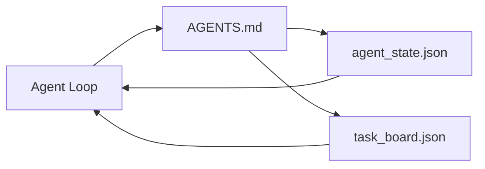

# 最小的代理工作台

> 最小可用的工作台是三個檔案：一個根目錄的指示路由器、一個狀態檔，以及一塊任務板。其他一切都是疊在這之上。如果一個儲存庫連這三樣都撐不起來，沒有哪個模型救得了它。

**類型：** 建構
**程式語言：** Python (stdlib)
**先修單元：** 階段 14 · 31（為什麼有能力的模型仍然會失敗）
**時間：** 約 45 分鐘

## 學習目標

- 定義構成最小可行工作台的那三個檔案。
- 解釋為何一份簡短的根路由器勝過一份又臭又長的單體 `AGENTS.md`。
- 做一個代理每輪都讀得到、結束時會寫回去的狀態檔。
- 做一塊任務板，讓多工作階段的工作在沒有聊天歷史時也活得下去。

## 問題所在

多數團隊搞工作台的方式，是寫一份 3000 行的 `AGENTS.md` 然後宣告完成。模型把它載進來、忽略那些它總結不了的部分，然後仍然在它一直以來失敗的那些表面上失敗。

你需要的是相反的東西。一個很小的根檔案，只在相關時才把代理路由進更深的檔案。一份持久的狀態，代理行動前讀它、行動後寫它。一塊任務板，說明什麼正在飛、什麼被卡住、下一個是什麼。

三個檔案。每個都有自己的職責。每個都機器可讀到足以在日後長成一套真正的系統。

## 核心概念



### AGENTS.md 是路由器，不是使用手冊

好的 `AGENTS.md` 很短。它把代理指向：

- 狀態檔（你在哪裡）。
- 任務板（還剩什麼）。
- 更深的規則（在 `docs/agent-rules.md` 底下）。
- 查證指令（怎麼知道它能動）。

更長的東西一律放進更深的文件，只在需要時才載入。長手冊會被忽略。短路由器會被遵守。

### agent_state.json 是那份紀錄系統

狀態承載：當前任務 id、動過的檔案、做過的假設、阻礙，以及下一步行動。代理每一輪都讀它。下一個工作階段讀它，而不是把聊天重播一遍。

狀態住在檔案裡，因為聊天歷史不可靠。工作階段會死。對話會被裁掉。檔案不會。

### task_board.json 是那條佇列

任務板承載每一項任務，狀態為 `todo | in_progress | done | blocked`。當狀態是空的時候，它就是代理去拉工作的那條佇列；而當你想知道代理有沒有走在正軌上時，它就是你會去讀的那條佇列。

板上一項任務有 id、目標、負責人（`builder`、`reviewer` 或 `human`），以及驗收準則。這塊板刻意做得小：當它長到超過一個螢幕，你有的是規劃問題，不是板子問題。

### 三個檔案是地板，不是天花板

後面的課會加上範圍契約、回饋執行器、查證閘門、審查者檢查清單與交接封包。這裡這三個檔案，是它們全都假定存在的東西。

## 建構它

`code/main.py` 會把最小工作台寫進一個空儲存庫，並示範單一輪代理動作：

1. 讀 `agent_state.json`。
2. 若狀態是空的，就從 `task_board.json` 拉下一項任務。
3. 動一個範圍之內的檔案。
4. 把更新後的狀態寫回去。

跑它：

```
python3 code/main.py
```

這支腳本會在自己旁邊建一個 `workdir/`、放下那三個檔案、跑一輪，然後印出 diff。再跑一次，看第二輪怎麼從第一輪停下的地方接下去。

## 框架應用

在生產級的代理產品裡，同樣這三個檔案以不同名字出現：

- **Claude Code：** 路由器是 `AGENTS.md` 或 `CLAUDE.md`，狀態是 `.claude/state.json` 這類儲存，板子則是掛鉤。
- **Codex／Cursor：** 路由器是工作區規則，狀態是工作階段記憶，板子是聊天側欄裡排隊的任務。
- **自製 Python 代理：** 就是你剛剛寫的那些檔案。

名字會變。形狀不會。

## 野地裡的生產模式

當上面疊了三種模式時，這個最小工作台就撐得住跟真實 monorepo 的接觸。它們彼此獨立；挑你的儲存庫真的需要的那些。

**巢狀 `AGENTS.md`，就近者勝。** OpenAI 在自家主儲存庫裡放了 88 個 `AGENTS.md`，一個子組件一個。Codex、Cursor、Claude Code 與 Copilot 全都會從當前檔案往儲存庫根目錄走，並把路上找到的每一個 `AGENTS.md` 串接起來。子目錄的檔案是在擴充根檔案。Codex 加了 `AGENTS.override.md` 來取代而非擴充；這個覆寫機制是 Codex 專屬的，做跨工具的工作時要避開。Augment Code 量到的那句話才是重點：最好的 `AGENTS.md` 帶來的品質躍升，相當於從 Haiku 升級到 Opus；最糟的那些，則讓輸出比完全沒有這個檔案還差。

**該拒絕的反模式，就算它們看起來像覆蓋率也一樣。** 相互衝突的指示會無聲地把代理從互動模式掉進貪婪模式（ICLR 2026 AMBIG-SWE：解決率 48.8% → 28%）；替優先順序編號，不要把它們平鋪堆疊。無法查證的風格規則（「遵循 Google Python Style Guide」）若沒有配上強制執行的指令，就等於讓代理自己發明何謂合規；每條風格規則都要配上確切的 lint 指令。以風格開場而不是以指令開場，會把查證路徑埋起來；指令先行，風格殿後。替人類而不是替代理寫，會浪費脈絡預算；簡潔是一項功能。

**跨工具的符號連結。** 單一根檔案配上符號連結（`ln -s AGENTS.md CLAUDE.md`、`ln -s AGENTS.md .github/copilot-instructions.md`、`ln -s AGENTS.md .cursorrules`），能讓每個寫程式代理都對著同一份真值來源。Nx 的 `nx ai-setup` 從單一設定檔把這件事自動化到 Claude Code、Cursor、Copilot、Gemini、Codex 與 OpenCode 上。

## 產出交付

`outputs/skill-minimal-workbench.md` 會替任何新儲存庫產出那個三檔工作台：一份為該專案調校過的 `AGENTS.md` 路由器、一個帶正確鍵的 `agent_state.json`，以及一個以當前待辦清單播種好的 `task_board.json`。

## 練習

1. 替 `agent_state.json` 加一個 `last_run` 時間戳。若檔案超過 24 小時未更新，除非維運者確認，否則拒絕執行。
2. 替任務板加一個 `priority` 欄位，並改掉拉取器，讓它永遠挑優先度最高的 `todo`。
3. 把 `task_board.json` 遷移成 JSON Lines，讓每項任務一行，版本控制裡的 diff 才乾淨。
4. 寫一支 `lint_workbench.py`，若 `AGENTS.md` 超過 80 行，或參照了不存在的檔案，就讓它失敗。
5. 決定三個檔案中弄丟哪一個最痛。替你的答案辯護。

## 關鍵術語

| 術語 | 大家怎麼說 | 實際是什麼意思 |
|------|----------------|------------------------|
| 路由器 | `AGENTS.md` | 把代理指向更深文件與檔案的簡短根檔案 |
| 狀態檔 | 「那些筆記」 | 機器可讀、每輪都會寫的「代理身在何處」紀錄 |
| 任務板 | 「待辦清單」 | 帶狀態、負責人、驗收準則的 JSON 工作佇列 |
| 紀錄系統 | 「真值來源」 | 聊天消失時，工作台當成權威的那個檔案 |

## 延伸閱讀

- [agents.md — the open spec](https://agents.md/) —— 已被 Cursor、Codex、Claude Code、Copilot、Gemini、OpenCode 採用
- [Augment Code, A good AGENTS.md is a model upgrade. A bad one is worse than no docs at all](https://www.augmentcode.com/blog/how-to-write-good-agents-dot-md-files) —— 量過的品質躍升
- [Blake Crosley, AGENTS.md Patterns: What Actually Changes Agent Behavior](https://blakecrosley.com/blog/agents-md-patterns) —— 經驗上什麼有效、什麼無效
- [Datadog Frontend, Steering AI Agents in Monorepos with AGENTS.md](https://dev.to/datadog-frontend-dev/steering-ai-agents-in-monorepos-with-agentsmd-13g0) —— 實務中的巢狀優先順序
- [Nx Blog, Teach Your AI Agent How to Work in a Monorepo](https://nx.dev/blog/nx-ai-agent-skills) —— 從單一來源產生給六種工具用的設定
- [The Prompt Shelf, AGENTS.md Best Practices: Structure, Scope, and Real Examples](https://thepromptshelf.dev/blog/agents-md-best-practices/) —— 撐得過審查的章節排序
- [Anthropic, Claude Code subagents](https://code.claude.com/docs/en/sub-agents)
- 階段 14 · 31 —— 這個最小組合所吸收的那些失敗模式
- 階段 14 · 34 —— 本課預告的那套持久狀態 schema
