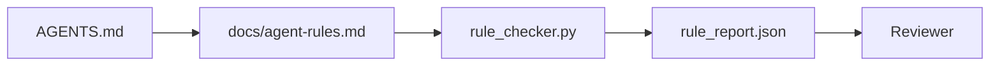

# 把代理指示寫成可執行的限制

> 用散文寫的指示是願望。用限制寫的指示是測試。工作台把每一條規則變成代理能在執行期檢查、審查者能在事後查證的東西。

**類型：** 建構
**程式語言：** Python (stdlib)
**先修單元：** 階段 14 · 32（最小工作台）
**時間：** 約 50 分鐘

## 學習目標

- 把路由用的散文與操作型規則分開。
- 把啟動規則、禁止行動、完成的定義、不確定性處理與核准邊界，表達成機器可檢核的限制。
- 實作一個規則檢查器，替一趟執行對照規則集評分。
- 讓規則集對 diff 友善，好讓審查看得出改了什麼。

## 問題所在

典型的 `AGENTS.md` 讀起來像新人上手文件。它告訴代理要「小心」、要「徹底測試」、「不確定就問」。三天後，代理出貨了一份沒有測試的變更、寫進了一個被禁止的目錄，而且從沒問過，因為它根本不知道那條線在哪。

指示在操作化時很有力，在流於理想時很無力。修法是把規則寫成工作台能解讀、審查者能評分的形式。

## 核心概念

規則屬於 `docs/agent-rules.md`，離那份簡短的根路由器遠一點。每條規則有名稱、類別與一個檢查。



### 涵蓋多數規則的五個類別

| 類別 | 這條規則回答的問題 | 例子 |
|----------|---------------------------|---------|
| 啟動 | 工作開始前什麼必須為真？ | 「狀態檔存在且是新鮮的」 |
| 禁止 | 什麼絕不能發生？ | 「不要編輯 `scripts/release.sh`」 |
| 完成的定義 | 什麼可以證明任務完成了？ | 「pytest 以 0 結束，且驗收那行通過」 |
| 不確定性 | 代理不確定時要做什麼？ | 「開一則提問筆記，不要用猜的」 |
| 核准 | 什麼需要人工核准？ | 「任何新相依、任何對生產環境的寫入」 |

一條塞不進這五類的規則，通常其實想當兩條規則。就逼它拆開。

### 規則是機器可讀的

每條規則有一個 slug、一個類別、一行描述，以及一個 `check` 欄位，指名 `rule_checker.py` 裡的某個函數。加一條規則就意味著加一個檢查；檢查器隨工作台一起長大。

### 規則對 diff 友善

規則住在單一份 markdown 檔裡，一條一個標題。改名在 diff 裡看得見。新規則放在它所屬類別的最上面。過期規則要刪掉，不要註解掉，因為工作台才是真值來源，而不是團隊上一季心情如何的聊天記錄。

### 規則相對於框架護欄

框架護欄（OpenAI Agents SDK 的 guardrails、LangGraph 的 interrupt）在執行環境層級強制執行規則。本課的規則集是那些護欄所實作的、人類可讀且可審查的契約。兩者你都需要：執行環境在一輪之中攔下違規，規則集則證明執行環境做的是對的事。

### 漸進揭露：一張地圖，不是一部百科全書

`AGENTS.md` 之所以一直長大，是因為每次事故都加一條規則，卻沒有任何一次事故拿掉一條。一年後，這個檔案有兩千行，而代理讀完第一個螢幕、注意力預算就用完了，最後只依照它被告知內容的一小部分行動。一份巨大的指示檔失敗的原因，跟一份四十頁的新人上手文件失敗的原因一樣：讀者掃過一次，之後再也沒回到真正重要的那一段。

修法不是弄一份更短的檔案，而是弄一份分層的。根路由器要小到每個工作階段都讀得完，而且裡面除了指標什麼都不放。深度住在主題檔裡，只有當任務碰到它們時代理才載入。給代理一張地圖，不要給整部百科全書，讓它自己走到需要的那一頁。

```
AGENTS.md                  # router, < 50 lines: what this repo is, where to look, the 5 hard rules
docs/
  agent-rules.md           # the full rule set (this lesson)
  architecture.md          # loaded when the task touches module boundaries
  testing.md               # loaded when the task writes or runs tests
  deploy.md                # loaded only for release work, gated behind an approval rule
feature_list.json          # the backlog (Phase 14 · 36)
```

| 層 | 住在 | 何時讀 | 大小預算 |
|------|----------|-----------|-------------|
| 路由器 | `AGENTS.md` | 每個工作階段，一律讀 | 約 50 行以內 |
| 規則 | `docs/agent-rules.md` | 每個工作階段，啟動時 | 每個類別一個螢幕 |
| 主題文件 | `docs/<topic>.md` | 只有任務碰到該主題時 | 要多深就多深 |

有兩項測試讓這套分層保持誠實。可達性測試：代理從路由器出發，最多兩跳就該搆到任何一條規則，所以路由器必須用路徑連到每一份主題文件，而不是用散文描述它。新鮮度測試：路由器要短到審查者每個 PR 都會重讀一遍，那是唯一能阻止它悄悄長回它所取代的那部百科全書的東西。一個已經解析不到的指標，比一條缺失的規則更糟，所以路由器裡的死連結本身就是一次啟動檢查違規。

```figure
wb-rule-checkoff
```

## 建構它

`code/main.py` 出貨：

- 一個把規則載入 dataclass 的 `agent-rules.md` 解析器。
- `rule_checker.py` 風格的檢查函數，一個對應一個 `check` 參照。
- 一趟示範代理執行，會違反兩條規則，以及一趟把它們抓出來的檢查。

跑它：

```
python3 code/main.py
```

輸出：解析後的規則集、執行軌跡、逐規則的通過／失敗，以及一份存在腳本旁邊的 `rule_report.json`。

## 野地裡的生產模式

有三種模式，區分了一套能撐一季的規則集，跟一套一週就腐爛的規則集。

**在撰寫時就標嚴重度。** 每條規則帶一個 `severity`：`block`、`warn` 或 `info`。檢查器三種都報；執行環境只在 `block` 上拒絕。多數團隊一開始會把嚴重度講得太重，然後在死線壓力下悄悄放水；在撰寫時就標記，能逼團隊在一開始就把校準做好。搭配查證閘門（階段 14 · 38），任何對 `block` 規則的覆寫都會被簽章進一份 `overrides.jsonl` 稽核日誌。

**用規則到期日當作逼迫機制。** 每條規則帶一個 `expires_at` 日期（預設從撰寫起算 90 天）。當一條未到期的規則連續 60 天零違規時，檢查器就發出警告；下一次季度審查要嘛替它辯護而保留、要嘛把它降級成 `info`、要嘛刪掉。Cloudflare 的生產 AI Code Review 資料（2026 年 4 月，30 天內橫跨 5,169 個儲存庫的 131,246 次審查執行）顯示：有明確到期日的規則集，每個儲存庫維持在 30 條以下；沒有的則長到 80 條以上，而且多數從沒觸發過。

**Markdown 當來源，JSON 當快取。** `agent-rules.md` 是被撰寫的檔案；`agent-rules.lock.json` 是檢查器在熱路徑上讀的快取。那個 lock 由 pre-commit 掛鉤重新產生。Markdown 的 diff 可審查；JSON 解析則不必出現在每一輪裡。跟 `package.json`／`package-lock.json` 與 `Cargo.toml`／`Cargo.lock` 是同一種形狀。

## 框架應用

在生產環境中：

- Claude Code、Codex、Cursor 在工作階段開始時讀規則，並在拒絕行動時引用它們。檢查器在 CI 裡重跑它們，以抓出無聲的漂移。
- OpenAI Agents SDK 的 guardrails 把同一批檢查註冊成輸入與輸出護欄。markdown 是文件表面；SDK 是執行環境表面。
- 當進行中的節點違反某條規則時，LangGraph 的 interrupt 會觸發。中斷處理器讀那條規則、去問人，然後續跑。

這套規則集在三者之間都可攜，因為它就只是 markdown 加函數名稱。

## 產出交付

`outputs/skill-rule-set-builder.md` 會訪談專案負責人，把他們既有的散文指示分類到那五個類別，並產出一份有版本的 `agent-rules.md` 加一個檢查器的樁。

## 練習

1. 若你的產品真的需要，就加上第六個類別。論證它為何不會塌縮進那五個之一。
2. 擴充檢查器，讓一條規則可以帶嚴重度（`block`、`warn`、`info`），並讓報告依此彙總。
3. 把檢查器接進 CI：若最近一趟代理執行有 block 等級的規則失敗，就讓建置失敗。
4. 替每條規則加一個「到期」欄位。90 天沒有任何一次檢查失敗，這條規則就該被審視。
5. 找一份真實的 `AGENTS.md`，把它改寫成五類規則。它有多少行是操作型的？多少行是理想型的？

## 關鍵術語

| 術語 | 大家怎麼說 | 實際是什麼意思 |
|------|----------------|------------------------|
| 操作型規則 | 「一條真的指示」 | 工作台能在執行期檢查的規則 |
| 理想型規則 | 「小心一點」 | 沒有檢查的規則；不是刪掉就是升級它 |
| 完成的定義 | 「驗收」 | 客觀、有檔案支撐、能證明任務完成的東西 |
| Block 嚴重度 | 「硬規則」 | 違反就中止執行；沒有維運者就無法靜音 |
| 規則到期 | 「過期規則清掃」 | N 天內沒有任何失敗的規則就該退休 |

## 延伸閱讀

- [OpenAI Agents SDK guardrails](https://openai.github.io/openai-agents-python/guardrails/)
- [LangGraph interrupts](https://langchain-ai.github.io/langgraph/how-tos/human_in_the_loop/breakpoints/)
- [Anthropic, Building Effective Agents](https://www.anthropic.com/research/building-effective-agents)
- [Rick Hightower, Agent RuleZ: A Deterministic Policy Engine](https://medium.com/@richardhightower/agent-rulez-a-deterministic-policy-engine-for-ai-coding-agents-9489e0561edf) —— 生產環境中的 block/warn/info 嚴重度
- [Cloudflare, Orchestrating AI Code Review at Scale](https://blog.cloudflare.com/ai-code-review/) —— 13.1 萬次審查執行、規則組成的教訓
- [microservices.io, GenAI development platform — part 1: guardrails](https://microservices.io/post/architecture/2026/03/09/genai-development-platform-part-1-development-guardrails.html) —— 規則與 CI 之間的縱深防禦
- [Type-Checked Compliance: Deterministic Guardrails (arXiv 2604.01483)](https://arxiv.org/pdf/2604.01483) —— 以 Lean 4 作為「規則即檢查」的上限
- [logi-cmd/agent-guardrails](https://github.com/logi-cmd/agent-guardrails) —— 合併閘門實作：範圍、突變測試、違規預算
- 階段 14 · 32 —— 這套規則集要放進去的那個最小工作台
- 階段 14 · 38 —— 消費這份規則報告的查證閘門
- 階段 14 · 39 —— 替規則遵循度評分的審查者代理
