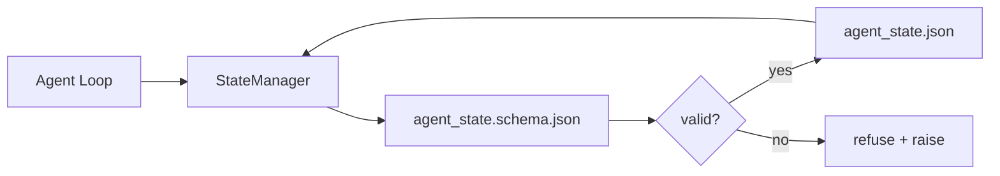

# 儲存庫記憶與持久狀態

> 聊天歷史是易失的。儲存庫是持久的。工作台把代理狀態存在有版本控管的檔案裡，好讓下一個工作階段、下一個代理與下一位審查者，都讀同一份真值來源。

**類型：** 建構
**程式語言：** Python (stdlib + `jsonschema` optional)
**先修單元：** 階段 14 · 32（最小工作台）
**時間：** 約 60 分鐘

## 學習目標

- 定義什麼該進儲存庫記憶、什麼該留在聊天歷史。
- 替 `agent_state.json` 與 `task_board.json` 撰寫 JSON Schema。
- 做一個狀態管理器，能原子性地載入、驗證、變更與持久化狀態。
- 用 schema 在壞的寫入腐蝕工作台之前就拒絕它。

## 問題所在

代理跑完一個工作階段。聊天關閉。下一個工作階段開起來，問說該從哪開始。模型說「讓我看看檔案」，讀了過期的筆記，然後把早就完成的工作重做一遍。或者更糟，它把一個已經完成的檔案重寫了，因為沒人告訴它那個檔案已經完成。

工作台的修法是儲存庫記憶：狀態住在儲存庫裡的 JSON 檔中，依 schema 寫入、原子性地持久化、在程式碼審查裡對 diff 友善。聊天是一條短暫的資訊流；儲存庫才是那份紀錄系統。

## 核心概念



### 什麼該進儲存庫記憶

| 該進去 | 不該進去 |
|---------|-----------------|
| 當前任務 id | 生的聊天逐字稿 |
| 本工作階段動過的檔案 | 詞元層級的推理軌跡 |
| 代理做過的假設 | 「使用者看起來很不爽」 |
| 未解的阻礙 | 取樣出來的補全 |
| 下一步行動 | 廠商專屬的模型 id |

判準是持久性：三個月後在一次 CI 重跑裡，這東西還有用嗎？有用就進儲存庫。沒用就進遙測。

### Schema 先行的狀態

JSON Schema 就是那份契約。沒有它，每個代理都發明新欄位、每位審查者都得學一種新形狀、每支 CI 腳本都得替過去的版本開特例。有了它，壞的寫入就是被拒絕的寫入。

Schema 涵蓋：

- 必要的鍵。
- 允許的 `status` 值。
- 禁止的值（例如陣列不得為 `null`）。
- 樣式限制（任務 id 要符合 `T-\d{3,}`）。
- 供遷移用的版本欄位。

### 原子性寫入

狀態寫入必須撐得過部分失敗：寫到暫存檔、fsync、再改名蓋過目標。狀態檔是真值來源；一個寫到一半的狀態檔，比完全沒有檔案更糟。

### 遷移

當 schema 改變時，要在 schema 版本進位的旁邊出貨一支遷移腳本。狀態檔帶一個 `schema_version` 欄位；管理器對於它無法遷移的版本，一律拒絕載入。

```figure
wb-state-persist
```

## 建構它

`code/main.py` 實作了：

- `agent_state.schema.json` 與 `task_board.schema.json`。
- 一個只用 stdlib 的驗證器（JSON Schema 的子集：required、type、enum、pattern、items）。
- `StateManager.load`、`StateManager.update`、`StateManager.commit`，配上「暫存檔加改名」的原子性寫入。
- 一個示範：變更狀態、持久化、重新載入，並證明這趟往返成立。

跑它：

```
python3 code/main.py
```

這支腳本會寫出 `workdir/agent_state.json` 與 `workdir/task_board.json`，跨兩輪變更它們，並在每一步印出通過驗證的狀態。

## 野地裡的生產模式

有四種模式，把這一課的最小版本變成一個多代理 monorepo 撐得住的東西。

**「暫存檔加改名」的原子性不是選配。** 2026 年 3 月一份 Hive 專案的臭蟲回報把這個失敗模式記錄得很乾淨：`state.json` 是用 `write_text()` 寫的，而例外被接住並靜音掉了。部分寫入讓工作階段在腐爛的狀態上續跑，卻沒有任何訊號。修法永遠是：在目標的同一個目錄裡用 `tempfile.mkstemp`、寫入、`fsync`、`os.replace`（在 POSIX 與 Windows 上都是原子性改名）。本課的 `atomic_write` 做的正是這件事。

**替每一次非冪等的工具呼叫加上冪等鍵。** 若代理在呼叫工具之後、把結果存成檢查點之前崩潰，復原時就會重試那次工具呼叫。對讀取來說安全；對寄信、DB 插入、檔案上傳來說危險。做法是：在執行之前，把每一次工具呼叫的 ID 記進一份 `pending_calls.jsonl`。重試時檢查那個 ID；若已存在，就跳過該呼叫並使用快取的結果。Anthropic 與 LangChain 在 2026 年的指引裡都點名了這件事；LangGraph 的 checkpointer 會持久化待處理寫入，正是同一個理由。

**把大型產物與狀態分開。** 別把 CSV、長逐字稿或產生出來的檔案存進 `agent_state.json`。把產物存成獨立檔案（或上傳到物件儲存），狀態裡只留路徑。檢查點才會維持又小又快；產物則獨立地長大。

**用事件溯源做稽核，用快照做續跑。** 每次變更都往事件日誌（`state.events.jsonl`）附加；並定期快照到 `state.json`。續跑時先讀快照，再重播快照時間戳之後的事件。這會多花磁碟，但讓你能一字不差地重播代理的決策 —— 在替長時程執行除錯時不可或缺。跟 Postgres 內部用 WAL 是同一種形狀。

**要嘛做 schema 遷移，要嘛拒絕載入。** `schema_version` 這個整數就是那份契約。當管理器載入到一個未知版本的檔案時，它拒絕讀取。在 schema 版本進位旁邊出貨一支遷移腳本；`tools/migrate_state.py` 每次啟動都冪等地跑一次。

## 框架應用

在生產環境中：

- **LangGraph 的 checkpointer。** 同樣的構想，不同的儲存。checkpointer 把圖狀態持久化到 SQLite、Postgres 或自訂後端。這一課教的 schema，就是當 checkpointer 掛掉、你得手動去讀狀態時會伸手拿的東西。
- **Letta 的記憶區塊。** 帶結構化 schema 的持久區塊（階段 14 · 08）。同樣的紀律，範圍限定在長命的人格上。
- **OpenAI Agents SDK 的 session store。** 後端可插拔、知道 schema。這一課的狀態檔就是那個本地檔案後端。

## 產出交付

`outputs/skill-state-schema.md` 會產出一組專案專屬的 JSON Schema（狀態 + 板子）、一個接好原子性寫入的 Python `StateManager`，以及一份遷移鷹架，好讓下一次 schema 進位不會弄壞工作台。

## 練習

1. 加一個 `last_human_touch` 時間戳。在人類編輯後五秒內，拒絕任何代理寫入。
2. 擴充驗證器以支援 `oneOf`，讓一項任務可以是建置任務或審查任務，各有不同的必要欄位。
3. 加一個 `schema_version` 欄位，並寫出從 v1 到 v2 的遷移（把 `blockers` 改名為 `risks`）。
4. 把儲存後端從本地檔案搬到 SQLite。保持 `StateManager` 的 API 完全不變。
5. 讓兩個代理對同一個狀態檔跑，中間隔 50 毫秒製造寫入競賽。什麼會出錯，而原子性改名又怎麼救你？

## 關鍵術語

| 術語 | 大家怎麼說 | 實際是什麼意思 |
|------|----------------|------------------------|
| 儲存庫記憶 | 「筆記檔」 | 存在儲存庫已追蹤檔案中、受 schema 約束的狀態 |
| Schema 先行 | 「驗證輸入」 | 在寫入者之前先定義契約，拒絕漂移 |
| 原子性寫入 | 「改個名就好」 | 寫暫存、fsync、改名，讓部分失敗腐蝕不了資料 |
| 遷移 | 「Schema 進位」 | 把 vN 狀態變成 v(N+1) 狀態的腳本 |
| 紀錄系統 | 「真值來源」 | 工作台當成權威的那份產物 |

## 延伸閱讀

- [JSON Schema specification](https://json-schema.org/specification.html)
- [LangGraph checkpointers](https://langchain-ai.github.io/langgraph/concepts/persistence/)
- [Letta memory blocks](https://docs.letta.com/concepts/memory)
- [Fast.io, AI Agent State Checkpointing: A Practical Guide](https://fast.io/resources/ai-agent-state-checkpointing/) —— schema 先行的檢查點與冪等性
- [Fast.io, AI Agent Workflow State Persistence: Best Practices 2026](https://fast.io/resources/ai-agent-workflow-state-persistence/) —— 併發控制、TTL、事件溯源
- [Hive Issue #6263 — non-atomic state.json writes silently ignored](https://github.com/aden-hive/hive/issues/6263) —— 真實專案裡的那個失敗模式
- [eunomia, Checkpoint/Restore Systems: Evolution, Techniques, Applications](https://eunomia.dev/blog/2025/05/11/checkpointrestore-systems-evolution-techniques-and-applications-in-ai-agents/) —— 把作業系統史上的 CR 原語套用到代理上
- [Indium, 7 State Persistence Strategies for Long-Running AI Agents in 2026](https://www.indium.tech/blog/7-state-persistence-strategies-ai-agents-2026/)
- [Microsoft Agent Framework, Compaction](https://learn.microsoft.com/en-us/agent-framework/agents/conversations/compaction) —— 廠商的檢查點管理器
- 階段 14 · 08 —— 記憶區塊與 sleep-time compute
- 階段 14 · 32 —— 這一課替它做出 schema 的那個三檔最小組合
- 階段 14 · 40 —— 從同一套 schema 讀取的交接封包
