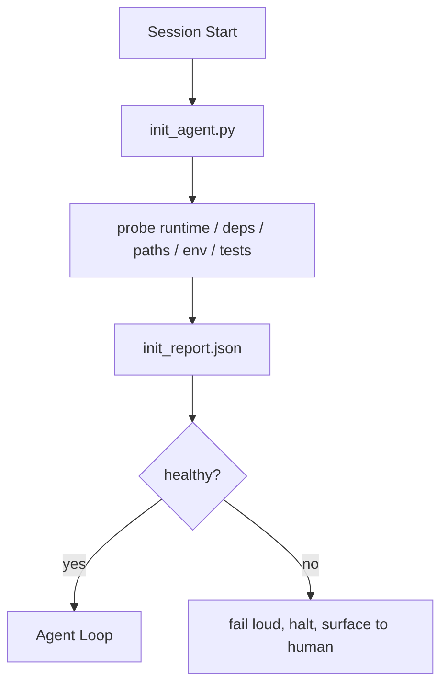

# 給代理的初始化腳本

> 每個從冷啟動開始的工作階段都在繳稅。代理讀同樣的檔案、重試同樣的探測、重新發現同樣的路徑。初始化腳本只繳一次稅，然後把答案寫進狀態。

**類型：** 建構
**程式語言：** Python (stdlib)
**先修單元：** 階段 14 · 32（最小工作台）、階段 14 · 34（儲存庫記憶）
**時間：** 約 45 分鐘

## 學習目標

- 指認出代理不該每個工作階段重做一遍的那些工作。
- 做一支決定性的初始化腳本，探測執行環境、相依與儲存庫健康度。
- 把探測結果持久化，好讓代理去讀它，而不是重跑那些檢查。
- 大聲、快速地失敗，而且失敗時只要看一個地方。

## 問題所在

開一個工作階段。代理猜 Python 版本。猜測試指令。把儲存庫根目錄列了五次來找進入點。試著 import 一個沒安裝的套件。問使用者設定檔在哪。等它真的做出第一次編輯時，已經有一萬個詞元花在本該是一支腳本就搞定的設定工作上。

修法是：一支初始化腳本，在代理做任何其他事之前跑，並寫出一份代理在啟動時會讀的 `init_report.json`。

## 核心概念



### 初始化腳本探測什麼

| 探測 | 為什麼要緊 |
|-------|----------------|
| 執行環境版本 | Python 或 Node 版本錯了，就會有無聲的版本錯誤臭蟲 |
| 相依可用性 | 之後才發現套件缺失，代價是現在抓到的十倍 |
| 測試指令 | 代理必須知道怎麼查證；指令不存在就代表工作台壞了 |
| 儲存庫路徑 | 硬寫的路徑會漂移；一次解析好並釘住 |
| 環境變數 | 缺少 `OPENAI_API_KEY` 是一個失敗表面，不是執行期的謎團 |
| 狀態與板子的新鮮度 | 來自崩掉工作階段的過期狀態是一把會走火的槍 |
| 最後已知良好的 commit | 工作階段結束時交接 diff 的錨點 |

### 大聲失敗、快速失敗、在同一個地方失敗

探測失敗就意味著停下並呈現給人。沒有「代理會自己想辦法」這回事。初始化的重點，就是在工作台壞掉時拒絕開始。

### 冪等

連跑兩次。第二次除了新的時間戳之外應該什麼都不做。冪等性正是讓你能把這支腳本接進 CI、掛鉤或任務前斜線指令的原因。

### 初始化相對於啟動規則

規則（階段 14 · 33）描述的是「要行動，什麼必須為真」。初始化則是那支確立這些規則檢查得了的腳本。沒有初始化的規則會淪為「小心一點」。沒有規則的初始化會變成一次拋光過的失敗。

## 建構它

`code/main.py` 實作 `init_agent.py`：

- 五個探測：Python 版本、以 `importlib.util.find_spec` 檢查列出的相依、測試指令可解析性、必要環境變數、狀態檔新鮮度。
- 每個探測回傳 `(name, status, detail)`。
- 這支腳本寫出帶完整探測集的 `init_report.json`，若任何 block 等級的探測失敗，就以非零狀態離開。

跑它：

```
python3 code/main.py
```

這支腳本會印出探測表、寫出 `init_report.json`，順利時以零離開，否則以非零離開並列出失敗的探測。

## 野地裡的生產模式

有三種模式，區分了一支有用的初始化腳本與一場儀式。

**以最後已知良好的 commit 當錨。** 把當前 commit 拿去對照一份在上次成功合併時寫下的 `LKG` 檔。若 diff 超過預算（預設 50 個檔案），就拒絕開始，並要求人類批准這個新基線。Cloudflare 的 AI Code Review 就是用這招來替審查代理劃範圍：每次審查工作階段都錨定在同一份最後已知良好上，而不會讓漂移跨工作階段複利下去。

**帶 TTL 的鎖檔。** 在第一次探測全數通過後寫一份 `prereqs.lock`。之後的執行在 N 小時（預設 24 小時）內信任那份鎖，跳過昂貴的探測。初始化腳本先讀那份鎖；若它夠新鮮、而且相依清單的雜湊也對得上，就短路掉。這跟 Docker 用在層快取上的模式一樣：冪等探測 + 內容雜湊 = 跳過。

**熱路徑上不連網、不叫 LLM、不要有驚喜。** 初始化探測是決定性的水電工程。一個會呼叫 LLM 去分類失敗的探測，或會打外部服務去檢查授權的探測，都不是探測；那是工作流。若某個探測在乾跑時超過三秒，就把它當成工作台的異味，要嘛把它移出初始化，要嘛把它的結果快取起來。

## 框架應用

在生產環境中：

- **Claude Code 的掛鉤。** `pre-task` 掛鉤呼叫初始化腳本，失敗就拒絕啟動代理。
- **GitHub Actions。** 一個 `setup-agent` 工作跑初始化腳本；代理那個工作相依於它。
- **Docker 進入點。** 代理容器在 exec 代理執行環境之前先跑初始化腳本；失敗時把日誌呈現出來。

這支初始化腳本是可攜的，因為它不呼叫任何特定框架。Bash、Make 或一份 tasks 檔都能把它包起來。

## 產出交付

`outputs/skill-init-script.md` 會訪談這個專案、把它的設定工作分類成探測，並產出一份專案專屬的 `init_agent.py`，外加一條會在任何代理步驟之前跑它的 CI 工作流。

## 練習

1. 加一個探測，把當前 commit 跟最後已知良好的 commit 做 diff，若變動超過 50 個檔案就拒絕開始。
2. 讓腳本寫出一份 `prereqs.lock` 檔，並在那份鎖超過七天時拒絕開始。
3. 加一個 `--fix` 旗標，自動安裝缺失的開發相依，但未經核准絕不修改執行期相依。
4. 把探測從硬寫的函數搬到一份 YAML 註冊表。替這個取捨辯護。
5. 替每個探測加上時間預算。跑超過三秒的探測就是工作台的異味。

## 關鍵術語

| 術語 | 大家怎麼說 | 實際是什麼意思 |
|------|----------------|------------------------|
| 探測 | 「一項檢查」 | 一個回傳 `(name, status, detail)` 的決定性函數 |
| 初始化報告 | 「設定的輸出」 | 寫在狀態旁邊、裝著探測結果的 JSON |
| 冪等 | 「重跑很安全」 | 連跑兩次產出的報告除了時間戳之外一模一樣 |
| 大聲失敗 | 「不要吞掉」 | 停下並呈現給人；沒有無聲的退路 |
| 設定稅 | 「啟動成本」 | 代理每個工作階段花在重新發現顯而易見之事的詞元 |

## 延伸閱讀

- [Anthropic, Effective harnesses for long-running agents](https://www.anthropic.com/engineering/effective-harnesses-for-long-running-agents)
- [GitHub Actions, composite actions for setup](https://docs.github.com/en/actions/sharing-automations/creating-actions/creating-a-composite-action)
- [microservices.io, GenAI dev platform: guardrails](https://microservices.io/post/architecture/2026/03/09/genai-development-platform-part-1-development-guardrails.html) —— 把 pre-commit + CI 檢查當成初始化
- [Augment Code, How to Build Your AGENTS.md (2026)](https://www.augmentcode.com/guides/how-to-build-agents-md) —— 對初始化的期待
- [Codex Blog, Codex CLI Context Compaction](https://codex.danielvaughan.com/2026/03/31/codex-cli-context-compaction-architecture/) —— 把工作階段開始當成知道壓實的初始化
- 階段 14 · 33 —— 這支腳本所賦能的那套規則集
- 階段 14 · 34 —— 這支腳本所播種的那個狀態檔
- 階段 14 · 38 —— 這支初始化腳本餵養的那道查證閘門
- 階段 14 · 40 —— 消費初始化報告中「最後已知良好」的那次交接
