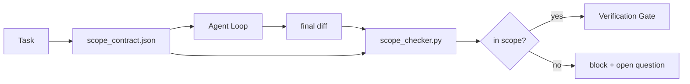

# 範圍契約與任務邊界

> 模型不知道工作在哪裡結束。範圍契約是一份逐任務的檔案，說明工作從哪開始、到哪結束，以及萬一外溢了要怎麼回捲。這份契約把「待在範圍內」從一個願望變成一項檢查。

**類型：** 建構
**程式語言：** Python (stdlib)
**先修單元：** 階段 14 · 32（最小工作台）、階段 14 · 33（規則即限制）
**時間：** 約 50 分鐘

## 學習目標

- 寫一份範圍契約，讓代理在任務開始時讀、查證器在任務結束時讀。
- 明訂允許的檔案、禁止的檔案、驗收準則、回捲計畫與核准邊界。
- 實作一個範圍檢查器，把 diff 拿去跟契約比對並標出違規。
- 讓範圍蔓延變得可見、自動化，而且可被審查。

## 問題所在

代理會蔓延。任務是「修好登入的臭蟲」。diff 動到了登入路由、電子郵件輔助函式、資料庫驅動、README，還有發布腳本。每一次動手在當下都有看似合理的理由。合起來，它就變成一個跟被審查過的那份不一樣的變更。

範圍蔓延是代理工作中最少被監控的失敗模式，因為代理每一步都在真誠地敘述自己。修法不是更嚴格的提示詞。修法是磁碟上一份說明承諾了什麼的契約，加一項把結果拿去跟承諾比對的檢查。

## 核心概念



### 範圍契約裡放什麼

| 欄位 | 用途 |
|-------|---------|
| `task_id` | 連到板上的那項任務 |
| `goal` | 一句審查者可以查證的話 |
| `allowed_files` | 代理可以寫入的 glob |
| `forbidden_files` | 代理連不小心都不能碰的 glob |
| `acceptance_criteria` | 證明完成的測試指令或斷言行 |
| `rollback_plan` | 需要停止時，維運者可以執行的一段說明 |
| `approvals_required` | 範圍外、需要人類明確簽核的行動 |

沒有 `forbidden_files` 的契約是不完整的。那片負空間是契約的一半。

### 用 glob，不要用生路徑

真實儲存庫的檔案會搬家。把契約釘在 glob 上（`app/**/*.py`、`tests/test_signup*.py`），這樣兩個工作階段之間的一次重構就不會讓契約失效。

### 回捲是範圍的一部分

把回捲方式列出來，會逼契約作者去想什麼可能出錯。一份你回捲不了的契約，就是一份不該被核准的契約。

### 範圍檢查就是 diff 檢查

代理寫出一份 diff。檢查器讀那份 diff、允許的 glob、禁止的 glob，以及一份跑過的驗收指令清單。每一項違規都是一則帶標籤的發現，查證閘門可以據此拒絕。

### 範圍的兩種高度：功能清單與任務契約

範圍契約界定的是一項任務。它界定不了整個專案。一個代理可以在登入修復那份契約裡待得完美無缺，然後下一輪就決定這個專案還需要一個設定頁、一個深色模式開關，以及把路由器重寫一遍。從來沒有人問過那份契約「這個專案的範圍是哪些工作」，只問過「這項任務的範圍是哪些檔案」。

第二種高度需要自己的原語：一份代理在工作階段開始時會讀的 `feature_list.json`。它就是專案待辦清單，做成一份機器可讀、有排序的檔案。代理只挑恰好一項 `status` 為 `todo` 的功能，把它的 `id` 寫進當前的範圍契約，而且禁止在同一個工作階段開始第二項功能。「一次一項功能」不再是提示詞裡那句代理可以自己合理化掉的話，而變成它從磁碟上讀到的一個值，以及閘門會強制執行的一項檢查。

```json
{
  "project": "knowledge-base",
  "active": "import-pdf",
  "features": [
    { "id": "import-pdf",   "status": "in_progress", "goal": "import a PDF into the library",        "done_when": "pytest tests/test_import.py && a sample PDF appears in the library view" },
    { "id": "full-text-search", "status": "todo",     "goal": "search document text and rank hits",   "done_when": "query returns ranked results with snippets" },
    { "id": "cite-answers", "status": "todo",         "goal": "answers carry source citations",        "done_when": "every answer renders at least one clickable citation" }
  ]
}
```

| 欄位 | 用途 |
|-------|---------|
| `active` | 當前工作階段唯一可以碰的那項功能；空的話就挑一個並設上去 |
| `features[].id` | 範圍契約的 `task_id` 所指向的穩定 slug |
| `features[].status` | `todo`、`in_progress`、`done`、`blocked`；同一時間只能有一個 `in_progress` |
| `features[].goal` | 一句審查者可以查證的話 |
| `features[].done_when` | 把 `in_progress` 翻成 `done` 的那條驗收準則 |

有兩條規則，讓這份清單是承重的而不是裝飾的。第一，「最多一個 `in_progress`」這條不變量本身就是一項啟動檢查（階段 14 · 33）：若清單上出現兩個，工作階段就拒絕開始，直到有人解決它。第二，功能清單是一個檔案，不是一則聊天訊息，因為聊天會捲出脈絡，而檔案會跨工作階段、跨代理地存活。交接（階段 14 · 40）會把完成功能的狀態寫回 `done`，好讓下一個工作階段打開時看到的是一塊準確的板子，而不是重新推導還剩什麼。

契約與清單以最小權限的方式組合，就是下面描述的那套合併：任務契約的 `allowed_files` 必須坐在當前功能所觸及的範圍之內，絕不能在它之外。

```figure
wb-scope-bounce
```

## 建構它

`code/main.py` 實作了：

- `scope_contract.json` 的 schema（JSON Schema 的子集，含 glob 陣列）。
- 一個 diff 解析器，把一份被動過的檔案清單加一份執行過的指令清單，變成一個 `RunSummary`。
- 一個 `scope_check`，對照契約回傳 `(violations, in_scope, off_scope)`。
- 兩趟示範執行：一趟待在範圍內，一趟蔓延出去。檢查器會用確切的檔案與理由把那次蔓延標出來。

跑它：

```
python3 code/main.py
```

輸出：那份契約、那兩趟執行、逐趟的裁決，以及一份存下來的 `scope_report.json`。

## 野地裡的生產模式

有位實務者在跑「specsmaxxing」（在叫代理之前先用 YAML 寫範圍契約），回報三週內在沒有換代理的情況下，掉進兔子洞的比率從 52% 降到 21%。做事的是那份契約，不是模型。有三種模式讓這份收穫留得住。

**違規預算，而不是二元失敗。** `agent-guardrails`（Claude Code、Cursor、Windsurf、Codex 透過 MCP 使用的那個開源合併閘門）替每項任務出貨一個 `violationBudget`：預算之內的輕微範圍滑動以警告呈現；只有超出預算，合併閘門才拒絕。搭配 `violationSeverity: "error" | "warning"`。預算就是「一個出得了貨的閘門」與「一個被討厭它的團隊關掉的閘門」之間的差別。

**依路徑家族做嚴重度不對稱。** 對 `docs/**` 的範圍外寫入通常是 `warn`；對 `scripts/**`、`migrations/**`、`config/prod/**` 的範圍外寫入永遠是 `block`。這種不對稱必須住在契約裡，不是執行環境裡，因為它是專案專屬、而且逐任務會變的。

**時間與網路預算，跟檔案預算擺在一起。** 一個 `time_budget_minutes` 欄位界定牆鐘時間；執行環境在超過它之後，未經重新核准就拒絕繼續。一份對主機名的 `network_egress` 允許清單，可以防止代理悄悄打一個不屬於這項任務的外部 API。這些也是範圍的維度；檔案 glob 是必要條件，不是充分條件。

**多契約的合併語意（最小權限）。** 當兩份範圍契約同時適用時（例如一份全專案契約加一份任務專屬契約），合併方式是：`allowed_files` 取**交集**（兩份契約都必須允許該路徑）、`forbidden_files` 取**聯集**（任一份都可以禁止）、`time_budget_minutes` 取最嚴的（最小值）、`approvals_required` 累加。`network_egress` 用 `None` 表示不強制、`[]` 表示全部拒絕、`[...]` 表示允許清單；合併時 `None` 讓位給另一邊、兩份清單取交集、全部拒絕仍維持全部拒絕。把這些寫進契約 schema 裡，讓合併是機械式且可審查的。

## 框架應用

生產模式：

- **Claude Code 的斜線指令。** 一個 `/scope` 指令寫出契約，並把它釘成工作階段脈絡。子代理在行動前先讀那份契約。
- **GitHub PR。** 把契約當成 JSON 檔推進 PR 內文，或當成簽入的產物。CI 對著合併 diff 跑範圍檢查器。
- **LangGraph 的 interrupt。** 範圍違規觸發一次中斷；處理器去問人：是契約需要長大，還是代理該退回來。

契約跟著任務走。任務關閉時，契約歸檔到 `outputs/scope/closed/` 底下。

## 產出交付

`outputs/skill-scope-contract.md` 會替一段任務描述產出一份範圍契約，以及一個懂 glob、在 CI 裡對每份代理 diff 執行的檢查器。

## 練習

1. 加一個 `network_egress` 欄位，列出允許的外部主機。拒絕碰到其他主機的執行。
2. 擴充檢查器，讓它對 `docs/**` 軟性失敗、對 `scripts/**` 硬性失敗。替這個不對稱辯護。
3. 讓契約用一套靜態規則（不用 LLM）從 `goal` 欄位推導出 `allowed_files`。第一個邊界情況上會出什麼錯？
4. 加一個 `time_budget_minutes`，並在牆鐘超過它時拒絕繼續。
5. 拿兩份契約對同一份 diff 跑。當兩者都適用時，正確的合併語意是什麼？

## 關鍵術語

| 術語 | 大家怎麼說 | 實際是什麼意思 |
|------|----------------|------------------------|
| 範圍契約 | 「任務簡報」 | 逐任務的 JSON，列出允許／禁止的檔案、驗收、回捲 |
| 範圍蔓延 | 「它還動到了……」 | 同一項任務中，契約之外的檔案也被改了 |
| 回捲計畫 | 「我們可以還原」 | 用來停止的那份一段式維運手冊 |
| 核准邊界 | 「需要簽核」 | 契約中列為需要人類明確核准的行動 |
| Diff 檢查 | 「路徑稽核」 | 把被動過的檔案拿去跟契約 glob 比對 |

## 延伸閱讀

- [LangGraph human-in-the-loop interrupts](https://langchain-ai.github.io/langgraph/concepts/human_in_the_loop/)
- [OpenAI Agents SDK tool approval policies](https://platform.openai.com/docs/guides/agents-sdk)
- [logi-cmd/agent-guardrails — merge gates and scope validation](https://github.com/logi-cmd/agent-guardrails) —— 違規預算、嚴重度層級
- [Dev|Journal, Preventing AI Agent Configuration Drift with Agent Contract Testing](https://earezki.com/ai-news/2026-05-05-i-built-a-tiny-ci-tool-to-keep-ai-agent-configs-from-drifting-in-my-repo/) —— 不靠外部相依的 `--strict` 模式
- [Agentic Coding Is Not a Trap (production logs)](https://dev.to/jtorchia/agentic-coding-is-not-a-trap-i-answered-the-viral-hn-post-with-my-own-production-logs-33d9) —— specsmaxxing 的收據：52% → 21%
- [OpenCode permission globs](https://opencode.ai/docs/agents/) —— 逐權限的細緻範圍
- [Knostic, AI Coding Agent Security: Threat Models and Protection Strategies](https://www.knostic.ai/blog/ai-coding-agent-security) —— 把範圍當成最小權限的一部分
- [Augment Code, AI Spec Template](https://www.augmentcode.com/guides/ai-spec-template) —— 三層邊界系統（must／ask／never）
- 階段 14 · 27 —— 與範圍鎖搭配的提示詞注入防禦
- 階段 14 · 33 —— 這份契約逐任務特化的那套規則集
- 階段 14 · 38 —— 這個檢查器回報進去的那道查證閘門
