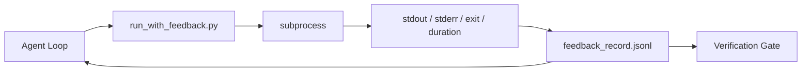

# 執行期回饋迴圈

> 看不到真實指令輸出的代理只能用猜的。回饋執行器把 stdout、stderr、離開碼與時間捕捉成一筆結構化紀錄，讓下一輪讀得到。然後代理就是在對事實做反應，而不是在對它自己對事實的預測做反應。

**類型：** 建構
**程式語言：** Python (stdlib)
**先修單元：** 階段 14 · 32（最小工作台）、階段 14 · 35（初始化腳本）
**時間：** 約 50 分鐘

## 學習目標

- 分辨執行期回饋與可觀測性遙測。
- 做一個回饋執行器，把 shell 指令包起來並把結構化紀錄持久化。
- 決定性地截斷大量輸出，好讓迴圈待在詞元預算之內。
- 在回饋缺席時拒絕讓迴圈往前走。

## 問題所在

代理說「現在跑測試」。下一則訊息說「所有測試通過」。現實是根本沒有測試跑過。代理想像了那份輸出，或者它跑了指令卻沒讀結果，或者它讀了結果卻無聲地把失敗那行截掉了。

回饋執行器消除那個縫隙。每個指令都走執行器。每筆紀錄都帶著指令、被捕捉的 stdout 與 stderr、離開碼、牆鐘時長，以及一行代理筆記。代理在下一輪讀那筆紀錄。查證閘門在任務結束時讀所有紀錄。

## 核心概念



### 一筆回饋紀錄裡放什麼

| 欄位 | 為什麼要緊 |
|-------|----------------|
| `command` | 精確的 argv，沒有 shell 展開的驚喜 |
| `stdout_tail` | 最後 N 行，決定性截斷 |
| `stderr_tail` | 最後 N 行，跟 stdout 分開 |
| `exit_code` | 那個沒有歧義的成功訊號 |
| `duration_ms` | 讓緩慢的探測與失控的行程浮現 |
| `started_at` | 供重播用的時間戳 |
| `agent_note` | 代理寫下的一行「我原本預期什麼」 |

### 截斷是決定性的

一份 50 MB 的日誌會摧毀這個迴圈。執行器截頭截尾，中間放一個 `...truncated N lines...` 標記，而且是決定性的，同樣的輸出永遠產出同樣的紀錄。不做取樣；代理需要看到的部分（最後的錯誤、最後的摘要）住在尾巴。

### 回饋相對於遙測

遙測（階段 14 · 23，OTel GenAI 慣例）是給人類維運者跨時間回顧執行用的。回饋是給這一趟執行的下一輪用的。它們共用欄位，但住在不同檔案裡，保留政策也不同。

### 沒有回饋就拒絕前進

若執行器在捕捉到離開碼之前就出錯，那筆紀錄會帶 `exit_code: null` 與 `error: <reason>`。代理迴圈必須拒絕在 `null` 離開碼上宣稱成功。沒有離開碼，就沒有進展。

```figure
wb-feedback-loop
```

## 建構它

`code/main.py` 實作了：

- `run_with_feedback(command, agent_note)`，它包住 `subprocess.run`，捕捉 stdout/stderr/離開碼/時長、決定性截斷，並附加到 `feedback_record.jsonl`。
- 一個小小的載入器，把 JSONL 串流成一個 Python list。
- 一個示範，跑三個指令（成功、失敗、緩慢），並印出每個指令的最後一筆紀錄。

跑它：

```
python3 code/main.py
```

輸出：三筆回饋紀錄被附加到 `feedback_record.jsonl`，每個的最後一筆會就地印出。跨多次重跑去 tail 那個檔案，看迴圈怎麼累積起來。

## 野地裡的生產模式

有三種模式把這個執行器硬化到能出貨。

**在寫入時遮蔽，不要在讀取時遮蔽。** 任何碰到 stdout 或 stderr 的紀錄都可能外洩密鑰。執行器在附加 JSONL 之前先跑一趟遮蔽：剝掉符合 `^Bearer `、`password=`、`api[_-]?key=`、`AKIA[0-9A-Z]{16}`（AWS）、`xox[baprs]-`（Slack）的行。在讀取時才遮蔽是一把會走火的槍；攻擊者搆得到的是磁碟上那個檔案。每季拿生產執行環境上觀察到的密鑰格式去稽核一次遮蔽樣式。

**要輪替政策，不要單一檔案。** 把 `feedback_record.jsonl` 每個檔案限制在 1 MB；溢出時輪替成 `.1`、`.2`，丟掉 `.5`。代理迴圈只讀當前那個檔案，所以執行期成本是有界的。CI 的產物儲存則收下整套輪替後的檔案。沒有輪替，這個檔案就會變成每次載入呼叫的瓶頸。

**用父指令 id 串起重試鏈。** 每筆紀錄都有 `command_id`；重試則帶 `parent_command_id` 指向上一次嘗試。審查者的「失敗嘗試」清單（階段 14 · 40）與查證閘門的稽核都會沿著這條鏈走。沒有這個連結，重試看起來就像互不相干的成功，而稽核會把失敗歷史藏起來。

## 框架應用

生產模式：

- **Claude Code 的 Bash 工具。** 這項工具本來就會捕捉 stdout、stderr、離開碼與時長。本課的執行器就是它在任何代理產品上、與框架無關的對應物。
- **LangGraph 的節點。** 把任何 shell 節點包進執行器，好讓紀錄持久化在圖狀態之外。
- **CI 日誌。** 把 JSONL 導進你的 CI 產物儲存；審查者不必重跑工作階段就能重播任何指令。

這個執行器是一層薄薄的包裝，能撐過每一次框架遷移，因為紀錄的形狀由它擁有。

## 產出交付

`outputs/skill-feedback-runner.md` 會產出一份專案專屬的 `run_with_feedback.py`，帶正確的截斷預算、一個接進工作台的 JSONL 寫入器，以及一個代理每輪都會讀的載入器。

## 練習

1. 替每筆紀錄加一個 `cwd` 欄位，好讓同一個指令從不同目錄執行時可以分辨。
2. 加一個 `redaction` 步驟，剝掉符合 `^Bearer ` 或 `password=` 的行。在一筆固定樣本紀錄上測試。
3. 把 `feedback_record.jsonl` 的總大小限制在 1 MB，超過就輪替到 `.1`、`.2` 檔。替你的輪替政策辯護。
4. 加一個 `parent_command_id`，讓重試鏈可見：是哪個指令產出了下一個指令所消費的輸入。
5. 把 JSONL 導進一個很小的 TUI，把最近一次非零離開碼標出來。列出這個 TUI 要在審查中有用，必須顯示的八項關鍵功能。

## 關鍵術語

| 術語 | 大家怎麼說 | 實際是什麼意思 |
|------|----------------|------------------------|
| 回饋紀錄 | 「執行日誌」 | 帶指令、輸出、離開碼、時長的結構化 JSONL 條目 |
| 尾端截斷 | 「把日誌剪掉」 | 決定性的頭尾捕捉，好讓紀錄塞得進詞元預算 |
| 遇 null 就拒絕 | 「資料缺失就擋下」 | `exit_code` 為 null 時迴圈絕不能往前走 |
| 代理筆記 | 「預期標記」 | 代理在讀結果之前寫下的那一行預測 |
| 遙測拆分 | 「兩個日誌檔」 | 回饋給下一輪，遙測給維運者 |

## 延伸閱讀

- [OpenTelemetry GenAI semantic conventions](https://opentelemetry.io/docs/specs/semconv/gen-ai/)
- [Anthropic, Effective harnesses for long-running agents](https://www.anthropic.com/engineering/effective-harnesses-for-long-running-agents)
- [Guardrails AI x MLflow — deterministic safety, PII, quality validators](https://guardrailsai.com/blog/guardrails-mlflow) —— 把遮蔽樣式當成回歸測試
- [Aport.io, Best AI Agent Guardrails 2026: Pre-Action Authorization Compared](https://aport.io/blog/best-ai-agent-guardrails-2026-pre-action-authorization-compared/) —— 工具前／後的捕捉
- [Andrii Furmanets, AI Agents in 2026: Practical Architecture for Tools, Memory, Evals, Guardrails](https://andriifurmanets.com/blogs/ai-agents-2026-practical-architecture-tools-memory-evals-guardrails) —— 可觀測性的那些表面
- 階段 14 · 23 —— 遙測那一側的 OTel GenAI 慣例
- 階段 14 · 24 —— 代理可觀測性平台（Langfuse、Phoenix、Opik）
- 階段 14 · 33 —— 那條要求「先有回饋才能宣告完成」的規則
- 階段 14 · 38 —— 讀那份 JSONL 的查證閘門
